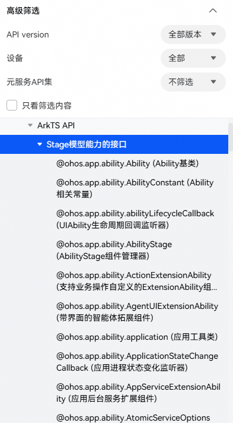
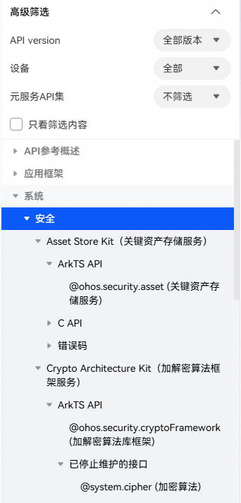

# 开发说明

更新时间：2026-05-20 08:28:51

来源：https://developer.huawei.com/consumer/cn/doc/harmonyos-references/development-intro-api

API参考主要用于开发者查阅应用开发相关的各类API说明。为了方便开发者使用API文档，对文档描述中的常用字段进行说明。

#### 版本说明

API参考采用两种方式标记组件或接口开始支持的版本号：

 - 对于新增组件或接口，会在章节开头进行说明，如：本模块首批接口从API version 7开始支持。
 - 对于某个已有组件或接口的新增特性，会在对应特性后进行标注，如：“uid8+”表示从API Version 8开始支持属性uid。

在页面左侧的目录上，找到“高级筛选 > API version”，下拉框中选择某个API版本（SDK版本），即可查看所选SDK版本支持的接口。

如下图所示，API版本号小于等于指定版本的API节点正常显示，否则将被置灰。节点包括左侧目录节点及右侧页内节点。

建议开发者同步勾选“只看筛选内容”，查阅当前使用的SDK支持的API接口。

#### 支持设备说明

不同设备类型之间，对开放能力的支持情况有一定差异，开发者可根据需要，筛选对应设备支持的API接口。

在页面左侧的目录上，找到“高级筛选 > 设备”，下拉框中选择“某个设备类型”，即可查看对应设备类型支持的接口。

如下图所示，支持在该设备类型上使用的API节点正常显示，否则将被置灰。节点包括左侧目录节点及右侧页内节点。

建议开发者同步勾选“只看筛选内容”，查阅对应设备支持的API接口。

#### 系统能力说明

系统能力（SystemCapability，简称SysCap），指操作系统中每一个相对独立的特性。不同的设备对应不同的系统能力集，每个系统能力对应多个接口。开发者可根据系统能力来判断是否可以使用某接口。具体可参考[系统能力SystemCapability使用指南](https://developer.huawei.com/consumer/cn/doc/harmonyos-references/syscap)。

文档在每一个接口描述中说明了接口的系统能力，如：**系统能力**：SystemCapability.xxx.xxx

 - 系统提供了canIUse接口，可[使用canIUse判断SysCap是否可调用](https://developer.huawei.com/consumer/cn/doc/harmonyos-references/syscap#使用caniuse判断syscap是否可调用)；
 - 相同的系统能力，在不同的设备下，也会有能力的差异。开发者可以进行[多设备应用开发场景下的适配开发](https://developer.huawei.com/consumer/cn/doc/harmonyos-references/syscap#多设备应用开发场景下的适配开发)。

#### 接口使用说明

HarmonyOS SDK提供的开放能力（接口）需要在导入声明后使用。SDK对同一个Kit下的接口模块进行了封装，开发者在示例代码中可通过导入Kit的方式来使用Kit所包含的接口能力。其中，Kit封装的接口模块可查看SDK目录下Kit子目录中各Kit的定义。

导入Kit的方式请参见[导入-导入HarmonyOS SDK的开放能力](https://developer.huawei.com/consumer/cn/doc/harmonyos-guides/introduction-to-arkts#导入)。

#### 元服务能力说明

[元服务](https://developer.huawei.com/consumer/cn/doc/atomic-guides/atomic-service)是HarmonyOS提供的一种轻量应用程序形态，具备服务直达、跨设备等特征。

元服务可独立上架、分发、运行，独立实现业务闭环，可大幅提升信息与服务的获取效率。

元服务基于HarmonyOS SDK（只能使用“元服务API集”）开发，支持运行在HarmonyOS设备上，供用户在合适的场景、合适的设备上便捷使用。

 - 支持在元服务中使用的接口，将会添加“**元服务API**”的标记，如：从API version 12开始，该接口支持在元服务中使用。
 - 如果接口不支持在元服务中使用，则不做特殊说明。

#### 服务卡片说明

将应用/元服务的重要信息或操作前置到[服务卡片](https://developer.huawei.com/consumer/cn/doc/harmonyos-guides/formkit-overview)（简称“卡片”），可达到服务直达、减少跳转层级的体验效果。

 - 对于支持在ArkTS卡片UI界面中使用的接口，将会添加“**卡片能力**”的标记，如：从API version 12开始，该接口支持在ArkTS卡片UI界面中使用。
 - 如果接口不支持在ArkTS卡片UI界面中使用，则不做特殊说明。

#### 权限说明

默认情况下，应用只能访问有限的系统资源。但某些情况下，应用为了扩展功能的诉求，需要访问额外的系统或其他应用的数据（包括用户个人数据）、功能。具体可参考[访问控制开发概述](https://developer.huawei.com/consumer/cn/doc/harmonyos-guides/app-permission-mgmt-overview)。

当调用接口访问这些资源时，需要申请对应的权限。申请方式可参考[访问控制开发指导](https://developer.huawei.com/consumer/cn/doc/harmonyos-guides/determine-application-mode)。

 - 如果应用需要具备某个权限才能调用该接口，会在具体的接口描述中说明：**需要权限**：ohos.permission.xxxx
 - 如果应用不需要任何权限即可调用该接口，则不做特殊说明。

#### 错误码使用说明

ArkTS API在使用过程中，可能会遇到错误。

在可能出现错误的各个接口处，开发者可参考文档中提供的**错误码**部分，了解对应接口可能出现的错误码ID及错误信息，并根据需要进行处理。

当前ArkTS API分为异步接口和同步接口，以下为对应的错误处理方式：

 - 针对同步接口，错误统一通过异常形式抛出，开发者需要通过try-catch的方式处理可能抛出的异常。
 - 针对异步接口，错误可能包括异常和rejection，开发者若使用await/async方式，需要通过try-catch的方式处理可能抛出的异常和rejection。
 - 针对异步接口，错误可能包括异常和rejection，开发者若使用Promise方式，需要通过try-catch的方式处理同步抛出的异常（一般为401异常），并通过Promise的catch()方法或then()方法中的onrejected回调函数处理rejection。
 - 针对callback形式的异步接口（不推荐使用），错误可能包括异常和回调返回的错误，开发者若使用callback方式，需要通过try-catch的方式处理同步抛出的异常（一般为401异常），并处理通过回调参数呈现的错误（即BusinessError对象）。

#### 应用模型说明

随着系统的演进发展，先后提供了两种应用模型，FA模型和Stage模型。

 - 如果某个模块的接口仅支持其中一种模型，会在文档开头说明：本模块接口仅可在FA模型/Stage模型下使用。
 - 如果某个接口仅支持其中一种模型，会在具体的接口描述中说明：此接口仅可在FA模型/Stage模型下使用。
 - 如两种框架模型均支持，则不做特殊说明。

#### 废弃接口说明

废弃接口会使用上标“deprecated”标注，表示该接口不再推荐使用。

废弃接口均会标注废弃起始版本，HarmonyOS未来可能移除已废弃接口，但在移除前会提前通知开发者。

 - 对于已标注替代接口的情况，建议开发者查阅新接口的文档，尽早完成适配。
 - 对于没有替代接口的情况，建议开发者参考废弃说明和变更说明（changelog），调整实现方式。
