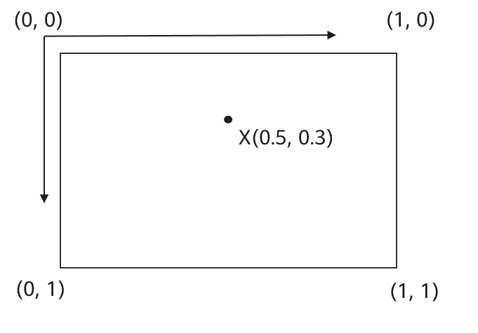

# Interface (Marker)

更新时间：2026-05-18 03:44:20

来源：https://developer.huawei.com/consumer/cn/doc/harmonyos-references/map-map-marker
**支持设备：** Phone | PC/2in1 | Tablet | Wearable

#### 导入模块

**支持设备：** Phone | PC/2in1 | Tablet | Wearable

```text
import { map, mapCommon } from '@kit.MapKit';
```
 
  

#### Marker

**支持设备：** Phone | PC/2in1 | Tablet | Wearable

标记，继承[BaseOverlay](https://developer.huawei.com/consumer/cn/doc/harmonyos-references/map-map-baseoverlay)。在调用map.[MapComponentController](https://developer.huawei.com/consumer/cn/doc/harmonyos-references/map-map-mapcomponentcontroller)类的[addMarker](https://developer.huawei.com/consumer/cn/doc/harmonyos-references/map-map-mapcomponentcontroller#addmarker)方法时会返回该类型的实例。
 
**模型约束：** 此接口仅可在Stage模型下使用。
 
**元服务API：** 从版本4.1.0(11)开始，该接口支持在元服务中使用。
 
**系统能力：** SystemCapability.Map.Core
 
**起始版本：** 4.1.0(11)
 
**示例：**
 
```text
let markerOptions: mapCommon.MarkerOptions = {
  position: {
    latitude: 39.9,
    longitude: 116.4
  }
};
let marker: map.Marker = await this.mapController.addMarker(markerOptions);
```
 
  

#### getTitle

**支持设备：** Phone | PC/2in1 | Tablet | Wearable

getTitle(): string
 
返回信息窗的标题。
 
**模型约束：** 此接口仅可在Stage模型下使用。
 
**元服务API：** 从版本4.1.0(11)开始，该接口支持在元服务中使用。
 
**系统能力：** SystemCapability.Map.Core
 
**起始版本：** 4.1.0(11)
 
**返回值：**
  
| 类型 | 说明 |
| --- | --- |
| string | 信息窗的标题。 |
 
 
**示例：**
 
```text
let title: string = marker.getTitle();
```
 
  

#### getSnippet

**支持设备：** Phone | PC/2in1 | Tablet | Wearable

getSnippet(): string
 
返回信息窗的子标题。
 
**模型约束：** 此接口仅可在Stage模型下使用。
 
**元服务API：** 从版本4.1.0(11)开始，该接口支持在元服务中使用。
 
**系统能力：** SystemCapability.Map.Core
 
**起始版本：** 4.1.0(11)
 
**返回值：**
  
| 类型 | 说明 |
| --- | --- |
| string | 信息窗的子标题。 |
 
 
**示例：**
 
```text
let snippet: string = marker.getSnippet();
```
 
  

#### getAlpha

**支持设备：** Phone | PC/2in1 | Tablet | Wearable

getAlpha(): number
 
获取标记的透明度。
 
**模型约束：** 此接口仅可在Stage模型下使用。
 
**元服务API：** 从版本4.1.0(11)开始，该接口支持在元服务中使用。
 
**系统能力：** SystemCapability.Map.Core
 
**起始版本：** 4.1.0(11)
 
**返回值：**
  
| 类型 | 说明 |
| --- | --- |
| number | 标记的透明度，取值范围：[0, 1]。 |
 
 
**示例：**
 
```text
let alpha: number = marker.getAlpha();
```
 
  

#### getPosition

**支持设备：** Phone | PC/2in1 | Tablet | Wearable

getPosition(): mapCommon.LatLng
 
获取标记的位置。
 
**模型约束：** 此接口仅可在Stage模型下使用。
 
**元服务API：** 从版本4.1.0(11)开始，该接口支持在元服务中使用。
 
**系统能力：** SystemCapability.Map.Core
 
**起始版本：** 4.1.0(11)
 
**返回值：**
  
| 类型 | 说明 |
| --- | --- |
| mapCommon.LatLng | 标记的位置。 |
 
 
**示例：**
 
```text
let position: mapCommon.LatLng = marker.getPosition();
```
 
  

#### getRotation

**支持设备：** Phone | PC/2in1 | Tablet | Wearable

getRotation(): number
 
获取标记的旋转角度。
 
**模型约束：** 此接口仅可在Stage模型下使用。
 
**元服务API：** 从版本4.1.0(11)开始，该接口支持在元服务中使用。
 
**系统能力：** SystemCapability.Map.Core
 
**起始版本：** 4.1.0(11)
 
**返回值：**
  
| 类型 | 说明 |
| --- | --- |
| number | 标记的旋转角度，单位：度。 |
 
 
**示例：**
 
```text
let rotation: number = marker.getRotation();
```
 
  

#### isClickable

**支持设备：** Phone | PC/2in1 | Tablet | Wearable

isClickable(): boolean
 
获取标记是否可以点击。
 
**模型约束：** 此接口仅可在Stage模型下使用。
 
**元服务API：** 从版本4.1.0(11)开始，该接口支持在元服务中使用。
 
**系统能力：** SystemCapability.Map.Core
 
**起始版本：** 4.1.0(11)
 
**返回值：**
  
| 类型 | 说明 |
| --- | --- |
| boolean | 标记是否可以点击。 - true：可以 - false：不可以 |
 
 
**示例：**
 
```text
let isClickable: boolean = marker.isClickable();
```
 
  

#### isDraggable

**支持设备：** Phone | PC/2in1 | Tablet | Wearable

isDraggable(): boolean
 
获取标记是否可以通过长按来拖拽。
 
**模型约束：** 此接口仅可在Stage模型下使用。
 
**元服务API：** 从版本4.1.0(11)开始，该接口支持在元服务中使用。
 
**系统能力：** SystemCapability.Map.Core
 
**起始版本：** 4.1.0(11)
 
**返回值：**
  
| 类型 | 说明 |
| --- | --- |
| boolean | 标记是否可以通过长按来拖拽。 - true：可以 - false：不可以 |
 
 
**示例：**
 
```text
let isDraggable: boolean = marker.isDraggable();
```
 
  

#### isFlat

**支持设备：** Phone | PC/2in1 | Tablet | Wearable

isFlat(): boolean
 
获取标记是否平贴地图。
 
**模型约束：** 此接口仅可在Stage模型下使用。
 
**元服务API：** 从版本4.1.0(11)开始，该接口支持在元服务中使用。
 
**系统能力：** SystemCapability.Map.Core
 
**起始版本：** 4.1.0(11)
 
**返回值：**
  
| 类型 | 说明 |
| --- | --- |
| boolean | 标记是否平贴地图。 - true：平贴地图 - false：面对相机 |
 
 
**示例：**
 
```text
let isFlat: boolean = marker.isFlat();
```
 
  

#### setAlpha

**支持设备：** Phone | PC/2in1 | Tablet | Wearable

setAlpha(alpha: number): void
 
设置标记的透明度属性。
 
**模型约束：** 此接口仅可在Stage模型下使用。
 
**元服务API：** 从版本4.1.0(11)开始，该接口支持在元服务中使用。
 
**系统能力：** SystemCapability.Map.Core
 
**起始版本：** 4.1.0(11)
 
**参数：**
  
| 参数名 | 类型 | 必填 | 说明 |
| --- | --- | --- | --- |
| alpha | number | 是 | 标记的透明度，取值范围：[0, 1]，异常值不处理。 0：完全透明 1：完全不透明 |
 
 
**示例：**
 
```text
marker.setAlpha(0.5);
```
 
  

#### setClickable

**支持设备：** Phone | PC/2in1 | Tablet | Wearable

setClickable(clickable: boolean): void
 
设置标记是否可以点击。
 
**模型约束：** 此接口仅可在Stage模型下使用。
 
**元服务API：** 从版本4.1.0(11)开始，该接口支持在元服务中使用。
 
**系统能力：** SystemCapability.Map.Core
 
**起始版本：** 4.1.0(11)
 
**参数：**
  
| 参数名 | 类型 | 必填 | 说明 |
| --- | --- | --- | --- |
| clickable | boolean | 是 | 设置标记是否可以点击，异常值不处理。 - true：可以 - false：不可以 |
 
 
**示例：**
 
```text
marker.setClickable(true);
```
 
  

#### setDraggable

**支持设备：** Phone | PC/2in1 | Tablet | Wearable

setDraggable(draggable: boolean): void
 
设置标记是否可以长按拖拽。
 
**模型约束：** 此接口仅可在Stage模型下使用。
 
**元服务API：** 从版本4.1.0(11)开始，该接口支持在元服务中使用。
 
**系统能力：** SystemCapability.Map.Core
 
**起始版本：** 4.1.0(11)
 
**参数：**
  
| 参数名 | 类型 | 必填 | 说明 |
| --- | --- | --- | --- |
| draggable | boolean | 是 | 是否可以长按拖拽，异常值不处理。 - true：可以 - false：不可以 |
 
 
**示例：**
 
```text
marker.setDraggable(true);
```
 
  

#### setFlat

**支持设备：** Phone | PC/2in1 | Tablet | Wearable

setFlat(flat: boolean): void
 
设置标记是否平贴地图。如果标记平贴地图，则在相机旋转和倾斜时，标记仍将停留在地图上，它将保持与照相机缩放时相同的大小。 如果标记面对相机，它将始终面向相机绘制，并随相机旋转和倾斜。
 
**模型约束：** 此接口仅可在Stage模型下使用。
 
**元服务API：** 从版本4.1.0(11)开始，该接口支持在元服务中使用。
 
**系统能力：** SystemCapability.Map.Core
 
**起始版本：** 4.1.0(11)
 
**参数：**
  
| 参数名 | 类型 | 必填 | 说明 |
| --- | --- | --- | --- |
| flat | boolean | 是 | 是否平贴地图，异常值不处理。 - true：平贴地图 - false：面对相机 |
 
 
**示例：**
 
```text
marker.setFlat(true);
```
 
  

#### setIcon

**支持设备：** Phone | PC/2in1 | Tablet | Wearable

setIcon(icon: string | image.PixelMap | Resource): Promise&lt;void&gt;
 
设置标记的图标。使用Promise异步回调。
 
**模型约束：** 此接口仅可在Stage模型下使用。
 
**元服务API：** 从版本4.1.0(11)开始，该接口支持在元服务中使用。
 
**系统能力：** SystemCapability.Map.Core
 
**起始版本：** 4.1.0(11)
 
**参数：**
  
| 参数名 | 类型 | 必填 | 说明 |
| --- | --- | --- | --- |
| icon | string \| image.PixelMap \| Resource | 是 | 标记的图标，异常值不处理。 - 图片格式支持jpg、jpeg、png、gif、webp、svg。 - string类型入参支持两种格式： - 资源相对路径格式：图标存放在resources/rawfile，icon参数传入rawfile文件夹下的相对路径。 - toDataURL格式（如data:image/png;base64,&lt;图片的Base64字节编码值&gt;） 说明： 从5.0.0(12)版本开始，icon属性支持Resource和image.PixelMap类型。 |
 
 
**返回值：**
  
| 类型 | 说明 |
| --- | --- |
| Promise&lt;void&gt; | Promise对象。无返回结果的Promise对象。 |
 
 
**示例：**
 
```text
// 图标需存放在resources/rawfile目录下
await marker.setIcon('icon/test.png');
```
 
  

#### setMarkerAnchor

**支持设备：** Phone | PC/2in1 | Tablet | Wearable

setMarkerAnchor(anchorU: number, anchorV: number): void
 
设置标记的锚点位置。锚点是标记图标接触地图平面的点，图标的左顶点为（0, 0）点，右顶点为（1, 0）点，左底点为（0, 1）点，右底点为（1, 1）点。例如，在标记X（0.5, 0.3）处的锚点坐标如下：
 



 
**模型约束：** 此接口仅可在Stage模型下使用。
 
**元服务API：** 从版本4.1.0(11)开始，该接口支持在元服务中使用。
 
**系统能力：** SystemCapability.Map.Core
 
**起始版本：** 4.1.0(11)
 
**参数：**
  
| 参数名 | 类型 | 必填 | 说明 |
| --- | --- | --- | --- |
| anchorU | number | 是 | 锚点的水平坐标，以图像宽度的比例，取值范围：[0, 1]，异常值不处理。 |
| anchorV | number | 是 | 锚点的垂直坐标，以图像高度的比例，取值范围：[0, 1]，异常值不处理。 |
 
 
**示例：**
 
```text
marker.setMarkerAnchor(1.0, 1.0);
```
 
  

#### setPosition

**支持设备：** Phone | PC/2in1 | Tablet | Wearable

setPosition(latLng: mapCommon.LatLng): void
 
设置标记的位置坐标。
 
**模型约束：** 此接口仅可在Stage模型下使用。
 
**元服务API：** 从版本4.1.0(11)开始，该接口支持在元服务中使用。
 
**系统能力：** SystemCapability.Map.Core
 
**起始版本：** 4.1.0(11)
 
**参数：**
  
| 参数名 | 类型 | 必填 | 说明 |
| --- | --- | --- | --- |
| latLng | mapCommon.LatLng | 是 | 标记的位置坐标，异常值不处理。 |
 
 
**示例：**
 
```text
let position: mapCommon.LatLng = {
  latitude: 39.9,
  longitude: 116.4
};
marker.setPosition(position);
```
 
  

#### setRotation

**支持设备：** Phone | PC/2in1 | Tablet | Wearable

setRotation(rotation: number): void
 
设置标记的旋转角度，即标记围绕标记锚点顺时针旋转的角度，旋转轴垂直于标记。默认旋转角度为0，默认位置为北对齐。
 
**模型约束：** 此接口仅可在Stage模型下使用。
 
**元服务API：** 从版本4.1.0(11)开始，该接口支持在元服务中使用。
 
**系统能力：** SystemCapability.Map.Core
 
**起始版本：** 4.1.0(11)
 
**参数：**
  
| 参数名 | 类型 | 必填 | 说明 |
| --- | --- | --- | --- |
| rotation | number | 是 | 标记的旋转角度，单位：度。 以正北方向为0度、顺时针方向为正的角度，取值范围：[0, 360)。超出取值范围的值会换算成取值范围内的值，比如361会被换算成1，-1换算为359，null和undefined不处理。 |
 
 
**示例：**
 
```text
marker.setRotation(30);
```
 
  

#### setTitle

**支持设备：** Phone | PC/2in1 | Tablet | Wearable

setTitle(title: string): void
 
设置信息窗的标题。
 
**模型约束：** 此接口仅可在Stage模型下使用。
 
**元服务API：** 从版本4.1.0(11)开始，该接口支持在元服务中使用。
 
**系统能力：** SystemCapability.Map.Core
 
**起始版本：** 4.1.0(11)
 
**参数：**
  
| 参数名 | 类型 | 必填 | 说明 |
| --- | --- | --- | --- |
| title | string | 是 | 信息窗口的标题，信息窗的最大宽度为136vp，超长字串超出部分用省略号“…”表示，异常值不处理。 |
 
 
**示例：**
 
```text
marker.setTitle("title");
```
 
  

#### setSnippet

**支持设备：** Phone | PC/2in1 | Tablet | Wearable

setSnippet(snippet: string): void
 
设置信息窗口的子标题。
 
**模型约束：** 此接口仅可在Stage模型下使用。
 
**元服务API：** 从版本4.1.0(11)开始，该接口支持在元服务中使用。
 
**系统能力：** SystemCapability.Map.Core
 
**起始版本：** 4.1.0(11)
 
**参数：**
  
| 参数名 | 类型 | 必填 | 说明 |
| --- | --- | --- | --- |
| snippet | string | 是 | 信息窗口的子标题，信息窗的最大宽度为136vp，超长字串超出部分用省略号“…”表示，异常值不处理。 |
 
 
**示例：**
 
```text
marker.setSnippet("su");
```
 
  

#### setInfoWindowAnchor

**支持设备：** Phone | PC/2in1 | Tablet | Wearable

setInfoWindowAnchor(anchorU: number, anchorV: number): void
 
设置信息窗的锚点位置。
 
**模型约束：** 此接口仅可在Stage模型下使用。
 
**元服务API：** 从版本4.1.0(11)开始，该接口支持在元服务中使用。
 
**系统能力：** SystemCapability.Map.Core
 
**起始版本：** 4.1.0(11)
 
**参数：**
  
| 参数名 | 类型 | 必填 | 说明 |
| --- | --- | --- | --- |
| anchorU | number | 是 | 锚点在水平方向上的位置，取值范围：[0, 1]，异常值不处理。 |
| anchorV | number | 是 | 锚点在垂直方向上的位置，取值范围：[0, 1]，异常值不处理。 |
 
 
**示例：**
 
```text
marker.setInfoWindowAnchor(0.5, 0.5);
```
 
  

#### setInfoWindowVisible

**支持设备：** Phone | PC/2in1 | Tablet | Wearable

setInfoWindowVisible(visible: boolean): void
 
设置信息窗是否可见。
 
**模型约束：** 此接口仅可在Stage模型下使用。
 
**元服务API：** 从版本4.1.0(11)开始，该接口支持在元服务中使用。
 
**系统能力：** SystemCapability.Map.Core
 
**起始版本：** 4.1.0(11)
 
**参数：**
  
| 参数名 | 类型 | 必填 | 说明 |
| --- | --- | --- | --- |
| visible | boolean | 是 | 设置信息窗是否可见，异常值不处理。 - true：可见 - false：不可见 |
 
 
**示例：**
 
```text
marker.setInfoWindowVisible(true);
```
 
  

#### isInfoWindowVisible

**支持设备：** Phone | PC/2in1 | Tablet | Wearable

isInfoWindowVisible(): boolean
 
返回信息窗是否可见。
 
**模型约束：** 此接口仅可在Stage模型下使用。
 
**元服务API：** 从版本4.1.0(11)开始，该接口支持在元服务中使用。
 
**系统能力：** SystemCapability.Map.Core
 
**起始版本：** 4.1.0(11)
 
**返回值：**
  
| 类型 | 说明 |
| --- | --- |
| boolean | 信息窗口是否可见。 - true：可见 - false：不可见 |
 
 
**示例：**
 
```text
let visible: boolean = marker.isInfoWindowVisible();
```
 
  

#### setAnimation

**支持设备：** Phone | PC/2in1 | Tablet | Wearable

setAnimation(animation: Animation): void
 
设置标记的动画，不支持[FontSizeAnimation](https://developer.huawei.com/consumer/cn/doc/harmonyos-references/map-map-fontsizeanimation)。
 
**模型约束：** 此接口仅可在Stage模型下使用。
 
**元服务API：** 从版本4.1.0(11)开始，该接口支持在元服务中使用。
 
**系统能力：** SystemCapability.Map.Core
 
**起始版本：** 4.1.0(11)
 
**参数：**
  
| 参数名 | 类型 | 必填 | 说明 |
| --- | --- | --- | --- |
| animation | Animation | 是 | 动画，异常值不处理。 |
 
 
**示例：**
 
```text
let animation: map.AlphaAnimation = new map.AlphaAnimation(0.2, 1);
animation.setDuration(3000);
let callbackStart = () => {
  console.info("animationStart", `callback`);
};
let callbackEnd = () => {
  console.info("animationEnd", `callback`);
};
animation.on("animationStart", callbackStart);
animation.on("animationEnd", callbackEnd);
animation.setFillMode(map.AnimationFillMode.BACKWARDS);
animation.setRepeatMode(map.AnimationRepeatMode.RESTART);
animation.setRepeatCount(100);

marker.setAnimation(animation);
```
 
  

#### startAnimation

**支持设备：** Phone | PC/2in1 | Tablet | Wearable

startAnimation(): void
 
启动标记的动画。
 
**模型约束：** 此接口仅可在Stage模型下使用。
 
**元服务API：** 从版本4.1.0(11)开始，该接口支持在元服务中使用。
 
**系统能力：** SystemCapability.Map.Core
 
**起始版本：** 4.1.0(11)
 
**示例：**
 
```text
let animation: map.AlphaAnimation = new map.AlphaAnimation(0.2, 1);
animation.setDuration(3000);
let callbackStart = () => {
  console.info("animationStart", `callback`);
};
let callbackEnd = () => {
  console.info("animationEnd", `callback`);
};
animation.on("animationStart", callbackStart);
animation.on("animationEnd", callbackEnd);
animation.setFillMode(map.AnimationFillMode.BACKWARDS);
animation.setRepeatMode(map.AnimationRepeatMode.RESTART);
animation.setRepeatCount(100);

marker.setAnimation(animation);
marker.startAnimation();
```
 
  

#### clearAnimation

**支持设备：** Phone | PC/2in1 | Tablet | Wearable

clearAnimation(): void
 
清除标记的动画。
 
**模型约束：** 此接口仅可在Stage模型下使用。
 
**元服务API：** 从版本4.1.0(11)开始，该接口支持在元服务中使用。
 
**系统能力：** SystemCapability.Map.Core
 
**起始版本：** 4.1.0(11)
 
**示例：**
 
```text
marker.clearAnimation();
```
 
  

#### getAltitude

**支持设备：** Phone | PC/2in1 | Tablet | Wearable

getAltitude(): number
 
获取海拔高度。
 
**模型约束：** 此接口仅可在Stage模型下使用。
 
**元服务API：** 从版本5.0.0(12)开始，该接口支持在元服务中使用。
 
**系统能力：** SystemCapability.Map.Core
 
**起始版本：** 5.0.0(12)
 
**返回值：**
  
| 类型 | 说明 |
| --- | --- |
| number | 海拔高度，单位：m。 |
 
 
**示例：**
 
```text
let altitude: number = marker.getAltitude();
```
 
  

#### setAltitude

**支持设备：** Phone | PC/2in1 | Tablet | Wearable

setAltitude(altitude: number): void
 
设置海拔高度。
 
**模型约束：** 此接口仅可在Stage模型下使用。
 
**元服务API：** 从版本5.0.0(12)开始，该接口支持在元服务中使用。
 
**系统能力：** SystemCapability.Map.Core
 
**起始版本：** 5.0.0(12)
 
**参数：**
  
| 参数名 | 类型 | 必填 | 说明 |
| --- | --- | --- | --- |
| altitude | number | 是 | 海拔高度，单位：m，异常值不处理。 |
 
 
**示例：**
 
```text
marker.setAltitude(500);
```
 
  

#### setAnnotationVisible

**支持设备：** Phone | PC/2in1 | Tablet | Wearable

setAnnotationVisible(visible: boolean): void
 
设置标记是否显示文本。
 
**模型约束：** 此接口仅可在Stage模型下使用。
 
**元服务API：** 从版本5.1.1(19)开始，该接口支持在元服务中使用。
 
**系统能力：** SystemCapability.Map.Core
 
**起始版本：** 5.1.1(19)
 
**参数：**
  
| 参数名 | 类型 | 必填 | 说明 |
| --- | --- | --- | --- |
| visible | boolean | 是 | 标记是否显示文本，异常值不处理。 - true：显示 - false：不显示 |
 
 
**示例：**
 
```text
marker.setAnnotationVisible(true);
```
 
  

#### isAnnotationVisible

**支持设备：** Phone | PC/2in1 | Tablet | Wearable

isAnnotationVisible(): boolean
 
返回标记文本是否可见。
 
**模型约束：** 此接口仅可在Stage模型下使用。
 
**元服务API：** 从版本5.1.1(19)开始，该接口支持在元服务中使用。
 
**系统能力：** SystemCapability.Map.Core
 
**起始版本：** 5.1.1(19)
 
**返回值：**
  
| 类型 | 说明 |
| --- | --- |
| boolean | 标记文本是否可见。 - true：可见 - false：不可见 |
 
 
**示例：**
 
```text
let isVisible = marker.isAnnotationVisible();
```
 
  

#### setPriority

**支持设备：** Phone | PC/2in1 | Tablet | Wearable

setPriority(priority: number): void
 
设置标记碰撞优先级。
 
**模型约束：** 此接口仅可在Stage模型下使用。
 
**元服务API：** 从版本6.1.0(23)开始，该接口支持在元服务中使用。
 
**系统能力：** SystemCapability.Map.Core
 
**起始版本：** 6.1.0(23)
 
**参数：**
  
| 参数名 | 类型 | 必填 | 说明 |
| --- | --- | --- | --- |
| priority | number | 是 | 设置标记的碰撞优先级。数值越大，优先级越低，两个标记（Marker）碰撞时优先级低的标记（Marker）被隐藏。该值为整数，取值范围：[0, 65535]，超出范围不处理，异常值不处理。 |
 
 
**示例：**
 
```text
marker.setPriority(50);
```
 
  

#### getPriority

**支持设备：** Phone | PC/2in1 | Tablet | Wearable

getPriority(): number
 
获取标记冲突优先级。
 
**模型约束：** 此接口仅可在Stage模型下使用。
 
**元服务API：** 从版本6.1.0(23)开始，该接口支持在元服务中使用。
 
**系统能力：** SystemCapability.Map.Core
 
**起始版本：** 6.1.0(23)
 
**返回值：**
  
| 类型 | 说明 |
| --- | --- |
| number | 标记的碰撞优先级。数值越大，优先级越低，两个标记（Marker）碰撞时优先级低的标记（Marker）被隐藏。 |
 
 
**示例：**
 
```text
let priority: number = marker.getPriority();
```
 
  

#### setIconBuilder

**支持设备：** Phone | PC/2in1 | Tablet | Wearable

setIconBuilder(iconBuilder: CustomBuilder): Promise&lt;void&gt;
 
设置生成标记图标的自定义组件。使用Promise异步回调。
 
**模型约束：** 此接口仅可在Stage模型下使用。
 
**元服务API：** 从版本6.0.0(20)开始，该接口支持在元服务中使用。
 
**系统能力：** SystemCapability.Map.Core
 
**起始版本：** 6.0.0(20)
 
**参数：**
  
| 参数名 | 类型 | 必填 | 说明 |
| --- | --- | --- | --- |
| iconBuilder | CustomBuilder | 是 | 自定义组件，异常值不处理。 |
 
 
**返回值：**
  
| 类型 | 说明 |
| --- | --- |
| Promise&lt;void&gt; | Promise对象。无返回结果的Promise对象。 |
 
 
**错误码：**
 
以下错误码的详细介绍请参见[ArkTS API错误码](https://developer.huawei.com/consumer/cn/doc/harmonyos-references/errorcode-map)。
  
| 错误码ID | 错误信息 |
| --- | --- |
| 1002601005 | Failed to generate the icon of the custom component. |
 
 
**示例：**
 
```text
@Builder
renderBuilder() {
  Stack({ alignContent: Alignment.Center }) {
    Text('Test Icon Builder')
  }
  .height(50)
  .width(200)
}
// 设置自定义组件
try {
  await this.marker?.setIconBuilder(() => {
    this.renderBuilder();
  })
} catch (error) {
  let err = error as BusinessError;
  console.error('Marker icon builder test error code' + err.code + 'message:' + err.message);
}
```
 
  

#### setOffset

**支持设备：** Phone | PC/2in1 | Tablet | Wearable

setOffset(x: number, y: number): void
 
设置标记图标的偏移量。
 
**模型约束：** 此接口仅可在Stage模型下使用。
 
**元服务API：** 从版本6.0.2(22)开始，该接口支持在元服务中使用。
 
**系统能力：** SystemCapability.Map.Core
 
**起始版本：** 6.0.2(22)
 
**参数：**
  
| 参数名 | 类型 | 必填 | 说明 |
| --- | --- | --- | --- |
| x | number | 是 | X轴方向的偏移量，单位：px，原点是图标的中心点，null、undefined和NaN不处理。 |
| y | number | 是 | Y轴方向的偏移量，单位：px，原点是图标的中心点，null、undefined和NaN不处理。 |
 
 
**示例：**
 
```text
marker.setOffset(20,20);
```
 
  

#### getOffsetX

**支持设备：** Phone | PC/2in1 | Tablet | Wearable

getOffsetX(): number
 
获取标记图标在X轴方向的偏移量。
 
**模型约束：** 此接口仅可在Stage模型下使用。
 
**元服务API：** 从版本6.0.2(22)开始，该接口支持在元服务中使用。
 
**系统能力：** SystemCapability.Map.Core
 
**起始版本：** 6.0.2(22)
 
**返回值：**
  
| 类型 | 说明 |
| --- | --- |
| number | 获取标记图标在X轴方向的偏移量，单位：px，原点是图标的中心点。 |
 
 
**示例：**
 
```text
let X: number = marker.getOffsetX();
```
 
  

#### getOffsetY

**支持设备：** Phone | PC/2in1 | Tablet | Wearable

getOffsetY(): number
 
获取标记图标在Y轴方向的偏移量。
 
**模型约束：** 此接口仅可在Stage模型下使用。
 
**元服务API：** 从版本6.0.2(22)开始，该接口支持在元服务中使用。
 
**系统能力：** SystemCapability.Map.Core
 
**起始版本：** 6.0.2(22)
 
**返回值：**
  
| 类型 | 说明 |
| --- | --- |
| number | 获取标记图标在Y轴方向的偏移量，单位：px，原点是图标的中心点。 |
 
 
**示例：**
 
```text
let Y: number = marker.getOffsetY();
```
