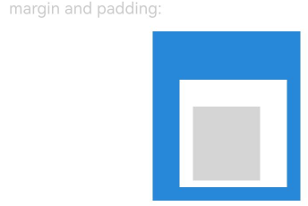
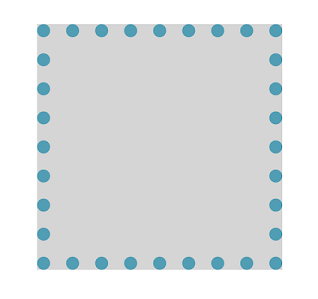
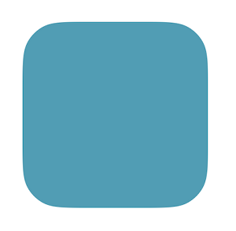
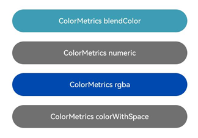
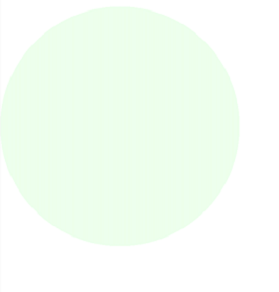
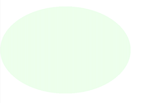
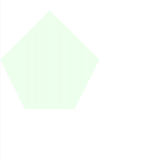
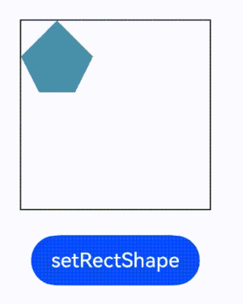

# Graphics

更新时间：2026-04-20 06:34:33

来源：https://developer.huawei.com/consumer/cn/doc/harmonyos-references/js-apis-arkui-graphics
**支持设备：** Phone | PC/2in1 | Tablet | Wearable | TV

自定义节点相关属性定义的详细信息。

> [!NOTE]
> 本模块首批接口从API version 11开始支持。后续版本的新增接口，采用上角标单独标记接口的起始版本。


##### 导入模块

**支持设备：** Phone | PC/2in1 | Tablet | Wearable | TV

```text
import { DrawContext, Size, Offset, Position, Pivot, Scale, Translation, Matrix4, Rotation, Frame, LengthMetricsUnit } from "@kit.ArkUI";
```


##### Size

**支持设备：** Phone | PC/2in1 | Tablet | Wearable | TV

用于返回组件布局大小的宽和高。默认单位为vp，不同的接口使用Size类型时会再定义单位，以接口定义的单位为准。

**元服务API：** 从API version 12开始，该接口支持在元服务中使用。

**系统能力：** SystemCapability.ArkUI.ArkUI.Full

| 名称 | 类型 | 只读 | 可选 | 说明 |
| --- | --- | --- | --- | --- |
| width | number | 否 | 否 | 组件大小的宽度。 单位：vp 取值范围：[0, +∞) |
| height | number | 否 | 否 | 组件大小的高度。 单位：vp 取值范围：[0, +∞) |


##### Position

**支持设备：** Phone | PC/2in1 | Tablet | Wearable | TV

type Position = Vector2

用于设置或返回组件的位置。

**元服务API：** 从API version 12开始，该接口支持在元服务中使用。

**系统能力：** SystemCapability.ArkUI.ArkUI.Full

| 类型 | 说明 |
| --- | --- |
| Vector2 | 包含x和y两个值的向量。 单位：vp |


##### PositionT12+

**支持设备：** Phone | PC/2in1 | Tablet | Wearable | TV

type PositionT&lt;T&gt; = Vector2T&lt;T&gt;

用于设置或返回组件的位置。

**元服务API：** 从API version 12开始，该接口支持在元服务中使用。

**系统能力：** SystemCapability.ArkUI.ArkUI.Full

| 类型 | 说明 |
| --- | --- |
| Vector2T&lt;T&gt; | 包含x和y两个值的向量。 单位：vp |


##### Frame

**支持设备：** Phone | PC/2in1 | Tablet | Wearable | TV

用于设置或返回组件的布局大小和位置。

**元服务API：** 从API version 12开始，该接口支持在元服务中使用。

**系统能力：** SystemCapability.ArkUI.ArkUI.Full

| 名称 | 类型 | 只读 | 可选 | 说明 |
| --- | --- | --- | --- | --- |
| x | number | 否 | 否 | 水平方向位置。 单位：vp 取值范围：(-∞, +∞) |
| y | number | 否 | 否 | 垂直方向位置。 单位：vp 取值范围：(-∞, +∞) |
| width | number | 否 | 否 | 组件的宽度。 单位：vp 取值范围：[0, +∞) |
| height | number | 否 | 否 | 组件的高度。 单位：vp 取值范围：[0, +∞) |


##### Pivot

**支持设备：** Phone | PC/2in1 | Tablet | Wearable | TV

type Pivot = Vector2

用于设置组件的轴心坐标，轴心会作为组件的旋转/缩放中心点，影响旋转和缩放效果。

**元服务API：** 从API version 12开始，该接口支持在元服务中使用。

**系统能力：** SystemCapability.ArkUI.ArkUI.Full

| 类型 | 说明 |
| --- | --- |
| Vector2 | 轴心的x和y轴坐标。该参数为浮点数，默认值为0.5， 取值范围为[0.0, 1.0]。 |


##### Scale

**支持设备：** Phone | PC/2in1 | Tablet | Wearable | TV

type Scale = Vector2

用于设置组件的缩放比例。

**元服务API：** 从API version 12开始，该接口支持在元服务中使用。

**系统能力：** SystemCapability.ArkUI.ArkUI.Full

| 类型 | 说明 |
| --- | --- |
| Vector2 | x和y轴的缩放参数。该参数为浮点数，默认值为1.0。 |


##### Translation

**支持设备：** Phone | PC/2in1 | Tablet | Wearable | TV

type Translation = Vector2

用于设置组件的平移量。

**元服务API：** 从API version 12开始，该接口支持在元服务中使用。

**系统能力：** SystemCapability.ArkUI.ArkUI.Full

| 类型 | 说明 |
| --- | --- |
| Vector2 | x和y轴的平移量。 单位：px |


##### Rotation

**支持设备：** Phone | PC/2in1 | Tablet | Wearable | TV

type Rotation = Vector3

用于设置组件的旋转角度。

**元服务API：** 从API version 12开始，该接口支持在元服务中使用。

**系统能力：** SystemCapability.ArkUI.ArkUI.Full

| 类型 | 说明 |
| --- | --- |
| Vector3 | x、y、z轴方向的旋转角度。 单位：度 |


##### Offset

**支持设备：** Phone | PC/2in1 | Tablet | Wearable | TV

type Offset = Vector2

用于设置组件或效果的偏移。

**元服务API：** 从API version 12开始，该接口支持在元服务中使用。

**系统能力：** SystemCapability.ArkUI.ArkUI.Full

| 类型 | 说明 |
| --- | --- |
| Vector2 | x和y轴方向的偏移量。 单位：vp |


##### Matrix4

**支持设备：** Phone | PC/2in1 | Tablet | Wearable | TV

type Matrix4 = [number,number,number,number,number,number,number,number,number,number,number,number,number,number,number,number]

设置四阶矩阵。

**元服务API：** 从API version 12开始，该接口支持在元服务中使用。

**系统能力：** SystemCapability.ArkUI.ArkUI.Full

| 类型 | 说明 |
| --- | --- |
| [number,number,number,number, number,number,number,number, number,number,number,number, number,number,number,number] | 参数为长度为16（4*4）的number数组。 各number取值范围：(-∞, +∞) |


用于设置组件的变换信息，该类型为一个 4x4 矩阵，使用一个长度为16的number[]进行表示，例如：

```text
const transform: Matrix4 = [
  1, 0, 45, 0,
  0, 1,  0, 0,
  0, 0,  1, 0,
  0, 0,  0, 1
]
```


##### Vector2

**支持设备：** Phone | PC/2in1 | Tablet | Wearable | TV

用于表示包含x和y两个值的向量。

**元服务API：** 从API version 12开始，该接口支持在元服务中使用。

**系统能力：** SystemCapability.ArkUI.ArkUI.Full

| 名称 | 类型 | 只读 | 可选 | 说明 |
| --- | --- | --- | --- | --- |
| x | number | 否 | 否 | 向量x轴方向的值。 取值范围：(-∞, +∞) |
| y | number | 否 | 否 | 向量y轴方向的值。 取值范围：(-∞, +∞) |


##### Vector3

**支持设备：** Phone | PC/2in1 | Tablet | Wearable | TV

用于表示包含x、y、z三个值的向量。

**元服务API：** 从API version 12开始，该接口支持在元服务中使用。

**系统能力：** SystemCapability.ArkUI.ArkUI.Full

| 名称 | 类型 | 只读 | 可选 | 说明 |
| --- | --- | --- | --- | --- |
| x | number | 否 | 否 | x轴方向的旋转角度。 取值范围：(-∞, +∞) |
| y | number | 否 | 否 | y轴方向的旋转角度。 取值范围：(-∞, +∞) |
| z | number | 否 | 否 | z轴方向的旋转角度。 取值范围：(-∞, +∞) |


##### Vector2T&lt;T&gt;12+

**支持设备：** Phone | PC/2in1 | Tablet | Wearable | TV

用于表示T类型的包含x和y两个值的向量。

**元服务API：** 从API version 12开始，该接口支持在元服务中使用。

**系统能力：** SystemCapability.ArkUI.ArkUI.Full

| 名称 | 类型 | 只读 | 可选 | 说明 |
| --- | --- | --- | --- | --- |
| x | T | 否 | 否 | 向量x轴方向的值。 |
| y | T | 否 | 否 | 向量y轴方向的值。 |


##### DrawContext

**支持设备：** Phone | PC/2in1 | Tablet | Wearable | TV

图形绘制上下文，提供绘制所需的画布宽度和高度。


##### size

**支持设备：** Phone | PC/2in1 | Tablet | Wearable | TV

get size(): Size

获取画布的宽度和高度。

**元服务API：** 从API version 12开始，该接口支持在元服务中使用。

**系统能力：** SystemCapability.ArkUI.ArkUI.Full

**返回值：**

| 类型 | 说明 |
| --- | --- |
| Size | 画布的宽度和高度。 |


##### sizeInPixel12+

**支持设备：** Phone | PC/2in1 | Tablet | Wearable | TV

get sizeInPixel(): Size

获取以px为单位的画布的宽度和高度。

**元服务API：** 从API version 12开始，该接口支持在元服务中使用。

**系统能力：** SystemCapability.ArkUI.ArkUI.Full

**返回值：**

| 类型 | 说明 |
| --- | --- |
| Size | 画布的宽度和高度，以px为单位。 |


##### canvas

**支持设备：** Phone | PC/2in1 | Tablet | Wearable | TV

get canvas(): drawing.Canvas

获取用于绘制的画布。

**元服务API：** 从API version 12开始，该接口支持在元服务中使用。

**系统能力：** SystemCapability.ArkUI.ArkUI.Full

**返回值：**

| 类型 | 说明 |
| --- | --- |
| drawing.Canvas | 用于绘制的画布。 |


**示例：**

```text
import { RenderNode, FrameNode, NodeController, DrawContext } from "@kit.ArkUI";

class MyRenderNode extends RenderNode {
  flag: boolean = false;

  draw(context: DrawContext) {
    const size = context.size;
    const canvas = context.canvas;
    const sizeInPixel = context.sizeInPixel;
  }
}

const renderNode = new MyRenderNode();
renderNode.frame = { x: 0, y: 0, width: 100, height: 100 };
renderNode.backgroundColor = 0xff519db4;

class MyNodeController extends NodeController {
  private rootNode: FrameNode | null = null;

  makeNode(uiContext: UIContext): FrameNode | null {
    this.rootNode = new FrameNode(uiContext);

    const rootRenderNode = this.rootNode.getRenderNode();
    if (rootRenderNode !== null) {
      rootRenderNode.appendChild(renderNode);
    }

    return this.rootNode;
  }
}

@Entry
@Component
struct Index {
  private myNodeController: MyNodeController = new MyNodeController();

  build() {
    Row() {
      NodeContainer(this.myNodeController)
    }
  }
}
```





##### Edges&lt;T&gt;12+

**支持设备：** Phone | PC/2in1 | Tablet | Wearable | TV

用于设置边框的属性。

**元服务API：** 从API version 12开始，该接口支持在元服务中使用。

**系统能力：** SystemCapability.ArkUI.ArkUI.Full

| 名称 | 类型 | 只读 | 可选 | 说明 |
| --- | --- | --- | --- | --- |
| left | T | 否 | 否 | 左侧边框的属性。 |
| top | T | 否 | 否 | 顶部边框的属性。 |
| right | T | 否 | 否 | 右侧边框的属性。 |
| bottom | T | 否 | 否 | 底部边框的属性。 |


##### LengthUnit12+

**支持设备：** Phone | PC/2in1 | Tablet | Wearable | TV

长度属性单位枚举。

**元服务API：** 从API version 12开始，该接口支持在元服务中使用。

**系统能力：** SystemCapability.ArkUI.ArkUI.Full

| 名称 | 值 | 说明 |
| --- | --- | --- |
| PX | 0 | 长度类型，用于描述以px像素单位为单位的长度。 |
| VP | 1 | 长度类型，用于描述以vp像素单位为单位的长度。 |
| FP | 2 | 长度类型，用于描述以fp像素单位为单位的长度。 |
| PERCENT | 3 | 长度类型，用于描述以%像素单位为单位的长度。 |
| LPX | 4 | 长度类型，用于描述以lpx像素单位为单位的长度。 |


##### SizeT&lt;T&gt;12+

**支持设备：** Phone | PC/2in1 | Tablet | Wearable | TV

用于设置宽高的属性。

**元服务API：** 从API version 12开始，该接口支持在元服务中使用。

**系统能力：** SystemCapability.ArkUI.ArkUI.Full

| 名称 | 类型 | 只读 | 可选 | 说明 |
| --- | --- | --- | --- | --- |
| width | T | 否 | 否 | 宽度的属性。 |
| height | T | 否 | 否 | 高度的属性。 |


##### LengthMetricsUnit12+

**支持设备：** Phone | PC/2in1 | Tablet | Wearable | TV

长度属性单位枚举。

**元服务API：** 从API version 12开始，该接口支持在元服务中使用。

**系统能力：** SystemCapability.ArkUI.ArkUI.Full

| 名称 | 值 | 说明 |
| --- | --- | --- |
| DEFAULT | 0 | 长度类型，用于描述以默认的vp像素单位为单位的长度。 |
| PX | 1 | 长度类型，用于描述以px像素单位为单位的长度。 |


##### LengthMetrics12+

**支持设备：** Phone | PC/2in1 | Tablet | Wearable | TV

用于设置长度属性，当长度单位为PERCENT时，值为1表示100%。


##### 属性

**支持设备：** Phone | PC/2in1 | Tablet | Wearable | TV

**元服务API：** 从API version 12开始，该接口支持在元服务中使用。

**系统能力：** SystemCapability.ArkUI.ArkUI.Full

| 名称 | 类型 | 只读 | 可选 | 说明 |
| --- | --- | --- | --- | --- |
| value | number | 否 | 否 | 长度属性的值。 |
| unit | LengthUnit | 否 | 否 | 长度属性的单位，默认为VP。 |


##### constructor12+

**支持设备：** Phone | PC/2in1 | Tablet | Wearable | TV

constructor(value: number, unit?: LengthUnit)

LengthMetrics的构造函数。若参数unit不传入值或传入undefined，返回值使用默认单位VP；若unit传入非LengthUnit类型的值，返回默认值0VP。

**元服务API：** 从API version 12开始，该接口支持在元服务中使用。

**系统能力：** SystemCapability.ArkUI.ArkUI.Full

**参数：**

| 参数名 | 类型 | 必填 | 说明 |
| --- | --- | --- | --- |
| value | number | 是 | 长度属性的值。 取值范围：[0, +∞) |
| unit | LengthUnit | 否 | 长度属性的单位。 |


##### px12+

**支持设备：** Phone | PC/2in1 | Tablet | Wearable | TV

static px(value: number): LengthMetrics

用于生成单位为PX的长度属性。

**元服务API：** 从API version 12开始，该接口支持在元服务中使用。

**系统能力：** SystemCapability.ArkUI.ArkUI.Full

**参数：**

| 参数名 | 类型 | 必填 | 说明 |
| --- | --- | --- | --- |
| value | number | 是 | 长度属性的值。 取值范围：(-∞, +∞) |


**返回值：**

| 类型 | 说明 |
| --- | --- |
| LengthMetrics | LengthMetrics 类的实例。 |


##### vp12+

**支持设备：** Phone | PC/2in1 | Tablet | Wearable | TV

static vp(value: number): LengthMetrics

用于生成单位为VP的长度属性。

**元服务API：** 从API version 12开始，该接口支持在元服务中使用。

**系统能力：** SystemCapability.ArkUI.ArkUI.Full

**参数：**

| 参数名 | 类型 | 必填 | 说明 |
| --- | --- | --- | --- |
| value | number | 是 | 长度属性的值。 取值范围：(-∞, +∞) |


**返回值：**

| 类型 | 说明 |
| --- | --- |
| LengthMetrics | LengthMetrics 类的实例。 |


##### fp12+

**支持设备：** Phone | PC/2in1 | Tablet | Wearable | TV

static fp(value: number): LengthMetrics

用于生成单位为FP的长度属性。

**元服务API：** 从API version 12开始，该接口支持在元服务中使用。

**系统能力：** SystemCapability.ArkUI.ArkUI.Full

**参数：**

| 参数名 | 类型 | 必填 | 说明 |
| --- | --- | --- | --- |
| value | number | 是 | 长度属性的值。 取值范围：(-∞, +∞) |


**返回值：**

| 类型 | 说明 |
| --- | --- |
| LengthMetrics | LengthMetrics 类的实例。 |


##### percent12+

**支持设备：** Phone | PC/2in1 | Tablet | Wearable | TV

static percent(value: number): LengthMetrics

用于生成单位为PERCENT的长度属性，值为1表示100%。

**元服务API：** 从API version 12开始，该接口支持在元服务中使用。

**系统能力：** SystemCapability.ArkUI.ArkUI.Full

**参数：**

| 参数名 | 类型 | 必填 | 说明 |
| --- | --- | --- | --- |
| value | number | 是 | 长度属性的值。 取值范围：[0, 1] |


**返回值：**

| 类型 | 说明 |
| --- | --- |
| LengthMetrics | LengthMetrics 类的实例。 |


##### lpx12+

**支持设备：** Phone | PC/2in1 | Tablet | Wearable | TV

static lpx(value: number): LengthMetrics

用于生成单位为LPX的长度属性。

**元服务API：** 从API version 12开始，该接口支持在元服务中使用。

**系统能力：** SystemCapability.ArkUI.ArkUI.Full

**参数：**

| 参数名 | 类型 | 必填 | 说明 |
| --- | --- | --- | --- |
| value | number | 是 | 长度属性的值。 取值范围：(-∞, +∞) |


**返回值：**

| 类型 | 说明 |
| --- | --- |
| LengthMetrics | LengthMetrics 类的实例。 |


##### resource12+

**支持设备：** Phone | PC/2in1 | Tablet | Wearable | TV

static resource(value: Resource): LengthMetrics

用于生成Resource类型资源的长度属性。

**元服务API：** 从API version 12开始，该接口支持在元服务中使用。

**系统能力：** SystemCapability.ArkUI.ArkUI.Full

**参数：**

| 参数名 | 类型 | 必填 | 说明 |
| --- | --- | --- | --- |
| value | Resource | 是 | 长度属性的值。 |


**返回值：**

| 类型 | 说明 |
| --- | --- |
| LengthMetrics | LengthMetrics 类的实例。 |


**示例：**

使用LengthMetrics设置Row的padding和margin属性。

```text
import { LengthMetrics, LengthUnit } from '@kit.ArkUI';

@Entry
@Component
struct SizeExample {
  build() {
    Column({ space: 10 }) {
      Text('margin and padding:')
        .fontSize(12)
        .fontColor(0xCCCCCC)
        .width('90%')
      Row() {
        Row() {
          Row()
            .size({ width: '100%', height: '100%' })
            .backgroundColor('#ffd5d5d5')
        }
        .width(80)
        .height(80)
        .padding({
          top: new LengthMetrics(20, LengthUnit.VP),
          bottom: LengthMetrics.px(15),
          start: LengthMetrics.vp(10),
          end: LengthMetrics.fp(20)
        })
        .margin({
          top: LengthMetrics.percent(0.1),
          bottom: LengthMetrics.lpx(20),
          start: LengthMetrics.resource($r('app.float.row_margin_start')),
          end: LengthMetrics.vp(10)
        })
        .backgroundColor(Color.White)
      }
      .backgroundColor("#ff2787d9")
    }
    .width('100%')
    .margin({ top: 5 })
  }
}
```


##### ColorMetrics12+

**支持设备：** Phone | PC/2in1 | Tablet | Wearable | TV

用于混合颜色。

**系统能力：** SystemCapability.ArkUI.ArkUI.Full


##### numeric12+

**支持设备：** Phone | PC/2in1 | Tablet | Wearable | TV

static numeric(value: number): ColorMetrics

使用HEX格式颜色实例化 ColorMetrics 类。

**元服务API：** 从API version 12开始，该接口支持在元服务中使用。

**系统能力：** SystemCapability.ArkUI.ArkUI.Full

**参数：**

| 参数名 | 类型 | 必填 | 说明 |
| --- | --- | --- | --- |
| value | number | 是 | HEX格式颜色。 取值范围：支持rgb或者argb |


**返回值：**

| 类型 | 说明 |
| --- | --- |
| ColorMetrics | ColorMetrics 类的实例。 |


##### rgba12+

**支持设备：** Phone | PC/2in1 | Tablet | Wearable | TV

static rgba(red: number, green: number, blue: number, alpha?: number): ColorMetrics

使用rgb或者rgba格式颜色实例化 ColorMetrics 类。

**元服务API：** 从API version 12开始，该接口支持在元服务中使用。

**系统能力：** SystemCapability.ArkUI.ArkUI.Full

**参数：**

| 参数名 | 类型 | 必填 | 说明 |
| --- | --- | --- | --- |
| red | number | 是 | 颜色的R分量（红色），值是0~255的整数。 |
| green | number | 是 | 颜色的G分量（绿色），值是0~255的整数。 |
| blue | number | 是 | 颜色的B分量（蓝色），值是0~255的整数。 |
| alpha | number | 否 | 颜色的A分量（透明度），值是0.0~1.0的浮点数，默认值为1.0，不透明。 说明： alpha小于0为全透明，大于1为不透明。 |


**返回值：**

| 类型 | 说明 |
| --- | --- |
| ColorMetrics | ColorMetrics 类的实例。 |


##### colorWithSpace20+

**支持设备：** Phone | PC/2in1 | Tablet | Wearable | TV

static colorWithSpace(colorSpace: ColorSpace, red: number, green: number, blue: number, alpha?: number): ColorMetrics

使用[ColorSpace](https://developer.huawei.com/consumer/cn/doc/harmonyos-references/ts-appendix-enums#colorspace20)和rgba格式颜色实例化ColorMetrics类。仅部分属性支持在display-p3色彩空间中设置颜色。

**元服务API：** 从API version 20开始，该接口支持在元服务中使用。

**系统能力：** SystemCapability.ArkUI.ArkUI.Full

**参数：**

| 参数名 | 类型 | 必填 | 说明 |
| --- | --- | --- | --- |
| colorSpace | ColorSpace | 是 | 颜色空间，用于指定颜色的色彩空间。使用ColorSpace.DISPLAY_P3，需要对应窗口调用setWindowColorSpace接口，将当前窗口设置为广色域模式。 |
| red | number | 是 | 颜色的R分量（红色），值是0~1的浮动数值。 |
| green | number | 是 | 颜色的G分量（绿色），值是0~1的浮动数值。 |
| blue | number | 是 | 颜色的B分量（蓝色），值是0~1的浮动数值。 |
| alpha | number | 否 | 颜色的A分量（透明度），值是0.0~1.0的浮点数，默认值为1.0，不透明。 |


**返回值：**

| 类型 | 说明 |
| --- | --- |
| ColorMetrics | ColorMetrics类的实例。 |


##### resourceColor12+

**支持设备：** Phone | PC/2in1 | Tablet | Wearable | TV

static resourceColor(color: ResourceColor): ColorMetrics

使用资源格式颜色实例化 ColorMetrics 类。

**元服务API：** 从API version 12开始，该接口支持在元服务中使用。

**系统能力：** SystemCapability.ArkUI.ArkUI.Full

**参数：**

| 参数名 | 类型 | 必填 | 说明 |
| --- | --- | --- | --- |
| color | ResourceColor | 是 | 资源格式颜色。 |


**返回值：**

| 类型 | 说明 |
| --- | --- |
| ColorMetrics | ColorMetrics 类的实例。 |


**错误码**：

以下错误码的详细介绍请参见[通用错误码](https://developer.huawei.com/consumer/cn/doc/harmonyos-references/errorcode-universal)和[系统资源错误码](https://developer.huawei.com/consumer/cn/doc/harmonyos-references/errorcode-system-resource)。

| 错误码ID | 错误信息 |
| --- | --- |
| 401 | Parameter error. Possible cause:1.The type of the input color parameter is not ResourceColor;2.The format of the input color string is not RGB or RGBA. |
| 180003 | Failed to obtain the color resource. |


##### blendColor12+

**支持设备：** Phone | PC/2in1 | Tablet | Wearable | TV

blendColor(overlayColor: ColorMetrics): ColorMetrics

在当前颜色的上方叠加上一层指定的颜色（overlayColor），并返回混合后的新颜色。

**元服务API：** 从API version 12开始，该接口支持在元服务中使用。

**系统能力：** SystemCapability.ArkUI.ArkUI.Full

**参数：**

| 参数名 | 类型 | 必填 | 说明 |
| --- | --- | --- | --- |
| overlayColor | ColorMetrics | 是 | 要叠加在上方的颜色对象。alpha属性决定叠加强度。1.0表示完全覆盖，0.0表示完全透明，混合结果为原色。 |


**返回值：**

| 类型 | 说明 |
| --- | --- |
| ColorMetrics | 新的颜色对象，其red、green、blue和alpha通道均为当前颜色与叠加颜色混合后的结果值。 |


**混合公式：**

混合后透明度为完全不透明，rgb按照以下公式计算：

result_rgb = overlay_rgb*(overlay_alpha) + (1 - overlay_alpha) * base_rgb

**错误码：**

以下错误码的详细介绍请参见[通用错误码](https://developer.huawei.com/consumer/cn/doc/harmonyos-references/errorcode-universal)。

| 错误码ID | 错误信息 |
| --- | --- |
| 401 | Parameter error. The type of the input parameter is not ColorMetrics. |


##### color12+

**支持设备：** Phone | PC/2in1 | Tablet | Wearable | TV

get color(): string

获取ColorMetrics的颜色，返回的是rgba字符串的格式。

**元服务API：** 从API version 12开始，该接口支持在元服务中使用。

**系统能力：** SystemCapability.ArkUI.ArkUI.Full

**返回值：**

| 类型 | 说明 |
| --- | --- |
| string | rgba字符串格式的颜色。 示例：'rgba(255, 100, 255, 0.5)' |


##### red12+

**支持设备：** Phone | PC/2in1 | Tablet | Wearable | TV

get red(): number

获取ColorMetrics颜色的R分量（红色）。

**元服务API：** 从API version 12开始，该接口支持在元服务中使用。

**系统能力：** SystemCapability.ArkUI.ArkUI.Full

**返回值：**

| 类型 | 说明 |
| --- | --- |
| number | 颜色的R分量（红色），值是0~255的整数。 |


##### green12+

**支持设备：** Phone | PC/2in1 | Tablet | Wearable | TV

get green(): number

获取ColorMetrics颜色的G分量（绿色）。

**元服务API：** 从API version 12开始，该接口支持在元服务中使用。

**系统能力：** SystemCapability.ArkUI.ArkUI.Full

**返回值：**

| 类型 | 说明 |
| --- | --- |
| number | 颜色的G分量（绿色），值是0~255的整数。 |


##### blue12+

**支持设备：** Phone | PC/2in1 | Tablet | Wearable | TV

get blue(): number

获取ColorMetrics颜色的B分量（蓝色）。

**元服务API：** 从API version 12开始，该接口支持在元服务中使用。

**系统能力：** SystemCapability.ArkUI.ArkUI.Full

**返回值：**

| 类型 | 说明 |
| --- | --- |
| number | 颜色的B分量（蓝色），值是0~255的整数。 |


##### alpha12+

**支持设备：** Phone | PC/2in1 | Tablet | Wearable | TV

get alpha(): number

获取ColorMetrics颜色的A分量（透明度）。

**元服务API：** 从API version 12开始，该接口支持在元服务中使用。

**系统能力：** SystemCapability.ArkUI.ArkUI.Full

**返回值：**

| 类型 | 说明 |
| --- | --- |
| number | 颜色的A分量（透明度），值是0~255的整数。 |


**示例：**

```text
import { ColorMetrics } from '@kit.ArkUI';
import { BusinessError } from '@kit.BasicServicesKit';

function getBlendColor(baseColor: ResourceColor): ColorMetrics {
  let sourceColor: ColorMetrics;
  try {
    // 在使用ColorMetrics的resourceColor和blendColor需要追加捕获异常处理
    // 可能返回的arkui子系统错误码有401和180003
    // 61 157 180
    sourceColor = ColorMetrics.resourceColor(baseColor).blendColor(ColorMetrics.resourceColor("#083d9db4"));
    console.info(`current color is ${sourceColor.color} r:${sourceColor.red} g:${sourceColor.green} b:${sourceColor.blue} a :${sourceColor.alpha}`);
  } catch (error) {
    console.error("getBlendColor failed, code = " + (error as BusinessError).code + ", message = " +
    (error as BusinessError).message);
    sourceColor = ColorMetrics.resourceColor("#19000000");
  }
  return sourceColor;
}

@Entry
@Component
struct ColorMetricsSample {
  build() {
    Flex({ direction: FlexDirection.Column, alignItems: ItemAlign.Center, justifyContent: FlexAlign.Center }) {
      Button("ColorMetrics blendColor")
        .width('80%')
        .align(Alignment.Center)
        .height(50)
        .backgroundColor(getBlendColor("#ff3d9db4").color)
        .margin(10)
      Button("ColorMetrics numeric")
        .width('80%')
        .align(Alignment.Center)
        .height(50)
        .backgroundColor(ColorMetrics.numeric(0xff707070).color)
        .margin(10)
      Button("ColorMetrics rgba")
        .width('80%')
        .align(Alignment.Center)
        .height(50)
        .backgroundColor(ColorMetrics.rgba(0, 74, 175, 255).color)
        .margin(10)
      Button("ColorMetrics colorWithSpace")
        .width('80%')
        .align(Alignment.Center)
        .height(50)
        .backgroundColor(ColorMetrics.colorWithSpace(ColorSpace.SRGB, 0.4392, 0.4392, 0.4392).color)
        .margin(10)
    }
    .width('100%')
    .height('100%')
  }
}
```





##### Corners&lt;T&gt;12+

**支持设备：** Phone | PC/2in1 | Tablet | Wearable | TV

用于设置四个角的圆角属性。

**元服务API：** 从API version 12开始，该接口支持在元服务中使用。

**系统能力：** SystemCapability.ArkUI.ArkUI.Full

| 名称 | 类型 | 只读 | 可选 | 说明 |
| --- | --- | --- | --- | --- |
| topLeft | T | 否 | 否 | 左上边框的圆角属性。 |
| topRight | T | 否 | 否 | 右上边框的圆角属性。 |
| bottomLeft | T | 否 | 否 | 左下边框的圆角属性。 |
| bottomRight | T | 否 | 否 | 右下边框的圆角属性。 |


##### CornerRadius12+

**支持设备：** Phone | PC/2in1 | Tablet | Wearable | TV

type CornerRadius = Corners&lt;Vector2&gt;

设置四个角的圆角x轴与y轴的半轴长。

**元服务API：** 从API version 12开始，该接口支持在元服务中使用。

**系统能力：** SystemCapability.ArkUI.ArkUI.Full

| 类型 | 说明 |
| --- | --- |
| Corners&lt;Vector2&gt; | 四个角的圆角x轴与y轴的半轴长。 |


##### BorderRadiuses12+

**支持设备：** Phone | PC/2in1 | Tablet | Wearable | TV

type BorderRadiuses = Corners&lt;number&gt;

设置四个角的圆角半径。

**元服务API：** 从API version 12开始，该接口支持在元服务中使用。

**系统能力：** SystemCapability.ArkUI.ArkUI.Full

| 类型 | 说明 |
| --- | --- |
| Corners&lt;number&gt; | 四个角的圆角半径。 |


##### Rect12+

**支持设备：** Phone | PC/2in1 | Tablet | Wearable | TV

type Rect = common2D.Rect

用于设置矩形的形状。

**元服务API：** 从API version 12开始，该接口支持在元服务中使用。

**系统能力：** SystemCapability.ArkUI.ArkUI.Full

| 类型 | 说明 |
| --- | --- |
| common2D.Rect | 矩形区域。 |


##### RoundRect12+

**支持设备：** Phone | PC/2in1 | Tablet | Wearable | TV

用于设置带有圆角的矩形。

**元服务API：** 从API version 12开始，该接口支持在元服务中使用。

**系统能力：** SystemCapability.ArkUI.ArkUI.Full

| 名称 | 类型 | 只读 | 可选 | 说明 |
| --- | --- | --- | --- | --- |
| rect | Rect | 否 | 否 | 设置矩形的属性。 |
| corners | CornerRadius | 否 | 否 | 设置圆角的属性。 |


##### Circle12+

**支持设备：** Phone | PC/2in1 | Tablet | Wearable | TV

用于设置圆形的属性。

**元服务API：** 从API version 12开始，该接口支持在元服务中使用。

**系统能力：** SystemCapability.ArkUI.ArkUI.Full

| 名称 | 类型 | 只读 | 可选 | 说明 |
| --- | --- | --- | --- | --- |
| centerX | number | 否 | 否 | 圆心x轴的位置，单位为px。 |
| centerY | number | 否 | 否 | 圆心y轴的位置，单位为px。 |
| radius | number | 否 | 否 | 圆形的半径，单位为px。 取值范围：[0, +∞) |


##### CommandPath12+

**支持设备：** Phone | PC/2in1 | Tablet | Wearable | TV

用于设置路径绘制的指令。

**元服务API：** 从API version 12开始，该接口支持在元服务中使用。

**系统能力：** SystemCapability.ArkUI.ArkUI.Full

| 名称 | 类型 | 只读 | 可选 | 说明 |
| --- | --- | --- | --- | --- |
| commands | string | 否 | 否 | 路径绘制的指令字符串。像素单位的转换方法请参考像素单位。 单位：px |


##### ShapeMask12+

**支持设备：** Phone | PC/2in1 | Tablet | Wearable | TV

用于设置图形遮罩。


##### 属性

**支持设备：** Phone | PC/2in1 | Tablet | Wearable | TV

**元服务API：** 从API version 12开始，该接口支持在元服务中使用。

**系统能力：** SystemCapability.ArkUI.ArkUI.Full

| 名称 | 类型 | 只读 | 可选 | 说明 |
| --- | --- | --- | --- | --- |
| fillColor | number | 否 | 否 | 遮罩的填充颜色，使用ARGB格式。默认值为0XFF000000。 通过fillColor的透明度和亮度生成一个仅含透明度的颜色。亮度越高，颜色越透明。然后，使用BlendMode.SRC_IN方式与RenderNode本身的颜色混合，生成最终颜色。 |
| strokeColor | number | 否 | 否 | 遮罩的边框颜色，使用ARGB格式。默认值为0XFF000000。 通过strokeColor的透明度和亮度生成一个仅含透明度的颜色。亮度越高，颜色越透明。然后，使用BlendMode.SRC_IN方式与RenderNode本身的颜色混合，生成最终颜色。 |
| strokeWidth | number | 否 | 否 | 遮罩的边框宽度，单位为px。默认值为0。 |


##### constructor12+

**支持设备：** Phone | PC/2in1 | Tablet | Wearable | TV

constructor()

ShapeMask的构造函数。

**元服务API：** 从API version 12开始，该接口支持在元服务中使用。

**系统能力：** SystemCapability.ArkUI.ArkUI.Full


##### setRectShape12+

**支持设备：** Phone | PC/2in1 | Tablet | Wearable | TV

setRectShape(rect: Rect): void

用于设置矩形遮罩。

**元服务API：** 从API version 12开始，该接口支持在元服务中使用。

**系统能力：** SystemCapability.ArkUI.ArkUI.Full

**参数：**

| 参数名 | 类型 | 必填 | 说明 |
| --- | --- | --- | --- |
| rect | Rect | 是 | 矩形的形状。 |


**示例：**

```text
import { RenderNode, FrameNode, NodeController, ShapeMask } from '@kit.ArkUI';

class MyNodeController extends NodeController {
  private rootNode: FrameNode | null = null;

  makeNode(uiContext: UIContext): FrameNode | null {
    this.rootNode = new FrameNode(uiContext);

    const mask = new ShapeMask();
    mask.setRectShape({
      left: 0,
      right: uiContext.vp2px(150),
      top: 0,
      bottom: uiContext.vp2px(150)
    });
    mask.fillColor = 0X55FF0000;

    const renderNode = new RenderNode();
    renderNode.frame = {
      x: 0,
      y: 0,
      width: 150,
      height: 150
    };
    renderNode.backgroundColor = 0XFF00FF00;
    renderNode.shapeMask = mask;

    const rootRenderNode = this.rootNode.getRenderNode();
    if (rootRenderNode !== null) {
      rootRenderNode.appendChild(renderNode);
    }

    return this.rootNode;
  }
}

@Entry
@Component
struct Index {
  private myNodeController: MyNodeController = new MyNodeController();

  build() {
    Row() {
      NodeContainer(this.myNodeController)
    }
  }
}
```





##### setRoundRectShape12+

**支持设备：** Phone | PC/2in1 | Tablet | Wearable | TV

setRoundRectShape(roundRect: RoundRect): void

用于设置圆角矩形遮罩。

**元服务API：** 从API version 12开始，该接口支持在元服务中使用。

**系统能力：** SystemCapability.ArkUI.ArkUI.Full

**参数：**

| 参数名 | 类型 | 必填 | 说明 |
| --- | --- | --- | --- |
| roundRect | RoundRect | 是 | 圆角矩形的形状。 |


**示例：**

```text
import { RenderNode, FrameNode, NodeController, ShapeMask,RoundRect} from '@kit.ArkUI';

class MyNodeController extends NodeController {
  private rootNode: FrameNode | null = null;

  makeNode(uiContext: UIContext): FrameNode | null {
    this.rootNode = new FrameNode(uiContext);

    const mask = new ShapeMask();
    const roundRect: RoundRect = {
      rect: { left: 0, top: 0, right: uiContext.vp2px(150), bottom: uiContext.vp2px(150) },
      corners: {
        topLeft: { x: 32, y: 32 },
        topRight: { x: 32, y: 32 },
        bottomLeft: { x: 32, y: 32 },
        bottomRight: { x: 32, y: 32 }
      }
    }
    mask.setRoundRectShape(roundRect);
    mask.fillColor = 0X55FF0000;

    const renderNode = new RenderNode();
    renderNode.frame = { x: 0, y: 0, width: 150, height: 150 };
    renderNode.backgroundColor = 0XFF00FF00;
    renderNode.shapeMask = mask;

    const rootRenderNode = this.rootNode.getRenderNode();
    if (rootRenderNode !== null) {
      rootRenderNode.appendChild(renderNode);
    }

    return this.rootNode;
  }
}

@Entry
@Component
struct Index {
  private myNodeController: MyNodeController = new MyNodeController();

  build() {
    Row() {
      NodeContainer(this.myNodeController)
    }
  }
}
```





##### setCircleShape12+

**支持设备：** Phone | PC/2in1 | Tablet | Wearable | TV

setCircleShape(circle: Circle): void

用于设置圆形遮罩。

**元服务API：** 从API version 12开始，该接口支持在元服务中使用。

**系统能力：** SystemCapability.ArkUI.ArkUI.Full

**参数：**

| 参数名 | 类型 | 必填 | 说明 |
| --- | --- | --- | --- |
| circle | Circle | 是 | 圆形的形状。 |


**示例：**

```text
import { RenderNode, FrameNode, NodeController, ShapeMask } from '@kit.ArkUI';

class MyNodeController extends NodeController {
  private rootNode: FrameNode | null = null;

  makeNode(uiContext: UIContext): FrameNode | null {
    this.rootNode = new FrameNode(uiContext);

    const mask = new ShapeMask();
    mask.setCircleShape({ centerY: uiContext.vp2px(75), centerX: uiContext.vp2px(75), radius: uiContext.vp2px(75) });
    mask.fillColor = 0X55FF0000;

    const renderNode = new RenderNode();
    renderNode.frame = {
      x: 0,
      y: 0,
      width: 150,
      height: 150
    };
    renderNode.backgroundColor = 0XFF00FF00;
    renderNode.shapeMask = mask;

    const rootRenderNode = this.rootNode.getRenderNode();
    if (rootRenderNode !== null) {
      rootRenderNode.appendChild(renderNode);
    }

    return this.rootNode;
  }
}

@Entry
@Component
struct Index {
  private myNodeController: MyNodeController = new MyNodeController();

  build() {
    Row() {
      NodeContainer(this.myNodeController)
    }
  }
}
```


##### setOvalShape12+

**支持设备：** Phone | PC/2in1 | Tablet | Wearable | TV

setOvalShape(oval: Rect): void

用于设置椭圆形遮罩。

**元服务API：** 从API version 12开始，该接口支持在元服务中使用。

**系统能力：** SystemCapability.ArkUI.ArkUI.Full

**参数：**

| 参数名 | 类型 | 必填 | 说明 |
| --- | --- | --- | --- |
| oval | Rect | 是 | 椭圆形的形状。 |


**示例：**

```text
import { RenderNode, FrameNode, NodeController, ShapeMask } from '@kit.ArkUI';

class MyNodeController extends NodeController {
  private rootNode: FrameNode | null = null;

  makeNode(uiContext: UIContext): FrameNode | null {
    this.rootNode = new FrameNode(uiContext);

    const mask = new ShapeMask();
    mask.setOvalShape({ left: 0, right: uiContext.vp2px(150), top: 0, bottom: uiContext.vp2px(100) });
    mask.fillColor = 0X55FF0000;

    const renderNode = new RenderNode();
    renderNode.frame = { x: 0, y: 0, width: 150, height: 150 };
    renderNode.backgroundColor = 0XFF00FF00;
    renderNode.shapeMask = mask;

    const rootRenderNode = this.rootNode.getRenderNode();
    if (rootRenderNode !== null) {
      rootRenderNode.appendChild(renderNode);
    }

    return this.rootNode;
  }
}

@Entry
@Component
struct Index {
  private myNodeController: MyNodeController = new MyNodeController();

  build() {
    Row() {
      NodeContainer(this.myNodeController)
    }
  }
}
```


##### setCommandPath12+

**支持设备：** Phone | PC/2in1 | Tablet | Wearable | TV

setCommandPath(path: CommandPath): void

用于设置路径绘制指令。

**元服务API：** 从API version 12开始，该接口支持在元服务中使用。

**系统能力：** SystemCapability.ArkUI.ArkUI.Full

**参数：**

| 参数名 | 类型 | 必填 | 说明 |
| --- | --- | --- | --- |
| path | CommandPath | 是 | 路径绘制指令。 |


**示例：**

```text
import { RenderNode, FrameNode, NodeController, ShapeMask } from '@kit.ArkUI';

const mask = new ShapeMask();
mask.setCommandPath({ commands: "M100 0 L0 100 L50 200 L150 200 L200 100 Z" });
mask.fillColor = 0X55FF0000;

const renderNode = new RenderNode();
renderNode.frame = {
  x: 0,
  y: 0,
  width: 150,
  height: 150
};
renderNode.backgroundColor = 0XFF00FF00;
renderNode.shapeMask = mask;


class MyNodeController extends NodeController {
  private rootNode: FrameNode | null = null;

  makeNode(uiContext: UIContext): FrameNode | null {
    this.rootNode = new FrameNode(uiContext);

    const rootRenderNode = this.rootNode.getRenderNode();
    if (rootRenderNode !== null) {
      rootRenderNode.appendChild(renderNode);
    }

    return this.rootNode;
  }
}

@Entry
@Component
struct Index {
  private myNodeController: MyNodeController = new MyNodeController();

  build() {
    Row() {
      NodeContainer(this.myNodeController)
    }
  }
}
```





##### ShapeClip12+

**支持设备：** Phone | PC/2in1 | Tablet | Wearable | TV

用于设置图形裁剪。


##### constructor12+

**支持设备：** Phone | PC/2in1 | Tablet | Wearable | TV

constructor()

ShapeClip的构造函数。

**系统能力：** SystemCapability.ArkUI.ArkUI.Full

**元服务API：** 从API version 12开始，该接口支持在元服务中使用。


##### setRectShape12+

**支持设备：** Phone | PC/2in1 | Tablet | Wearable | TV

setRectShape(rect: Rect): void

用于裁剪矩形。

**系统能力：** SystemCapability.ArkUI.ArkUI.Full

**元服务API：** 从API version 12开始，该接口支持在元服务中使用。

**参数：**

| 参数名 | 类型 | 必填 | 说明 |
| --- | --- | --- | --- |
| rect | Rect | 是 | 矩形的形状。 |


**示例：**

```text
import { RenderNode, FrameNode, NodeController, ShapeClip } from '@kit.ArkUI';

const clip = new ShapeClip();
clip.setCommandPath({ commands: "M100 0 L0 100 L50 200 L150 200 L200 100 Z" });

const renderNode = new RenderNode();
renderNode.frame = {
  x: 0,
  y: 0,
  width: 150,
  height: 150
};
renderNode.backgroundColor = 0xff519db4;
renderNode.shapeClip = clip;
const shapeClip = renderNode.shapeClip;

class MyNodeController extends NodeController {
  private rootNode: FrameNode | null = null;

  makeNode(uiContext: UIContext): FrameNode | null {
    this.rootNode = new FrameNode(uiContext);

    const rootRenderNode = this.rootNode.getRenderNode();
    if (rootRenderNode !== null) {
      rootRenderNode.appendChild(renderNode);
    }

    return this.rootNode;
  }
}

@Entry
@Component
struct Index {
  private myNodeController: MyNodeController = new MyNodeController();

  build() {
    Column() {
      NodeContainer(this.myNodeController)
        .borderWidth(1)
        .margin({ bottom: 20 })
      Button("setRectShape")
        .onClick(() => {
          shapeClip.setRectShape({
            left: 0,
            right: 150,
            top: 0,
            bottom: 150
          });
          renderNode.shapeClip = shapeClip;
        })
    }.margin(20)
  }
}
```





##### setRoundRectShape12+

**支持设备：** Phone | PC/2in1 | Tablet | Wearable | TV

setRoundRectShape(roundRect: RoundRect): void

用于裁剪圆角矩形。

**系统能力：** SystemCapability.ArkUI.ArkUI.Full

**元服务API：** 从API version 12开始，该接口支持在元服务中使用。

**参数：**

| 参数名 | 类型 | 必填 | 说明 |
| --- | --- | --- | --- |
| roundRect | RoundRect | 是 | 圆角矩形的形状。 |


**示例：**

```text
import { RenderNode, FrameNode, NodeController, ShapeClip } from '@kit.ArkUI';

const clip = new ShapeClip();
clip.setCommandPath({ commands: "M100 0 L0 100 L50 200 L150 200 L200 100 Z" });

const renderNode = new RenderNode();
renderNode.frame = {
  x: 0,
  y: 0,
  width: 150,
  height: 150
};
renderNode.backgroundColor = 0XFF00FF00;
renderNode.shapeClip = clip;

class MyNodeController extends NodeController {
  private rootNode: FrameNode | null = null;

  makeNode(uiContext: UIContext): FrameNode | null {
    this.rootNode = new FrameNode(uiContext);

    const rootRenderNode = this.rootNode.getRenderNode();
    if (rootRenderNode !== null) {
      rootRenderNode.appendChild(renderNode);
    }

    return this.rootNode;
  }
}

@Entry
@Component
struct Index {
  private myNodeController: MyNodeController = new MyNodeController();

  build() {
    Column() {
      NodeContainer(this.myNodeController)
        .borderWidth(1)
      Button("setRoundRectShape")
        .onClick(() => {
          renderNode.shapeClip.setRoundRectShape({
            rect: {
              left: 0,
              top: 0,
              right: this.getUIContext().vp2px(150),
              bottom: this.getUIContext().vp2px(150)
            },
            corners: {
              topLeft: { x: 32, y: 32 },
              topRight: { x: 32, y: 32 },
              bottomLeft: { x: 32, y: 32 },
              bottomRight: { x: 32, y: 32 }
            }
          });
        })
    }
  }
}
```


##### setCircleShape12+

**支持设备：** Phone | PC/2in1 | Tablet | Wearable | TV

setCircleShape(circle: Circle): void

用于裁剪圆形。

**系统能力：** SystemCapability.ArkUI.ArkUI.Full

**元服务API：** 从API version 12开始，该接口支持在元服务中使用。

**参数：**

| 参数名 | 类型 | 必填 | 说明 |
| --- | --- | --- | --- |
| circle | Circle | 是 | 圆形的形状。 |


**示例：**

```text
import { RenderNode, FrameNode, NodeController, ShapeClip } from '@kit.ArkUI';

const clip = new ShapeClip();
clip.setCommandPath({ commands: "M100 0 L0 100 L50 200 L150 200 L200 100 Z" });

const renderNode = new RenderNode();
renderNode.frame = {
  x: 0,
  y: 0,
  width: 150,
  height: 150
};
renderNode.backgroundColor = 0XFF00FF00;
renderNode.shapeClip = clip;

class MyNodeController extends NodeController {
  private rootNode: FrameNode | null = null;

  makeNode(uiContext: UIContext): FrameNode | null {
    this.rootNode = new FrameNode(uiContext);

    const rootRenderNode = this.rootNode.getRenderNode();
    if (rootRenderNode !== null) {
      rootRenderNode.appendChild(renderNode);
    }

    return this.rootNode;
  }
}

@Entry
@Component
struct Index {
  private myNodeController: MyNodeController = new MyNodeController();

  build() {
    Column() {
      NodeContainer(this.myNodeController)
        .borderWidth(1)
      Button("setCircleShape")
        .onClick(() => {
          renderNode.shapeClip.setCircleShape({ centerY: 75, centerX: 75, radius: 75 });

        })
    }
  }
}
```


##### setOvalShape12+

**支持设备：** Phone | PC/2in1 | Tablet | Wearable | TV

setOvalShape(oval: Rect): void

用于裁剪椭圆形。

**系统能力：** SystemCapability.ArkUI.ArkUI.Full

**元服务API：** 从API version 12开始，该接口支持在元服务中使用。

**参数：**

| 参数名 | 类型 | 必填 | 说明 |
| --- | --- | --- | --- |
| oval | Rect | 是 | 椭圆形的形状。 |


**示例：**

```text
import { RenderNode, FrameNode, NodeController, ShapeClip } from '@kit.ArkUI';

const clip = new ShapeClip();
clip.setCommandPath({ commands: "M100 0 L0 100 L50 200 L150 200 L200 100 Z" });

const renderNode = new RenderNode();
renderNode.frame = {
  x: 0,
  y: 0,
  width: 150,
  height: 150
};
renderNode.backgroundColor = 0XFF00FF00;
renderNode.shapeClip = clip;

class MyNodeController extends NodeController {
  private rootNode: FrameNode | null = null;

  makeNode(uiContext: UIContext): FrameNode | null {
    this.rootNode = new FrameNode(uiContext);

    const rootRenderNode = this.rootNode.getRenderNode();
    if (rootRenderNode !== null) {
      rootRenderNode.appendChild(renderNode);
    }

    return this.rootNode;
  }
}

@Entry
@Component
struct Index {
  private myNodeController: MyNodeController = new MyNodeController();

  build() {
    Column() {
      NodeContainer(this.myNodeController)
        .borderWidth(1)
      Button("setOvalShape")
        .onClick(() => {
          renderNode.shapeClip.setOvalShape({
            left: 0,
            right: this.getUIContext().vp2px(150),
            top: 0,
            bottom: this.getUIContext().vp2px(100)
          });
        })
    }
  }
}
```


##### setCommandPath12+

**支持设备：** Phone | PC/2in1 | Tablet | Wearable | TV

setCommandPath(path: CommandPath): void

用于裁剪路径绘制指令。

**系统能力：** SystemCapability.ArkUI.ArkUI.Full

**元服务API：** 从API version 12开始，该接口支持在元服务中使用。

**参数：**

| 参数名 | 类型 | 必填 | 说明 |
| --- | --- | --- | --- |
| path | CommandPath | 是 | 路径绘制指令。 |


**示例：**

```text
import { RenderNode, FrameNode, NodeController, ShapeClip } from '@kit.ArkUI';

const clip = new ShapeClip();
clip.setCommandPath({ commands: "M100 0 L0 100 L50 200 L150 200 L200 100 Z" });

const renderNode = new RenderNode();
renderNode.frame = {
  x: 0,
  y: 0,
  width: 150,
  height: 150
};
renderNode.backgroundColor = 0XFF00FF00;
renderNode.shapeClip = clip;

class MyNodeController extends NodeController {
  private rootNode: FrameNode | null = null;

  makeNode(uiContext: UIContext): FrameNode | null {
    this.rootNode = new FrameNode(uiContext);

    const rootRenderNode = this.rootNode.getRenderNode();
    if (rootRenderNode !== null) {
      rootRenderNode.appendChild(renderNode);
    }

    return this.rootNode;
  }
}

@Entry
@Component
struct Index {
  private myNodeController: MyNodeController = new MyNodeController();

  build() {
    Column() {
      NodeContainer(this.myNodeController)
        .borderWidth(1)
      Button("setCommandPath")
        .onClick(() => {
          renderNode.shapeClip.setCommandPath({ commands: "M100 0 L0 100 L50 200 L150 200 L200 100 Z" });
        })
    }
  }
}
```


##### edgeColors12+

**支持设备：** Phone | PC/2in1 | Tablet | Wearable | TV

edgeColors(all: number): Edges&lt;number&gt;

用于生成边框颜色均设置为传入值的边框颜色对象。

**元服务API：** 从API version 12开始，该接口支持在元服务中使用。

**系统能力：** SystemCapability.ArkUI.ArkUI.Full

**参数：**

| 参数名 | 类型 | 必填 | 说明 |
| --- | --- | --- | --- |
| all | number | 是 | 边框颜色，ARGB格式，示例：0xffff00ff。 取值范围：[0, 0xffffffff] |


**返回值：**

| 类型 | 说明 |
| --- | --- |
| Edges&lt;number&gt; | 边框颜色均设置为传入值的边框颜色对象。 |


**示例：**

```text
import { RenderNode, FrameNode, NodeController, edgeColors } from '@kit.ArkUI';

const renderNode = new RenderNode();
renderNode.frame = { x: 0, y: 0, width: 150, height: 150 };
renderNode.backgroundColor = 0xffd5d5d5;
renderNode.borderWidth = { left: 8, top: 8, right: 8, bottom: 8 };
renderNode.borderColor = edgeColors(0xff519db4);


class MyNodeController extends NodeController {
  private rootNode: FrameNode | null = null;

  makeNode(uiContext: UIContext): FrameNode | null {
    this.rootNode = new FrameNode(uiContext);

    const rootRenderNode = this.rootNode.getRenderNode();
    if (rootRenderNode !== null) {
      rootRenderNode.appendChild(renderNode);
    }

    return this.rootNode;
  }
}

@Entry
@Component
struct Index {
  private myNodeController: MyNodeController = new MyNodeController();

  build() {
    Row() {
      NodeContainer(this.myNodeController)
    }.margin(30)
  }
}
```





##### edgeWidths12+

**支持设备：** Phone | PC/2in1 | Tablet | Wearable | TV

edgeWidths(all: number): Edges&lt;number&gt;

用于生成边框宽度均设置为传入值的边框宽度对象。

**元服务API：** 从API version 12开始，该接口支持在元服务中使用。

**系统能力：** SystemCapability.ArkUI.ArkUI.Full

**参数：**

| 参数名 | 类型 | 必填 | 说明 |
| --- | --- | --- | --- |
| all | number | 是 | 边框宽度，单位为vp。 取值范围：[0, +∞) |


**返回值：**

| 类型 | 说明 |
| --- | --- |
| Edges&lt;number&gt; | 边框宽度均设置为传入值的边框宽度对象。 |


**示例：**

```text
import { RenderNode, FrameNode, NodeController, edgeWidths } from '@kit.ArkUI';

const renderNode = new RenderNode();
renderNode.frame = {
  x: 0,
  y: 0,
  width: 150,
  height: 150
};
renderNode.backgroundColor = 0xffd5d5d5;
renderNode.borderWidth = edgeWidths(8);
renderNode.borderColor = {
  left: 0xff519db4,
  top: 0xff519db4,
  right: 0xff519db4,
  bottom: 0xff519db4
};


class MyNodeController extends NodeController {
  private rootNode: FrameNode | null = null;

  makeNode(uiContext: UIContext): FrameNode | null {
    this.rootNode = new FrameNode(uiContext);

    const rootRenderNode = this.rootNode.getRenderNode();
    if (rootRenderNode !== null) {
      rootRenderNode.appendChild(renderNode);
    }

    return this.rootNode;
  }
}

@Entry
@Component
struct Index {
  private myNodeController: MyNodeController = new MyNodeController();

  build() {
    Row() {
      NodeContainer(this.myNodeController)
    }.margin(30)
  }
}
```





##### borderStyles12+

**支持设备：** Phone | PC/2in1 | Tablet | Wearable | TV

borderStyles(all: BorderStyle): Edges&lt;BorderStyle&gt;

用于生成边框样式均设置为传入值的边框样式对象。

**元服务API：** 从API version 12开始，该接口支持在元服务中使用。

**系统能力：** SystemCapability.ArkUI.ArkUI.Full

**参数：**

| 参数名 | 类型 | 必填 | 说明 |
| --- | --- | --- | --- |
| all | BorderStyle | 是 | 边框样式。 |


**返回值：**

| 类型 | 说明 |
| --- | --- |
| Edges&lt;BorderStyle&gt; | 边框样式均设置为传入值的边框样式对象。 |


**示例：**

```text
import { RenderNode, FrameNode, NodeController, borderStyles } from '@kit.ArkUI';

const renderNode = new RenderNode();
renderNode.frame = {
  x: 0,
  y: 0,
  width: 150,
  height: 150
};
renderNode.backgroundColor = 0xffd5d5d5;
renderNode.borderWidth = {
  left: 8,
  top: 8,
  right: 8,
  bottom: 8
};
renderNode.borderColor = {
  left: 0xff519db4,
  top: 0xff519db4,
  right: 0xff519db4,
  bottom: 0xff519db4
};
renderNode.borderStyle = borderStyles(BorderStyle.Dotted);


class MyNodeController extends NodeController {
  private rootNode: FrameNode | null = null;

  makeNode(uiContext: UIContext): FrameNode | null {
    this.rootNode = new FrameNode(uiContext);

    const rootRenderNode = this.rootNode.getRenderNode();
    if (rootRenderNode !== null) {
      rootRenderNode.appendChild(renderNode);
    }

    return this.rootNode;
  }
}

@Entry
@Component
struct Index {
  private myNodeController: MyNodeController = new MyNodeController();

  build() {
    Row() {
      NodeContainer(this.myNodeController)
    }.margin(30)
  }
}
```


##### borderRadiuses12+

**支持设备：** Phone | PC/2in1 | Tablet | Wearable | TV

borderRadiuses(all: number): BorderRadiuses

用于生成边框圆角均设置为传入值的边框圆角对象。

**元服务API：** 从API version 12开始，该接口支持在元服务中使用。

**系统能力：** SystemCapability.ArkUI.ArkUI.Full

**参数：**

| 参数名 | 类型 | 必填 | 说明 |
| --- | --- | --- | --- |
| all | number | 是 | 边框圆角。 单位：vp 取值范围：[0, +∞) |


**返回值：**

| 类型 | 说明 |
| --- | --- |
| BorderRadiuses | 边框圆角均设置为传入值的边框圆角对象。 |


**示例：**

```text
import { RenderNode, FrameNode, NodeController, borderRadiuses } from '@kit.ArkUI';

const renderNode = new RenderNode();
renderNode.frame = {
  x: 0,
  y: 0,
  width: 150,
  height: 150
};
renderNode.backgroundColor = 0xff519db4;
renderNode.borderRadius = borderRadiuses(32);


class MyNodeController extends NodeController {
  private rootNode: FrameNode | null = null;

  makeNode(uiContext: UIContext): FrameNode | null {
    this.rootNode = new FrameNode(uiContext);

    const rootRenderNode = this.rootNode.getRenderNode();
    if (rootRenderNode !== null) {
      rootRenderNode.appendChild(renderNode);
    }

    return this.rootNode;
  }
}

@Entry
@Component
struct Index {
  private myNodeController: MyNodeController = new MyNodeController();

  build() {
    Row() {
      NodeContainer(this.myNodeController)
    }.margin(20)
  }
}
```


