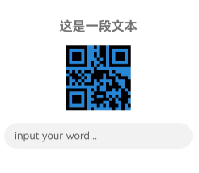
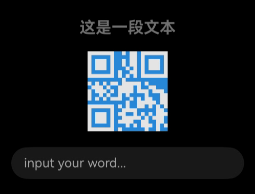

# @ohos.arkui.theme(主题换肤)

更新时间：2026-04-29 07:35:50

来源：https://developer.huawei.com/consumer/cn/doc/harmonyos-references/js-apis-arkui-theme
**支持设备：** Phone / PC/2in1 / Tablet / Wearable / TV

支持自定义主题风格，实现App组件风格跟随Theme切换。


> [!NOTE]
> 本模块首批接口从API version 12开始支持。后续版本的新增接口，采用上角标单独标记接口的起始版本。


## 导入模块
**支持设备：** Phone / PC/2in1 / Tablet / Wearable / TV


```ts
import {
  Theme,
  ThemeControl,
  CustomColors,
  Colors,
  CustomTheme,
  CustomDarkColors,
} from '@kit.ArkUI';
```


## Theme
**支持设备：** Phone / PC/2in1 / Tablet / Wearable / TV

当前生效的主题风格对象，可从[onWillApplyTheme](https://developer.huawei.com/consumer/cn/doc/harmonyos-references/ts-custom-component-lifecycle#onwillapplytheme12)中获取。

**元服务API：** 从API version 12开始，该接口支持在元服务中使用。

**系统能力：** SystemCapability.ArkUI.ArkUI.Full


| 名称 | 类型 | 只读 | 可选 | 说明 |
| --- | --- | --- | --- | --- |
| colors | [Colors](#colors) | 否 | 否 | 主题颜色资源。 |


## Colors
**支持设备：** Phone / PC/2in1 / Tablet / Wearable / TV

主题颜色资源。

**元服务API：** 从API version 12开始，该接口支持在元服务中使用。

**系统能力：** SystemCapability.ArkUI.ArkUI.Full


> [!NOTE]
> 颜色对应的组件可参考[文本色与图标色](https://developer.huawei.com/consumer/cn/doc/design-guides/color-0000001776857164#section137153164914)。


| 名称 | 类型 | 只读 | 可选 | 说明 |
| --- | --- | --- | --- | --- |
| brand | [ResourceColor](https://developer.huawei.com/consumer/cn/doc/harmonyos-references/ts-types#resourcecolor) | 否 | 否 | 品牌色。          影响组件： [TextInput](https://developer.huawei.com/consumer/cn/doc/harmonyos-references/ts-basic-components-textinput)、[Search](https://developer.huawei.com/consumer/cn/doc/harmonyos-references/ts-basic-components-search) |
| warning | [ResourceColor](https://developer.huawei.com/consumer/cn/doc/harmonyos-references/ts-types#resourcecolor) | 否 | 否 | 一级警示色。          影响组件： [TipsDialog](https://developer.huawei.com/consumer/cn/doc/harmonyos-references/ohos-arkui-advanced-dialog#tipsdialog)、[AlertDialog](https://developer.huawei.com/consumer/cn/doc/harmonyos-references/ohos-arkui-advanced-dialog#alertdialog)、[CustomContentDialog](https://developer.huawei.com/consumer/cn/doc/harmonyos-references/ohos-arkui-advanced-dialog#customcontentdialog12)、          [Badge](https://developer.huawei.com/consumer/cn/doc/harmonyos-references/ts-container-badge)、[Button](https://developer.huawei.com/consumer/cn/doc/harmonyos-references/ts-basic-components-button) |
| alert | [ResourceColor](https://developer.huawei.com/consumer/cn/doc/harmonyos-references/ts-types#resourcecolor) | 否 | 否 | 二级提示色。          影响组件： 暂无组件使用。 |
| confirm | [ResourceColor](https://developer.huawei.com/consumer/cn/doc/harmonyos-references/ts-types#resourcecolor) | 否 | 否 | 确认色。          影响组件： 暂无组件使用。 |
| fontPrimary | [ResourceColor](https://developer.huawei.com/consumer/cn/doc/harmonyos-references/ts-types#resourcecolor) | 否 | 否 | 一级文本字体颜色。          影响组件： [EditableTitleBar](https://developer.huawei.com/consumer/cn/doc/harmonyos-references/ohos-arkui-advanced-editabletitlebar)、[LoadingDialog](https://developer.huawei.com/consumer/cn/doc/harmonyos-references/ohos-arkui-advanced-dialog#loadingdialog)、[TipsDialog](https://developer.huawei.com/consumer/cn/doc/harmonyos-references/ohos-arkui-advanced-dialog#tipsdialog)、          [ConfirmDialog](https://developer.huawei.com/consumer/cn/doc/harmonyos-references/ohos-arkui-advanced-dialog#confirmdialog)、[AlertDialog](https://developer.huawei.com/consumer/cn/doc/harmonyos-references/ohos-arkui-advanced-dialog#alertdialog)、[SelectDialog](https://developer.huawei.com/consumer/cn/doc/harmonyos-references/ohos-arkui-advanced-dialog#selectdialog)、          [CustomContentDialog](https://developer.huawei.com/consumer/cn/doc/harmonyos-references/ohos-arkui-advanced-dialog#customcontentdialog12)、[Swiper](https://developer.huawei.com/consumer/cn/doc/harmonyos-references/ts-container-swiper)、[Text](https://developer.huawei.com/consumer/cn/doc/harmonyos-references/ts-basic-components-text)、          [SubHeader](https://developer.huawei.com/consumer/cn/doc/harmonyos-references/ohos-arkui-advanced-subheader)、[ProgressButton](https://developer.huawei.com/consumer/cn/doc/harmonyos-references/ohos-arkui-advanced-progressbutton)、[AlphabetIndexer](https://developer.huawei.com/consumer/cn/doc/harmonyos-references/ts-container-alphabet-indexer)、          [Popup](https://developer.huawei.com/consumer/cn/doc/harmonyos-references/ohos-arkui-advanced-popup)、[Select](https://developer.huawei.com/consumer/cn/doc/harmonyos-references/ts-basic-components-select)、[Chip](https://developer.huawei.com/consumer/cn/doc/harmonyos-references/ohos-arkui-advanced-chip)、          [ToolBar](https://developer.huawei.com/consumer/cn/doc/harmonyos-references/ohos-arkui-advanced-toolbar)、[Menu](https://developer.huawei.com/consumer/cn/doc/harmonyos-references/ts-basic-components-menu)、[TextInput](https://developer.huawei.com/consumer/cn/doc/harmonyos-references/ts-basic-components-textinput)、          [Search](https://developer.huawei.com/consumer/cn/doc/harmonyos-references/ts-basic-components-search)、[Counter](https://developer.huawei.com/consumer/cn/doc/harmonyos-references/ts-container-counter)、[TimePicker](https://developer.huawei.com/consumer/cn/doc/harmonyos-references/ts-basic-components-timepicker)、[DatePicker](https://developer.huawei.com/consumer/cn/doc/harmonyos-references/ts-basic-components-datepicker)、          [TextPicker](https://developer.huawei.com/consumer/cn/doc/harmonyos-references/ts-basic-components-textpicker)、[ComposeListItem](https://developer.huawei.com/consumer/cn/doc/harmonyos-references/ohos-arkui-advanced-composelistitem)、[TreeView](https://developer.huawei.com/consumer/cn/doc/harmonyos-references/ohos-arkui-advanced-treeview) |
| fontSecondary | [ResourceColor](https://developer.huawei.com/consumer/cn/doc/harmonyos-references/ts-types#resourcecolor) | 否 | 否 | 二级文本字体颜色。          影响组件： [EditableTitleBar](https://developer.huawei.com/consumer/cn/doc/harmonyos-references/ohos-arkui-advanced-editabletitlebar)、[AlertDialog](https://developer.huawei.com/consumer/cn/doc/harmonyos-references/ohos-arkui-advanced-dialog#alertdialog)、[CustomContentDialog](https://developer.huawei.com/consumer/cn/doc/harmonyos-references/ohos-arkui-advanced-dialog#customcontentdialog12)、          [SubHeader](https://developer.huawei.com/consumer/cn/doc/harmonyos-references/ohos-arkui-advanced-subheader)、[AlphabetIndexer](https://developer.huawei.com/consumer/cn/doc/harmonyos-references/ts-container-alphabet-indexer)、[Popup](https://developer.huawei.com/consumer/cn/doc/harmonyos-references/ohos-arkui-advanced-popup)、          [TextInput](https://developer.huawei.com/consumer/cn/doc/harmonyos-references/ts-basic-components-textinput)、[Search](https://developer.huawei.com/consumer/cn/doc/harmonyos-references/ts-basic-components-search)、[ComposeListItem](https://developer.huawei.com/consumer/cn/doc/harmonyos-references/ohos-arkui-advanced-composelistitem)、          [TreeView](https://developer.huawei.com/consumer/cn/doc/harmonyos-references/ohos-arkui-advanced-treeview)、[TextClock](https://developer.huawei.com/consumer/cn/doc/harmonyos-references/ts-basic-components-textclock)。 |
| fontTertiary | [ResourceColor](https://developer.huawei.com/consumer/cn/doc/harmonyos-references/ts-types#resourcecolor) | 否 | 否 | 三级文本字体颜色。          影响组件： [ComposeListItem](https://developer.huawei.com/consumer/cn/doc/harmonyos-references/ohos-arkui-advanced-composelistitem) |
| fontFourth | [ResourceColor](https://developer.huawei.com/consumer/cn/doc/harmonyos-references/ts-types#resourcecolor) | 否 | 否 | 四级文本字体颜色。          影响组件： 暂无组件使用。 |
| fontEmphasize | [ResourceColor](https://developer.huawei.com/consumer/cn/doc/harmonyos-references/ts-types#resourcecolor) | 否 | 否 | 高亮字体颜色。          影响组件： [TipsDialog](https://developer.huawei.com/consumer/cn/doc/harmonyos-references/ohos-arkui-advanced-dialog#tipsdialog)、[ConfirmDialog](https://developer.huawei.com/consumer/cn/doc/harmonyos-references/ohos-arkui-advanced-dialog#confirmdialog)、[AlertDialog](https://developer.huawei.com/consumer/cn/doc/harmonyos-references/ohos-arkui-advanced-dialog#alertdialog)、          [SelectDialog](https://developer.huawei.com/consumer/cn/doc/harmonyos-references/ohos-arkui-advanced-dialog#selectdialog)、[CustomContentDialog](https://developer.huawei.com/consumer/cn/doc/harmonyos-references/ohos-arkui-advanced-dialog#customcontentdialog12)、[SubHeader](https://developer.huawei.com/consumer/cn/doc/harmonyos-references/ohos-arkui-advanced-subheader)、          [AlphabetIndexer](https://developer.huawei.com/consumer/cn/doc/harmonyos-references/ts-container-alphabet-indexer)、[Popup](https://developer.huawei.com/consumer/cn/doc/harmonyos-references/ohos-arkui-advanced-popup)、[Button](https://developer.huawei.com/consumer/cn/doc/harmonyos-references/ts-basic-components-button)、          [Select](https://developer.huawei.com/consumer/cn/doc/harmonyos-references/ts-basic-components-select)、[ToolBar](https://developer.huawei.com/consumer/cn/doc/harmonyos-references/ohos-arkui-advanced-toolbar)、[Search](https://developer.huawei.com/consumer/cn/doc/harmonyos-references/ts-basic-components-search)、          [TimePicker](https://developer.huawei.com/consumer/cn/doc/harmonyos-references/ts-basic-components-timepicker)、[DatePicker](https://developer.huawei.com/consumer/cn/doc/harmonyos-references/ts-basic-components-datepicker)、[TextPicker](https://developer.huawei.com/consumer/cn/doc/harmonyos-references/ts-basic-components-textpicker) |
| fontOnPrimary | [ResourceColor](https://developer.huawei.com/consumer/cn/doc/harmonyos-references/ts-types#resourcecolor) | 否 | 否 | 一级文本反转颜色，用于彩色背景。          影响组件： [Badge](https://developer.huawei.com/consumer/cn/doc/harmonyos-references/ts-container-badge)、[Button](https://developer.huawei.com/consumer/cn/doc/harmonyos-references/ts-basic-components-button)、[Chip](https://developer.huawei.com/consumer/cn/doc/harmonyos-references/ohos-arkui-advanced-chip) |
| fontOnSecondary | [ResourceColor](https://developer.huawei.com/consumer/cn/doc/harmonyos-references/ts-types#resourcecolor) | 否 | 否 | 二级文本反转颜色，用于彩色背景。          影响组件： 暂无组件使用。 |
| fontOnTertiary | [ResourceColor](https://developer.huawei.com/consumer/cn/doc/harmonyos-references/ts-types#resourcecolor) | 否 | 否 | 三级文本反转颜色，用于彩色背景。          影响组件： 暂无组件使用。 |
| fontOnFourth | [ResourceColor](https://developer.huawei.com/consumer/cn/doc/harmonyos-references/ts-types#resourcecolor) | 否 | 否 | 四级文本反转颜色，用于彩色背景。          影响组件： 暂无组件使用。 |
| iconPrimary | [ResourceColor](https://developer.huawei.com/consumer/cn/doc/harmonyos-references/ts-types#resourcecolor) | 否 | 否 | 一级图标颜色。          影响组件： [EditableTitleBar](https://developer.huawei.com/consumer/cn/doc/harmonyos-references/ohos-arkui-advanced-editabletitlebar)、[Swiper](https://developer.huawei.com/consumer/cn/doc/harmonyos-references/ts-container-swiper)、[ToolBar](https://developer.huawei.com/consumer/cn/doc/harmonyos-references/ohos-arkui-advanced-toolbar)、          [TreeView](https://developer.huawei.com/consumer/cn/doc/harmonyos-references/ohos-arkui-advanced-treeview) |
| iconSecondary | [ResourceColor](https://developer.huawei.com/consumer/cn/doc/harmonyos-references/ts-types#resourcecolor) | 否 | 否 | 二级图标颜色。          影响组件： [LoadingDialog](https://developer.huawei.com/consumer/cn/doc/harmonyos-references/ohos-arkui-advanced-dialog#loadingdialog)、[SubHeader](https://developer.huawei.com/consumer/cn/doc/harmonyos-references/ohos-arkui-advanced-subheader)、[LoadingProgress](https://developer.huawei.com/consumer/cn/doc/harmonyos-references/ts-basic-components-loadingprogress)、          [Popup](https://developer.huawei.com/consumer/cn/doc/harmonyos-references/ohos-arkui-advanced-popup)、[Chip](https://developer.huawei.com/consumer/cn/doc/harmonyos-references/ohos-arkui-advanced-chip)、[Search](https://developer.huawei.com/consumer/cn/doc/harmonyos-references/ts-basic-components-search)、          [TreeView](https://developer.huawei.com/consumer/cn/doc/harmonyos-references/ohos-arkui-advanced-treeview) |
| iconTertiary | [ResourceColor](https://developer.huawei.com/consumer/cn/doc/harmonyos-references/ts-types#resourcecolor) | 否 | 否 | 三级图标颜色。          影响组件： [SubHeader](https://developer.huawei.com/consumer/cn/doc/harmonyos-references/ohos-arkui-advanced-subheader) |
| iconFourth | [ResourceColor](https://developer.huawei.com/consumer/cn/doc/harmonyos-references/ts-types#resourcecolor) | 否 | 否 | 四级图标颜色。          影响组件： [Checkbox](https://developer.huawei.com/consumer/cn/doc/harmonyos-references/ts-basic-components-checkbox)、[CheckboxGroup](https://developer.huawei.com/consumer/cn/doc/harmonyos-references/ts-basic-components-checkboxgroup)、[Radio](https://developer.huawei.com/consumer/cn/doc/harmonyos-references/ts-basic-components-radio) |
| iconEmphasize | [ResourceColor](https://developer.huawei.com/consumer/cn/doc/harmonyos-references/ts-types#resourcecolor) | 否 | 否 | 高亮图标颜色。          影响组件： [ToolBar](https://developer.huawei.com/consumer/cn/doc/harmonyos-references/ohos-arkui-advanced-toolbar) |
| iconSubEmphasize | [ResourceColor](https://developer.huawei.com/consumer/cn/doc/harmonyos-references/ts-types#resourcecolor) | 否 | 否 | 高亮辅助图标颜色。          影响组件： 暂无组件使用。 |
| iconOnPrimary | [ResourceColor](https://developer.huawei.com/consumer/cn/doc/harmonyos-references/ts-types#resourcecolor) | 否 | 否 | 一级图标反转颜色，用于彩色背景。          影响组件： [Checkbox](https://developer.huawei.com/consumer/cn/doc/harmonyos-references/ts-basic-components-checkbox)、[CheckboxGroup](https://developer.huawei.com/consumer/cn/doc/harmonyos-references/ts-basic-components-checkboxgroup)、[Radio](https://developer.huawei.com/consumer/cn/doc/harmonyos-references/ts-basic-components-radio) |
| iconOnSecondary | [ResourceColor](https://developer.huawei.com/consumer/cn/doc/harmonyos-references/ts-types#resourcecolor) | 否 | 否 | 二级图标反转颜色，用于彩色背景。          影响组件： [Chip](https://developer.huawei.com/consumer/cn/doc/harmonyos-references/ohos-arkui-advanced-chip) |
| iconOnTertiary | [ResourceColor](https://developer.huawei.com/consumer/cn/doc/harmonyos-references/ts-types#resourcecolor) | 否 | 否 | 三级图标反转颜色，用于彩色背景。          影响组件： 暂无组件使用。 |
| iconOnFourth | [ResourceColor](https://developer.huawei.com/consumer/cn/doc/harmonyos-references/ts-types#resourcecolor) | 否 | 否 | 四级图标反转颜色，用于彩色背景。          影响组件： [ProgressButton](https://developer.huawei.com/consumer/cn/doc/harmonyos-references/ohos-arkui-advanced-progressbutton) |
| backgroundPrimary | [ResourceColor](https://developer.huawei.com/consumer/cn/doc/harmonyos-references/ts-types#resourcecolor) | 否 | 否 | 一级背景颜色（实色，不透明）。          影响组件： [TextInput](https://developer.huawei.com/consumer/cn/doc/harmonyos-references/ts-basic-components-textinput)、[QRCode](https://developer.huawei.com/consumer/cn/doc/harmonyos-references/ts-basic-components-qrcode) |
| backgroundSecondary | [ResourceColor](https://developer.huawei.com/consumer/cn/doc/harmonyos-references/ts-types#resourcecolor) | 否 | 否 | 二级背景颜色（实色，不透明）。          影响组件： 暂无组件使用。 |
| backgroundTertiary | [ResourceColor](https://developer.huawei.com/consumer/cn/doc/harmonyos-references/ts-types#resourcecolor) | 否 | 否 | 三级背景颜色（实色，不透明）。          影响组件： 暂无组件使用。 |
| backgroundFourth | [ResourceColor](https://developer.huawei.com/consumer/cn/doc/harmonyos-references/ts-types#resourcecolor) | 否 | 否 | 四级背景颜色（实色，不透明）。          影响组件： 暂无组件使用。 |
| backgroundEmphasize | [ResourceColor](https://developer.huawei.com/consumer/cn/doc/harmonyos-references/ts-types#resourcecolor) | 否 | 否 | 高亮背景颜色（实色，不透明）。          影响组件： [Progress](https://developer.huawei.com/consumer/cn/doc/harmonyos-references/ts-basic-components-progress)、[Button](https://developer.huawei.com/consumer/cn/doc/harmonyos-references/ts-basic-components-button)、[Slider](https://developer.huawei.com/consumer/cn/doc/harmonyos-references/ts-basic-components-slider) |
| compForegroundPrimary | [ResourceColor](https://developer.huawei.com/consumer/cn/doc/harmonyos-references/ts-types#resourcecolor) | 否 | 否 | 前背景。          影响组件： [QRCode](https://developer.huawei.com/consumer/cn/doc/harmonyos-references/ts-basic-components-qrcode) |
| compBackgroundPrimary | [ResourceColor](https://developer.huawei.com/consumer/cn/doc/harmonyos-references/ts-types#resourcecolor) | 否 | 否 | 白色背景。          影响组件： 暂无组件使用。 |
| compBackgroundPrimaryTran | [ResourceColor](https://developer.huawei.com/consumer/cn/doc/harmonyos-references/ts-types#resourcecolor) | 否 | 否 | 白色透明背景。          影响组件： 暂无组件使用。 |
| compBackgroundPrimaryContrary | [ResourceColor](https://developer.huawei.com/consumer/cn/doc/harmonyos-references/ts-types#resourcecolor) | 否 | 否 | 常亮背景。          影响组件： [Toggle](https://developer.huawei.com/consumer/cn/doc/harmonyos-references/ts-basic-components-toggle)、[Slider](https://developer.huawei.com/consumer/cn/doc/harmonyos-references/ts-basic-components-slider) |
| compBackgroundGray | [ResourceColor](https://developer.huawei.com/consumer/cn/doc/harmonyos-references/ts-types#resourcecolor) | 否 | 否 | 灰色背景。          影响组件： 暂无组件使用。 |
| compBackgroundSecondary | [ResourceColor](https://developer.huawei.com/consumer/cn/doc/harmonyos-references/ts-types#resourcecolor) | 否 | 否 | 二级背景。          影响组件： [Swiper](https://developer.huawei.com/consumer/cn/doc/harmonyos-references/ts-container-swiper)、[Slider](https://developer.huawei.com/consumer/cn/doc/harmonyos-references/ts-basic-components-slider) |
| compBackgroundTertiary | [ResourceColor](https://developer.huawei.com/consumer/cn/doc/harmonyos-references/ts-types#resourcecolor) | 否 | 否 | 三级背景。          影响组件： [EditableTitleBar](https://developer.huawei.com/consumer/cn/doc/harmonyos-references/ohos-arkui-advanced-editabletitlebar)、[Progress](https://developer.huawei.com/consumer/cn/doc/harmonyos-references/ts-basic-components-progress)、[AlphabetIndexer](https://developer.huawei.com/consumer/cn/doc/harmonyos-references/ts-container-alphabet-indexer)、          [Button](https://developer.huawei.com/consumer/cn/doc/harmonyos-references/ts-basic-components-button)、[Select](https://developer.huawei.com/consumer/cn/doc/harmonyos-references/ts-basic-components-select)、[Toggle](https://developer.huawei.com/consumer/cn/doc/harmonyos-references/ts-basic-components-toggle)、          [Chip](https://developer.huawei.com/consumer/cn/doc/harmonyos-references/ohos-arkui-advanced-chip)、[TextInput](https://developer.huawei.com/consumer/cn/doc/harmonyos-references/ts-basic-components-textinput)、[Search](https://developer.huawei.com/consumer/cn/doc/harmonyos-references/ts-basic-components-search) |
| compBackgroundEmphasize | [ResourceColor](https://developer.huawei.com/consumer/cn/doc/harmonyos-references/ts-types#resourcecolor) | 否 | 否 | 高亮背景。          影响组件： [Swiper](https://developer.huawei.com/consumer/cn/doc/harmonyos-references/ts-container-swiper)、[Toggle](https://developer.huawei.com/consumer/cn/doc/harmonyos-references/ts-basic-components-toggle)、[Chip](https://developer.huawei.com/consumer/cn/doc/harmonyos-references/ohos-arkui-advanced-chip)、          [Checkbox](https://developer.huawei.com/consumer/cn/doc/harmonyos-references/ts-basic-components-checkbox)、[CheckboxGroup](https://developer.huawei.com/consumer/cn/doc/harmonyos-references/ts-basic-components-checkboxgroup)、[Radio](https://developer.huawei.com/consumer/cn/doc/harmonyos-references/ts-basic-components-radio) |
| compBackgroundNeutral | [ResourceColor](https://developer.huawei.com/consumer/cn/doc/harmonyos-references/ts-types#resourcecolor) | 否 | 否 | 黑色中性高亮背景颜色。          影响组件： [PatternLock](https://developer.huawei.com/consumer/cn/doc/harmonyos-references/ts-basic-components-patternlock) |
| compEmphasizeSecondary | [ResourceColor](https://developer.huawei.com/consumer/cn/doc/harmonyos-references/ts-types#resourcecolor) | 否 | 否 | 20%高亮背景颜色。          影响组件： [Progress](https://developer.huawei.com/consumer/cn/doc/harmonyos-references/ts-basic-components-progress)、[ProgressButton](https://developer.huawei.com/consumer/cn/doc/harmonyos-references/ohos-arkui-advanced-progressbutton)、[AlphabetIndexer](https://developer.huawei.com/consumer/cn/doc/harmonyos-references/ts-container-alphabet-indexer)、          [Select](https://developer.huawei.com/consumer/cn/doc/harmonyos-references/ts-basic-components-select)、[Toggle](https://developer.huawei.com/consumer/cn/doc/harmonyos-references/ts-basic-components-toggle) |
| compEmphasizeTertiary | [ResourceColor](https://developer.huawei.com/consumer/cn/doc/harmonyos-references/ts-types#resourcecolor) | 否 | 否 | 10%高亮背景颜色。          影响组件： 暂无组件使用。 |
| compDivider | [ResourceColor](https://developer.huawei.com/consumer/cn/doc/harmonyos-references/ts-types#resourcecolor) | 否 | 否 | 通用分割线颜色。          影响组件： [SelectDialog](https://developer.huawei.com/consumer/cn/doc/harmonyos-references/ohos-arkui-advanced-dialog#selectdialog)、[PatternLock](https://developer.huawei.com/consumer/cn/doc/harmonyos-references/ts-basic-components-patternlock)、[Divider](https://developer.huawei.com/consumer/cn/doc/harmonyos-references/ts-basic-components-divider) |
| compCommonContrary | [ResourceColor](https://developer.huawei.com/consumer/cn/doc/harmonyos-references/ts-types#resourcecolor) | 否 | 否 | 通用反转颜色。          影响组件： 暂无组件使用。 |
| compBackgroundFocus | [ResourceColor](https://developer.huawei.com/consumer/cn/doc/harmonyos-references/ts-types#resourcecolor) | 否 | 否 | 获焦态背景颜色。          影响组件： 暂无组件使用。 |
| compFocusedPrimary | [ResourceColor](https://developer.huawei.com/consumer/cn/doc/harmonyos-references/ts-types#resourcecolor) | 否 | 否 | 获焦态一级反转颜色。          影响组件： 暂无组件使用。 |
| compFocusedSecondary | [ResourceColor](https://developer.huawei.com/consumer/cn/doc/harmonyos-references/ts-types#resourcecolor) | 否 | 否 | 获焦态二级反转颜色。          影响组件： 暂无组件使用。 |
| compFocusedTertiary | [ResourceColor](https://developer.huawei.com/consumer/cn/doc/harmonyos-references/ts-types#resourcecolor) | 否 | 否 | 获焦态三级反转颜色。          影响组件： [Scroll](https://developer.huawei.com/consumer/cn/doc/harmonyos-references/ts-container-scroll) |
| interactiveHover | [ResourceColor](https://developer.huawei.com/consumer/cn/doc/harmonyos-references/ts-types#resourcecolor) | 否 | 否 | 通用悬停交互式颜色。          影响组件： [EditableTitleBar](https://developer.huawei.com/consumer/cn/doc/harmonyos-references/ohos-arkui-advanced-editabletitlebar)、[Chip](https://developer.huawei.com/consumer/cn/doc/harmonyos-references/ohos-arkui-advanced-chip)、[TreeView](https://developer.huawei.com/consumer/cn/doc/harmonyos-references/ohos-arkui-advanced-treeview) |
| interactivePressed | [ResourceColor](https://developer.huawei.com/consumer/cn/doc/harmonyos-references/ts-types#resourcecolor) | 否 | 否 | 通用按压交互式颜色。          影响组件： [EditableTitleBar](https://developer.huawei.com/consumer/cn/doc/harmonyos-references/ohos-arkui-advanced-editabletitlebar)、[Chip](https://developer.huawei.com/consumer/cn/doc/harmonyos-references/ohos-arkui-advanced-chip)、[TreeView](https://developer.huawei.com/consumer/cn/doc/harmonyos-references/ohos-arkui-advanced-treeview) |
| interactiveFocus | [ResourceColor](https://developer.huawei.com/consumer/cn/doc/harmonyos-references/ts-types#resourcecolor) | 否 | 否 | 通用获焦交互式颜色。          影响组件： [EditableTitleBar](https://developer.huawei.com/consumer/cn/doc/harmonyos-references/ohos-arkui-advanced-editabletitlebar)、[Chip](https://developer.huawei.com/consumer/cn/doc/harmonyos-references/ohos-arkui-advanced-chip)、[TreeView](https://developer.huawei.com/consumer/cn/doc/harmonyos-references/ohos-arkui-advanced-treeview) |
| interactiveActive | [ResourceColor](https://developer.huawei.com/consumer/cn/doc/harmonyos-references/ts-types#resourcecolor) | 否 | 否 | 通用激活交互式颜色。          影响组件： [TreeView](https://developer.huawei.com/consumer/cn/doc/harmonyos-references/ohos-arkui-advanced-treeview) |
| interactiveSelect | [ResourceColor](https://developer.huawei.com/consumer/cn/doc/harmonyos-references/ts-types#resourcecolor) | 否 | 否 | 通用选择交互式颜色。          影响组件： [TreeView](https://developer.huawei.com/consumer/cn/doc/harmonyos-references/ohos-arkui-advanced-treeview) |
| interactiveClick | [ResourceColor](https://developer.huawei.com/consumer/cn/doc/harmonyos-references/ts-types#resourcecolor) | 否 | 否 | 通用点击交互式颜色。          影响组件： 暂无组件使用。 |


## CustomTheme
**支持设备：** Phone / PC/2in1 / Tablet / Wearable / TV

自定义主题风格对象。

**系统能力：** SystemCapability.ArkUI.ArkUI.Full


| 名称 | 类型 | 只读 | 可选 | 说明 |
| --- | --- | --- | --- | --- |
| colors | [CustomColors](#customcolors) | 否 | 是 | 自定义浅色主题颜色资源。          元服务API： 从API version 12开始，该接口支持在元服务中使用。 |
| darkColors20+ | [CustomDarkColors](#customdarkcolors20) | 否 | 是 | 自定义深色主题颜色资源。          说明：如果未设置darkColors，颜色值将与浅色模式下的colors配置相同，并且不会随着颜色模式的变化而变化，除非该颜色是通过dark目录下的资源进行设置的。          元服务API： 从API version 20开始，该接口支持在元服务中使用。 |


## CustomColors
**支持设备：** Phone / PC/2in1 / Tablet / Wearable / TV

type CustomColors = Partial<Colors>

自定义主题颜色资源类型。

**元服务API：** 从API version 12开始，该接口支持在元服务中使用。

**系统能力：** SystemCapability.ArkUI.ArkUI.Full


| 类型 | 说明 |
| --- | --- |
| Partial&lt;[Colors](#colors)&gt; | 自定义主题颜色资源类型。 |


## CustomDarkColors20+
**支持设备：** Phone / PC/2in1 / Tablet / Wearable / TV

type CustomDarkColors = Partial<Colors>

自定义深色主题颜色资源类型。

**元服务API：** 从API version 20开始，该接口支持在元服务中使用。

**系统能力：** SystemCapability.ArkUI.ArkUI.Full


| 类型 | 说明 |
| --- | --- |
| Partial&lt;[Colors](#colors)&gt; | 自定义深色主题颜色资源类型。 |


## ThemeControl
**支持设备：** Phone / PC/2in1 / Tablet / Wearable / TV

ThemeControl将自定义Theme应用于App组件内，实现App组件风格跟随Theme切换。

**元服务API：** 从API version 12开始，该接口支持在元服务中使用。

**系统能力：** SystemCapability.ArkUI.ArkUI.Full


### setDefaultTheme
**支持设备：** Phone / PC/2in1 / Tablet / Wearable / TV

setDefaultTheme(theme: [CustomTheme](#customtheme)): void

将用户自定义Theme设置应用级默认主题，以实现应用风格跟随Theme切换。若在页面中使用此接口设置应用级默认主题，需确保该接口在页面build前执行。若在UIAbility中使用此接口设置应用级默认主题，需确保该接口在onWindowStageCreate阶段里windowStage.[loadContent](https://developer.huawei.com/consumer/cn/doc/harmonyos-references/arkts-apis-window-windowstage#loadcontent9)接口调用完成的回调函数中执行。详细代码可参考[设置应用内组件自定义主题色](https://developer.huawei.com/consumer/cn/doc/harmonyos-guides/theme_skinning#设置应用内组件自定义主题色)。

**元服务API：** 从API version 12开始，该接口支持在元服务中使用。

**系统能力：** SystemCapability.ArkUI.ArkUI.Full

**参数：**


| 参数名 | 类型 | 必填 | 说明 |
| --- | --- | --- | --- |
| theme | [CustomTheme](#customtheme) | 是 | 表示设置的自定义主题风格。 |


**示例**


```ts
import { CustomTheme, CustomColors, ThemeControl } from '@kit.ArkUI';
// 自定义主题颜色
class BlueColors implements CustomColors {
  fontPrimary = "#FF707070";
  backgroundPrimary = "#FF2787D9";
  brand = "#FFEEAAFF"; // 品牌色
}

class PageCustomTheme implements CustomTheme {
  colors?: CustomColors;

  constructor(colors: CustomColors) {
    this.colors = colors;
  }
}
// 创建实例
const BlueColorsTheme = new PageCustomTheme(new BlueColors());
// 在页面build之前执行ThemeControl.setDefaultTheme，设置App默认样式风格为BlueColorsTheme。
ThemeControl.setDefaultTheme(BlueColorsTheme);

@Entry
@Component
struct Index {

  build() {
    Row() {
      Column() {
        // 文本颜色应用fontPrimary
        Text('这是一段文本')
        .fontSize(30)
        .fontWeight(FontWeight.Bold)
        .margin('5%')
        // 二维码背景色应用backgroundPrimary
        QRCode('Hello')
        .width(100)
        .height(100)
        // 输入框光标颜色应用brand
        TextInput({placeholder: 'input your word...'})
        .width('80%')
        .height(40)
        .margin(20)
      }
      .width('100%')
    }
    .height('100%')
  }
}
```




