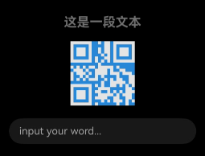

# @ohos.arkui.theme(主题换肤)

更新时间：2026-07-28 11:23:46

来源：https://developer.huawei.com/consumer/cn/doc/harmonyos-references/js-apis-arkui-theme
**支持设备：** Phone | PC/2in1 | Tablet | Wearable | TV

支持自定义主题风格，实现App组件风格跟随Theme切换。

> [!NOTE]
> 本模块首批接口从API version 12开始支持。后续版本的新增接口，采用上角标单独标记接口的起始版本。 本模块接口仅可在Stage模型下使用。


#### 导入模块

**支持设备：** Phone | PC/2in1 | Tablet | Wearable | TV

```text
import { Theme, ThemeControl, CustomColors, Colors, CustomTheme, CustomDarkColors } from '@kit.ArkUI';
```


#### Theme

**支持设备：** Phone | PC/2in1 | Tablet | Wearable | TV

当前生效的主题风格对象，可从[onWillApplyTheme](https://developer.huawei.com/consumer/cn/doc/harmonyos-references/ts-custom-component-lifecycle#onwillapplytheme12)中获取。

**元服务API：** 从API version 12开始，该接口支持在元服务中使用。

**系统能力：** SystemCapability.ArkUI.ArkUI.Full

| 名称 | 类型 | 只读 | 可选 | 说明 |
| --- | --- | --- | --- | --- |
| colors | Colors | 否 | 否 | 主题颜色资源。 |


#### Colors

**支持设备：** Phone | PC/2in1 | Tablet | Wearable | TV

主题颜色资源。

**系统能力：** SystemCapability.ArkUI.ArkUI.Full

> [!NOTE]
> 颜色对应的组件可参考 文本色与图标色 。


| 名称 | 类型 | 只读 | 可选 | 说明 |
| --- | --- | --- | --- | --- |
| brand | ResourceColor | 否 | 否 | 品牌色。当使用ResourceColor中非Resource类型设置该颜色时，backgroundEmphasize、compBackgroundEmphasize、compEmphasizeSecondary、compEmphasizeTertiary、interactiveFocus、interactiveSelect的缺省值会随映射关系发生变化，具体参考对应颜色属性说明。 影响组件： TextInput、Search。 元服务API： 从API version 12开始，该接口支持在元服务中使用。 |
| primary | ResourceColor | 否 | 是 | 主色。默认值undefined，代表不生效primary主题色。从API版本26.0.0开始，当使用ResourceColor中非Resource类型设置该颜色时，fontPrimary、fontSecondary、fontTertiary、fontFourth、iconPrimary、iconSecondary、iconTertiary、iconFourth的缺省值会随映射关系发生变化，具体参考对应颜色属性说明。 影响组件： 暂无组件使用。 起始版本： 26.0.0 元服务API： 从API版本26.0.0开始，该接口支持在元服务中使用。 |
| onPrimary | ResourceColor | 否 | 是 | 主色反转颜色。默认值undefined，代表不生效onPrimary主题色。从API版本26.0.0开始，当使用ResourceColor中非Resource类型设置该颜色时，fontOnPrimary、fontOnSecondary、fontOnTertiary、fontOnFourth、iconOnPrimary、iconOnSecondary、iconOnTertiary、iconOnFourth的缺省值会随映射关系发生变化，具体参考对应颜色属性说明。 影响组件： 暂无组件使用。 起始版本： 26.0.0 元服务API： 从API版本26.0.0开始，该接口支持在元服务中使用。 |
| container | ResourceColor | 否 | 是 | 容器色。默认值undefined，代表不生效container主题色。从API版本26.0.0开始，当使用ResourceColor中非Resource类型设置该颜色时，compBackgroundSecondary、compBackgroundTertiary、compDivider、interactiveHover、interactivePressed、interactiveClick的缺省值会随映射关系发生变化，具体参考对应颜色属性说明。 影响组件： 暂无组件使用。 起始版本： 26.0.0 元服务API： 从API版本26.0.0开始，该接口支持在元服务中使用。 |
| warning | ResourceColor | 否 | 否 | 一级警示色。 影响组件： TipsDialog、AlertDialog、CustomContentDialog、 Badge、Button。 元服务API： 从API version 12开始，该接口支持在元服务中使用。 |
| alert | ResourceColor | 否 | 否 | 二级提示色。 影响组件： 暂无组件使用。 元服务API： 从API version 12开始，该接口支持在元服务中使用。 |
| confirm | ResourceColor | 否 | 否 | 确认色。 影响组件： 暂无组件使用。 元服务API： 从API version 12开始，该接口支持在元服务中使用。 |
| fontPrimary | ResourceColor | 否 | 否 | 一级文本字体颜色。 说明： 从API版本26.0.0开始，当作为CustomColors的属性被使用时，若设置了primary，fontPrimary在浅色模式和深色模式下的缺省值均为primary的颜色值叠加90%透明度。 影响组件： EditableTitleBar、LoadingDialog、TipsDialog、 ConfirmDialog、AlertDialog、SelectDialog、 CustomContentDialog、Swiper、Text、 SubHeader、ProgressButton、AlphabetIndexer、 Popup、Select、Chip、 ToolBar、Menu、TextInput、 Search、TimePicker、DatePicker、 TextPicker、ComposeListItem、TreeView。从API版本26.0.0开始，新增CalendarPicker、UIPickerComponent、RichEditor、MenuItem、MenuItemGroup、Counter。 元服务API： 从API version 12开始，该接口支持在元服务中使用。 |
| fontSecondary | ResourceColor | 否 | 否 | 二级文本字体颜色。 说明： 从API版本26.0.0开始，当作为CustomColors的属性被使用时，若设置了primary，fontSecondary在浅色模式和深色模式下的缺省值均为primary的颜色值叠加60%透明度。 影响组件： EditableTitleBar、AlertDialog、CustomContentDialog、 SubHeader、AlphabetIndexer、Popup、 TextInput、Search、ComposeListItem、 TreeView、TextClock。从API版本26.0.0开始，新增MenuItem、MenuItemGroup。 元服务API： 从API version 12开始，该接口支持在元服务中使用。 |
| fontTertiary | ResourceColor | 否 | 否 | 三级文本字体颜色。 说明： 从API版本26.0.0开始，当作为CustomColors的属性被使用时，若设置了primary，fontTertiary在浅色模式和深色模式下的缺省值均为primary的颜色值叠加40%透明度。 影响组件： ComposeListItem。 元服务API： 从API version 12开始，该接口支持在元服务中使用。 |
| fontFourth | ResourceColor | 否 | 否 | 四级文本字体颜色。 说明： 从API版本26.0.0开始，当作为CustomColors的属性被使用时，若设置了primary，fontFourth在浅色模式和深色模式下的缺省值均为primary的颜色值叠加20%透明度。 影响组件： 暂无组件使用。 元服务API： 从API version 12开始，该接口支持在元服务中使用。 |
| fontEmphasize | ResourceColor | 否 | 否 | 高亮字体颜色。 影响组件： TipsDialog、ConfirmDialog、AlertDialog、 SelectDialog、CustomContentDialog、SubHeader、 AlphabetIndexer、Popup、Button、 Select、ToolBar、Search、 TimePicker、DatePicker、TextPicker。从API版本26.0.0开始，新增RichEditor。 元服务API： 从API version 12开始，该接口支持在元服务中使用。 |
| fontOnPrimary | ResourceColor | 否 | 否 | 一级文本反转颜色，用于彩色背景。 说明： 从API版本26.0.0开始，当作为CustomColors的属性被使用时，若设置了onPrimary，fontOnPrimary在浅色模式和深色模式下的缺省值均为onPrimary的颜色值叠加100%透明度。 影响组件： Badge、Button、Chip。 元服务API： 从API version 12开始，该接口支持在元服务中使用。 |
| fontOnSecondary | ResourceColor | 否 | 否 | 二级文本反转颜色，用于彩色背景。 说明： 从API版本26.0.0开始，当作为CustomColors的属性被使用时，若设置了onPrimary，fontOnSecondary在浅色模式和深色模式下的缺省值均为onPrimary的颜色值叠加60%透明度。 影响组件： 暂无组件使用。 元服务API： 从API version 12开始，该接口支持在元服务中使用。 |
| fontOnTertiary | ResourceColor | 否 | 否 | 三级文本反转颜色，用于彩色背景。 说明： 从API版本26.0.0开始，当作为CustomColors的属性被使用时，若设置了onPrimary，fontOnTertiary在浅色模式和深色模式下的缺省值均为onPrimary的颜色值叠加40%透明度。 影响组件： 暂无组件使用。 元服务API： 从API version 12开始，该接口支持在元服务中使用。 |
| fontOnFourth | ResourceColor | 否 | 否 | 四级文本反转颜色，用于彩色背景。 说明： 从API版本26.0.0开始，当作为CustomColors的属性被使用时，若设置了onPrimary，fontOnFourth在浅色模式和深色模式下的缺省值均为onPrimary的颜色值叠加20%透明度。 影响组件： 暂无组件使用。 元服务API： 从API version 12开始，该接口支持在元服务中使用。 |
| iconPrimary | ResourceColor | 否 | 否 | 一级图标颜色。 说明： 从API版本26.0.0开始，当作为CustomColors的属性被使用时，若设置了primary，iconPrimary在浅色模式和深色模式下的缺省值均为primary的颜色值叠加90%透明度。 影响组件： EditableTitleBar、Swiper、ToolBar、 TreeView。从API版本26.0.0开始，新增MenuItem。 元服务API： 从API version 12开始，该接口支持在元服务中使用。 |
| iconSecondary | ResourceColor | 否 | 否 | 二级图标颜色。 说明： 从API版本26.0.0开始，当作为CustomColors的属性被使用时，若设置了primary，iconSecondary在浅色模式和深色模式下的缺省值均为primary的颜色值叠加60%透明度。 影响组件： LoadingDialog、SubHeader、 Popup、Chip、Search、 TreeView。从API版本26.0.0开始，新增LoadingProgress。 元服务API： 从API version 12开始，该接口支持在元服务中使用。 |
| iconTertiary | ResourceColor | 否 | 否 | 三级图标颜色。 说明： 从API版本26.0.0开始，当作为CustomColors的属性被使用时，若设置了primary，iconTertiary在浅色模式和深色模式下的缺省值均为primary的颜色值叠加40%透明度。 影响组件： SubHeader。 元服务API： 从API version 12开始，该接口支持在元服务中使用。 |
| iconFourth | ResourceColor | 否 | 否 | 四级图标颜色。 说明： 从API版本26.0.0开始，当作为CustomColors的属性被使用时，若设置了primary，iconFourth在浅色模式和深色模式下的缺省值均为primary的颜色值叠加20%透明度。 影响组件： Checkbox、CheckboxGroup、Radio。 元服务API： 从API version 12开始，该接口支持在元服务中使用。 |
| iconEmphasize | ResourceColor | 否 | 否 | 高亮图标颜色。 影响组件： ToolBar。 元服务API： 从API version 12开始，该接口支持在元服务中使用。 |
| iconSubEmphasize | ResourceColor | 否 | 否 | 高亮辅助图标颜色。 影响组件： 暂无组件使用。 元服务API： 从API version 12开始，该接口支持在元服务中使用。 |
| iconOnPrimary | ResourceColor | 否 | 否 | 一级图标反转颜色，用于彩色背景。 说明： 从API版本26.0.0开始，当作为CustomColors的属性被使用时，若设置了onPrimary，iconOnPrimary在浅色模式和深色模式下的缺省值均为onPrimary的颜色值叠加100%透明度。 影响组件： Checkbox、CheckboxGroup、Radio。 元服务API： 从API version 12开始，该接口支持在元服务中使用。 |
| iconOnSecondary | ResourceColor | 否 | 否 | 二级图标反转颜色，用于彩色背景。 说明： 从API版本26.0.0开始，当作为CustomColors的属性被使用时，若设置了onPrimary，iconOnSecondary在浅色模式和深色模式下的缺省值均为onPrimary的颜色值叠加60%透明度。 影响组件： Chip。 元服务API： 从API version 12开始，该接口支持在元服务中使用。 |
| iconOnTertiary | ResourceColor | 否 | 否 | 三级图标反转颜色，用于彩色背景。 说明： 从API版本26.0.0开始，当作为CustomColors的属性被使用时，若设置了onPrimary，iconOnTertiary在浅色模式和深色模式下的缺省值均为onPrimary的颜色值叠加40%透明度。 影响组件： 暂无组件使用。 元服务API： 从API version 12开始，该接口支持在元服务中使用。 |
| iconOnFourth | ResourceColor | 否 | 否 | 四级图标反转颜色，用于彩色背景。 说明： 从API版本26.0.0开始，当作为CustomColors的属性被使用时，若设置了onPrimary，iconOnFourth在浅色模式和深色模式下的缺省值均为onPrimary的颜色值叠加20%透明度。 影响组件： ProgressButton。 元服务API： 从API version 12开始，该接口支持在元服务中使用。 |
| backgroundPrimary | ResourceColor | 否 | 否 | 一级背景颜色（实色，不透明）。 影响组件： TextInput、QRCode。 元服务API： 从API version 12开始，该接口支持在元服务中使用。 |
| backgroundSecondary | ResourceColor | 否 | 否 | 二级背景颜色（实色，不透明）。 影响组件： 暂无组件使用。 元服务API： 从API version 12开始，该接口支持在元服务中使用。 |
| backgroundTertiary | ResourceColor | 否 | 否 | 三级背景颜色（实色，不透明）。 影响组件： 暂无组件使用。 元服务API： 从API version 12开始，该接口支持在元服务中使用。 |
| backgroundFourth | ResourceColor | 否 | 否 | 四级背景颜色（实色，不透明）。 影响组件： 暂无组件使用。 元服务API： 从API version 12开始，该接口支持在元服务中使用。 |
| backgroundEmphasize | ResourceColor | 否 | 否 | 高亮背景颜色（实色，不透明）。 说明： 当作为CustomColors的属性被使用时，若设置了brand，backgroundEmphasize在浅色模式和深色模式下的缺省值均为brand的颜色值叠加100%透明度。 影响组件： Progress、Button、Slider。 元服务API： 从API version 12开始，该接口支持在元服务中使用。 |
| compForegroundPrimary | ResourceColor | 否 | 否 | 前景色。 影响组件： QRCode。 元服务API： 从API version 12开始，该接口支持在元服务中使用。 |
| compBackgroundPrimary | ResourceColor | 否 | 否 | 白色背景。 影响组件： 暂无组件使用。 元服务API： 从API version 12开始，该接口支持在元服务中使用。 |
| compBackgroundPrimaryTran | ResourceColor | 否 | 否 | 白色透明背景。 影响组件： 暂无组件使用。 元服务API： 从API version 12开始，该接口支持在元服务中使用。 |
| compBackgroundPrimaryContrary | ResourceColor | 否 | 否 | 反转背景。 影响组件： Toggle、Slider。 元服务API： 从API version 12开始，该接口支持在元服务中使用。 |
| compBackgroundGray | ResourceColor | 否 | 否 | 灰色背景。 影响组件： 暂无组件使用。 元服务API： 从API version 12开始，该接口支持在元服务中使用。 |
| compBackgroundSecondary | ResourceColor | 否 | 否 | 二级背景。 说明： 从API版本26.0.0开始，当作为CustomColors的属性被使用时，若设置了container，compBackgroundSecondary在浅色模式和深色模式下的缺省值均为container的颜色值叠加10%透明度。 影响组件： Swiper、Slider。 元服务API： 从API version 12开始，该接口支持在元服务中使用。 |
| compBackgroundTertiary | ResourceColor | 否 | 否 | 三级背景。 说明： 从API版本26.0.0开始，当作为CustomColors的属性被使用时，若设置了container，compBackgroundTertiary在浅色模式下的缺省值为container的颜色值叠加5%透明度，在深色模式下的缺省值为container的颜色值叠加10%透明度。 影响组件： EditableTitleBar、Progress、AlphabetIndexer、 Button、Select、Toggle、 Chip、TextInput、Search。从API版本26.0.0开始，新增UIPickerComponent、TextPicker。 元服务API： 从API version 12开始，该接口支持在元服务中使用。 |
| compBackgroundEmphasize | ResourceColor | 否 | 否 | 高亮背景。 说明： 从API版本26.0.0开始，当作为CustomColors的属性被使用时，若设置了brand，compBackgroundEmphasize在浅色模式和深色模式下的缺省值均为brand的颜色值叠加100%透明度。 影响组件： Swiper、Toggle、Chip、 Checkbox、CheckboxGroup、Radio。 元服务API： 从API version 12开始，该接口支持在元服务中使用。 |
| compBackgroundNeutral | ResourceColor | 否 | 否 | 黑色中性高亮背景颜色。 影响组件： PatternLock。 元服务API： 从API version 12开始，该接口支持在元服务中使用。 |
| compEmphasizeSecondary | ResourceColor | 否 | 否 | 20%高亮背景颜色。 说明： 当作为CustomColors的属性被使用时，若设置了brand，compEmphasizeSecondary在浅色模式和深色模式下的缺省值均为brand的颜色值叠加20%透明度。 影响组件： Progress、ProgressButton、AlphabetIndexer、 Select、Toggle。 元服务API： 从API version 12开始，该接口支持在元服务中使用。 |
| compEmphasizeTertiary | ResourceColor | 否 | 否 | 10%高亮背景颜色。 说明： 当作为CustomColors的属性被使用时，若设置了brand，compEmphasizeTertiary在浅色模式和深色模式下的缺省值均为brand的颜色值叠加10%透明度。 影响组件： 暂无组件使用。 元服务API： 从API version 12开始，该接口支持在元服务中使用。 |
| compDivider | ResourceColor | 否 | 否 | 通用分割线颜色。 说明： 从API版本26.0.0开始，当作为CustomColors的属性被使用时，若设置了container，compDivider在浅色模式和深色模式下的缺省值均为container的颜色值叠加20%透明度。 影响组件： SelectDialog、PatternLock、Divider。从API版本26.0.0开始，新增UIPickerComponent、TextPicker、MenuItem、MenuItemGroup、Select。 元服务API： 从API version 12开始，该接口支持在元服务中使用。 |
| compCommonContrary | ResourceColor | 否 | 否 | 通用反转颜色。 影响组件： 暂无组件使用。 元服务API： 从API version 12开始，该接口支持在元服务中使用。 |
| compBackgroundFocus | ResourceColor | 否 | 否 | 获焦态背景颜色。 影响组件： 暂无组件使用。 元服务API： 从API version 12开始，该接口支持在元服务中使用。 |
| compFocusedPrimary | ResourceColor | 否 | 否 | 获焦态一级反转颜色。 影响组件： 暂无组件使用。 元服务API： 从API version 12开始，该接口支持在元服务中使用。 |
| compFocusedSecondary | ResourceColor | 否 | 否 | 获焦态二级反转颜色。 影响组件： 暂无组件使用。 元服务API： 从API version 12开始，该接口支持在元服务中使用。 |
| compFocusedTertiary | ResourceColor | 否 | 否 | 获焦态三级反转颜色。 影响组件： Scroll。 元服务API： 从API version 12开始，该接口支持在元服务中使用。 |
| interactiveHover | ResourceColor | 否 | 否 | 通用悬停交互式颜色。 说明： 从API版本26.0.0开始，当作为CustomColors的属性被使用时，若设置了container，interactiveHover在浅色模式下的缺省值为container的颜色值叠加5%透明度，在深色模式下的缺省值为container的颜色值叠加10%透明度。 影响组件： EditableTitleBar、Chip、TreeView。从API版本26.0.0开始，新增RichEditor、MenuItem、Select。 元服务API： 从API version 12开始，该接口支持在元服务中使用。 |
| interactivePressed | ResourceColor | 否 | 否 | 通用按压交互式颜色。 说明： 从API版本26.0.0开始，当作为CustomColors的属性被使用时，若设置了container，interactivePressed在浅色模式下的缺省值为container的颜色值叠加10%透明度，在深色模式下的缺省值为container的颜色值叠加15%透明度。 影响组件： EditableTitleBar、Chip、TreeView。从API版本26.0.0开始，新增RichEditor。 元服务API： 从API version 12开始，该接口支持在元服务中使用。 |
| interactiveFocus | ResourceColor | 否 | 否 | 通用获焦交互式颜色。 说明： 当作为CustomColors的属性被使用时，若设置了brand，interactiveFocus在浅色模式和深色模式下的缺省值均为brand的颜色值叠加100%透明度。 影响组件： EditableTitleBar、Chip、TreeView。 元服务API： 从API version 12开始，该接口支持在元服务中使用。 |
| interactiveActive | ResourceColor | 否 | 否 | 通用激活交互式颜色。 影响组件： TreeView。 元服务API： 从API version 12开始，该接口支持在元服务中使用。 |
| interactiveSelect | ResourceColor | 否 | 否 | 通用选择交互式颜色。 说明： 当作为CustomColors的属性被使用时，若设置了brand，interactiveSelect在浅色模式和深色模式下的缺省值均为brand的颜色值叠加20%透明度。 影响组件： TreeView。 元服务API： 从API version 12开始，该接口支持在元服务中使用。 |
| interactiveClick | ResourceColor | 否 | 否 | 通用点击交互式颜色。 说明： 从API版本26.0.0开始，当作为CustomColors的属性被使用时，若设置了container，interactiveClick在浅色模式下的缺省值为container的颜色值叠加10%透明度，在深色模式下的缺省值为container的颜色值叠加15%透明度。 影响组件： 从API版本26.0.0开始，新增MenuItem、Select。 元服务API： 从API version 12开始，该接口支持在元服务中使用。 |


#### CustomTheme

**支持设备：** Phone | PC/2in1 | Tablet | Wearable | TV

自定义主题风格对象。

**系统能力：** SystemCapability.ArkUI.ArkUI.Full

| 名称 | 类型 | 只读 | 可选 | 说明 |
| --- | --- | --- | --- | --- |
| colors | CustomColors | 否 | 是 | 自定义浅色主题颜色资源。 元服务API： 从API version 12开始，该接口支持在元服务中使用。 |
| darkColors20+ | CustomDarkColors | 否 | 是 | 自定义深色主题颜色资源。 说明：如果未设置darkColors，则使用浅色模式下的colors配置，并且不会随着系统深浅色模式的切换而变化；如果对应颜色通过dark目录下的资源进行设置，则会优先使用dark目录下的资源。 元服务API： 从API version 20开始，该接口支持在元服务中使用。 |


#### CustomColors

**支持设备：** Phone | PC/2in1 | Tablet | Wearable | TV

type CustomColors = Partial&lt;Colors&gt;

自定义主题颜色资源类型。

**元服务API：** 从API version 12开始，该接口支持在元服务中使用。

**系统能力：** SystemCapability.ArkUI.ArkUI.Full

| 类型 | 说明 |
| --- | --- |
| Partial&lt;Colors&gt; | 自定义主题颜色资源类型。 |


#### CustomDarkColors20+

**支持设备：** Phone | PC/2in1 | Tablet | Wearable | TV

type CustomDarkColors = Partial&lt;Colors&gt;

自定义深色主题颜色资源类型。

**元服务API：** 从API version 20开始，该接口支持在元服务中使用。

**系统能力：** SystemCapability.ArkUI.ArkUI.Full

| 类型 | 说明 |
| --- | --- |
| Partial&lt;Colors&gt; | 自定义深色主题颜色资源类型。 |


#### ThemeControl

**支持设备：** Phone | PC/2in1 | Tablet | Wearable | TV

ThemeControl将自定义Theme应用于App组件内，实现App组件风格跟随Theme切换。

**元服务API：** 从API version 12开始，该接口支持在元服务中使用。

**系统能力：** SystemCapability.ArkUI.ArkUI.Full


#### setDefaultTheme

**支持设备：** Phone | PC/2in1 | Tablet | Wearable | TV

setDefaultTheme(theme: [CustomTheme](#customtheme)): void

将用户自定义Theme设置为应用级默认主题，以实现应用风格跟随Theme切换。若在页面中使用此接口设置应用级默认主题，需确保该接口在页面build前执行。若在UIAbility中使用此接口设置应用级默认主题，需确保该接口在onWindowStageCreate阶段里windowStage.[loadContent](https://developer.huawei.com/consumer/cn/doc/harmonyos-references/arkts-apis-window-windowstage#loadcontent9)接口调用完成的回调函数中执行。详细代码可参考[设置应用内组件自定义主题色](https://developer.huawei.com/consumer/cn/doc/harmonyos-guides/theme_skinning#设置应用内组件自定义主题色)。

**元服务API：** 从API version 12开始，该接口支持在元服务中使用。

**系统能力：** SystemCapability.ArkUI.ArkUI.Full

**参数：**

| 参数名 | 类型 | 必填 | 说明 |
| --- | --- | --- | --- |
| theme | CustomTheme | 是 | 自定义主题风格对象。 |


#### 示例

**支持设备：** Phone | PC/2in1 | Tablet | Wearable | TV


#### 示例1（使用setDefaultTheme）

该示例主要演示[ThemeControl](#themecontrol).[setDefaultTheme](#setdefaulttheme)的使用。

```text
import { CustomTheme, CustomColors, ThemeControl } from '@kit.ArkUI';
// 自定义主题颜色
class BlueColors implements CustomColors {
  fontPrimary = '#FF707070'; // 一级文本字体颜色
  backgroundPrimary = '#FF2787D9'; // 一级背景颜色
  brand = '#FFEEAAFF'; // 品牌色
}

class PageCustomTheme implements CustomTheme {
  colors?: CustomColors;

  constructor(colors: CustomColors) {
    this.colors = colors;
  }
}
// 创建实例
const blueColorsTheme = new PageCustomTheme(new BlueColors());
// 在页面build之前执行ThemeControl.setDefaultTheme，设置App默认样式风格为blueColorsTheme。
ThemeControl.setDefaultTheme(blueColorsTheme);

@Entry
@Component
struct Index {

  build() {
    Row() {
      Column() {
        // 文本颜色应用fontPrimary
        Text('这是一段文本')
          .fontSize(30)
          .fontWeight(FontWeight.Bold)
          .margin('5%')
        // 二维码背景色应用backgroundPrimary
        QRCode('Hello')
          .width(100)
          .height(100)
        // 输入框光标颜色应用brand
        TextInput({placeholder: 'input your word...'})
          .width('80%')
          .height(40)
          .margin(20)
      }
      .width('100%')
    }
    .height('100%')
  }
}
```





#### 示例2（设置组件主题色）

该示例主要演示使用[Colors](#colors)中的brand、primary、onPrimary和container设置组件主题色。

从API版本26.0.0开始，Colors新增primary、onPrimary和container属性。

```text
import { CustomColors } from '@kit.ArkUI';

class AppColors implements CustomColors {
  brand?: ResourceColor;
  primary?: ResourceColor;
  onPrimary?: ResourceColor;
  container?: ResourceColor;

  constructor(brand?: ResourceColor, primary?: ResourceColor, onPrimary?: ResourceColor, container?: ResourceColor) {
    this.brand = brand;
    this.primary = primary;
    this.onPrimary = onPrimary;
    this.container = container;
  }
}

@Entry({ routeName: 'text' })
@Component
struct TextPage {
  @State appColors: AppColors = new AppColors(
    '#ff0000', '#0000ff', '#00ff00', '#ff00ff'
  );
  controller: TextClockController = new TextClockController();
  @State accumulateTime: number = 0;

  build() {
    WithTheme({
      theme: {
        colors: this.appColors
      }
    }) {
      Column({ space: 15 }) {
        Text('11:00:00')
          .fontWeight(FontWeight.Bold)
          .fontSize(30)

        TextClock({ timeZoneOffset: -8, controller: this.controller })
          .format('aa hh:mm:ss')
          .onDateChange((value: number) => {
            this.accumulateTime = value;
          })
          .margin(20)
          .fontSize(30)
          .fontWeight(FontWeight.Bold)
      }
      .width('100%')
      .margin({ top: 30 })
      .padding(16)
    }
  }
}
```


