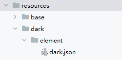
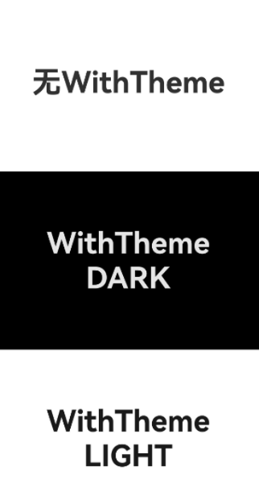
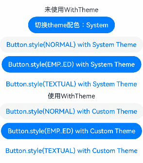

# WithTheme

更新时间：2026-04-29 07:35:50

来源：https://developer.huawei.com/consumer/cn/doc/harmonyos-references/ts-container-with-theme
**支持设备：** Phone / PC/2in1 / Tablet / Wearable / TV

WithTheme组件用于设置应用局部页面自定义主题风格，可设置子组件深浅色模式和自定义配色。


> [!NOTE]
> 该组件从API version 12开始支持。后续版本如有新增内容，则采用上角标单独标记该内容的起始版本。
> WithTheme支持的系统组件如下：[TextInput](https://developer.huawei.com/consumer/cn/doc/harmonyos-references/ts-basic-components-textinput)、[Search](https://developer.huawei.com/consumer/cn/doc/harmonyos-references/ts-basic-components-search)、[Button](https://developer.huawei.com/consumer/cn/doc/harmonyos-references/ts-basic-components-button)、[Badge](https://developer.huawei.com/consumer/cn/doc/harmonyos-references/ts-container-badge)、[Swiper](https://developer.huawei.com/consumer/cn/doc/harmonyos-references/ts-container-swiper)、[Text](https://developer.huawei.com/consumer/cn/doc/harmonyos-references/ts-basic-components-text)、[Select](https://developer.huawei.com/consumer/cn/doc/harmonyos-references/ts-basic-components-select)、[Menu](https://developer.huawei.com/consumer/cn/doc/harmonyos-references/ts-basic-components-menu)、[TimePicker](https://developer.huawei.com/consumer/cn/doc/harmonyos-references/ts-basic-components-timepicker)、[DatePicker](https://developer.huawei.com/consumer/cn/doc/harmonyos-references/ts-basic-components-datepicker)、[TextPicker](https://developer.huawei.com/consumer/cn/doc/harmonyos-references/ts-basic-components-textpicker)、[Checkbox](https://developer.huawei.com/consumer/cn/doc/harmonyos-references/ts-basic-components-checkbox)、[CheckboxGroup](https://developer.huawei.com/consumer/cn/doc/harmonyos-references/ts-basic-components-checkboxgroup)、[Radio](https://developer.huawei.com/consumer/cn/doc/harmonyos-references/ts-basic-components-radio)、[Slider](https://developer.huawei.com/consumer/cn/doc/harmonyos-references/ts-basic-components-slider)、[Progress](https://developer.huawei.com/consumer/cn/doc/harmonyos-references/ts-basic-components-progress)、[QRCode](https://developer.huawei.com/consumer/cn/doc/harmonyos-references/ts-basic-components-qrcode)、[Toggle](https://developer.huawei.com/consumer/cn/doc/harmonyos-references/ts-basic-components-toggle)、[TextClock](https://developer.huawei.com/consumer/cn/doc/harmonyos-references/ts-basic-components-textclock)、[PatternLock](https://developer.huawei.com/consumer/cn/doc/harmonyos-references/ts-basic-components-patternlock)、[Divider](https://developer.huawei.com/consumer/cn/doc/harmonyos-references/ts-basic-components-divider)。
> WithTheme相关使用指导请参考[设置应用内主题换肤](https://developer.huawei.com/consumer/cn/doc/harmonyos-guides/theme_skinning)。


## 子组件
**支持设备：** Phone / PC/2in1 / Tablet / Wearable / TV

支持单个子组件。


## 接口
**支持设备：** Phone / PC/2in1 / Tablet / Wearable / TV

WithTheme(options: WithThemeOptions)

设置应用局部页面自定义主题风格。

**元服务API：** 从API version 12开始，该接口支持在元服务中使用。

**系统能力：** SystemCapability.ArkUI.ArkUI.Full

**参数：**


| 参数名 | 类型 | 必填 | 说明 |
| --- | --- | --- | --- |
| options | [WithThemeOptions](#withthemeoptions) | 是 | 设置作用域内组件配色。 |


## 属性
**支持设备：** Phone / PC/2in1 / Tablet / Wearable / TV

不支持[通用属性](https://developer.huawei.com/consumer/cn/doc/harmonyos-references/ts-component-general-attributes)。


## 事件
**支持设备：** Phone / PC/2in1 / Tablet / Wearable / TV

不支持[通用事件](https://developer.huawei.com/consumer/cn/doc/harmonyos-references/ts-component-general-events)。


## WithThemeOptions
**支持设备：** Phone / PC/2in1 / Tablet / Wearable / TV

设置WithTheme作用域内组件缺省样式及深浅色模式。

**元服务API：** 从API version 12开始，该接口支持在元服务中使用。

**系统能力：** SystemCapability.ArkUI.ArkUI.Full


| 名称 | 类型 | 只读 | 可选 | 说明 |
| --- | --- | --- | --- | --- |
| theme | [CustomTheme](#customtheme) | 否 | 是 | 用于自定义WithTheme作用域内组件缺省配色。          默认值：undefined，缺省样式跟随系统[token默认样式](https://developer.huawei.com/consumer/cn/doc/harmonyos-guides/theme_skinning#系统缺省token色值)。 |
| colorMode | [ThemeColorMode](https://developer.huawei.com/consumer/cn/doc/harmonyos-references/ts-universal-attributes-foreground-blur-style#themecolormode枚举说明) | 否 | 是 | 用于指定WithTheme作用域内组件配色深浅色模式。          默认值：ThemeColorMode.SYSTEM |


## CustomTheme
**支持设备：** Phone / PC/2in1 / Tablet / Wearable / TV

type CustomTheme = CustomTheme

自定义配色。

**元服务API：** 从API version 12开始，该接口支持在元服务中使用。

**系统能力：** SystemCapability.ArkUI.ArkUI.Full


| 类型 | 说明 |
| --- | --- |
| [CustomTheme](https://developer.huawei.com/consumer/cn/doc/harmonyos-references/js-apis-arkui-theme#customtheme) | 自定义WithTheme作用域内组件缺省配色。 |


## 示例
**支持设备：** Phone / PC/2in1 / Tablet / Wearable / TV

设置局部深浅色时，需要添加dark.json资源文件，深浅色模式才会生效。



dark.json数据示例：


```ts
{
  "color": [
  {
    "name": "start_window_background",
    "value": "#000000"
  }
  ]
}
```


### 示例1（指定局部深浅色模式）


```ts
// 指定局部深浅色模式
@Entry
@Component
struct Index {
  build() {
    Column() {
      // 系统默认
      Column() {
        Text('无WithTheme')
        .fontSize(40)
        .fontWeight(FontWeight.Bold)
      }
      .justifyContent(FlexAlign.Center)
      .width('100%')
      .height('33%')
      .backgroundColor($r('app.color.start_window_background'))
      // 设置组件为深色模式
      WithTheme({ colorMode: ThemeColorMode.DARK }) {
        Column() {
          Text('WithTheme')
          .fontSize(40)
          .fontWeight(FontWeight.Bold)
          Text('DARK')
          .fontSize(40)
          .fontWeight(FontWeight.Bold)
        }
        .justifyContent(FlexAlign.Center)
        .width('100%')
        .height('33%')
        .backgroundColor($r('sys.color.background_primary'))
      }
      // 设置组件为浅色模式
      WithTheme({ colorMode: ThemeColorMode.LIGHT }) {
        Column() {
          Text('WithTheme')
          .fontSize(40)
          .fontWeight(FontWeight.Bold)
          Text('LIGHT')
          .fontSize(40)
          .fontWeight(FontWeight.Bold)
        }
        .justifyContent(FlexAlign.Center)
        .width('100%')
        .height('33%')
        .backgroundColor($r('sys.color.background_primary'))
      }
    }
    .height('100%')
    .expandSafeArea([SafeAreaType.SYSTEM], [SafeAreaEdge.TOP, SafeAreaEdge.END, SafeAreaEdge.BOTTOM, SafeAreaEdge.START])
  }
}
```




### 示例2（自定义WithTheme作用域内组件缺省配���）


```ts
// 自定义WithTheme作用域内组件缺省配色
import { CustomTheme, CustomColors } from '@kit.ArkUI';

class GreenColors implements CustomColors {
  fontPrimary = '#ff049404';
  fontEmphasize = '#FF00541F';
  fontOnPrimary = '#FFFFFFFF';
  compBackgroundTertiary = '#1111FF11';
  backgroundEmphasize = '#FF00541F';
  compEmphasizeSecondary = '#3322FF22';
}

class RedColors implements CustomColors {
  fontPrimary = '#fff32b3c';
  fontEmphasize = '#FFD53032';
  fontOnPrimary = '#FFFFFFFF';
  compBackgroundTertiary = '#44FF2222';
  backgroundEmphasize = '#FFD00000';
  compEmphasizeSecondary = '#33FF1111';
}

class PageCustomTheme implements CustomTheme {
  colors?: CustomColors

  constructor(colors: CustomColors) {
    this.colors = colors
  }
}

@Entry
@Component
struct IndexPage {
  static readonly themeCount = 3;
  themeNames: string[] = ['System', 'Custom (green)', 'Custom (red)'];
  themeArray: (CustomTheme | undefined)[] = [
  undefined, // System
  new PageCustomTheme(new GreenColors()),
  new PageCustomTheme(new RedColors())
  ]
  @State themeIndex: number = 0;

  build() {
    Column() {
      Column({ space: '8vp' }) {
        Text(`未使用WithTheme`)
        // 点击按钮切换局部换肤
        Button(`切换theme配色：${this.themeNames[this.themeIndex]}`)
        .onClick(() => {
          this.themeIndex = (this.themeIndex + 1) % IndexPage.themeCount;
        })

        // 系统默认按钮配色
        Button('Button.style(NORMAL) with System Theme')
        .buttonStyle(ButtonStyleMode.NORMAL)
        Button('Button.style(EMP..ED) with System Theme')
        .buttonStyle(ButtonStyleMode.EMPHASIZED)
        Button('Button.style(TEXTUAL) with System Theme')
        .buttonStyle(ButtonStyleMode.TEXTUAL)
      }
      .margin({
        top: '50vp'
      })

      WithTheme({ theme: this.themeArray[this.themeIndex] }) {
        // WithTheme作用域
        Column({ space: '8vp' }) {
          Text(`使用WithTheme`)
          Button('Button.style(NORMAL) with Custom Theme')
          .buttonStyle(ButtonStyleMode.NORMAL)
          Button('Button.style(EMP..ED) with Custom Theme')
          .buttonStyle(ButtonStyleMode.EMPHASIZED)
          Button('Button.style(TEXTUAL) with Custom Theme')
          .buttonStyle(ButtonStyleMode.TEXTUAL)
        }
        .width('100%')
      }
    }
  }
}
```


