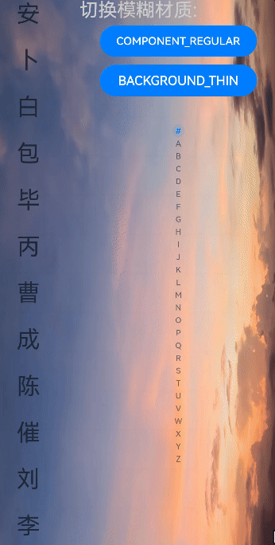
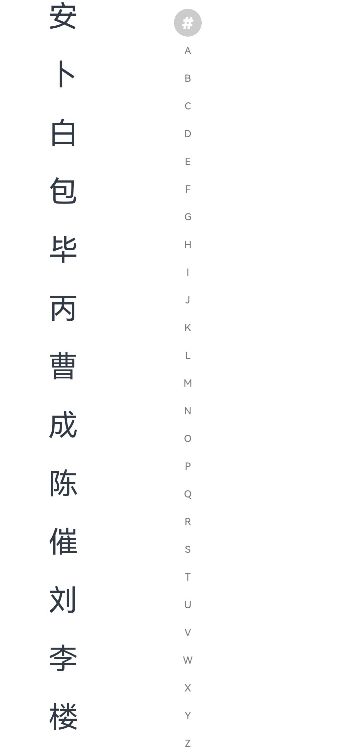

# AlphabetIndexer

更新时间：2026-07-28 11:23:46

来源：https://developer.huawei.com/consumer/cn/doc/harmonyos-references/ts-container-alphabet-indexer
**支持设备：** Phone | PC/2in1 | Tablet | Wearable | TV

可以与容器组件联动，用于按逻辑结构快速定位容器显示区域，适用于通讯录、城市列表、分类列表等需要快速定位内容的场景。

> [!TIP]
> 该组件从API version 7开始支持。后续版本如有新增内容，则采用上角标单独标记该内容的起始版本。 一级索引项：索引条上的字母索引，如'#'、'A'、'B'、'C'等。 二级索引项：提示弹窗中显示的具体内容列表项，通过onRequestPopupData回调返回。 从API version 12开始，触控反馈默认开启；使用前请按 enableHapticFeedback 的说明配置振动权限。


#### 子组件

**支持设备：** Phone | PC/2in1 | Tablet | Wearable | TV

无


#### 接口

**支持设备：** Phone | PC/2in1 | Tablet | Wearable | TV

AlphabetIndexer(options: AlphabetIndexerOptions)

创建索引条组件。

**元服务API：** 从API version 11开始，该接口支持在元服务中使用。

**系统能力：** SystemCapability.ArkUI.ArkUI.Full

**参数：**

| 参数名 | 类型 | 必填 | 说明 |
| --- | --- | --- | --- |
| options | AlphabetIndexerOptions | 是 | 设置索引条组件参数。 |


#### AlphabetIndexerOptions18+对象说明

**支持设备：** Phone | PC/2in1 | Tablet | Wearable | TV

用于设置索引条参数。

> [!NOTE]
> 为规范匿名对象的定义，API 18版本修改了此处的元素定义。其中，保留了历史匿名对象的起始版本信息，会出现外层元素@since版本号高于内层元素版本号的情况，但这不影响接口的使用。


**元服务API：** 从API version 18开始，该接口支持在元服务中使用。

**模型约束：** 此接口仅可在Stage模型下使用。

**系统能力：** SystemCapability.ArkUI.ArkUI.Full

| 名称 | 类型 | 只读 | 可选 | 说明 |
| --- | --- | --- | --- | --- |
| arrayValue7+ | Array&lt;string&gt; | 否 | 否 | 字符串数组，每个字符串代表一个索引项。 元服务API： 从API version 11开始，该接口支持在元服务中使用。 |
| selected7+ | number | 否 | 否 | 初始选中项索引值，若超出索引值范围，则取默认值0。与selected属性同时设置时，selected属性的优先级较高。 取值范围：[0, arrayValue.length-1] 该属性支持$$双向绑定变量。 元服务API： 从API version 11开始，该接口支持在元服务中使用。 |


#### 属性

**支持设备：** Phone | PC/2in1 | Tablet | Wearable | TV

[width](https://developer.huawei.com/consumer/cn/doc/harmonyos-references/ts-universal-attributes-size#width)属性设置"auto"时表示自适应宽度，宽度会随索引项最大宽度变化。

[padding](https://developer.huawei.com/consumer/cn/doc/harmonyos-references/ts-universal-attributes-size#padding)属性默认为4vp。

文本最大的字体缩放倍数[maxFontScale](https://developer.huawei.com/consumer/cn/doc/harmonyos-references/ts-basic-components-text#maxfontscale12)和最小的字体缩放倍数[minFontScale](https://developer.huawei.com/consumer/cn/doc/harmonyos-references/ts-basic-components-text#minfontscale12)皆为1，不跟随系统字体大小调节变化。

除支持[通用属性](https://developer.huawei.com/consumer/cn/doc/harmonyos-references/ts-component-general-attributes)外，还支持以下属性：


#### color

**支持设备：** Phone | PC/2in1 | Tablet | Wearable | TV

color(value: ResourceColor)

设置未选中项文本颜色。

**元服务API：** 从API version 11开始，该接口支持在元服务中使用。

**系统能力：** SystemCapability.ArkUI.ArkUI.Full

**参数：**

| 参数名 | 类型 | 必填 | 说明 |
| --- | --- | --- | --- |
| value | ResourceColor | 是 | 未选中项文本颜色。 默认值：0x99182431，显示为略带透明的深暗蓝色。 |


#### selectedColor

**支持设备：** Phone | PC/2in1 | Tablet | Wearable | TV

selectedColor(value: ResourceColor)

设置选中项文本颜色。

**元服务API：** 从API version 11开始，该接口支持在元服务中使用。

**系统能力：** SystemCapability.ArkUI.ArkUI.Full

**参数：**

| 参数名 | 类型 | 必填 | 说明 |
| --- | --- | --- | --- |
| value | ResourceColor | 是 | 选中项文本颜色。 默认值：0xFF007DFF，显示为不透明的蓝色。 |


#### popupColor

**支持设备：** Phone | PC/2in1 | Tablet | Wearable | TV

popupColor(value: ResourceColor)

设置提示弹窗一级索引项文本颜色。

**元服务API：** 从API version 11开始，该接口支持在元服务中使用。

**系统能力：** SystemCapability.ArkUI.ArkUI.Full

**参数：**

| 参数名 | 类型 | 必填 | 说明 |
| --- | --- | --- | --- |
| value | ResourceColor | 是 | 提示弹窗一级索引项文本颜色。 默认值：0xFF007DFF，显示为不透明的蓝色。 |


#### selectedBackgroundColor

**支持设备：** Phone | PC/2in1 | Tablet | Wearable | TV

selectedBackgroundColor(value: ResourceColor)

设置选中项背景颜色。

**元服务API：** 从API version 11开始，该接口支持在元服务中使用。

**系统能力：** SystemCapability.ArkUI.ArkUI.Full

**参数：**

| 参数名 | 类型 | 必填 | 说明 |
| --- | --- | --- | --- |
| value | ResourceColor | 是 | 选中项背景颜色。 默认值：0x1A007DFF，显示为半透明的蓝色。 |


#### popupBackground

**支持设备：** Phone | PC/2in1 | Tablet | Wearable | TV

popupBackground(value: ResourceColor)

设置提示弹窗背景颜色。

该接口未被主动调用或参数value传入undefined时：

API version 11及以前版本，提示弹窗背景颜色默认为0xFFFFFFFF，显示为白色。

对于API version 12至API version 24版本，默认为#66808080，显示为半透明的灰色。

从API版本26.0.0开始，如果[popupBackground](#popupbackground)和[popupBackgroundBlurStyle](#popupbackgroundblurstyle12)均未被主动调用或参数value传入undefined，高档、中档算力设备默认显示为沉浸式材质[ImmersiveStyle](https://developer.huawei.com/consumer/cn/doc/harmonyos-references/arkts-apis-uimaterial#immersivestyle)的THIN样式，低档算力设备默认显示为白色背景。

如果popupBackgroundBlurStyle被主动调用且参数value传入有效值，提示弹窗背景颜色默认为#66808080，显示为半透明的灰色。

**元服务API：** 从API version 11开始，该接口支持在元服务中使用。

**系统能力：** SystemCapability.ArkUI.ArkUI.Full

**参数：**

| 参数名 | 类型 | 必填 | 说明 |
| --- | --- | --- | --- |
| value | ResourceColor | 是 | 提示弹窗背景颜色。 弹窗的背景模糊材质效果会对背景色产生影响，可通过设置popupBackgroundBlurStyle属性值为NONE关闭背景模糊材质效果。 |


#### usingPopup

**支持设备：** Phone | PC/2in1 | Tablet | Wearable | TV

usingPopup(value: boolean)

设置是否显示提示弹窗。

**元服务API：** 从API version 11开始，该接口支持在元服务中使用。

**系统能力：** SystemCapability.ArkUI.ArkUI.Full

**参数：**

| 参数名 | 类型 | 必填 | 说明 |
| --- | --- | --- | --- |
| value | boolean | 是 | 是否显示提示弹窗。 默认值：false true：显示提示弹窗。 false：不显示提示弹窗。 |


#### selectedFont

**支持设备：** Phone | PC/2in1 | Tablet | Wearable | TV

selectedFont(value: Font)

设置选中项文本样式。

**元服务API：** 从API version 11开始，该接口支持在元服务中使用。

**系统能力：** SystemCapability.ArkUI.ArkUI.Full

**参数：**

| 参数名 | 类型 | 必填 | 说明 |
| --- | --- | --- | --- |
| value | Font | 是 | 选中项文本样式。 默认值： API version 11及以前： { size:'12.0fp', style:FontStyle.Normal, weight:FontWeight.Regular, family:'HarmonyOS Sans' } API version 12及以后： { size:'10.0vp', style:FontStyle.Normal, weight:FontWeight.Medium, family:'HarmonyOS Sans' } |


#### popupFont

**支持设备：** Phone | PC/2in1 | Tablet | Wearable | TV

popupFont(value: Font)

设置提示弹窗一级索引文本样式。

**元服务API：** 从API version 11开始，该接口支持在元服务中使用。

**系统能力：** SystemCapability.ArkUI.ArkUI.Full

**参数：**

| 参数名 | 类型 | 必填 | 说明 |
| --- | --- | --- | --- |
| value | Font | 是 | 提示弹窗一级索引文本样式。 默认值： { size:'24.0vp', style:FontStyle.Normal, weight:FontWeight.Medium, family:'HarmonyOS Sans' } |


#### font

**支持设备：** Phone | PC/2in1 | Tablet | Wearable | TV

font(value: Font)

设置未选中项文本样式。

**元服务API：** 从API version 11开始，该接口支持在元服务中使用。

**系统能力：** SystemCapability.ArkUI.ArkUI.Full

**参数：**

| 参数名 | 类型 | 必填 | 说明 |
| --- | --- | --- | --- |
| value | Font | 是 | 未选中索引项文本样式。 默认值： API version 11及以前： { size:'12.0fp', style:FontStyle.Normal, weight:FontWeight.Regular, family:'HarmonyOS Sans' } API version 12及以后： { size:'10.0vp', style:FontStyle.Normal, weight:FontWeight.Medium, family:'HarmonyOS Sans' } |


#### itemSize

**支持设备：** Phone | PC/2in1 | Tablet | Wearable | TV

itemSize(value: string | number)

设置索引项区域大小。

**元服务API：** 从API version 11开始，该接口支持在元服务中使用。

**系统能力：** SystemCapability.ArkUI.ArkUI.Full

**参数：**

| 参数名 | 类型 | 必填 | 说明 |
| --- | --- | --- | --- |
| value | string \| number | 是 | 索引项区域大小，索引项区域为正方形，即正方形边长。不支持设置为百分比。 实际取值会受到组件尺寸的约束，索引项宽度最大为组件宽度-左右padding，索引项高度最大为（组件高度-上下padding）/索引项个数。传入值小于等于0时，按照默认值处理。 默认值：16.0 单位：vp |


#### alignStyle

**支持设备：** Phone | PC/2in1 | Tablet | Wearable | TV

alignStyle(value: IndexerAlign, offset?: Length)

设置索引条提示弹窗的对齐样式。

**元服务API：** 从API version 11开始，该接口支持在元服务中使用。

**系统能力：** SystemCapability.ArkUI.ArkUI.Full

**参数：**

| 参数名 | 类型 | 必填 | 说明 |
| --- | --- | --- | --- |
| value | IndexerAlign | 是 | 索引条提示弹窗的对齐样式，支持弹窗显示在索引条右侧和左侧。 默认值：IndexerAlign.END |
| offset10+ | Length | 否 | 提示弹窗与索引条之间间距，大于等于0为有效值，在不设置或设置为小于0的情况下间距与popupPosition.x相同。与popupPosition同时设置时，水平方向上offset生效，竖直方向上popupPosition.y生效。 |


#### selected8+

**支持设备：** Phone | PC/2in1 | Tablet | Wearable | TV

selected(index: number)

设置选中项索引值。与[AlphabetIndexerOptions](#alphabetindexeroptions18对象说明)中的selected同时设置时，该属性的优先级更高。

从API version 10开始，该参数支持[$$](https://developer.huawei.com/consumer/cn/doc/harmonyos-guides/arkts-two-way-sync)双向绑定变量。

**元服务API：** 从API version 11开始，该接口支持在元服务中使用。

**系统能力：** SystemCapability.ArkUI.ArkUI.Full

**参数：**

| 参数名 | 类型 | 必填 | 说明 |
| --- | --- | --- | --- |
| index | number | 是 | 选中项索引值。 取值范围：[0, arrayValue.length-1] 若超出索引值范围，则取默认值0。 默认值：0 |


#### popupPosition8+

**支持设备：** Phone | PC/2in1 | Tablet | Wearable | TV

popupPosition(value: Position)

设置提示弹窗相对于索引条上边框中点的位置。

**元服务API：** 从API version 11开始，该接口支持在元服务中使用。

**系统能力：** SystemCapability.ArkUI.ArkUI.Full

**参数：**

| 参数名 | 类型 | 必填 | 说明 |
| --- | --- | --- | --- |
| value | Position | 是 | 提示弹窗相对于索引条上边框中点的位置。与alignStyle同时设置时，水平方向由alignStyle的offset参数控制，竖直方向上value.y生效。 默认值：{x: 60.0, y: 48.0} 单位：vp |


#### popupSelectedColor10+

**支持设备：** Phone | PC/2in1 | Tablet | Wearable | TV

popupSelectedColor(value: ResourceColor)

设置提示弹窗二级索引选中项文本颜色。

**元服务API：** 从API version 11开始，该接口支持在元服务中使用。

**模型约束：** 此接口仅可在Stage模型下使用。

**系统能力：** SystemCapability.ArkUI.ArkUI.Full

**参数：**

| 参数名 | 类型 | 必填 | 说明 |
| --- | --- | --- | --- |
| value | ResourceColor | 是 | 提示弹窗二级索引选中项文本颜色。 默认值：#FF182431，显示为深暗蓝色。 |


#### popupUnselectedColor10+

**支持设备：** Phone | PC/2in1 | Tablet | Wearable | TV

popupUnselectedColor(value: ResourceColor)

设置提示弹窗二级索引未选中项文本颜色。

**元服务API：** 从API version 11开始，该接口支持在元服务中使用。

**模型约束：** 此接口仅可在Stage模型下使用。

**系统能力：** SystemCapability.ArkUI.ArkUI.Full

**参数：**

| 参数名 | 类型 | 必填 | 说明 |
| --- | --- | --- | --- |
| value | ResourceColor | 是 | 提示弹窗二级索引未选中项文本颜色。 默认值：#FF182431，显示为深暗蓝色。 |


#### popupItemFont10+

**支持设备：** Phone | PC/2in1 | Tablet | Wearable | TV

popupItemFont(value: Font)

设置提示弹窗二级索引项文本样式。

**元服务API：** 从API version 11开始，该接口支持在元服务中使用。

**模型约束：** 此接口仅可在Stage模型下使用。

**系统能力：** SystemCapability.ArkUI.ArkUI.Full

**参数：**

| 参数名 | 类型 | 必填 | 说明 |
| --- | --- | --- | --- |
| value | Font | 是 | 提示弹窗二级索引项文本样式。 默认值： { size:24, weight:FontWeight.Medium } |


#### popupItemBackgroundColor10+

**支持设备：** Phone | PC/2in1 | Tablet | Wearable | TV

popupItemBackgroundColor(value: ResourceColor)

设置提示弹窗二级索引项背景颜色。

**元服务API：** 从API version 11开始，该接口支持在元服务中使用。

**模型约束：** 此接口仅可在Stage模型下使用。

**系统能力：** SystemCapability.ArkUI.ArkUI.Full

**参数：**

| 参数名 | 类型 | 必填 | 说明 |
| --- | --- | --- | --- |
| value | ResourceColor | 是 | 提示弹窗二级索引项背景颜色。 默认值： API version 11及以前：#FFFFFFFF，显示为白色。 API version 12及以后：#00000000，显示为透明色。 |


#### autoCollapse11+

**支持设备：** Phone | PC/2in1 | Tablet | Wearable | TV

autoCollapse(value: boolean)

设置是否使用自适应折叠模式。

如果索引项第一项为“#”，当除去第一项后剩余索引项数量 <= 9时，选择全显示模式（所有索引项完整显示）；9 < 剩余索引项数量 <= 13时，根据索引条高度自适应选择全显示模式或者短折叠模式；剩余索引项数量 > 13时，根据索引条高度自适应选择短折叠模式或者长折叠模式。

如果索引项第一项不为“#”，当所有索引项数量 <= 9时，选择全显示模式（所有索引项完整显示）；9 < 所有索引项数量 <= 13时，根据索引条高度自适应选择全显示模式或者短折叠模式；所有索引项数量 > 13时，根据索引条高度自适应选择短折叠模式或者长折叠模式。

> [!NOTE]
> 从API version 12开始，该接口支持在 attributeModifier 中调用。


**元服务API：** 从API version 12开始，该接口支持在元服务中使用。

**模型约束：** 此接口仅可在Stage模型下使用。

**系统能力：** SystemCapability.ArkUI.ArkUI.Full

**参数：**

| 参数名 | 类型 | 必填 | 说明 |
| --- | --- | --- | --- |
| value | boolean | 是 | 是否使用自适应折叠模式。 默认值： API version 12之前：false API version 12及之后：true true：使用自适应折叠模式。 false：不使用自适应折叠模式。 |


#### popupItemBorderRadius12+

**支持设备：** Phone | PC/2in1 | Tablet | Wearable | TV

popupItemBorderRadius(value: number)

设置提示弹窗索引项背板圆角半径。

**元服务API：** 从API version 12开始，该接口支持在元服务中使用。

**模型约束：** 此接口仅可在Stage模型下使用。

**系统能力：** SystemCapability.ArkUI.ArkUI.Full

**参数：**

| 参数名 | 类型 | 必填 | 说明 |
| --- | --- | --- | --- |
| value | number | 是 | 设置提示弹窗索引项背板圆角半径。 默认值：24vp 不支持百分比，小于0时按照0设置。 提示弹窗背板圆角自适应变化（索引项圆角半径+4vp）。 |


#### itemBorderRadius12+

**支持设备：** Phone | PC/2in1 | Tablet | Wearable | TV

itemBorderRadius(value: number)

设置索引项背板圆角半径。

**元服务API：** 从API version 12开始，该接口支持在元服务中使用。

**模型约束：** 此接口仅可在Stage模型下使用。

**系统能力：** SystemCapability.ArkUI.ArkUI.Full

**参数：**

| 参数名 | 类型 | 必填 | 说明 |
| --- | --- | --- | --- |
| value | number | 是 | 设置索引项背板圆角半径。 默认值：8vp 不支持百分比，小于0时按照0设置。 索引条背板圆角自适应变化（索引项圆角半径+4vp）。 |


#### popupBackgroundBlurStyle12+

**支持设备：** Phone | PC/2in1 | Tablet | Wearable | TV

popupBackgroundBlurStyle(value: BlurStyle)

设置提示弹窗的背景模糊材质。API版本26.0.0之前版本，未通过该接口设置时，默认为组件普通材质模糊，对应取值为BlurStyle中的COMPONENT_REGULAR。从API版本26.0.0开始，[popupBackground](#popupbackground)和popupBackgroundBlurStyle均未被主动调用或者传入undefined时，在高算力、中算力设备默认显示为沉浸式材质[ImmersiveStyle](https://developer.huawei.com/consumer/cn/doc/harmonyos-references/arkts-apis-uimaterial#immersivestyle)的THICK样式，低算力设备默认显示为白色背景。

**元服务API：** 从API version 12开始，该接口支持在元服务中使用。

**模型约束：** 此接口仅可在Stage模型下使用。

**系统能力：** SystemCapability.ArkUI.ArkUI.Full

**参数：**

| 参数名 | 类型 | 必填 | 说明 |
| --- | --- | --- | --- |
| value | BlurStyle | 是 | 设置提示弹窗的背景模糊材质。 弹窗的背景模糊材质效果会对背景色popupBackground产生影响，可通过设置属性值为NONE关闭背景模糊材质效果。 |


#### popupTitleBackground12+

**支持设备：** Phone | PC/2in1 | Tablet | Wearable | TV

popupTitleBackground(value: ResourceColor)

设置提示弹窗一级索引项背景颜色。

**元服务API：** 从API version 12开始，该接口支持在元服务中使用。

**模型约束：** 此接口仅可在Stage模型下使用。

**系统能力：** SystemCapability.ArkUI.ArkUI.Full

**参数：**

| 参数名 | 类型 | 必填 | 说明 |
| --- | --- | --- | --- |
| value | ResourceColor | 是 | 设置提示弹窗一级索引项背景颜色。 默认值： 提示弹窗只有一个索引项：#00FFFFFF。 提示弹窗有多个索引项：#0c182431。 |


#### enableHapticFeedback12+

**支持设备：** Phone | PC/2in1 | Tablet | Wearable | TV

enableHapticFeedback(value: boolean)

设置是否开启触控反馈。开启后，在手指触摸或滑动选中索引项时会触发振动反馈。

**元服务API：** 从API version 12开始，该接口支持在元服务中使用。

**模型约束：** 此接口仅可在Stage模型下使用。

**系统能力：** SystemCapability.ArkUI.ArkUI.Full

**参数：**

| 参数名 | 类型 | 必填 | 说明 |
| --- | --- | --- | --- |
| value | boolean | 是 | 是否支持触控反馈。 true：支持触控反馈。 false：不支持触控反馈。 默认值：true 开启触控反馈时，需要在工程的module.json5中配置requestPermissions字段开启振动权限，配置如下： "requestPermissions": [{"name": "ohos.permission.VIBRATE"}] |


#### IndexerAlign枚举说明

**支持设备：** Phone | PC/2in1 | Tablet | Wearable | TV

索引条提示弹窗的对齐样式枚举。

**系统能力：** SystemCapability.ArkUI.ArkUI.Full

| 名称 | 值 | 说明 |
| --- | --- | --- |
| Left | 0 | 提示弹窗显示在索引条右侧。 元服务API： 从API version 11开始，该接口支持在元服务中使用。 |
| Right | 1 | 提示弹窗显示在索引条左侧。 元服务API： 从API version 11开始，该接口支持在元服务中使用。 |
| START12+ | 2 | 在从左到右（LTR）场景下，提示弹窗显示在索引条右侧的位置。在RTL场景下，提示弹窗显示在索引条左侧的位置。 元服务API： 从API version 12开始，该接口支持在元服务中使用。 模型约束： 此接口仅可在Stage模型下使用。 |
| END12+ | 3 | 在从左到右（LTR）场景下，提示弹窗显示在索引条左侧的位置。在RTL场景下，提示弹窗显示在索引条右侧的位置。 元服务API： 从API version 12开始，该接口支持在元服务中使用。 模型约束： 此接口仅可在Stage模型下使用。 |


#### 事件

**支持设备：** Phone | PC/2in1 | Tablet | Wearable | TV

除支持[通用事件](https://developer.huawei.com/consumer/cn/doc/harmonyos-references/ts-component-general-events)外，还支持以下事件：


#### onSelected(deprecated)

**支持设备：** Phone | PC/2in1 | Tablet | Wearable | TV

onSelected(callback: (index: number) => void)

注册索引项选中事件回调，回调参数为当前选中项索引。

> [!NOTE]
> 从API version 7开始支持，从API version 8开始废弃，建议使用 onSelect 替代。


**系统能力：** SystemCapability.ArkUI.ArkUI.Full

**参数：**

| 参数名 | 类型 | 必填 | 说明 |
| --- | --- | --- | --- |
| index | number | 是 | 当前选中的索引。 |


#### onSelect8+

**支持设备：** Phone | PC/2in1 | Tablet | Wearable | TV

onSelect(callback: OnAlphabetIndexerSelectCallback)

索引项选中事件，回调参数为当前选中项索引。

**元服务API：** 从API version 11开始，该接口支持在元服务中使用。

**系统能力：** SystemCapability.ArkUI.ArkUI.Full

**参数：**

| 参数名 | 类型 | 必填 | 说明 |
| --- | --- | --- | --- |
| callback | OnAlphabetIndexerSelectCallback | 是 | 回调函数，用于处理索引项选中事件。 |


#### onRequestPopupData8+

**支持设备：** Phone | PC/2in1 | Tablet | Wearable | TV

onRequestPopupData(callback: OnAlphabetIndexerRequestPopupDataCallback)

设置提示弹窗二级索引项内容事件，回调参数为当前选中项索引，回调返回值为提示弹窗需显示的二级索引项内容。

**元服务API：** 从API version 11开始，该接口支持在元服务中使用。

**系统能力：** SystemCapability.ArkUI.ArkUI.Full

**参数：**

| 参数名 | 类型 | 必填 | 说明 |
| --- | --- | --- | --- |
| callback | OnAlphabetIndexerRequestPopupDataCallback | 是 | 回调函数，用于提供提示弹窗二级索引项内容。需先设置usingPopup为true。 |


#### onPopupSelect8+

**支持设备：** Phone | PC/2in1 | Tablet | Wearable | TV

onPopupSelect(callback: OnAlphabetIndexerPopupSelectCallback)

提示弹窗二级索引选中事件，回调参数为当前选中二级索引项索引。仅在[usingPopup](#usingpopup)为true时触发。

**元服务API：** 从API version 11开始，该接口支持在元服务中使用。

**系统能力：** SystemCapability.ArkUI.ArkUI.Full

**参数：**

| 参数名 | 类型 | 必填 | 说明 |
| --- | --- | --- | --- |
| callback | OnAlphabetIndexerPopupSelectCallback | 是 | 回调函数，用于处理提示弹窗二级索引选中事件。需先设置usingPopup为true。 |


#### OnAlphabetIndexerSelectCallback18+

**支持设备：** Phone | PC/2in1 | Tablet | Wearable | TV

type OnAlphabetIndexerSelectCallback = (index: number) => void

索引项被选中时触发的事件。

**元服务API：** 从API version 18开始，该接口支持在元服务中使用。

**模型约束：** 此接口仅可在Stage模型下使用。

**系统能力：** SystemCapability.ArkUI.ArkUI.Full

**参数：**

| 参数名 | 类型 | 必填 | 说明 |
| --- | --- | --- | --- |
| index | number | 是 | 当前选中索引项的索引。 |


#### OnAlphabetIndexerPopupSelectCallback18+

**支持设备：** Phone | PC/2in1 | Tablet | Wearable | TV

type OnAlphabetIndexerPopupSelectCallback = (index: number) => void

提示弹窗二级索引项被选中时触发的事件。

**元服务API：** 从API version 18开始，该接口支持在元服务中使用。

**模型约束：** 此接口仅可在Stage模型下使用。

**系统能力：** SystemCapability.ArkUI.ArkUI.Full

**参数：**

| 参数名 | 类型 | 必填 | 说明 |
| --- | --- | --- | --- |
| index | number | 是 | 当前选中的提示弹窗二级索引项的索引。 |


#### OnAlphabetIndexerRequestPopupDataCallback18+

**支持设备：** Phone | PC/2in1 | Tablet | Wearable | TV

type OnAlphabetIndexerRequestPopupDataCallback = (index: number) => Array&lt;string&gt;

[usingPopup](#usingpopup)设置值为true，索引项被选中时触发的事件。

**元服务API：** 从API version 18开始，该接口支持在元服务中使用。

**模型约束：** 此接口仅可在Stage模型下使用。

**系统能力：** SystemCapability.ArkUI.ArkUI.Full

**参数：**

| 参数名 | 类型 | 必填 | 说明 |
| --- | --- | --- | --- |
| index | number | 是 | 当前选中索引项的索引。 |


**返回值：**

| 类型 | 说明 |
| --- | --- |
| Array&lt;string&gt; | 索引项对应的提示弹窗二级索引字符串数组，此字符串数组在弹窗中竖排显示，字符串列表最多显示5个，超出部分可以滑动显示。 |


#### 示例

**支持设备：** Phone | PC/2in1 | Tablet | Wearable | TV


#### 示例1（设置提示弹窗显示文本内容）

通过[onRequestPopupData](#onrequestpopupdata8)事件自定义提示弹窗显示文本内容。

```ArkTS
// xxx.ets
@Entry
@Component
struct AlphabetIndexerSample {
  private arrayA: string[] = ['安'];
  private arrayB: string[] = ['卜', '白', '包', '毕', '丙'];
  private arrayC: string[] = ['曹', '成', '陈', '催'];
  private arrayL: string[] = ['刘', '李', '楼', '梁', '雷', '吕', '柳', '卢'];
  private value: string[] = ['#', 'A', 'B', 'C', 'D', 'E', 'F', 'G',
    'H', 'I', 'J', 'K', 'L', 'M', 'N',
    'O', 'P', 'Q', 'R', 'S', 'T', 'U',
    'V', 'W', 'X', 'Y', 'Z'];

  build() {
    Stack({ alignContent: Alignment.Start }) {
      Row() {
        List({ space: 20, initialIndex: 0 }) {
          ForEach(this.arrayA, (item: string) => {
            ListItem() {
              Text(item)
                .width('80%')
                .height('5%')
                .fontSize(30)
                .textAlign(TextAlign.Center)
            }
          }, (item: string) => item)

          ForEach(this.arrayB, (item: string) => {
            ListItem() {
              Text(item)
                .width('80%')
                .height('5%')
                .fontSize(30)
                .textAlign(TextAlign.Center)
            }
          }, (item: string) => item)

          ForEach(this.arrayC, (item: string) => {
            ListItem() {
              Text(item)
                .width('80%')
                .height('5%')
                .fontSize(30)
                .textAlign(TextAlign.Center)
            }
          }, (item: string) => item)

          ForEach(this.arrayL, (item: string) => {
            ListItem() {
              Text(item)
                .width('80%')
                .height('5%')
                .fontSize(30)
                .textAlign(TextAlign.Center)
            }
          }, (item: string) => item)
        }
        .width('50%')
        .height('100%')

        AlphabetIndexer({ arrayValue: this.value, selected: 0 })
          .autoCollapse(false) // 关闭自适应折叠模式
          .enableHapticFeedback(false) // 关闭触控反馈
          .selectedColor(0xFFFFFF) // 选中项文本颜色
          .popupColor(0xFFFAF0) // 提示弹窗一级索引文本颜色
          .selectedBackgroundColor(0xCCCCCC) // 选中项背景颜色
          .popupBackground(0xD2B48C) // 提示弹窗背景颜色
          .usingPopup(true) // 索引项被选中时显示提示弹窗
          .selectedFont({ size: 16, weight: FontWeight.Bolder }) // 选中项文本样式
          .popupFont({ size: 30, weight: FontWeight.Bolder }) // 提示弹窗一级索引的文本样式
          .itemSize(28) // 索引项的尺寸大小
          .alignStyle(IndexerAlign.Left) // 提示弹窗在索引条右侧弹出
          .popupItemBorderRadius(24) // 设置提示弹窗索引项背板圆角半径
          .itemBorderRadius(14) // 设置索引项背板圆角半径
          .popupBackgroundBlurStyle(BlurStyle.NONE) // 设置提示弹窗的背景模糊材质
          .popupTitleBackground(0xCCCCCC) // 设置提示弹窗一级索引项背景颜色
          .popupSelectedColor(0x00FF00) // 提示弹窗二级索引选中项文本颜色
          .popupUnselectedColor(0x0000FF) // 提示弹窗二级索引未选中项文本颜色
          .popupItemFont({ size: 30, style: FontStyle.Normal }) // 提示弹窗二级索引项文本样式
          .popupItemBackgroundColor(0xCCCCCC) // 提示弹窗二级索引项背景颜色
          .onSelect((index: number) => {
            console.info(this.value[index] + ' Selected!');
          })
          .onRequestPopupData((index: number) => {
            // 当选中A时，提示弹窗里面的二级索引文本列表显示A对应的列表arrayA，选中B、C、L时也同样
            // 选中其余索引项时，提示弹窗二级索引文本列表为空，提示弹窗会只显示一级索引项
            if (this.value[index] == 'A') {
              return this.arrayA;
            } else if (this.value[index] == 'B') {
              return this.arrayB;
            } else if (this.value[index] == 'C') {
              return this.arrayC;
            } else if (this.value[index] == 'L') {
              return this.arrayL;
            } else {
              return [];
            }
          })
          .onPopupSelect((index: number) => {
            console.info('onPopupSelected:' + index);
          })
      }
      .width('100%')
      .height('100%')
    }
  }
}
```





#### 示例2（开启自适应折叠模式）

通过[autoCollapse](#autocollapse11)属性开启自适应折叠模式。

```ArkTS
// xxx.ets
@Entry
@Component
struct AlphabetIndexerSample {
  private arrayA: string[] = ['安'];
  private arrayB: string[] = ['卜', '白', '包', '毕', '丙'];
  private arrayC: string[] = ['曹', '成', '陈', '催'];
  private arrayJ: string[] = ['嘉', '贾'];
  private value: string[] = ['#', 'A', 'B', 'C', 'D', 'E', 'F', 'G',
    'H', 'I', 'J', 'K', 'L', 'M', 'N',
    'O', 'P', 'Q', 'R', 'S', 'T', 'U',
    'V', 'W', 'X', 'Y', 'Z'];
  @State isNeedAutoCollapse: boolean = false;
  @State indexerHeight: string = '75%';

  build() {
    Stack({ alignContent: Alignment.Start }) {
      Row() {
        List({ space: 20, initialIndex: 0 }) {
          ForEach(this.arrayA, (item: string) => {
            ListItem() {
              Text(item)
                .width('80%')
                .height('5%')
                .fontSize(30)
                .textAlign(TextAlign.Center)
            }
          }, (item: string) => item)

          ForEach(this.arrayB, (item: string) => {
            ListItem() {
              Text(item)
                .width('80%')
                .height('5%')
                .fontSize(30)
                .textAlign(TextAlign.Center)
            }
          }, (item: string) => item)

          ForEach(this.arrayC, (item: string) => {
            ListItem() {
              Text(item)
                .width('80%')
                .height('5%')
                .fontSize(30)
                .textAlign(TextAlign.Center)
            }
          }, (item: string) => item)

          ForEach(this.arrayJ, (item: string) => {
            ListItem() {
              Text(item)
                .width('80%')
                .height('5%')
                .fontSize(30)
                .textAlign(TextAlign.Center)
            }
          }, (item: string) => item)
        }
        .width('50%')
        .height('100%')

        Column() {
          Column() {
            AlphabetIndexer({ arrayValue: this.value, selected: 0 })
              .autoCollapse(this.isNeedAutoCollapse) // 开启或关闭自适应折叠模式
              .height(this.indexerHeight) // 索引条高度
              .enableHapticFeedback(false) // 关闭触控反馈
              .selectedColor(0xFFFFFF) // 选中项文本颜色
              .popupColor(0xFFFAF0) // 提示弹窗一级索引文本颜色
              .selectedBackgroundColor(0xCCCCCC) // 选中项背景颜色
              .popupBackground(0xD2B48C) // 提示弹窗背景颜色
              .usingPopup(true) // 索引项被选中时显示提示弹窗
              .selectedFont({ size: 16, weight: FontWeight.Bolder }) // 选中项文本样式
              .popupFont({ size: 30, weight: FontWeight.Bolder }) // 提示弹窗一级索引的文本样式
              .itemSize(28) // 每一项的尺寸大小
              .alignStyle(IndexerAlign.Right) // 提示弹窗在索引条左侧弹出
              .popupTitleBackground(0xD2B48C) // 设置提示弹窗一级索引项背景颜色
              .popupSelectedColor(0x00FF00) // 提示弹窗二级索引选中项文本颜色
              .popupUnselectedColor(0x0000FF) // 提示弹窗二级索引未选中项文本颜色
              .popupItemFont({ size: 30, style: FontStyle.Normal }) // 提示弹窗二级索引项文本样式
              .popupItemBackgroundColor(0xCCCCCC) // 提示弹窗二级索引项背景颜色
              .onSelect((index: number) => {
                console.info(this.value[index] + ' Selected!');
              })
              .onRequestPopupData((index: number) => {
                // 当选中A时，提示弹窗里面的二级索引文本列表显示A对应的列表arrayA，选中B、C、J时也同样
                // 选中其余索引项时，提示弹窗二级索引文本列表为空，提示弹窗会只显示一级索引项
                if (this.value[index] == 'A') {
                  return this.arrayA;
                } else if (this.value[index] == 'B') {
                  return this.arrayB;
                } else if (this.value[index] == 'C') {
                  return this.arrayC;
                } else if (this.value[index] == 'J') {
                  return this.arrayJ;
                } else {
                  return [];
                }
              })
              .onPopupSelect((index: number) => {
                console.info('onPopupSelected:' + index);
              })
          }
          .height('80%')
          .justifyContent(FlexAlign.Center)

          Column() {
            Button('切换成折叠模式')
              .margin('5vp')
              .onClick(() => {
                this.isNeedAutoCollapse = true;
              })
            Button('切换索引条高度到30%')
              .margin('5vp')
              .onClick(() => {
                this.indexerHeight = '30%';
              })
            Button('切换索引条高度到70%')
              .margin('5vp')
              .onClick(() => {
                this.indexerHeight = '70%';
              })
          }.height('20%')
        }
        .width('50%')
        .justifyContent(FlexAlign.Center)
      }
      .width('100%')
      .height(720)
    }
  }
}
```





#### 示例3（设置提示弹窗背景模糊材质）

通过[popupBackgroundBlurStyle](#popupbackgroundblurstyle12)属性实现提示弹窗的背景模糊效果。

```ArkTS
// xxx.ets
@Entry
@Component
struct AlphabetIndexerSample {
  private arrayA: string[] = ['安'];
  private arrayB: string[] = ['卜', '白', '包', '毕', '丙'];
  private arrayC: string[] = ['曹', '成', '陈', '催'];
  private arrayL: string[] = ['刘', '李', '楼', '梁', '雷', '吕', '柳', '卢'];
  private value: string[] = ['#', 'A', 'B', 'C', 'D', 'E', 'F', 'G',
    'H', 'I', 'J', 'K', 'L', 'M', 'N',
    'O', 'P', 'Q', 'R', 'S', 'T', 'U',
    'V', 'W', 'X', 'Y', 'Z'];
  @State customBlurStyle: BlurStyle = BlurStyle.NONE;

  build() {
    Stack({ alignContent: Alignment.Start }) {
      Row() {
        List({ space: 20, initialIndex: 0 }) {
          ForEach(this.arrayA, (item: string) => {
            ListItem() {
              Text(item)
                .width('80%')
                .height('5%')
                .fontSize(30)
                .textAlign(TextAlign.Center)
            }
          }, (item: string) => item)

          ForEach(this.arrayB, (item: string) => {
            ListItem() {
              Text(item)
                .width('80%')
                .height('5%')
                .fontSize(30)
                .textAlign(TextAlign.Center)
            }
          }, (item: string) => item)

          ForEach(this.arrayC, (item: string) => {
            ListItem() {
              Text(item)
                .width('80%')
                .height('5%')
                .fontSize(30)
                .textAlign(TextAlign.Center)
            }
          }, (item: string) => item)

          ForEach(this.arrayL, (item: string) => {
            ListItem() {
              Text(item)
                .width('80%')
                .height('5%')
                .fontSize(30)
                .textAlign(TextAlign.Center)
            }
          }, (item: string) => item)
        }
        .width('30%')
        .height('100%')

        Column() {
          Column() {
            Text('切换模糊材质: ')
              .fontSize(24)
              .fontColor(0xcccccc)
              .width('100%')
            Button('COMPONENT_REGULAR')
              .margin('5vp')
              .width(200)
              .onClick(() => {
                this.customBlurStyle = BlurStyle.COMPONENT_REGULAR;
              })
            Button('BACKGROUND_THIN')
              .margin('5vp')
              .width(200)
              .onClick(() => {
                this.customBlurStyle = BlurStyle.BACKGROUND_THIN;
              })
          }.height('20%')

          Column() {
            AlphabetIndexer({ arrayValue: this.value, selected: 0 })
              .usingPopup(true) // 索引项被选中时显示提示弹窗
              .alignStyle(IndexerAlign.Left) // 提示弹窗在索引条右侧弹出
              .popupItemBorderRadius(24) // 设置提示弹窗索引项背板圆角半径
              .itemBorderRadius(14) // 设置索引项背板圆角半径
              .popupBackgroundBlurStyle(this.customBlurStyle) // 设置提示弹窗的背景模糊材质
              .popupTitleBackground(0xCCCCCC) // 设置提示弹窗一级索引项背景颜色
              .onSelect((index: number) => {
                console.info(this.value[index] + ' Selected!');
              })
              .onRequestPopupData((index: number) => {
                // 当选中A时，提示弹窗里面的二级索引文本列表显示A对应的列表arrayA，选中B、C、L时也同样
                // 选中其余索引项时，提示弹窗二级索引文本列表为空，提示弹窗会只显示一级索引项
                if (this.value[index] == 'A') {
                  return this.arrayA;
                } else if (this.value[index] == 'B') {
                  return this.arrayB;
                } else if (this.value[index] == 'C') {
                  return this.arrayC;
                } else if (this.value[index] == 'L') {
                  return this.arrayL;
                } else {
                  return [];
                }
              })
              .onPopupSelect((index: number) => {
                console.info('onPopupSelected:' + index);
              })
          }
          .height('80%')
        }
        .width('70%')
      }
      .width('100%')
      .height('100%')
      // $r('app.media.image')需要替换为开发者所需的图像资源文件。
      .backgroundImage($r("app.media.image"))
    }
  }
}
```


