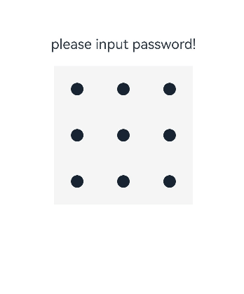
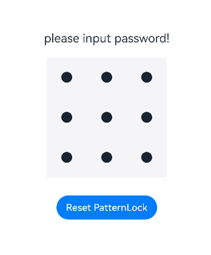

# PatternLock

更新时间：2026-03-09 02:50:43

来源：https://developer.huawei.com/consumer/cn/doc/harmonyos-references/ts-basic-components-patternlock
**支持设备：** Phone / PC/2in1 / Tablet / Wearable / TV

图案密码锁组件，以九宫格图案的方式输入密码，用于密码验证场景。手指在PatternLock组件区域按下时开始进入输入状态，手指离开屏幕时结束输入状态完成密码输入。


## 子组件
**支持设备：** Phone / PC/2in1 / Tablet / Wearable / TV

无


## 接口
**支持设备：** Phone / PC/2in1 / Tablet / Wearable / TV

PatternLock(controller?: PatternLockController)

创建图案密码锁组件。

**元服务API：** 从API version 12开始，该接口支持在元服务中使用。

**系统能力：** SystemCapability.ArkUI.ArkUI.Full

**参数：**


| 参数名 | 类型 | 必填 | 说明 |
| --- | --- | --- | --- |
| controller | [PatternLockController](#patternlockcontroller) | 否 | 设置PatternLock组件控制器，可用于控制组件状态重置。 |


## 属性
**支持设备：** Phone / PC/2in1 / Tablet / Wearable / TV

除支持[通用属性](https://developer.huawei.com/consumer/cn/doc/harmonyos-references/ts-component-general-attributes)外，还支持以下属性：


### sideLength
**支持设备：** Phone / PC/2in1 / Tablet / Wearable / TV

sideLength(value: Length)

设置组件的宽度和高度（宽高相同）。当设置为0或负数时，组件不显示。


> [!NOTE]
> PatternLock组件设置了通用属性宽高比[aspectRatio](https://developer.huawei.com/consumer/cn/doc/harmonyos-references/ts-universal-attributes-layout-constraints#aspectratio)，且不等于1时（组件尺寸被设定为长方形），九宫格依然绘制为正方形（超出组件范围）。

**元服务API：** 从API version 12开始，该接口支持在元服务中使用。

**系统能力：** SystemCapability.ArkUI.ArkUI.Full

**参数：**


| 参数名 | 类型 | 必填 | 说明 |
| --- | --- | --- | --- |
| value | [Length](https://developer.huawei.com/consumer/cn/doc/harmonyos-references/ts-types#length) | 是 | 组件的宽度和高度。默认值：288vp |


### circleRadius
**支持设备：** Phone / PC/2in1 / Tablet / Wearable / TV

circleRadius(value: Length)

设置宫格中圆点的半径。设置为0或负数时，取默认值。

**元服务API：** 从API version 12开始，该接口支持在元服务中使用。

**系统能力：** SystemCapability.ArkUI.ArkUI.Full

**参数：**


| 参数名 | 类型 | 必填 | 说明 |
| --- | --- | --- | --- |
| value | [Length](https://developer.huawei.com/consumer/cn/doc/harmonyos-references/ts-types#length) | 是 | 宫格中圆点的半径。          默认值：6vp          取值范围：(0, sideLength/11]。设置小于等于0的值时，按默认值处理；超过最大值时，按最大值处理。 |


### backgroundColor
**支持设备：** Phone / PC/2in1 / Tablet / Wearable / TV

backgroundColor(value: ResourceColor)

设置背景颜色。


> [!NOTE]
> 从API version 20开始，该接口支持在[attributeModifier](https://developer.huawei.com/consumer/cn/doc/harmonyos-references/ts-universal-attributes-attribute-modifier#attributemodifier)中调用。

**元服务API：** 从API version 12开始，该接口支持在元服务中使用。

**系统能力：** SystemCapability.ArkUI.ArkUI.Full

**参数：**


| 参数名 | 类型 | 必填 | 说明 |
| --- | --- | --- | --- |
| value | [ResourceColor](https://developer.huawei.com/consumer/cn/doc/harmonyos-references/ts-types#resourcecolor) | 是 | 背景颜色。 |


### regularColor
**支持设备：** Phone / PC/2in1 / Tablet / Wearable / TV

regularColor(value: ResourceColor)

设置宫格圆点在“未选中”状态的填充颜色。

**元服务API：** 从API version 12开始，该接口支持在元服务中使用。

**系统能力：** SystemCapability.ArkUI.ArkUI.Full

**参数：**


| 参数名 | 类型 | 必填 | 说明 |
| --- | --- | --- | --- |
| value | [ResourceColor](https://developer.huawei.com/consumer/cn/doc/harmonyos-references/ts-types#resourcecolor) | 是 | 宫格圆点在“未选中”状态的填充颜色。          默认值：'#ff182431' |


### selectedColor
**支持设备：** Phone / PC/2in1 / Tablet / Wearable / TV

selectedColor(value: ResourceColor)

设置宫格圆点在“选中”状态的填充颜色。

**元服务API：** 从API version 12开始，该接口支持在元服务中使用。

**系统能力：** SystemCapability.ArkUI.ArkUI.Full

**参数：**


| 参数名 | 类型 | 必填 | 说明 |
| --- | --- | --- | --- |
| value | [ResourceColor](https://developer.huawei.com/consumer/cn/doc/harmonyos-references/ts-types#resourcecolor) | 是 | 宫格圆点在“选中”状态的填充颜色。          默认值：'#ff182431' |


### activeColor
**支持设备：** Phone / PC/2in1 / Tablet / Wearable / TV

activeColor(value: ResourceColor)

设置宫格圆点在“激活”状态的填充颜色，“激活”状态为手指经过圆点但还未选中的状态。

**元服务API：** 从API version 12开始，该接口支持在元服务中使用。

**系统能力：** SystemCapability.ArkUI.ArkUI.Full

**参数：**


| 参数名 | 类型 | 必填 | 说明 |
| --- | --- | --- | --- |
| value | [ResourceColor](https://developer.huawei.com/consumer/cn/doc/harmonyos-references/ts-types#resourcecolor) | 是 | 宫格圆点在“激活”状态的填充颜色。          默认值：'#ff182431' |


### pathColor
**支持设备：** Phone / PC/2in1 / Tablet / Wearable / TV

pathColor(value: ResourceColor)

设置连线的颜色。

**元服务API：** 从API version 12开始，该接口支持在元服务中使用。

**系统能力：** SystemCapability.ArkUI.ArkUI.Full

**参数：**


| 参数名 | 类型 | 必填 | 说明 |
| --- | --- | --- | --- |
| value | [ResourceColor](https://developer.huawei.com/consumer/cn/doc/harmonyos-references/ts-types#resourcecolor) | 是 | 连线的颜色。          默认值：'#33182431' |


### pathStrokeWidth
**支持设备：** Phone / PC/2in1 / Tablet / Wearable / TV

pathStrokeWidth(value: number | string)

设置连线的宽度。设置为0或负数时连线不显示。

**元服务API：** 从API version 12开始，该接口支持在元服务中使用。

**系统能力：** SystemCapability.ArkUI.ArkUI.Full

**参数：**


| 参数名 | 类型 | 必填 | 说明 |
| --- | --- | --- | --- |
| value | number \| string | 是 | 连线的宽度。          默认值：12vp          取值范围：(0, sideLength/3]，设置为0或负数时连线不显示，超过最大值按最大值处理。 |


### autoReset
**支持设备：** Phone / PC/2in1 / Tablet / Wearable / TV

autoReset(value: boolean)

设置在完成密码输入后再次在组件区域按下时是否重置组件状态。

**元服务API：** 从API version 12开始，该接口支持在元服务中使用。

**系统能力：** SystemCapability.ArkUI.ArkUI.Full

**参数：**


| 参数名 | 类型 | 必填 | 说明 |
| --- | --- | --- | --- |
| value | boolean | 是 | 在完成密码输入后再次在组件区域按下时是否重置组件状态。          true：完成密码输入后再次在组件区域按下时重置组件状态（即清除之前输入的密码）；false：完成密码输入后再次在组件区域按下时不重置组件状态。          默认值：true |


### activateCircleStyle12+
**支持设备：** Phone / PC/2in1 / Tablet / Wearable / TV

activateCircleStyle(options: Optional<CircleStyleOptions>)

设置宫格圆点在“激活”状态下的背景圆环样式。

**元服务API：** 从API version 12开始，该接口支持在元服务中使用。

**系统能力：** SystemCapability.ArkUI.ArkUI.Full

**参数：**


| 参数名 | 类型 | 必填 | 说明 |
| --- | --- | --- | --- |
| options | Optional&lt;[CircleStyleOptions](#circlestyleoptions12对象说明)&gt; | 是 | 宫格圆点在“激活”状态的背景圆环样式。 |


### skipUnselectedPoint15+
**支持设备：** Phone / PC/2in1 / Tablet / Wearable / TV

skipUnselectedPoint(skipped: boolean)

设置未选中的宫格圆点在密码路径经过时是否自动选中。

**元服务API：** 从API version 15开始，该接口支持在元服务中使用。

**系统能力：** SystemCapability.ArkUI.ArkUI.Full

**参数：**


| 参数名 | 类型 | 必填 | 说明 |
| --- | --- | --- | --- |
| skipped | boolean | 是 | 未选中的宫格圆点在密码路径经过时是否自动选中。          true：跳过选中密码路径经过的宫格圆点；false：自动选中密码路径经过的宫格圆点。默认值：false。 |


## 事件
**支持设备：** Phone / PC/2in1 / Tablet / Wearable / TV

除支持[通用事件](https://developer.huawei.com/consumer/cn/doc/harmonyos-references/ts-component-general-events)外，还支持以下事件：


### onPatternComplete
**支持设备：** Phone / PC/2in1 / Tablet / Wearable / TV

onPatternComplete(callback: (input: Array<number>) => void)

密码输入结束时触发该回调。

**元服务API：** 从API version 12开始，该接口支持在元服务中使用。

**系统能力：** SystemCapability.ArkUI.ArkUI.Full

**参数：**


| 参数名 | 类型 | 必填 | 说明 |
| --- | --- | --- | --- |
| input | Array&lt;number&gt; | 是 | 与选中宫格圆点顺序一致的数字数组，每个数字表示选中宫格圆点的索引值（第一行圆点从左往右依次为0、1、2，第二行圆点从左往右依次为3、4、5，第三行圆点从左往右依次为6、7、8）。 |


### onDotConnect11+
**支持设备：** Phone / PC/2in1 / Tablet / Wearable / TV

onDotConnect(callback: [Callback](https://developer.huawei.com/consumer/cn/doc/harmonyos-references/js-apis-base#callback)<number>)

密码输入选中宫格圆点时触发该回调。

回调参数为选中宫格圆点顺序的数字，数字为选中宫格圆点的索引值（第一行圆点从左往右依次为0、1、2，第二行圆点从左往右依次为3、4、5，第三行圆点从左往右依次为6、7、8）。


> [!NOTE]
> 从API version 20开始，该接口支持在[attributeModifier](https://developer.huawei.com/consumer/cn/doc/harmonyos-references/ts-universal-attributes-attribute-modifier#attributemodifier)中调用。

**元服务API：** 从API version 12开始，该接口支持在元服务中使用。

**系统能力：** SystemCapability.ArkUI.ArkUI.Full

**参数：**


| 参数名 | 类型 | 必填 | 说明 |
| --- | --- | --- | --- |
| callback | [Callback](https://developer.huawei.com/consumer/cn/doc/harmonyos-references/js-apis-base#callback)&lt;number&gt; | 是 | 密码输入选中宫格圆点时触发该回调。 |


## CircleStyleOptions12+对象说明
**支持设备：** Phone / PC/2in1 / Tablet / Wearable / TV

圆环样式的参数说明。

**系统能力：** SystemCapability.ArkUI.ArkUI.Full


| 名称 | 类型 | 只读 | 可选 | 说明 |
| --- | --- | --- | --- | --- |
| color | [ResourceColor](https://developer.huawei.com/consumer/cn/doc/harmonyos-references/ts-types#resourcecolor) | 否 | 是 | 背景圆环颜色。          默认值：'#33182431'。          元服务API： 从API version 12开始，该接口支持在元服务中使用。 |
| radius | [LengthMetrics](https://developer.huawei.com/consumer/cn/doc/harmonyos-references/js-apis-arkui-graphics#lengthmetrics12) | 否 | 是 | 背景圆环的半径。          默认值：[circleRadius](#circleradius)的1.833倍（即11/6）。          元服务API： 从API version 12开始，该接口支持在元服务中使用。 |
| enableWaveEffect | boolean | 否 | 是 | 选中宫格圆点后的波浪效果开关。          true：显示波浪效果；false：不显示波浪效果。          默认值：true。          元服务API： 从API version 12开始，该接口支持在元服务中使用。 |
| enableForeground15+ | boolean | 否 | 是 | 背景圆环是否显示在宫格圆点上层。          true：背景圆环显示在宫格圆点上层，遮盖宫格圆点；false：背景圆环显示在宫格圆点下层，不遮盖宫格圆点。          默认值：false。          元服务API： 从API version 15开始，该接口支持在元服务中使用。 |


## PatternLockController
**支持设备：** Phone / PC/2in1 / Tablet / Wearable / TV

PatternLock组件的控制器，用于重置组件状态。


### 导入对象


```ts
let patternLockController: PatternLockController = new PatternLockController();
```


### constructor
**支持设备：** Phone / PC/2in1 / Tablet / Wearable / TV

constructor()

PatternLockController的构造函数。

**元服务API：** 从API version 12开始，该接口支持在元服务中使用。

**系统能力：** SystemCapability.ArkUI.ArkUI.Full


### reset
**支持设备：** Phone / PC/2in1 / Tablet / Wearable / TV

reset()

重置组件状态。

**元服务API：** 从API version 12开始，该接口支持在元服务中使用。

**系统能力：** SystemCapability.ArkUI.ArkUI.Full


### setChallengeResult11+
**支持设备：** Phone / PC/2in1 / Tablet / Wearable / TV

setChallengeResult(result: PatternLockChallengeResult): void

设置图案密码的正确或错误状态。

**元服务API：** 从API version 12开始，该接口支持在元服务中使用。

**系统能力：** SystemCapability.ArkUI.ArkUI.Full

**参数：**


| 参数名 | 类型 | 必填 | 说明 |
| --- | --- | --- | --- |
| result | [PatternLockChallengeResult](#patternlockchallengeresult11枚举说明) | 是 | 图案密码状态。包括正确和错误状态。 |


## PatternLockChallengeResult11+枚举说明
**支持设备：** Phone / PC/2in1 / Tablet / Wearable / TV

图案密码状态。

**元服务API：** 从API version 12开始，该接口支持在元服务中使用。

**系统能力：** SystemCapability.ArkUI.ArkUI.Full


| 名称 | 值 | 说明 |
| --- | --- | --- |
| CORRECT | 1 | 图案密码正确。 |
| WRONG | 2 | 图案密码错误。 |


## 示例
**支持设备：** Phone / PC/2in1 / Tablet / Wearable / TV


### 示例1（创建图案密码锁）

该示例展示了PatternLock组件的基本使用方法。


```ts
// xxx.ets
@Entry
@Component
struct PatternLockExample {
  @State passwords: number[] = [];
  @State message: string = 'please input password!';
  private patternLockController: PatternLockController = new PatternLockController();

  build() {
    Column() {
      Text(this.message).textAlign(TextAlign.Center).margin(20).fontSize(20)
      PatternLock(this.patternLockController)
      .sideLength(200)
      .circleRadius(9)
      .pathStrokeWidth(5)
      .activeColor('#707070')
      .selectedColor('#707070')
      .pathColor('#707070')
      .backgroundColor('#F5F5F5')
      .regularColor(Color.Black)
      .skipUnselectedPoint(false)
      .autoReset(true)
      .onDotConnect((index: number) => {
        console.info('onDotConnect index: ' + index);
      })
    }.width('100%').height('100%')
  }
}
```




### 示例2（判断密码是否正确）

该示例通过[sideLength](#sidelength)属性设置九宫格的大小、[circleRadius](#circleradius)属性设置宫格圆点样式、[onPatternComplete](#onpatterncomplete)属性设置密码输入时的回调。

当用户密码输入完成后，按输入的密码不同，给予不同的回应：输入的密码长度小于5时，提示重新输入；第一次输入完成后，提示第二次输入密码；第二次输入完成后，判断两次输入的密码是否相同，相同则提示密码设置成功，否则提示重新输入。

通过'Reset PatternLock'按钮，用户可以重置密码锁。


```ts
// xxx.ets
import { LengthUnit } from '@kit.ArkUI';

@Entry
@Component
struct PatternLockExample {
  @State passwords: number[] = [];
  @State message: string = 'please input password!';
  private patternLockController: PatternLockController = new PatternLockController();

  build() {
    Column() {
      Text(this.message).textAlign(TextAlign.Center).margin(20).fontSize(20)
      PatternLock(this.patternLockController)
      .sideLength(200)
      .circleRadius(9)
      .pathStrokeWidth(5)
      .activeColor('#707070')
      .selectedColor('#707070')
      .pathColor('#707070')
      .backgroundColor('#F5F5F5')
      .autoReset(true)
      .activateCircleStyle({
        color: '#707070',
        radius: { value: 16, unit: LengthUnit.VP },
        enableWaveEffect: true
      })
      .onDotConnect((index: number) => {
        console.info('onDotConnect index: ' + index);
      })
      .onPatternComplete((input: Array<number>) => {
        // 输入的密码长度小于5时，提示重新输入
        if (input.length < 5) {
          this.message = 'The password length needs to be greater than 5, please enter again.';
          return;
        }
        // 判断密码长度是否大于0
        if (this.passwords.length > 0) {
          // 判断两次输入的密码是否相同，相同则提示密码设置成功，否则提示重新输入
          if (this.passwords.toString() === input.toString()) {
            this.passwords = input;
            this.message = 'Set password successfully: ' + this.passwords.toString();
            this.patternLockController.setChallengeResult(PatternLockChallengeResult.CORRECT);
          } else {
            this.message = 'Inconsistent passwords, please enter again.';
            this.patternLockController.setChallengeResult(PatternLockChallengeResult.WRONG);
          }
        } else {
          // 提示第二次输入密码
          this.passwords = input;
          this.message = 'Please enter again.';
        }
      })
      Button('Reset PatternLock').margin(30).onClick(() => {
        // 重置密码锁
        this.patternLockController.reset();
        this.passwords = [];
        this.message = 'Please input password';
      })
    }.width('100%').height('100%')
  }
}
```


