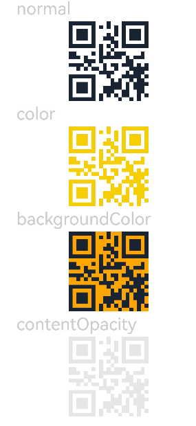

# QRCode

更新时间：2026-04-28 03:31:56

来源：https://developer.huawei.com/consumer/cn/doc/harmonyos-references/ts-basic-components-qrcode
**支持设备：** Phone / PC/2in1 / Tablet / Wearable / TV

用于显示单个二维码的组件。


> [!NOTE]
> 该组件当前仅支持生成二维码，涉及扫码的业务场景，推荐使用[Scan Kit（统一扫码服务）](https://developer.huawei.com/consumer/cn/doc/harmonyos-guides/scan-kit-guide)。


## 子组件
**支持设备：** Phone / PC/2in1 / Tablet / Wearable / TV

无


## 接口
**支持设备：** Phone / PC/2in1 / Tablet / Wearable / TV

QRCode(value: ResourceStr)

创建二维码组件，通过扫描组件显示的二维码图案可以获取二维码中包含的字符串信息。

**卡片能力：** 从API version 9开始，该接口支持在ArkTS卡片中使用。

**元服务API：** 从API version 11开始，该接口支持在元服务中使用。

**系统能力：** SystemCapability.ArkUI.ArkUI.Full

**参数：**


| 参数名 | 类型 | 必填 | 说明 |
| --- | --- | --- | --- |
| value | [ResourceStr](https://developer.huawei.com/consumer/cn/doc/harmonyos-references/ts-types#resourcestr) | 是 | 二维码内容字符串。最大支持512个字符，若超出，则截取前512个字符。  从API version 20开始，支持Resource类型。  说明：  设置为null时与设置字符串“null”效果一致；设置为undefined时与设置字符串“undefined”效果一致；当传入空字符串时，将生成无效二维码。 |


## 属性
**支持设备：** Phone / PC/2in1 / Tablet / Wearable / TV

除支持[通用属性](https://developer.huawei.com/consumer/cn/doc/harmonyos-references/ts-component-general-attributes)外，还支持以下属性：


### color
**支持设备：** Phone / PC/2in1 / Tablet / Wearable / TV

color(value: ResourceColor)

设置二维码颜色。

**卡片能力：** 从API version 9开始，该接口支持在ArkTS卡片中使用。

**元服务API：** 从API version 11开始，该接口支持在元服务中使用。

**系统能力：** SystemCapability.ArkUI.ArkUI.Full

**参数：**


| 参数名 | 类型 | 必填 | 说明 |
| --- | --- | --- | --- |
| value | [ResourceColor](https://developer.huawei.com/consumer/cn/doc/harmonyos-references/ts-types#resourcecolor) | 是 | 二维码颜色。默认值：'#ff000000'，且不跟随系统深浅色模式切换而修改。 |


### backgroundColor
**支持设备：** Phone / PC/2in1 / Tablet / Wearable / TV

backgroundColor(value: ResourceColor)

设置二维码背景颜色。

**卡片能力：** 从API version 9开始，该接口支持在ArkTS卡片中使用。

**元服务API：** 从API version 11开始，该接口支持在元服务中使用。

**系统能力：** SystemCapability.ArkUI.ArkUI.Full

**参数：**


| 参数名 | 类型 | 必填 | 说明 |
| --- | --- | --- | --- |
| value | [ResourceColor](https://developer.huawei.com/consumer/cn/doc/harmonyos-references/ts-types#resourcecolor) | 是 | 二维码背景颜色。 默认值：Color.White  从API version 11开始，默认值改为'#ffffffff'，且不跟随系统深浅色模式切换而修改。 |


### contentOpacity11+
**支持设备：** Phone / PC/2in1 / Tablet / Wearable / TV

contentOpacity(value: number | Resource)

设置二维码内容颜色的不透明度。不透明度最小值为0，最大值为1。

**元服务API：** 从API version 12开始，该接口支持在元服务中使用。

**系统能力：** SystemCapability.ArkUI.ArkUI.Full

**参数：**


| 参数名 | 类型 | 必填 | 说明 |
| --- | --- | --- | --- |
| value | number \| [Resource](https://developer.huawei.com/consumer/cn/doc/harmonyos-references/ts-types#resource) | 是 | 二维码内容颜色的不透明度。 默认值：1 取值范围：[0, 1]，超出取值范围按默认值处理。 |


## 事件
**支持设备：** Phone / PC/2in1 / Tablet / Wearable / TV

通用事件支持[点击事件](https://developer.huawei.com/consumer/cn/doc/harmonyos-references/ts-universal-events-click)、[触摸事件](https://developer.huawei.com/consumer/cn/doc/harmonyos-references/ts-universal-events-touch)和[挂载卸载事件](https://developer.huawei.com/consumer/cn/doc/harmonyos-references/ts-universal-events-show-hide)。


## 示例
**支持设备：** Phone / PC/2in1 / Tablet / Wearable / TV


### 示例1（设置颜色、背景颜色、不透明度）

该示例展示了QRCode组件的基本使用方法，通过[color](#color)属性设置二维码颜色、[backgroundColor](#backgroundcolor)属性设置二维码背景颜色、[contentOpacity](#contentopacity11)属性设置二维码不透明度。


```ts
// xxx.ets
@Entry
@Component
struct QRCodeExample {
  private value: string = 'hello world';

  build() {
    Column({ space: 5 }) {
      Text('normal').fontSize(9).width('90%').fontColor(0xCCCCCC).fontSize(30)
      QRCode(this.value).width(140).height(140)

      // 设置二维码颜色
      Text('color').fontSize(9).width('90%').fontColor(0xCCCCCC).fontSize(30)
      QRCode(this.value).color(0xF7CE00).width(140).height(140)

      // 设置二维码背景色
      Text('backgroundColor').fontSize(9).width('90%').fontColor(0xCCCCCC).fontSize(30)
      QRCode(this.value).width(140).height(140).backgroundColor(Color.Orange)

      // 设置二维码不透明度
      Text('contentOpacity').fontSize(9).width('90%').fontColor(0xCCCCCC).fontSize(30)
      QRCode(this.value).width(140).height(140).color(Color.Black).contentOpacity(0.1)
  }.width('100%').margin({ top: 5 })
  }
}
```




### 示例2（设置背景颜色为透明）

该示例通过[backgroundColor](#backgroundcolor)属性设置二维码背景颜色为透明，从而实现二维码内容与背景融合。


```ts
// xxx.ets
@Entry
@Component
struct QRCodeExample {
  private value: string = 'hello world';

  build() {
    Column({ space: 5 }) {
      RelativeContainer() {
        // $r('app.media.ocean')需要替换为开发者所需的图像资源文件。
        Image($r('app.media.ocean'))
        // 设置二维码背景色为透明
        QRCode(this.value).width(200).height(200).backgroundColor('#00ffffff')
      }.width(200).height(200)
  }.width('100%').margin({ top: 5 })
  }
}
```


