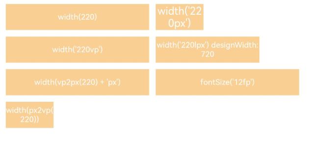

# 像素单位

更新时间：2026-05-12 09:31:20

来源：https://developer.huawei.com/consumer/cn/doc/harmonyos-references/ts-pixel-units
**支持设备：** Phone / PC/2in1 / Tablet / Wearable / TV

ArkUI为开发者提供4种像素单位，采用vp为基准数据单位。


## 基本像素单位
**支持设备：** Phone / PC/2in1 / Tablet / Wearable / TV


| 名称 | 描述 |
| --- | --- |
| px | 屏幕物理像素单位。 |
| vp | 屏幕密度相关像素，根据屏幕像素密度转换为屏幕物理像素，当数值不带单位时，默认单位vp。          说明：          vp与px的比例与屏幕像素密度有关。 |
| fp | 字体像素，与vp类似适用屏幕密度变化，随系统字体大小设置变化。 |
| lpx | 视窗逻辑像素单位，lpx单位为实际屏幕宽度与逻辑宽度（通过[designWidth](https://developer.huawei.com/consumer/cn/doc/harmonyos-guides/module-configuration-file#pages标签)配置）的比值，designWidth默认值为720。当designWidth为720时，在实际宽度为1440物理像素的屏幕上，1lpx为2px大小。 |


## vp2px(deprecated)
**支持设备：** Phone / PC/2in1 / Tablet / Wearable / TV

vp2px(value: number): number

将vp单位的数值转换为以px为单位的数值。


> [!NOTE]
> 默认使用当前UI实例所在屏幕的虚拟像素比进行转换，UI实例不明确时，使用默认屏幕的虚拟像素比进行转换，可能导致转换后结果与预期不一致的情况。
> 从API version 7开始支持，从API version 18开始废弃，建议使用[vp2px](https://developer.huawei.com/consumer/cn/doc/harmonyos-references/arkts-apis-uicontext-uicontext#vp2px12)替代。

**卡片能力：** 从API version 9开始，该接口支持在ArkTS卡片中使用。

**元服务API：** 从API version 11开始，该接口支持在元服务中使用。

**系统能力：** SystemCapability.ArkUI.ArkUI.Full

**参数：**


| 参数名 | 类型 | 必填 | 说明 |
| --- | --- | --- | --- |
| value | number | 是 | 将vp单位的数值转换为以px为单位的数值。          取值范围：(-∞, +∞) |


**返回值：**


| 类型 | 说明 |
| --- | --- |
| number | 转换后的数值。          取值范围：(-∞, +∞) |


## px2vp(deprecated)
**支持设备：** Phone / PC/2in1 / Tablet / Wearable / TV

px2vp(value: number): number

将px单位的数值转换为以vp为单位的数值。


> [!NOTE]
> 默认使用当前UI实例所在屏幕的虚拟像素比进行转换，UI实例不明确时，使用默认屏幕的虚拟像素比进行转换，可能导致转换后结果与预期不一致的情况。
> 从API version 7开始支持，从API version 18开始废弃，建议使用[px2vp](https://developer.huawei.com/consumer/cn/doc/harmonyos-references/arkts-apis-uicontext-uicontext#px2vp12)替代。

**卡片能力：** 从API version 9开始，该接口支持在ArkTS卡片中使用。

**元服务API：** 从API version 11开始，该接口支持在元服务中使用。

**系统能力：** SystemCapability.ArkUI.ArkUI.Full

**参数：**


| 参数名 | 类型 | 必填 | 说明 |
| --- | --- | --- | --- |
| value | number | 是 | 将px单位的数值转换为以vp为单位的数值。          取值范围：(-∞, +∞) |


**返回值：**


| 类型 | 说明 |
| --- | --- |
| number | 转换后的数值。          取值范围：(-∞, +∞) |


## fp2px(deprecated)
**支持设备：** Phone / PC/2in1 / Tablet / Wearable / TV

fp2px(value: number): number

将fp单位的数值转换为以px为单位的数值。


> [!NOTE]
> 从API version 7开始支持，从API version 18开始废弃，建议使用[fp2px](https://developer.huawei.com/consumer/cn/doc/harmonyos-references/arkts-apis-uicontext-uicontext#fp2px12)替代。

**卡片能力：** 从API version 9开始，该接口支持在ArkTS卡片中使用。

**元服务API：** 从API version 11开始，该接口支持在元服务中使用。

**系统能力：** SystemCapability.ArkUI.ArkUI.Full

**参数：**


| 参数名 | 类型 | 必填 | 说明 |
| --- | --- | --- | --- |
| value | number | 是 | 将fp单位的数值转换为以px为单位的数值。          取值范围：(-∞, +∞) |


**返回值：**


| 类型 | 说明 |
| --- | --- |
| number | 转换后的数值。          取值范围：(-∞, +∞) |


## px2fp(deprecated)
**支持设备：** Phone / PC/2in1 / Tablet / Wearable / TV

px2fp(value: number): number

将px单位的数值转换为以fp为单位的数值。


> [!NOTE]
> 从API version 7开始支持，从API version 18开始废弃，建议使用[px2fp](https://developer.huawei.com/consumer/cn/doc/harmonyos-references/arkts-apis-uicontext-uicontext#px2fp12)替代。

**卡片能力：** 从API version 9开始，该接口支持在ArkTS卡片中使用。

**元服务API：** 从API version 11开始，该接口支持在元服务中使用。

**系统能力：** SystemCapability.ArkUI.ArkUI.Full

**参数：**


| 参数名 | 类型 | 必填 | 说明 |
| --- | --- | --- | --- |
| value | number | 是 | 将px单位的数值转换为以fp为单位的数值。          取值范围：(-∞, +∞) |


**返回值：**


| 类型 | 说明 |
| --- | --- |
| number | 转换后的数值。          取值范围：(-∞, +∞) |


## lpx2px(deprecated)
**支持设备：** Phone / PC/2in1 / Tablet / Wearable / TV

lpx2px(value: number): number

将lpx单位的数值转换为以px为单位的数值。


> [!NOTE]
> 从API version 7开始支持，从API version 18开始废弃，建议使用[lpx2px](https://developer.huawei.com/consumer/cn/doc/harmonyos-references/arkts-apis-uicontext-uicontext#lpx2px12)替代。

**卡片能力：** 从API version 9开始，该接口支持在ArkTS卡片中使用。

**元服务API：** 从API version 11开始，该接口支持在元服务中使用。

**系统能力：** SystemCapability.ArkUI.ArkUI.Full

**参数：**


| 参数名 | 类型 | 必填 | 说明 |
| --- | --- | --- | --- |
| value | number | 是 | 将lpx单位的数值转换为以px为单位的数值。          取值范围：(-∞, +∞) |


**返回值：**


| 类型 | 说明 |
| --- | --- |
| number | 转换后的数值。          取值范围：(-∞, +∞) |


## px2lpx(deprecated)
**支持设备：** Phone / PC/2in1 / Tablet / Wearable / TV

px2lpx(value: number): number

将px单位的数值转换为以lpx为单位的数值。


> [!NOTE]
> 从API version 7开始支持，从API version 18开始废弃，建议使用[px2lpx](https://developer.huawei.com/consumer/cn/doc/harmonyos-references/arkts-apis-uicontext-uicontext#px2lpx12)替代。

**卡片能力：** 从API version 9开始，该接口支持在ArkTS卡片中使用。

**元服务API：** 从API version 11开始，该接口支持在元服务中使用。

**系统能力：** SystemCapability.ArkUI.ArkUI.Full

**参数：**


| 参数名 | 类型 | 必填 | 说明 |
| --- | --- | --- | --- |
| value | number | 是 | 将px单位的数值转换为以lpx为单位的数值。          取值范围：(-∞, +∞) |


**返回值：**


| 类型 | 说明 |
| --- | --- |
| number | 转换后的数值。          取值范围：(-∞, +∞) |


## 示例
**支持设备：** Phone / PC/2in1 / Tablet / Wearable / TV


```ts
// xxx.ets
@Entry
@Component
struct Example {
  build() {
    Column() {
      Flex({ wrap: FlexWrap.Wrap }) {
        Column() {
          Text("width(220)")
          .width(220)
          .height(40)
          .backgroundColor(0xF9CF93)
          .textAlign(TextAlign.Center)
          .fontColor(Color.White)
          .fontSize('12vp')
        }.margin(5)

        Column() {
          Text("width('220px')")
          .width('220px')
          .height(40)
          .backgroundColor(0xF9CF93)
          .textAlign(TextAlign.Center)
          .fontColor(Color.White)
        }.margin(5)

        Column() {
          Text("width('220vp')")
          .width('220vp')
          .height(40)
          .backgroundColor(0xF9CF93)
          .textAlign(TextAlign.Center)
          .fontColor(Color.White)
          .fontSize('12vp')
        }.margin(5)

        Column() {
          Text("width('220lpx') designWidth:720")
          .width('220lpx')
          .height(40)
          .backgroundColor(0xF9CF93)
          .textAlign(TextAlign.Center)
          .fontColor(Color.White)
          .fontSize('12vp')
        }.margin(5)

        Column() {
          Text("width(vp2px(220) + 'px')")
          .width(this.getUIContext().vp2px(220) + 'px')
          .height(40)
          .backgroundColor(0xF9CF93)
          .textAlign(TextAlign.Center)
          .fontColor(Color.White)
          .fontSize('12vp')
        }.margin(5)

        Column() {
          Text("fontSize('12fp')")
          .width(220)
          .height(40)
          .backgroundColor(0xF9CF93)
          .textAlign(TextAlign.Center)
          .fontColor(Color.White)
          .fontSize('12fp')
        }.margin(5)

        Column() {
          Text("width(px2vp(220))")
          .width(this.getUIContext().px2vp(220))
          .height(40)
          .backgroundColor(0xF9CF93)
          .textAlign(TextAlign.Center)
          .fontColor(Color.White)
          .fontSize('12fp')
        }.margin(5)
      }.width('100%')
    }
  }
}
```


