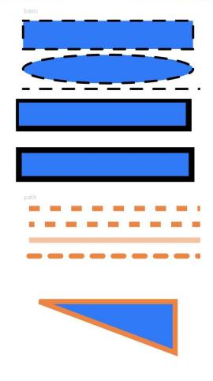

# Shape

更新时间：2026-04-28 03:31:56

来源：https://developer.huawei.com/consumer/cn/doc/harmonyos-references/ts-drawing-components-shape
**支持设备：** Phone / PC/2in1 / Tablet / Wearable / TV

绘制组件的父组件，父组件中会描述所有绘制组件均支持的通用属性。

1、绘制组件使用Shape作为父组件，实现类似SVG的效果。

2、绘制组件单独使用，用于在页面上绘制指定的图形。


> [!NOTE]
> 该组件从API version 7开始支持。后续版本如有新增内容，则采用上角标单独标记该内容的起始版本。
> 该组件从API version 20开始支持使用[AttributeUpdater](https://developer.huawei.com/consumer/cn/doc/harmonyos-references/js-apis-arkui-attributeupdater)类的[updateConstructorParams](https://developer.huawei.com/consumer/cn/doc/harmonyos-references/js-apis-arkui-attributeupdater#属性)接口更新构造参数。


## 子组件
**支持设备：** Phone / PC/2in1 / Tablet / Wearable / TV

包含[Rect](https://developer.huawei.com/consumer/cn/doc/harmonyos-references/ts-drawing-components-rect)、[Path](https://developer.huawei.com/consumer/cn/doc/harmonyos-references/ts-drawing-components-path)、[Circle](https://developer.huawei.com/consumer/cn/doc/harmonyos-references/ts-drawing-components-circle)、[Ellipse](https://developer.huawei.com/consumer/cn/doc/harmonyos-references/ts-drawing-components-ellipse)、[Polyline](https://developer.huawei.com/consumer/cn/doc/harmonyos-references/ts-drawing-components-polyline)、[Polygon](https://developer.huawei.com/consumer/cn/doc/harmonyos-references/ts-drawing-components-polygon)、[Image](https://developer.huawei.com/consumer/cn/doc/harmonyos-references/ts-basic-components-image)、[Text](https://developer.huawei.com/consumer/cn/doc/harmonyos-references/ts-basic-components-text)、[Column](https://developer.huawei.com/consumer/cn/doc/harmonyos-references/ts-container-column)、[Row](https://developer.huawei.com/consumer/cn/doc/harmonyos-references/ts-container-row)和Shape子组件。


## 接口
**支持设备：** Phone / PC/2in1 / Tablet / Wearable / TV

Shape(value?: PixelMap)

用于绘制Shape组件的构造函数。

从API version 9开始，该接口支持在ArkTS卡片中使用，卡片中不支持使用PixelMap对象。

**元服务API：** 从API version 11开始，该接口支持在元服务中使用。

**系统能力：** SystemCapability.ArkUI.ArkUI.Full

**参数：**


| 参数名 | 类型 | 必填 | 说明 |
| --- | --- | --- | --- |
| value | [PixelMap](https://developer.huawei.com/consumer/cn/doc/harmonyos-references/arkts-apis-image-pixelmap) | 否 | 绘制目标，可将图形绘制在指定的PixelMap对象中，若未设置，则默认在当前绘制目标中进行绘制。          异常值undefined和null按照无效值处理，本次设置不生效。 |


## ViewportRect18+对象说明
**支持设备：** Phone / PC/2in1 / Tablet / Wearable / TV

用于描述Viewport的绘制属性。


> [!NOTE]
> 为规范匿名对象的定义，API 18版本修改了此处的元素定义。其中，保留了历史匿名对象的起始版本信息，会出现外层元素@since版本号高于内层元素版本号的情况，但这不影响接口的使用。

**卡片能力：** 从API version 18开始，该接口支持在ArkTS卡片中使用。

**元服务API：** 从API version 18开始，该接口支持在元服务中使用。

**系统能力：** SystemCapability.ArkUI.ArkUI.Full


| 名称 | 类型 | 只读 | 可选 | 说明 |
| --- | --- | --- | --- | --- |
| x7+ | [Length](https://developer.huawei.com/consumer/cn/doc/harmonyos-references/ts-types#length) | 否 | 是 | 形状视口起始点的水平坐标。          默认值：0          默认单位：vp          异常值按照默认值处理。          卡片能力： 从API version 9开始，该接口支持在ArkTS卡片中使用。          元服务API： 从API version 11开始，该接口支持在元服务中使用。 |
| y7+ | [Length](https://developer.huawei.com/consumer/cn/doc/harmonyos-references/ts-types#length) | 否 | 是 | 形状视口起始点的垂直坐标。          默认值：0          默认单位：vp          异常值按照默认值处理。          卡片能力： 从API version 9开始，该接口支持在ArkTS卡片中使用。          元服务API： 从API version 11开始，该接口支持在元服务中使用。 |
| width7+ | [Length](https://developer.huawei.com/consumer/cn/doc/harmonyos-references/ts-types#length) | 否 | 是 | 形状视口的宽度，取值范围≥0。          默认值：0          默认单位：vp          异常值按照默认值处理。          卡片能力： 从API version 9开始，该接口支持在ArkTS卡片中使用。          元服务API： 从API version 11开始，该接口支持在元服务中使用。 |
| height7+ | [Length](https://developer.huawei.com/consumer/cn/doc/harmonyos-references/ts-types#length) | 否 | 是 | 形状视口的高度，取值范围≥0。          默认值：0          默认单位：vp          异常值按照默认值处理。          卡片能力： 从API version 9开始，该接口支持在ArkTS卡片中使用。          元服务API： 从API version 11开始，该接口支持在元服务中使用。 |


## 属性
**支持设备：** Phone / PC/2in1 / Tablet / Wearable / TV

除支持[通用属性](https://developer.huawei.com/consumer/cn/doc/harmonyos-references/ts-component-general-attributes)外，还支持以下属性：


### viewPort
**支持设备：** Phone / PC/2in1 / Tablet / Wearable / TV

viewPort(value: ViewportRect)

设置形状的视口。

**卡片能力：** 从API version 9开始，该接口支持在ArkTS卡片中使用。

**元服务API：** 从API version 11开始，该接口支持在元服务中使用。

**系统能力：** SystemCapability.ArkUI.ArkUI.Full

**参数：**


| 参数名 | 类型 | 必填 | 说明 |
| --- | --- | --- | --- |
| value | [ViewportRect](https://developer.huawei.com/consumer/cn/doc/harmonyos-references/ts-drawing-components-shape#viewportrect18对象说明) | 是 | Viewport绘制属性。          默认值：{}          异常值undefined和null按照默认值处理。 |


### fill
**支持设备：** Phone / PC/2in1 / Tablet / Wearable / TV

fill(value: ResourceColor)

设置填充区域的颜色，支持[attributeModifier](https://developer.huawei.com/consumer/cn/doc/harmonyos-references/ts-universal-attributes-attribute-modifier#attributemodifier)动态设置属性方法，异常值按照默认值处理。与通用属性foregroundColor同时设置时，后设置的属性生效。

**卡片能力：** 从API version 9开始，该接口支持在ArkTS卡片中使用。

**元服务API：** 从API version 11开始，该接口支持在元服务中使用。

**系统能力：** SystemCapability.ArkUI.ArkUI.Full

**参数：**


| 参数名 | 类型 | 必填 | 说明 |
| --- | --- | --- | --- |
| value | [ResourceColor](https://developer.huawei.com/consumer/cn/doc/harmonyos-references/ts-types#resourcecolor) | 是 | 填充区域颜色。          默认值：[Color](https://developer.huawei.com/consumer/cn/doc/harmonyos-references/ts-appendix-enums#color).Black          异常值undefined、null、NaN和Infinity按照默认值处理。 |


### fillOpacity
**支持设备：** Phone / PC/2in1 / Tablet / Wearable / TV

fillOpacity(value: number | string | Resource)

设置填充区域透明度，支持[attributeModifier](https://developer.huawei.com/consumer/cn/doc/harmonyos-references/ts-universal-attributes-attribute-modifier#attributemodifier)动态设置属性方法。

**卡片能力：** 从API version 9开始，该接口支持在ArkTS卡片中使用。

**元服务API：** 从API version 11开始，该接口支持在元服务中使用。

**系统能力：** SystemCapability.ArkUI.ArkUI.Full

**参数：**


| 参数名 | 类型 | 必填 | 说明 |
| --- | --- | --- | --- |
| value | number \| string \| [Resource](https://developer.huawei.com/consumer/cn/doc/harmonyos-references/ts-types#resource) | 是 | 填充区域透明度。          说明：          number格式取值范围是[0.0, 1.0]，若给定值小于0.0，则取值为0.0；若给定值大于1.0，则取值为1.0，其余异常值按1.0处理。          string格式支持number格式取值的字符串形式，取值范围与number格式相同。          Resource格式支持系统资源或者应用资源中的字符串，取值范围和number格式相同。          默认值：1.0 |


### stroke
**支持设备：** Phone / PC/2in1 / Tablet / Wearable / TV

stroke(value: ResourceColor)

设置边框颜色，支持[attributeModifier](https://developer.huawei.com/consumer/cn/doc/harmonyos-references/ts-universal-attributes-attribute-modifier#attributemodifier)动态设置属性方法，不设置时，默认边框透明度为0，即没有边框。

**卡片能力：** 从API version 9开始，该接口支持在ArkTS卡片中使用。

**元服务API：** 从API version 11开始，该接口支持在元服务中使用。

**系统能力：** SystemCapability.ArkUI.ArkUI.Full

**参数：**


| 参数名 | 类型 | 必填 | 说明 |
| --- | --- | --- | --- |
| value | [ResourceColor](https://developer.huawei.com/consumer/cn/doc/harmonyos-references/ts-types#resourcecolor) | 是 | 边框颜色。          默认值：[Color](https://developer.huawei.com/consumer/cn/doc/harmonyos-references/ts-appendix-enums#color).Transparent          异常值undefined和null按照默认值处理，NaN和Infinity按照[Color](https://developer.huawei.com/consumer/cn/doc/harmonyos-references/ts-appendix-enums#color).Black处理。 |


### strokeDashArray
**支持设备：** Phone / PC/2in1 / Tablet / Wearable / TV

strokeDashArray(value: Array<any>)

设置边框间隙，支持[attributeModifier](https://developer.huawei.com/consumer/cn/doc/harmonyos-references/ts-universal-attributes-attribute-modifier#attributemodifier)动态设置属性方法。取值范围为≥0，异常值按照默认值处理。

**卡片能力：** 从API version 9开始，该接口支持在ArkTS卡片中使用。

**元服务API：** 从API version 11开始，该接口支持在元服务中使用。

**系统能力：** SystemCapability.ArkUI.ArkUI.Full

**参数：**


| 参数名 | 类型 | 必填 | 说明 |
| --- | --- | --- | --- |
| value | Array&lt;any&gt; | 是 | 定义Shape轮廓的虚线模式的数组，数组元素交替表示线段长度和间隙长度。          默认值：[]（空数组）          默认单位：vp          异常值undefined和null按照默认值处理。          说明：          空数组：实线          偶数多元素数组：数组元素按顺序循环，如[a, b, c, d]表示线段长度a-&gt;间隙长度b-&gt;线段长度c-&gt;间隙长度d-&gt;线段长度a-&gt;...          奇数多元素数组：重复一次该数组元素，按偶数多元素数组的规则顺序循环，如[a, b, c]等效于[a, b, c, a, b, c]，表示线段长度a-&gt;间隙长度b-&gt;线段长度c-&gt;间隙长度a-&gt;线段长度b-&gt;间隙长度c-&gt;线段长度a-&gt;... |


### strokeDashOffset
**支持设备：** Phone / PC/2in1 / Tablet / Wearable / TV

strokeDashOffset(value: Length)

设置边框绘制起点的偏移量，支持[attributeModifier](https://developer.huawei.com/consumer/cn/doc/harmonyos-references/ts-universal-attributes-attribute-modifier#attributemodifier)动态设置属性方法。异常值按照默认值处理。

**卡片能力：** 从API version 9开始，该接口支持在ArkTS卡片中使用。

**元服务API：** 从API version 11开始，该接口支持在元服务中使用。

**系统能力：** SystemCapability.ArkUI.ArkUI.Full

**参数：**


| 参数名 | 类型 | 必填 | 说明 |
| --- | --- | --- | --- |
| value | [Length](https://developer.huawei.com/consumer/cn/doc/harmonyos-references/ts-types#length) | 是 | 边框绘制起点的偏移量。          默认值：0          默认单位：vp          异常值undefined和null按照默认值处理，NaN和Infinity会导致strokeDashArray失效。 |


### strokeLineCap
**支持设备：** Phone / PC/2in1 / Tablet / Wearable / TV

strokeLineCap(value: LineCapStyle)

设置边框端点绘制样式，支持[attributeModifier](https://developer.huawei.com/consumer/cn/doc/harmonyos-references/ts-universal-attributes-attribute-modifier#attributemodifier)动态设置属性方法。

**卡片能力：** 从API version 9开始，该接口支持在ArkTS卡片中使用。

**元服务API：** 从API version 11开始，该接口支持在元服务中使用。

**系统能力：** SystemCapability.ArkUI.ArkUI.Full

**参数：**


| 参数名 | 类型 | 必填 | 说明 |
| --- | --- | --- | --- |
| value | [LineCapStyle](https://developer.huawei.com/consumer/cn/doc/harmonyos-references/ts-appendix-enums#linecapstyle) | 是 | 边框端点绘制样式。          默认值：LineCapStyle.Butt          异常值undefined、null、NaN和Infinity按照默认值处理。 |


### strokeLineJoin
**支持设备：** Phone / PC/2in1 / Tablet / Wearable / TV

strokeLineJoin(value: LineJoinStyle)

设置边框拐角绘制样式，支持[attributeModifier](https://developer.huawei.com/consumer/cn/doc/harmonyos-references/ts-universal-attributes-attribute-modifier#attributemodifier)动态设置属性方法。

**卡片能力：** 从API version 9开始，该接口支持在ArkTS卡片中使用。

**元服务API：** 从API version 11开始，该接口支持在元服务中使用。

**系统能力：** SystemCapability.ArkUI.ArkUI.Full

**参数：**


| 参数名 | 类型 | 必填 | 说明 |
| --- | --- | --- | --- |
| value | [LineJoinStyle](https://developer.huawei.com/consumer/cn/doc/harmonyos-references/ts-appendix-enums#linejoinstyle) | 是 | 边框拐角绘制样式。          默认值：LineJoinStyle.Miter          异常值undefined、null、NaN和Infinity按照默认值处理。 |


### strokeMiterLimit
**支持设备：** Phone / PC/2in1 / Tablet / Wearable / TV

strokeMiterLimit(value: Length)

设置斜接长度与边框宽度比值的极限值，支持[attributeModifier](https://developer.huawei.com/consumer/cn/doc/harmonyos-references/ts-universal-attributes-attribute-modifier#attributemodifier)动态设置属性方法。斜接长度表示外边框外边交点到内边交点的距离，边框宽度即strokeWidth属性的值。该属性取值需在strokeLineJoin属性取值LineJoinStyle.Miter时生效。

该属性的合法值范围应当大于等于1.0，当取值范围在[0,1)时按1.0处理，其余异常值按默认值处理。

**卡片能力：** 从API version 9开始，该接口支持在ArkTS卡片中使用。

**元服务API：** 从API version 11开始，该接口支持在元服务中使用。

**系统能力：** SystemCapability.ArkUI.ArkUI.Full

**参数：**


| 参数名 | 类型 | 必填 | 说明 |
| --- | --- | --- | --- |
| value | [Length](https://developer.huawei.com/consumer/cn/doc/harmonyos-references/ts-types#length) | 是 | 斜接长度与边框宽度比值的极限值。          默认值：4          异常值undefined、null和NaN按照默认值处理，Infinity会导致stroke失效。 |


### strokeOpacity
**支持设备：** Phone / PC/2in1 / Tablet / Wearable / TV

strokeOpacity(value: number | string | Resource)

设置边框透明度，支持[attributeModifier](https://developer.huawei.com/consumer/cn/doc/harmonyos-references/ts-universal-attributes-attribute-modifier#attributemodifier)动态设置属性方法。该属性的取值范围是[0.0, 1.0]，若给定值小于0.0，则取值为0.0；若给定值大于1.0，则取值为1.0。

**卡片能力：** 从API version 9开始，该接口支持在ArkTS卡片中使用。

**元服务API：** 从API version 11开始，该接口支持在元服务中使用。

**系统能力：** SystemCapability.ArkUI.ArkUI.Full

**参数：**


| 参数名 | 类型 | 必填 | 说明 |
| --- | --- | --- | --- |
| value | number \| string \| [Resource](https://developer.huawei.com/consumer/cn/doc/harmonyos-references/ts-types#resource) | 是 | 边框透明度。          默认值：[stroke](#stroke)接口设置的透明度。          异常值NaN按0.0处理，undefined、null和Infinity按1.0处理。 |


### strokeWidth
**支持设备：** Phone / PC/2in1 / Tablet / Wearable / TV

strokeWidth(value: Length)

设置边框宽度，支持[attributeModifier](https://developer.huawei.com/consumer/cn/doc/harmonyos-references/ts-universal-attributes-attribute-modifier#attributemodifier)动态设置属性方法。该属性若为string类型，暂不支持百分比，百分比按照1px处理。

**卡片能力：** 从API version 9开始，该接口支持在ArkTS卡片中使用。

**元服务API：** 从API version 11开始，该接口支持在元服务中使用。

**系统能力：** SystemCapability.ArkUI.ArkUI.Full

**参数：**


| 参数名 | 类型 | 必填 | 说明 |
| --- | --- | --- | --- |
| value | [Length](https://developer.huawei.com/consumer/cn/doc/harmonyos-references/ts-types#length) | 是 | 边框宽度，取值范围≥0。          默认值：1          默认单位：vp          异常值undefined、null和NaN按照默认值处理，Infinity按0处理。 |


### antiAlias
**支持设备：** Phone / PC/2in1 / Tablet / Wearable / TV

antiAlias(value: boolean)

设置是否开启抗锯齿效果，支持[attributeModifier](https://developer.huawei.com/consumer/cn/doc/harmonyos-references/ts-universal-attributes-attribute-modifier#attributemodifier)动态设置属性方法。

**卡片能力：** 从API version 9开始，该接口支持在ArkTS卡片中使用。

**元服务API：** 从API version 11开始，该接口支持在元服务中使用。

**系统能力：** SystemCapability.ArkUI.ArkUI.Full

**参数：**


| 参数名 | 类型 | 必填 | 说明 |
| --- | --- | --- | --- |
| value | boolean | 是 | 是否开启抗锯齿效果。          true：开启抗锯齿；false：关闭抗锯齿。          默认值：true          异常值undefined和null按照false处理。 |


### mesh8+
**支持设备：** Phone / PC/2in1 / Tablet / Wearable / TV

mesh(value: Array<any>, column: number, row: number)

设置网格效果。将图像分割为（row + 1）* (column + 1)的网格，每个网格交点坐标存储在数组中（每两个元素表示一个交点的x、y坐标）。通过数组value中的坐标值，重新定位网格顶点位置，实现图像局部扭曲。支持[attributeModifier](https://developer.huawei.com/consumer/cn/doc/harmonyos-references/ts-universal-attributes-attribute-modifier#attributemodifier)动态设置属性方法。


> [!NOTE]
> mesh只对shape传入pixelMap时生效，且效果作用于传入的pixelMap。与[绘制模块](https://developer.huawei.com/consumer/cn/doc/harmonyos-references/arkts-apis-graphics-drawing)的[drawPixelMapMesh12+](https://developer.huawei.com/consumer/cn/doc/harmonyos-references/arkts-apis-graphics-drawing-canvas#drawpixelmapmesh12)效果一致，建议使用drawPixelMapMesh。

**卡片能力：** 从API version 9开始，该接口支持在ArkTS卡片中使用。

**元服务API：** 从API version 11开始，该接口支持在元服务中使用。

**系统能力：** SystemCapability.ArkUI.ArkUI.Full

**参数：**


| 参数名 | 类型 | 必填 | 说明 |
| --- | --- | --- | --- |
| value | Array&lt;any&gt; | 是 | 长度（row + 1）* （column + 1）* 2的数组，记录扭曲后的位图各个顶点位置。          设置异常值undefined、null时value按照空数组处理，设置空数组时column和row按0处理，value按空数组处理。 |
| column | number | 是 | mesh矩阵列数。          设置异常值undefined、null、NaN和Infinity时column和row按0处理，value按空数组处理。 |
| row | number | 是 | mesh矩阵行数。          设置异常值undefined、null、NaN和Infinity时column和row按0处理，value按空数组处理。 |


## 示例
**支持设备：** Phone / PC/2in1 / Tablet / Wearable / TV


### 示例1（组件属性绘制）

通过Shape组件绘制矩形、椭圆和直线路径。


```ts
// xxx.ets
@Entry
@Component
struct ShapeExample {
  build() {
    Column({ space: 10 }) {
      Text('basic').fontSize(11).fontColor(0xCCCCCC).width(320)
      // 在Shape的(-2, -2)点绘制一个 300 * 50 带边框的矩形,颜色0x317AF7,边框颜色黑色,边框宽度4,边框间隙20,向左偏移10,线条两端样式为半圆,拐角样式圆角,抗锯齿(默认开启)
      // 在Shape的(-2, 58)点绘制一个 300 * 50 带边框的椭圆,颜色0x317AF7,边框颜色黑色,边框宽度4,边框间隙20,向左偏移10,线条两端样式为半圆,拐角样式圆角,抗锯齿(默认开启)
      // 在Shape的(-2, 118)点绘制一个 300 * 10 直线路径,颜色0x317AF7,边框颜色黑色,宽度4,间隙20,向左偏移10,线条两端样式为半圆,拐角样式圆角,抗锯齿(默认开启)
      Shape() {
        Rect().width(300).height(50)
        Ellipse().width(300).height(50).offset({ x: 0, y: 60 })
        Path().width(300).height(10).commands('M0 0 L900 0').offset({ x: 0, y: 120 })
      }
      .width(350)
      .height(140)
      .viewPort({
        x: -2,
        y: -2,
        width: 304,
        height: 130
      })
      .fill(0x317AF7)
      .stroke(Color.Black)
      .strokeWidth(4)
      .strokeDashArray([20])
      .strokeDashOffset(10)
      .strokeLineCap(LineCapStyle.Round)
      .strokeLineJoin(LineJoinStyle.Round)
      .antiAlias(true)

      // 分别在Shape的(0, 0)、(-5, -5)点绘制一个 300 * 50 带边框的矩形,可以看出之所以将视口的起始位置坐标设为负值是因为绘制的起点默认为线宽的中点位置，因此要让边框完全显示则需要让视口偏移半个线宽
      Shape() {
        Rect().width(300).height(50)
      }
      .width(350)
      .height(80)
      .viewPort({
        x: 0,
        y: 0,
        width: 320,
        height: 70
      })
      .fill(0x317AF7)
      .stroke(Color.Black)
      .strokeWidth(10)

      Shape() {
        Rect().width(300).height(50)
      }
      .width(350)
      .height(80)
      .viewPort({
        x: -5,
        y: -5,
        width: 320,
        height: 70
      })
      .fill(0x317AF7)
      .stroke(Color.Black)
      .strokeWidth(10)

      Text('path').fontSize(11).fontColor(0xCCCCCC).width(320)
      // 在Shape的(0, -5)点绘制一条直线路径,颜色0xEE8443,线条宽度10,线条间隙20
      Shape() {
        Path().width(300).height(10).commands('M0 0 L900 0')
      }
      .width(350)
      .height(20)
      .viewPort({
        x: 0,
        y: -5,
        width: 300,
        height: 20
      })
      .stroke(0xEE8443)
      .strokeWidth(10)
      .strokeDashArray([20])

      // 在Shape的(0, -5)点绘制一条直线路径,颜色0xEE8443,线条宽度10,线条间隙20,向左偏移10
      Shape() {
        Path().width(300).height(10).commands('M0 0 L900 0')
      }
      .width(350)
      .height(20)
      .viewPort({
        x: 0,
        y: -5,
        width: 300,
        height: 20
      })
      .stroke(0xEE8443)
      .strokeWidth(10)
      .strokeDashArray([20])
      .strokeDashOffset(10)

      // 在Shape的(0, -5)点绘制一条直线路径,颜色0xEE8443,线条宽度10,透明度0.5
      Shape() {
        Path().width(300).height(10).commands('M0 0 L900 0')
      }
      .width(350)
      .height(20)
      .viewPort({
        x: 0,
        y: -5,
        width: 300,
        height: 20
      })
      .stroke(0xEE8443)
      .strokeWidth(10)
      .strokeOpacity(0.5)

      // 在Shape的(0, -5)点绘制一条直线路径,颜色0xEE8443,线条宽度10,线条间隙20,线条两端样式为半圆
      Shape() {
        Path().width(300).height(10).commands('M0 0 L900 0')
      }
      .width(350)
      .height(20)
      .viewPort({
        x: 0,
        y: -5,
        width: 300,
        height: 20
      })
      .stroke(0xEE8443)
      .strokeWidth(10)
      .strokeDashArray([20])
      .strokeLineCap(LineCapStyle.Round)

      // 在Shape的(-20, -5)点绘制一个封闭路径,颜色0x317AF7,线条宽度10,边框颜色0xEE8443,拐角样式锐角（默认值）
      Shape() {
        Path().width(200).height(60).commands('M0 0 L400 0 L400 150 Z')
      }
      .width(300)
      .height(200)
      .viewPort({
        x: -20,
        y: -5,
        width: 310,
        height: 90
      })
      .fill(0x317AF7)
      .stroke(0xEE8443)
      .strokeWidth(10)
      .strokeLineJoin(LineJoinStyle.Miter)
      .strokeMiterLimit(5)
  }.width('100%').margin({ top: 15 })
  }
}
```




### 示例2（使用不同参数类型绘制图形）

各属性通过不同的长度类型绘制图形。


```ts
// xxx.ets
@Entry
@Component
struct ShapeTypeExample {
  build() {
    Column({ space: 10 }) {
      // 在Shape的(-2, -2)点绘制一个 300 * 50 带边框的矩形,颜色0x317AF7,边框颜色黑色,边框宽度4,边框间隙20,向左偏移10,线条两端样式为半圆,拐角样式圆角,抗锯齿(默认开启)
      // 在Shape的(-2, 58)点绘制一个 300 * 50 带边框的椭圆,颜色0x317AF7,边框颜色黑色,边框宽度4,边框间隙20,向左偏移10,线条两端样式为半圆,拐角样式圆角,抗锯齿(默认开启)
      // 在Shape的(-2, 118)点绘制一个 300 * 10 直线路径,颜色0x317AF7,边框颜色黑色,宽度4,间隙20,向左偏移10,线条两端样式为半圆,拐角样式圆角,抗锯齿(默认开启)
      Shape() {
        Rect().width('300').height('50')
        Ellipse().width(300).height(50).offset({ x: 0, y: 60 })
        Path().width(300).height(10).commands('M0 0 L900 0').offset({ x: 0, y: 120 })
      }
      .width(350)
      .height(140)
      .viewPort({
        x: '-2', // 使用string类型
        y: '-2',
        width: $r('app.string.ViewportRectWidth'), // 使用Resource类型，需用户自定义
        height: $r('app.string.ViewportRectHeight')
      })
      .fill(Color.Orange)
      .stroke(Color.Black)
      .strokeWidth(4)
      .strokeDashArray([20])
      .strokeDashOffset(10) // 使用number类型
      .strokeLineCap(LineCapStyle.Round)
      .strokeLineJoin(LineJoinStyle.Round)
      .strokeMiterLimit(5)
      .antiAlias(true)
  }.width('100%').margin({ top: 15 })
  }
}
```


### 示例3（使用attributeModifier动态设置Shape组件的属性）

以下示例展示了如何使用attributeModifier动态设置Shape组件的fill、fillOpacity、stroke、strokeDashArray、strokeDashOffset、strokeLineCap、strokeLineJoin、strokeMiterLimit、strokeOpacity、strokeWidth和antiAlias属性。


```ts
// xxx.ets
class MyShapeModifier implements AttributeModifier<ShapeAttribute> {
  applyNormalAttribute(instance: ShapeAttribute): void {
    // 填充颜色#707070，填充透明度0.5，边框颜色#2787D9，边框间隙[20, 15]，向左偏移15，线条两端样式为半圆，拐角样式使用尖角连接路径段，斜接长度与边框宽度比值的极限值为5，边框透明度0.5，边框宽度10，抗锯齿开启
    instance.fill("#707070")
    instance.fillOpacity(0.5)
    instance.stroke("#2787D9")
    instance.strokeDashArray([20, 15])
    instance.strokeDashOffset("15")
    instance.strokeLineCap(LineCapStyle.Round)
    instance.strokeLineJoin(LineJoinStyle.Miter)
    instance.strokeMiterLimit(5)
    instance.strokeOpacity(0.5)
    instance.strokeWidth(10)
    instance.antiAlias(true)
  }
}

@Entry
@Component
struct ShapeModifierDemo {
  @State modifier: MyShapeModifier = new MyShapeModifier()

  build() {
    Column() {
      Shape() {
        Rect().width(200).height(50).offset({ x: 20, y: 20 })
        Ellipse().width(200).height(50).offset({ x: 20, y: 80 })
        Path().width(200).height(10).commands('M0 0 L900 0').offset({ x: 20, y: 160 })
      }
      .width(250).height(200)
      .attributeModifier(this.modifier)
    }
  }
}
```


### 示例4（使用mesh实现图像局部扭曲）

以下示例展示了如何使用mesh属性设置网格效果，实现图像局部扭曲。


```ts
// xxx.ets
import { image } from '@kit.ImageKit';

@Entry
@Component
struct Index {
  private context: OffscreenCanvasRenderingContext2D = new OffscreenCanvasRenderingContext2D(200, 200)
  private meshArray: Array<number> = [0, 0, 50, 0, 410, 0, 0, 180, 50, 180, 410, 180, 0, 360, 50, 360, 410, 360]
  @State pixelMap: image.PixelMap | undefined = undefined

  aboutToAppear(): void {
    // "resources/base/media/img.png"需要替换为开发者所需的图像资源文件。
    let img: ImageBitmap = new ImageBitmap("resources/base/media/img.png")
    this.context.drawImage(img, 0, 0, 200, 200)
    this.pixelMap = this.context.getPixelMap(0, 0, 200, 200)
  }

  build() {
    Column() {
      Shape(this.pixelMap)
      .backgroundColor(Color.Grey)
      .width(250)
      .height(250)
      .mesh(this.meshArray, 2, 2)

      Shape(this.pixelMap)
      .backgroundColor(Color.Grey)
      .width(250)
      .height(250)
    }
  }
}
```


