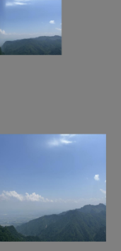

# Shape

更新时间：2026-07-28 11:23:46

来源：https://developer.huawei.com/consumer/cn/doc/harmonyos-references/ts-drawing-components-shape
**支持设备：** Phone | PC/2in1 | Tablet | Wearable | TV

绘制组件的父组件，描述所有绘制组件均支持的通用属性。

Shape组件通过定义视口、填充、边框等属性，支持矢量图形的绘制和组合。Shape作为容器组件，可包含Rect、Circle、Path等绘制子组件，实现类似SVG（Scalable Vector Graphics，可缩放矢量图形）的矢量图形绘制能力。

Shape组件的两种使用方式：

1、绘制组件使用Shape作为父组件，实现类似SVG的矢量图形的组合绘制。

2、绘制组件单独使用，用于在页面上绘制指定的图形。

> [!NOTE]
> 该组件从API version 7开始支持。后续版本的新增接口，采用上角标单独标记接口的起始版本。 该组件从API version 20开始支持使用 AttributeUpdater 类的 updateConstructorParams 接口更新构造参数。


#### 子组件

**支持设备：** Phone | PC/2in1 | Tablet | Wearable | TV

包含[Rect](https://developer.huawei.com/consumer/cn/doc/harmonyos-references/ts-drawing-components-rect)、[Path](https://developer.huawei.com/consumer/cn/doc/harmonyos-references/ts-drawing-components-path)、[Circle](https://developer.huawei.com/consumer/cn/doc/harmonyos-references/ts-drawing-components-circle)、[Ellipse](https://developer.huawei.com/consumer/cn/doc/harmonyos-references/ts-drawing-components-ellipse)、[Polyline](https://developer.huawei.com/consumer/cn/doc/harmonyos-references/ts-drawing-components-polyline)、[Polygon](https://developer.huawei.com/consumer/cn/doc/harmonyos-references/ts-drawing-components-polygon)、[Image](https://developer.huawei.com/consumer/cn/doc/harmonyos-references/ts-basic-components-image)、[Text](https://developer.huawei.com/consumer/cn/doc/harmonyos-references/ts-basic-components-text)、[Column](https://developer.huawei.com/consumer/cn/doc/harmonyos-references/ts-container-column)、[Row](https://developer.huawei.com/consumer/cn/doc/harmonyos-references/ts-container-row)和Shape子组件。


#### 接口

**支持设备：** Phone | PC/2in1 | Tablet | Wearable | TV


#### Shape

**支持设备：** Phone | PC/2in1 | Tablet | Wearable | TV

new Shape(value?: PixelMap)

用于绘制Shape组件的构造函数。调用后创建一个Shape对象，可设置视口、填充、边框等属性。

**元服务API：** 从API version 11开始，该接口支持在元服务中使用。

**系统能力：** SystemCapability.ArkUI.ArkUI.Full

**参数：**

| 参数名 | 类型 | 必填 | 说明 |
| --- | --- | --- | --- |
| value | PixelMap | 否 | 绘制目标，可将图形绘制在指定的PixelMap对象中，若未设置，则默认在当前绘制目标中进行绘制。 异常值undefined和null按照无效值处理，本次设置不生效。 |


#### Shape

**支持设备：** Phone | PC/2in1 | Tablet | Wearable | TV

Shape(value: PixelMap)

用于绘制Shape组件的构造函数。调用后创建一个Shape对象，可设置视口、填充、边框等属性。

**元服务API：** 从API version 11开始，该接口支持在元服务中使用。

**系统能力：** SystemCapability.ArkUI.ArkUI.Full

**参数：**

| 参数名 | 类型 | 必填 | 说明 |
| --- | --- | --- | --- |
| value | PixelMap | 是 | 绘制目标，可将图形绘制在指定的PixelMap对象中。 说明：此参数为必填参数，应传入有效的PixelMap对象，传入undefined或null时不生效。 |


#### Shape

**支持设备：** Phone | PC/2in1 | Tablet | Wearable | TV

Shape()

用于绘制Shape组件的无参构造函数。调用后创建一个Shape对象，使用默认视口和属性。

**卡片能力：** 从API version 9开始，该接口支持在ArkTS卡片中使用。

**元服务API：** 从API version 11开始，该接口支持在元服务中使用。

**系统能力：** SystemCapability.ArkUI.ArkUI.Full


#### ViewportRect18+对象说明

**支持设备：** Phone | PC/2in1 | Tablet | Wearable | TV

用于描述Viewport的绘制属性。

> [!NOTE]
> 为规范匿名对象的定义，API 18版本修改了此处的元素定义。其中，保留了历史匿名对象的起始版本信息，会出现外层元素@since版本号高于内层元素版本号的情况，但这不影响接口的使用。


**卡片能力：** 从API version 18开始，该接口支持在ArkTS卡片中使用。

**元服务API：** 从API version 18开始，该接口支持在元服务中使用。

**模型约束：** 此接口仅可在Stage模型下使用。

**系统能力：** SystemCapability.ArkUI.ArkUI.Full

| 名称 | 类型 | 只读 | 可选 | 说明 |
| --- | --- | --- | --- | --- |
| x7+ | Length | 否 | 是 | 形状视口起始点的水平坐标。 默认值：0 默认单位：vp 异常值undefined、null、NaN和Infinity按照默认值处理。 卡片能力： 从API version 9开始，该接口支持在ArkTS卡片中使用。 元服务API： 从API version 11开始，该接口支持在元服务中使用。 |
| y7+ | Length | 否 | 是 | 形状视口起始点的垂直坐标。 默认值：0 默认单位：vp 异常值undefined、null、NaN和Infinity按照默认值处理。 卡片能力： 从API version 9开始，该接口支持在ArkTS卡片中使用。 元服务API： 从API version 11开始，该接口支持在元服务中使用。 |
| width7+ | Length | 否 | 是 | 形状视口的宽度，取值范围≥0。 默认值：0 默认单位：vp 异常值undefined、null、NaN和Infinity按照默认值处理。 卡片能力： 从API version 9开始，该接口支持在ArkTS卡片中使用。 元服务API： 从API version 11开始，该接口支持在元服务中使用。 |
| height7+ | Length | 否 | 是 | 形状视口的高度，取值范围≥0。 默认值：0 默认单位：vp 异常值undefined、null、NaN和Infinity按照默认值处理。 卡片能力： 从API version 9开始，该接口支持在ArkTS卡片中使用。 元服务API： 从API version 11开始，该接口支持在元服务中使用。 |


#### 属性

**支持设备：** Phone | PC/2in1 | Tablet | Wearable | TV

除支持[通用属性](https://developer.huawei.com/consumer/cn/doc/harmonyos-references/ts-component-general-attributes)以及[图形绘制通用属性](https://developer.huawei.com/consumer/cn/doc/harmonyos-references/ts-drawing-components-common)外，还支持以下属性：


#### viewPort

**支持设备：** Phone | PC/2in1 | Tablet | Wearable | TV

viewPort(value: ViewportRect)

设置形状的视口。

视口定义了绘制内容的坐标系统和显示区域。视口的起始点坐标(x, y)和宽高(width, height)决定了绘制内容在组件中的显示位置和范围。当视口范围与组件尺寸不同时，绘制内容会自动缩放适配。视口常用于调整绘制内容的显示比例和位置。

**卡片能力：** 从API version 9开始，该接口支持在ArkTS卡片中使用。

**元服务API：** 从API version 11开始，该接口支持在元服务中使用。

**系统能力：** SystemCapability.ArkUI.ArkUI.Full

**参数：**

| 参数名 | 类型 | 必填 | 说明 |
| --- | --- | --- | --- |
| value | ViewportRect | 是 | Viewport绘制属性。 默认值：{x: 0, y: 0, width: 0, height: 0} 异常值undefined和null按照默认值处理。 |


#### mesh8+

**支持设备：** Phone | PC/2in1 | Tablet | Wearable | TV

mesh(value: Array&lt;any&gt;, column: number, row: number)

设置网格效果。将图像分割为（row + 1）* （column + 1）的网格，每个网格交点坐标存储在数组中（每两个元素表示一个交点的x、y坐标）。通过数组value中的坐标值，重新定位网格顶点位置，实现图像局部扭曲。支持[attributeModifier](https://developer.huawei.com/consumer/cn/doc/harmonyos-references/ts-universal-attributes-attribute-modifier#attributemodifier)动态设置属性方法。适用于需要实现图像变形效果的场景，如图片扭曲、波浪效果等视觉效果。

坐标数组按行优先顺序存储。原始图像被均匀分割后，每个网格区域根据顶点的新坐标进行变换，最终形成扭曲效果。

> [!NOTE]
> mesh只对shape传入pixelMap时生效，且效果作用于传入的pixelMap。与 绘制模块 的 drawPixelMapMesh 12+ 效果一致，建议使用drawPixelMapMesh。


**卡片能力：** 从API version 9开始，该接口支持在ArkTS卡片中使用。

**元服务API：** 从API version 11开始，该接口支持在元服务中使用。

**系统能力：** SystemCapability.ArkUI.ArkUI.Full

**参数：**

| 参数名 | 类型 | 必填 | 说明 |
| --- | --- | --- | --- |
| value | Array&lt;any&gt; | 是 | 长度（row + 1）* （column + 1）* 2的数组，记录扭曲后的位图各个顶点位置。坐标系基于Shape组件显示区域，原点(0,0)位于左上角，x轴向右延伸，y轴向下延伸。 默认单位：vp 设置异常值undefined、null时按照空数组处理。 |
| column | number | 是 | mesh矩阵列数，取值范围≥0。 默认值：0 设置异常值undefined、null、NaN和Infinity时，column参数和row参数按默认值0处理，value参数按空数组处理。 |
| row | number | 是 | mesh矩阵行数，取值范围≥0。 默认值：0 设置异常值undefined、null、NaN和Infinity时，column参数和row参数按默认值0处理，value参数按空数组处理。 |


#### 示例

**支持设备：** Phone | PC/2in1 | Tablet | Wearable | TV


#### 示例1（组件属性绘制）

通过Shape组件绘制矩形、椭圆和直线路径。

```ArkTS
// xxx.ets
@Entry
@Component
struct ShapeExample {
  build() {
    Column({ space: 10 }) {
      Text('basic').fontSize(11).fontColor(0xCCCCCC).width(320)
      // 在Shape的(-2, -2)点绘制一个 300 * 50 带边框的矩形，颜色0x317AF7，边框颜色黑色，边框宽度4，边框间隙20，向左偏移10，线条两端样式为半圆，拐角样式圆角，抗锯齿(默认开启)
      // 在Shape的(-2, 58)点绘制一个 300 * 50 带边框的椭圆，颜色0x317AF7，边框颜色黑色，边框宽度4，边框间隙20，向左偏移10，线条两端样式为半圆，拐角样式圆角，抗锯齿(默认开启)
      // 在Shape的(-2, 118)点绘制一个 300 * 10 直线路径，颜色0x317AF7，边框颜色黑色，宽度4，间隙20，向左偏移10，线条两端样式为半圆，拐角样式圆角，抗锯齿(默认开启)
      Shape() {
        Rect().width(300).height(50)
        Ellipse().width(300).height(50).offset({ x: 0, y: 60 })
        Path().width(300).height(10).commands('M0 0 L900 0').offset({ x: 0, y: 120 })
      }
      .width(350)
      .height(140)
      .viewPort({
        x: -2,
        y: -2,
        width: 304,
        height: 130
      })
      .fill(0x317AF7)
      .stroke(Color.Black)
      .strokeWidth(4)
      .strokeDashArray([20])
      .strokeDashOffset(10)
      .strokeLineCap(LineCapStyle.Round)
      .strokeLineJoin(LineJoinStyle.Round)
      .antiAlias(true)

      // 分别在Shape的(0, 0)、(-5, -5)点绘制一个 300 * 50 带边框的矩形,可以看出之所以将视口的起始位置坐标设为负值是因为绘制的起点默认为线宽的中点位置，因此要让边框完全显示则需要让视口偏移半个线宽
      Shape() {
        Rect().width(300).height(50)
      }
      .width(350)
      .height(80)
      .viewPort({
        x: 0,
        y: 0,
        width: 320,
        height: 70
      })
      .fill(0x317AF7)
      .stroke(Color.Black)
      .strokeWidth(10)

      Shape() {
        Rect().width(300).height(50)
      }
      .width(350)
      .height(80)
      .viewPort({
        x: -5,
        y: -5,
        width: 320,
        height: 70
      })
      .fill(0x317AF7)
      .stroke(Color.Black)
      .strokeWidth(10)

      Text('path').fontSize(11).fontColor(0xCCCCCC).width(320)
      // 在Shape的(0, -5)点绘制一条直线路径,颜色0xEE8443,线条宽度10,线条间隙20
      Shape() {
        Path().width(300).height(10).commands('M0 0 L900 0')
      }
      .width(350)
      .height(20)
      .viewPort({
        x: 0,
        y: -5,
        width: 300,
        height: 20
      })
      .stroke(0xEE8443)
      .strokeWidth(10)
      .strokeDashArray([20])

      // 在Shape的(0, -5)点绘制一条直线路径,颜色0xEE8443,线条宽度10,线条间隙20,向左偏移10
      Shape() {
        Path().width(300).height(10).commands('M0 0 L900 0')
      }
      .width(350)
      .height(20)
      .viewPort({
        x: 0,
        y: -5,
        width: 300,
        height: 20
      })
      .stroke(0xEE8443)
      .strokeWidth(10)
      .strokeDashArray([20])
      .strokeDashOffset(10)

      // 在Shape的(0, -5)点绘制一条直线路径,颜色0xEE8443,线条宽度10,透明度0.5
      Shape() {
        Path().width(300).height(10).commands('M0 0 L900 0')
      }
      .width(350)
      .height(20)
      .viewPort({
        x: 0,
        y: -5,
        width: 300,
        height: 20
      })
      .stroke(0xEE8443)
      .strokeWidth(10)
      .strokeOpacity(0.5)

      // 在Shape的(0, -5)点绘制一条直线路径,颜色0xEE8443,线条宽度10,线条间隙20,线条两端样式为半圆
      Shape() {
        Path().width(300).height(10).commands('M0 0 L900 0')
      }
      .width(350)
      .height(20)
      .viewPort({
        x: 0,
        y: -5,
        width: 300,
        height: 20
      })
      .stroke(0xEE8443)
      .strokeWidth(10)
      .strokeDashArray([20])
      .strokeLineCap(LineCapStyle.Round)

      // 在Shape的(-20, -5)点绘制一个封闭路径,颜色0x317AF7,线条宽度10,边框颜色0xEE8443,拐角样式锐角（默认值）
      Shape() {
        Path().width(200).height(60).commands('M0 0 L400 0 L400 150 Z')
      }
      .width(300)
      .height(200)
      .viewPort({
        x: -20,
        y: -5,
        width: 310,
        height: 90
      })
      .fill(0x317AF7)
      .stroke(0xEE8443)
      .strokeWidth(10)
      .strokeLineJoin(LineJoinStyle.Miter)
      .strokeMiterLimit(5)
    }.width('100%').margin({ top: 15 })
  }
}
```





#### 示例2（使用不同参数类型绘制图形）

各属性通过不同的长度类型绘制图形。

```ArkTS
// xxx.ets
@Entry
@Component
struct ShapeTypeExample {
  build() {
    Column({ space: 10 }) {
      // 在Shape的(-2, -2)点绘制一个 300 * 50 带边框的矩形,颜色橙色,边框颜色黑色,边框宽度4,边框间隙20,向左偏移10,线条两端样式为半圆,拐角样式圆角,抗锯齿(默认开启)
      // 在Shape的(-2, 58)点绘制一个 300 * 50 带边框的椭圆,颜色橙色,边框颜色黑色,边框宽度4,边框间隙20,向左偏移10,线条两端样式为半圆,拐角样式圆角,抗锯齿(默认开启)
      // 在Shape的(-2, 118)点绘制一个 300 * 10 直线路径,颜色橙色,边框颜色黑色,宽度4,间隙20,向左偏移10,线条两端样式为半圆,拐角样式圆角,抗锯齿(默认开启)
      Shape() {
        Rect().width('300').height('50')
        Ellipse().width(300).height(50).offset({ x: 0, y: 60 })
        Path().width(300).height(10).commands('M0 0 L900 0').offset({ x: 0, y: 120 })
      }
      .width(350)
      .height(140)
      .viewPort({
        x: '-2', // 使用string类型
        y: '-2',
        width: $r('app.string.ViewportRectWidth'), // 使用Resource类型，需用户自定义
        height: $r('app.string.ViewportRectHeight')
      })
      .fill(Color.Orange)
      .stroke(Color.Black)
      .strokeWidth(4)
      .strokeDashArray([20])
      .strokeDashOffset(10) // 使用number类型
      .strokeLineCap(LineCapStyle.Round)
      .strokeLineJoin(LineJoinStyle.Round)
      .strokeMiterLimit(5)
      .antiAlias(true)
    }.width('100%').margin({ top: 15 })
  }
}
```


#### 示例3（使用attributeModifier动态设置Shape组件的属性）

以下示例展示了如何使用attributeModifier动态设置Shape组件的fill、fillOpacity、stroke、strokeDashArray、strokeDashOffset、strokeLineCap、strokeLineJoin、strokeMiterLimit、strokeOpacity、strokeWidth和antiAlias属性。

```ArkTS
// xxx.ets
class MyShapeModifier implements AttributeModifier<ShapeAttribute> {
  applyNormalAttribute(instance: ShapeAttribute): void {
    // 填充颜色#707070，填充透明度0.5，边框颜色#2787D9，边框间隙[20, 15]，向左偏移15，线条两端样式为半圆，拐角样式使用尖角连接路径段，斜接长度与边框宽度比值的极限值为5，边框透明度0.5，边框宽度10，抗锯齿开启
    instance.fill("#707070")
    instance.fillOpacity(0.5)
    instance.stroke("#2787D9")
    instance.strokeDashArray([20, 15])
    instance.strokeDashOffset("15")
    instance.strokeLineCap(LineCapStyle.Round)
    instance.strokeLineJoin(LineJoinStyle.Miter)
    instance.strokeMiterLimit(5)
    instance.strokeOpacity(0.5)
    instance.strokeWidth(10)
    instance.antiAlias(true)
  }
}

@Entry
@Component
struct ShapeModifierDemo {
  @State modifier: MyShapeModifier = new MyShapeModifier()

  build() {
    Column() {
      Shape() {
        Rect().width(200).height(50).offset({ x: 20, y: 20 })
        Ellipse().width(200).height(50).offset({ x: 20, y: 80 })
        Path().width(200).height(10).commands('M0 0 L900 0').offset({ x: 20, y: 160 })
      }
      .width(250).height(200)
      .attributeModifier(this.modifier)
    }
  }
}
```


#### 示例4（使用mesh实现图像局部扭曲）

以下示例展示了如何使用mesh属性设置网格效果，实现图像局部扭曲。

```ArkTS
// xxx.ets
import { image } from '@kit.ImageKit';

@Entry
@Component
struct Index {
  private context: OffscreenCanvasRenderingContext2D = new OffscreenCanvasRenderingContext2D(200, 200)
  // mesh数组，长度为(row+1)*(column+1)*2，每两个元素表示一个网格顶点的x、y坐标
  private meshArray: Array<number> = [0, 0, 50, 0, 410, 0, 0, 180, 50, 180, 410, 180, 0, 360, 50, 360, 410, 360]
  @State pixelMap: image.PixelMap | undefined = undefined

  aboutToAppear(): void {
    // "resources/base/media/img.png"需要替换为开发者所需的图像资源文件。
    // 创建图像位图并绘制到离屏画布
    let img: ImageBitmap = new ImageBitmap("resources/base/media/img.png")
    this.context.drawImage(img, 0, 0, 200, 200)
    // 从画布获取PixelMap对象，用于Shape组件
    this.pixelMap = this.context.getPixelMap(0, 0, 200, 200)
  }

  build() {
    Column() {
      Shape(this.pixelMap)
      .backgroundColor(Color.Grey)
      .width(250)
      .height(250)
      .mesh(this.meshArray, 2, 2)

      Shape(this.pixelMap)
      .backgroundColor(Color.Grey)
      .width(250)
      .height(250)
    }
  }
}
```


