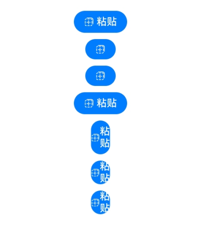

# PasteButton

更新时间：2026-05-18 03:44:20

来源：https://developer.huawei.com/consumer/cn/doc/harmonyos-references/ts-security-components-pastebutton

支持设备：Phone | PC/2in1 | Tablet | Wearable | TV

安全控件的粘贴控件。用户点击粘贴控件，应用可以临时获取读取剪贴板权限。

> [!NOTE] 说明
> 该组件从API version 10开始支持。后续版本如有新增内容，则采用上角标单独标记该内容的起始版本。

#### 子组件
不支持。

#### 接口
#### PasteButton
PasteButton()
默认创建带有图标、文本、背景的粘贴控件。
为避免因控件样式不合法而导致授权失败，请开发者先了解安全控件样式的[约束与限制](https://developer.huawei.com/consumer/cn/doc/harmonyos-guides/security-component-overview#约束与限制)。
**模型约束：** 此接口仅可在Stage模型下使用。

**元服务API：** 从API version 11开始，该接口支持在元服务中使用。

**系统能力：** SystemCapability.ArkUI.ArkUI.Full

#### PasteButton
PasteButton(options: PasteButtonOptions)
创建包含指定元素的粘贴控件。
为避免因控件样式不合法而导致授权失败，请开发者先了解安全控件样式的[约束与限制](https://developer.huawei.com/consumer/cn/doc/harmonyos-guides/security-component-overview#约束与限制)。
**模型约束：** 此接口仅可在Stage模型下使用。

**元服务API：** 从API version 11开始，该接口支持在元服务中使用。

**系统能力：** SystemCapability.ArkUI.ArkUI.Full

**参数：**

| 参数名 | 类型 | 必填 | 说明 |
| --- | --- | --- | --- |
| options | [PasteButtonOptions](#pastebuttonoptions) | 是 | 创建包含指定元素的粘贴控件。 默认值： { icon: PasteIconStyle.LINES, text: PasteDescription.PASTE, buttonType: ButtonType.Capsule } |

#### PasteButtonOptions
用于指定粘贴控件的图标、文本等指定元素。

> [!NOTE] 说明
> icon或text需至少传入一个。  如果icon、text都不传入，PasteButton中的options参数不生效，创建的PasteButton为默认样式。   PasteIconStyle默认样式为LINES。  PasteDescription默认样式为PASTE。  ButtonType默认样式为Capsule。   icon、text和buttonType不支持动态修改。

**模型约束：** 此接口仅可在Stage模型下使用。

**元服务API：** 从API version 11开始，该接口支持在元服务中使用。

**系统能力：** SystemCapability.ArkUI.ArkUI.Full

| 名称 | 类型 | 只读 | 可选 | 说明 |
| --- | --- | --- | --- | --- |
| icon | [PasteIconStyle](#pasteiconstyle枚举说明) | 否 | 是 | 设置粘贴控件的图标风格。 不传入该参数表示没有图标。 |
| text | [PasteDescription](#pastedescription枚举说明) | 否 | 是 | 设置粘贴控件的文本描述。 不传入该参数表示没有文字描述。 |
| buttonType | [ButtonType](https://developer.huawei.com/consumer/cn/doc/harmonyos-references/ts-securitycomponent-attributes#buttontype枚举说明) | 否 | 是 | 设置粘贴控件的背景样式。 不传入该参数，系统默认提供Capsule类型按钮。 |

#### 属性
不支持通用属性，仅继承[安全控件通用属性](https://developer.huawei.com/consumer/cn/doc/harmonyos-references/ts-securitycomponent-attributes)。

#### PasteIconStyle枚举说明
粘贴控件的图标风格。
**模型约束：** 此接口仅可在Stage模型下使用。

**元服务API：** 从API version 11开始，该接口支持在元服务中使用。

**系统能力：** SystemCapability.ArkUI.ArkUI.Full

| 名称 | 值 | 说明 |
| --- | --- | --- |
| LINES | 0 | 粘贴控件展示线条样式图标。 |

#### PasteDescription枚举说明
粘贴控件的文本描述。
**模型约束：** 此接口仅可在Stage模型下使用。

**元服务API：** 从API version 11开始，该接口支持在元服务中使用。

**系统能力：** SystemCapability.ArkUI.ArkUI.Full

| 名称 | 值 | 说明 |
| --- | --- | --- |
| PASTE | 0 | 粘贴控件的文字描述为“粘贴”。 |

#### PasteButtonOnClickResult枚举说明
粘贴控件点击后的授权结果。
**模型约束：** 此接口仅可在Stage模型下使用。

**元服务API：** 从API version 11开始，该接口支持在元服务中使用。

**系统能力：** SystemCapability.ArkUI.ArkUI.Full

| 名称 | 值 | 说明 |
| --- | --- | --- |
| SUCCESS | 0 | 粘贴控件点击后权限授权成功。 |
| TEMPORARY_AUTHORIZATION_FAILED | 1 | 粘贴控件点击后权限授权失败。 |

#### PasteButtonCallback18+
type PasteButtonCallback = (event: ClickEvent, result: PasteButtonOnClickResult, error?: BusinessError&lt;void&gt;) => void
点击粘贴控件触发该回调。
**模型约束：** 此接口仅可在Stage模型下使用。

**元服务API：** 从API version 18开始，该接口支持在元服务中使用。

**系统能力：** SystemCapability.ArkUI.ArkUI.Full

**参数：**

| 参数名 | 类型 | 必填 | 说明 |
| --- | --- | --- | --- |
| event | [ClickEvent](https://developer.huawei.com/consumer/cn/doc/harmonyos-references/ts-universal-events-click#clickevent) | 是 | 见ClickEvent对象说明。 |
| result | [PasteButtonOnClickResult](#pastebuttononclickresult枚举说明) | 是 | 剪贴板权限的授权结果，授权后可以读取当前剪贴板内容。 |
| error | [BusinessError&lt;void&gt;](https://developer.huawei.com/consumer/cn/doc/harmonyos-references/js-apis-base#businesserror) | 否 | 点击按钮时的错误码和错误信息。 错误码0表示点击粘贴控件授权成功。 错误码1表示系统内部错误。 错误码2表示属性设置错误，包括但不限于： 1. 字体或图标设置过小。 2. 字体或图标与背托颜色相近。 3. 字体或图标颜色过于透明。 4. padding为负值。 5. 按钮被其他组件或窗口遮挡。 6. 文本超出背托范围。 7. 按钮超出窗口或屏幕。 8. 按钮整体尺寸过大。 9. 按钮文本被截断，显示不全。 10. 相关属性设置影响安全控件显示。 |

#### 事件
不支持通用事件，仅支持以下事件：

#### onClick
onClick(event: PasteButtonCallback)
点击动作触发该回调。
**模型约束：** 此接口仅可在Stage模型下使用。

**元服务API：** 从API version 11开始，该接口支持在元服务中使用。

**系统能力：** SystemCapability.ArkUI.ArkUI.Full

**参数：**

| 参数名 | 类型 | 必填 | 说明 |
| --- | --- | --- | --- |
| event | [PasteButtonCallback](#pastebuttoncallback18) | 是 | 见PasteButtonCallback。 在API10-17时，参数类型为：(event: ClickEvent, result: PasteButtonOnClickResult) => void。 从API18开始，变更为PasteButtonCallback。 |

#### 示例

```ts
// xxx.ets
import { BusinessError } from '@kit.BasicServicesKit';

@Entry
@Component
struct Index {
  handlePasteButtonClick: PasteButtonCallback =
    (event: ClickEvent, result: PasteButtonOnClickResult, error?: BusinessError<void>) => {
      if (result === PasteButtonOnClickResult.SUCCESS) {
        console.info("success");
      } else {
        console.error("errCode: " + error?.code);
        console.error("errMessage: " + error?.message);
      }
    };

  build() {
    Row() {
      Column({ space: 10 }) {
        // 默认参数下，图标、文字、背景都存在。
        PasteButton().onClick(this.handlePasteButtonClick)
        // 传入参数即表示元素存在，不传入的参数表示元素不存在，如果不传入buttonType，会默认添加ButtonType.Capsule配置，显示图标+背景。
        PasteButton({ icon: PasteIconStyle.LINES })
        // 只显示图标+背景，如果设置背景色高八位的α值低于0x1a，则会被系统强制调整为0xff。
        PasteButton({ icon: PasteIconStyle.LINES, buttonType: ButtonType.Capsule })
          .backgroundColor(0x10007dff)
        // 图标、文字、背景都存在，如果设置背景色高八位的α值低于0x1a，则会被系统强制调整为0xff。
        PasteButton({ icon: PasteIconStyle.LINES, text: PasteDescription.PASTE, buttonType: ButtonType.Capsule })
        // 图标、文字、背景都存在，如果设置宽度小于当前属性组合下允许的最小宽度时，宽度仍为设置值，此时按钮文本信息会自动换行，以保证安全控件显示的完整性。
        PasteButton({ icon: PasteIconStyle.LINES, text: PasteDescription.PASTE, buttonType: ButtonType.Capsule })
          .fontSize(16)
          .width(30)
        // 图标、文字、背景都存在，如果设置宽度小于当前属性组合下允许的最小宽度时，宽度仍为设置值，此时按钮文本信息会自动换行，以保证安全控件显示的完整性。
        PasteButton({ icon: PasteIconStyle.LINES, text: PasteDescription.PASTE, buttonType: ButtonType.Capsule })
          .fontSize(16)
          .size({ width: 30, height: 30 })
        // 图标、文字、背景都存在，如果设置宽度小于当前属性组合下允许的最小宽度时，宽度仍为设置值，此时按钮文本信息会自动换行，以保证安全控件显示的完整性。
        PasteButton({ icon: PasteIconStyle.LINES, text: PasteDescription.PASTE, buttonType: ButtonType.Capsule })
          .fontSize(16)
          .constraintSize({
            minWidth: 0,
            maxWidth: 30,
            minHeight: 0,
            maxHeight: 30
          })
      }.width('100%')
    }.height('100%')
  }
}
```

