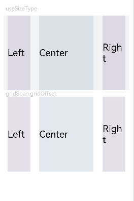

# 栅格设置

更新时间：2026-03-09 02:50:43

来源：https://developer.huawei.com/consumer/cn/doc/harmonyos-references/ts-universal-attributes-grid
**支持设备：** Phone | PC/2in1 | Tablet | Wearable | TV

栅格设置可以为布局提供规律性的结构，解决多尺寸多设备的动态布局问题，保证不同设备上各个模块的布局一致性。
 
> [!NOTE]
> 从API version 7开始支持。后续版本如有新增内容，则采用上角标单独标记该内容的起始版本。 从API version 9开始，该模块不再维护，推荐使用新组件 GridCol 、 GridRow 替代。 栅格布局的列宽、列间距由距离最近的GridContainer父组件决定。使用栅格属性的组件树上至少需要有1个GridContainer容器组件。 gridSpan、gridOffset属性调用时其父组件或祖先组件必须是GridContainer。

  

##### 属性

**系统能力：** SystemCapability.ArkUI.ArkUI.Full
  
| 名称 | 参数类型 | 描述 |
| --- | --- | --- |
| useSizeType(deprecated) | { xs?: number \| { span: number, offset: number }, sm?: number \| { span: number, offset: number }, md?: number \| { span: number, offset: number }, lg?: number \| { span: number, offset: number } } | 设置在特定设备宽度类型下的占用列数和偏移列数，span：占用列数；offset：偏移列数。 当值为number类型时，仅设置列数，当格式如{"span": 1, "offset": 0}时，指同时设置占用列数与偏移列数。 - xs：指设备宽度类型为SizeType.XS时的占用列数和偏移列数。 - sm：指设备宽度类型为SizeType.SM时的占用列数和偏移列数。 - md：指设备宽度类型为SizeType.MD时的占用列数和偏移列数。 - lg：指设备宽度类型为SizeType.LG时的占用列数和偏移列数。 该属性从API version 9开始废弃，推荐使用新组件GridCol、GridRow。 |
| gridSpan(deprecated) | number | 默认占用列数，指useSizeType属性没有设置对应尺寸的列数(span)时，占用的栅格列数。 说明： 设置了栅格span属性，组件的宽度由栅格布局决定。 默认值：1 元服务API： 从API version 11开始，该接口支持在元服务中使用。 该属性从API version 14开始废弃，推荐使用新组件GridCol、GridRow。 |
| gridOffset(deprecated) | number | 默认偏移列数，指useSizeType属性没有设置对应尺寸的偏移(offset)时，当前组件沿着父组件Start方向，偏移的列数，也就是当前组件位于第n列。 说明： - 配置该属性后，当前组件在父组件水平方向的布局不再跟随父组件原有的布局方式，而是沿着父组件的Start方向偏移一定位移。 - 偏移位移 = （列宽 + 间距）* 列数。 - 设置了偏移(gridOffset)的组件之后的兄弟组件会根据该组件进行相对布局，类似相对布局。 默认值：0 元服务API： 从API version 11开始，该接口支持在元服务中使用。 该属性从API version 14开始废弃，推荐使用新组件GridCol、GridRow。 |
 
 
  

##### 示例

设置不同设备类型的宽度，以及单独设置组件的span和offset，在sm尺寸大小的设备上使用useSizeType中sm的数据实现一样的效果。
 
```ArkTS
// xxx.ets
@Entry
@Component
struct GridContainerExample1 {
  build() {
    Column() {
      Text('useSizeType').fontSize(15).fontColor(0xCCCCCC).width('90%')
      GridContainer() {
        Row() {
          Row() {
            Text('Left').fontSize(25)
          }
          .useSizeType({
            xs: { span: 1, offset: 0 }, sm: { span: 1, offset: 0 },
            md: { span: 1, offset: 0 }, lg: { span: 2, offset: 0 }
          })
          .height("100%")
          .backgroundColor(0x66bbb2cb)

          Row() {
            Text('Center').fontSize(25)
          }
          .useSizeType({
            xs: { span: 1, offset: 0 }, sm: { span: 2, offset: 1 },
            md: { span: 5, offset: 1 }, lg: { span: 7, offset: 2 }
          })
          .height("100%")
          .backgroundColor(0x66b6c5d1)

          Row() {
            Text('Right').fontSize(25)
          }
          .useSizeType({
            xs: { span: 1, offset: 0 }, sm: { span: 1, offset: 3 },
            md: { span: 2, offset: 6 }, lg: { span: 3, offset: 9 }
          })
          .height("100%")
          .backgroundColor(0x66bbb2cb)
        }
        .height(200)

      }
      .backgroundColor(0xf1f3f5)
      .margin({ top: 10 })

      // 单独设置组件的span和offset,在sm尺寸大小的设备上使用useSizeType中sm的数据实现一样的效果
      Text('gridSpan,gridOffset').fontSize(15).fontColor(0xCCCCCC).width('90%')
      GridContainer() {
        Row() {
          Row() {
            Text('Left').fontSize(25)
          }
          .gridSpan(1)
          .height("100%")
          .backgroundColor(0x66bbb2cb)

          Row() {
            Text('Center').fontSize(25)
          }
          .gridSpan(2)
          .gridOffset(1)
          .height("100%")
          .backgroundColor(0x66b6c5d1)

          Row() {
            Text('Right').fontSize(25)
          }
          .gridSpan(1)
          .gridOffset(3)
          .height("100%")
          .backgroundColor(0x66bbb2cb)
        }.height(200)
      }
    }
  }
}
```
 
**图1** 设备宽度为SM
 


 
**图2** 设备宽度为MD
 


 
**图3** 设备宽度为LG
 



 
**图4** 单独设置gridSpan和gridOffset在特定屏幕大小下的效果与useSizeType效果一致
 


