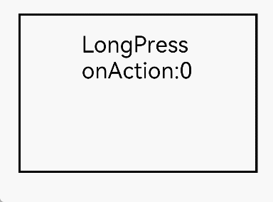

# LongPressGesture

更新时间：2026-03-09 02:50:43

来源：https://developer.huawei.com/consumer/cn/doc/harmonyos-references/ts-basic-gestures-longpressgesture
**支持设备：** Phone / PC/2in1 / Tablet / Wearable / TV

用于触发长按手势事件，触发长按手势的最少手指数为1，默认最短长按时间为500毫秒。可配置duration参数控制最短长按时长。


## 接口
**支持设备：** Phone / PC/2in1 / Tablet / Wearable / TV


### LongPressGesture
**支持设备：** Phone / PC/2in1 / Tablet / Wearable / TV

LongPressGesture(value?: { fingers?: number; repeat?: boolean; duration?: number })

创建长按手势对象。继承自[GestureInterface<T>](https://developer.huawei.com/consumer/cn/doc/harmonyos-references/ts-gesture-common#gestureinterfacet11)。

当组件默认支持可拖拽时，如Text、TextInput、TextArea、HyperLink、Image和RichEditor等组件。长按手势与拖拽会出现冲突，事件优先级如下：

当长按触发时间小于500毫秒时，系统优先响应长按事件而非拖拽事件。

当长按触发时间达到或超过500毫秒时，系统优先响应拖拽事件而非长按事件。

**元服务API：** 从API version 11开始，该接口支持在元服务中使用。

**系统能力：** SystemCapability.ArkUI.ArkUI.Full

**参数：**


| 参数名 | 类型 | 必填 | 说明 |
| --- | --- | --- | --- |
| value | { fingers?: number; repeat?: boolean; duration?: number } | 否 | 设置长按手势参数。  - fingers：触发长按的最少手指数，最小值为1， 最大值为10。 默认值：1   - repeat：是否连续触发事件回调。true表示连续触发事件回调，false表示不连续触发事件回调。 默认值：false   - duration：触发长按的最短时间，单位为毫秒（ms）。 默认值：500 |


### LongPressGesture15+
**支持设备：** Phone / PC/2in1 / Tablet / Wearable / TV

LongPressGesture(options?: LongPressGestureHandlerOptions)

创建长按手势对象。与[LongPressGesture](#longpressgesture-1)相比，options参数新增了对isFingerCountLimited参数，表示是否检查触摸屏幕的手指数量。

当组件默认支持可拖拽时，如Text、TextInput、TextArea、HyperLink、Image和RichEditor等组件。长按手势与拖拽会出现冲突，事件优先级如下：

当长按触发时间小于500毫秒时，系统优先响应长按事件而非拖拽事件。

当长按触发时间达到或超过500毫秒时，系统优先响应拖拽事件而非长按事件。

**元服务API：** 从API version 15开始，该接口支持在元服务中使用。

**系统能力：** SystemCapability.ArkUI.ArkUI.Full

**参数：**


| 参数名 | 类型 | 必填 | 说明 |
| --- | --- | --- | --- |
| options | [LongPressGestureHandlerOptions](https://developer.huawei.com/consumer/cn/doc/harmonyos-references/ts-gesturehandler#longpressgesturehandleroptions) | 否 | 长按手势处理器配置参数。 |


## 事件
**支持设备：** Phone / PC/2in1 / Tablet / Wearable / TV


### onAction
**支持设备：** Phone / PC/2in1 / Tablet / Wearable / TV

onAction(event: (event: GestureEvent) => void)

设置长按手势识别成功回调。

**元服务API：** 从API version 11开始，该接口支持在元服务中使用。

**系统能力：** SystemCapability.ArkUI.ArkUI.Full

**参数：**


| 参数名 | 类型 | 必填 | 说明 |
| --- | --- | --- | --- |
| event | (event: [GestureEvent](https://developer.huawei.com/consumer/cn/doc/harmonyos-references/ts-gesture-common#gestureevent对象说明)) =&gt; void | 是 | 长按手势识别成功回调函数。 |


### onActionEnd
**支持设备：** Phone / PC/2in1 / Tablet / Wearable / TV

onActionEnd(event: (event: GestureEvent) => void)

设置长按手势结束回调。长按手势识别成功后，最后一根手指抬起时触发回调。

**元服务API：** 从API version 11开始，该接口支持在元服务中使用。

**系统能力：** SystemCapability.ArkUI.ArkUI.Full

**参数：**


| 参数名 | 类型 | 必填 | 说明 |
| --- | --- | --- | --- |
| event | (event: [GestureEvent](https://developer.huawei.com/consumer/cn/doc/harmonyos-references/ts-gesture-common#gestureevent对象说明)) =&gt; void | 是 | 长按手势结束回调函数。 |


### onActionCancel
**支持设备：** Phone / PC/2in1 / Tablet / Wearable / TV

onActionCancel(event: () => void)

设置长按手势取消回调。长按手势识别成功后，接收到触摸取消事件时触发回调。不返回手势事件信息。

**元服务API：** 从API version 11开始，该接口支持在元服务中使用。

**系统能力：** SystemCapability.ArkUI.ArkUI.Full

**参数：**


| 参数名 | 类型 | 必填 | 说明 |
| --- | --- | --- | --- |
| event | () =&gt; void | 是 | 长按手势取消回调函数。 |


### onActionCancel18+
**支持设备：** Phone / PC/2in1 / Tablet / Wearable / TV

onActionCancel(event: Callback<GestureEvent>)

设置长按手势取消回调。长按手势识别成功后，接收到触摸取消事件时触发回调。返回手势事件信息。

**元服务API：** 从API version 18开始，该接口支持在元服务中使用。

**系统能力：** SystemCapability.ArkUI.ArkUI.Full

**参数：**


| 参数名 | 类型 | 必填 | 说明 |
| --- | --- | --- | --- |
| event | Callback&lt;[GestureEvent](https://developer.huawei.com/consumer/cn/doc/harmonyos-references/ts-gesture-common#gestureevent对象说明)&gt; | 是 | 长按手势取消回调函数。 |


## 示例
**支持设备：** Phone / PC/2in1 / Tablet / Wearable / TV

该示例通过LongPressGesture实现了长按手势的识别。从API version 22开始，支持通过[LongPressGestureHandlerOptions](https://developer.huawei.com/consumer/cn/doc/harmonyos-references/ts-gesturehandler#longpressgesturehandleroptions)的allowableMovement属性设置识别手势的最大移动距离。


```ts
// xxx.ets
@Entry
@Component
struct LongPressGestureExample {
  @State count: number = 0;

  build() {
    Column() {
      Text('LongPress onAction:' + this.count).fontSize(28)
      // 单指长按文本触发该手势事件
      .gesture(
      // 设置长按手势识别器识别的手势的最大移动距离为200px
      LongPressGesture({ repeat: true, allowableMovement: 200 })
      // 由于repeat设置为true，长按动作存在时会连续触发，触发间隔为duration（默认值500ms）
      .onAction((event: GestureEvent) => {
        if (event && event.repeat) {
          this.count++
        }
      })
      // 长按动作一结束触发
      .onActionEnd((event: GestureEvent) => {
        this.count = 0
      })
      )
    }
    .height(200)
    .width(300)
    .padding(20)
    .border({ width: 3 })
    .margin(30)
  }
}
```


