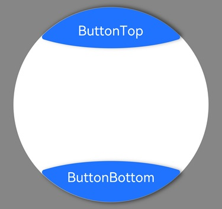

# ArcButton

更新时间：2026-04-20 06:34:33

来源：https://developer.huawei.com/consumer/cn/doc/harmonyos-references/ohos-arkui-advanced-arcbutton
**支持设备：** Phone / PC/2in1 / Tablet / Wearable / TV

弧形按钮组件提供强调、普通、警告等样式按钮，推荐用于圆形屏幕的设备。


## 导入模块
**支持设备：** Phone / PC/2in1 / Tablet / Wearable / TV


```ts
import {
  ArcButton,
  ArcButtonOptions,
  ArcButtonStatus,
  ArcButtonStyleMode,
  ArcButtonPosition,
} from '@kit.ArkUI';
```


## 子组件
**支持设备：** Phone / PC/2in1 / Tablet / Wearable / TV

无


## 属性
**支持设备：** Phone / PC/2in1 / Tablet / Wearable / TV

不支持[通用属性](https://developer.huawei.com/consumer/cn/doc/harmonyos-references/ts-component-general-attributes)


## 事件
**支持设备：** Phone / PC/2in1 / Tablet / Wearable / TV

通用事件支持[点击事件](https://developer.huawei.com/consumer/cn/doc/harmonyos-references/ts-universal-events-click)和[触摸事件](https://developer.huawei.com/consumer/cn/doc/harmonyos-references/ts-universal-events-touch)。


## ArcButton
**支持设备：** Phone / PC/2in1 / Tablet / Wearable / TV

ArcButton({ options: ArcButtonOptions })

创建ArcButton实例，入参是弧形按钮配置选项。

**装饰器类型：** @Component

**元服务API：** 从API version 18开始，该接口支持在元服务中使用。

**系统能力：** SystemCapability.ArkUI.ArkUI.Circle

**参数**：


| 名称 | 类型 | 必填 | 装饰器类型 | 说明 |
| --- | --- | --- | --- | --- |
| options | [ArcButtonOptions](#arcbuttonoptions) | 是 | @Require | 定义ArcButton组件的文本、背景色、阴影等参数。 |


## ArcButtonOptions
**支持设备：** Phone / PC/2in1 / Tablet / Wearable / TV

定义ArcButton的默认样式或自定义样式参数。

**系统能力：** SystemCapability.ArkUI.ArkUI.Circle


### 属性


| 名称 | 类型 | 只读 | 可选 | 说明 |
| --- | --- | --- | --- | --- |
| position | [ArcButtonPosition](#arcbuttonposition) | 否 | 否 | 上下弧形按钮类型属性。          默认值：ArcButtonPosition.BOTTOM_EDGE。          元服务API： 从API version 18开始，该接口支持在元服务中使用。 |
| styleMode | [ArcButtonStyleMode](#arcbuttonstylemode) | 否 | 否 | 弧形按钮样式模式。该样式不支持与[ArcButtonProgressConfig](#arcbuttonprogressconfig23)样式同时使用。          默认值：ArcButtonStyleMode.EMPHASIZED_LIGHT。          元服务API： 从API version 18开始，该接口支持在元服务中使用。 |
| status | [ArcButtonStatus](#arcbuttonstatus) | 否 | 否 | 弧形按钮状态。          默认值：ArcButtonStatus.NORMAL。          元服务API： 从API version 18开始，该接口支持在元服务中使用。 |
| label | [ResourceStr](https://developer.huawei.com/consumer/cn/doc/harmonyos-references/ts-types#resourcestr) | 否 | 否 | 弧形按钮显示文本。          元服务API： 从API version 18开始，该接口支持在元服务中使用。 |
| backgroundBlurStyle | [BlurStyle](https://developer.huawei.com/consumer/cn/doc/harmonyos-references/ts-universal-attributes-background#blurstyle9) | 否 | 否 | 弧形按钮背景模糊能力。          默认值：BlurStyle.NONE。          元服务API： 从API version 18开始，该接口支持在元服务中使用。 |
| backgroundColor | [ColorMetrics](https://developer.huawei.com/consumer/cn/doc/harmonyos-references/js-apis-arkui-graphics#colormetrics12) | 否 | 否 | 弧形按钮背景颜色。          ArcButtonStyleMode需要设置为CUSTOM。          默认值：Color.Black。          元服务API： 从API version 18开始，该接口支持在元服务中使用。 |
| shadowColor | [ColorMetrics](https://developer.huawei.com/consumer/cn/doc/harmonyos-references/js-apis-arkui-graphics#colormetrics12) | 否 | 否 | 弧形按钮阴影颜色。          默认值：Color.Black。          元服务API： 从API version 18开始，该接口支持在元服务中使用。 |
| shadowEnabled | boolean | 否 | 否 | 弧形按钮阴影开关。          默认值：false          值为true时，显示阴影。值为false时，不显示阴影。          元服务API： 从API version 18开始，该接口支持在元服务中使用。 |
| fontSize | [LengthMetrics](https://developer.huawei.com/consumer/cn/doc/harmonyos-references/js-apis-arkui-graphics#lengthmetrics12) | 否 | 否 | 弧形按钮文本大小。          默认值：19fp。          元服务API： 从API version 18开始，该接口支持在元服务中使用。 |
| fontColor | [ColorMetrics](https://developer.huawei.com/consumer/cn/doc/harmonyos-references/js-apis-arkui-graphics#colormetrics12) | 否 | 否 | 弧形按钮文本颜色。          ArcButtonStyleMode需要设置为CUSTOM。          默认值：Color.White。          元服务API： 从API version 18开始，该接口支持在元服务中使用。 |
| pressedFontColor | [ColorMetrics](https://developer.huawei.com/consumer/cn/doc/harmonyos-references/js-apis-arkui-graphics#colormetrics12) | 否 | 否 | 弧形按钮按下文本颜色。          ArcButtonStyleMode需要设置为CUSTOM。          默认值：Color.White。          元服务API： 从API version 18开始，该接口支持在元服务中使用。 |
| fontStyle | [FontStyle](https://developer.huawei.com/consumer/cn/doc/harmonyos-references/ts-appendix-enums#fontstyle) | 否 | 否 | 弧形按钮文本样式。          默认值：FontStyle.Normal。          元服务API： 从API version 18开始，该接口支持在元服务中使用。 |
| fontFamily | string \| [Resource](https://developer.huawei.com/consumer/cn/doc/harmonyos-references/ts-types#resource) | 否 | 否 | 弧形按钮字体名。          元服务API： 从API version 18开始，该接口支持在元服务中使用。 |
| fontMargin | [LocalizedMargin](https://developer.huawei.com/consumer/cn/doc/harmonyos-references/ts-types#localizedmargin12) | 否 | 否 | 弧形按钮文本边距。          默认值：{start:24vp, top: 10vp,end: 24vp, bottom:16vp }。          元服务API： 从API version 18开始，该接口支持在元服务中使用。 |
| progressConfig23+ | [ArcButtonProgressConfig](#arcbuttonprogressconfig23) | 否 | 是 | ArcButton进度条参数。不设置该属性时ArcButton组件表现为按钮样式（[示例1](#示例1-设置弧形按钮)），设置后表现为进度条样式（[示例2](#示例2-设置设备进度条按钮)），进度条样式不受[ArcButtonStyleMode](#arcbuttonstylemode)属性设置影响。          默认值：[ArcButtonProgressConfig](#arcbuttonprogressconfig23) 的各项子属性均取其默认值。          元服务API： 从API version 23开始，该接口支持在元服务中使用。          模型约束： 此接口仅可在Stage模型下使用。 |
| onTouch | [Callback](https://developer.huawei.com/consumer/cn/doc/harmonyos-references/ts-types#voidcallback12)&lt; [TouchEvent](https://developer.huawei.com/consumer/cn/doc/harmonyos-references/ts-universal-events-touch#touchevent对象说明)&gt; | 否 | 是 | 弧形按钮手指触摸动作触发该回调。          元服务API： 从API version 18开始，该接口支持在元服务中使用。 |
| onClick | [Callback](https://developer.huawei.com/consumer/cn/doc/harmonyos-references/ts-types#voidcallback12)&lt;[ClickEvent](https://developer.huawei.com/consumer/cn/doc/harmonyos-references/ts-universal-events-click#clickevent) &gt; | 否 | 是 | 弧形按钮点击动作触发该回调。          元服务API： 从API version 18开始，该接口支持在元服务中使用。 |


### constructor
**支持设备：** Phone / PC/2in1 / Tablet / Wearable / TV

constructor(options: CommonArcButtonOptions)

弧形按钮的构造函数。

**元服务API：** 从API version 18开始，该接口支持在元服务中使用。

**系统能力：** SystemCapability.ArkUI.ArkUI.Circle

**参数：**


| 参数名 | 类型 | 必填 | 说明 |
| --- | --- | --- | --- |
| options | [CommonArcButtonOptions](#commonarcbuttonoptions) | 是 | 定义ArcButton组件的文本、背景色、阴影等参数。 |


## CommonArcButtonOptions
**支持设备：** Phone / PC/2in1 / Tablet / Wearable / TV

ArcButton的默认样式或自定义样式参数。

**系统能力：** SystemCapability.ArkUI.ArkUI.Circle


| 名称 | 类型 | 只读 | 可选 | 说明 |
| --- | --- | --- | --- | --- |
| position | [ArcButtonPosition](#arcbuttonposition) | 否 | 是 | 上下弧形按钮类型属性。          默认值：ArcButtonPosition.BOTTOM_EDGE。          元服务API： 从API version 18开始，该接口支持在元服务中使用。 |
| styleMode | [ArcButtonStyleMode](#arcbuttonstylemode) | 否 | 是 | 弧形按钮样式模式。该样式不支持与[ArcButtonProgressConfig](#arcbuttonprogressconfig23)样式同时使用。          默认值：ArcButtonStyleMode.EMPHASIZED_LIGHT。          元服务API： 从API version 18开始，该接口支持在元服务中使用。 |
| status | [ArcButtonStatus](#arcbuttonstatus) | 否 | 是 | 弧形按钮状态。          默认值：ArcButtonStatus.NORMAL。          元服务API： 从API version 18开始，该接口支持在元服务中使用。 |
| label | [ResourceStr](https://developer.huawei.com/consumer/cn/doc/harmonyos-references/ts-types#resourcestr) | 否 | 是 | 弧形按钮显示文本。          元服务API： 从API version 18开始，该接口支持在元服务中使用。 |
| backgroundBlurStyle | [BlurStyle](https://developer.huawei.com/consumer/cn/doc/harmonyos-references/ts-universal-attributes-background#blurstyle9) | 否 | 是 | 弧形按钮背景模糊能力。          默认值：BlurStyle.NONE。          元服务API： 从API version 18开始，该接口支持在元服务中使用。 |
| backgroundColor | [ColorMetrics](https://developer.huawei.com/consumer/cn/doc/harmonyos-references/js-apis-arkui-graphics#colormetrics12) | 否 | 是 | 弧形按钮背景颜色。          ArcButtonStyleMode需要设置为CUSTOM。          默认值：Color.Black。          元服务API： 从API version 18开始，该接口支持在元服务中使用。 |
| shadowColor | [ColorMetrics](https://developer.huawei.com/consumer/cn/doc/harmonyos-references/js-apis-arkui-graphics#colormetrics12) | 否 | 是 | 弧形按钮阴影颜色。          默认值：Color.Black。          元服务API： 从API version 18开始，该接口支持在元服务中使用。 |
| shadowEnabled | boolean | 否 | 是 | 弧形按钮阴影开关。          默认值：false          值为true时，显示阴影。值为false时，不显示阴影。          元服务API： 从API version 18开始，该接口支持在元服务中使用。 |
| fontSize | [LengthMetrics](https://developer.huawei.com/consumer/cn/doc/harmonyos-references/js-apis-arkui-graphics#lengthmetrics12) | 否 | 是 | 弧形按钮文本大小。          默认值：19fp。          元服务API： 从API version 18开始，该接口支持在元服务中使用。 |
| fontColor | [ColorMetrics](https://developer.huawei.com/consumer/cn/doc/harmonyos-references/js-apis-arkui-graphics#colormetrics12) | 否 | 是 | 弧形按钮文本颜色。          ArcButtonStyleMode需要设置为CUSTOM。          默认值：Color.White。          元服务API： 从API version 18开始，该接口支持在元服务中使用。 |
| pressedFontColor | [ColorMetrics](https://developer.huawei.com/consumer/cn/doc/harmonyos-references/js-apis-arkui-graphics#colormetrics12) | 否 | 是 | 弧形按钮按下文本颜色。          ArcButtonStyleMode需要设置为CUSTOM。          默认值：Color.White。          元服务API： 从API version 18开始，该接口支持在元服务中使用。 |
| fontStyle | [FontStyle](https://developer.huawei.com/consumer/cn/doc/harmonyos-references/ts-appendix-enums#fontstyle) | 否 | 是 | 弧形按钮文本样式。          默认值：FontStyle.Normal。          元服务API： 从API version 18开始，该接口支持在元服务中使用。 |
| fontFamily | string \| [Resource](https://developer.huawei.com/consumer/cn/doc/harmonyos-references/ts-types#resource) | 否 | 是 | 弧形按钮字体名。          元服务API： 从API version 18开始，该接口支持在元服务中使用。 |
| fontMargin | [LocalizedMargin](https://developer.huawei.com/consumer/cn/doc/harmonyos-references/ts-types#localizedmargin12) | 否 | 是 | 弧形按钮文本边距。          默认值：{start:24vp, top: 10vp,end: 24vp, bottom:16vp }。          元服务API： 从API version 18开始，该接口支持在元服务中使用。 |
| progressConfig23+ | [ArcButtonProgressConfig](#arcbuttonprogressconfig23) | 否 | 是 | ArcButton进度条参数。不设置该属性时ArcButton组件表现为按钮样式（[示例1](#示例1-设置弧形按钮)），设置后表现为进度条样式（[示例2](#示例2-设置设备进度条按钮)），进度条样式不受[ArcButtonStyleMode](#arcbuttonstylemode)属性设置影响。          默认值：[ArcButtonProgressConfig](#arcbuttonprogressconfig23) 的各项子属性均取其默认值。          元服务API： 从API version 23开始，该接口支持在元服务中使用。          模型约束： 此接口仅可在Stage模型下使用。 |
| onTouch | [Callback](https://developer.huawei.com/consumer/cn/doc/harmonyos-references/ts-types#voidcallback12)&lt; [TouchEvent](https://developer.huawei.com/consumer/cn/doc/harmonyos-references/ts-universal-events-touch#touchevent对象说明)&gt; | 否 | 是 | 弧形按钮手指触摸动作触发该回调。          元服务API： 从API version 18开始，该接口支持在元服务中使用。 |
| onClick | [Callback](https://developer.huawei.com/consumer/cn/doc/harmonyos-references/ts-types#voidcallback12)&lt;[ClickEvent](https://developer.huawei.com/consumer/cn/doc/harmonyos-references/ts-universal-events-click#clickevent) &gt; | 否 | 是 | 弧形按钮点击动作触发该回调。          元服务API： 从API version 18开始，该接口支持在元服务中使用。 |


## ArcButtonProgressConfig23+
**支持设备：** Phone / PC/2in1 / Tablet / Wearable / TV

ArcButton内进度条的参数配置。

**元服务API：** 从API version 23开始，该接口支持在元服务中使用。

**系统能力：** SystemCapability.ArkUI.ArkUI.Circle

**模型约束：** 此接口仅可在Stage模型下使用。


| 名称 | 类型 | 只读 | 可选 | 说明 |
| --- | --- | --- | --- | --- |
| value | number | 否 | 否 | 进度条当前值。设置小于0的数值时置为0，设置大于total的数值时置为total。          默认值：0          取值范围：[0, total] |
| total | number | 否 | 是 | 进度的最大值。          默认值：100          取值范围：[0, 2147483647]，设置0或超出取值范围取默认值为100。 |
| color | [ResourceColor](https://developer.huawei.com/consumer/cn/doc/harmonyos-references/ts-types#resourcecolor) | 否 | 是 | 进度条前景色。如果组件设置了背景色（[backgroundColor](#arcbuttonoptions)），进度条前景色默认值取组件背景色。进度条前景色不受按钮样式（[ArcButtonStyleMode](#arcbuttonstylemode)）设置影响。进度条背景色仅依赖进度条前景色设置，取进度条前景色的25%透明度。          默认值："#1F71FF"，显示为蓝色。 |


## ArcButtonPosition
**支持设备：** Phone / PC/2in1 / Tablet / Wearable / TV

定义ArcButton可设置的弧形按钮的类型。

**元服务API：** 从API version 18开始，该接口支持在元服务中使用。

**系统能力：** SystemCapability.ArkUI.ArkUI.Circle


| 名称 | 值 | 说明 |
| --- | --- | --- |
| TOP_EDGE | 0 | 上弧形按钮，位于圆形屏幕上方。 |
| BOTTOM_EDGE | 1 | 底部弧形按钮，位于圆形屏幕底部。 |


## ArcButtonStyleMode
**支持设备：** Phone / PC/2in1 / Tablet / Wearable / TV

定义ArcButton可设置弧形按钮样式模式。

**元服务API：** 从API version 18开始，该接口支持在元服务中使用。

**系统能力：** SystemCapability.ArkUI.ArkUI.Circle


| 名称 | 值 | 说明 |
| --- | --- | --- |
| EMPHASIZED_LIGHT | 0 | 强调样式，亮色，表现为蓝色背景、白色文字。 |
| EMPHASIZED_DARK | 1 | 警告样式，暗色，表现为红色背景、白色文字。 |
| NORMAL_LIGHT | 2 | 常规样式，亮色，表现为深蓝色背景、蓝色文字。 |
| NORMAL_DARK | 3 | 常规样式，暗色，表现为深灰色背景、蓝色文字。 |
| CUSTOM | 4 | 自定义按钮颜色和字体颜色。 |


## ArcButtonStatus
**支持设备：** Phone / PC/2in1 / Tablet / Wearable / TV

定义ArcButton可设置的弧形按钮状态。

**元服务API：** 从API version 18开始，该接口支持在元服务中使用。

**系统能力：** SystemCapability.ArkUI.ArkUI.Circle


| 名称 | 值 | 说明 |
| --- | --- | --- |
| NORMAL | 0 | 正常状态。 |
| PRESSED | 1 | 按压状态。 |
| DISABLED | 2 | 禁用状态。 |


## 示例
**支持设备：** Phone / PC/2in1 / Tablet / Wearable / TV


### 示例1 (设置弧形按钮)

该示例展示了ArcButton的基本用法。从API version 18开始，新增ArcButton。示例配置如��：

1.topOptions定义了上弧形按钮，按钮文本为ButtonTop，字体大小为15fp，按钮状态为正常状态，按钮样式为亮色强调，启用阴影。

2.bottomOptions定义了底部弧形按钮，按钮文本为ButtonBottom，字体大小为15fp，按钮样式为亮色强调，启用阴影，设置了按钮的点击事件。

该示例推荐在Wearable设备下运行以获得最佳显示效果，同时支持在其他设备上运行。若要在Wearable设备上运行，需在src/main目录下的工程配置文件[module.json5](https://developer.huawei.com/consumer/cn/doc/harmonyos-guides/module-configuration-file)中[deviceTypes标签](https://developer.huawei.com/consumer/cn/doc/harmonyos-guides/module-configuration-file#devicetypes标签)内配置wearable。


```json
// module.json5
{
  "module": {
    // ...
    "deviceTypes": ["wearable", "phone"]
    // ...
  }
}
```


```ts
// xxx.ets
import {
  LengthMetrics,
  LengthUnit,
  ArcButton,
  ArcButtonOptions,
  ArcButtonStatus,
  ArcButtonStyleMode,
  ArcButtonPosition,
}  from '@kit.ArkUI';

@Entry
@ComponentV2
struct Index {
  @Local topOptions: ArcButtonOptions = new ArcButtonOptions({});
  @Local bottomOptions: ArcButtonOptions = new ArcButtonOptions({});

  aboutToAppear() {
    this.topOptions = new ArcButtonOptions({
      label: 'ButtonTop',
      status: ArcButtonStatus.NORMAL,
      position: ArcButtonPosition.TOP_EDGE,
      styleMode: ArcButtonStyleMode.EMPHASIZED_LIGHT,
      fontSize: new LengthMetrics(15, LengthUnit.FP),
      shadowEnabled: true
    })

    this.bottomOptions = new ArcButtonOptions({
      label: 'ButtonBottom',
      styleMode: ArcButtonStyleMode.EMPHASIZED_LIGHT,
      fontSize: new LengthMetrics(15, LengthUnit.FP),
      shadowEnabled: true,
      onClick: () => {
        console.info('click from ArcButton.');
      }
    })
  }

  build() {
    Stack() {
      Stack() {
        Circle({ width: 233, height: 233 })
        .strokeWidth(0.1)
        .fill(Color.White)

        Column() {
          ArcButton({ options: this.topOptions })
          Blank()
          ArcButton({ options: this.bottomOptions })

        }.width('100%')
        .height('100%')
      }.width(233)
      .height(233)
    }.width('100%')
    .height('100%')
    .alignContent(Alignment.Center)
    .backgroundColor(Color.Gray)
  }
}
```




### 示例2 (设置设备进度条按钮)

该示例展示了ArcButton组件进度条样式的基本用法。从API version 23开始，新增[progressConfig](#arcbuttonoptions)接口。示例配置如下：

1.topOptions定义了上弧形按钮。按钮文本为Add，字体大小为15fp，按钮状态为正常状态，按钮样式为亮色强调，启用阴影。按钮设置了点击事件，点击按钮将增加进度条的进度。

2.bottomOptions定义了底部弧形按钮，按钮文本为进度条百分比，字体大小为15fp，按钮状态为进度条状态，按钮样式为默认样式，启用阴影。

该示例推荐在Wearable设备下运行以获得最佳显示效果，同时支持在其他设备上运行。若要在Wearable设备上运行，需在src/main目录下的工程配置文件[module.json5](https://developer.huawei.com/consumer/cn/doc/harmonyos-guides/module-configuration-file)中[deviceTypes标签](https://developer.huawei.com/consumer/cn/doc/harmonyos-guides/module-configuration-file#devicetypes标签)内配置wearable。


```json
// module.json5
{
  "module": {
    // ...
    "deviceTypes": ["wearable", "phone"]
    // ...
  }
}
```


```ts
// xxx.ets
import {
  LengthMetrics,
  LengthUnit,
  ArcButton,
  ArcButtonOptions,
  ArcButtonStatus,
  ArcButtonStyleMode,
  ArcButtonPosition,
}  from '@kit.ArkUI';

@Entry
@ComponentV2
struct Index {
  @Local topOptions: ArcButtonOptions = new ArcButtonOptions({});
  @Local bottomOptions: ArcButtonOptions = new ArcButtonOptions({});

  aboutToAppear() {
    this.topOptions = new ArcButtonOptions({
      label: 'Add',
      styleMode: ArcButtonStyleMode.EMPHASIZED_LIGHT,
      position: ArcButtonPosition.TOP_EDGE,
      fontSize: new LengthMetrics(15, LengthUnit.FP),
      shadowEnabled: true,
      onClick: () => {
        if(this.bottomOptions.progressConfig && this.bottomOptions.progressConfig.value < 100) {
          this.bottomOptions.progressConfig.value = this.bottomOptions.progressConfig.value + 5
          this.bottomOptions.label = this.bottomOptions.progressConfig.value + "%"
        }
      }
    })

    this.bottomOptions = new ArcButtonOptions({
      label: '0%',
      status: ArcButtonStatus.NORMAL,
      fontSize: new LengthMetrics(15, LengthUnit.FP),
      shadowEnabled: true,
      progressConfig: {value:0, total:100},
    })
  }

  build() {
    Stack() {
      Stack() {
        Circle({ width: 233, height: 233 })
        .strokeWidth(0.1)
        .fill(Color.White)

        Column() {
          ArcButton({ options: this.topOptions })
          Blank()
          ArcButton({ options: this.bottomOptions })

        }.width('100%')
        .height('100%')
      }.width(233)
      .height(233)
    }.width('100%')
    .height('100%')
    .alignContent(Alignment.Center)
    .backgroundColor(Color.Gray)
  }
}
```


