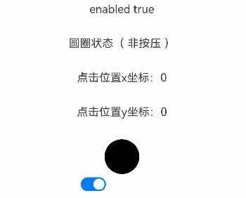
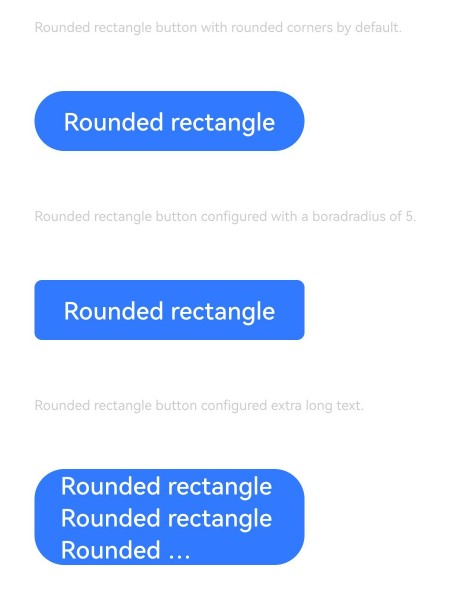
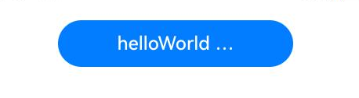

# Button

更新时间：2026-04-28 03:31:56

来源：https://developer.huawei.com/consumer/cn/doc/harmonyos-references/ts-basic-components-button
**支持设备：** Phone | PC/2in1 | Tablet | Wearable | TV

按钮组件，可快速创建不同样式的按钮。
 
> [!NOTE]
> 该组件从API version 7开始支持。后续版本如有新增内容，则采用上角标单独标记该内容的起始版本。

  

#### 子组件

**支持设备：** Phone | PC/2in1 | Tablet | Wearable | TV

可以包含单个子组件。
 
  

#### 接口

**支持设备：** Phone | PC/2in1 | Tablet | Wearable | TV

  

#### Button

**支持设备：** Phone | PC/2in1 | Tablet | Wearable | TV

Button(options: ButtonOptions)
 
创建可以包含单个子组件的按钮。未通过该接口设置时，则按照ButtonOptions中各参数的默认值配置。
 
**卡片能力：** 从API version 9开始，该接口支持在ArkTS卡片中使用。
 
**元服务API：** 从API version 11开始，该接口支持在元服务中使用。
 
**系统能力：** SystemCapability.ArkUI.ArkUI.Full
 
**参数：**
  
| 参数名 | 类型 | 必填 | 说明 |
| --- | --- | --- | --- |
| options | ButtonOptions | 是 | 配置按钮的显示样式。 |
 
 
  

#### Button

**支持设备：** Phone | PC/2in1 | Tablet | Wearable | TV

Button(label: ResourceStr, options?: ButtonOptions)
 
使用文本内容创建相应的按钮组件，此时Button无法包含子组件。
 
文本内容默认单行显示。
 
**卡片能力：** 从API version 9开始，该接口支持在ArkTS卡片中使用。
 
**元服务API：** 从API version 11开始，该接口支持在元服务中使用。
 
**系统能力：** SystemCapability.ArkUI.ArkUI.Full
 
**参数：**
  
| 参数名 | 类型 | 必填 | 说明 |
| --- | --- | --- | --- |
| label | ResourceStr | 是 | 按钮文本内容。 说明： 当文本字符的长度超过按钮本身的宽度时，文本将会被截断。 |
| options | ButtonOptions | 否 | 配置按钮的显示样式。 未设置时，则按照ButtonOptions中各参数的默认值配置。 |
 
 
  

#### Button

**支持设备：** Phone | PC/2in1 | Tablet | Wearable | TV

Button()
 
创建一个空按钮。
 
**卡片能力：** 从API version 9开始，该接口支持在ArkTS卡片中使用。
 
**元服务API：** 从API version 11开始，该接口支持在元服务中使用。
 
**系统能力：** SystemCapability.ArkUI.ArkUI.Full
 
  

#### ButtonOptions对象说明

**支持设备：** Phone | PC/2in1 | Tablet | Wearable | TV

按钮的样式。
 
**系统能力：** SystemCapability.ArkUI.ArkUI.Full
  
| 名称 | 类型 | 只读 | 可选 | 说明 |
| --- | --- | --- | --- | --- |
| type | ButtonType | 否 | 是 | 按钮显示样式。 默认值：ButtonType.ROUNDED_RECTANGLE API version 18及之后，ButtonType的默认值修改为ButtonType.ROUNDED_RECTANGLE。API version 18之前的版本，ButtonType的默认值为ButtonType.Capsule。 卡片能力： 从API version 9开始，该接口支持在ArkTS卡片中使用。 元服务API： 从API version 11开始，该接口支持在元服务中使用。 |
| stateEffect | boolean | 否 | 是 | 按钮按下时是否开启按压态显示效果。 true：开启按压效果；false：关闭按压效果。 默认值：true 说明： 当开启按压态显示效果，且开发者设置状态样式时，会基于状态样式设置完成后的背景色再进行颜色叠加。 卡片能力： 从API version 9开始，该接口支持在ArkTS卡片中使用。 元服务API： 从API version 11开始，该接口支持在元服务中使用。 |
| buttonStyle11+ | ButtonStyleMode | 否 | 是 | 按钮的样式和重要程度，根据设置枚举值的不同，系统自动会调整按钮的背景色和文字颜色。背景色和文字颜色也支持开发者通过backgroundColor、fontColor和role接口设置，实际显示效果以最后一次设置为准。 默认值：ButtonStyleMode.EMPHASIZED 说明： 按钮重要程度：强调按钮>普通按钮>文字按钮。 卡片能力： 从API version 11开始，该接口支持在ArkTS卡片中使用。 元服务API： 从API version 12开始，该接口支持在元服务中使用。 |
| controlSize11+ | ControlSize | 否 | 是 | 按钮的尺寸。 默认值：ControlSize.NORMAL 卡片能力： 从API version 11开始，该接口支持在ArkTS卡片中使用。 元服务API： 从API version 12开始，该接口支持在元服务中使用。 |
| role12+ | ButtonRole | 否 | 是 | 按钮的角色，根据设置枚举值的不同，系统自动会调整按钮的背景色和文字颜色。背景色和文字颜色也支持开发者通过backgroundColor、fontColor和buttonStyle接口设置，实际显示效果以最后一次设置为准。 默认值：ButtonRole.NORMAL 卡片能力： 从API version 12开始，该接口支持在ArkTS卡片中使用。 元服务API： 从API version 12开始，该接口支持在元服务中使用。 |
 
 
  

#### 属性

**支持设备：** Phone | PC/2in1 | Tablet | Wearable | TV

除支持[通用属性](https://developer.huawei.com/consumer/cn/doc/harmonyos-references/ts-component-general-attributes)外，还支持以下属性：
 
  

#### type

**支持设备：** Phone | PC/2in1 | Tablet | Wearable | TV

type(value: ButtonType)
 
设置Button样式。
 
**卡片能力：** 从API version 9开始，该接口支持在ArkTS卡片中使用。
 
**元服务API：** 从API version 11开始，该接口支持在元服务中使用。
 
**系统能力：** SystemCapability.ArkUI.ArkUI.Full
 
**参数：**
  
| 参数名 | 类型 | 必填 | 说明 |
| --- | --- | --- | --- |
| value | ButtonType | 是 | Button样式。 API version 18及之后，ButtonType的默认值从ButtonType.Capsule变更为ButtonType.ROUNDED_RECTANGLE。 |
 
 
  

#### fontSize

**支持设备：** Phone | PC/2in1 | Tablet | Wearable | TV

fontSize(value: Length)
 
设置文本显示字号。
 
**卡片能力：** 从API version 9开始，该接口支持在ArkTS卡片中使用。
 
**元服务API：** 从API version 11开始，该接口支持在元服务中使用。
 
**系统能力：** SystemCapability.ArkUI.ArkUI.Full
 
**参数：**
  
| 参数名 | 类型 | 必填 | 说明 |
| --- | --- | --- | --- |
| value | Length | 是 | 文本显示字号。 默认值：当controlSize为ControlSize.NORMAL时，默认值为\$r('sys.float.Body_L')。 当controlSize为ControlSize.SMALL时，默认值为\$r('sys.float.Body_S')。 说明：设置string类型时，不支持百分比。 |
 
 
  

#### fontColor

**支持设备：** Phone | PC/2in1 | Tablet | Wearable | TV

fontColor(value: ResourceColor)
 
设置文本显示颜色。
 
**卡片能力：** 从API version 9开始，该接口支持在ArkTS卡片中使用。
 
**元服务API：** 从API version 11开始，该接口支持在元服务中使用。
 
**系统能力：** SystemCapability.ArkUI.ArkUI.Full
 
**参数：**
  
| 参数名 | 类型 | 必填 | 说明 |
| --- | --- | --- | --- |
| value | ResourceColor | 是 | 文本显示颜色。 默认值：\$r('sys.color.font_on_primary')，显示为白色字体。 |
 
 
  

#### fontWeight

**支持设备：** Phone | PC/2in1 | Tablet | Wearable | TV

fontWeight(value: number | FontWeight | string)
 
设置文本的字体粗细。
 
**卡片能力：** 从API version 9开始，该接口支持在ArkTS卡片中使用。
 
**元服务API：** 从API version 11开始，该接口支持在元服务中使用。
 
**系统能力：** SystemCapability.ArkUI.ArkUI.Full
 
**参数：**
  
| 参数名 | 类型 | 必填 | 说明 |
| --- | --- | --- | --- |
| value | number \| FontWeight \| string | 是 | 文本的字体粗细，number类型取值[100, 900]，取值间隔为100，取值越大，字体越粗。 默认值：500 string类型仅支持number类型取值的字符串形式，例如'400'，以及'bold'、'bolder'、'lighter'、'regular'、'medium'，分别对应FontWeight中相应的枚举值。 当值为异常值或非法值时，字体粗细取值为400。 |
 
 
  

#### fontStyle8+

**支持设备：** Phone | PC/2in1 | Tablet | Wearable | TV

fontStyle(value: FontStyle)
 
设置文本的字体样式。
 
**卡片能力：** 从API version 9开始，该接口支持在ArkTS卡片中使用。
 
**元服务API：** 从API version 11开始，该接口支持在元服务中使用。
 
**系统能力：** SystemCapability.ArkUI.ArkUI.Full
 
**参数：**
  
| 参数名 | 类型 | 必填 | 说明 |
| --- | --- | --- | --- |
| value | FontStyle | 是 | 文本的字体样式。 默认值：FontStyle.Normal |
 
 
  

#### stateEffect

**支持设备：** Phone | PC/2in1 | Tablet | Wearable | TV

stateEffect(value: boolean)
 
设置是否开启按压态显示效果。
 
**卡片能力：** 从API version 9开始，该接口支持在ArkTS卡片中使用。
 
**元服务API：** 从API version 11开始，该接口支持在元服务中使用。
 
**系统能力：** SystemCapability.ArkUI.ArkUI.Full
 
**参数：**
  
| 参数名 | 类型 | 必填 | 说明 |
| --- | --- | --- | --- |
| value | boolean | 是 | 按钮按下时是否开启按压态显示效果。 true：开启按压效果；false：关闭按压效果。 默认值：true |
 
 
> [!NOTE]
> 使用多态样式设置按压态时，需优先设置stateEffect为false，防止内置按压态与多态样式按压态冲突。

 
  

#### fontFamily8+

**支持设备：** Phone | PC/2in1 | Tablet | Wearable | TV

fontFamily(value: string | Resource)
 
设置字体列表。
 
**卡片能力：** 从API version 9开始，该接口支持在ArkTS卡片中使用。
 
**元服务API：** 从API version 11开始，该接口支持在元服务中使用。
 
**系统能力：** SystemCapability.ArkUI.ArkUI.Full
 
**参数：**
  
| 参数名 | 类型 | 必填 | 说明 |
| --- | --- | --- | --- |
| value | string \| Resource | 是 | 字体列表。默认字体'HarmonyOS Sans'，当前支持'HarmonyOS Sans'字体和注册自定义字体。 |
 
 
  

#### labelStyle10+

**支持设备：** Phone | PC/2in1 | Tablet | Wearable | TV

labelStyle(value: LabelStyle)
 
设置Button组件label文本和字体的样式。
 
**元服务API：** 从API version 11开始，该接口支持在元服务中使用。
 
**系统能力：** SystemCapability.ArkUI.ArkUI.Full
 
**参数：**
  
| 参数名 | 类型 | 必填 | 说明 |
| --- | --- | --- | --- |
| value | LabelStyle | 是 | Button组件label文本和字体的样式。 |
 
 
  

#### buttonStyle11+

**支持设备：** Phone | PC/2in1 | Tablet | Wearable | TV

buttonStyle(value: ButtonStyleMode)
 
设置Button组件的样式和重要程度。根据设置枚举值的不同，系统自动会调整按钮的背景色和文字颜色。背景色和文字颜色也支持开发者通过[backgroundColor](https://developer.huawei.com/consumer/cn/doc/harmonyos-references/ts-universal-attributes-background#backgroundcolor)、[fontColor](#fontcolor)和[role](#role12)接口设置，实际显示效果以最后一次设置为准。
 
> [!NOTE]
> 从API version 12开始，该接口支持在 attributeModifier 中调用。

 
**卡片能力：** 从API version 11开始，该接口支持在ArkTS卡片中使用。
 
**元服务API：** 从API version 12开始，该接口支持在元服务中使用。
 
**系统能力：** SystemCapability.ArkUI.ArkUI.Full
 
**参数：**
  
| 参数名 | 类型 | 必填 | 说明 |
| --- | --- | --- | --- |
| value | ButtonStyleMode | 是 | Button组件的样式和重要程度。 默认值：ButtonStyleMode.EMPHASIZED |
 
 
  

#### controlSize11+

**支持设备：** Phone | PC/2in1 | Tablet | Wearable | TV

controlSize(value: ControlSize)
 
设置Button组件的尺寸。
 
> [!NOTE]
> 从API version 12开始，该接口支持在 attributeModifier 中调用。

 
**卡片能力：** 从API version 11开始，该接口支持在ArkTS卡片中使用。
 
**元服务API：** 从API version 12开始，该接口支持在元服务中使用。
 
**系统能力：** SystemCapability.ArkUI.ArkUI.Full
 
**参数：**
  
| 参数名 | 类型 | 必填 | 说明 |
| --- | --- | --- | --- |
| value | ControlSize | 是 | Button组件的尺寸。 默认值：ControlSize.NORMAL |
 
 
  

#### role12+

**支持设备：** Phone | PC/2in1 | Tablet | Wearable | TV

role(value: ButtonRole)
 
设置Button组件的角色。根据设置枚举值的不同，系统自动会调整按钮的背景色和文字颜色。背景色和文字颜色也支持开发者通过[backgroundColor](https://developer.huawei.com/consumer/cn/doc/harmonyos-references/ts-universal-attributes-background#backgroundcolor)、[fontColor](#fontcolor)和[buttonStyle](#buttonstyle11)接口设置，实际显示效果以最后一次设置为准。
 
**卡片能力：** 从API version 12开始，该接口支持在ArkTS卡片中使用。
 
**元服务API：** 从API version 12开始，该接口支持在元服务中使用。
 
**系统能力：** SystemCapability.ArkUI.ArkUI.Full
 
**参数：**
  
| 参数名 | 类型 | 必填 | 说明 |
| --- | --- | --- | --- |
| value | ButtonRole | 是 | 设置Button组件的角色。 默认值：ButtonRole.NORMAL |
 
 
  

#### contentModifier12+

**支持设备：** Phone | PC/2in1 | Tablet | Wearable | TV

contentModifier(modifier: ContentModifier&lt;ButtonConfiguration&gt;)
 
定制Button内容区的方法。
 
**元服务API：** 从API version 12开始，该接口支持在元服务中使用。
 
**系统能力：** SystemCapability.ArkUI.ArkUI.Full
 
**参数：**
  
| 参数名 | 类型 | 必填 | 说明 |
| --- | --- | --- | --- |
| modifier | ContentModifier&lt;ButtonConfiguration&gt; | 是 | 在Button组件上，定制内容区的方法。 modifier：内容修改器，开发者需要自定义class实现ContentModifier接口。 |
 
 
  

#### minFontScale18+

**支持设备：** Phone | PC/2in1 | Tablet | Wearable | TV

minFontScale(scale: number | Resource)
 
设置文本最小的字体缩放倍数。
 
**元服务API：** 从API version 18开始，该接口支持在元服务中使用。
 
**系统能力：** SystemCapability.ArkUI.ArkUI.Full
 
**参数：**
  
| 参数名 | 类型 | 必填 | 说明 |
| --- | --- | --- | --- |
| scale | number \| Resource | 是 | 文本最小的字体缩放倍数。 取值范围：[0, 1] 说明： 设置的值小于0时，按值为0处理，设置的值大于1，按值为1处理，异常值默认不生效。 |
 
 
  

#### maxFontScale18+

**支持设备：** Phone | PC/2in1 | Tablet | Wearable | TV

maxFontScale(scale: number | Resource)
 
设置文本最大的字体缩放倍数。
 
**元服务API：** 从API version 18开始，该接口支持在元服务中使用。
 
**系统能力：** SystemCapability.ArkUI.ArkUI.Full
 
**参数：**
  
| 参数名 | 类型 | 必填 | 说明 |
| --- | --- | --- | --- |
| scale | number \| Resource | 是 | 文本最大的字体缩放倍数。 取值范围：[1, +∞) 说明： 设置的值小于1时，按值为1处理，异常值默认不生效。 未设置最大缩放倍数时，圆形按钮最大缩放倍数为1倍，胶囊型按钮、普通按钮、圆角矩形按钮最大缩放倍数跟随系统设置。 |
 
 
  

#### ButtonType枚举说明

**支持设备：** Phone | PC/2in1 | Tablet | Wearable | TV

按钮的类型。
 
**系统能力：** SystemCapability.ArkUI.ArkUI.Full
  
| 名称 | 值 | 说明 |
| --- | --- | --- |
| Normal | 0 | 普通按钮（默认不带圆角）。 卡片能力： 从API version 9开始，该接口支持在ArkTS卡片中使用。 元服务API： 从API version 11开始，该接口支持在元服务中使用。 |
| Capsule | 1 | 胶囊型按钮（圆角默认为高度的一半）。 卡片能力： 从API version 9开始，该接口支持在ArkTS卡片中使用。 元服务API： 从API version 11开始，该接口支持在元服务中使用。 |
| Circle | 2 | 圆形按钮。 卡片能力： 从API version 9开始，该接口支持在ArkTS卡片中使用。 元服务API： 从API version 11开始，该接口支持在元服务中使用。 |
| ROUNDED_RECTANGLE15+ | 8 | 圆角矩形按钮（默认值：controlSize为NORMAL，圆角大小20vp，controlSize为SMALL，圆角大小14vp）。 卡片能力： 从API version 15开始，该接口支持在ArkTS卡片中使用。 元服务API： 从API version 15开始，该接口支持在元服务中使用。 |
 
 
> [!NOTE]
> 按钮圆角通过 通用属性borderRadius 设置。 当按钮类型为Capsule时，borderRadius设置不生效，按钮圆角始终为宽、高中较小值的一半。 当按钮类型为Circle时，若同时设置了宽和高，则borderRadius不生效，且按钮半径为宽高中较小值的一半；若只设置宽、高中的一个，则borderRadius不生效，且按钮半径为所设宽或所设高值的一半；若不设置宽高，则borderRadius为按钮半径；若borderRadius的值为负，则borderRadius的值按照0处理。 按钮文本通过 fontSize 、 fontColor 、 fontStyle 、 fontFamily 、 fontWeight 进行设置。 设置 颜色渐变 需先设置 backgroundColor 为透明色。 在不设置borderRadius时，圆角矩形按钮的圆角大小保持默认值不变。圆角大小不会随按钮高度变化而变化，和controlSize属性有关，controlSize为NORMAL时圆角大小20vp，controlSize为SMALL时圆角大小14vp。 设置Button的 border 时，会有默认的 borderRadius 值。如果同时使用border和borderRadius，需将borderRadius放在border之后，以确保borderRadius不会被border中的默认radius覆盖。

 
  

#### LabelStyle10+对象说明

**支持设备：** Phone | PC/2in1 | Tablet | Wearable | TV

Button组件的label文本及其字体样式。
 
**系统能力：** SystemCapability.ArkUI.ArkUI.Full
  
| 名称 | 类型 | 只读 | 可选 | 说明 |
| --- | --- | --- | --- | --- |
| overflow | TextOverflow | 否 | 是 | 设置label文本超长时的显示方式。文本截断是按字截断。例如，英文以单词为最小单位进行截断，若需要以字母为单位进行截断，可在字母间添加零宽空格。 默认值：TextOverflow.Ellipsis 元服务API： 从API version 11开始，该接口支持在元服务中使用。 |
| maxLines | number | 否 | 是 | 设置label文本的最大行数。如果指定此参数，则文本最多不会超过指定的行。如果有多余的文本，可以通过overflow来指定截断方式。 默认值：1 说明： 设置小于等于0的值时，按默认值处理。 元服务API： 从API version 11开始，该接口支持在元服务中使用。 |
| minFontSize | number \| ResourceStr | 否 | 是 | 设置label文本最小显示字号。需配合maxFontSize以及maxLines或布局大小限制使用。 说明： minFontSize小于或等于0时，自适应字号不生效。 元服务API： 从API version 11开始，该接口支持在元服务中使用。 |
| maxFontSize | number \| ResourceStr | 否 | 是 | 设置label文本最大显示字号。需配合minFontSize以及maxLines或布局大小限制使用。 元服务API： 从API version 11开始，该接口支持在元服务中使用。 |
| heightAdaptivePolicy | TextHeightAdaptivePolicy | 否 | 是 | 设置label文本自适应高度的方式。 默认值：TextHeightAdaptivePolicy.MAX_LINES_FIRST 元服务API： 从API version 11开始，该接口支持在元服务中使用。 |
| font | Font | 否 | 是 | 设置label文本字体样式。 默认值： { size:'16.0fp', weight:FontWeight.Medium, style:FontStyle.Normal, family:'HarmonyOS Sans' } 元服务API： 从API version 11开始，该接口支持在元服务中使用。 |
| textAlign23+ | TextAlign | 否 | 是 | 设置label文本在水平方向上的对齐方式，label文本被截断时生效。当使用子节点的Text组件设置label时，此属性不生效，实际的文本对齐方式由子节点Text组件的textAlign属性决定。 Wearable设备默认值为TextAlign.Center，其他设备默认值为TextAlign.Start。 元服务API： 从API version 23开始，该接口支持在元服务中使用。 |
 
 
  

#### ButtonStyleMode11+枚举说明

**支持设备：** Phone | PC/2in1 | Tablet | Wearable | TV

按钮的重要程度。
 
**卡片能力：** 从API version 11开始，该接口支持在ArkTS卡片中使用。
 
**元服务API：** 从API version 12开始，该接口支持在元服务中使用。
 
**系统能力：** SystemCapability.ArkUI.ArkUI.Full
  
| 名称 | 值 | 说明 |
| --- | --- | --- |
| NORMAL | 0 | 普通按钮（一般界面操作）。 |
| EMPHASIZED | 1 | 强调按钮（用于强调当前操作）。 |
| TEXTUAL | 2 | 文本按钮（纯文本，无背景颜色）。 |
 
 
  

#### ControlSize11+枚举说明

**支持设备：** Phone | PC/2in1 | Tablet | Wearable | TV

按钮的尺寸。
 
**卡片能力：** 从API version 11开始，该接口支持在ArkTS卡片中使用。
 
**元服务API：** 从API version 12开始，该接口支持在元服务中使用。
 
**系统能力：** SystemCapability.ArkUI.ArkUI.Full
  
| 名称 | 值 | 说明 |
| --- | --- | --- |
| SMALL | "small" | 小尺寸按钮。 |
| NORMAL | "normal" | 正常尺寸按钮。 |
 
 
  

#### ButtonRole12+枚举说明

**支持设备：** Phone | PC/2in1 | Tablet | Wearable | TV

按钮的角色。
 
**卡片能力：** 从API version 12开始，该接口支持在ArkTS卡片中使用。
 
**元服务API：** 从API version 12开始，该接口支持在元服务中使用。
 
**系统能力：** SystemCapability.ArkUI.ArkUI.Full
  
| 名称 | 值 | 说明 |
| --- | --- | --- |
| NORMAL | 0 | 正常按钮。 |
| ERROR | 1 | 警示按钮。 |
 
 
  

#### ButtonConfiguration12+对象说明

**支持设备：** Phone | PC/2in1 | Tablet | Wearable | TV

开发者需要自定义class实现ContentModifier接口。继承自[CommonConfiguration](https://developer.huawei.com/consumer/cn/doc/harmonyos-references/ts-universal-attributes-content-modifier#commonconfigurationt)。
 
**元服务API：** 从API version 12开始，该接口支持在元服务中使用。
 
**系统能力：** SystemCapability.ArkUI.ArkUI.Full
  
| 名称 | 类型 | 只读 | 可选 | 说明 |
| --- | --- | --- | --- | --- |
| label | string | 否 | 否 | Button的文本标签。 说明：当文本字符的长度超过按钮本身的宽度时，文本将会被截断。 |
| pressed | boolean | 否 | 否 | 指示是否按下Button。 true：按下；false：未按下。 默认值：false 说明： 此按压属性生效区域大小为原本Button组件的大小，而非build出来的新组件大小。 |
| triggerClick | ButtonTriggerClickCallback | 否 | 否 | 使用builder新构建出来组件的点击事件。 |
 
 
  

#### ButtonTriggerClickCallback12+

**支持设备：** Phone | PC/2in1 | Tablet | Wearable | TV

type ButtonTriggerClickCallback = (xPos: number, yPos: number) => void
 
定义ButtonConfiguration中使用的回调类型。
 
**元服务API：** 从API version 12开始，该接口支持在元服务中使用。
 
**系统能力：** SystemCapability.ArkUI.ArkUI.Full
 
**参数：**
  
| 参数名 | 类型 | 必填 | 说明 |
| --- | --- | --- | --- |
| xPos | number | 是 | 点击位置x的坐标。 单位：vp |
| yPos | number | 是 | 点击位置y的坐标。 单位：vp |
 
 
  

#### 事件

**支持设备：** Phone | PC/2in1 | Tablet | Wearable | TV

支持[通用事件](https://developer.huawei.com/consumer/cn/doc/harmonyos-references/ts-component-general-events)。
 
  

#### 示例

**支持设备：** Phone | PC/2in1 | Tablet | Wearable | TV

  

#### 示例1（设置按钮的显示样式）

该示例实现了两种创建按钮的方式，包含子组件或使用文本内容创建相应的按钮。
 
```ArkTS
// xxx.ets
@Entry
@Component
struct ButtonExample {
  build() {
    Flex({ direction: FlexDirection.Column, alignItems: ItemAlign.Start, justifyContent: FlexAlign.SpaceBetween }) {
      Text('Normal button').fontSize(9).fontColor(0xCCCCCC)
      Flex({ alignItems: ItemAlign.Center, justifyContent: FlexAlign.SpaceBetween }) {
        Button('OK', { type: ButtonType.Normal, stateEffect: true })
          .borderRadius(8)
          .backgroundColor(0x317aff)
          .width(90)
          .onClick(() => {
            console.info('ButtonType.Normal');
          })
        Button({ type: ButtonType.Normal, stateEffect: true }) {
          Row() {
            LoadingProgress().width(20).height(20).margin({ left: 12 }).color(0xFFFFFF)
            Text('loading').fontSize(12).fontColor(0xffffff).margin({ left: 5, right: 12 })
          }.alignItems(VerticalAlign.Center)
        }.borderRadius(8).backgroundColor(0x317aff).width(90).height(40)

        Button('Disable', { type: ButtonType.Normal, stateEffect: false }).opacity(0.4)
          .borderRadius(8).backgroundColor(0x317aff).width(90)
      }

      Text('Capsule button').fontSize(9).fontColor(0xCCCCCC)
      Flex({ alignItems: ItemAlign.Center, justifyContent: FlexAlign.SpaceBetween }) {
        Button('OK', { type: ButtonType.Capsule, stateEffect: true }).backgroundColor(0x317aff).width(90)
        Button({ type: ButtonType.Capsule, stateEffect: true }) {
          Row() {
            LoadingProgress().width(20).height(20).margin({ left: 12 }).color(0xFFFFFF)
            Text('loading').fontSize(12).fontColor(0xffffff).margin({ left: 5, right: 12 })
          }.alignItems(VerticalAlign.Center).width(90).height(40)
        }.backgroundColor(0x317aff)

        Button('Disable', { type: ButtonType.Capsule, stateEffect: false }).opacity(0.4)
          .backgroundColor(0x317aff).width(90)
      }

      Text('Circle button').fontSize(9).fontColor(0xCCCCCC)
      Flex({ alignItems: ItemAlign.Center, wrap: FlexWrap.Wrap }) {
        Button({ type: ButtonType.Circle, stateEffect: true }) {
          LoadingProgress().width(20).height(20).color(0xFFFFFF)
        }.width(55).height(55).backgroundColor(0x317aff)

        Button({ type: ButtonType.Circle, stateEffect: true }) {
          LoadingProgress().width(20).height(20).color(0xFFFFFF)
        }.width(55).height(55).margin({ left: 20 }).backgroundColor(0xF55A42)
      }
    }.height(400).padding({ left: 35, right: 35, top: 35 })
  }
}
```
 



 
  

#### 示例2 （为按钮添加渲染控制）

该示例通过if/else控制按钮的显示文本。
 
```ArkTS
// xxx.ets
@Entry
@Component
struct SwipeGestureExample {
  @State count: number = 0;

  build() {
    Column() {
      Text(`${this.count}`)
        .fontSize(30)
        .onClick(() => {
          this.count++;
        })
      if (this.count <= 0) {
        Button('count is negative').fontSize(30).height(50)
      } else if (this.count % 2 === 0) {
        Button('count is even').fontSize(30).height(50)
      } else {
        Button('count is odd').fontSize(30).height(50)
      }
    }.height('100%').width('100%').justifyContent(FlexAlign.Center)
  }
}
```
 



 
  

#### 示例3 （设置按钮文本样式）

该示例通过配置labelStyle自定义按钮文本的显示样式。
 
```ArkTS
// xxx.ets
@Entry
@Component
struct ButtonTestDemo {
  @State txt: string = 'overflowTextOverLengthTextOverflow.Clip';
  @State widthShortSize: number = 205;

  build() {
    Row() {
      Column() {
        Button(this.txt)
          .type(ButtonType.Capsule)
          .width(this.widthShortSize)
          .height(100)
          .backgroundColor(0x317aff)
          .labelStyle({ overflow: TextOverflow.Clip,
            maxLines: 1,
            minFontSize: 20,
            maxFontSize: 20,
            font: {
              size: 20,
              weight: FontWeight.Bolder,
              family: 'cursive',
              style: FontStyle.Italic
            }
          })
          .fontSize(40)
      }
      .width('100%')
    }
    .height('100%')
  }
}
```
 



 
  

#### 示例4（设置不同尺寸按钮的重要程度）

该示例通过配置controlSize、buttonStyle实现不同尺寸按钮的重要程度。
 
```ArkTS
// xxx.ets
@Entry
@Component
struct ButtonExample {
  build() {
    Flex({ direction: FlexDirection.Column, alignItems: ItemAlign.Start, justifyContent: FlexAlign.SpaceBetween }) {
      Text('Normal size button').fontSize(9).fontColor(0xCCCCCC)
      Flex({ alignItems: ItemAlign.Center, justifyContent: FlexAlign.SpaceBetween }) {
        Button('Emphasized', { buttonStyle: ButtonStyleMode.EMPHASIZED });
        Button('Normal', { buttonStyle: ButtonStyleMode.NORMAL });
        Button('Textual', { buttonStyle: ButtonStyleMode.TEXTUAL });
      }

      Text('Small size button').fontSize(9).fontColor(0xCCCCCC)
      Flex({ alignItems: ItemAlign.Center, justifyContent: FlexAlign.SpaceBetween }) {
        Button('Emphasized', { controlSize: ControlSize.SMALL, buttonStyle: ButtonStyleMode.EMPHASIZED });
        Button('Normal', { controlSize: ControlSize.SMALL, buttonStyle: ButtonStyleMode.NORMAL });
        Button('Textual', { controlSize: ControlSize.SMALL, buttonStyle: ButtonStyleMode.TEXTUAL });
      }

      Text('Small size button').fontSize(9).fontColor(0xCCCCCC)
      Flex({ alignItems: ItemAlign.Center, justifyContent: FlexAlign.SpaceBetween }) {
        Button('Emphasized').controlSize(ControlSize.SMALL).buttonStyle(ButtonStyleMode.EMPHASIZED);
        Button('Normal').controlSize(ControlSize.SMALL).buttonStyle(ButtonStyleMode.NORMAL);
        Button('Textual').controlSize(ControlSize.SMALL).buttonStyle(ButtonStyleMode.TEXTUAL);
      }

    }.height(400).padding({ left: 35, right: 35, top: 35 })
  }
}
```
 


 
  

#### 示例5（设置按钮的角色）

该示例通过配置role实现按钮的角色。
 
```ArkTS
// xxx.ets
@Entry
@Component
struct ButtonExample {
  build() {
    Flex({ direction: FlexDirection.Column, alignItems: ItemAlign.Start, justifyContent: FlexAlign.SpaceBetween }) {
      Text('Role is Normal button').fontSize(9).fontColor(0xCCCCCC)
      Flex({ alignItems: ItemAlign.Center, justifyContent: FlexAlign.SpaceBetween }) {
        Button('Emphasized', { buttonStyle: ButtonStyleMode.EMPHASIZED, role: ButtonRole.NORMAL });
        Button('Normal', { buttonStyle: ButtonStyleMode.NORMAL, role: ButtonRole.NORMAL });
        Button('Textual', { buttonStyle: ButtonStyleMode.TEXTUAL, role: ButtonRole.NORMAL });
      }
      Text('Role is Error button').fontSize(9).fontColor(0xCCCCCC)
      Flex({ alignItems: ItemAlign.Center, justifyContent: FlexAlign.SpaceBetween }) {
        Button('Emphasized', { buttonStyle: ButtonStyleMode.EMPHASIZED, role: ButtonRole.ERROR});
        Button('Normal', { buttonStyle: ButtonStyleMode.NORMAL, role: ButtonRole.ERROR });
        Button('Textual', { buttonStyle: ButtonStyleMode.TEXTUAL, role: ButtonRole.ERROR });
      }
    }.height(200).padding({ left: 15, right: 15, top: 35 })
  }
}
```
 


 
  

#### 示例6（设置自定义样式按钮）

该示例实现了自定义样式的功能，自定义样式实现了一个圆圈替换原本的按钮样式。如果按压，圆圈将变成红色，标题会显示按压字样；如果没有按压，圆圈将变成黑色，标题会显示非按压字样。
 
```json
class MyButtonStyle implements ContentModifier<ButtonConfiguration> {
  x: number = 0;
  y: number = 0;
  selectedColor: Color = Color.Black;

  constructor(x: number, y: number, colorType: Color) {
    this.x = x;
    this.y = y;
    this.selectedColor = colorType;
  }

  applyContent(): WrappedBuilder<[ButtonConfiguration]> {
    return wrapBuilder(buildButton1);
  }
}

@Builder
function buildButton1(config: ButtonConfiguration) {
  Column({ space: 30 }) {
    Text(config.enabled ? "enabled true" : "enabled false")
    Text('圆圈状态' + (config.pressed ? "（ 按压 ）" : "（ 非按压 ）"))
    Text('点击位置x坐标：' + (config.enabled ? (config.contentModifier as MyButtonStyle).x : "0"))
    Text('点击位置y坐标：' + (config.enabled ? (config.contentModifier as MyButtonStyle).y : "0"))
    Circle({ width: 50, height: 50 })
      .fill(config.pressed ? (config.contentModifier as MyButtonStyle).selectedColor : Color.Black)
      .gesture(
        TapGesture({ count: 1 }).onAction((event: GestureEvent) => {
          config.triggerClick(event.fingerList[0].localX, event.fingerList[0].localY)
        })).opacity(config.enabled ? 1 : 0.1)
  }
}

@Entry
@Component
struct ButtonExample {
  @State buttonEnabled: boolean = true;
  @State positionX: number = 0;
  @State positionY: number = 0;
  @State state: boolean[] = [true, false];
  @State index: number = 0;

  build() {
    Column() {
      Button('OK')
        .contentModifier(new MyButtonStyle(this.positionX, this.positionY, Color.Red))
        .onClick((event) => {
          console.info('change' + JSON.stringify(event));
          this.positionX = event.displayX;
          this.positionY = event.displayY;
        }).enabled(this.buttonEnabled)
      Row() {
        Toggle({ type: ToggleType.Switch, isOn: true }).onChange((value: boolean) => {
          if (value) {
            this.buttonEnabled = true;
          } else {
            this.buttonEnabled = false;
          }
        }).margin({ left: -80 })
      }
    }.height('100%').width('100%').justifyContent(FlexAlign.Center)
  }
}
```
 


 
  

#### 示例7（设置圆角矩形按钮）

该示例通过配置ButtonType.ROUNDED_RECTANGLE创建圆角矩形按钮。
 
```text
@Entry
@Component
struct ButtonExample {
  build() {
    Flex({ direction: FlexDirection.Column, alignItems: ItemAlign.Start, justifyContent: FlexAlign.SpaceBetween }) {
      Text('Rounded rectangle button with rounded corners by default.').fontSize(9).fontColor(0xCCCCCC)
      Flex({ alignItems: ItemAlign.Center, justifyContent: FlexAlign.SpaceBetween }) {
        Button('Rounded rectangle')
          .type(ButtonType.ROUNDED_RECTANGLE)
          .backgroundColor(0x317aff)
          .controlSize(ControlSize.NORMAL)
          .width(180)
      }
      Text('Rounded rectangle button configured with a borderRadius of 5.').fontSize(9).fontColor(0xCCCCCC)
      Flex({ alignItems: ItemAlign.Center, justifyContent: FlexAlign.SpaceBetween }) {
        Button('Rounded rectangle')
          .type(ButtonType.ROUNDED_RECTANGLE)
          .backgroundColor(0x317aff)
          .controlSize(ControlSize.NORMAL)
          .width(180)
          .borderRadius(5)
      }
      Text('Rounded rectangle button configured extra long text.').fontSize(9).fontColor(0xCCCCCC)
      Flex({ alignItems: ItemAlign.Center, justifyContent: FlexAlign.SpaceBetween }) {
        Button('Rounded rectangle Rounded rectangle Rounded rectangle Rounded rectangle')
          .type(ButtonType.ROUNDED_RECTANGLE)
          .backgroundColor(0x317aff)
          .width(180)
          .labelStyle({overflow:TextOverflow.Ellipsis, maxLines:3, minFontSize: 0})
      }
    }.height(400).padding({ left: 35, right: 35, top: 35 })
  }
}
```
 


 
  

#### 示例8（设置label文本水平对齐方式）

该示例通过配置[LabelStyle](#labelstyle10对象说明)的textAlign，设置文本对齐方式。
 
从API version 23开始，新增textAlign接口。
 
```text
@Entry
@Component
struct Index {
  build() {
    Column(){
      Button('helloWorld helloWorld helloWorld helloWorld helloWorld helloWorld')
        .width(200)
        .labelStyle({
          textAlign: TextAlign.Center
        })
    }
    .width('100%')
    .alignItems(HorizontalAlign.Center)
  }
}
```
 


