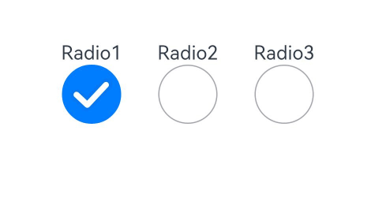
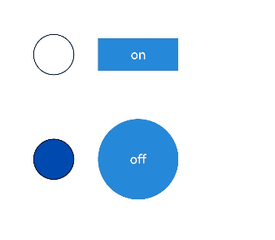

# Radio

更新时间：2026-05-26 06:48:54

来源：https://developer.huawei.com/consumer/cn/doc/harmonyos-references/ts-basic-components-radio
**支持设备：** Phone | PC/2in1 | Tablet | Wearable | TV

单选框，提供相应的用户交互选择项。

> [!NOTE]
> API version 12开始，Radio选中默认样式由RadioIndicatorType.DOT变为RadioIndicatorType.TICK。 该组件从API version 8开始支持。后续版本如有新增内容，则采用上角标单独标记该内容的起始版本。 该组件默认有 margin 间距，默认值为：{ top: '14px', right: '14px', bottom: '14px', left: '14px' }。


#### 子组件

**支持设备：** Phone | PC/2in1 | Tablet | Wearable | TV

无


#### 接口

**支持设备：** Phone | PC/2in1 | Tablet | Wearable | TV

Radio(options: RadioOptions)

创建单选框组件。

**卡片能力：** 从API version 9开始，该接口支持在ArkTS卡片中使用。

**元服务API：** 从API version 11开始，该接口支持在元服务中使用。

**系统能力：** SystemCapability.ArkUI.ArkUI.Full

**参数：**

| 参数名 | 类型 | 必填 | 说明 |
| --- | --- | --- | --- |
| options | RadioOptions | 是 | 配置单选框的参数。 |


#### RadioOptions对象说明

**支持设备：** Phone | PC/2in1 | Tablet | Wearable | TV

单选框的信息。

**系统能力：** SystemCapability.ArkUI.ArkUI.Full

| 名称 | 类型 | 只读 | 可选 | 说明 |
| --- | --- | --- | --- | --- |
| value | string | 否 | 否 | 当前单选框的值。 卡片能力： 从API version 9开始，该接口支持在ArkTS卡片中使用。 元服务API： 从API version 11开始，该接口支持在元服务中使用。 |
| group | string | 否 | 否 | 当前单选框的所属群组名称，相同group的Radio只能有一个被选中。 卡片能力： 从API version 9开始，该接口支持在ArkTS卡片中使用。 元服务API： 从API version 11开始，该接口支持在元服务中使用。 |
| indicatorType12+ | RadioIndicatorType | 否 | 是 | 配置单选框的选中样式。未设置时按照RadioIndicatorType.TICK进行显示。 卡片能力： 从API version 12开始，该接口支持在ArkTS卡片中使用。 元服务API： 从API version 12开始，该接口支持在元服务中使用。 |
| indicatorBuilder12+ | CustomBuilder | 否 | 是 | 配置单选框的选中样式为自定义组件。自定义组件与Radio组件为中心点对齐显示。indicatorBuilder设置为undefined时，按照RadioIndicatorType.TICK进行显示。 卡片能力： 从API version 12开始，该接口支持在ArkTS卡片中使用。 元服务API： 从API version 12开始，该接口支持在元服务中使用。 |


#### RadioIndicatorType12+枚举说明

**支持设备：** Phone | PC/2in1 | Tablet | Wearable | TV

单选框的样式。

**卡片能力：** 从API version 12开始，该接口支持在ArkTS卡片中使用。

**元服务API：** 从API version 12开始，该接口支持在元服务中使用。

**系统能力：** SystemCapability.ArkUI.ArkUI.Full

| 名称 | 值 | 说明 |
| --- | --- | --- |
| TICK | 0 | 选中样式为系统默认TICK图标。 |
| DOT | 1 | 选中样式为系统默认DOT图标。 |
| CUSTOM | 2 | 选中样式为indicatorBuilder中的内容。 |


#### 属性

**支持设备：** Phone | PC/2in1 | Tablet | Wearable | TV

除支持[通用属性](https://developer.huawei.com/consumer/cn/doc/harmonyos-references/ts-component-general-attributes)外，还支持以下属性：


#### checked

**支持设备：** Phone | PC/2in1 | Tablet | Wearable | TV

checked(value: boolean)

设置单选框的选中状态。

从API version 10开始，该属性支持[$$](https://developer.huawei.com/consumer/cn/doc/harmonyos-guides/arkts-two-way-sync)双向绑定变量。

从API version 18开始，该属性支持[!!](https://developer.huawei.com/consumer/cn/doc/harmonyos-guides/arkts-new-binding#系统组件参数双向绑定)双向绑定变量。

**卡片能力：** 从API version 9开始，该接口支持在ArkTS卡片中使用。

**元服务API：** 从API version 11开始，该接口支持在元服务中使用。

**系统能力：** SystemCapability.ArkUI.ArkUI.Full

**参数：**

| 参数名 | 类型 | 必填 | 说明 |
| --- | --- | --- | --- |
| value | boolean | 是 | 单选框的选中状态。 默认值：false 值为true时，单选框被选中。值为false时，单选框不被选中。 |


#### checked18+

**支持设备：** Phone | PC/2in1 | Tablet | Wearable | TV

checked(isChecked: Optional&lt;boolean&gt;)

设置单选框的选中状态。与[checked](#checked)相比，isChecked参数新增了对undefined类型的支持。

该属性支持[$$](https://developer.huawei.com/consumer/cn/doc/harmonyos-guides/arkts-two-way-sync)、[!!](https://developer.huawei.com/consumer/cn/doc/harmonyos-guides/arkts-new-binding#系统组件参数双向绑定)双向绑定变量。

**卡片能力：** 从API version 18开始，该接口支持在ArkTS卡片中使用。

**元服务API：** 从API version 18开始，该接口支持在元服务中使用。

**系统能力：** SystemCapability.ArkUI.ArkUI.Full

**参数：**

| 参数名 | 类型 | 必填 | 说明 |
| --- | --- | --- | --- |
| isChecked | Optional&lt;boolean&gt; | 是 | 单选框的选中状态。 当isChecked的值为undefined时取默认值false。 值为true时，单选框被选中。值为false时，单选框不被选中。 |


#### radioStyle10+

**支持设备：** Phone | PC/2in1 | Tablet | Wearable | TV

radioStyle(value?: RadioStyle)

设置单选框选中状态和非选中状态的样式。

从API version 10开始，该接口支持在ArkTS组件中使用。

**元服务API：** 从API version 11开始，该接口支持在元服务中使用。

**系统能力：** SystemCapability.ArkUI.ArkUI.Full

**参数：**

| 参数名 | 类型 | 必填 | 说明 |
| --- | --- | --- | --- |
| value | RadioStyle | 否 | 单选框选中状态和非选中状态的样式。 未设置时，则按照RadioStyle中各参数的默认值配置。 |


#### contentModifier12+

**支持设备：** Phone | PC/2in1 | Tablet | Wearable | TV

contentModifier(modifier: ContentModifier&lt;RadioConfiguration&gt;)

定制Radio内容区的方法。

**元服务API：** 从API version 12开始，该接口支持在元服务中使用。

**系统能力：** SystemCapability.ArkUI.ArkUI.Full

**参数：**

| 参数名 | 类型 | 必填 | 说明 |
| --- | --- | --- | --- |
| modifier | ContentModifier&lt;RadioConfiguration&gt; | 是 | 在Radio组件上，定制内容区的方法。 modifier：内容修改器，开发者需要自定义class实现ContentModifier接口。 |


#### contentModifier18+

**支持设备：** Phone | PC/2in1 | Tablet | Wearable | TV

contentModifier(modifier: Optional<ContentModifier&lt;RadioConfiguration&gt;>)

定制Radio内容区的方法。与[contentModifier](#contentmodifier12)12+相比，modifier参数新增了对undefined类型的支持。

**元服务API：** 从API version 18开始，该接口支持在元服务中使用。

**系统能力：** SystemCapability.ArkUI.ArkUI.Full

**参数：**

| 参数名 | 类型 | 必填 | 说明 |
| --- | --- | --- | --- |
| modifier | Optional<ContentModifier&lt;RadioConfiguration&gt;> | 是 | 在Radio组件上，定制内容区的方法。 modifier：内容修改器，开发者需要自定义class实现ContentModifier接口。 当modifier的值为undefined时，不使用内容修改器。 |


#### 事件

**支持设备：** Phone | PC/2in1 | Tablet | Wearable | TV

除支持[通用事件](https://developer.huawei.com/consumer/cn/doc/harmonyos-references/ts-component-general-events)外，还支持以下事件：


#### onChange

**支持设备：** Phone | PC/2in1 | Tablet | Wearable | TV

onChange(callback: (isChecked: boolean) => void)

单选框选中状态改变时触发的回调。

**卡片能力：** 从API version 9开始，该接口支持在ArkTS卡片中使用。

**元服务API：** 从API version 11开始，该接口支持在元服务中使用。

**系统能力：** SystemCapability.ArkUI.ArkUI.Full

**参数：**

| 参数名 | 类型 | 必填 | 说明 |
| --- | --- | --- | --- |
| isChecked | boolean | 是 | 单选框选中状态改变时触发该回调。 值为true时，表示从未选中变为选中。值为false时，表示从选中变为未选中。 |


#### onChange18+

**支持设备：** Phone | PC/2in1 | Tablet | Wearable | TV

onChange(callback: Optional&lt;OnRadioChangeCallback&gt;)

单选框选中状态改变时触发的回调。与[onChange](#onchange)相比，callback参数新增了对undefined类型的支持。

**卡片能力：** 从API version 18开始，该接口支持在ArkTS卡片中使用。

**元服务API：** 从API version 18开始，该接口支持在元服务中使用。

**系统能力：** SystemCapability.ArkUI.ArkUI.Full

**参数：**

| 参数名 | 类型 | 必填 | 说明 |
| --- | --- | --- | --- |
| callback | Optional&lt;OnRadioChangeCallback&gt; | 是 | 单选框选中状态改变时触发该回调。 当callback的值为undefined时，不使用回调函数。 |


#### OnRadioChangeCallback18+

**支持设备：** Phone | PC/2in1 | Tablet | Wearable | TV

type OnRadioChangeCallback = (isChecked: boolean) => void

单选框选中状态改变时触发的回调函数类型定义。

**元服务API：** 从API version 18开始，该接口支持在元服务中使用。

**系统能力：** SystemCapability.ArkUI.ArkUI.Full

**参数：**

| 参数名 | 类型 | 必填 | 说明 |
| --- | --- | --- | --- |
| isChecked | boolean | 是 | 单选框的状态。 值为true时，表示从未选中变为选中。值为false时，表示从选中变为未选中。 |


#### RadioStyle10+对象说明

**支持设备：** Phone | PC/2in1 | Tablet | Wearable | TV

单选框的颜色。

**元服务API：** 从API version 11开始，该接口支持在元服务中使用。

**系统能力：** SystemCapability.ArkUI.ArkUI.Full

| 名称 | 类型 | 只读 | 可选 | 说明 |
| --- | --- | --- | --- | --- |
| checkedBackgroundColor | ResourceColor | 否 | 是 | 开启状态底板颜色。 默认值：\$r('sys.color.ohos_id_color_text_primary_activated') |
| uncheckedBorderColor | ResourceColor | 否 | 是 | 关闭状态描边颜色。 默认值：\$r('sys.color.ohos_id_color_switch_outline_off') |
| indicatorColor | ResourceColor | 否 | 是 | 开启状态内部圆饼颜色。从API version 12开始，indicatorType设置为RadioIndicatorType.TICK和RadioIndicatorType.DOT时，支持修改内部颜色。indicatorType设置为RadioIndicatorType.CUSTOM时，不支持修改内部颜色。 默认值：\$r('sys.color.ohos_id_color_foreground_contrary') |


#### RadioConfiguration12+对象说明

**支持设备：** Phone | PC/2in1 | Tablet | Wearable | TV

开发者需要自定义class实现ContentModifier接口。继承自[CommonConfiguration](https://developer.huawei.com/consumer/cn/doc/harmonyos-references/ts-universal-attributes-content-modifier#commonconfigurationt)。

**元服务API：** 从API version 12开始，该接口支持在元服务中使用。

**系统能力：** SystemCapability.ArkUI.ArkUI.Full

| 名称 | 类型 | 只读 | 可选 | 说明 |
| --- | --- | --- | --- | --- |
| value | string | 否 | 否 | 当前单选框的值。 |
| checked | boolean | 否 | 否 | 设置单选框的选中状态。 默认值：false 值为true时，单选框被选中。值为false时，单选框不被选中。 |
| triggerChange | Callback&lt;boolean&gt; | 否 | 否 | 触发单选框选中状态变化。 值为true时，表示从未选中变为选中。值为false时，表示从选中变为未选中。 |


#### 示例

**支持设备：** Phone | PC/2in1 | Tablet | Wearable | TV


#### 示例1 （设置底板颜色）

该示例通过配置checkedBackgroundColor实现自定义单选框的底板颜色。

```ArkTS
// xxx.ets
@Entry
@Component
struct RadioExample {
  build() {
    Flex({ direction: FlexDirection.Row, justifyContent: FlexAlign.Center, alignItems: ItemAlign.Center }) {
      Column() {
        Text('Radio1')
        Radio({ value: 'Radio1', group: 'radioGroup' }).checked(true)
          .radioStyle({
            checkedBackgroundColor: Color.Pink
          })
          .height(50)
          .width(50)
          .onChange((isChecked: boolean) => {
            console.info('Radio1 status is ' + isChecked);
          })
      }
      Column() {
        Text('Radio2')
        Radio({ value: 'Radio2', group: 'radioGroup' }).checked(false)
          .radioStyle({
            checkedBackgroundColor: Color.Pink
          })
          .height(50)
          .width(50)
          .onChange((isChecked: boolean) => {
            console.info('Radio2 status is ' + isChecked);
          })
      }
      Column() {
        Text('Radio3')
        Radio({ value: 'Radio3', group: 'radioGroup' }).checked(false)
          .radioStyle({
            checkedBackgroundColor: Color.Pink
          })
          .height(50)
          .width(50)
          .onChange((isChecked: boolean) => {
            console.info('Radio3 status is ' + isChecked);
          })
      }
    }.padding({ top: 30 })
  }
}
```





#### 示例2 （设置选中样式）

该示例通过配置indicatorType、indicatorBuilder实现自定义选中样式。

```ArkTS
// xxx.ets
@Entry
@Component
struct RadioExample {
  @Builder
  indicatorBuilder() {
    // $r('app.media.star')需要替换为开发者所需的图像资源文件。
    Image($r("app.media.star"))
  }
  build() {
    Flex({ direction: FlexDirection.Row, justifyContent: FlexAlign.Center, alignItems: ItemAlign.Center }) {
      Column() {
        Text('Radio1')
        Radio({ value: 'Radio1', group: 'radioGroup',
          indicatorType:RadioIndicatorType.TICK
        }).checked(true)
          .height(50)
          .width(80)
          .onChange((isChecked: boolean) => {
            console.info('Radio1 status is ' + isChecked);
          })
      }
      Column() {
        Text('Radio2')
        Radio({ value: 'Radio2', group: 'radioGroup',
          indicatorType:RadioIndicatorType.DOT
        }).checked(false)
          .height(50)
          .width(80)
          .onChange((isChecked: boolean) => {
            console.info('Radio2 status is ' + isChecked);
          })
      }
      Column() {
        Text('Radio3')
        Radio({ value: 'Radio3', group: 'radioGroup',
          indicatorType:RadioIndicatorType.CUSTOM,
          indicatorBuilder:()=>{this.indicatorBuilder()}
        }).checked(false)
          .height(50)
          .width(80)
          .onChange((isChecked: boolean) => {
            console.info('Radio3 status is ' + isChecked);
          })
      }
    }.padding({ top: 30 })
  }
}
```





#### 示例3（设置自定义样式）

该示例通过contentModifier实现自定义单选框样式。

```text
class MyRadioStyle implements ContentModifier<RadioConfiguration> {
  type: number = 0;
  selectedColor: ResourceColor = Color.Black;

  constructor(numberType: number, colorType: ResourceColor) {
    this.type = numberType;
    this.selectedColor = colorType;
  }

  applyContent(): WrappedBuilder<[RadioConfiguration]> {
    return wrapBuilder(buildRadio);
  }
}

@Builder
function buildRadio(config: RadioConfiguration) {
  Row({ space: 30 }) {
    Circle({ width: 50, height: 50 })
      .stroke(Color.Black)
      .fill(config.checked ? (config.contentModifier as MyRadioStyle).selectedColor : Color.White)
    Button(config.checked ? "off" : "on")
      .width(100)
      .type(config.checked ? (config.contentModifier as MyRadioStyle).type : ButtonType.Normal)
      .backgroundColor('#2787D9')
      .onClick(() => {
        if (config.checked) {
          config.triggerChange(false);
        } else {
          config.triggerChange(true);
        }
      })
  }
}

@Entry
@Component
struct refreshExample {
  build() {
    Column({ space: 50 }) {
      Row() {
        Radio({ value: 'Radio1', group: 'radioGroup' })
          .contentModifier(new MyRadioStyle(1, '#004AAF'))
          .checked(false)
          .width(300)
          .height(100)
      }

      Row() {
        Radio({ value: 'Radio2', group: 'radioGroup' })
          .checked(true)
          .width(300)
          .height(60)
          .contentModifier(new MyRadioStyle(2, '#004AAF'))
      }
    }
  }
}
```


