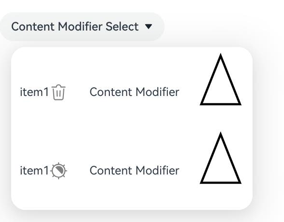
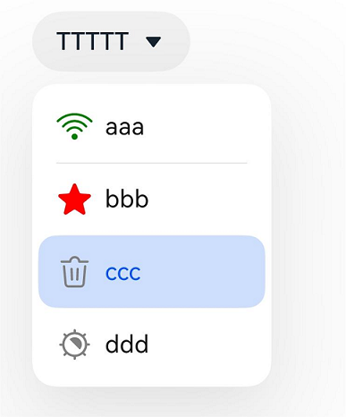
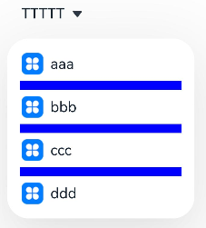
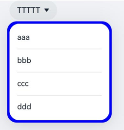
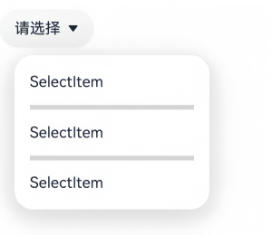
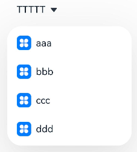
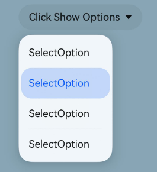
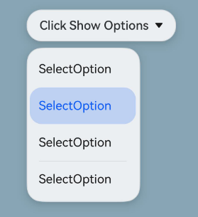

# Select

更新时间：2026-07-28 11:23:46

来源：https://developer.huawei.com/consumer/cn/doc/harmonyos-references/ts-basic-components-select
**支持设备：** Phone | PC/2in1 | Tablet | Wearable | TV

提供下拉选择菜单，让用户在多个选项间选择。Select组件支持设置选项图标、自定义样式、分割线等，适用于需要在有限空间内展示多个选项供用户选择的场景。

> [!NOTE]
> 该组件从API version 8开始支持。后续版本的新增接口，采用上角标单独标记接口的起始版本。


#### 子组件

**支持设备：** Phone | PC/2in1 | Tablet | Wearable | TV

无


#### 接口

**支持设备：** Phone | PC/2in1 | Tablet | Wearable | TV

Select(options: Array&lt;SelectOption&gt;)

**元服务API：** 从API version 11开始，该接口支持在元服务中使用。

**系统能力：** SystemCapability.ArkUI.ArkUI.Full

**参数：**

| 参数名 | 类型 | 必填 | 说明 |
| --- | --- | --- | --- |
| options | Array&lt;SelectOption&gt; | 是 | 设置下拉选项。 |


#### SelectOption对象说明

**支持设备：** Phone | PC/2in1 | Tablet | Wearable | TV

下拉菜单项的信息。

**系统能力：** SystemCapability.ArkUI.ArkUI.Full

| 名称 | 类型 | 只读 | 可选 | 说明 |
| --- | --- | --- | --- | --- |
| value | ResourceStr | 否 | 否 | 下拉选项内容。 元服务API： 从API version 11开始，该接口支持在元服务中使用。 |
| icon | ResourceStr | 否 | 是 | 下拉选项图片，默认不显示。 元服务API： 从API version 11开始，该接口支持在元服务中使用。 |
| symbolIcon12+ | SymbolGlyphModifier | 否 | 是 | 下拉选项Symbol图片，默认不显示。 symbolIcon优先级高于icon。 元服务API： 从API version 12开始，该接口支持在元服务中使用。 模型约束： 此接口仅可在Stage模型下使用。 |


#### 属性

**支持设备：** Phone | PC/2in1 | Tablet | Wearable | TV

除支持[通用属性](https://developer.huawei.com/consumer/cn/doc/harmonyos-references/ts-component-general-attributes)外，还支持以下属性：


#### selected

**支持设备：** Phone | PC/2in1 | Tablet | Wearable | TV

selected(value: number | Resource)

设置下拉菜单初始选项的索引，第一项的索引为0。当不设置selected属性、或设置为负数、非整数、超出索引范围等异常值时，默认选中值为-1，菜单项不选中；当设置为undefined、null时，选中第一项。

从API version 10开始，该属性支持[$$](https://developer.huawei.com/consumer/cn/doc/harmonyos-guides/arkts-two-way-sync)双向绑定变量。

从API version 18开始，该属性支持[!!](https://developer.huawei.com/consumer/cn/doc/harmonyos-guides/arkts-new-binding#系统组件参数双向绑定)双向绑定变量。

**元服务API：** 从API version 11开始，该接口支持在元服务中使用。

**系统能力：** SystemCapability.ArkUI.ArkUI.Full

**参数：**

| 参数名 | 类型 | 必填 | 说明 |
| --- | --- | --- | --- |
| value | number \| Resource11+ | 是 | 下拉菜单初始选项的索引，索引值从0开始。 |


#### selected18+

**支持设备：** Phone | PC/2in1 | Tablet | Wearable | TV

selected(numCount: Optional<number | Resource>)

设置下拉菜单初始选项的索引，第一项的索引为0。当不设置selected属性、或设置为负数、非整数、超出索引范围等异常值时，默认选中值为-1，菜单项不选中；当设置为undefined、null时，选中第一项。

该属性支持[$$](https://developer.huawei.com/consumer/cn/doc/harmonyos-guides/arkts-two-way-sync)、[!!](https://developer.huawei.com/consumer/cn/doc/harmonyos-guides/arkts-new-binding#系统组件参数双向绑定)双向绑定变量。

**元服务API：** 从API version 18开始，该接口支持在元服务中使用。

**模型约束：** 此接口仅可在Stage模型下使用。

**系统能力：** SystemCapability.ArkUI.ArkUI.Full

**参数：**

| 参数名 | 类型 | 必填 | 说明 |
| --- | --- | --- | --- |
| numCount | Optional<number \| Resource> | 是 | 下拉菜单初始选项的索引，索引值从0开始。 当numCount的值为undefined或null时，选中第一项。 |


#### value

**支持设备：** Phone | PC/2in1 | Tablet | Wearable | TV

value(value: ResourceStr)

设置下拉按钮的文本内容。选中菜单项后，按钮文本将自动更新为选中的菜单项文本。

从API version 10开始，该参数支持[$$](https://developer.huawei.com/consumer/cn/doc/harmonyos-guides/arkts-two-way-sync)双向绑定变量。

从API version 18开始，该参数支持[!!](https://developer.huawei.com/consumer/cn/doc/harmonyos-guides/arkts-new-binding#系统组件参数双向绑定)双向绑定变量。

**元服务API：** 从API version 11开始，该接口支持在元服务中使用。

**系统能力：** SystemCapability.ArkUI.ArkUI.Full

**参数：**

| 参数名 | 类型 | 必填 | 说明 |
| --- | --- | --- | --- |
| value | ResourceStr11+ | 是 | 下拉按钮本身的文本内容。 说明： 文本长度大于列宽时，文本被截断，超出的部分以省略号的方式显示。 |


#### value18+

**支持设备：** Phone | PC/2in1 | Tablet | Wearable | TV

value(resStr: Optional&lt;ResourceStr&gt;)

设置下拉按钮的文本内容。选中菜单项后，按钮文本将自动更新为选中的菜单项文本。与[value](#value)相比，resStr参数新增了对undefined类型的支持。

该参数支持[$$](https://developer.huawei.com/consumer/cn/doc/harmonyos-guides/arkts-two-way-sync)、[!!](https://developer.huawei.com/consumer/cn/doc/harmonyos-guides/arkts-new-binding#系统组件参数双向绑定)双向绑定变量。

**元服务API：** 从API version 18开始，该接口支持在元服务中使用。

**模型约束：** 此接口仅可在Stage模型下使用。

**系统能力：** SystemCapability.ArkUI.ArkUI.Full

**参数：**

| 参数名 | 类型 | 必填 | 说明 |
| --- | --- | --- | --- |
| resStr | Optional&lt;ResourceStr&gt; | 是 | 下拉按钮本身的文本内容。 当resStr的值为undefined时维持上次取值。 说明： 文本长度大于列宽时，文本被截断。 |


#### controlSize12+

**支持设备：** Phone | PC/2in1 | Tablet | Wearable | TV

controlSize(value: ControlSize)

设置Select组件的尺寸。

**元服务API：** 从API version 12开始，该接口支持在元服务中使用。

**模型约束：** 此接口仅可在Stage模型下使用。

**系统能力：** SystemCapability.ArkUI.ArkUI.Full

**参数：**

| 参数名 | 类型 | 必填 | 说明 |
| --- | --- | --- | --- |
| value | ControlSize11+ | 是 | Select组件的尺寸。 默认值：ControlSize.NORMAL |


controlSize、width、height接口作用优先级：

1）如果开发者只设置了width和height，当文字大小设置为较大的值时，文字会超出组件大小，超出的部分以省略号的方式显示；

2）如果开发者只设置了controlSize，没有设置width和height，组件宽高自适应文字，文字不超出组件，并设置最小宽度minWidth和最小高度minHeight；

3）如果同时设置了controlSize、width、height接口，width和height设置的值生效，但如果width和height设置的值小于controlSize设置的最小宽度minWidth和最小高度minHeight，width和height设置的值不生效，宽高仍保持controlSize设置的最小宽度minWidth和最小高度minHeight。


#### controlSize18+

**支持设备：** Phone | PC/2in1 | Tablet | Wearable | TV

controlSize(size: Optional&lt;ControlSize&gt;)

设置Select组件的尺寸。与[controlSize](#controlsize12)12+相比，size参数新增了对undefined类型的支持。

**元服务API：** 从API version 18开始，该接口支持在元服务中使用。

**模型约束：** 此接口仅可在Stage模型下使用。

**系统能力：** SystemCapability.ArkUI.ArkUI.Full

**参数：**

| 参数名 | 类型 | 必填 | 说明 |
| --- | --- | --- | --- |
| size | Optional&lt;ControlSize&gt; | 是 | Select组件的尺寸。 默认值：ControlSize.NORMAL。 当size的值为undefined或null时，默认值为ControlSize.NORMAL。 |


controlSize、width、height接口作用优先级：

1）如果开发者只设置了width和height，当文字大小设置为较大值时，文字会超出组件大小，超出的部分以省略号的方式显示；

2）如果开发者只设置了controlSize，没有设置width和height，组件宽高自适应文字，文字不超出组件，并设置最小宽度minWidth和最小高度minHeight；

3）如果同时设置了controlSize、width、height接口，width和height设置的值生效，但如果width和height设置的值小于controlSize设置的最小宽度minWidth和最小高度minHeight，width和height设置的值不生效，宽高仍保持controlSize设置的最小宽度minWidth和最小高度minHeight。


#### menuItemContentModifier12+

**支持设备：** Phone | PC/2in1 | Tablet | Wearable | TV

menuItemContentModifier(modifier: ContentModifier&lt;MenuItemConfiguration&gt;)

定制Select下拉菜单项内容区的方法。在应用了menuItemContentModifier后，下拉菜单的内容将完全由开发者自定义，此时为Select组件设置的分割线、选项颜色及下拉菜单的字体颜色等属性将不再生效。适用于下拉菜单项需要展示图文混排、多行文本、复杂图标或内置控件等复杂布局的场景。

> [!NOTE]
> 该接口不支持在 attributeModifier 中调用。


**元服务API：** 从API version 12开始，该接口支持在元服务中使用。

**模型约束：** 此接口仅可在Stage模型下使用。

**系统能力：** SystemCapability.ArkUI.ArkUI.Full

**参数：**

| 参数名 | 类型 | 必填 | 说明 |
| --- | --- | --- | --- |
| modifier | ContentModifier&lt;MenuItemConfiguration&gt; | 是 | 在Select组件上，定制下拉菜单项内容区的方法。 modifier：内容修改器，开发者需要自定义class实现ContentModifier接口。 |


#### menuItemContentModifier18+

**支持设备：** Phone | PC/2in1 | Tablet | Wearable | TV

menuItemContentModifier(modifier: Optional<ContentModifier&lt;MenuItemConfiguration&gt;>)

定制Select下拉菜单项内容区的方法。与[menuItemContentModifier](#menuitemcontentmodifier12)12+相比，modifier参数新增了对undefined类型的支持。在应用了menuItemContentModifier后，下拉菜单的内容将完全由开发者自定义，此时为Select组件设置的分割线、选项颜色及下拉菜单的字体颜色等属性将不再生效。

> [!NOTE]
> 该接口不支持在 attributeModifier 中调用。


**元服务API：** 从API version 18开始，该接口支持在元服务中使用。

**模型约束：** 此接口仅可在Stage模型下使用。

**系统能力：** SystemCapability.ArkUI.ArkUI.Full

**参数：**

| 参数名 | 类型 | 必填 | 说明 |
| --- | --- | --- | --- |
| modifier | Optional<ContentModifier&lt;MenuItemConfiguration&gt;> | 是 | 在Select组件上，定制下拉菜单项内容区的方法。 modifier：内容修改器，开发者需要自定义class实现ContentModifier接口。 当modifier的值为undefined或null时，不使用内容修改器。 |


#### divider12+

**支持设备：** Phone | PC/2in1 | Tablet | Wearable | TV

divider(options: Optional&lt;DividerOptions&gt; | null)

设置分割线样式，不设置该属性则按“默认值”展示分割线。该属性与dividerStyle冲突，如果同时设置，按调用顺序生效，后者覆盖前者。

**元服务API：** 从API version 12开始，该接口支持在元服务中使用。

**模型约束：** 此接口仅可在Stage模型下使用。

**系统能力：** SystemCapability.ArkUI.ArkUI.Full

**参数：**

| 参数名 | 类型 | 必填 | 说明 |
| --- | --- | --- | --- |
| options | Optional&lt;DividerOptions&gt; \| null | 是 | 1.设置DividerOptions，则按设置的样式显示分割线。 默认值： { strokeWidth: '1px' , color: '#33182431' } 2.设置为null时，不显示分割线。 3.strokeWidth设置过宽时，会覆盖文字。分割线会从每一个Item底部开始，同时向上向下画分割线。 4.startMargin和endMargin的默认值与不设置divider属性时的分割线样式保持一致。startMargin和endMargin的和与optionWidth的值相等时，不显示分割线。 startMargin和endMargin的和超过optionWidth的值时，按照默认样式显示分割线。 |


#### dividerStyle19+

**支持设备：** Phone | PC/2in1 | Tablet | Wearable | TV

dividerStyle(style: Optional&lt;DividerStyleOptions&gt;)

设置分割线样式，不设置该属性则按“默认值”展示分割线。该属性与divider冲突，如果同时设置，按调用顺序生效，后者覆盖前者。

**元服务API：** 从API version 19开始，该接口支持在元服务中使用。

**模型约束：** 此接口仅可在Stage模型下使用。

**系统能力：** SystemCapability.ArkUI.ArkUI.Full

**参数：**

| 参数名 | 类型 | 必填 | 说明 |
| --- | --- | --- | --- |
| style | Optional&lt;DividerStyleOptions&gt; | 是 | 1.设置DividerStyleOptions，则按设置的样式显示分割线。 默认值： { strokeWidth: '1px' , color: '#33182431' } 2.设置为null或undefined时，展示默认分割线。 3.当mode为FLOAT_ABOVE_MENU时，strokeWidth设置过宽时，会覆盖文字。分割线会从每一个Item底部开始，同时向上向下画分割线。当mode为EMBEDDED_IN_MENU时，分割线在Menu中展开，独立占用高度。 4.startMargin和endMargin的默认值与不设置divider属性时的分割线样式保持一致。startMargin和endMargin的和与optionWidth的值相等时，不显示分割线。startMargin和endMargin的和超过optionWidth的值时，按照默认样式显示分割线。 |


#### font

**支持设备：** Phone | PC/2in1 | Tablet | Wearable | TV

font(value: Font)

设置下拉按钮本身的文本样式。当size为0时，文本不显示，当size为负值时，文本的size按照默认值显示。

**元服务API：** 从API version 11开始，该接口支持在元服务中使用。

**系统能力：** SystemCapability.ArkUI.ArkUI.Full

**参数：**

| 参数名 | 类型 | 必填 | 说明 |
| --- | --- | --- | --- |
| value | Font | 是 | 下拉按钮本身的文本样式。 API version 11及以前默认值： { size: \$r('sys.float.ohos_id_text_size_button1'), weight: FontWeight.Medium } API version 12以后，如果设置controlSize的值为：ControlSize.SMALL，size默认值是\$r('sys.float.ohos_id_text_size_button2')，否则为\$r('sys.float.ohos_id_text_size_button1')。 |


#### font18+

**支持设备：** Phone | PC/2in1 | Tablet | Wearable | TV

font(selectFont: Optional&lt;Font&gt;)

设置下拉按钮本身的文本样式。当size为0时，文本不显示，当size为负值时，文本的size按照默认值显示。与[font](#font)相比，selectFont参数新增了对undefined类型的支持。

**元服务API：** 从API version 18开始，该接口支持在元服务中使用。

**模型约束：** 此接口仅可在Stage模型下使用。

**系统能力：** SystemCapability.ArkUI.ArkUI.Full

**参数：**

| 参数名 | 类型 | 必填 | 说明 |
| --- | --- | --- | --- |
| selectFont | Optional&lt;Font&gt; | 是 | 下拉按钮本身的文本样式。 如果设置controlSize的值为：ControlSize.SMALL，size默认值是\$r('sys.float.ohos_id_text_size_button2')，否则为\$r('sys.float.ohos_id_text_size_button1')。 当selectFont的值为undefined时，恢复为系统文本样式。 |


#### fontColor

**支持设备：** Phone | PC/2in1 | Tablet | Wearable | TV

fontColor(value: ResourceColor)

设置下拉按钮本身的文本颜色。

**元服务API：** 从API version 11开始，该接口支持在元服务中使用。

**系统能力：** SystemCapability.ArkUI.ArkUI.Full

**参数：**

| 参数名 | 类型 | 必填 | 说明 |
| --- | --- | --- | --- |
| value | ResourceColor | 是 | 下拉按钮本身的文本颜色。 默认值：\$r('sys.color.ohos_id_color_text_primary')混合\$r('sys.color.ohos_id_alpha_content_primary')的透明度。 |


#### fontColor18+

**支持设备：** Phone | PC/2in1 | Tablet | Wearable | TV

fontColor(resColor: Optional&lt;ResourceColor&gt;)

设置下拉按钮本身的文本颜色。与[fontColor](#fontcolor)相比，resColor参数新增了对undefined类型的支持。

**元服务API：** 从API version 18开始，该接口支持在元服务中使用。

**模型约束：** 此接口仅可在Stage模型下使用。

**系统能力：** SystemCapability.ArkUI.ArkUI.Full

**参数：**

| 参数名 | 类型 | 必填 | 说明 |
| --- | --- | --- | --- |
| resColor | Optional&lt;ResourceColor&gt; | 是 | 下拉按钮本身的文本颜色。 当resColor的值为undefined时，默认值：\$r('sys.color.ohos_id_color_text_primary')混合\$r('sys.color.ohos_id_alpha_content_primary')的透明度。 |


#### selectedOptionBgColor

**支持设备：** Phone | PC/2in1 | Tablet | Wearable | TV

selectedOptionBgColor(value: ResourceColor)

设置下拉菜单选中项的背景色。

**元服务API：** 从API version 11开始，该接口支持在元服务中使用。

**系统能力：** SystemCapability.ArkUI.ArkUI.Full

**参数：**

| 参数名 | 类型 | 必填 | 说明 |
| --- | --- | --- | --- |
| value | ResourceColor | 是 | 下拉菜单选中项的背景色。 默认值：\$r('sys.color.ohos_id_color_component_activated')混合\$r('sys.color.ohos_id_alpha_highlight_bg')的透明度。 |


#### selectedOptionBgColor18+

**支持设备：** Phone | PC/2in1 | Tablet | Wearable | TV

selectedOptionBgColor(resColor: Optional&lt;ResourceColor&gt;)

设置下拉菜单选中项的背景色。与[selectedOptionBgColor](#selectedoptionbgcolor)相比，resColor参数新增了对undefined类型的支持。

**元服务API：** 从API version 18开始，该接口支持在元服务中使用。

**模型约束：** 此接口仅可在Stage模型下使用。

**系统能力：** SystemCapability.ArkUI.ArkUI.Full

**参数：**

| 参数名 | 类型 | 必填 | 说明 |
| --- | --- | --- | --- |
| resColor | Optional&lt;ResourceColor&gt; | 是 | 下拉菜单选中项的背景色。 当resColor的值为undefined时，默认值：\$r('sys.color.ohos_id_color_component_activated')混合\$r('sys.color.ohos_id_alpha_highlight_bg')的透明度。 |


#### selectedOptionFont

**支持设备：** Phone | PC/2in1 | Tablet | Wearable | TV

selectedOptionFont(value: Font)

设置下拉菜单选中项的文本样式。当size为0的时候，文本不显示，当size为负值的时候，文本的size按照默认值显示。

**元服务API：** 从API version 11开始，该接口支持在元服务中使用。

**系统能力：** SystemCapability.ArkUI.ArkUI.Full

**参数：**

| 参数名 | 类型 | 必填 | 说明 |
| --- | --- | --- | --- |
| value | Font | 是 | 下拉菜单选中项的文本样式。 默认值： { size: \$r('sys.float.ohos_id_text_size_body1'), weight: FontWeight.Regular } |


#### selectedOptionFont18+

**支持设备：** Phone | PC/2in1 | Tablet | Wearable | TV

selectedOptionFont(selectFont: Optional&lt;Font&gt;)

设置下拉菜单选中项的文本样式。当size为0的时候，文本不显示，当size为负值的时候，文本的size按照默认值显示。与[selectedOptionFont](#selectedoptionfont)相比，selectFont参数新增了对undefined类型的支持。

**元服务API：** 从API version 18开始，该接口支持在元服务中使用。

**模型约束：** 此接口仅可在Stage模型下使用。

**系统能力：** SystemCapability.ArkUI.ArkUI.Full

**参数：**

| 参数名 | 类型 | 必填 | 说明 |
| --- | --- | --- | --- |
| selectFont | Optional&lt;Font&gt; | 是 | 下拉菜单选中项的文本样式。 当selectFont的值为undefined时，默认值： { size: \$r('sys.float.ohos_id_text_size_body1'), weight: FontWeight.Regular } |


#### selectedOptionFontColor

**支持设备：** Phone | PC/2in1 | Tablet | Wearable | TV

selectedOptionFontColor(value: ResourceColor)

设置下拉菜单选中项的文本颜色。

**元服务API：** 从API version 11开始，该接口支持在元服务中使用。

**系统能力：** SystemCapability.ArkUI.ArkUI.Full

**参数：**

| 参数名 | 类型 | 必填 | 说明 |
| --- | --- | --- | --- |
| value | ResourceColor | 是 | 下拉菜单选中项的文本颜色。 默认值：\$r('sys.color.ohos_id_color_text_primary_activated') |


#### selectedOptionFontColor18+

**支持设备：** Phone | PC/2in1 | Tablet | Wearable | TV

selectedOptionFontColor(resColor: Optional&lt;ResourceColor&gt;)

设置下拉菜单选中项的文本颜色。与[selectedOptionFontColor](#selectedoptionfontcolor)相比，resColor参数新增了对undefined类型的支持。

**元服务API：** 从API version 18开始，该接口支持在元服务中使用。

**模型约束：** 此接口仅可在Stage模型下使用。

**系统能力：** SystemCapability.ArkUI.ArkUI.Full

**参数：**

| 参数名 | 类型 | 必填 | 说明 |
| --- | --- | --- | --- |
| resColor | Optional&lt;ResourceColor&gt; | 是 | 下拉菜单选中项的文本颜色。 当resColor的值为undefined时，默认值为\$r('sys.color.ohos_id_color_text_primary_activated')。 |


#### optionBgColor

**支持设备：** Phone | PC/2in1 | Tablet | Wearable | TV

optionBgColor(value: ResourceColor)

设置下拉菜单项的背景色。

**元服务API：** 从API version 11开始，该接口支持在元服务中使用。

**系统能力：** SystemCapability.ArkUI.ArkUI.Full

**参数：**

| 参数名 | 类型 | 必填 | 说明 |
| --- | --- | --- | --- |
| value | ResourceColor | 是 | 下拉菜单项的背景色。 默认值： API version 11之前，默认值为Color.White。 API version 11及之后，默认值为Color.Transparent。 |


#### optionBgColor18+

**支持设备：** Phone | PC/2in1 | Tablet | Wearable | TV

optionBgColor(resColor: Optional&lt;ResourceColor&gt;)

设置下拉菜单项的背景色。与[optionBgColor](#optionbgcolor)相比，resColor参数新增了对undefined类型的支持。

**元服务API：** 从API version 18开始，该接口支持在元服务中使用。

**模型约束：** 此接口仅可在Stage模型下使用。

**系统能力：** SystemCapability.ArkUI.ArkUI.Full

**参数：**

| 参数名 | 类型 | 必填 | 说明 |
| --- | --- | --- | --- |
| resColor | Optional&lt;ResourceColor&gt; | 是 | 下拉菜单项的背景色。 当resColor的值为undefined时，默认值：API version 11之前为Color.White，API version 11及之后为Color.Transparent。 |


#### optionFont

**支持设备：** Phone | PC/2in1 | Tablet | Wearable | TV

optionFont(value: Font)

设置下拉菜单项的文本样式。当size为0的时候，文本不显示，当size为负值的时候，文本的size按照默认值显示。

**元服务API：** 从API version 11开始，该接口支持在元服务中使用。

**系统能力：** SystemCapability.ArkUI.ArkUI.Full

**参数：**

| 参数名 | 类型 | 必填 | 说明 |
| --- | --- | --- | --- |
| value | Font | 是 | 下拉菜单项的文本样式。 默认值： { size: \$r('sys.float.ohos_id_text_size_body1'), weight: FontWeight.Regular } |


#### optionFont18+

**支持设备：** Phone | PC/2in1 | Tablet | Wearable | TV

optionFont(selectFont: Optional&lt;Font&gt;)

设置下拉菜单项的文本样式。当size为0的时候，文本不显示，当size为负值的时候，文本的size按照默认值显示。

与[optionFont](#optionfont)相比，selectFont参数新增了对undefined类型的支持。

**元服务API：** 从API version 18开始，该接口支持在元服务中使用。

**模型约束：** 此接口仅可在Stage模型下使用。

**系统能力：** SystemCapability.ArkUI.ArkUI.Full

**参数：**

| 参数名 | 类型 | 必填 | 说明 |
| --- | --- | --- | --- |
| selectFont | Optional&lt;Font&gt; | 是 | 下拉菜单项的文本样式。 当selectFont的值为undefined时，默认值： { size: \$r('sys.float.ohos_id_text_size_body1'), weight: FontWeight.Regular } |


#### optionFontColor

**支持设备：** Phone | PC/2in1 | Tablet | Wearable | TV

optionFontColor(value: ResourceColor)

设置下拉菜单项的文本颜色。

**元服务API：** 从API version 11开始，该接口支持在元服务中使用。

**系统能力：** SystemCapability.ArkUI.ArkUI.Full

**参数：**

| 参数名 | 类型 | 必填 | 说明 |
| --- | --- | --- | --- |
| value | ResourceColor | 是 | 下拉菜单项的文本颜色。 默认值：\$r('sys.color.ohos_id_color_text_primary') |


#### optionFontColor18+

**支持设备：** Phone | PC/2in1 | Tablet | Wearable | TV

optionFontColor(resColor: Optional&lt;ResourceColor&gt;)

设置下拉菜单项的文本颜色。与[optionFontColor](#optionfontcolor)相比，resColor参数新增了对undefined类型的支持。

**元服务API：** 从API version 18开始，该接口支持在元服务中使用。

**模型约束：** 此接口仅可在Stage模型下使用。

**系统能力：** SystemCapability.ArkUI.ArkUI.Full

**参数：**

| 参数名 | 类型 | 必填 | 说明 |
| --- | --- | --- | --- |
| resColor | Optional&lt;ResourceColor&gt; | 是 | 下拉菜单项的文本颜色。 当resColor的值为undefined时，默认值：\$r('sys.color.ohos_id_color_text_primary') |


#### space10+

**支持设备：** Phone | PC/2in1 | Tablet | Wearable | TV

space(value: Length)

设置下拉菜单项的文本与箭头的间距。不支持设置百分比。将间距设置为null、undefined，或者小于等于8的值时，取默认值。

**元服务API：** 从API version 11开始，该接口支持在元服务中使用。

**模型约束：** 此接口仅可在Stage模型下使用。

**系统能力：** SystemCapability.ArkUI.ArkUI.Full

**参数：**

| 参数名 | 类型 | 必填 | 说明 |
| --- | --- | --- | --- |
| value | Length | 是 | 下拉菜单项的文本与箭头的间距。 默认值：8vp 说明： 设置string类型时，不支持百分比。 |


#### space18+

**支持设备：** Phone | PC/2in1 | Tablet | Wearable | TV

space(spaceLength: Optional&lt;Length&gt;)

设置下拉菜单项的文本与箭头的间距。不支持设置百分比。设置为null、undefined，或者小于等于8的值，取默认值。

**元服务API：** 从API version 18开始，该接口支持在元服务中使用。

**模型约束：** 此接口仅可在Stage模型下使用。

**系统能力：** SystemCapability.ArkUI.ArkUI.Full

**参数：**

| 参数名 | 类型 | 必填 | 说明 |
| --- | --- | --- | --- |
| spaceLength | Optional&lt;Length&gt; | 是 | 下拉菜单项的文本与箭头之间的间距。 当spaceLength的值为undefined时，默认值：8vp |


#### arrowPosition10+

**支持设备：** Phone | PC/2in1 | Tablet | Wearable | TV

arrowPosition(value: ArrowPosition)

设置下拉菜单项的文本与箭头之间的对齐方式。

**元服务API：** 从API version 11开始，该接口支持在元服务中使用。

**模型约束：** 此接口仅可在Stage模型下使用。

**系统能力：** SystemCapability.ArkUI.ArkUI.Full

**参数：**

| 参数名 | 类型 | 必填 | 说明 |
| --- | --- | --- | --- |
| value | ArrowPosition | 是 | 下拉菜单项的文本与箭头之间的对齐方式。 默认值：ArrowPosition.END |


#### arrowPosition18+

**支持设备：** Phone | PC/2in1 | Tablet | Wearable | TV

arrowPosition(position: Optional&lt;ArrowPosition&gt;)

设置下拉菜单项的文本与箭头之间的对齐方式。与[arrowPosition](#arrowposition10)相比，position参数新增了对undefined类型的支持。

**元服务API：** 从API version 18开始，该接口支持在元服务中使用。

**模型约束：** 此接口仅可在Stage模型下使用。

**系统能力：** SystemCapability.ArkUI.ArkUI.Full

**参数：**

| 参数名 | 类型 | 必填 | 说明 |
| --- | --- | --- | --- |
| position | Optional&lt;ArrowPosition&gt; | 是 | 下拉菜单项的文本与箭头之间的对齐方式。 当position的值为undefined时，默认值：ArrowPosition.END |


#### menuAlign10+

**支持设备：** Phone | PC/2in1 | Tablet | Wearable | TV

menuAlign(alignType: MenuAlignType, offset?: Offset)

设置下拉按钮与下拉菜单间的对齐方式。

**元服务API：** 从API version 11开始，该接口支持在元服务中使用。

**模型约束：** 此接口仅可在Stage模型下使用。

**系统能力：** SystemCapability.ArkUI.ArkUI.Full

**参数：**

| 参数名 | 类型 | 必填 | 说明 |
| --- | --- | --- | --- |
| alignType | MenuAlignType | 是 | 对齐方式类型。 默认值：MenuAlignType.START |
| offset | Offset | 否 | 按照对齐类型对齐后，下拉菜单相对下拉按钮的偏移量。dx控制水平方向偏移，dy控制垂直方向偏移。 默认值：{dx: 0, dy: 0} |


#### menuAlign18+

**支持设备：** Phone | PC/2in1 | Tablet | Wearable | TV

menuAlign(alignType: Optional&lt;MenuAlignType&gt;, offset?: Offset)

设置下拉按钮与下拉菜单间的对齐方式。与[menuAlign](#menualign10)10+相比，alignType参数新增了对undefined类型的支持。

**元服务API：** 从API version 18开始，该接口支持在元服务中使用。

**模型约束：** 此接口仅可在Stage模型下使用。

**系统能力：** SystemCapability.ArkUI.ArkUI.Full

**参数：**

| 参数名 | 类型 | 必填 | 说明 |
| --- | --- | --- | --- |
| alignType | Optional&lt;MenuAlignType&gt; | 是 | 对齐方式类型。 当alignType的值为undefined时，默认值：MenuAlignType.START |
| offset | Offset | 否 | 按照对齐类型对齐后，下拉菜单相对下拉按钮的偏移量。 默认值：{dx: 0, dy: 0} |


#### optionWidth11+

**支持设备：** Phone | PC/2in1 | Tablet | Wearable | TV

optionWidth(value: Dimension | OptionWidthMode )

设置下拉菜单项的宽度，不支持设置百分比。OptionWidthMode类型为枚举类型，OptionWidthMode决定下拉菜单是否继承下拉按钮宽度。

当设置为无效值或小于最小宽度56vp时，属性无效，菜单项宽度设为默认值，即2栅格。

Select组件距屏幕边缘的左右间距为16vp，建议将组件本身及菜单项的宽度设置为小于等于calc(100% - 32vp)的值，以避免下拉菜单弹出时发生偏移。

**元服务API：** 从API version 12开始，该接口支持在元服务中使用。

**模型约束：** 此接口仅可在Stage模型下使用。

**系统能力：** SystemCapability.ArkUI.ArkUI.Full

**参数：**

| 参数名 | 类型 | 必填 | 说明 |
| --- | --- | --- | --- |
| value | Dimension \| OptionWidthMode | 是 | 下拉菜单项的宽度。 |


#### optionWidth18+

**支持设备：** Phone | PC/2in1 | Tablet | Wearable | TV

optionWidth(width: Optional<Dimension | OptionWidthMode> )

设置下拉菜单项的宽度，不支持设置百分比。OptionWidthMode类型为枚举类型，OptionWidthMode决定下拉菜单是否继承下拉按钮宽度。与[optionWidth](#optionwidth11)11+相比，width参数新增了对undefined类型的支持。

当设置为无效值或小于最小宽度56vp时，属性无效，菜单项宽度设为默认值，即2栅格。

Select组件距屏幕边缘的左右间距为16vp，建议将组件本身及菜单项的宽度设置为小于等于calc(100% - 32vp)的值，以避免下拉菜单弹出时发生偏移。

**元服务API：** 从API version 18开始，该接口支持在元服务中使用。

**模型约束：** 此接口仅可在Stage模型下使用。

**系统能力：** SystemCapability.ArkUI.ArkUI.Full

**参数：**

| 参数名 | 类型 | 必填 | 说明 |
| --- | --- | --- | --- |
| width | Optional<Dimension \| OptionWidthMode> | 是 | 下拉菜单项的宽度。 当width的值为undefined时，属性无效，菜单项宽度设为默认值，即2栅格。 |


#### optionHeight11+

**支持设备：** Phone | PC/2in1 | Tablet | Wearable | TV

optionHeight(value: Dimension)

设置下拉菜单显示的最大高度，不支持设置百分比。默认最大高度是屏幕可用高度的80%，设置的菜单最大高度不能超过默认最大高度。

当设置为无效值或零时，属性不生效。

如果下拉菜单所有选项的实际高度小于设定的高度，下拉菜单的高度按实际高度显示。

**元服务API：** 从API version 12开始，该接口支持在元服务中使用。

**模型约束：** 此接口仅可在Stage模型下使用。

**系统能力：** SystemCapability.ArkUI.ArkUI.Full

**参数：**

| 参数名 | 类型 | 必填 | 说明 |
| --- | --- | --- | --- |
| value | Dimension | 是 | 下拉菜单显示的最大高度。 |


#### optionHeight18+

**支持设备：** Phone | PC/2in1 | Tablet | Wearable | TV

optionHeight(height: Optional&lt;Dimension&gt;)

设置下拉菜单显示的最大高度，不支持设置百分比。默认最大高度是屏幕可用高度的80%，设置的菜单最大高度不能超过默认最大高度。与[optionHeight](#optionheight11)11+相比，height参数新增了对undefined类型的支持。

当设置为无效值或零时，属性不生效。

如果下拉菜单所有选项的实际高度小于设定的高度，下拉菜单的高度按实际高度显示。

**元服务API：** 从API version 18开始，该接口支持在元服务中使用。

**模型约束：** 此接口仅可在Stage模型下使用。

**系统能力：** SystemCapability.ArkUI.ArkUI.Full

**参数：**

| 参数名 | 类型 | 必填 | 说明 |
| --- | --- | --- | --- |
| height | Optional&lt;Dimension&gt; | 是 | 下拉菜单显示的最大高度。 当height的值为undefined时，属性不生效，下拉菜单最大高度设为默认值，即屏幕可用高度的80%。 |


#### menuBackgroundColor11+

**支持设备：** Phone | PC/2in1 | Tablet | Wearable | TV

menuBackgroundColor(value: ResourceColor)

设置下拉菜单的背景色。

> [!NOTE]
> 从API version 12开始，该接口支持在 attributeModifier 中调用。


**元服务API：** 从API version 12开始，该接口支持在元服务中使用。

**模型约束：** 此接口仅可在Stage模型下使用。

**系统能力：** SystemCapability.ArkUI.ArkUI.Full

**参数：**

| 参数名 | 类型 | 必填 | 说明 |
| --- | --- | --- | --- |
| value | ResourceColor | 是 | 下拉菜单的背景色。 默认值：API version 11之前为\$r('sys.color.ohos_id_color_card_bg')，API version 11及之后为Color.Transparent。 |


#### menuBackgroundColor18+

**支持设备：** Phone | PC/2in1 | Tablet | Wearable | TV

menuBackgroundColor(resColor: Optional&lt;ResourceColor&gt;)

设置下拉菜单的背景色。与[menuBackgroundColor](#menubackgroundcolor11)11+相比，resColor参数新增了对undefined类型的支持。

**元服务API：** 从API version 18开始，该接口支持在元服务中使用。

**模型约束：** 此接口仅可在Stage模型下使用。

**系统能力：** SystemCapability.ArkUI.ArkUI.Full

**参数：**

| 参数名 | 类型 | 必填 | 说明 |
| --- | --- | --- | --- |
| resColor | Optional&lt;ResourceColor&gt; | 是 | 下拉菜单的背景色。 当resColor的值为undefined时，默认值为Color.Transparent。 |


#### menuBackgroundBlurStyle11+

**支持设备：** Phone | PC/2in1 | Tablet | Wearable | TV

menuBackgroundBlurStyle(value: BlurStyle)

设置下拉菜单的背景模糊材质。

> [!NOTE]
> 从API version 12开始，该接口支持在 attributeModifier 中调用。


**元服务API：** 从API version 12开始，该接口支持在元服务中使用。

**模型约束：** 此接口仅可在Stage模型下使用。

**系统能力：** SystemCapability.ArkUI.ArkUI.Full

**参数：**

| 参数名 | 类型 | 必填 | 说明 |
| --- | --- | --- | --- |
| value | BlurStyle | 是 | 下拉菜单的背景模糊材质。 默认值：BlurStyle.COMPONENT_ULTRA_THICK |


#### menuBackgroundBlurStyle18+

**支持设备：** Phone | PC/2in1 | Tablet | Wearable | TV

menuBackgroundBlurStyle(style: Optional&lt;BlurStyle&gt;)

设置下拉菜单的背景模糊材质。与[menuBackgroundBlurStyle](#menubackgroundblurstyle11)11+相比，style参数新增了对undefined类型的支持。

**元服务API：** 从API version 18开始，该接口支持在元服务中使用。

**模型约束：** 此接口仅可在Stage模型下使用。

**系统能力：** SystemCapability.ArkUI.ArkUI.Full

**参数：**

| 参数名 | 类型 | 必填 | 说明 |
| --- | --- | --- | --- |
| style | Optional&lt;BlurStyle&gt; | 是 | 下拉菜单的背景模糊材质。 当style的值为undefined时，默认值：BlurStyle.COMPONENT_ULTRA_THICK |


#### avoidance19+

**支持设备：** Phone | PC/2in1 | Tablet | Wearable | TV

avoidance(mode: AvoidanceMode)

设置下拉菜单的避让模式。

**元服务API：** 从API version 19开始，该接口支持在元服务中使用。

**模型约束：** 此接口仅可在Stage模型下使用。

**系统能力：** SystemCapability.ArkUI.ArkUI.Full

**参数：**

| 参数名 | 类型 | 必填 | 说明 |
| --- | --- | --- | --- |
| mode | AvoidanceMode | 是 | 设置下拉菜单的避让模式。 默认值：AvoidanceMode.COVER_TARGET |


#### menuOutline20+

**支持设备：** Phone | PC/2in1 | Tablet | Wearable | TV

menuOutline(outline: MenuOutlineOptions)

设置下拉菜单框的外描边样式。

**元服务API：** 从API version 20开始，该接口支持在元服务中使用。

**模型约束：** 此接口仅可在Stage模型下使用。

**系统能力：** SystemCapability.ArkUI.ArkUI.Full

**参数：**

| 参数名 | 类型 | 必填 | 说明 |
| --- | --- | --- | --- |
| outline | MenuOutlineOptions | 是 | 下拉菜单框的外描边样式。 |


#### showDefaultSelectedIcon20+

**支持设备：** Phone | PC/2in1 | Tablet | Wearable | TV

showDefaultSelectedIcon(show: boolean)

设置是否显示默认选择的图标。

**元服务API：** 从API version 20开始，该接口支持在元服务中使用。

**模型约束：** 此接口仅可在Stage模型下使用。

**系统能力：** SystemCapability.ArkUI.ArkUI.Full

**参数：**

| 参数名 | 类型 | 必填 | 说明 |
| --- | --- | --- | --- |
| show | boolean | 是 | 是否显示默认选定的图标。 true：显示默认选定的图标；false：不显示默认选定的图标，通过突出显示背景色来表示选中。 默认值：false 当show为true时，若设置了selectedOptionBgColor选中项的背景色时，则同时显示选中项的背景色和默认选定的图标；若未通过selectedOptionBgColor设置选中项的背景色时，不突出显示背景色，只显示默认选定的图标。 |


#### textModifier20+

**支持设备：** Phone | PC/2in1 | Tablet | Wearable | TV

textModifier(modifier: Optional&lt;TextModifier&gt;)

定制Select按钮文本样式的方法，在应用了textModifier之后，Select按钮的文本样式将完全由开发者自定义。

> [!NOTE]
> 该接口不支持在 attributeModifier 中调用。


**元服务API：** 从API version 20开始，该接口支持在元服务中使用。

**模型约束：** 此接口仅可在Stage模型下使用。

**系统能力：** SystemCapability.ArkUI.ArkUI.Full

**参数：**

| 参数名 | 类型 | 必填 | 说明 |
| --- | --- | --- | --- |
| modifier | Optional&lt;TextModifier&gt; | 是 | 在Select组件上，定制按钮文本样式的方法。 当modifier的值为undefined时，不自定义文本样式。 |


#### arrowModifier20+

**支持设备：** Phone | PC/2in1 | Tablet | Wearable | TV

arrowModifier(modifier: Optional&lt;SymbolGlyphModifier&gt;)

定制Select按钮下拉箭头图标样式的方法，在应用arrowModifier之后，Select按钮下拉箭头的图标样式将完全由开发者自定义。

> [!NOTE]
> 该接口不支持在 attributeModifier 中调用。


**元服务API：** 从API version 20开始，该接口支持在元服务中使用。

**模型约束：** 此接口仅可在Stage模型下使用。

**系统能力：** SystemCapability.ArkUI.ArkUI.Full

**参数：**

| 参数名 | 类型 | 必填 | 说明 |
| --- | --- | --- | --- |
| modifier | Optional&lt;SymbolGlyphModifier&gt; | 是 | 在Select组件上，定制Select按钮下拉箭头图标样式的方法。 当modifier的值为undefined时，不自定义下拉箭头图标样式。 |


#### optionTextModifier20+

**支持设备：** Phone | PC/2in1 | Tablet | Wearable | TV

optionTextModifier(modifier: Optional&lt;TextModifier&gt;)

定制Select下拉菜单未选中项文本样式的方法，在应用optionTextModifier之后，下拉菜单未选中项的文本样式将完全由开发者自定义。

如果[optionFont](#optionfont)与optionTextModifier的font属性同时设置，则优先使用[optionFont](#optionfont)设置下拉菜单未选中项的文本样式；[optionFont](#optionfont)中缺省的属性将设置为对应的默认值。

> [!NOTE]
> 该接口不支持在 attributeModifier 中调用。


**元服务API：** 从API version 20开始，该接口支持在元服务中使用。

**模型约束：** 此接口仅可在Stage模型下使用。

**系统能力：** SystemCapability.ArkUI.ArkUI.Full

**参数：**

| 参数名 | 类型 | 必填 | 说明 |
| --- | --- | --- | --- |
| modifier | Optional&lt;TextModifier&gt; | 是 | 在Select组件上，定制Select下拉菜单未选中项文本样式的方法。 当modifier的值为undefined时，不自定义下拉菜单未选中项的文本样式。 |


#### selectedOptionTextModifier20+

**支持设备：** Phone | PC/2in1 | Tablet | Wearable | TV

selectedOptionTextModifier(modifier: Optional<[TextModifier](https://developer.huawei.com/consumer/cn/doc/harmonyos-references/ts-universal-attributes-attribute-modifier#自定义modifier)>)

定制Select下拉菜单选中项文本样式的方法，在应用selectedOptionTextModifier之后，下拉菜单选中项的文本样式将完全由开发者自定义。

如果[selectedOptionFont](#selectedoptionfont)与selectedOptionTextModifier的font属性同时设置，则优先使用[selectedOptionFont](#selectedoptionfont)设置下拉菜单选中项的文本样式；若未设置[selectedOptionFont](#selectedoptionfont)，则优先使用[optionFont](#optionfont)设置下拉菜单选中项的文本样式。其中[selectedOptionFont](#selectedoptionfont)或者[optionFont](#optionfont)缺省的属性将设置为对应的默认值。

> [!NOTE]
> 该接口不支持在 attributeModifier 中调用。


**元服务API：** 从API version 20开始，该接口支持在元服务中使用。

**模型约束：** 此接口仅可在Stage模型下使用。

**系统能力：** SystemCapability.ArkUI.ArkUI.Full

**参数：**

| 参数名 | 类型 | 必填 | 说明 |
| --- | --- | --- | --- |
| modifier | Optional&lt;TextModifier&gt; | 是 | 设置下拉菜单选中项的文本样式。 开发者可以根据需要管理和维护文本的样式进行设置。 当modifier的值为undefined时，不自定义下拉菜单选中项的文本样式。 |


#### showInSubWindow20+

**支持设备：** Phone | PC/2in1 | Tablet | Wearable | TV

showInSubWindow(showInSubWindow:Optional&lt;boolean&gt;)

设置下拉菜单是否显示在子窗中。未通过该接口设置时，下拉菜单默认不显示在子窗中。

**元服务API：** 从API version 20开始，该接口支持在元服务中使用。

**模型约束：** 此接口仅可在Stage模型下使用。

**系统能力：** SystemCapability.ArkUI.ArkUI.Full

**参数：**

| 参数名 | 类型 | 必填 | 说明 |
| --- | --- | --- | --- |
| showInSubWindow | Optional&lt;boolean&gt; | 是 | 设置下拉菜单是否显示在子窗中。 true代表下拉菜单显示在子窗中。 false代表下拉菜单不显示在子窗中。 |


#### keyboardAvoidMode23+

**支持设备：** Phone | PC/2in1 | Tablet | Wearable | TV

keyboardAvoidMode(mode:Optional&lt;MenuKeyboardAvoidMode&gt;)

设置下拉菜单是否避让软键盘。未通过该接口设置时，默认不避让软键盘。

**元服务API：** 从API version 23开始，该接口支持在元服务中使用。

**系统能力：** SystemCapability.ArkUI.ArkUI.Full

**模型约束：** 此接口仅可在Stage模型下使用。

**参数：**

| 参数名 | 类型 | 必填 | 说明 |
| --- | --- | --- | --- |
| mode | Optional&lt;MenuKeyboardAvoidMode&gt; | 是 | 设置下拉菜单是否避让软键盘。取值为undefined时，按照MenuKeyboardAvoidMode.NONE处理，不避让软键盘。各枚举值的具体效果参见MenuKeyboardAvoidMode枚举说明。 |


#### minKeyboardAvoidDistance23+

**支持设备：** Phone | PC/2in1 | Tablet | Wearable | TV

minKeyboardAvoidDistance(distance:Optional&lt;LengthMetrics&gt;)

设置Select的菜单避让软键盘的最小距离。未通过该接口设置，最小距离默认为8vp。仅当[keyboardAvoidMode](#keyboardavoidmode23)设置为避让软键盘时生效。

**元服务API：** 从API version 23开始，该接口支持在元服务中使用。

**系统能力：** SystemCapability.ArkUI.ArkUI.Full

**模型约束：** 此接口仅可在Stage模型下使用。

**参数：**

| 参数名 | 类型 | 必填 | 说明 |
| --- | --- | --- | --- |
| distance | Optional&lt;LengthMetrics&gt; | 是 | 设置下拉菜单避让软键盘的最小距离。设置为负数、undefined时，按照8vp处理。 |


#### menuBackgroundBlurStyleOptions

**支持设备：** Phone | PC/2in1 | Tablet | Wearable | TV

menuBackgroundBlurStyleOptions(blurStyle: Optional&lt;BackgroundBlurStyleOptions&gt;)

设置Select下拉菜单的背景模糊效果。

**起始版本：** 26.0.0

**元服务API：** 从API版本26.0.0开始，该接口支持在元服务中使用。

**系统能力：** SystemCapability.ArkUI.ArkUI.Full

**模型约束：** 此接口仅可在Stage模型下使用。

**参数：**

| 参数名 | 类型 | 必填 | 说明 |
| --- | --- | --- | --- |
| blurStyle | Optional&lt;BackgroundBlurStyleOptions&gt; | 是 | 设置Select下拉菜单的背景模糊效果。 |


#### menuBackgroundEffect

**支持设备：** Phone | PC/2in1 | Tablet | Wearable | TV

menuBackgroundEffect(effect: Optional&lt;BackgroundEffectOptions&gt;)

设置Select下拉菜单的背景属性。

**起始版本：** 26.0.0

**元服务API：** 从API版本26.0.0开始，该接口支持在元服务中使用。

**系统能力：** SystemCapability.ArkUI.ArkUI.Full

**模型约束：** 此接口仅可在Stage模型下使用。

**参数：**

| 参数名 | 类型 | 必填 | 说明 |
| --- | --- | --- | --- |
| effect | Optional&lt;BackgroundEffectOptions&gt; | 是 | 设置Select下拉菜单的背景属性，包括：模糊半径、亮度、饱和度和颜色。 |


#### menuSystemMaterial

**支持设备：** Phone | PC/2in1 | Tablet | Wearable | TV

menuSystemMaterial(material:Optional&lt;SystemUiMaterial&gt;)

设置Select下拉菜单的系统材质。不同系统材质对应不同的属性影响效果，该接口影响下拉菜单背景色[menuBackgroundColor](#menubackgroundcolor18)、边框颜色[borderColor](https://developer.huawei.com/consumer/cn/doc/harmonyos-references/ts-universal-attributes-border#bordercolor)、边框宽度[borderWidth](https://developer.huawei.com/consumer/cn/doc/harmonyos-references/ts-universal-attributes-border#borderwidth)、阴影[shadow](https://developer.huawei.com/consumer/cn/doc/harmonyos-references/ts-universal-attributes-image-effect#shadow)等参数，当设置系统材质时，上述接口不生效。

**起始版本：** 26.0.0

**元服务API：** 从API版本26.0.0开始，该接口支持在元服务中使用。

**系统能力：** SystemCapability.ArkUI.ArkUI.Full

**模型约束：** 此接口仅可在Stage模型下使用。

**参数：**

| 参数名 | 类型 | 必填 | 说明 |
| --- | --- | --- | --- |
| material | Optional&lt;SystemUiMaterial&gt; | 是 | 设置下拉菜单系统材质。材质设置为无效值、undefined时，按照不设置系统材质处理。 |


#### ArrowPosition10+枚举说明

**支持设备：** Phone | PC/2in1 | Tablet | Wearable | TV

箭头的位置。

**元服务API：** 从API version 11开始，该接口支持在元服务中使用。

**模型约束：** 此接口仅可在Stage模型下使用。

**系统能力：** SystemCapability.ArkUI.ArkUI.Full

| 名称 | 值 | 说明 |
| --- | --- | --- |
| END | 0 | 文字在前，箭头在后。 |
| START | 1 | 箭头在前，文字在后。 |


#### MenuAlignType10+枚举说明

**支持设备：** Phone | PC/2in1 | Tablet | Wearable | TV

下拉菜单的对齐方式。

**元服务API：** 从API version 11开始，该接口支持在元服务中使用。

**模型约束：** 此接口仅可在Stage模型下使用。

**系统能力：** SystemCapability.ArkUI.ArkUI.Full

| 名称 | 值 | 说明 |
| --- | --- | --- |
| START | 0 | 按照语言方向起始端对齐。 |
| CENTER | 1 | 居中对齐。 |
| END | 2 | 按照语言方向末端对齐。 |


#### AvoidanceMode19+枚举说明

**支持设备：** Phone | PC/2in1 | Tablet | Wearable | TV

下拉菜单避让模式的枚举选项。

**元服务API：** 从API version 19开始，该接口支持在元服务中使用。

**模型约束：** 此接口仅可在Stage模型下使用。

**系统能力：** SystemCapability.ArkUI.ArkUI.Full

| 名称 | 值 | 说明 |
| --- | --- | --- |
| COVER_TARGET | 0 | 目标组件下方无足够空间时，覆盖目标组件。 |
| AVOID_AROUND_TARGET | 1 | 目标组件四周无足够空间时，在最大空间处压缩显示（可滚动）。 |


#### MenuItemConfiguration12+对象说明

**支持设备：** Phone | PC/2in1 | Tablet | Wearable | TV

开发者需要自定义class实现ContentModifier接口。继承自[CommonConfiguration](https://developer.huawei.com/consumer/cn/doc/harmonyos-references/ts-universal-attributes-content-modifier#commonconfigurationt)。

**元服务API：** 从API version 12开始，该接口支持在元服务中使用。

**模型约束：** 此接口仅可在Stage模型下使用。

**系统能力：** SystemCapability.ArkUI.ArkUI.Full

| 名称 | 类型 | 只读 | 可选 | 说明 |
| --- | --- | --- | --- | --- |
| value | ResourceStr | 否 | 否 | 下拉菜单项的文本内容。 说明： 当文本字符的长度超过菜单项文本区域的宽度时，文本将会被截断。 |
| icon | ResourceStr | 否 | 是 | 下拉菜单项的图片内容。 说明： string格式可用于加载网络图片和本地图片。 |
| symbolIcon | SymbolGlyphModifier | 否 | 是 | 下拉选项Symbol图片内容。 |
| selected | boolean | 否 | 否 | 下拉菜单项是否被选中。值为true表示选中，值为false表示未选中。 默认值：false |
| index | number | 否 | 否 | 下拉菜单项的索引，索引值从0开始。 |
| triggerSelect | (index: number, value: string) :void | 否 | 否 | 下拉菜单选中某一项的回调函数。 index：选中菜单项的索引。 value：选中菜单项的文本。 说明： index会赋值给事件onSelect回调中的索引参数； value会返回给Select组件显示，同时会赋值给事件onSelect回调中的文本参数。 |


#### MenuOutlineOptions20+对象说明

**支持设备：** Phone | PC/2in1 | Tablet | Wearable | TV

下拉菜单框的外描边参数对象。

**元服务API：** 从API version 20开始，该接口支持在元服务中使用。

**模型约束：** 此接口仅可在Stage模型下使用。

**系统能力：** SystemCapability.ArkUI.ArkUI.Full

| 名称 | 类型 | 只读 | 可选 | 说明 |
| --- | --- | --- | --- | --- |
| width | Dimension \| EdgeOutlineWidths | 否 | 是 | 设置外描边宽度，不支持百分比。 默认值：0vp |
| color | ResourceColor \| EdgeColors | 否 | 是 | 设置外描边颜色。 默认值：#19ffffff |


#### 事件

**支持设备：** Phone | PC/2in1 | Tablet | Wearable | TV


#### onSelect

**支持设备：** Phone | PC/2in1 | Tablet | Wearable | TV

onSelect(callback: (index: number, value: string) => void)

下拉菜单选中某一项时，会触发回调。

**元服务API：** 从API version 11开始，该接口支持在元服务中使用。

**系统能力：** SystemCapability.ArkUI.ArkUI.Full

**参数：**

| 参数名 | 类型 | 必填 | 说明 |
| --- | --- | --- | --- |
| index | number | 是 | 选中项的索引，索引值从0开始。 |
| value | string | 是 | 选中项的值。 |


#### onSelect18+

**支持设备：** Phone | PC/2in1 | Tablet | Wearable | TV

onSelect(callback: Optional&lt;OnSelectCallback&gt; )

下拉菜单选中某一项时，会触发回调。与[onSelect](#onselect)相比，callback参数新增了对undefined类型的支持。

**元服务API：** 从API version 18开始，该接口支持在元服务中使用。

**模型约束：** 此接口仅可在Stage模型下使用。

**系统能力：** SystemCapability.ArkUI.ArkUI.Full

**参数：**

| 参数名 | 类型 | 必填 | 说明 |
| --- | --- | --- | --- |
| callback | Optional&lt;OnSelectCallback&gt; | 是 | 下拉菜单选中某一项的回调。 当callback的值为undefined时，不使用回调函数。 |


#### OnSelectCallback18+

**支持设备：** Phone | PC/2in1 | Tablet | Wearable | TV

type OnSelectCallback = (index: number, selectStr: string) => void

下拉菜单选中某一项时触发的回调函数类型定义。

**元服务API：** 从API version 18开始，该接口支持在元服务中使用。

**模型约束：** 此接口仅可在Stage模型下使用。

**系统能力：** SystemCapability.ArkUI.ArkUI.Full

**参数：**

| 参数名 | 类型 | 必填 | 说明 |
| --- | --- | --- | --- |
| index | number | 是 | 选中项的索引，索引值从0开始。 |
| selectStr | string | 是 | 选中项的值。 |


#### 示例

**支持设备：** Phone | PC/2in1 | Tablet | Wearable | TV


#### 示例1（设置下拉菜单）

该示例通过配置[SelectOption](#selectoption对象说明)实现下拉菜单，并从API version 19开始通过设置[avoidance](#avoidance19)属性实现菜单的避让方式。

```ArkTS
// xxx.ets
@Entry
@Component
struct SelectExample {
  @State text: string = "TTTTT";
  @State index: number = 2;
  @State space: number = 8;
  @State arrowPosition: ArrowPosition = ArrowPosition.END;

  build() {
    Column() {
      // $r('app.media.selection')需要替换为开发者所需的图像资源文件。
      Select([{ value: 'aaa', icon: $r("app.media.selection") },
        { value: 'bbb', icon: $r("app.media.selection") },
        { value: 'ccc', icon: $r("app.media.selection") },
        { value: 'ddd', icon: $r("app.media.selection") }])
        .selected(this.index)
        .value(this.text)
        .font({ size: 16, weight: 500 })
        .fontColor('#182431')
        .selectedOptionFont({ size: 16, weight: 400 })
        .optionFont({ size: 16, weight: 400 })
        .space(this.space)
        .arrowPosition(this.arrowPosition)
        .menuAlign(MenuAlignType.START, { dx: 0, dy: 0 })
        .optionWidth(200)
        .optionHeight(300)
        /**
         * 选中下拉项回调
         * index：选中项下标
         * text：选中项文本（可选参数）
         */
        .onSelect((index: number, text?: string | undefined) => {
          console.info('Select:' + index);
          // 更新选中索引状态
          this.index = index;
          // 存在文本则更新选择框展示文字
          if (text) {
            this.text = text;
          }
        })
        // 组件下方无足够空间时，覆盖目标组件
        .avoidance(AvoidanceMode.COVER_TARGET);
    }.width('100%')
  }
}
```


#### 示例2（设置symbol类型图标）

该示例实现了一个下拉菜单中图片为Symbol的Select组件，并从API version 19开始通过设置[avoidance](#avoidance19)属性实现菜单的避让方式。

```ArkTS
// xxx.ets
import { SymbolGlyphModifier } from '@kit.ArkUI';

@Entry
@Component
struct SelectExample {
  @State text: string = "TTTTT";
  @State index: number = 2;
  @State space: number = 8;
  @State arrowPosition: ArrowPosition = ArrowPosition.END;
  @State symbolModifier1: SymbolGlyphModifier =
    new SymbolGlyphModifier($r('sys.symbol.ohos_wifi')).fontColor([Color.Green]);
  @State symbolModifier2: SymbolGlyphModifier =
    new SymbolGlyphModifier($r('sys.symbol.ohos_star')).fontColor([Color.Red]);
  @State symbolModifier3: SymbolGlyphModifier =
    new SymbolGlyphModifier($r('sys.symbol.ohos_trash')).fontColor([Color.Gray]);
  @State symbolModifier4: SymbolGlyphModifier =
    new SymbolGlyphModifier($r('sys.symbol.exposure')).fontColor([Color.Gray]);

  build() {
    Column() {
      Select([{ value: 'aaa', symbolIcon: this.symbolModifier1 },
        { value: 'bbb', symbolIcon: this.symbolModifier2 },
        { value: 'ccc', symbolIcon: this.symbolModifier3 },
        { value: 'ddd', symbolIcon: this.symbolModifier4 }])
        .selected(this.index)
        .value(this.text)
        .font({ size: 16, weight: 500 })
        .fontColor('#182431')
        .selectedOptionFont({ size: 16, weight: 400 })
        .optionFont({ size: 16, weight: 400 })
        .space(this.space)
        .arrowPosition(this.arrowPosition)
        .menuAlign(MenuAlignType.START, { dx: 0, dy: 0 })
        /**
         * 选中下拉项回调
         * index：选中项下标
         * text：选中项文本（可选参数）
         */
        .onSelect((index: number, text?: string | undefined) => {
          console.info('Select:' + index);
          // 更新选中索引状态
          this.index = index;
          if (text) {
            this.text = text;
          }
        })
        // 组件下方无足够空间时，覆盖目标组件
        .avoidance(AvoidanceMode.COVER_TARGET);
    }.width('100%')
  }
}
```





#### 示例3（自定义下拉菜单）

该示例实现了一个自定义下拉菜单选项的Select组件。自定义下拉菜单选项样式为“文本 + Symbol图片 + 空白间隔 + 文本 + 绘制三角形”，点击菜单选项后Select组件显示菜单选项的文本内容。

```text
import { SymbolGlyphModifier } from '@kit.ArkUI';

/**
 * 自定义下拉菜单项内容修饰器
 * 实现ContentModifier标准接口，用于替换Select下拉面板默认Item布局
 * 可传入自定义文本，在菜单项尾部额外展示文字
 */
class MyMenuItemContentModifier implements ContentModifier<MenuItemConfiguration> {
  modifierText: string = "";

  constructor(text: string) {
    this.modifierText = text;
  }

  applyContent(): WrappedBuilder<[MenuItemConfiguration]> {
    return wrapBuilder(MenuItemBuilder);
  }
}

/**
 * 自定义Select下拉菜单项UI构建器
 * 完全重写MenuItem布局：左侧文字 + 图标 + 自定义文本 + 三角形边框图形
 * @param configuration Select内部菜单项配置对象，包含value、索引、图标、自定义修饰器等信息
 */
@Builder
function MenuItemBuilder(configuration: MenuItemConfiguration) {
  Row() {
    Text(configuration.value)
    Blank()
    // 优先渲染系统矢量Symbol图标
    if (configuration.symbolIcon) {
      SymbolGlyph().attributeModifier(configuration.symbolIcon).fontSize(24)
    } else if (configuration.icon) {
      Image(configuration.icon).size({ width: 24, height: 24 })
    }
    Blank(30)
    // 读取自定义修饰器传入的尾部文本并展示
    Text((configuration.contentModifier as MyMenuItemContentModifier).modifierText)
    Blank(30)
    // 绘制自定义三角形路径图形，仅描边无填充
    Path()
      .width('100px')
      .height('150px')
      .commands('M40 0 L80 100 L0 100 Z')
      .fillOpacity(0)
      .stroke(Color.Black)
      .strokeWidth(3)
  }
  .padding({left: 8, top: 8})
  .onClick(() => {
    configuration.triggerSelect(configuration.index, configuration.value.valueOf().toString());
  })
}

@Entry
@Component
struct SelectExample {
  @State text: string = "Content Modifier Select";
  @State symbolModifier1: SymbolGlyphModifier =
    new SymbolGlyphModifier($r('sys.symbol.ohos_trash')).fontColor([Color.Gray]);
  @State symbolModifier2: SymbolGlyphModifier =
    new SymbolGlyphModifier($r('sys.symbol.exposure')).fontColor([Color.Gray]);

  build() {
    Column() {
      Row() {
        // $r('app.media.icon')需要替换为开发者所需的图像资源文件。
        Select([{ value: 'item1', icon: $r('app.media.icon'), symbolIcon: this.symbolModifier1 },
          { value: 'item1', icon: $r('app.media.icon'), symbolIcon: this.symbolModifier2 }])
          .value(this.text)
          .onSelect((index: number, text?: string) => {
            console.info('Select index:' + index);
            console.info('Select text:' + text);
          })
          // 绑定自定义菜单项修饰器，替换下拉面板默认布局
          .menuItemContentModifier(new MyMenuItemContentModifier("Content Modifier"))

      }.alignItems(VerticalAlign.Center).height('50%')
    }
  }
}
```





#### 示例4（设置分割线样式）

该示例通过配置divider的DividerOptions类型实现分割线样式的下拉菜单，并从API version 19开始通过设置[avoidance](#avoidance19)属性实现菜单的避让方式。

```ArkTS
// xxx.ets
@Entry
@Component
struct SelectExample {
  @State text: string = "TTTTT";
  @State index: number = -1;
  @State arrowPosition: ArrowPosition = ArrowPosition.END;

  build() {
    Column() {
      // $r('app.media.icon')需要替换为开发者所需的图像资源文件。
      Select([{ value: 'aaa', icon: $r("app.media.icon") },
        { value: 'bbb', icon: $r("app.media.icon") },
        { value: 'ccc', icon: $r("app.media.icon") },
        { value: 'ddd', icon: $r("app.media.icon") }])
        .selected(this.index)
        .value(this.text)
        .font({ size: 16, weight: 500 })
        .fontColor('#182431')
        .selectedOptionFont({ size: 16, weight: 400 })
        .optionFont({ size: 16, weight: 400 })
        .arrowPosition(this.arrowPosition)
        .menuAlign(MenuAlignType.START, { dx: 0, dy: 0 })
        .optionWidth(200)
        .optionHeight(300)
        /**
         * 下拉选项之间分割线自定义配置
         * strokeWidth：分割线粗细
         * color：分割线颜色
         * startMargin/endMargin：分割线左右两侧边距
         */
        .divider({
          strokeWidth: 5,
          color: Color.Blue,
          startMargin: 10,
          endMargin: 10
        })
        .onSelect((index: number, text?: string | undefined) => {
          console.info('Select:' + index);
          this.index = index;
          if (text) {
            this.text = text;
          }
        })
        .avoidance(AvoidanceMode.COVER_TARGET);
    }.width('100%')
  }
}
```





#### 示例5（设置无分割线样式）

该示例通过配置divider为null实现无分割线样式的下拉菜单，并从API version 19开始通过设置[avoidance](#avoidance19)属性实现菜单的避让方式。

```ArkTS
// xxx.ets
@Entry
@Component
struct SelectExample {
  @State text: string = "TTTTT";
  @State index: number = -1;
  @State arrowPosition: ArrowPosition = ArrowPosition.END;

  build() {
    Column() {
      // $r('app.media.icon')需要替换为开发者所需的图像资源文件。
      Select([{ value: 'aaa', icon: $r("app.media.icon") },
        { value: 'bbb', icon: $r("app.media.icon") },
        { value: 'ccc', icon: $r("app.media.icon") },
        { value: 'ddd', icon: $r("app.media.icon") }])
        .selected(this.index)
        .value(this.text)
        .font({ size: 16, weight: 500 })
        .fontColor('#182431')
        .selectedOptionFont({ size: 16, weight: 400 })
        .optionFont({ size: 16, weight: 400 })
        .arrowPosition(this.arrowPosition)
        .menuAlign(MenuAlignType.START, { dx: 0, dy: 0 })
        .optionWidth(200)
        .optionHeight(300)
        // divider传null，隐藏选项之间的分割线
        .divider(null)
        .onSelect((index: number, text?: string | undefined) => {
          console.info('Select:' + index);
          this.index = index;
          if (text) {
            this.text = text;
          }
        })
        .avoidance(AvoidanceMode.COVER_TARGET);
    }.width('100%')
  }
}
```


#### 示例6（设置Select中文本和箭头样式）

从API version 20开始，该示例通过[textModifier](#textmodifier20)和[arrowModifier](#arrowmodifier20)属性设置文本以及箭头样式。

```text
import { TextModifier, SymbolGlyphModifier } from "@kit.ArkUI";

/**
 * 使用TextModifier统一控制选择框展示文本样式
 * 使用SymbolGlyphModifier自定义右侧下拉箭头图标尺寸、颜色
 */
@Entry
@Component
struct SelectExample {
  @State text: string = "TTTTTTTTTT".repeat(3);
  @State index: number = 2;
  textModifier: TextModifier = new TextModifier();
  symbolGlyphModifier: SymbolGlyphModifier = new SymbolGlyphModifier();

  aboutToAppear(): void {
    // 初始化主文本全局样式
    this.textModifier
      .maxLines(2)
      .fontSize(18)
      .textAlign(TextAlign.Center)
      .fontColor('#333333')
      .fontWeight(FontWeight.Medium)
      .textOverflow({overflow:TextOverflow.Clip})

    // 初始化下拉箭头图标样式
    this.symbolGlyphModifier
      .fontSize(25)
      .fontColor(['#999999'])
  }

  build() {
    Column() {
      Select([
        // $r('app.media.startIcon')需要替换为开发者所需的图像资源文件。
        { value: 'A very long option text that should be truncated nicely'.repeat(3), icon: $r("app.media.startIcon") },
        { value: 'Option B', icon: $r("app.media.startIcon") },
        { value: 'Option C', icon: $r("app.media.startIcon") },
        { value: 'Option D', icon: $r("app.media.startIcon") }
      ])
        .selected(this.index)
        .value(this.text)
        // 绑定自定义文本修饰器，统一控制文字样式
        .textModifier(this.textModifier)
        // 绑定修饰器自定义下拉箭头
        .arrowModifier(this.symbolGlyphModifier)
        .onSelect((index: number, text?: string) => {
          console.info('Select:' + index);
          this.index = index;
          if (text) {
            this.text = text;
          }
        })
        .margin({ top: 20,left:30 })
        .borderRadius(12)
        .width(200)
        .padding(9)
        .backgroundColor(Color.White)
        .shadow({ radius: 10, color: '#888888', offsetX: 0, offsetY: 10 })
    }
    .alignItems(HorizontalAlign.Start)
    .padding(10)
    .backgroundColor('#F0F2F5')
    .width('100%')
    .height('100%')
  }
}
```





#### 示例7（设置Select下拉菜单选中和非选中项文本样式）

从API version 20开始，该示例通过[optionTextModifier](#optiontextmodifier20)和[selectedOptionTextModifier](#selectedoptiontextmodifier20)属性设置下拉菜单选中和非选中项文本样式。

```text
import { TextModifier } from "@kit.ArkUI";

/**
 * 通过两个独立TextModifier分别控制下拉面板【普通选项文字】和【已选中选项文字】样式
 */
@Entry
@Component
struct SelectExample {
  @State text: string = "TTTTTTTTTT".repeat(3);
  @State index: number = 2;
  optionTextModifier: TextModifier = new TextModifier();
  selectedOptionTextModifier: TextModifier = new TextModifier();
  aboutToAppear(): void {
    // 初始化普通下拉选项文字样式
    this.optionTextModifier
      .maxLines(1)
      .fontSize(16)
      .textAlign(TextAlign.Start)
      .fontColor('#666666')
      .fontWeight(FontWeight.Normal)
      .width(200)

    // 初始化已选中下拉选项文字样式（高亮区分）
    this.selectedOptionTextModifier
      .maxLines(1)
      .fontSize(18)
      .textAlign(TextAlign.Start)
      .fontColor('#007BFF')
      .fontWeight(FontWeight.Bold)
      .width(200)
  }

  build() {
    Column() {
      Select([
        // $r('app.media.startIcon')需要替换为开发者所需的图像资源文件。
        { value: 'A very long option text that should be truncated nicely'.repeat(3), icon: $r("app.media.startIcon") },
        { value: 'Option B', icon: $r("app.media.startIcon") },
        { value: 'Option C', icon: $r("app.media.startIcon") },
        { value: 'Option D', icon: $r("app.media.startIcon") }
      ])
        .selected(this.index)
        .value(this.text)
        .onSelect((index: number, text?: string) => {
          console.info('Select:' + index);
          this.index = index;
          if (text) {
            this.text = text;
          }
        })
        // 绑定普通选项文字修饰器
        .optionTextModifier(this.optionTextModifier)
        // 绑定选中选项文字修饰器，实现选中高亮差异化样式
        .selectedOptionTextModifier(this.selectedOptionTextModifier)
        .margin({ top: 20,left:30 })
        .borderRadius(12)
        .width(200)
        .padding(9)
        .backgroundColor(Color.White)
        .shadow({ radius: 10, color: '#888888', offsetX: 0, offsetY: 10 })
    }
    .alignItems(HorizontalAlign.Start)
    .padding(10)
    .backgroundColor('#F0F2F5')
    .width('100%')
    .height('100%')
  }
}
```


#### 示例8（设置分割线模式）

从API version 19开始，该示例通过配置[DividerStyleOptions](https://developer.huawei.com/consumer/cn/doc/harmonyos-references/ts-types#dividerstyleoptions12)的mode属性设置分割线模式。

```text
import { LengthMetrics } from '@kit.ArkUI'

@Entry
@Component
struct Index {
  build() {
    RelativeContainer() {
      Select([{ value: "SelectItem" }, { value: "SelectItem" }, { value: "SelectItem" },])
        .value("请选择")
        /**
         * 自定义下拉选项分割线完整样式
         * strokeWidth：分割线粗细，使用vp单位统一适配不同屏幕
         * color：分割线浅灰色
         * mode: EMBEDDED_IN_MENU 嵌入式模式
         */
        .dividerStyle({
          strokeWidth: LengthMetrics.vp(5),
          color: '#d5d5d5',
          mode: DividerMode.EMBEDDED_IN_MENU
        })
    }
    .height('100%')
    .width('100%')
  }
}
```





#### 示例9（设置Select下拉菜单外描边样式）

从API version 20开始该示例通过配置menuOutline的width和color属性设置下拉菜单外描边样式。

```ArkTS
// xxx.ets
@Entry
@Component
struct SelectExample {
  @State text: string = "TTTTT";
  @State index: number = -1;
  @State arrowPosition: ArrowPosition = ArrowPosition.END;

  build() {
    Column() {
      Select([{ value: 'aaa' },
        { value: 'bbb' },
        { value: 'ccc' },
        { value: 'ddd' }])
        .selected(this.index)
        .value(this.text)
        .font({ size: 16, weight: 500 })
        .fontColor('#182431')
        .selectedOptionFont({ size: 16, weight: 400 })
        .optionFont({ size: 16, weight: 400 })
        .arrowPosition(this.arrowPosition)
        .menuAlign(MenuAlignType.START, { dx: 0, dy: 0 })
        .optionWidth(200)
        .optionHeight(300)
        /**
         * 下拉菜单外描边样式配置
         * width：边框粗细5vp
         * color：边框颜色蓝色
         */
        .menuOutline({
          width: '5vp',
          color: Color.Blue
        })
        .onSelect((index: number, text?: string | undefined) => {
          console.info('Select:' + index);
          this.index = index;
          if (text) {
            this.text = text;
          }
        })
    }
    .width('100%')
    .height('100%')
    .backgroundColor('#F0F2F5')
  }
}
```





#### 示例10（设置Select弹出菜单避让软键盘）

该示例通过调用[keyboardAvoidMode](#keyboardavoidmode23)和[minKeyboardAvoidDistance](#minkeyboardavoiddistance23)接口，实现下拉菜单避让软键盘并自定义避让软键盘的最小距离。

从API version 23开始，新增keyboardAvoidMode、minKeyboardAvoidDistance接口。

```json
import { inputMethod } from '@kit.IMEKit';
import { LengthMetrics } from '@kit.ArkUI';

/**
 * Select下拉组件 + 输入法自动挂载示例页面
 * 配置弹出菜单键盘避让策略，点击下拉框延迟2秒主动挂载输入法
 */
@Entry
@Component
struct Index {
  private inputController: inputMethod.InputMethodController | null = null;
  onPageShow(): void {
    try {
      this.inputController = inputMethod.getController();
    } catch (err) {
      console.error("get input method controller fail：", JSON.stringify(err));
    }
  }

  build() {
    RelativeContainer() {
      Select([{ value: 'SelectOption' },
        { value: 'SelectOption' },
        { value: 'SelectOption' },
        { value: 'SelectOption' },
        { value: 'SelectOption' }])
        .value('Click Show Options')
        .alignRules({
          center: { anchor: '__container__', align: VerticalAlign.Center },
          middle: { anchor: '__container__', align: HorizontalAlign.Center },
        })
        // 软键盘弹出避让模式：平移+缩放下拉弹窗，避免被键盘遮挡
        .keyboardAvoidMode(MenuKeyboardAvoidMode.TRANSLATE_AND_RESIZE)
        // 弹窗与软键盘最小预留间距20vp
        .minKeyboardAvoidDistance(LengthMetrics.vp(20))
        .onClick(() => {
          setTimeout(() => {
            this.attachAndListener()
          }, 2000)
        })
    }
    .height('100%')
    .width('100%')
  }

  /**
   * 挂载输入法监听，异步方法
   * 1. 主动给页面Index标识设置焦点
   * 2. 校验输入法控制器实例有效性
   * 3. 挂载输入法，配置文本输入类型、搜索回车按键
   */
  async attachAndListener() {
    focusControl.requestFocus('Index')
    if (!this.inputController) {
      console.error('inputController instance is null!');
      return;
    }
    try {
      await this.inputController.attach(true, {
        inputAttribute: {
          textInputType: inputMethod.TextInputType.TEXT, // 普通文本输入类型
          enterKeyType: inputMethod.EnterKeyType.SEARCH // 回车键显示搜索文案
        }
      })
    } catch (err) {
      console.error('Fail to attach')
    }
  }
}
```


#### 示例11（设置Select和下拉菜单系统材质）

该示例通过调用[menuSystemMaterial](#menusystemmaterial)接口实现下拉菜单系统材质效果，通过[SystemUiMaterial](https://developer.huawei.com/consumer/cn/doc/harmonyos-references/ts-universal-attributes-image-effect#systemuimaterial)接口实现select组件系统材质效果。

从API版本26.0.0开始，新增menuSystemMaterial接口。

```text
import { uiMaterial } from '@kit.ArkUI';

@Entry
@Component
struct Index {
  build() {
    Column() {
      Select([{ value: 'SelectOption' },
        { value: 'SelectOption' },
        { value: 'SelectOption' },
        { value: 'SelectOption' },
        { value: 'SelectOption' }])
        .value('Click Show Options')
        /**
         * 配置选择框自身沉浸式磨砂材质
         * ULTRA_THIN：超薄通透磨砂，透明度高，底层画面透出更明显
         */
        .systemMaterial(new uiMaterial.ImmersiveMaterial({
            style: uiMaterial.ImmersiveStyle.ULTRA_THIN
          }))
        /**
         * 配置下拉弹出面板的沉浸式磨砂材质
         * THICK：厚重磨砂，透明度更低，遮挡感更强
         */
        .menuSystemMaterial(new uiMaterial.ImmersiveMaterial({
            style: uiMaterial.ImmersiveStyle.THICK
          }))
    }
    // $r('app.media.img')需要替换为开发者所需的图像资源文件。
    .backgroundImage($r('app.media.img'))
  }
}
```

未设置系统材质时：





设置系统材质后：



