# Search

更新时间：2026-05-18 03:44:20

来源：https://developer.huawei.com/consumer/cn/doc/harmonyos-references/ts-basic-components-search

支持设备：Phone | PC/2in1 | Tablet | Wearable | TV

搜索框组件，适用于浏览器的搜索内容输入框等应用场景。

> [!NOTE] 说明
> 该组件从API version 8开始支持。后续版本如有新增内容，则采用上角标单独标记该内容的起始版本。 该组件仅支持单文本样式，若需实现富文本样式，建议使用RichEditor组件。

#### 子组件
无

#### 接口
Search(options?: SearchOptions)
**元服务API：** 从API version 11开始，该接口支持在元服务中使用。

**系统能力：** SystemCapability.ArkUI.ArkUI.Full
**参数:**

| 参数名 | 类型 | 必填 | 说明 |
| --- | --- | --- | --- |
| options | [SearchOptions](#searchoptions18对象说明) | 否 | 搜索框组件初始化选项 |

#### SearchOptions18+对象说明
Search初始化参数。

> [!NOTE] 说明
> 为规范匿名对象的定义，API 18版本修改了此处的元素定义。其中，保留了历史匿名对象的起始版本信息，会出现外层元素@since版本号高于内层元素版本号的情况，但这不影响接口的使用。

**元服务API：** 从API version 18开始，该接口支持在元服务中使用。

**系统能力：** SystemCapability.ArkUI.ArkUI.Full

| 名称 | 类型 | 只读 | 可选 | 说明 |
| --- | --- | --- | --- | --- |
| value^8+ | [ResourceStr](https://developer.huawei.com/consumer/cn/doc/harmonyos-references/ts-types#resourcestr) | 否 | 是 | 设置当前显示的搜索文本内容。 从API version 10开始，该参数支持$$双向绑定变量。 从API version 18开始，该参数支持!!双向绑定变量。 元服务API： 从API version 11开始，该接口支持在元服务中使用。 从API version 20开始，支持Resource类型。 |
| placeholder^8+ | [ResourceStr](https://developer.huawei.com/consumer/cn/doc/harmonyos-references/ts-types#resourcestr) | 否 | 是 | 设置无输入时的提示文本。 元服务API： 从API version 11开始，该接口支持在元服务中使用。 |
| icon^8+ | string | 否 | 是 | 设置搜索图标路径，默认使用系统搜索图标。 说明： icon的数据源支持使用相对路径显示图片和网络图片。 - 支持的图片格式包括png、jpg、bmp、svg、gif、pixelmap和heif。 - 支持Base64字符串。格式data:image/[png\|jpeg\|bmp\|webp\|heif];base64,[base64 data], 其中[base64 data]为Base64字符串数据。 如果与属性searchIcon同时设置，则searchIcon优先。 元服务API： 从API version 11开始，该接口支持在元服务中使用。 |
| controller^8+ | [SearchController](#searchcontroller) | 否 | 是 | 设置Search组件控制器。 元服务API： 从API version 11开始，该接口支持在元服务中使用。 |

#### 属性
除支持[通用属性](https://developer.huawei.com/consumer/cn/doc/harmonyos-references/ts-component-general-attributes)外，还支持以下属性：

#### searchButton
searchButton(value: ResourceStr, option?: SearchButtonOptions)
设置搜索框末尾搜索按钮。
点击搜索按钮，同时触发onSubmit与onClick回调。
Wearable设备上默认字体大小为18fp。
**元服务API：** 从API version 11开始，该接口支持在元服务中使用。

**系统能力：** SystemCapability.ArkUI.ArkUI.Full

**参数：**

| 参数名 | 类型 | 必填 | 说明 |
| --- | --- | --- | --- |
| value | [ResourceStr](https://developer.huawei.com/consumer/cn/doc/harmonyos-references/ts-types#resourcestr) | 是 | 搜索框末尾搜索按钮文本内容。 从API version 20开始，支持Resource类型。 |
| option | [SearchButtonOptions](#searchbuttonoptions10对象说明) | 否 | 配置搜索框末尾搜索按钮文本样式。 默认值： { fontSize: '16fp', fontColor: '#ff3f97e9' } |

#### placeholderColor
placeholderColor(value: ResourceColor)
设置placeholder文本颜色，Wearable设备上默认值为'#99ffffff'。
**元服务API：** 从API version 11开始，该接口支持在元服务中使用。

**系统能力：** SystemCapability.ArkUI.ArkUI.Full

**参数：**

| 参数名 | 类型 | 必填 | 说明 |
| --- | --- | --- | --- |
| value | [ResourceColor](https://developer.huawei.com/consumer/cn/doc/harmonyos-references/ts-types#resourcecolor) | 是 | placeholder文本颜色。 默认值：'#99182431'。 |

#### placeholderFont
placeholderFont(value?: Font)
设置placeholder文本样式，包括字体大小、字体粗细、字体族、字体风格。
**元服务API：** 从API version 11开始，该接口支持在元服务中使用。

**系统能力：** SystemCapability.ArkUI.ArkUI.Full

**参数：**

| 参数名 | 类型 | 必填 | 说明 |
| --- | --- | --- | --- |
| value | [Font](https://developer.huawei.com/consumer/cn/doc/harmonyos-references/ts-types#font) | 否 | placeholder文本样式。 |


> [!NOTE] 说明
> 可以使用loadFontSync注册自定义字体。

#### textFont
textFont(value?: Font)
设置搜索框内输入文本样式，包括字体大小、字体粗细、字体族、字体风格。
Wearable设备上默认字体大小为18fp。
**元服务API：** 从API version 11开始，该接口支持在元服务中使用。

**系统能力：** SystemCapability.ArkUI.ArkUI.Full

**参数：**

| 参数名 | 类型 | 必填 | 说明 |
| --- | --- | --- | --- |
| value | [Font](https://developer.huawei.com/consumer/cn/doc/harmonyos-references/ts-types#font) | 否 | 搜索框内输入文本样式。 |

#### textAlign9+
textAlign(value: TextAlign)
设置文本在搜索框中的对齐方式。目前支持的对齐方式有：TextAlign.Start、TextAlign.Center、TextAlign.End、TextAlign.LEFT、TextAlign.RIGHT。TextAlign.JUSTIFY的对齐方式按照TextAlign.Start处理。
**元服务API：** 从API version 11开始，该接口支持在元服务中使用。

**系统能力：** SystemCapability.ArkUI.ArkUI.Full

**参数：**

| 参数名 | 类型 | 必填 | 说明 |
| --- | --- | --- | --- |
| value | [TextAlign](https://developer.huawei.com/consumer/cn/doc/harmonyos-references/ts-appendix-enums#textalign) | 是 | 文本在搜索框中的对齐方式。 默认值：TextAlign.Start |


> [!NOTE] 说明
> textAlign只能调整文本整体的布局，不影响字符的显示顺序。若需要调整字符的显示顺序，请参考镜像状态字符对齐。

#### textDirection23+
textDirection(direction: TextDirection | undefined)
指定文本排版方向，未通过该接口设置时，默认文本排版方向遵循组件布局方向。
**元服务API：** 从API version 23开始，该接口支持在元服务中使用。

**系统能力：** SystemCapability.ArkUI.ArkUI.Full

**参数：**

| 参数名 | 类型 | 必填 | 说明 |
| --- | --- | --- | --- |
| direction | [TextDirection](https://developer.huawei.com/consumer/cn/doc/harmonyos-references/ts-text-common#textdirection22) \| undefined | 是 | 文本排版方向。 设置为undefined时，按照TextDirection.DEFAULT处理，表现为文本排版方向遵循组件布局方向。 |

#### copyOption9+
copyOption(value: CopyOptions)
设置输入的文本是否可复制。设置CopyOptions.None时，当前Search中的文字无法被复制、剪切、翻译、分享、搜索和帮写，支持粘贴和全选。
设置CopyOptions.None时，不允许拖拽。
**元服务API：** 从API version 11开始，该接口支持在元服务中使用。

**系统能力：** SystemCapability.ArkUI.ArkUI.Full

**参数：**

| 参数名 | 类型 | 必填 | 说明 |
| --- | --- | --- | --- |
| value | [CopyOptions](https://developer.huawei.com/consumer/cn/doc/harmonyos-references/ts-appendix-enums#copyoptions9) | 是 | 输入的文本是否可复制。 默认值：CopyOptions.LocalDevice，支持设备内复制。 |

#### searchIcon10+
searchIcon(value: IconOptions | SymbolGlyphModifier)
设置左侧搜索图标样式。
Wearable设备上默认图标大小为16vp。
**元服务API：** 从API version 11开始，该接口支持在元服务中使用。

**系统能力：** SystemCapability.ArkUI.ArkUI.Full

**参数：**

| 参数名 | 类型 | 必填 | 说明 |
| --- | --- | --- | --- |
| value | [IconOptions](#iconoptions10对象说明) \| [SymbolGlyphModifier](https://developer.huawei.com/consumer/cn/doc/harmonyos-references/ts-universal-attributes-text-style#symbolglyphmodifier12) | 是 | 左侧搜索图标样式。 浅色模式默认值： { size: '16vp', color: '#99000000', src: ' ' } 深色模式默认值： { size: '16vp', color: '#99ffffff', src: ' ' } |

#### cancelButton10+
cancelButton(value: CancelButtonOptions | CancelButtonSymbolOptions)
设置右侧清除按钮样式。示例请参考[示例2（设置搜索和删除图标）](#示例2设置搜索和删除图标)和[示例11（设置symbol类型清除按钮）](#示例11设置symbol类型清除按钮)。
Wearable设备上默认图标大小为18fp。
**元服务API：** 从API version 11开始，该接口支持在元服务中使用。

**系统能力：** SystemCapability.ArkUI.ArkUI.Full

**参数：**

| 参数名 | 类型 | 必填 | 说明 |
| --- | --- | --- | --- |
| value | [CancelButtonOptions](#cancelbuttonoptions12对象说明) \| [CancelButtonSymbolOptions](#cancelbuttonsymboloptions12对象说明) | 是 | 右侧清除按钮样式。 默认值： { style: CancelButtonStyle.INPUT, icon: { size: '16vp', color: '#99ffffff', src: ' ' } } 当style为CancelButtonStyle.CONSTANT时，默认显示清除样式。 |

#### fontColor10+
fontColor(value: ResourceColor)
设置输入文本的字体颜色。fontSize、fontStyle、fontWeight和fontFamily在[textFont](#textfont)属性中设置。
**元服务API：** 从API version 11开始，该接口支持在元服务中使用。

**系统能力：** SystemCapability.ArkUI.ArkUI.Full

**参数：**

| 参数名 | 类型 | 必填 | 说明 |
| --- | --- | --- | --- |
| value | [ResourceColor](https://developer.huawei.com/consumer/cn/doc/harmonyos-references/ts-types#resourcecolor) | 是 | 输入文本的字体颜色。 默认值：'#FF182431' Wearable设备上默认值为：'#dbffffff' |

#### caretStyle10+
caretStyle(value: CaretStyle)
设置光标样式。
**元服务API：** 从API version 11开始，该接口支持在元服务中使用。

**系统能力：** SystemCapability.ArkUI.ArkUI.Full

**参数：**

| 参数名 | 类型 | 必填 | 说明 |
| --- | --- | --- | --- |
| value | [CaretStyle](https://developer.huawei.com/consumer/cn/doc/harmonyos-references/ts-text-common#caretstyle10) | 是 | 光标样式。 默认值： { width: '2.0vp', color: '#007DFF' } |


> [!NOTE] 说明
> 从API version 12开始，此接口支持设置文本手柄颜色，光标和文本手柄颜色保持一致。

#### enableKeyboardOnFocus10+
enableKeyboardOnFocus(value: boolean)
设置Search通过点击以外的方式获焦时，是否主动拉起软键盘。
从API version 10开始，获焦默认绑定输入法。
**元服务API：** 从API version 11开始，该接口支持在元服务中使用。

**系统能力：** SystemCapability.ArkUI.ArkUI.Full

**参数：**

| 参数名 | 类型 | 必填 | 说明 |
| --- | --- | --- | --- |
| value | boolean | 是 | Search获焦时，是否主动拉起软键盘。 true表示主动拉起，false表示不主动拉起。 默认值：true |

#### selectionMenuHidden10+
selectionMenuHidden(value: boolean)
设置是否不弹出系统文本选择菜单。
**元服务API：** 从API version 11开始，该接口支持在元服务中使用。

**系统能力：** SystemCapability.ArkUI.ArkUI.Full

**参数：**

| 参数名 | 类型 | 必填 | 说明 |
| --- | --- | --- | --- |
| value | boolean | 是 | 是否不弹出系统文本选择菜单。 设置为true时，单击输入框光标、长按输入框、双击输入框、三击输入框或者右键输入框，不弹出系统文本选择菜单。 设置为false时，弹出系统文本选择菜单。 默认值：false |

#### customKeyboard10+
customKeyboard(value: CustomBuilder | ComponentContent | undefined, options?: KeyboardOptions)
设置自定义键盘。
当设置自定义键盘时，输入框激活后不会打开系统输入法，而是加载指定的自定义组件。
自定义键盘的高度可以通过自定义组件根节点的height属性设置，宽度不可设置，使用系统默认值。
自定义键盘采用覆盖原始界面的方式呈现，当没有开启避让模式或者输入框不需要避让的场景不会对应用原始界面产生压缩或者上提。
自定义键盘无法获取焦点，但是会拦截手势事件。
默认在输入控件失去焦点时，关闭自定义键盘，开发者也可以通过[stopEditing](#stopediting10)方法控制键盘关闭。
当设置自定义键盘时，可以通过绑定[onKeyPreIme](https://developer.huawei.com/consumer/cn/doc/harmonyos-references/ts-universal-events-key#onkeypreime12)事件规避物理键盘的输入。
从API version 23开始，自定义键盘可以通过[setCustomKeyboardContinueFeature](https://developer.huawei.com/consumer/cn/doc/harmonyos-references/arkts-apis-uicontext-uicontext#setcustomkeyboardcontinuefeature23)开启接续，在切换至其他自定义键盘时，会直接切换，不会触发键盘关闭和拉起动画。

> [!NOTE] 说明
> 该接口不支持在attributeModifier中调用。

**元服务API：** 从API version 11开始，该接口支持在元服务中使用。

**系统能力：** SystemCapability.ArkUI.ArkUI.Full

**参数：**

| 参数名 | 类型 | 必填 | 说明 |
| --- | --- | --- | --- |
| value | [CustomBuilder](https://developer.huawei.com/consumer/cn/doc/harmonyos-references/ts-types#custombuilder8) \| [ComponentContent](https://developer.huawei.com/consumer/cn/doc/harmonyos-references/js-apis-arkui-componentcontent#componentcontent-1)^22+ \| undefined^22+ | 是 | 自定义键盘。设定值为undefined时，关闭自定义键盘。 |
| options^12+ | [KeyboardOptions](https://developer.huawei.com/consumer/cn/doc/harmonyos-references/ts-basic-components-richeditor#keyboardoptions12) | 否 | 设置自定义键盘是否支持避让功能。 |

#### type11+
type(value: SearchType)
设置输入框类型。
不同的SearchType会拉起对应类型的键盘，同时限制输入。
**元服务API：** 从API version 12开始，该接口支持在元服务中使用。

**系统能力：** SystemCapability.ArkUI.ArkUI.Full

**参数：**

| 参数名 | 类型 | 必填 | 说明 |
| --- | --- | --- | --- |
| value | [SearchType](#searchtype11枚举说明) | 是 | 输入框类型。 默认值：SearchType.NORMAL |

#### maxLength11+
maxLength(value: number)
设置文本的最大输入字符数。默认不设置最大输入字符数限制。到达文本最大字符限制，将无法继续输入字符。
**元服务API：** 从API version 12开始，该接口支持在元服务中使用。

**系统能力：** SystemCapability.ArkUI.ArkUI.Full

**参数：**

| 参数名 | 类型 | 必填 | 说明 |
| --- | --- | --- | --- |
| value | number | 是 | 文本的最大输入字符数。 当value<0时，按照默认值处理，不设限制。 |

#### enterKeyType12+
enterKeyType(value: EnterKeyType)
设置输入法回车键类型。
**元服务API：** 从API version 12开始，该接口支持在元服务中使用。

**系统能力：** SystemCapability.ArkUI.ArkUI.Full

**参数：**

| 参数名 | 类型 | 必填 | 说明 |
| --- | --- | --- | --- |
| value | [EnterKeyType](https://developer.huawei.com/consumer/cn/doc/harmonyos-references/ts-basic-components-textinput#enterkeytype枚举说明) | 是 | 输入法回车键类型。 默认值：EnterKeyType.Search |

#### enableSelectedDataDetector22+
enableSelectedDataDetector(enable: boolean | undefined)
设置是否对选中文本进行实体识别。该接口依赖设备底层应具有文本识别能力，否则设置不会生效。
当enableSelectedDataDetector设置为true时，默认识别所有类型的实体。
需要[CopyOptions](https://developer.huawei.com/consumer/cn/doc/harmonyos-references/ts-appendix-enums#copyoptions9)为CopyOptions.LocalDevice或CopyOptions.CROSS_DEVICE时，本功能生效。
**元服务API：** 从API version 22开始，该接口支持在元服务中使用。

**系统能力：** SystemCapability.ArkUI.ArkUI.Full

**参数：**

| 参数名 | 类型 | 必填 | 说明 |
| --- | --- | --- | --- |
| enable | boolean \| undefined | 是 | 开启选中词文本识别。 true：开启识别，false：关闭识别。默认值为：true。 |

#### lineHeight12+
lineHeight(value: number | string | Resource)
设置文本的文本行高，设置值不大于0时，不限制文本行高，自适应字体大小，number类型时单位为fp。
**元服务API：** 从API version 12开始，该接口支持在元服务中使用。

**系统能力：** SystemCapability.ArkUI.ArkUI.Full

**参数：**

| 参数名 | 类型 | 必填 | 说明 |
| --- | --- | --- | --- |
| value | number \| string \| [Resource](https://developer.huawei.com/consumer/cn/doc/harmonyos-references/ts-types#resource) | 是 | 文本的文本行高。 |


> [!NOTE] 说明
> 特殊字符字体高度远超出同行的其他字符高度时，文本框出现截断、遮挡、内容相对位置发生变化等不符合预期的显示异常，需要开发者调整组件高度、行高等属性，修改对应的页面布局。

#### decoration12+
decoration(value: TextDecorationOptions)
设置文本装饰线类型样式及其颜色。
**元服务API：** 从API version 12开始，该接口支持在元服务中使用。

**系统能力：** SystemCapability.ArkUI.ArkUI.Full

**参数：**

| 参数名 | 类型 | 必填 | 说明 |
| --- | --- | --- | --- |
| value | [TextDecorationOptions](https://developer.huawei.com/consumer/cn/doc/harmonyos-references/ts-universal-attributes-text-style#textdecorationoptions12对象说明) | 是 | 文本装饰线对象。 默认值：{ type: TextDecorationType.None, color: Color.Black, style: TextDecorationStyle.SOLID } |


> [!NOTE] 说明
> 当文字的下边缘轮廓与装饰线位置相交时，会触发下划线避让规则，下划线将在这些字符处避让文字。常见“gjyqp”等英文字符。 当文本装饰线的颜色设置为Color.Transparent时，装饰线颜色设置为跟随每行第一个字的字体颜色。当文本装饰线的颜色设置为透明色16进制对应值“#00FFFFFF”时，装饰线颜色设置为透明色。

#### letterSpacing12+
letterSpacing(value: number | string | Resource)
设置文本字符间距。设置该值为百分比时，按默认值显示。设置该值为0时，按默认值显示。string类型支持number类型取值的字符串形式，可以附带单位，例如"10"、"10fp"。
当取值为负值时，文字会发生压缩，负值过小时会将组件内容区大小压缩为0，导致无内容显示。
对每个字符生效，包括行尾字符。
**元服务API：** 从API version 12开始，该接口支持在元服务中使用。

**系统能力：** SystemCapability.ArkUI.ArkUI.Full

**参数：**

| 参数名 | 类型 | 必填 | 说明 |
| --- | --- | --- | --- |
| value | number \| string \| [Resource](https://developer.huawei.com/consumer/cn/doc/harmonyos-references/ts-types#resource) | 是 | 文本字符间距。 单位：fp |

#### fontFeature12+
fontFeature(value: string)
设置文字特性效果，比如数字等宽的特性。
格式为：normal | <feature-tag-value>
<feature-tag-value>的格式为：&lt;string&gt; [ &lt;integer&gt; | on | off ]
<feature-tag-value>的个数可以有多个，中间用','隔开。
例如，使用等宽数字的输入格式为："ss01" on。
**元服务API：** 从API version 12开始，该接口支持在元服务中使用。

**系统能力：** SystemCapability.ArkUI.ArkUI.Full

**参数：**

| 参数名 | 类型 | 必填 | 说明 |
| --- | --- | --- | --- |
| value | string | 是 | 文字特性效果。 |

Font Feature当前支持的属性参见[fontFeature](https://developer.huawei.com/consumer/cn/doc/harmonyos-references/ts-basic-components-text#fontfeature12)属性列表。
设置Font Feature属性，Font Feature是OpenType字体的高级排版能力，如支持连字、数字等宽等特性，一般用在自定义字体中，其能力需要字体本身支持。
更多Font Feature能力介绍可参考https://www.w3.org/TR/css-fonts-3/#font-feature-settings-prop和https://sparanoid.com/lab/opentype-features/。

#### selectedBackgroundColor12+
selectedBackgroundColor(value: ResourceColor)
设置文本选中底板颜色。如果未设置不透明度，默认为20%不透明度。
**元服务API：** 从API version 12开始，该接口支持在元服务中使用。

**系统能力：** SystemCapability.ArkUI.ArkUI.Full

**参数：**

| 参数名 | 类型 | 必填 | 说明 |
| --- | --- | --- | --- |
| value | [ResourceColor](https://developer.huawei.com/consumer/cn/doc/harmonyos-references/ts-types#resourcecolor) | 是 | 文本选中底板颜色。 |

#### inputFilter12+
inputFilter(value: ResourceStr, error?: Callback< string >)
通过正则表达式设置输入过滤器。匹配表达式的输入允许显示，不匹配的输入将被过滤。
单字符输入场景仅支持单字符匹配，多字符输入场景支持字符串匹配，例如粘贴。
设置inputFilter且输入的字符不为空字符，会导致设置输入框类型(即type接口)附带的文本过滤效果失效。
**元服务API：** 从API version 12开始，该接口支持在元服务中使用。

**系统能力：** SystemCapability.ArkUI.ArkUI.Full

**参数：**

| 参数名 | 类型 | 必填 | 说明 |
| --- | --- | --- | --- |
| value | [ResourceStr](https://developer.huawei.com/consumer/cn/doc/harmonyos-references/ts-types#resourcestr) | 是 | 正则表达式。 |
| error | Callback< string > | 否 | 正则匹配失败时，返回被过滤的内容。 |

#### textIndent12+
textIndent(value: Dimension)
设置首行文本缩进。
**元服务API：** 从API version 12开始，该接口支持在元服务中使用。

**系统能力：** SystemCapability.ArkUI.ArkUI.Full

**参数：**

| 参数名 | 类型 | 必填 | 说明 |
| --- | --- | --- | --- |
| value | [Dimension](https://developer.huawei.com/consumer/cn/doc/harmonyos-references/ts-types#dimension10) | 是 | 首行文本缩进。 默认值：0 单位：vp 取值范围：大于等于0。设置负数时，按默认值处理。 |

#### minFontSize12+
minFontSize(value: number | string | Resource)
设置文本最小显示字号。string类型支持number类型取值的字符串形式，可以附带单位，例如"10"、"10fp"。
需配合[maxFontSize](#maxfontsize12)以及布局大小限制使用，单独设置不生效。
自适应字号生效时，fontSize设置不生效。
minFontSize小于或等于0时，自适应字号不生效，此时按照[textFont](#textfont)属性里面size的取值生效，未设置时按照其默认值生效。
**元服务API：** 从API version 12开始，该接口支持在元服务中使用。

**系统能力：** SystemCapability.ArkUI.ArkUI.Full

**参数：**

| 参数名 | 类型 | 必填 | 说明 |
| --- | --- | --- | --- |
| value | number \| string \| [Resource](https://developer.huawei.com/consumer/cn/doc/harmonyos-references/ts-types#resource) | 是 | 文本最小显示字号。 单位：fp |

#### maxFontSize12+
maxFontSize(value: number | string | Resource)
设置文本最大显示字号。string类型支持number类型取值的字符串形式，可以附带单位，例如"10"、"10fp"。
需配合[minFontSize](#minfontsize12)以及布局大小限制使用，单独设置不生效。
自适应字号生效时，fontSize设置不生效。
maxFontSize小于等于0或者maxFontSize小于minFontSize时，自适应字号不生效，此时按照[textFont](#textfont)属性里面size的取值生效，未设置时按照其默认值生效。
**元服务API：** 从API version 12开始，该接口支持在元服务中使用。

**系统能力：** SystemCapability.ArkUI.ArkUI.Full

**参数：**

| 参数名 | 类型 | 必填 | 说明 |
| --- | --- | --- | --- |
| value | number \| string \| [Resource](https://developer.huawei.com/consumer/cn/doc/harmonyos-references/ts-types#resource) | 是 | 文本最大显示字号。 单位：fp |

#### halfLeading18+
halfLeading(halfLeading: Optional&lt;boolean&gt;)
设置文本在行内垂直居中，将行间距平分至行的顶部与底部。
**元服务API：** 从API version 18开始，该接口支持在元服务中使用。

**系统能力：** SystemCapability.ArkUI.ArkUI.Full

**参数：**

| 参数名 | 类型 | 必填 | 说明 |
| --- | --- | --- | --- |
| halfLeading | [Optional](https://developer.huawei.com/consumer/cn/doc/harmonyos-references/ts-universal-attributes-custom-property#optionalt)&lt;boolean&gt; | 是 | 设置文本是否垂直居中。 true表示将行间距平分至行的顶部与底部，false则不平分。 默认值：false |

#### minFontScale18+
minFontScale(scale: Optional<number | Resource>)
设置文本最小的字体缩放倍数。
**元服务API：** 从API version 18开始，该接口支持在元服务中使用。

**系统能力：** SystemCapability.ArkUI.ArkUI.Full

**参数：**

| 参数名 | 类型 | 必填 | 说明 |
| --- | --- | --- | --- |
| scale | [Optional](https://developer.huawei.com/consumer/cn/doc/harmonyos-references/ts-universal-attributes-custom-property#optionalt)<number \| [Resource](https://developer.huawei.com/consumer/cn/doc/harmonyos-references/ts-types#resource)> | 是 | 文本最小的字体缩放倍数，支持undefined类型。 取值范围：[0, 1] 说明： 设置的值小于0时，按值为0处理。设置的值大于1，按值为1处理。异常值默认不生效。 使用前需在工程中配置configuration.json文件和app.json5文件，具体详见示例19（设置最小字体范围与最大字体范围）。 |

#### maxFontScale18+
maxFontScale(scale: Optional<number | Resource>)
设置文本最大的字体缩放倍数。
**元服务API：** 从API version 18开始，该接口支持在元服务中使用。

**系统能力：** SystemCapability.ArkUI.ArkUI.Full

**参数：**

| 参数名 | 类型 | 必填 | 说明 |
| --- | --- | --- | --- |
| scale | [Optional](https://developer.huawei.com/consumer/cn/doc/harmonyos-references/ts-universal-attributes-custom-property#optionalt)<number \| [Resource](https://developer.huawei.com/consumer/cn/doc/harmonyos-references/ts-types#resource)> | 是 | 文本最大的字体缩放倍数，支持undefined类型。 取值范围：[1, +∞) 说明： 设置的值小于1时，按值为1处理。异常值默认不生效。 设置maxFontScale属性后，search组件内容最多放大到2倍。 使用前需在工程中配置configuration.json文件和app.json5文件，具体详见示例19（设置最小字体范围与最大字体范围）。 |

#### editMenuOptions12+
editMenuOptions(editMenu: EditMenuOptions)
设置自定义菜单扩展项，允许用户设置扩展项的文本内容、图标、回调方法。
调用[disableMenuItems](https://developer.huawei.com/consumer/cn/doc/harmonyos-references/arkts-apis-uicontext-textmenucontroller#disablemenuitems20)或[disableSystemServiceMenuItems](https://developer.huawei.com/consumer/cn/doc/harmonyos-references/arkts-apis-uicontext-textmenucontroller#disablesystemservicemenuitems20)接口屏蔽文本选择菜单内的系统服务菜单项时，editMenuOptions接口内回调方法[onCreateMenu](https://developer.huawei.com/consumer/cn/doc/harmonyos-references/ts-text-common#oncreatemenu12)的入参列表中不包含被屏蔽的菜单选项。
**元服务API：** 从API version 12开始，该接口支持在元服务中使用。

**系统能力：** SystemCapability.ArkUI.ArkUI.Full

**参数：**

| 参数名 | 类型 | 必填 | 说明 |
| --- | --- | --- | --- |
| editMenu | [EditMenuOptions](https://developer.huawei.com/consumer/cn/doc/harmonyos-references/ts-text-common#editmenuoptions) | 是 | 扩展菜单选项。 |

#### enablePreviewText12+
enablePreviewText(enable: boolean)
设置是否开启输入预上屏。
预上屏内容定义为文字暂存态，目前不支持文字拦截功能。
**元服务API：** 从API version 12开始，该接口支持在元服务中使用。

**系统能力：** SystemCapability.ArkUI.ArkUI.Full

**参数：**

| 参数名 | 类型 | 必填 | 说明 |
| --- | --- | --- | --- |
| enable | boolean | 是 | 是否开启输入预上屏。 true表示开启输入预上屏，false表示不开启输入预上屏。 默认值：true |


> [!NOTE] 说明
> “预上屏”描述的是一种文字暂存状态。需要在输入法中开启预上屏功能，在输入文本过程中，未确认输入候选词时，文本框中显示标记文本。例如，通过拼音输入中文时，未确定候选词之前，在输入框中显示拼音字母，该状态称为文字预上屏。

#### enableHapticFeedback13+
enableHapticFeedback(isEnabled: boolean)
设置是否开启触控反馈。
开启触控反馈时，需要在工程的[module.json5](https://developer.huawei.com/consumer/cn/doc/harmonyos-guides/module-configuration-file)中配置requestPermissions字段以开启振动权限，配置如下：

```ts
"requestPermissions": [
 {
    "name": "ohos.permission.VIBRATE",
 }
]
```

**元服务API：** 从API version 13开始，该接口支持在元服务中使用。

**系统能力：** SystemCapability.ArkUI.ArkUI.Full

**参数：**

| 参数名 | 类型 | 必填 | 说明 |
| --- | --- | --- | --- |
| isEnabled | boolean | 是 | 是否开启触控反馈。 true表示开启触控反馈，false表示不开启触控反馈。 默认值：true |

#### autoCapitalizationMode20+
autoCapitalizationMode(mode: AutoCapitalizationMode)
设置自动大小写模式的文本模式，只提供接口能力，具体实现以输入法应用为主。
**元服务API：** 从API version 20开始，该接口支持在元服务中使用。

**系统能力：** SystemCapability.ArkUI.ArkUI.Full

**参数：**

| 参数名 | 类型 | 必填 | 说明 |
| --- | --- | --- | --- |
| mode | [AutoCapitalizationMode](https://developer.huawei.com/consumer/cn/doc/harmonyos-references/ts-text-common#autocapitalizationmode20枚举说明) | 是 | 自动大小写模式，默认状态无效。 |

#### keyboardAppearance15+
keyboardAppearance(appearance: Optional&lt;KeyboardAppearance&gt;)
设置输入框拉起的键盘样式，需要输入法适配后生效。具体参考[输入法应用沉浸模式](https://developer.huawei.com/consumer/cn/doc/harmonyos-guides/inputmethod-immersive-mode-guide)。
**元服务API：** 从API version 15开始，该接口支持在元服务中使用。

**系统能力：** SystemCapability.ArkUI.ArkUI.Full

**参数：**

| 参数名 | 类型 | 必填 | 说明 |
| --- | --- | --- | --- |
| appearance | [Optional](https://developer.huawei.com/consumer/cn/doc/harmonyos-references/ts-universal-attributes-custom-property#optionalt)<[KeyboardAppearance](https://developer.huawei.com/consumer/cn/doc/harmonyos-references/ts-text-common#keyboardappearance15枚举说明)> | 是 | 键盘样式。 默认值：KeyboardAppearance.NONE_IMMERSIVE |

#### strokeWidth20+
strokeWidth(width: Optional&lt;LengthMetrics&gt;)
设置文本描边的宽度。
**元服务API：** 从API version 20开始，该接口支持在元服务中使用。

**系统能力：** SystemCapability.ArkUI.ArkUI.Full

**参数：**

| 参数名 | 类型 | 必填 | 说明 |
| --- | --- | --- | --- |
| width | [Optional](https://developer.huawei.com/consumer/cn/doc/harmonyos-references/ts-universal-attributes-custom-property#optionalt)<[LengthMetrics](https://developer.huawei.com/consumer/cn/doc/harmonyos-references/js-apis-arkui-graphics#lengthmetrics12)> | 是 | 文本描边的宽度。当LengthMetrics的单位为px时， 若设置值小于0，显示实心字；若大于0，显示空心字。 默认值为0，不做描边处理。 |

#### strokeColor20+
strokeColor(color: Optional&lt;ResourceColor&gt;)
设置文本描边的颜色。
**元服务API：** 从API version 20开始，该接口支持在元服务中使用。

**系统能力：** SystemCapability.ArkUI.ArkUI.Full

**参数：**

| 参数名 | 类型 | 必填 | 说明 |
| --- | --- | --- | --- |
| color | [Optional](https://developer.huawei.com/consumer/cn/doc/harmonyos-references/ts-universal-attributes-custom-property#optionalt)<[ResourceColor](https://developer.huawei.com/consumer/cn/doc/harmonyos-references/ts-types#resourcecolor)> | 是 | 描边颜色。默认值为字体颜色，设置异常值时取默认值。 |

#### stopBackPress15+
stopBackPress(isStopped: Optional&lt;boolean&gt;)
设置是否阻止返回键传递。
**元服务API：** 从API version 15开始，该接口支持在元服务中使用。

**系统能力：** SystemCapability.ArkUI.ArkUI.Full

**参数：**

| 参数名 | 类型 | 必填 | 说明 |
| --- | --- | --- | --- |
| isStopped | [Optional](https://developer.huawei.com/consumer/cn/doc/harmonyos-references/ts-universal-attributes-custom-property#optionalt)&lt;boolean&gt; | 是 | 是否阻止返回键。 true表示阻止，false表示不阻止。 默认值：true。异常值取默认值。 |

#### enableAutoSpacing20+
enableAutoSpacing(enabled: Optional&lt;boolean&gt;)
设置是否开启中文与西文的自动间距。
**元服务API：** 从API version 20开始，该接口支持在元服务中使用。

**系统能力：** SystemCapability.ArkUI.ArkUI.Full

**参数：**

| 参数名 | 类型 | 必填 | 说明 |
| --- | --- | --- | --- |
| enabled | [Optional](https://developer.huawei.com/consumer/cn/doc/harmonyos-references/ts-universal-attributes-custom-property#optionalt)&lt;boolean&gt; | 是 | 是否开启中文与西文的自动间距。 true为开启自动间距，false为不开启。 默认值：false |

#### selectedDragPreviewStyle23+
selectedDragPreviewStyle(value: SelectedDragPreviewStyle | undefined)
设置搜索框内文本拖拽时的背板样式。
**元服务API：** 从API version 23开始，该接口支持在元服务中使用。

**系统能力：** SystemCapability.ArkUI.ArkUI.Full

**参数：**

| 参数名 | 类型 | 必填 | 说明 |
| --- | --- | --- | --- |
| value | [SelectedDragPreviewStyle](https://developer.huawei.com/consumer/cn/doc/harmonyos-references/ts-text-common#selecteddragpreviewstyle23对象说明) \| undefined | 是 | 文本拖拽时的背板样式。 设置为undefined时：背板颜色跟随主题，浅色模式显示白色，深色模式显示黑色。 |

#### dividerColor23+
dividerColor(color: Optional&lt;ColorMetrics&gt;)
设置输入框分割线颜色。
**元服务API：** 从API version 23开始，该接口支持在元服务中使用。

**系统能力：** SystemCapability.ArkUI.ArkUI.Full

**参数：**

| 参数名 | 类型 | 必填 | 说明 |
| --- | --- | --- | --- |
| color | [Optional](https://developer.huawei.com/consumer/cn/doc/harmonyos-references/ts-universal-attributes-custom-property#optionalt)<[ColorMetrics](https://developer.huawei.com/consumer/cn/doc/harmonyos-references/js-apis-arkui-graphics#colormetrics12)> | 是 | 设置分割线颜色。 默认使用系统的主题色：浅色模式下为0x33000000，显示为浅黑色，深色模式下为0x33FFFFFF，显示为浅白色。 |

#### compressLeadingPunctuation23+
compressLeadingPunctuation(enabled: Optional&lt;boolean&gt;)
设置是否开启行首标点符号压缩。

> [!NOTE] 说明
> 行首标点符号默认不压缩。  支持压缩的标点符号，请参考ParagraphStyle的行首压缩的标点范围。

**元服务API：** 从API version 23开始，该接口支持在元服务中使用。

**系统能力：** SystemCapability.ArkUI.ArkUI.Full

**参数：**

| 参数名 | 类型 | 必填 | 说明 |
| --- | --- | --- | --- |
| enabled | [Optional](https://developer.huawei.com/consumer/cn/doc/harmonyos-references/ts-universal-attributes-custom-property#optionalt)&lt;boolean&gt; | 是 | 是否开启行首标点符号压缩。 true表示开启行首标点符号压缩；false表示不开启行首标点符号压缩。 |

#### includeFontPadding23+
includeFontPadding(include: Optional&lt;boolean&gt;)
设置是否在首行和尾行增加间距以避免文字截断。不通过该接口设置，默认不增加间距。
**元服务API：** 从API version 23开始，该接口支持在元服务中使用。

**系统能力：** SystemCapability.ArkUI.ArkUI.Full

**参数：**

| 参数名 | 类型 | 必填 | 说明 |
| --- | --- | --- | --- |
| include | [Optional](https://developer.huawei.com/consumer/cn/doc/harmonyos-references/ts-universal-attributes-custom-property#optionalt)&lt;boolean&gt; | 是 | 是否在首行和尾行增加间距以避免文字截断。 true表示在首行和尾行增加间距；false表示在首行和尾行不增加间距。 |

#### fallbackLineSpacing23+
fallbackLineSpacing(enabled: Optional&lt;boolean&gt;)
针对多行文字叠加，支持行高基于文字实际高度自适应。此接口仅当行高小于文字实际高度时生效。不通过该接口设置，默认行高不基于文字实际高度自适应。
**元服务API：** 从API version 23开始，该接口支持在元服务中使用。

**模型约束：** 此接口仅可在Stage模型下使用。

**系统能力：** SystemCapability.ArkUI.ArkUI.Full

**参数：**

| 参数名 | 类型 | 必填 | 说明 |
| --- | --- | --- | --- |
| enabled | [Optional](https://developer.huawei.com/consumer/cn/doc/harmonyos-references/ts-universal-attributes-custom-property#optionalt)&lt;boolean&gt; | 是 | 行高是否基于文字实际高度自适应。 true表示行高基于文字实际高度自适应；false表示行高不基于文字实际高度自适应。 |

#### IconOptions10+对象说明
**元服务API：** 从API version 11开始，该接口支持在元服务中使用。

**系统能力：** SystemCapability.ArkUI.ArkUI.Full

| 名称 | 类型 | 只读 | 可选 | 说明 |
| --- | --- | --- | --- | --- |
| size | [Length](https://developer.huawei.com/consumer/cn/doc/harmonyos-references/ts-types#length) | 否 | 是 | 图标尺寸，不支持百分比。 |
| color | [ResourceColor](https://developer.huawei.com/consumer/cn/doc/harmonyos-references/ts-types#resourcecolor) | 否 | 是 | 图标颜色。 |
| src | [ResourceStr](https://developer.huawei.com/consumer/cn/doc/harmonyos-references/ts-types#resourcestr) | 否 | 是 | 图标/图片源。 |

#### SearchButtonOptions10+对象说明
**系统能力：** SystemCapability.ArkUI.ArkUI.Full

| 名称 | 类型 | 只读 | 可选 | 说明 |
| --- | --- | --- | --- | --- |
| fontSize | [Length](https://developer.huawei.com/consumer/cn/doc/harmonyos-references/ts-types#length) | 否 | 是 | 文本按钮字体大小，不支持百分比。**元服务API：** 从API version 11开始，该接口支持在元服务中使用。 |
| fontColor | [ResourceColor](https://developer.huawei.com/consumer/cn/doc/harmonyos-references/ts-types#resourcecolor) | 否 | 是 | 文本按钮字体颜色。**元服务API：** 从API version 11开始，该接口支持在元服务中使用。 |
| autoDisable^18+ | Boolean | 否 | 是 | Search无文本内容时按钮置灰且不可点击。 默认值：false true表示开启按钮置灰功能，false表示不开启。 元服务API： 从API version 18开始，该接口支持在元服务中使用。 |

#### CancelButtonStyle10+枚举说明
**元服务API：** 从API version 11开始，该接口支持在元服务中使用。

**系统能力：** SystemCapability.ArkUI.ArkUI.Full

| 名称 | 说明 |
| --- | --- |
| CONSTANT | 清除按钮常显样式。 |
| INVISIBLE | 清除按钮常隐样式。 |
| INPUT | 清除按钮输入样式。 |

#### SearchType11+枚举说明
搜索输入框类型。
**系统能力：** SystemCapability.ArkUI.ArkUI.Full

| 名称 | 值 | 说明 |
| --- | --- | --- |
| NORMAL | 0 | 基本输入模式，无特殊限制。 元服务API： 从API version 12开始，该接口支持在元服务中使用。 |
| NUMBER | 2 | 纯数字输入模式。 元服务API： 从API version 12开始，该接口支持在元服务中使用。 |
| PHONE_NUMBER | 3 | 电话号码输入模式。 支持输入数字、空格、+ 、-、*、#、(、)，长度不限。 元服务API： 从API version 12开始，该接口支持在元服务中使用。 |
| EMAIL | 5 | 邮箱地址输入模式。 支持数字，字母，下划线、小数点、!、#、$、%、&、'、*、+、-、/、=、?、^、`、{、\|、}、~，以及@字符（只能存在一个@字符）。 元服务API： 从API version 12开始，该接口支持在元服务中使用。 |
| NUMBER_DECIMAL^12+ | 12 | 带小数点的数字输入模式。 支持数字，小数点（只能存在一个小数点）。 元服务API： 从API version 12开始，该接口支持在元服务中使用。 |
| URL^12+ | 13 | 带URL的输入模式，无特殊限制。 元服务API： 从API version 12开始，该接口支持在元服务中使用。 |
| ONE_TIME_CODE^20+ | 14 | 验证码输入模式，无特殊限制。 元服务API： 从API version 20开始，该接口支持在元服务中使用。 |

#### CancelButtonOptions12+对象说明
**元服务API：** 从API version 12开始，该接口支持在元服务中使用。

**系统能力：** SystemCapability.ArkUI.ArkUI.Full

| 名称 | 类型 | 只读 | 可选 | 说明 |
| --- | --- | --- | --- | --- |
| style | [CancelButtonStyle](#cancelbuttonstyle10枚举说明) | 否 | 是 | 右侧清除按钮显示状态。 |
| icon | [IconOptions](#iconoptions10对象说明) | 否 | 是 | 右侧清除按钮图标。 |

#### CancelButtonSymbolOptions12+对象说明
**元服务API：** 从API version 12开始，该接口支持在元服务中使用。

**系统能力：** SystemCapability.ArkUI.ArkUI.Full

| 名称 | 类型 | 只读 | 可选 | 说明 |
| --- | --- | --- | --- | --- |
| style | [CancelButtonStyle](#cancelbuttonstyle10枚举说明) | 否 | 是 | 右侧清除按钮显示状态。 |
| icon | [SymbolGlyphModifier](https://developer.huawei.com/consumer/cn/doc/harmonyos-references/ts-universal-attributes-text-style#symbolglyphmodifier12) | 否 | 是 | 右侧清除按钮Symbol图标。 |

#### 事件
除支持[通用事件](https://developer.huawei.com/consumer/cn/doc/harmonyos-references/ts-component-general-events)外，还支持以下事件：

#### onSubmit
onSubmit(callback: Callback&lt;string&gt;)
点击搜索图标、搜索按钮或者按下软键盘搜索按钮时触发该回调。
**元服务API：** 从API version 11开始，该接口支持在元服务中使用。

**系统能力：** SystemCapability.ArkUI.ArkUI.Full

**参数：**

| 参数名 | 类型 | 必填 | 说明 |
| --- | --- | --- | --- |
| callback | Callback&lt;string&gt; | 是 | 搜索提交回调，其返回值为当前搜索框中输入的文本内容。 |

#### onSubmit14+
onSubmit(callback: SearchSubmitCallback)
点击搜索图标、搜索按钮或者按下软键盘搜索按钮时触发该回调事件，提交事件时提供保持Search编辑状态的方法。
**元服务API：** 从API version 14开始，该接口支持在元服务中使用。

**系统能力：** SystemCapability.ArkUI.ArkUI.Full

**参数：**

| 参数名 | 类型 | 必填 | 说明 |
| --- | --- | --- | --- |
| callback | [SearchSubmitCallback](#searchsubmitcallback14) | 是 | 点击搜索图标、搜索按钮或者按下软键盘搜索按钮时的回调事件。 |

#### onChange
onChange(callback: EditableTextOnChangeCallback)
输入内容发生变化时，触发该回调。
在本回调中，若执行了光标操作，需要开发者在预上屏场景下依据previewText参数调整光标逻辑，以适应预上屏场景。
**元服务API：** 从API version 11开始，该接口支持在元服务中使用。

**系统能力：** SystemCapability.ArkUI.ArkUI.Full

**参数：**

| 参数名 | 类型 | 必填 | 说明 |
| --- | --- | --- | --- |
| callback | [EditableTextOnChangeCallback](https://developer.huawei.com/consumer/cn/doc/harmonyos-references/ts-text-common#editabletextonchangecallback12) | 是 | 当前输入文本内容变化时的回调。 |

#### onCopy
onCopy(callback:Callback&lt;string&gt;)
进行复制操作时，触发该回调。
**元服务API：** 从API version 11开始，该接口支持在元服务中使用。

**系统能力：** SystemCapability.ArkUI.ArkUI.Full

**参数：**

| 参数名 | 类型 | 必填 | 说明 |
| --- | --- | --- | --- |
| callback | Callback&lt;string&gt; | 是 | 复制回调，其返回值为复制的文本内容。 |

#### onCut
onCut(callback:Callback&lt;string&gt;)
进行剪切操作时，触发该回调。
**元服务API：** 从API version 11开始，该接口支持在元服务中使用。

**系统能力：** SystemCapability.ArkUI.ArkUI.Full

**参数：**

| 参数名 | 类型 | 必填 | 说明 |
| --- | --- | --- | --- |
| callback | Callback&lt;string&gt; | 是 | 剪切回调，其返回值为剪切的文本内容。 |

#### onPaste
onPaste(callback:OnPasteCallback )
进行粘贴操作时，触发该回调。
**元服务API：** 从API version 11开始，该接口支持在元服务中使用。

**系统能力：** SystemCapability.ArkUI.ArkUI.Full

**参数：**

| 参数名 | 类型 | 必填 | 说明 |
| --- | --- | --- | --- |
| callback | [OnPasteCallback](https://developer.huawei.com/consumer/cn/doc/harmonyos-references/ts-basic-components-textinput#onpastecallback18) | 是 | 粘贴回调。 |

#### onTextSelectionChange10+
onTextSelectionChange(callback: OnTextSelectionChangeCallback)
文本选择的位置或编辑状态下光标位置发生变化时，触发该回调。
**元服务API：** 从API version 11开始，该接口支持在元服务中使用。

**系统能力：** SystemCapability.ArkUI.ArkUI.Full

**参数：**

| 参数名 | 类型 | 必填 | 说明 |
| --- | --- | --- | --- |
| callback | [OnTextSelectionChangeCallback](https://developer.huawei.com/consumer/cn/doc/harmonyos-references/ts-basic-components-textinput#ontextselectionchangecallback18) | 是 | 文本选择变化回调或光标位置变化回调。 |

#### onContentScroll10+
onContentScroll(callback: OnContentScrollCallback)
文本内容滚动时，触发该回调。
**元服务API：** 从API version 11开始，该接口支持在元服务中使用。

**系统能力：** SystemCapability.ArkUI.ArkUI.Full

**参数：**

| 参数名 | 类型 | 必填 | 说明 |
| --- | --- | --- | --- |
| callback | [OnContentScrollCallback](https://developer.huawei.com/consumer/cn/doc/harmonyos-references/ts-basic-components-textinput#oncontentscrollcallback18) | 是 | 文本内容滚动回调。 |

#### onEditChange12+
onEditChange(callback: Callback< boolean >)
输入状态变化时，触发该回调。有光标时为编辑态，无光标时为非编辑态。
**元服务API：** 从API version 12开始，该接口支持在元服务中使用。

**系统能力：** SystemCapability.ArkUI.ArkUI.Full

**参数：**

| 参数名 | 类型 | 必填 | 说明 |
| --- | --- | --- | --- |
| callback | Callback< boolean > | 是 | 编辑状态改变回调，其返回值为true表示正在输入，false表示无焦点，无法输入文字。 |

#### onWillInsert12+
onWillInsert(callback: Callback<InsertValue, boolean>)
在将要输入时，触发该回调。
**元服务API：** 从API version 12开始，该接口支持在元服务中使用。

**系统能力：** SystemCapability.ArkUI.ArkUI.Full

**参数：**

| 参数名 | 类型 | 必填 | 说明 |
| --- | --- | --- | --- |
| callback | Callback<[InsertValue](https://developer.huawei.com/consumer/cn/doc/harmonyos-references/ts-text-common#insertvalue12对象说明), boolean> | 是 | 在将要输入时调用的回调。 在返回true时，表示正常插入，返回false时，表示不插入。 在预上屏和候选词操作时，该回调不触发。 仅支持系统输入法输入的场景。 |

#### onDidInsert12+
onDidInsert(callback: Callback&lt;InsertValue&gt;)
在输入完成时，触发该回调。
**元服务API：** 从API version 12开始，该接口支持在元服务中使用。

**系统能力：** SystemCapability.ArkUI.ArkUI.Full

**参数：**

| 参数名 | 类型 | 必填 | 说明 |
| --- | --- | --- | --- |
| callback | Callback<[InsertValue](https://developer.huawei.com/consumer/cn/doc/harmonyos-references/ts-text-common#insertvalue12对象说明)> | 是 | 在输入完成时调用的回调。 仅支持系统输入法输入的场景。 |

#### onWillDelete12+
onWillDelete(callback: Callback<DeleteValue, boolean>)
在将要删除时，触发该回调。
**元服务API：** 从API version 12开始，该接口支持在元服务中使用。

**系统能力：** SystemCapability.ArkUI.ArkUI.Full

**参数：**

| 参数名 | 类型 | 必填 | 说明 |
| --- | --- | --- | --- |
| callback | Callback<[DeleteValue](https://developer.huawei.com/consumer/cn/doc/harmonyos-references/ts-text-common#deletevalue12对象说明), boolean> | 是 | 在将要删除时调用的回调。 在返回true时，表示正常删除，返回false时，表示不删除。 在预上屏删除操作时，该回调不触发。 仅支持系统输入法输入的场景。 |

#### onDidDelete12+
onDidDelete(callback: Callback&lt;DeleteValue&gt;)
在删除完成时，触发该回调。
**元服务API：** 从API version 12开始，该接口支持在元服务中使用。

**系统能力：** SystemCapability.ArkUI.ArkUI.Full

**参数：**

| 参数名 | 类型 | 必填 | 说明 |
| --- | --- | --- | --- |
| callback | Callback<[DeleteValue](https://developer.huawei.com/consumer/cn/doc/harmonyos-references/ts-text-common#deletevalue12对象说明)> | 是 | 在删除完成时调用的回调。 仅支持系统输入法输入的场景。 |


> [!NOTE] 说明
> 点击清除按钮不触发onDidDelete回调。

#### onWillChange15+
onWillChange(callback: Callback<EditableTextChangeValue, boolean>)
在文本内容将要发生变化时，触发该回调。
onWillChange的回调时序晚于onWillInsert、onWillDelete，早于onDidInsert、onDidDelete。
**元服务API：** 从API version 15开始，该接口支持在元服务中使用。

**系统能力：** SystemCapability.ArkUI.ArkUI.Full

**参数：**

| 参数名 | 类型 | 必填 | 说明 |
| --- | --- | --- | --- |
| callback | Callback<[EditableTextChangeValue](https://developer.huawei.com/consumer/cn/doc/harmonyos-references/ts-text-common#editabletextchangevalue15), boolean> | 是 | 在文本内容将要发生变化时的回调。 返回true时，表示正常修改。返回false时，表示拦截此次触发。 |

#### onWillAttachIME20+
onWillAttachIME(callback: Callback&lt;IMEClient&gt;)
在搜索框将要绑定输入法前触发该回调。
从API version 22开始，调用[IMEClient](https://developer.huawei.com/consumer/cn/doc/harmonyos-references/ts-text-common#imeclient20对象说明)的[setExtraConfig](https://developer.huawei.com/consumer/cn/doc/harmonyos-references/ts-text-common#setextraconfig22)方法可以设置输入法扩展信息。在绑定输入法成功后，输入法会收到扩展信息，输入法可以依据此信息实现自定义功能。
IMEClient仅在onWillAttachIME执行期间有效，不可进行异步调用。

> [!NOTE] 说明
> 该接口不支持在attributeModifier中调用。

**元服务API：** 从API version 20开始，该接口支持在元服务中使用。

**系统能力：** SystemCapability.ArkUI.ArkUI.Full

**参数：**

| 参数名 | 类型 | 必填 | 说明 |
| --- | --- | --- | --- |
| callback | Callback<[IMEClient](https://developer.huawei.com/consumer/cn/doc/harmonyos-references/ts-text-common#imeclient20对象说明)> | 是 | 在搜索框将要绑定输入法前触发该回调。 |

#### SearchController
Search组件的控制器继承自[TextContentControllerBase](https://developer.huawei.com/consumer/cn/doc/harmonyos-references/ts-universal-attributes-text-style#textcontentcontrollerbase)，涉及的接口有[getTextContentRect](https://developer.huawei.com/consumer/cn/doc/harmonyos-references/ts-universal-attributes-text-style#gettextcontentrect)、[getTextContentLineCount](https://developer.huawei.com/consumer/cn/doc/harmonyos-references/ts-universal-attributes-text-style#gettextcontentlinecount)、[getCaretOffset](https://developer.huawei.com/consumer/cn/doc/harmonyos-references/ts-universal-attributes-text-style#getcaretoffset11)、[addText](https://developer.huawei.com/consumer/cn/doc/harmonyos-references/ts-universal-attributes-text-style#addtext15)、[deleteText](https://developer.huawei.com/consumer/cn/doc/harmonyos-references/ts-universal-attributes-text-style#deletetext15)、[getSelection](https://developer.huawei.com/consumer/cn/doc/harmonyos-references/ts-universal-attributes-text-style#getselection15)、[clearPreviewText](https://developer.huawei.com/consumer/cn/doc/harmonyos-references/ts-universal-attributes-text-style#clearpreviewtext17)、[setStyledPlaceholder](https://developer.huawei.com/consumer/cn/doc/harmonyos-references/ts-universal-attributes-text-style#setstyledplaceholder22)、[deleteBackward](https://developer.huawei.com/consumer/cn/doc/harmonyos-references/ts-universal-attributes-text-style#deletebackward23)。

#### 导入对象

```ts
controller: SearchController = new SearchController();
```

#### constructor
constructor()
SearchController的构造函数。
**元服务API：** 从API version 11开始，该接口支持在元服务中使用。

**系统能力：** SystemCapability.ArkUI.ArkUI.Full

#### caretPosition
caretPosition(value: number): void
设置输入光标的位置。
**元服务API：** 从API version 11开始，该接口支持在元服务中使用。

**系统能力：** SystemCapability.ArkUI.ArkUI.Full
**参数:**

| 参数名 | 类型 | 必填 | 说明 |
| --- | --- | --- | --- |
| value | number | 是 | 从字符串开始到光标所在位置的长度。 当value<0时，按照0处理。当value>字符串长度时，按照字符串长度处理。 |

#### stopEditing10+
stopEditing(): void
退出编辑态。
**元服务API：** 从API version 11开始，该接口支持在元服务中使用。

**系统能力：** SystemCapability.ArkUI.ArkUI.Full

#### setTextSelection12+
setTextSelection(selectionStart: number, selectionEnd: number, options?: SelectionOptions): void;
组件在获焦状态下，调用该接口设置文本选择区域并高亮显示，且只有在selectionStart小于selectionEnd时，文字才会被选取并高亮显示。
**元服务API：** 从API version 12开始，该接口支持在元服务中使用。

**系统能力：** SystemCapability.ArkUI.ArkUI.Full

**参数：**

| 参数名 | 类型 | 必填 | 说明 |
| --- | --- | --- | --- |
| selectionStart | number | 是 | 文本选择区域起始位置，文本框中文字的起始位置为0。 当selectionStart小于0时、按照0处理；当selectionStart大于文字最大长度时、按照文字最大长度处理。 |
| selectionEnd | number | 是 | 文本选择区域结束位置。 当selectionEnd小于0时、按照0处理；当selectionEnd大于文字最大长度时、按照文字最大长度处理。 |
| options | [SelectionOptions](https://developer.huawei.com/consumer/cn/doc/harmonyos-references/ts-universal-attributes-text-style#selectionoptions12对象说明) | 否 | 选中文字时的配置。 默认值：MenuPolicy.DEFAULT。 |


> [!NOTE] 说明
> 如果selectionStart或selectionEnd被赋值为undefined时，当作0处理。 如果selectionMenuHidden被赋值为true或设备为2in1时，即使options被赋值为MenuPolicy.SHOW，调用setTextSelection也不弹出菜单。 如果选中的文本含有emoji表情时，表情的起始位置包含在设置的文本选中区域内就会被选中。

#### SearchSubmitCallback14+
type SearchSubmitCallback = (searchContent: string, event?: SubmitEvent) => void
点击搜索图标、搜索按钮或者按下软键盘搜索按钮时的回调事件。
**元服务API：** 从API version 14开始，该接口支持在元服务中使用。

**系统能力：** SystemCapability.ArkUI.ArkUI.Full

**参数：**

| 参数名 | 类型 | 必填 | 说明 |
| --- | --- | --- | --- |
| searchContent | string | 是 | 当前搜索框中输入的文本内容。 |
| event | [SubmitEvent](https://developer.huawei.com/consumer/cn/doc/harmonyos-references/ts-basic-components-textinput#submitevent11) | 否 | 提交事件。 |

#### 示例
#### 示例1（设置与获取光标位置）
从API version 8开始，该示例通过[controller](#searchcontroller)实现了光标位置的设置与获取的功能。

```ts
// xxx.ets
@Entry
@Component
struct SearchExample {
  @State changeValue: string = '';
  @State submitValue: string = '';
  @State positionInfo: CaretOffset = { index: 0, x: 0, y: 0 };
  controller: SearchController = new SearchController();

  build() {
    Column({space: 10}) {
      Text('onSubmit:' + this.submitValue).fontSize(18).margin(15)
      Text('onChange:' + this.changeValue).fontSize(18).margin(15)
      Search({ value: this.changeValue, placeholder: 'Type to search...', controller: this.controller })
        .searchButton('SEARCH')
        .width('95%')
        .height(40)
        .backgroundColor('#F5F5F5')
        .placeholderColor(Color.Grey)
        .placeholderFont({ size: 14, weight: 400 })
        .textFont({ size: 14, weight: 400 })
        .onSubmit((value: string) => {
          this.submitValue = value;
        })
        .onChange((value: string) => {
          this.changeValue = value;
        })
        .margin(20)
      Button('Set caretPosition 1')
        .onClick(() => {
          // 设置光标位置到输入的第一个字符后
          this.controller.caretPosition(1);
        })
      Button('Get CaretOffset')
        .onClick(() => {
          this.positionInfo = this.controller.getCaretOffset();
        })
    }.width('100%')
  }
}
```


#### 示例2（设置搜索和删除图标）
该示例通过[searchButton](#searchbutton)（从API version 8开始）、[searchIcon](#searchicon10)（从API version 10开始）、[cancelButton](#cancelbutton10)（从API version 10开始）属性展示了设置搜索和删除图标的效果。

```ts
// xxx.ets
@Entry
@Component
struct SearchExample {
  @State changeValue: string = '';
  @State submitValue: string = '';

  build() {
    Column() {
      Text('onSubmit:' + this.submitValue).fontSize(18).margin(15)
      Search({ value: this.changeValue, placeholder: 'Type to search...' })
        .searchButton('SEARCH')
        .searchIcon({
          src: $r('sys.media.ohos_ic_public_search_filled')
        })
        .cancelButton({
          style: CancelButtonStyle.CONSTANT,
          icon: {
            src: $r('sys.media.ohos_ic_public_cancel_filled')
          }
        })
        .width('90%')
        .height(40)
        .maxLength(20)
        .backgroundColor('#F5F5F5')
        .placeholderColor(Color.Grey)
        .placeholderFont({ size: 14, weight: 400 })
        .textFont({ size: 14, weight: 400 })
        .onSubmit((value: string) => {
          this.submitValue = value;
        })
        .onChange((value: string) => {
          this.changeValue = value;
        })
        .margin(20)
    }.width('100%')
  }
}
```


#### 示例3（设置自定义键盘）
该示例通过[customKeyboard](#customkeyboard10)（从API version 10开始）属性分别将value中的入参类型设置为[CustomBuilder](https://developer.huawei.com/consumer/cn/doc/harmonyos-references/ts-types#custombuilder8)和[ComponentContent](https://developer.huawei.com/consumer/cn/doc/harmonyos-references/js-apis-arkui-componentcontent#componentcontent-1)，实现了自定义键盘的功能。
从API version 22开始[customKeyboard](#customkeyboard10)属性新增了入参类型[ComponentContent](https://developer.huawei.com/consumer/cn/doc/harmonyos-references/js-apis-arkui-componentcontent#componentcontent-1)。

```ts
// xxx.ets
import { ComponentContent } from '@kit.ArkUI';
class BuilderParams {
  inputValue: string;
  controller: SearchController;

  constructor(inputValue: string, controller: SearchController) {
    this.inputValue = inputValue;
    this.controller = controller;
  }
}
@Builder
function CustomKeyboardBuilder(builderParams: BuilderParams) {
  Column() {
    Row() {
      Button('x').onClick(() => {
        // 关闭自定义键盘
        builderParams.controller.stopEditing();
      }).margin(10)
    }

    Grid() {
      ForEach([1, 2, 3, 4, 5, 6, 7, 8, 9, '*', 0, '#'], (item: number | string) => {
        GridItem() {
          Button(item + "")
            .width(110).onClick(() => {
            builderParams.inputValue += item;
          })
        }
      })
    }.maxCount(3).columnsGap(10).rowsGap(10).padding(5)
  }.backgroundColor(Color.Gray)
}
@Entry
@Component
struct SearchExample {
  controller: SearchController = new SearchController();
  @State inputValue: string = "";
  @State componentContent ?: ComponentContent<BuilderParams> = undefined;
  @State builderParam: BuilderParams = new BuilderParams(this.inputValue, this.controller);
  @State supportAvoidance: boolean = true;

  aboutToAppear(): void {
    // 创建ComponentContent
    this.componentContent = new ComponentContent(this.getUIContext(), wrapBuilder(CustomKeyboardBuilder), this.builderParam);
  }
  build(){
    Column() {
      Text('Builder').margin(10).border({ width: 1 })
      Search({ controller: this.builderParam.controller, value: this.builderParam.inputValue })
        .customKeyboard(this.componentContent, { supportAvoidance: this.supportAvoidance })
        .margin(10).border({ width: 1 }).height('48vp')

      Text('ComponentContent').margin(10).border({ width: 1 })
      Search({ controller: this.builderParam.controller, value: this.builderParam.inputValue })
        .customKeyboard(CustomKeyboardBuilder(this.builderParam), { supportAvoidance: this.supportAvoidance })
        .margin(10).border({ width: 1 }).height('48vp')
    }
  }
}
```


#### 示例4（设置输入法回车键类型）
该示例通过[enterKeyType](#enterkeytype12)（从API version 12开始）属性实现了动态切换输入法回车键的效果。

```ts
// xxx.ets
@Entry
@Component
struct SearchExample {
  @State text: string = '';
  @State enterTypes: Array<EnterKeyType> = [EnterKeyType.Go, EnterKeyType.Search, EnterKeyType.Send, EnterKeyType.Done, EnterKeyType.Next, EnterKeyType.PREVIOUS, EnterKeyType.NEW_LINE];
  @State index: number = 0;
  build() {
    Column({ space: 20 }) {
      Search({ placeholder: '请输入文本', value: this.text })
        .width(380)
        .enterKeyType(this.enterTypes[this.index])
        .onChange((value: string) => {
          this.text = value;
        })
        .onSubmit((value: string) => {
          console.info("trigger search onsubmit" + value);
        })

      Button('改变EnterKeyType').onClick(() => {
        this.index = (this.index + 1) % this.enterTypes.length;
      })
    }.width('100%')
  }
}
```

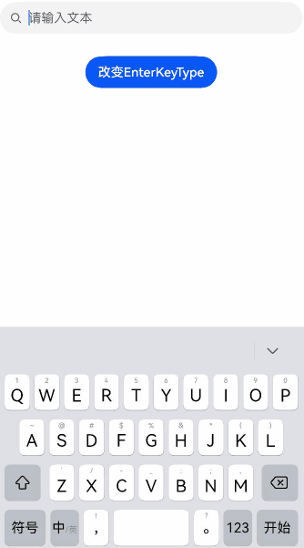

#### 示例5（设置文本样式）
从API version 12开始，该示例通过[lineHeight](#lineheight12)、[letterSpacing](#letterspacing12)、[decoration](#decoration12)属性展示了不同样式的文本效果。

```ts
// xxx.ets
@Entry
@Component
struct SearchExample {
  build() {
    Row() {
      Column() {
        Text('lineHeight').fontSize(9).fontColor(0xCCCCCC)
        Search({value: 'lineHeight unset'})
          .border({ width: 1 }).padding(10)
        Search({value: 'lineHeight 15'})
          .border({ width: 1 }).padding(10).lineHeight(15)
        Search({value: 'lineHeight 30'})
          .border({ width: 1 }).padding(10).lineHeight(30)

        Text('letterSpacing').fontSize(9).fontColor(0xCCCCCC)
        Search({value: 'letterSpacing 0'})
          .border({ width: 1 }).padding(5).letterSpacing(0)
        Search({value: 'letterSpacing 3'})
          .border({ width: 1 }).padding(5).letterSpacing(3)
        Search({value: 'letterSpacing -1'})
          .border({ width: 1 }).padding(5).letterSpacing(-1)

        Text('decoration').fontSize(9).fontColor(0xCCCCCC)
        Search({value: 'LineThrough, Red'})
          .border({ width: 1 }).padding(5)
          .decoration({type: TextDecorationType.LineThrough, color: Color.Red})
        Search({value: 'Overline, Red, DOTTED'})
          .border({ width: 1 }).padding(5)
          .decoration({type: TextDecorationType.Overline, color: Color.Red, style: TextDecorationStyle.DOTTED})
        Search({value: 'Underline, Red, WAVY'})
          .border({ width: 1 }).padding(5)
          .decoration({type: TextDecorationType.Underline, color: Color.Red, style: TextDecorationStyle.WAVY})
      }.height('90%')
    }
    .width('90%')
    .margin(10)
  }
}
```

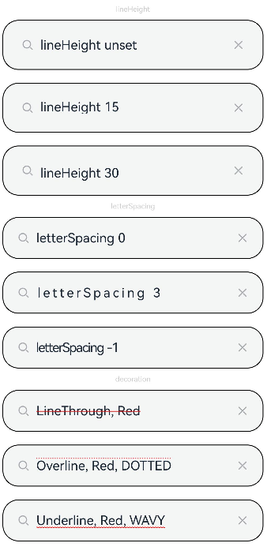

#### 示例6（设置文字特性效果）
该示例通过[fontFeature](#fontfeature12)（从API version 12开始）属性实现了文本在不同文字特性下的展示效果。

```ts
// xxx.ets
@Entry
@Component
struct SearchExample {
  @State text1: string = 'This is ss01 on : 0123456789';
  @State text2: string = 'This is ss01 off: 0123456789';

  build() {
    Column(){
      Search({value: this.text1})
        .margin({top:200})
        .fontFeature("\"ss01\" on")
      Search({value: this.text2})
        .margin({top:10})
        .fontFeature("\"ss01\" off")
    }
    .width("90%")
    .margin("5%")
  }
}
```

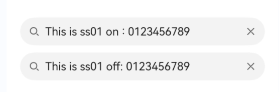

#### 示例7（自定义键盘避让）
该示例通过[customKeyboard](#customkeyboard10)（从API version 10开始）属性配置[KeyboardOptions](https://developer.huawei.com/consumer/cn/doc/harmonyos-references/ts-basic-components-richeditor#keyboardoptions12)（从API version 12开始）接口实现了自定义键盘避让的效果。

```ts
// xxx.ets
@Entry
@Component
struct SearchExample {
  controller: SearchController = new SearchController();
  @State inputValue: string = "";
  @State height1: string | number = '80%';
  @State supportAvoidance: boolean = true;

  // 自定义键盘组件
  @Builder
  CustomKeyboardBuilder() {
    Column() {
      Row() {
        Button('x').onClick(() => {
          // 关闭自定义键盘
          this.controller.stopEditing();
        }).margin(10)
      }

      Grid() {
        ForEach([1, 2, 3, 4, 5, 6, 7, 8, 9, '*', 0, '#'], (item: number | string) => {
          GridItem() {
            Button(item + "")
              .width(110).onClick(() => {
              this.inputValue += item;
            })
          }
        })
      }.maxCount(3).columnsGap(10).rowsGap(10).padding(5)
    }
    .backgroundColor(Color.Gray)
  }

  build() {
    Column() {
      Row() {
        Button("20%")
          .fontSize(24)
          .onClick(() => {
            this.height1 = "20%";
          })
        Button("80%")
          .fontSize(24)
          .margin({ left: 20 })
          .onClick(() => {
            this.height1 = "80%";
          })
      }
      .justifyContent(FlexAlign.Center)
      .alignItems(VerticalAlign.Bottom)
      .height(this.height1)
      .width("100%")
      .padding({ bottom: 50 })

      Search({ controller: this.controller, value: this.inputValue })// 绑定自定义键盘
        .customKeyboard(this.CustomKeyboardBuilder(), { supportAvoidance: this.supportAvoidance })
        .margin(10)
        .border({ width: 1 })
        .onChange((value: string) => {
          this.inputValue = value;
        })
    }
  }
}
```

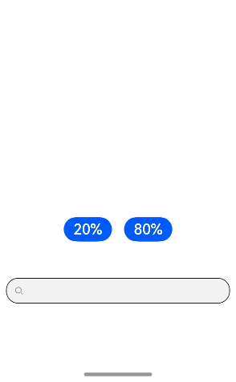

#### 示例8（设置文本自适应）
从API version 12开始，该示例通过[minFontSize](#minfontsize12)、[maxFontSize](#maxfontsize12)属性展示了文本自适应字号的效果。

```ts
// xxx.ets
@Entry
@Component
struct SearchExample {
  build() {
    Row() {
      Column() {
        Text('adaptive font').fontSize(9).fontColor(0xCCCCCC)

        Search({value: 'This is the text without the adaptive font'})
          .width('80%').height(90).borderWidth(1)
        Search({value: 'This is the text without the adaptive font'})
          .width('80%').height(90).borderWidth(1)
          .minFontSize(4)
          .maxFontSize(40)
      }.height('90%')
    }
    .width('90%')
    .margin(10)
  }
}
```

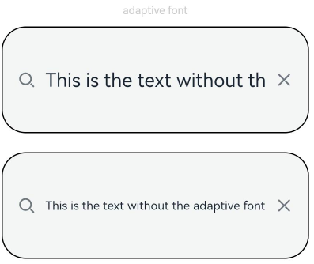

#### 示例9（支持插入和删除回调）
从API version 12开始，该示例通过[onWillInsert](#onwillinsert12)、[onDidInsert](#ondidinsert12)、[onWillDelete](#onwilldelete12)、[onDidDelete](#ondiddelete12)接口实现了插入和删除的效果。从API version 15开始，通过[onWillChange](#onwillchange15)接口展示了文本内容将要发生变化时的具体信息。

```ts
// xxx.ets
class ChangeState {
  changeContent: string = "";
  changePreviewOffset: number | undefined = 0;
  changePreviewValue: string | undefined = "";
  changeTextChangeRangeBeforeX: number | undefined = 0;
  changeTextChangeRangeBeforeY: number | undefined = 0;
  changeTextChangeRangeAfterX: number | undefined = 0;
  changeTextChangeRangeAfterY: number | undefined = 0;
  changeTextChangeOldContent: string | undefined = "";
  changeTextChangechangePreviewOffset: number | undefined = 0;
  changeTextChangechangePreviewValue: string | undefined = "";

  SetInfo(info: EditableTextChangeValue) {
    this.changeContent = info.content;
    this.changePreviewOffset = info.previewText?.offset;
    this.changePreviewValue = info.previewText?.value;
    this.changeTextChangeRangeBeforeX = info.options?.rangeBefore.start;
    this.changeTextChangeRangeBeforeY = info.options?.rangeBefore.end;
    this.changeTextChangeRangeAfterX = info.options?.rangeAfter.start;
    this.changeTextChangeRangeAfterY = info.options?.rangeAfter.end;
    this.changeTextChangeOldContent = info.options?.oldContent;
    this.changeTextChangechangePreviewOffset = info.options?.oldPreviewText.offset;
    this.changeTextChangechangePreviewValue = info.options?.oldPreviewText.value;
  }
}

@Entry
@Component
struct SearchExample {
  @State insertValue: string = "";
  @State deleteValue: string = "";
  @State insertOffset: number = 0;
  @State deleteOffset: number = 0;
  @State deleteDirection: number = 0;
  @State changeState1: ChangeState = new ChangeState();
  @State changeState2: ChangeState = new ChangeState();

  build() {
    Row() {
      Column() {
        Search({ value: "Search支持插入回调文本" })
          .height(60)
          .onWillInsert((info: InsertValue) => {
            this.insertValue = info.insertValue;
            return true;
          })
          .onWillChange((info: EditableTextChangeValue) => {
            this.changeState1.SetInfo(info);
            return true;
          })
          .onDidInsert((info: InsertValue) => {
            this.insertOffset = info.insertOffset;
          })

        Text("insertValue:" + this.insertValue + "  insertOffset:" + this.insertOffset).height(20)

        Blank(30)

        Text("context:" + this.changeState1.changeContent).height(20)
        Text("previewText-offset:" + this.changeState1.changePreviewOffset).height(20)
        Text("previewText-value:" + this.changeState1.changePreviewValue).height(20)
        Text("options-rangeBefore-start:" + this.changeState1.changeTextChangeRangeBeforeX).height(20)
        Text("options-rangeBefore-end:" + this.changeState1.changeTextChangeRangeBeforeY).height(20)
        Text("options-rangeAfter-start:" + this.changeState1.changeTextChangeRangeAfterX).height(20)
        Text("options-rangeAfter-end:" + this.changeState1.changeTextChangeRangeAfterY).height(20)
        Text("options-oldContent:" + this.changeState1.changeTextChangeOldContent).height(20)
        Text("options-oldPreviewText-offset:" + this.changeState1.changeTextChangechangePreviewOffset).height(20)
        Text("options-oldPreviewText-value:" + this.changeState1.changeTextChangechangePreviewValue).height(20)

        Search({ value: "Search支持删除回调文本b" })
          .height(60)
          .onWillDelete((info: DeleteValue) => {
            this.deleteValue = info.deleteValue;
            this.deleteDirection = info.direction;
            return true;
          })
          .onWillChange((info: EditableTextChangeValue) => {
            this.changeState2.SetInfo(info);
            return true;
          })
          .onDidDelete((info: DeleteValue) => {
            this.deleteOffset = info.deleteOffset;
            this.deleteDirection = info.direction;
          })

        Text("deleteValue:" + this.deleteValue + "  deleteOffset:" + this.deleteOffset).height(20)
        Text("deleteDirection:" + (this.deleteDirection == 0 ? "BACKWARD" : "FORWARD")).height(20)

        Blank(30)

        Text("context:" + this.changeState2.changeContent).height(20)
        Text("previewText-offset:" + this.changeState2.changePreviewOffset).height(20)
        Text("previewText-value:" + this.changeState2.changePreviewValue).height(20)
        Text("options-rangeBefore-start:" + this.changeState2.changeTextChangeRangeBeforeX).height(20)
        Text("options-rangeBefore-end:" + this.changeState2.changeTextChangeRangeBeforeY).height(20)
        Text("options-rangeAfter-start:" + this.changeState2.changeTextChangeRangeAfterX).height(20)
        Text("options-rangeAfter-end:" + this.changeState2.changeTextChangeRangeAfterY).height(20)
        Text("options-oldContent:" + this.changeState2.changeTextChangeOldContent).height(20)
        Text("options-oldPreviewText-offset:" + this.changeState2.changeTextChangechangePreviewOffset).height(20)
        Text("options-oldPreviewText-value:" + this.changeState2.changeTextChangechangePreviewValue).height(20)

      }.width('100%')
    }
    .height('100%')
  }
}
```

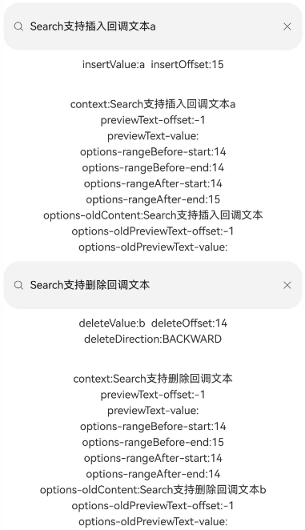

#### 示例10（文本扩展自定义菜单）
从API version 12开始，该示例通过[editMenuOptions](#editmenuoptions12)接口实现了文本设置自定义菜单扩展项的文本内容、图标以及回调的功能，同时，可以在[onPrepareMenu](https://developer.huawei.com/consumer/cn/doc/harmonyos-references/ts-text-common#属性-1)（从API version 20开始）回调中，进行菜单数据的设置。

```ts
// xxx.ets
@Entry
@Component
struct SearchExample {
  @State text: string = 'Search editMenuOptions';
  @State endIndex: number = 0;
  onCreateMenu = (menuItems: Array<TextMenuItem>) => {
    // $r('app.media.startIcon')需要替换为开发者所需的图像资源文件。
    let item1: TextMenuItem = {
      content: 'create1',
      icon: $r('app.media.startIcon'),
      id: TextMenuItemId.of('create1'),
    };
    let item2: TextMenuItem = {
      content: 'create2',
      id: TextMenuItemId.of('create2'),
      icon: $r('app.media.startIcon'),
    };
    menuItems.push(item1);
    menuItems.unshift(item2);
    let targetIndex = menuItems.findIndex(item => item.id.equals(TextMenuItemId.AI_WRITER));
    if (targetIndex !== -1) {
      menuItems.splice(targetIndex, 1); // 从目标索引删除1个元素
    }
    // 从API version 23开始支持TextMenuItemId.autoFill
    targetIndex = menuItems.findIndex(item => item.id.equals(TextMenuItemId.autoFill));
    if (targetIndex !== -1) {
      menuItems.splice(targetIndex, 1); // 从目标索引删除1个元素
    }
    return menuItems;
  }
  onMenuItemClick = (menuItem: TextMenuItem, textRange: TextRange) => {
    if (menuItem.id.equals(TextMenuItemId.of("create2"))) {
      console.info("拦截 id: create2 start:" + textRange.start + "; end:" + textRange.end);
      return true;
    }
    if (menuItem.id.equals(TextMenuItemId.of("prepare1"))) {
      console.info("拦截 id: prepare1 start:" + textRange.start + "; end:" + textRange.end);
      return true;
    }
    if (menuItem.id.equals(TextMenuItemId.COPY)) {
      console.info("拦截 COPY start:" + textRange.start + "; end:" + textRange.end);
      return true;
    }
    if (menuItem.id.equals(TextMenuItemId.SELECT_ALL)) {
      console.info("不拦截 SELECT_ALL start:" + textRange.start + "; end:" + textRange.end);
      return false;
    }
    return false;
  }
  // $r('app.media.startIcon')需要替换为开发者所需的图像资源文件。
  onPrepareMenu = (menuItems: Array<TextMenuItem>) => {
    let item1: TextMenuItem = {
      content: 'prepare1_' + this.endIndex,
      icon: $r('app.media.startIcon'),
      id: TextMenuItemId.of('prepare1'),
    };
    menuItems.unshift(item1);
    return menuItems;
  }
  @State editMenuOptions: EditMenuOptions = {
    onCreateMenu: this.onCreateMenu,
    onMenuItemClick: this.onMenuItemClick,
    onPrepareMenu: this.onPrepareMenu
  };

  build() {
    Column() {
      Search({ value: this.text })
        .width('95%')
        .editMenuOptions(this.editMenuOptions)
        .margin({ top: 100 })
        .onTextSelectionChange((selectionStart: number, selectionEnd: number) => {
          this.endIndex = selectionEnd;
        })
    }
    .width("90%")
    .margin("5%")
  }
}
```

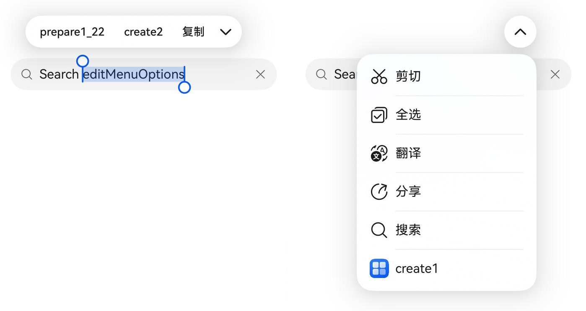

#### 示例11（设置symbol类型清除按钮）
从API version 10开始，该示例通过[searchIcon](#searchicon10)、[cancelButton](#cancelbutton10)属性展示了自定义右侧symbol类型清除按钮样式的效果。

```ts
// xxx.ets
import { SymbolGlyphModifier } from '@kit.ArkUI';

@Entry
@Component
struct SearchExample {
  controller: SearchController = new SearchController();
  @State changeValue: string = '';
  @State submitValue: string = '';

  build() {
    Column() {
      Search({ value: this.changeValue, placeholder: 'Type to search...', controller: this.controller })
        .searchIcon(new SymbolGlyphModifier($r('sys.symbol.magnifyingglass')).fontColor([Color.Red]))
        .cancelButton({
          style: CancelButtonStyle.CONSTANT,
          icon: new SymbolGlyphModifier($r('sys.symbol.xmark')).fontColor([Color.Green])
        })
        .searchButton('SEARCH')
        .width('95%')
        .height(40)
        .backgroundColor('#F5F5F5')
        .placeholderColor(Color.Grey)
        .placeholderFont({ size: 14, weight: 400 })
        .textFont({ size: 14, weight: 400 })
        .margin(10)
    }
    .width('100%')
    .height('100%')
  }
}
```


#### 示例12（设置文本是否可复制）
从API version 9开始，该示例通过[copyOption](#copyoption9)属性展示如何设置文本是否可复制。

```ts
// xxx.ets

@Entry
@Component
struct SearchExample {
  controller: SearchController = new SearchController();
  @State copyValue: string = '';
  @State cutValue: string = '';

  build() {
    Column({ space: 3 }) {
      Text("copy: " + this.copyValue)
      Text("cut:" + this.cutValue)
      Search({ value: 'Search CopyOption:None', controller: this.controller })
        .width('95%')
        .height(40)
        .copyOption(CopyOptions.None)
        .onCopy((value: string) => {
          this.copyValue = value;
        })
        .onCut((value: string) => {
          this.cutValue = value;
        })
      Search({ value: 'Search CopyOption:InApp', controller: this.controller })
        .width('95%')
        .height(40)
        .copyOption(CopyOptions.InApp)
        .onCopy((value: string) => {
          this.copyValue = value;
        })
        .onCut((value: string) => {
          this.cutValue = value;
        })
      Search({ value: 'Search CopyOption:LocalDevice', controller: this.controller })
        .width('95%')
        .height(40)
        .copyOption(CopyOptions.LocalDevice)
        .onCopy((value: string) => {
          this.copyValue = value;
        })
        .onCut((value: string) => {
          this.cutValue = value;
        })
    }
    .width('100%')
    .height('100%')
  }
}
```

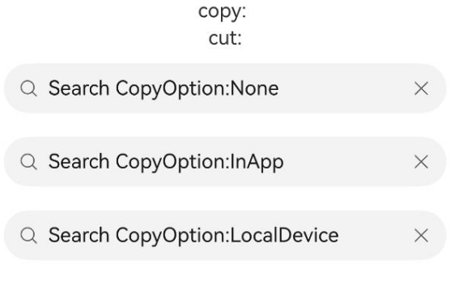

#### 示例13（设置文本水平对齐/光标样式/选中背景色）
该示例通过[textAlign](#textalign9)（从API version 9开始）、[caretStyle](#caretstyle10)（从API version 10开始）、[selectedBackgroundColor](#selectedbackgroundcolor12)（从API version 12开始）属性展示如何设置文本的水平对齐、光标样式和选中背景色。

```ts
// xxx.ets

@Entry
@Component
struct SearchExample {
  controller: SearchController = new SearchController();

  build() {
    Column({ space: 3 }) {
      Search({ value: 'Search textAlign sample', controller: this.controller })
        .width('95%')
        .height(40)
        .stopBackPress(true)
        .textAlign(TextAlign.Center)
        .caretStyle({ width: 3, color: Color.Green })
        .selectedBackgroundColor(Color.Gray)
    }
    .width('100%')
    .height('100%')
  }
}
```


#### 示例14（设置默认获焦并拉起软键盘）
该示例通过[defaultFocus](https://developer.huawei.com/consumer/cn/doc/harmonyos-references/ts-universal-attributes-focus#defaultfocus9)（从API version 9开始）、[enableKeyboardOnFocus](#enablekeyboardonfocus10)（从API version 10开始）属性展示如何设置默认获焦并拉起软键盘。

```ts
// xxx.ets

@Entry
@Component
struct SearchExample {
  controller: SearchController = new SearchController();
  @State value: string = 'false';

  build() {
    Column({ space: 3 }) {
      Text('editing: ' + this.value)
      Search({ placeholder: 'please enter...', controller: this.controller })
        .width('95%')
        .height(40)
        .defaultFocus(true)
        .enableKeyboardOnFocus(true)
        .enablePreviewText(true)
        .enableHapticFeedback(true)
        .onEditChange((data: boolean) => {
          this.value = data ? 'true' : 'false';
        })
    }
    .width('100%')
    .height('100%')
  }
}
```

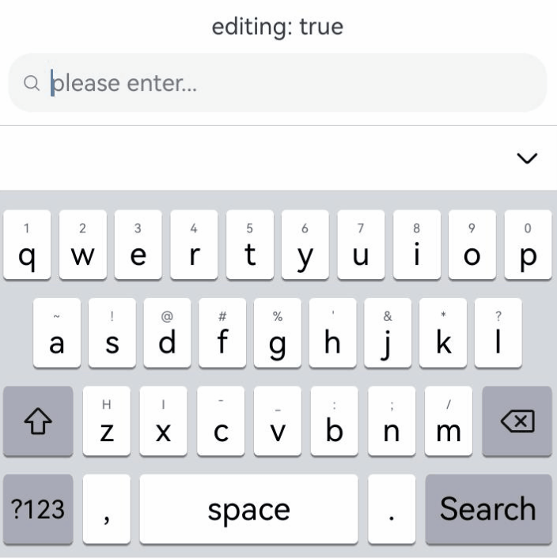

#### 示例15（关闭系统文本选择菜单）
该示例通过[selectionMenuHidden](#selectionmenuhidden10)（从API version 10开始）属性展示如何关闭系统文本选择菜单。

```ts
// xxx.ets

@Entry
@Component
struct SearchExample {
  controller: SearchController = new SearchController();

  build() {
    Column({ space: 3 }) {
      Search({ value: '123456', controller: this.controller })
        .width('95%')
        .height(40)
        .type(SearchType.NUMBER)
        .selectionMenuHidden(true)
    }
    .width('100%')
    .height('100%')
  }
}
```

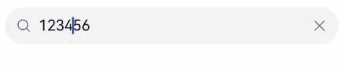

#### 示例16（对输入的文本进行过滤）
从API version 12开始，该示例通过[inputFilter](#inputfilter12)属性展示如何对输入的文本进行内容的过滤，以限制输入内容。

```ts
// xxx.ets

@Entry
@Component
struct SearchExample {
  controller: SearchController = new SearchController();
  @State filterValue: string = '';

  build() {
    Column({ space: 3 }) {
      Text('Filter:' + this.filterValue)
      Search({ placeholder: 'please enter...', controller: this.controller })
        .width('95%')
        .height(40)
        .textIndent(5)
        .halfLeading(true)
        .inputFilter('[a-z]', (filterValue: string) => {
          this.filterValue = filterValue;
        })
    }
    .width('100%')
    .height('100%')
  }
}
```


#### 示例17（设置选中指定区域的文本内容）
该示例通过[setTextSelection](#settextselection12)（从API version 12开始）方法展示如何设置选中指定区域的文本内容以及菜单的显隐策略。

```ts
// xxx.ets

@Entry
@Component
struct SearchExample {
  controller: SearchController = new SearchController();
  @State startIndex: number = 0;
  @State endIndex: number = 0;

  build() {
    Column({ space: 3 }) {
      Text('Selection start:' + this.startIndex + ' end:' + this.endIndex)
      Search({ value: 'Hello World', controller: this.controller })
        .width('95%')
        .height(40)
        .minFontScale(1)
        .maxFontScale(1.5)
        .defaultFocus(true)
        .onTextSelectionChange((selectionStart: number, selectionEnd: number) => {
          this.startIndex = selectionStart;
          this.endIndex = selectionEnd;
        })

      Button('Selection [0,3]')
        .onClick(() => {
          this.controller.setTextSelection(0, 3, { menuPolicy: MenuPolicy.SHOW });
        })
    }
    .width('100%')
    .height('100%')
  }
}
```

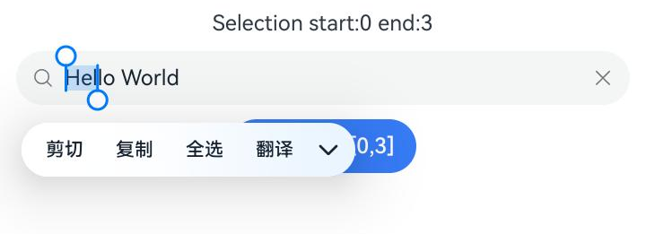

#### 示例18（设置文本滚动事件）
从API version 10开始，该示例通过[onContentScroll](#oncontentscroll10)事件展示如何设置文本滚动事件的回调。

```ts
// xxx.ets

@Entry
@Component
struct SearchExample {
  controller: SearchController = new SearchController();
  @State offsetX: number = 0;
  @State offsetY: number = 0;

  build() {
    Column({ space: 3 }) {
      Text('offset x:' + this.offsetX + ' y:' + this.offsetY)
      Search({ value: 'ABCDEFGHIJKLMNOPQRSTUVWXYZ', controller: this.controller })
        .width(200)
        .height(40)
        .onContentScroll((totalOffsetX: number, totalOffsetY: number) => {
          this.offsetX = totalOffsetX;
          this.offsetY = totalOffsetY;
        })
    }
    .width('100%')
    .height('100%')
  }
}
```

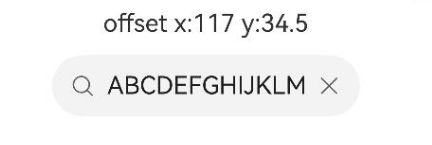

#### 示例19（设置最小字体范围与最大字体范围）
从API version 18开始，该示例通过[minFontScale](#minfontscale18)、[maxFontScale](#maxfontscale18)设置字体显示最小与最大范围。调整系统字体大小后，文本字体大小不会超过[minFontScale](#minfontscale18)、[maxFontScale](#maxfontscale18)设置的范围。如下示例展示了Search组件在不同的字体大小限制条件下，调整系统字体后的放大缩小效果。

```ts
// 开启应用缩放跟随系统
// AppScope/resources/base，新建文件夹profile。
// AppScope/resources/base/profile，新建文件configuration.json。
// AppScope/resources/base/profile/configuration.json，增加如下代码。
{
  "configuration": {
    "fontSizeScale": "followSystem",
    "fontSizeMaxScale": "3.2"
  }
}
```


```ts
// AppScope/app.json5，修改如下代码。
{
  "app": {
    "bundleName": "com.example.myapplication",
    "vendor": "example",
    "versionCode": 1000000,
    "versionName": "1.0.0",
    "icon": "$media:app_icon",
    "label": "$string:app_name",
    "configuration": "$profile:configuration"
  }
}
```


```ts
// xxx.ets
@Entry
@Component
struct SearchExample {
  @State minFontScale: number = 1.0;
  @State maxFontScale: number = 1.0;
  @State minFontScale2: number = 0.5;
  @State maxFontScale2: number = 2.0;

  build() {
    Column() {
      Column() {
        Text("系统字体变大变小，变大变小aaaaaaaAAAAAA")
        Blank(30)
        Text("minFontScale = " + this.minFontScale)
        Text("maxFontScale = " + this.maxFontScale)
        Search({
          placeholder: 'The text area can hold an unlimited amount of text. input your word...',
        })
          .minFontScale(this.minFontScale) // 设置最小字体缩放倍数，参数为undefined则跟随系统默认倍数缩放
          .maxFontScale(this.maxFontScale) // 设置最大字体缩放倍数，参数为undefined则跟随系统默认倍数缩放

        Blank(30)

        Text("minFontScale = " + this.minFontScale2)
        Text("maxFontScale = " + this.maxFontScale2)
        Search({
          placeholder: 'The text area can hold an unlimited amount of text. input your word...',
        })
          .minFontScale(this.minFontScale2) // 设置最小字体缩放倍数，参数为undefined则跟随系统默认倍数缩放
          .maxFontScale(this.maxFontScale2) // 设置最大字体缩放倍数，参数为undefined则跟随系统默认倍数缩放
      }.width('100%')
    }
  }
}
```

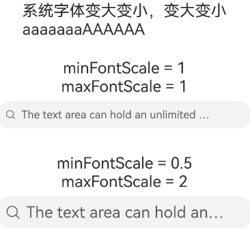


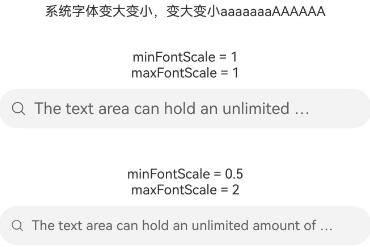

#### 示例20（设置文本描边）
从API version 20开始，该示例通过[strokeWidth](#strokewidth20)和[strokeColor](#strokecolor20)属性设置文本的描边宽度及颜色。

```ts
// xxx.ets
import { LengthMetrics } from '@kit.ArkUI';

@Entry
@Component
struct SearchExample {
  build() {
    Row() {
      Column() {
        Text('stroke feature').fontSize(9).fontColor(0xCCCCCC)

        Search({ value: 'Text without stroke' })
          .width('100%')
          .height(60)
          .borderWidth(1)
          .minFontSize(40)
          .maxFontSize(40)
        Search({ value: 'Text with stroke' })
          .width('100%')
          .height(60)
          .borderWidth(1)
          .minFontSize(40)
          .maxFontSize(40)
          .strokeWidth(LengthMetrics.px(-3.0))
          .strokeColor(Color.Red)
        Search({ value: 'Text with stroke' })
          .width('100%')
          .height(60)
          .borderWidth(1)
          .minFontSize(40)
          .maxFontSize(40)
          .strokeWidth(LengthMetrics.px(3.0))
          .strokeColor(Color.Red)
      }.height('90%')
    }
    .width('90%')
    .margin(10)
  }
}
```

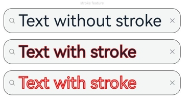

#### 示例21（设置中西文自动间距）
从API version 20开始，该示例通过[enableAutoSpacing](#enableautospacing20)属性设置中西文自动间距。

```ts
// xxx.ets
@Entry
@Component
struct SearchExample {
  build() {
    Row() {
      Column() {
        Text('开启中西文自动间距').margin(5)
        Search({value: '中西文Auto Spacing自动间距'})
          .enableAutoSpacing(true)
        Text('关闭中西文自动间距').margin(5)
        Search({value: '中西文Auto Spacing自动间距'})
          .enableAutoSpacing(false)
      }.height('100%')
    }
    .width('60%')
  }
}
```

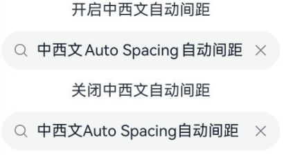

#### 示例22（设置placeholder富文本样式）
从API version 22开始，该示例通过[setStyledPlaceholder](https://developer.huawei.com/consumer/cn/doc/harmonyos-references/ts-universal-attributes-text-style#setstyledplaceholder22)接口设置placeholder富文本样式。

```ts
// xxx.ets
import { LengthMetrics } from '@kit.ArkUI';

@Entry
@Component
struct SearchExample {
  styledString: MutableStyledString =
    new MutableStyledString("输入框富文本：文本",
      [
        {
          start: 0,
          length: 7,
          styledKey: StyledStringKey.FONT,
          styledValue: new TextStyle({
            fontColor: Color.Orange,
            fontSize: LengthMetrics.fp(24)
          })
        },
        {
          start: 7,
          length: 4,
          styledKey: StyledStringKey.FONT,
          styledValue: new TextStyle({
            fontColor: Color.Gray,
            fontSize: LengthMetrics.fp(20),
            strokeWidth: LengthMetrics.px(-5),
            strokeColor: Color.Black,
          })
        },
        {
          start: 0,
          length: 1,
          styledKey: StyledStringKey.PARAGRAPH_STYLE,
          styledValue: new ParagraphStyle({
            textVerticalAlign: TextVerticalAlign.CENTER
          })
        }
      ]);
  controller: SearchController = new SearchController();

  aboutToAppear() {
    this.controller.setStyledPlaceholder(this.styledString)
  }

  build() {
    Scroll() {
      Column() {
        Text("Search placeholder富文本")
          .fontSize(8)
        Search({
          controller: this.controller
        })
          .textFont({ size: 24 })
          .margin(10)
      }
      .width('100%')
    }
  }
}
```


#### 示例23（设置输入法扩展信息）
从API version 22开始，该示例通过[IMEClient](https://developer.huawei.com/consumer/cn/doc/harmonyos-references/ts-text-common#imeclient20对象说明)的setExtraConfig设置输入法扩展信息。

```ts
// xxx.ets
@Entry
@Component
struct SearchExample {
  build() {
    Column() {
      Search({ value: '拉起输入法前执行onWillAttachIME回调' })
        .onWillAttachIME((client: IMEClient) => {
          client.setExtraConfig({
            customSettings: {
              name: "Search", // 自定义属性
              id: client.nodeId // 自定义属性
            }
          })
        })
    }.height('100%')
  }
}
```

#### 示例24（设置输入框分割线颜色）
从API version 23开始，该示例通过[dividerColor](#dividercolor23)接口设置输入框分割线颜色。

```ts
// xxx.ets
import { ColorMetrics } from '@kit.ArkUI';

@Entry
@Component
struct SearchExample {
  @State colorTypeRGB: ColorMetrics = ColorMetrics.numeric(0x00FF00);
  @State colorTypeARGB: ColorMetrics = ColorMetrics.numeric(0x3300FF00);
  @State colorTypeColorWithSpace: ColorMetrics = ColorMetrics.colorWithSpace(ColorSpace.DISPLAY_P3, 0, 1.0, 0, 1.0);
  @State colorTypeRGBA: ColorMetrics = ColorMetrics.rgba(255, 0, 0, 1.0);
  // 需要替换为开发者所需的资源文件
  @State colorTypeRes: ColorMetrics = ColorMetrics.resourceColor($r('app.color.color'));
  @State colorType: ColorMetrics[] =
    [this.colorTypeRGB, this.colorTypeARGB, this.colorTypeColorWithSpace, this.colorTypeRGBA, this.colorTypeRes];
  @State colorTypeName: string[] =
    ["colorTypeRGB", "colorTypeARGB", "colorTypeColorWithSpace", "colorTypeRGBA", "colorTypeRes"];
  @State count: number = 0;

  build() {
    Column() {
      Blank(30)
      Search({ value: "Input search text" })
        .searchButton("SEARCH", { fontSize: '14vp' })
        .dividerColor(this.colorType[this.count])
      Button("Change ColorType: " + this.colorTypeName[this.count]).onClick(() => {
        this.count = (this.count + 1) % (this.colorType.length)
      })
        .fontSize('14vp')
        .width('100%')
    }
  }
}
```

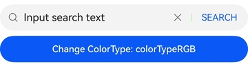

#### 示例25（设置行首标点压缩）
该示例通过[compressLeadingPunctuation](#compressleadingpunctuation23)接口设置行首标点压缩，左侧有间距的标点符号位于行首时，标点会直接压缩间距至左侧边界。
从API version 23开始，支持compressLeadingPunctuation接口。

```ts
// xxx.ets
@Entry
@Component
struct Index {
  build() {
    Column(){
      Search({ value: "\u300C行首标点压缩打开" })
        .compressLeadingPunctuation(true)
        .margin(5)
        .textFont({size:30})
        .width("90%")
      Search({ value: "\u300C行首标点压缩关闭" })
        .compressLeadingPunctuation(false)
        .textFont({size:30})
        .width("90%")
    }
  }
}
```

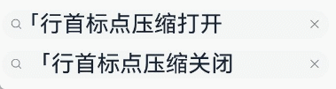

#### 示例26（设置自适应间距）
该示例通过[includeFontPadding](#includefontpadding23)接口增加首行尾行间距和[fallbackLineSpacing](#fallbacklinespacing23)接口设置自适应行间距。
从API version 23开始，新增[includeFontPadding](#includefontpadding23)和[fallbackLineSpacing](#fallbacklinespacing23)接口。

```ts
// xxx.ets

const UYGHUR_TEXT: string = 'ياخشىمۇسەنياخشىمۇسەنياخشىمۇسەنياخشىمۇسەنياخشىمۇسەنياخشىمۇسەنياخشىمۇسەن';
@Entry
@Component
struct Index {
  @State include: boolean | null | undefined = false;
  @State fallback: boolean | null | undefined = false;
  @State displayText: string = UYGHUR_TEXT;

  build() {
    Column() {
      Search({
        value: this.displayText,
        placeholder: '请输入内容...'
      })
        .includeFontPadding(this.include)
        .fallbackLineSpacing(this.fallback)
        .lineHeight(5)
        .width('100%')
        .height(100)
        .backgroundColor('#eee')
        .borderWidth(1)
        .borderColor('#dddddd')

      Scroll() {
        Column() {
          // --- IncludeFontPadding相关按钮 ---
          Button('设置includePadding: ' + this.include)
            .onClick(() => {
              this.include = this.include === false ? true : false;
            })
            .margin({ bottom: 10 })

          // --- FallbackLineSpacing相关按钮 ---
          Button('设置fallbackLineSpacing: ' + this.fallback)
            .onClick(() => {
              this.fallback = this.fallback === false ? true : false;
            })
            .margin({ bottom: 10 })

        }
        .width('100%')
        .padding(5)
      }
      .height(250)
      .backgroundColor('transparent')
      .scrollBarWidth(2)
      .scrollBarColor('#888')

    }
    .width('100%')
    .height('100%')
    .padding(20)
  }
}
```

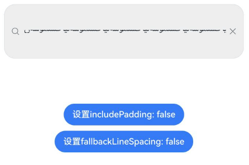

#### 示例27（设置文本拖拽时的背板样式）
该示例通过[selectedDragPreviewStyle](#selecteddragpreviewstyle23)接口设置文本拖拽时的背板样式。
从API version 23开始，新增selectedDragPreviewStyle接口。

```ts
@Entry
@Component
struct SearchTest {
  build() {
    Column() {
      Search({ value: 'HelloWorld', placeholder: 'please input words' })
        .copyOption(CopyOptions.InApp)
        .width(200)
        .height(50)
        .margin(150)
        .draggable(true)
        .selectedDragPreviewStyle({color: 'rgba(227, 248, 249, 1)'})
    }
    .height('100%')
  }
}
```


#### 示例28（删除文本框内的最后一个字符）
该示例通过调用[deleteBackward](https://developer.huawei.com/consumer/cn/doc/harmonyos-references/ts-universal-attributes-text-style#deletebackward23)接口删除文本框内最后一个字符。
从API version 23开始，新增[deleteBackward](https://developer.huawei.com/consumer/cn/doc/harmonyos-references/ts-universal-attributes-text-style#deletebackward23)接口。

```ts
@Entry
@Component
struct Page {
  controller: SearchController = new SearchController();

  build() {
    Column() {
      Search({ placeholder: '搜索框示例', controller: this.controller })
      Button('Delete backward')
        .onClick(() => {
          this.controller.deleteBackward();
        })
    }
  }
}
```


#### 示例29（设置文本排版方向）
该示例通过[textDirection](#textdirection23)接口设置文本排版方向。
从API version 23开始，新增textDirection接口。

```ts
// xxx.ets
@Entry
@Component
struct SearchExample {
  @State text: string = 'Search文本排版方向示例';

  build() {
    Column({ space: 3 }) {
      Text('Search文本排版方向RTL，布局方向default')
        .fontSize(12).width('90%').margin(5)
      Search({ value: this.text })
        .width('95%')
        .height(40)
        .textDirection(TextDirection.RTL)
      Text('Search文本排版方向RTL，布局方向default，文本水平方向对齐方式LEFT')
        .fontSize(12).width('90%').margin(5)
      Search({ value: this.text })
        .width('95%')
        .height(40)
        .textDirection(TextDirection.RTL)
        .textAlign(TextAlign.LEFT)
      Text('Search文本排版方向LTR，布局方向RTL')
        .fontSize(12).width('90%').margin(5)
      Search({ value: this.text })
        .width('95%')
        .height(40)
        .textDirection(TextDirection.LTR)
        .direction(Direction.Rtl)
    }
    .width('100%')
    .height('100%')
  }
}
```

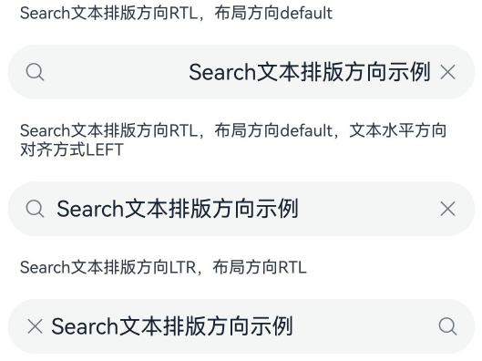

#### 示例30（将指定范围的文字滚动到可视区内）
本示例通过[scrollToVisible](https://developer.huawei.com/consumer/cn/doc/harmonyos-references/ts-universal-attributes-text-style#scrolltovisible23)将可视区外的文本滚动到可视区内。
从API version 23开始，新增scrollToVisible接口。

```ts
// xxx.ets
@Entry
@Component
struct SearchExample {
  @State text: string = '12345678912345678912346789123456789123456789012121214521';
  controller: SearchController = new SearchController();

  build() {
    Column() {
      Search({ value: this.text, controller: this.controller })
        .width(336)
        .height(56)
      Button("滚动文本到可视区").onClick(()=> {
        this.controller.scrollToVisible({ start: 22, end: 30})
      })
    }.width('100%').height('100%').backgroundColor('#F1F3F5')
  }
}
```

