# TextArea

更新时间：2026-05-18 03:44:20

来源：https://developer.huawei.com/consumer/cn/doc/harmonyos-references/ts-basic-components-textarea

支持设备：Phone | PC/2in1 | Tablet | Wearable | TV

多行文本输入框组件，当输入的文本内容超过组件宽度时会自动换行显示。
高度未设置时，组件无默认高度，自适应内容高度。宽度未设置时，默认撑满最大宽度。

> [!NOTE] 说明
> 该组件从API version 7开始支持。后续版本如有新增内容，则采用上角标单独标记该内容的起始版本。

#### 子组件
无

#### 接口
TextArea(value?: TextAreaOptions)
**元服务API：** 从API version 11开始，该接口支持在元服务中使用。

**系统能力：** SystemCapability.ArkUI.ArkUI.Full

**参数：**

| 参数名 | 类型 | 必填 | 说明 |
| --- | --- | --- | --- |
| value | [TextAreaOptions](#textareaoptions对象说明) | 否 | TextArea组件参数。 |

#### TextAreaOptions对象说明
TextArea初始化参数。
**元服务API：** 从API version 11开始，该接口支持在元服务中使用。

**系统能力：** SystemCapability.ArkUI.ArkUI.Full

| 名称 | 类型 | 只读 | 可选 | 说明 |
| --- | --- | --- | --- | --- |
| placeholder | [ResourceStr](https://developer.huawei.com/consumer/cn/doc/harmonyos-references/ts-types#resourcestr) | 否 | 是 | 设置无输入时的提示文本。输入内容后，提示文本不显示。 仅设置placeholder属性时，手柄依然跟随拖动，手柄松开后光标停留在文字开头位置。 |
| text | [ResourceStr](https://developer.huawei.com/consumer/cn/doc/harmonyos-references/ts-types#resourcestr) | 否 | 是 | 设置输入框当前的文本内容。 建议通过onChange事件将状态变量与文本实时绑定， 避免组件刷新时TextArea中的文本内容异常。 从API version 10开始，该参数支持$$双向绑定变量。 从API version 18开始，该参数支持!!双向绑定变量。 |
| controller^8+ | [TextAreaController](#textareacontroller8) | 否 | 是 | 设置TextArea控制器。 |

#### 属性
除支持[通用属性](https://developer.huawei.com/consumer/cn/doc/harmonyos-references/ts-component-general-attributes)，还支持以下属性：

> [!NOTE] 说明
> 通用属性padding的默认值为： { top: '8vp', right: '16vp', bottom: '8vp', left: '16vp' } 从API version 11开始，多行输入框可设置.width('auto')使组件宽度自适应文本宽度，自适应时组件宽度受constraintSize属性以及父容器传递的最大最小宽度限制，其余使用方式参考尺寸设置。

#### placeholderColor
placeholderColor(value: ResourceColor)
设置placeholder文本颜色。
**元服务API：** 从API version 11开始，该接口支持在元服务中使用。

**系统能力：** SystemCapability.ArkUI.ArkUI.Full

**参数：**

| 参数名 | 类型 | 必填 | 说明 |
| --- | --- | --- | --- |
| value | [ResourceColor](https://developer.huawei.com/consumer/cn/doc/harmonyos-references/ts-types#resourcecolor) | 是 | placeholder文本颜色。 默认值：跟随主题。 |

#### placeholderFont
placeholderFont(value: Font)
设置placeholder文本样式，包括字体大小、字体粗细、字体族、字体风格。

> [!NOTE] 说明
> 可以使用loadFontSync注册自定义字体。

**元服务API：** 从API version 11开始，该接口支持在元服务中使用。

**系统能力：** SystemCapability.ArkUI.ArkUI.Full

**参数：**

| 参数名 | 类型 | 必填 | 说明 |
| --- | --- | --- | --- |
| value | [Font](https://developer.huawei.com/consumer/cn/doc/harmonyos-references/ts-types#font) | 是 | placeholder文本样式。 |

#### textAlign
textAlign(value: TextAlign)
设置文本在输入框中的水平对齐方式。
支持TextAlign.Start、TextAlign.Center和TextAlign.End。从API version 11开始，新增TextAlign.JUSTIFY选项。
可通过[align](https://developer.huawei.com/consumer/cn/doc/harmonyos-references/ts-universal-attributes-location#align)属性控制文本段落在垂直方向上的位置，此组件中不可通过align属性控制文本段落在水平方向上的位置。
- Alignment.TopStart、Alignment.Top、Alignment.TopEnd：内容顶部对齐。
- Alignment.Start、Alignment.Center、Alignment.End：内容垂直居中。
- Alignment.BottomStart、Alignment.Bottom、Alignment.BottomEnd：内容底部对齐。
当textAlign属性设置为TextAlign.JUSTIFY时，最后一行文本不参与两端对齐，为水平对齐首部效果。
**元服务API：** 从API version 11开始，该接口支持在元服务中使用。

**系统能力：** SystemCapability.ArkUI.ArkUI.Full

**参数：**

| 参数名 | 类型 | 必填 | 说明 |
| --- | --- | --- | --- |
| value | [TextAlign](https://developer.huawei.com/consumer/cn/doc/harmonyos-references/ts-appendix-enums#textalign) | 是 | 文本在输入框中的水平对齐方式。 默认值：TextAlign.Start |


> [!NOTE] 说明
> textAlign只能调整文本整体的布局，不影响字符的显示顺序。若需要调整字符的显示顺序，请参考镜像状态字符对齐。

#### textDirection23+
textDirection(direction: TextDirection | undefined)
指定文本排版方向，未通过该接口设置时，默认文本排版方向遵循组件布局方向。
**元服务API：** 从API version 23开始，该接口支持在元服务中使用。

**系统能力：** SystemCapability.ArkUI.ArkUI.Full

**参数：**

| 参数名 | 类型 | 必填 | 说明 |
| --- | --- | --- | --- |
| direction | [TextDirection](https://developer.huawei.com/consumer/cn/doc/harmonyos-references/ts-text-common#textdirection22) \| undefined | 是 | 文本排版方向。 设置为undefined时，按照TextDirection.DEFAULT处理，表现为文本排版方向遵循组件布局方向。 |

#### horizontalScrolling24+
horizontalScrolling(enabled: Optional&lt;boolean&gt;)
设置当文本宽度超过内容区宽度时是否启用水平滚动。未通过该接口设置时，禁用水平滚动。

> [!NOTE] 说明
> 以下场景不支持水平滚动：设置内联模式。

**元服务API：** 从API version 24开始，该接口支持在元服务中使用。

**模型约束：** 此接口仅可在Stage模型下使用。

**系统能力：** SystemCapability.ArkUI.ArkUI.Full

**参数：**

| 参数名 | 类型 | 必填 | 说明 |
| --- | --- | --- | --- |
| enabled | [Optional](https://developer.huawei.com/consumer/cn/doc/harmonyos-references/ts-universal-attributes-custom-property#optionalt)&lt;boolean&gt; | 是 | 是否启用水平滚动。 true表示启用水平滚动；false表示禁用水平滚动，文本将自动换行。 |

#### caretColor
caretColor(value: ResourceColor)
设置输入框光标颜色。
**元服务API：** 从API version 11开始，该接口支持在元服务中使用。

**系统能力：** SystemCapability.ArkUI.ArkUI.Full

**参数：**

| 参数名 | 类型 | 必填 | 说明 |
| --- | --- | --- | --- |
| value | [ResourceColor](https://developer.huawei.com/consumer/cn/doc/harmonyos-references/ts-types#resourcecolor) | 是 | 输入框光标颜色。 默认值：'#007DFF' |


> [!NOTE] 说明
> 从API version 12开始，此接口支持设置文本手柄颜色，光标和文本手柄颜色保持一致。

#### fontColor
fontColor(value: ResourceColor)
设置字体颜色。
**元服务API：** 从API version 11开始，该接口支持在元服务中使用。

**系统能力：** SystemCapability.ArkUI.ArkUI.Full

**参数：**

| 参数名 | 类型 | 必填 | 说明 |
| --- | --- | --- | --- |
| value | [ResourceColor](https://developer.huawei.com/consumer/cn/doc/harmonyos-references/ts-types#resourcecolor) | 是 | 字体颜色。 |

#### fontSize
fontSize(value: Length)
设置字体大小。
**元服务API：** 从API version 11开始，该接口支持在元服务中使用。

**系统能力：** SystemCapability.ArkUI.ArkUI.Full

**参数：**

| 参数名 | 类型 | 必填 | 说明 |
| --- | --- | --- | --- |
| value | [Length](https://developer.huawei.com/consumer/cn/doc/harmonyos-references/ts-types#length) | 是 | 字体大小。fontSize为number类型时，使用fp单位。字体默认大小16fp，Wearable设备上默认值为：18fp。不支持设置百分比字符串。 |

#### fontStyle
fontStyle(value: FontStyle)
设置字体样式。
**元服务API：** 从API version 11开始，该接口支持在元服务中使用。

**系统能力：** SystemCapability.ArkUI.ArkUI.Full

**参数：**

| 参数名 | 类型 | 必填 | 说明 |
| --- | --- | --- | --- |
| value | [FontStyle](https://developer.huawei.com/consumer/cn/doc/harmonyos-references/ts-appendix-enums#fontstyle) | 是 | 字体样式。 默认值：FontStyle.Normal |

#### fontWeight
fontWeight(value: number | FontWeight | ResourceStr)
设置文本的字体粗细，设置过大可能会在不同字体下有截断。
**元服务API：** 从API version 11开始，该接口支持在元服务中使用。

**系统能力：** SystemCapability.ArkUI.ArkUI.Full

**参数：**

| 参数名 | 类型 | 必填 | 说明 |
| --- | --- | --- | --- |
| value | number \| [FontWeight](https://developer.huawei.com/consumer/cn/doc/harmonyos-references/ts-appendix-enums#fontweight) \| [ResourceStr](https://developer.huawei.com/consumer/cn/doc/harmonyos-references/ts-types#resourcestr) | 是 | 文本的字体粗细，number类型取值[100, 900]，取值间隔为100，默认为400，取值越大，字体越粗。string类型仅支持number类型取值的字符串形式，例如"400"，以及"bold"、"bolder"、"lighter"、"regular"、"medium"，分别对应FontWeight中相应的枚举值。 默认值：FontWeight.Normal 从API version 20开始，支持Resource类型。 |

#### fontFamily
fontFamily(value: ResourceStr)
设置字体列表。
**元服务API：** 从API version 11开始，该接口支持在元服务中使用。

**系统能力：** SystemCapability.ArkUI.ArkUI.Full

**参数：**

| 参数名 | 类型 | 必填 | 说明 |
| --- | --- | --- | --- |
| value | [ResourceStr](https://developer.huawei.com/consumer/cn/doc/harmonyos-references/ts-types#resourcestr) | 是 | 字体列表。默认字体'HarmonyOS Sans'。 使用多个字体时，请用逗号','分隔，字体的优先级按顺序生效。例如：'Arial,HarmonyOS Sans'。 |


> [!NOTE] 说明
> 可以使用loadFontSync注册自定义字体。

#### inputFilter8+
inputFilter(value: ResourceStr, error?: (value: string) => void)
通过正则表达式设置输入过滤器。匹配表达式的输入允许显示，不匹配的输入将被过滤。
单字符输入场景仅支持单字符匹配，多字符输入场景支持字符串匹配，例如粘贴。
从API version 11开始，设置inputFilter且输入的字符不为空字符，会导致[type](#type11)接口附带的文本过滤效果失效。
**元服务API：** 从API version 11开始，该接口支持在元服务中使用。

**系统能力：** SystemCapability.ArkUI.ArkUI.Full

**参数：**

| 参数名 | 类型 | 必填 | 说明 |
| --- | --- | --- | --- |
| value | [ResourceStr](https://developer.huawei.com/consumer/cn/doc/harmonyos-references/ts-types#resourcestr) | 是 | 正则表达式。 |
| error | (value: string) => void | 否 | 正则匹配失败时，返回被过滤的内容。正则匹配成功时，无返回。 |

#### copyOption9+
copyOption(value: CopyOptions)
设置输入的文本是否可复制。设置CopyOptions.None时，只支持粘贴和全选。
设置CopyOptions.None时，不支持拖拽操作。
**元服务API：** 从API version 11开始，该接口支持在元服务中使用。

**系统能力：** SystemCapability.ArkUI.ArkUI.Full

**参数：**

| 参数名 | 类型 | 必填 | 说明 |
| --- | --- | --- | --- |
| value | [CopyOptions](https://developer.huawei.com/consumer/cn/doc/harmonyos-references/ts-appendix-enums#copyoptions9) | 是 | 输入的文本是否可复制。 默认值：CopyOptions.LocalDevice，支持设备内复制。 |

#### maxLength10+
maxLength(value: number)
设置文本的最大输入字符数。默认不设置最大输入字符数限制。到达文本最大字符限制，将无法继续输入字符。
**元服务API：** 从API version 11开始，该接口支持在元服务中使用。

**系统能力：** SystemCapability.ArkUI.ArkUI.Full

**参数：**

| 参数名 | 类型 | 必填 | 说明 |
| --- | --- | --- | --- |
| value | number | 是 | 文本的最大输入字符数。 当value<0时，按照默认值处理，不设限制。 默认值：uint32_max，即2的32次方-1。 |

#### showCounter10+
showCounter(value: boolean, options?: InputCounterOptions)
设置当通过InputCounterOptions输入的字符数超过阈值时显示计数器。未调用showCounter接口时，默认不显示计数器。
参数value为true时，才能设置options，文本框开启计数器功能，需要配合maxLength（设置最大字符限制）一起使用。字符计数器显示的效果是当前输入字符数/最大可输入字符数。
当输入字符数大于最大字符数乘百分比值时，显示字符计数器。如果用户设置计数器时不设置InputCounterOptions，那么当前输入字符数达到最大字符数时，边框和计数器下标将变为红色。用户同时设置参数value为true和InputCounterOptions，当thresholdPercentage数值在有效区间内，且输入字符数超过最大字符数时，边框和计数器下标将变为红色，框体抖动。highlightBorder设置为false，则不显示红色边框，计数器默认显示红色边框。内联模式下字符计数器不显示。
[示例2（设置计数器）](#示例2设置计数器)展示了设置showCounter的效果。
**元服务API：** 从API version 11开始，该接口支持在元服务中使用。

**系统能力：** SystemCapability.ArkUI.ArkUI.Full

**参数：**

| 参数名 | 类型 | 必填 | 说明 |
| --- | --- | --- | --- |
| value | boolean | 是 | 是否显示计数器。 true表示显示计数器，false表示不显示。 |
| options^11+ | [InputCounterOptions](https://developer.huawei.com/consumer/cn/doc/harmonyos-references/ts-universal-attributes-text-style#inputcounteroptions11对象说明) | 否 | 计数器的配置项。 |

#### style10+
style(value: TextContentStyle)
设置文本框多态样式，内联输入风格只支持TextAreaType.NORMAL类型。
**元服务API：** 从API version 11开始，该接口支持在元服务中使用。

**系统能力：** SystemCapability.ArkUI.ArkUI.Full

**参数：**

| 参数名 | 类型 | 必填 | 说明 |
| --- | --- | --- | --- |
| value | [TextContentStyle](https://developer.huawei.com/consumer/cn/doc/harmonyos-references/ts-appendix-enums#textcontentstyle10) | 是 | 文本框多态样式。 默认值：TextContentStyle.DEFAULT |

#### enableKeyboardOnFocus10+
enableKeyboardOnFocus(value: boolean)
设置TextArea通过点击以外的方式获焦时，是否主动拉起软键盘。
从API version 10开始，获焦默认绑定输入法。
**元服务API：** 从API version 11开始，该接口支持在元服务中使用。

**系统能力：** SystemCapability.ArkUI.ArkUI.Full

**参数：**

| 参数名 | 类型 | 必填 | 说明 |
| --- | --- | --- | --- |
| value | boolean | 是 | 通过点击以外的方式获焦时，是否主动拉起软键盘。 true表示主动拉起，false表示不主动拉起。 默认值：true |

#### selectionMenuHidden10+
selectionMenuHidden(value: boolean)
设置是否不弹出系统文本选择菜单。
**元服务API：** 从API version 11开始，该接口支持在元服务中使用。

**系统能力：** SystemCapability.ArkUI.ArkUI.Full

**参数：**

| 参数名 | 类型 | 必填 | 说明 |
| --- | --- | --- | --- |
| value | boolean | 是 | 是否不弹出系统文本选择菜单。 设置为true时，单击输入框光标、长按输入框、双击输入框、三击输入框或者右键输入框，不弹出系统文本选择菜单。 设置为false时，弹出系统文本选择菜单。 默认值：false |

#### barState10+
barState(value: BarState)
设置输入框滚动条的显示模式。
**元服务API：** 从API version 11开始，该接口支持在元服务中使用。

**系统能力：** SystemCapability.ArkUI.ArkUI.Full

**参数：**

| 参数名 | 类型 | 必填 | 说明 |
| --- | --- | --- | --- |
| value | [BarState](https://developer.huawei.com/consumer/cn/doc/harmonyos-references/ts-appendix-enums#barstate) | 是 | 输入框滚动条的显示模式。 默认值：BarState.Auto |

#### maxLines10+
maxLines(value: number)
配置textOverflow一起使用时，maxLines为可显示行数，超出截断；未配置textOverflow时，内联模式获焦状态下内容超出maxLines时，文本可滚动显示，内联模式非获焦状态下不生效maxLines，非内联模式按行截断。
**元服务API：** 从API version 11开始，该接口支持在元服务中使用。

**系统能力：** SystemCapability.ArkUI.ArkUI.Full

**参数：**

| 参数名 | 类型 | 必填 | 说明 |
| --- | --- | --- | --- |
| value | number | 是 | 内联输入风格编辑态时文本可显示的最大行数。 默认值：3，非内联模式下，默认值为UINT32_MAX。 取值范围：(0, UINT32_MAX] |

#### maxLines20+
maxLines(lines: number, options: MaxLinesOptions)
配置[textOverflow](#textoverflow12)一起使用时，maxLines为可显示行数，超出可配置为截断或滚动。未配置textOverflow时，内联模式获焦状态下内容超出maxLines时，文本可滚动显示。内联模式非获焦状态下，maxLines不生效。
**元服务API：** 从API version 20开始，该接口支持在元服务中使用。

**系统能力：** SystemCapability.ArkUI.ArkUI.Full

**参数：**

| 参数名 | 类型 | 必填 | 说明 |
| --- | --- | --- | --- |
| lines | number | 是 | 内联输入风格编辑态时文本可显示的最大行数。 默认值：3，非内联模式下，默认值为+∞，不限制最大行数。 取值范围：(0, +∞) |
| options | [MaxLinesOptions](https://developer.huawei.com/consumer/cn/doc/harmonyos-references/ts-text-common#maxlinesoptions20对象说明) | 是 | 文本超长时显示效果。 默认值：MaxLinesMode.CLIP |

#### minLines20+
minLines(lines: Optional&lt;number&gt;)
设置最小行数。组件的高度将根据lines自动调整，确保显示高度不低于lines对应的高度。如果设置了[constraintSize](https://developer.huawei.com/consumer/cn/doc/harmonyos-references/ts-universal-attributes-size#constraintsize)，那么组件最后显示高度会在[constraintSize](https://developer.huawei.com/consumer/cn/doc/harmonyos-references/ts-universal-attributes-size#constraintsize)约束内。
**元服务API：** 从API version 20开始，该接口支持在元服务中使用。

**系统能力：** SystemCapability.ArkUI.ArkUI.Full

**参数：**

| 参数名 | 类型 | 必填 | 说明 |
| --- | --- | --- | --- |
| lines | [Optional](https://developer.huawei.com/consumer/cn/doc/harmonyos-references/ts-universal-attributes-custom-property#optionalt)&lt;number&gt; | 是 | 最小行数。 默认值：1 取值范围：[1, INT32_MAX] 如果lines的值小于1，取默认值。 |

#### customKeyboard10+
customKeyboard(value: CustomBuilder | ComponentContent | undefined, options?: KeyboardOptions)
设置自定义键盘。
当设置自定义键盘时，输入框激活后不会打开系统输入法，而是加载指定的自定义组件。
自定义键盘的高度可以通过自定义组件根节点的height属性设置，宽度则使用系统默认值。
自定义键盘采用覆盖原始界面的方式呈现，当没有开启避让模式或者输入框不需要避让的场景，不会对应用原始界面产生压缩或者上提。
自定义键盘无法获取焦点，但是会拦截手势事件。
默认在输入控件失去焦点时，关闭自定义键盘，开发者也可以通过[TextAreaController](#textareacontroller8).[stopEditing](#stopediting10)方法控制键盘关闭。
当设置自定义键盘时，可以通过绑定[onKeyPreIme](https://developer.huawei.com/consumer/cn/doc/harmonyos-references/ts-universal-events-key#onkeypreime12)事件规避物理键盘的输入。
从API version 23开始，自定义键盘可以通过[setCustomKeyboardContinueFeature](https://developer.huawei.com/consumer/cn/doc/harmonyos-references/arkts-apis-uicontext-uicontext#setcustomkeyboardcontinuefeature23)开启接续，在切换至其他自定义键盘时，会直接切换，不会触发键盘关闭和拉起动画。

> [!NOTE] 说明
> 该接口不支持在attributeModifier中调用。

**元服务API：** 从API version 11开始，该接口支持在元服务中使用。

**系统能力：** SystemCapability.ArkUI.ArkUI.Full

**参数：**

| 参数名 | 类型 | 必填 | 说明 |
| --- | --- | --- | --- |
| value | [CustomBuilder](https://developer.huawei.com/consumer/cn/doc/harmonyos-references/ts-types#custombuilder8) \| [ComponentContent](https://developer.huawei.com/consumer/cn/doc/harmonyos-references/js-apis-arkui-componentcontent#componentcontent-1)^22+ \| undefined^22+ | 是 | 自定义键盘。设定值为undefined时，关闭自定义键盘。 |
| options^12+ | [KeyboardOptions](https://developer.huawei.com/consumer/cn/doc/harmonyos-references/ts-basic-components-richeditor#keyboardoptions12) | 否 | 设置自定义键盘是否支持避让功能。 |

#### type11+
type(value: TextAreaType)
设置输入框类型。
不同的TextAreaType会拉起对应类型的键盘，同时限制输入。
**元服务API：** 从API version 12开始，该接口支持在元服务中使用。

**系统能力：** SystemCapability.ArkUI.ArkUI.Full

**参数：**

| 参数名 | 类型 | 必填 | 说明 |
| --- | --- | --- | --- |
| value | [TextAreaType](#textareatype11枚举说明) | 是 | 输入框类型。 默认值：TextAreaType.NORMAL |

#### enterKeyType11+
enterKeyType(value: EnterKeyType)
设置输入法回车键类型。

> [!NOTE] 说明
> 从API version 12开始，该接口支持在attributeModifier中调用。

**元服务API：** 从API version 12开始，该接口支持在元服务中使用。

**系统能力：** SystemCapability.ArkUI.ArkUI.Full

**参数：**

| 参数名 | 类型 | 必填 | 说明 |
| --- | --- | --- | --- |
| value | [EnterKeyType](https://developer.huawei.com/consumer/cn/doc/harmonyos-references/ts-basic-components-textinput#enterkeytype枚举说明) | 是 | 输入法回车键类型。 默认值：EnterKeyType.NEW_LINE |

#### enableAutoFill12+
enableAutoFill(value: boolean)
设置是否启用自动填充。典型场景参考[密码自动填充服务](https://developer.huawei.com/consumer/cn/doc/harmonyos-guides/passwordvault)、[智能填充服务](https://developer.huawei.com/consumer/cn/doc/harmonyos-guides/scenario-fusion-intelligent-filling)。
具体使用场景请参考[账号密码填充](https://developer.huawei.com/consumer/cn/doc/harmonyos-guides/passwordvault-autofill-acc-password)。
**元服务API：** 从API version 12开始，该接口支持在元服务中使用。

**系统能力：** SystemCapability.ArkUI.ArkUI.Full

**参数：**

| 参数名 | 类型 | 必填 | 说明 |
| --- | --- | --- | --- |
| value | boolean | 是 | 是否启用自动填充。 true表示启用，false表示不启用。 默认值：true |

#### enableSelectedDataDetector22+
enableSelectedDataDetector(enable: boolean | undefined)
设置是否对选中文本进行实体识别。该接口依赖设备底层应具有文本识别能力，否则设置不会生效。
当enableSelectedDataDetector设置为true时，默认识别所有类型的实体。
需要[CopyOptions](https://developer.huawei.com/consumer/cn/doc/harmonyos-references/ts-appendix-enums#copyoptions9)为CopyOptions.LocalDevice或CopyOptions.CROSS_DEVICE时，本功能生效。
**元服务API：** 从API version 22开始，该接口支持在元服务中使用。

**系统能力：** SystemCapability.ArkUI.ArkUI.Full

**参数：**

| 参数名 | 类型 | 必填 | 说明 |
| --- | --- | --- | --- |
| enable | boolean \| undefined | 是 | 开启选中词文本识别。 true：开启识别，false：关闭识别。默认值为：true。 |

#### contentType12+
contentType(contentType: ContentType)
设置自动填充类型。典型场景参考[智能填充服务](https://developer.huawei.com/consumer/cn/doc/harmonyos-guides/scenario-fusion-intelligent-filling)。
**元服务API：** 从API version 12开始，该接口支持在元服务中使用。

**系统能力：** SystemCapability.ArkUI.ArkUI.Full

**参数：**

| 参数名 | 类型 | 必填 | 说明 |
| --- | --- | --- | --- |
| contentType | [ContentType](https://developer.huawei.com/consumer/cn/doc/harmonyos-references/ts-basic-components-textinput#contenttype12枚举说明) | 是 | 自动填充类型。 |

#### lineHeight12+
lineHeight(value: number | string | Resource)
设置文本的文本行高，设置值不大于0时，不限制文本行高，自适应字体大小。
**元服务API：** 从API version 12开始，该接口支持在元服务中使用。

**系统能力：** SystemCapability.ArkUI.ArkUI.Full

**参数：**

| 参数名 | 类型 | 必填 | 说明 |
| --- | --- | --- | --- |
| value | number \| string \| [Resource](https://developer.huawei.com/consumer/cn/doc/harmonyos-references/ts-types#resource) | 是 | 文本的文本行高。需要显式指定像素单位，如'10px'，也可设置百分比字符串，如'100%'。 说明：不指定像素单位时，默认单位fp，如'10'，等同于10。 |


> [!NOTE] 说明
> 特殊字符字体高度远超出同行的其他字符高度时，文本框出现截断、遮挡、内容相对位置发生变化等不符合预期的显示异常，需要开发者调整组件高度、行高等属性，修改对应的页面布局。

#### decoration12+
decoration(value: TextDecorationOptions)
设置文本装饰线类型样式及其颜色。
**元服务API：** 从API version 12开始，该接口支持在元服务中使用。

**系统能力：** SystemCapability.ArkUI.ArkUI.Full

**参数：**

| 参数名 | 类型 | 必填 | 说明 |
| --- | --- | --- | --- |
| value | [TextDecorationOptions](https://developer.huawei.com/consumer/cn/doc/harmonyos-references/ts-universal-attributes-text-style#textdecorationoptions12对象说明) | 是 | 文本装饰线对象。 默认值：{ type: TextDecorationType.None, color: Color.Black, style: TextDecorationStyle.SOLID } |


> [!NOTE] 说明
> 当文字的下边缘轮廓与装饰线位置相交时，会触发下划线避让规则，下划线将在这些字符处避让文字。常见“gjyqp”等英文字符。 当文本装饰线的颜色设置为Color.Transparent时，装饰线颜色设置为跟随每行第一个字的字体颜色。当文本装饰线的颜色设置为透明色16进制对应值“#00FFFFFF”时，装饰线颜色设置为透明色。

#### letterSpacing12+
letterSpacing(value: number | string | Resource)
设置文本字符间距。设置该值为百分比时，按默认值显示。当设置该值为0时，使用默认值。string类型支持number类型取值的字符串形式，可以附带单位，例如"10"、"10fp"。
当取值为负值时，文字会发生压缩，负值过小时会将组件内容区大小压缩为0，导致无内容显示。
对每个字符生效，包括行尾字符。
**元服务API：** 从API version 12开始，该接口支持在元服务中使用。

**系统能力：** SystemCapability.ArkUI.ArkUI.Full

**参数：**

| 参数名 | 类型 | 必填 | 说明 |
| --- | --- | --- | --- |
| value | number \| string \| [Resource](https://developer.huawei.com/consumer/cn/doc/harmonyos-references/ts-types#resource) | 是 | 文本字符间距。 单位：fp |

#### fontFeature12+
fontFeature(value: string)
设置文字特性效果，比如数字等宽的特性。
格式为：normal | <feature-tag-value>
<feature-tag-value>的格式为：&lt;string&gt; [ &lt;integer&gt; | on | off ]
<feature-tag-value>的个数可以有多个，中间用','隔开。
例如，使用等宽数字的输入格式为："ss01" on。
**元服务API：** 从API version 12开始，该接口支持在元服务中使用。

**系统能力：** SystemCapability.ArkUI.ArkUI.Full

**参数：**

| 参数名 | 类型 | 必填 | 说明 |
| --- | --- | --- | --- |
| value | string | 是 | 文字特性效果。 |

Font Feature当前支持的属性参见[fontFeature](https://developer.huawei.com/consumer/cn/doc/harmonyos-references/ts-basic-components-text#fontfeature12)属性列表。
设置Font Feature属性，Font Feature是OpenType字体的高级排版能力，如支持连字、数字等宽等特性，一般用在自定义字体中，其能力需要字体本身支持。
更多Font Feature能力介绍可参考[font-feature-settings 属性](https://www.w3.org/TR/css-fonts-3/#font-feature-settings-prop)和[OpenType 字体功能的完整 CSS 演示](https://sparanoid.com/lab/opentype-features/)。

#### wordBreak12+
wordBreak(value: WordBreak)
设置文本断行规则。该属性对placeholder文本无效。
**元服务API：** 从API version 12开始，该接口支持在元服务中使用。

**系统能力：** SystemCapability.ArkUI.ArkUI.Full

**参数：**

| 参数名 | 类型 | 必填 | 说明 |
| --- | --- | --- | --- |
| value | [WordBreak](https://developer.huawei.com/consumer/cn/doc/harmonyos-references/ts-appendix-enums#wordbreak11) | 是 | 文本断行规则。 默认值：WordBreak.BREAK_WORD |


> [!NOTE] 说明
> 组件不支持clip属性设置，设置该属性任意枚举值对组件文本截断无影响。

#### selectedBackgroundColor12+
selectedBackgroundColor(value: ResourceColor)
设置文本选中底板颜色。如果未设置不透明度，默认为20%不透明度。
**元服务API：** 从API version 12开始，该接口支持在元服务中使用。

**系统能力：** SystemCapability.ArkUI.ArkUI.Full

**参数：**

| 参数名 | 类型 | 必填 | 说明 |
| --- | --- | --- | --- |
| value | [ResourceColor](https://developer.huawei.com/consumer/cn/doc/harmonyos-references/ts-types#resourcecolor) | 是 | 文本选中底板颜色。 |

#### caretStyle12+
caretStyle(value: CaretStyle)
设置光标风格。
**元服务API：** 从API version 12开始，该接口支持在元服务中使用。

**系统能力：** SystemCapability.ArkUI.ArkUI.Full

**参数：**

| 参数名 | 类型 | 必填 | 说明 |
| --- | --- | --- | --- |
| value | [CaretStyle](https://developer.huawei.com/consumer/cn/doc/harmonyos-references/ts-text-common#caretstyle10) | 是 | 光标的风格。 |


> [!NOTE] 说明
> 当同时设置caretColor属性和caretStyle属性中的color参数时，遵循后设置生效原则。 从API version 12开始，此接口支持设置文本手柄颜色，光标和文本手柄颜色保持一致。

#### textIndent12+
textIndent(value: Dimension)
设置首行文本缩进。
**元服务API：** 从API version 12开始，该接口支持在元服务中使用。

**系统能力：** SystemCapability.ArkUI.ArkUI.Full

**参数：**

| 参数名 | 类型 | 必填 | 说明 |
| --- | --- | --- | --- |
| value | [Dimension](https://developer.huawei.com/consumer/cn/doc/harmonyos-references/ts-types#dimension10) | 是 | 首行文本缩进。 默认值：0 单位：vp 取值范围：大于等于0。设置负数时，按默认值处理。 |

#### textOverflow12+
textOverflow(value: TextOverflow)
设置文本超长时的显示方式。
内联模式，主动配置textOverflow才会生效按[maxLines](#maxlines10)截断效果，不配置时，默认不截断。
文本截断是按字截断。例如，英文以单词为最小单位进行截断，若需要以字母为单位进行截断，[wordBreak](https://developer.huawei.com/consumer/cn/doc/harmonyos-references/ts-appendix-enums#wordbreak11)属性可设置为WordBreak.BREAK_ALL。
当textOverflow设置为TextOverflow.None、TextOverflow.Clip、TextOverflow.Ellipsis时，需配合[maxLines](#maxlines10)使用，单独设置不生效。设置TextOverflow.None与TextOverflow.Clip效果一样。

> [!NOTE] 说明
> TextArea组件不支持设置TextOverflow.MARQUEE模式，当设置为TextOverflow.MARQUEE模式时，显示为TextOverflow.Clip。

**元服务API：** 从API version 12开始，该接口支持在元服务中使用。

**系统能力：** SystemCapability.ArkUI.ArkUI.Full

**参数：**

| 参数名 | 类型 | 必填 | 说明 |
| --- | --- | --- | --- |
| value | [TextOverflow](https://developer.huawei.com/consumer/cn/doc/harmonyos-references/ts-appendix-enums#textoverflow) | 是 | 文本超长时的显示方式。 默认值：TextOverflow.Clip |

#### minFontSize12+
minFontSize(value: number | string | Resource)
设置文本最小显示字号。string类型支持number类型取值的字符串形式，可以附带单位，例如"10"、"10fp"。
需配合[maxFontSize](#maxfontsize12)以及[maxLines](#maxlines10)或布局大小限制使用，单独设置不生效。
自适应字号生效时，fontSize设置不生效。
minFontSize小于或等于0时，自适应字号不生效，此时按照[fontSize](#fontsize)属性的值生效，未设置时按照其默认值生效。
**元服务API：** 从API version 12开始，该接口支持在元服务中使用。

**系统能力：** SystemCapability.ArkUI.ArkUI.Full

**参数：**

| 参数名 | 类型 | 必填 | 说明 |
| --- | --- | --- | --- |
| value | number \| string \| [Resource](https://developer.huawei.com/consumer/cn/doc/harmonyos-references/ts-types#resource) | 是 | 文本最小显示字号。 单位：fp |

#### maxFontSize12+
maxFontSize(value: number | string | Resource)
设置文本最大显示字号。string类型支持number类型取值的字符串形式，可以附带单位，例如"10"、"10fp"。
需配合[minFontSize](#minfontsize12)以及[maxLines](#maxlines10)或布局大小限制使用，单独设置不生效。
自适应字号生效时，fontSize设置不生效。
maxFontSize小于等于0或者maxFontSize小于minFontSize时，自适应字号不生效，此时按照[fontSize](#fontsize)属性的值生效，未设置时按照其默认值生效。
**元服务API：** 从API version 12开始，该接口支持在元服务中使用。

**系统能力：** SystemCapability.ArkUI.ArkUI.Full

**参数：**

| 参数名 | 类型 | 必填 | 说明 |
| --- | --- | --- | --- |
| value | number \| string \| [Resource](https://developer.huawei.com/consumer/cn/doc/harmonyos-references/ts-types#resource) | 是 | 文本最大显示字号。 单位：fp |

#### heightAdaptivePolicy12+
heightAdaptivePolicy(value: TextHeightAdaptivePolicy)
设置文本自适应高度的方式。
当设置为TextHeightAdaptivePolicy.MAX_LINES_FIRST时，优先使用[maxLines](#maxlines10)属性来调整文本高度。如果使用maxLines属性的布局大小超过了布局约束，则尝试在[minFontSize](#minfontsize12)和[maxFontSize](#maxfontsize12)的范围内缩小字体以显示更多文本。
组件设置为内联输入风格，编辑态与非编辑态存在字体大小不一致情况。
当设置为TextHeightAdaptivePolicy.MIN_FONT_SIZE_FIRST时，优先使用minFontSize属性来调整文本高度。如果使用minFontSize属性可以将文本布局在一行中，则尝试在minFontSize和maxFontSize的范围内增大字体并使用最大可能的字体大小。
当设置为TextHeightAdaptivePolicy.LAYOUT_CONSTRAINT_FIRST时，优先使用布局约束来调整文本高度。如果布局大小超过布局约束，则尝试在minFontSize和maxFontSize的范围内缩小字体以满足布局约束。
**元服务API：** 从API version 12开始，该接口支持在元服务中使用。

**系统能力：** SystemCapability.ArkUI.ArkUI.Full

**参数：**

| 参数名 | 类型 | 必填 | 说明 |
| --- | --- | --- | --- |
| value | [TextHeightAdaptivePolicy](https://developer.huawei.com/consumer/cn/doc/harmonyos-references/ts-appendix-enums#textheightadaptivepolicy10) | 是 | 文本自适应高度的方式。 默认值：TextHeightAdaptivePolicy.MAX_LINES_FIRST |

#### lineSpacing12+
lineSpacing(value: LengthMetrics)
设置文本的行间距，设置值不大于0时，取默认值0。
**元服务API：** 从API version 12开始，该接口支持在元服务中使用。

**系统能力：** SystemCapability.ArkUI.ArkUI.Full

**参数：**

| 参数名 | 类型 | 必填 | 说明 |
| --- | --- | --- | --- |
| value | [LengthMetrics](https://developer.huawei.com/consumer/cn/doc/harmonyos-references/js-apis-arkui-graphics#lengthmetrics12) | 是 | 文本的行间距。默认值：0 |

#### lineSpacing20+
lineSpacing(value: LengthMetrics, options?: LineSpacingOptions)
设置文本的行间距。当不配置LineSpacingOptions时，首行上方和尾行下方默认会有行间距。
**元服务API：** 从API version 20开始，该接口支持在元服务中使用。

**系统能力：** SystemCapability.ArkUI.ArkUI.Full

**参数：**

| 参数名 | 类型 | 必填 | 说明 |
| --- | --- | --- | --- |
| value | [LengthMetrics](https://developer.huawei.com/consumer/cn/doc/harmonyos-references/js-apis-arkui-graphics#lengthmetrics12) | 是 | 文本的行间距。设置值不大于0时，取默认值0。 |
| options | [LineSpacingOptions](https://developer.huawei.com/consumer/cn/doc/harmonyos-references/ts-text-common#linespacingoptions20对象说明) | 否 | 设置行间距配置项。 默认值：{ onlyBetweenLines: false } |

#### lineBreakStrategy12+
lineBreakStrategy(strategy: LineBreakStrategy)
设置折行规则。该属性在[wordBreak](#wordbreak12)不等于WordBreak.BREAK_ALL的时候生效，不支持连词符。
**元服务API：** 从API version 12开始，该接口支持在元服务中使用。

**系统能力：** SystemCapability.ArkUI.ArkUI.Full

**参数：**

| 参数名 | 类型 | 必填 | 说明 |
| --- | --- | --- | --- |
| strategy | [LineBreakStrategy](https://developer.huawei.com/consumer/cn/doc/harmonyos-references/ts-appendix-enums#linebreakstrategy12) | 是 | 文本的折行规则。 默认值：LineBreakStrategy.GREEDY |

#### editMenuOptions12+
editMenuOptions(editMenu: EditMenuOptions)
设置自定义菜单扩展项，允许用户设置扩展项的文本内容、图标、回调方法。
调用[disableMenuItems](https://developer.huawei.com/consumer/cn/doc/harmonyos-references/arkts-apis-uicontext-textmenucontroller#disablemenuitems20)或[disableSystemServiceMenuItems](https://developer.huawei.com/consumer/cn/doc/harmonyos-references/arkts-apis-uicontext-textmenucontroller#disablesystemservicemenuitems20)接口屏蔽文本选择菜单内的系统服务菜单项时，editMenuOptions接口内回调方法[onCreateMenu](https://developer.huawei.com/consumer/cn/doc/harmonyos-references/ts-text-common#oncreatemenu12)的入参列表中不包含被屏蔽的菜单选项。
**元服务API：** 从API version 12开始，该接口支持在元服务中使用。

**系统能力：** SystemCapability.ArkUI.ArkUI.Full

**参数：**

| 参数名 | 类型 | 必填 | 说明 |
| --- | --- | --- | --- |
| editMenu | [EditMenuOptions](https://developer.huawei.com/consumer/cn/doc/harmonyos-references/ts-text-common#editmenuoptions) | 是 | 扩展菜单选项。 |

#### enablePreviewText12+
enablePreviewText(enable: boolean)
设置是否开启输入预上屏。
预上屏内容定义为文字暂存态，目前不支持文字拦截功能。
**元服务API：** 从API version 12开始，该接口支持在元服务中使用。

**系统能力：** SystemCapability.ArkUI.ArkUI.Full

**参数：**

| 参数名 | 类型 | 必填 | 说明 |
| --- | --- | --- | --- |
| enable | boolean | 是 | 是否开启输入预上屏。 true表示开启，false表示不开启。 默认值：true |


> [!NOTE] 说明
> “预上屏”描述的是一种文字暂存状态。需要在输入法中开启预上屏功能，在输入文本过程中，未确认输入候选词时，文本框中显示标记文本。例如，通过拼音输入中文时，未确定候选词之前，在输入框中显示拼音字母，该状态称为文字预上屏。

#### enableHapticFeedback13+
enableHapticFeedback(isEnabled: boolean)
设置是否开启触控反馈。
开启触控反馈时，需要在工程的[module.json5](https://developer.huawei.com/consumer/cn/doc/harmonyos-guides/module-configuration-file)中配置requestPermissions字段以开启振动权限，配置如下：

```ts
"requestPermissions": [
 {
    "name": "ohos.permission.VIBRATE",
 }
]
```

**元服务API：** 从API version 13开始，该接口支持在元服务中使用。

**系统能力：** SystemCapability.ArkUI.ArkUI.Full

**参数：**

| 参数名 | 类型 | 必填 | 说明 |
| --- | --- | --- | --- |
| isEnabled | boolean | 是 | 是否开启触控反馈。 true表示开启，false表示不开启。 默认值：true |

#### autoCapitalizationMode20+
autoCapitalizationMode(mode: AutoCapitalizationMode)
设置自动大小写模式的文本模式，只提供接口能力，具体实现以输入法应用为主。
**元服务API：** 从API version 20开始，该接口支持在元服务中使用。

**系统能力：** SystemCapability.ArkUI.ArkUI.Full

**参数：**

| 参数名 | 类型 | 必填 | 说明 |
| --- | --- | --- | --- |
| mode | [AutoCapitalizationMode](https://developer.huawei.com/consumer/cn/doc/harmonyos-references/ts-text-common#autocapitalizationmode20枚举说明) | 是 | 自动大小写模式，默认状态无效。 |

#### keyboardAppearance15+
keyboardAppearance(appearance: Optional&lt;KeyboardAppearance&gt;)
设置输入框拉起的键盘样式，需要输入法适配后生效。具体参考[输入法应用沉浸模式](https://developer.huawei.com/consumer/cn/doc/harmonyos-guides/inputmethod-immersive-mode-guide)。
**元服务API：** 从API version 15开始，该接口支持在元服务中使用。

**系统能力：** SystemCapability.ArkUI.ArkUI.Full

**参数：**

| 参数名 | 类型 | 必填 | 说明 |
| --- | --- | --- | --- |
| appearance | [Optional](https://developer.huawei.com/consumer/cn/doc/harmonyos-references/ts-universal-attributes-custom-property#optionalt)<[KeyboardAppearance](https://developer.huawei.com/consumer/cn/doc/harmonyos-references/ts-text-common#keyboardappearance15枚举说明)> | 是 | 键盘样式。 默认值：KeyboardAppearance.NONE_IMMERSIVE |

#### strokeWidth20+
strokeWidth(width: Optional&lt;LengthMetrics&gt;)
设置文本描边的宽度。
**元服务API：** 从API version 20开始，该接口支持在元服务中使用。

**系统能力：** SystemCapability.ArkUI.ArkUI.Full

**参数：**

| 参数名 | 类型 | 必填 | 说明 |
| --- | --- | --- | --- |
| width | [Optional](https://developer.huawei.com/consumer/cn/doc/harmonyos-references/ts-universal-attributes-custom-property#optionalt)<[LengthMetrics](https://developer.huawei.com/consumer/cn/doc/harmonyos-references/js-apis-arkui-graphics#lengthmetrics12)> | 是 | 文本描边的宽度。当LengthMetrics的单位为px时， 若设置值小于0，显示实心字；若大于0，显示空心字。 默认值为0，不做描边处理。 |

#### strokeColor20+
strokeColor(color: Optional&lt;ResourceColor&gt;)
设置文本描边的颜色。
**元服务API：** 从API version 20开始，该接口支持在元服务中使用。

**系统能力：** SystemCapability.ArkUI.ArkUI.Full

**参数：**

| 参数名 | 类型 | 必填 | 说明 |
| --- | --- | --- | --- |
| color | [Optional](https://developer.huawei.com/consumer/cn/doc/harmonyos-references/ts-universal-attributes-custom-property#optionalt)<[ResourceColor](https://developer.huawei.com/consumer/cn/doc/harmonyos-references/ts-types#resourcecolor)> | 是 | 描边颜色。默认值为字体颜色，设置异常值时取默认值。 |

#### stopBackPress15+
stopBackPress(isStopped: Optional&lt;boolean&gt;)
设置是否阻止返回键传递。
**元服务API：** 从API version 15开始，该接口支持在元服务中使用。

**系统能力：** SystemCapability.ArkUI.ArkUI.Full

**参数：**

| 参数名 | 类型 | 必填 | 说明 |
| --- | --- | --- | --- |
| isStopped | [Optional](https://developer.huawei.com/consumer/cn/doc/harmonyos-references/ts-universal-attributes-custom-property#optionalt)&lt;boolean&gt; | 是 | 是否阻止返回键。 true表示阻止，false表示不阻止。 默认值：true。异常值取默认值。 |

#### halfLeading18+
halfLeading(halfLeading: Optional&lt;boolean&gt;)
设置文本在行内垂直居中，将行间距平分至行的顶部与底部。
**元服务API：** 从API version 18开始，该接口支持在元服务中使用。

**系统能力：** SystemCapability.ArkUI.ArkUI.Full

**参数：**

| 参数名 | 类型 | 必填 | 说明 |
| --- | --- | --- | --- |
| halfLeading | [Optional](https://developer.huawei.com/consumer/cn/doc/harmonyos-references/ts-universal-attributes-custom-property#optionalt)&lt;boolean&gt; | 是 | 设置文本是否垂直居中。 true表示将行间距平分至行的顶部与底部，false则不平分。 默认值：false |

#### minFontScale18+
minFontScale(scale: Optional<number | Resource>)
设置文本最小的字体缩放倍数。
**元服务API：** 从API version 18开始，该接口支持在元服务中使用。

**系统能力：** SystemCapability.ArkUI.ArkUI.Full

**参数：**

| 参数名 | 类型 | 必填 | 说明 |
| --- | --- | --- | --- |
| scale | [Optional](https://developer.huawei.com/consumer/cn/doc/harmonyos-references/ts-universal-attributes-custom-property#optionalt)<number \| [Resource](https://developer.huawei.com/consumer/cn/doc/harmonyos-references/ts-types#resource)> | 是 | 文本最小的字体缩放倍数，支持undefined类型。 取值范围：[0, 1] 说明： 设置的值小于0时，按值为0处理。设置的值大于1，按值为1处理。异常值默认不生效。 使用前需在工程中配置configuration.json文件和app.json5文件，具体详见示例17（设置最小字体范围与最大字体范围）。 |

#### maxFontScale18+
maxFontScale(scale: Optional<number | Resource>)
设置文本最大的字体缩放倍数。
**元服务API：** 从API version 18开始，该接口支持在元服务中使用。

**系统能力：** SystemCapability.ArkUI.ArkUI.Full

**参数：**

| 参数名 | 类型 | 必填 | 说明 |
| --- | --- | --- | --- |
| scale | [Optional](https://developer.huawei.com/consumer/cn/doc/harmonyos-references/ts-universal-attributes-custom-property#optionalt)<number \| [Resource](https://developer.huawei.com/consumer/cn/doc/harmonyos-references/ts-types#resource)> | 是 | 文本最大的字体缩放倍数，支持undefined类型。 取值范围：[1, +∞) 说明： 设置的值小于1时，按值为1处理。异常值默认不生效。 使用前需在工程中配置configuration.json文件和app.json5文件，具体详见示例17（设置最小字体范围与最大字体范围）。 |

#### ellipsisMode18+
ellipsisMode(mode: Optional&lt;EllipsisMode&gt;)
设置省略位置。ellipsisMode属性需要配合[textOverflow](#textoverflow12)设置为TextOverflow.Ellipsis以及[maxLines](#maxlines10)使用，单独设置ellipsisMode属性不生效。
EllipsisMode.START和EllipsisMode.CENTER仅在[maxLines](#maxlines10)设置为1生效。
**元服务API：** 从API version 18开始，该接口支持在元服务中使用。

**系统能力：** SystemCapability.ArkUI.ArkUI.Full

**参数：**

| 参数名 | 类型 | 必填 | 说明 |
| --- | --- | --- | --- |
| mode | [Optional](https://developer.huawei.com/consumer/cn/doc/harmonyos-references/ts-universal-attributes-custom-property#optionalt)<[EllipsisMode](https://developer.huawei.com/consumer/cn/doc/harmonyos-references/ts-appendix-enums#ellipsismode11)> | 是 | 省略位置。 默认值：EllipsisMode.END |

#### enableAutoSpacing20+
enableAutoSpacing(enabled: Optional&lt;boolean&gt;)
设置是否开启中文与西文的自动间距。
**元服务API：** 从API version 20开始，该接口支持在元服务中使用。

**系统能力：** SystemCapability.ArkUI.ArkUI.Full

**参数：**

| 参数名 | 类型 | 必填 | 说明 |
| --- | --- | --- | --- |
| enabled | [Optional](https://developer.huawei.com/consumer/cn/doc/harmonyos-references/ts-universal-attributes-custom-property#optionalt)&lt;boolean&gt; | 是 | 是否开启中文与西文的自动间距。 true为开启自动间距，false为不开启。 默认值：false |

#### scrollBarColor22+
scrollBarColor(thumbColor: ColorMetrics | undefined)
设置滚动条的颜色。
**元服务API：** 从API version 22开始，该接口支持在元服务中使用。

**系统能力：** SystemCapability.ArkUI.ArkUI.Full

**参数：**

| 参数名 | 类型 | 必填 | 说明 |
| --- | --- | --- | --- |
| thumbColor | [ColorMetrics](https://developer.huawei.com/consumer/cn/doc/harmonyos-references/js-apis-arkui-graphics#colormetrics12) \| undefined | 是 | 滚动条的颜色。 默认值：'#66182431'，显示为灰色。 |

#### compressLeadingPunctuation23+
compressLeadingPunctuation(enabled: Optional&lt;boolean&gt;)
设置是否开启行首标点符号压缩。

> [!NOTE] 说明
> 行首标点符号默认不压缩。  支持压缩的标点符号，请参考ParagraphStyle的行首压缩的标点范围。

**元服务API：** 从API version 23开始，该接口支持在元服务中使用。

**系统能力：** SystemCapability.ArkUI.ArkUI.Full

**参数：**

| 参数名 | 类型 | 必填 | 说明 |
| --- | --- | --- | --- |
| enabled | [Optional](https://developer.huawei.com/consumer/cn/doc/harmonyos-references/ts-universal-attributes-custom-property#optionalt)&lt;boolean&gt; | 是 | 是否开启行首标点符号压缩。 true表示开启行首标点符号压缩；false表示不开启行首标点符号压缩。 |

#### includeFontPadding23+
includeFontPadding(include: Optional&lt;boolean&gt;)
设置是否在首行和尾行增加间距以避免文字截断。不通过该接口设置，默认不增加间距。
**元服务API：** 从API version 23开始，该接口支持在元服务中使用。

**系统能力：** SystemCapability.ArkUI.ArkUI.Full

**参数：**

| 参数名 | 类型 | 必填 | 说明 |
| --- | --- | --- | --- |
| include | [Optional](https://developer.huawei.com/consumer/cn/doc/harmonyos-references/ts-universal-attributes-custom-property#optionalt)&lt;boolean&gt; | 是 | 是否在首行和尾行增加间距以避免文字截断。 true表示在首行和尾行增加间距；false表示在首行和尾行不增加间距。 |

#### fallbackLineSpacing23+
fallbackLineSpacing(enabled: Optional&lt;boolean&gt;)
针对多行文字叠加，支持行高基于文字实际高度自适应。此接口仅当行高小于文字实际高度时生效。不通过该接口设置，默认行高不基于文字实际高度自适应。
**元服务API：** 从API version 23开始，该接口支持在元服务中使用。

**系统能力：** SystemCapability.ArkUI.ArkUI.Full

**参数：**

| 参数名 | 类型 | 必填 | 说明 |
| --- | --- | --- | --- |
| enabled | [Optional](https://developer.huawei.com/consumer/cn/doc/harmonyos-references/ts-universal-attributes-custom-property#optionalt)&lt;boolean&gt; | 是 | 行高是否基于文字实际高度自适应。 true表示行高基于文字实际高度自适应；false表示行高不基于文字实际高度自适应。 |

#### selectedDragPreviewStyle23+
selectedDragPreviewStyle(value: SelectedDragPreviewStyle | undefined)
设置多行文本输入框内文本拖拽时的背板样式。
**元服务API：** 从API version 23开始，该接口支持在元服务中使用。

**系统能力：** SystemCapability.ArkUI.ArkUI.Full

**参数：**

| 参数名 | 类型 | 必填 | 说明 |
| --- | --- | --- | --- |
| value | [SelectedDragPreviewStyle](https://developer.huawei.com/consumer/cn/doc/harmonyos-references/ts-text-common#selecteddragpreviewstyle23对象说明) \| undefined | 是 | 文本拖拽时的背板样式。 设置为undefined时：背板颜色跟随主题，浅色模式显示白色，深色模式显示黑色。 |

#### 事件
除支持[通用事件](https://developer.huawei.com/consumer/cn/doc/harmonyos-references/ts-component-general-events)外，还支持以下事件：

#### onChange
onChange(callback: EditableTextOnChangeCallback)
输入内容发生变化时，触发该回调。
在本回调中，若执行了光标操作，需要开发者在预上屏场景下依据[EditableTextOnChangeCallback](https://developer.huawei.com/consumer/cn/doc/harmonyos-references/ts-text-common#editabletextonchangecallback12)的previewText参数调整光标逻辑，以适应预上屏场景。
**元服务API：** 从API version 11开始，该接口支持在元服务中使用。

**系统能力：** SystemCapability.ArkUI.ArkUI.Full

**参数：**

| 参数名 | 类型 | 必填 | 说明 |
| --- | --- | --- | --- |
| callback | [EditableTextOnChangeCallback](https://developer.huawei.com/consumer/cn/doc/harmonyos-references/ts-text-common#editabletextonchangecallback12) | 是 | 当前输入文本内容变化时的回调。 |

#### onEditChange10+
onEditChange(callback: (isEditing: boolean) => void)
输入状态变化时，触发该回调。有光标时为编辑态，无光标时为非编辑态。
**元服务API：** 从API version 11开始，该接口支持在元服务中使用。

**系统能力：** SystemCapability.ArkUI.ArkUI.Full

**参数：**

| 参数名 | 类型 | 必填 | 说明 |
| --- | --- | --- | --- |
| isEditing | boolean | 是 | 是否处于编辑态。 true：编辑态；false：非编辑态。 |

#### onCopy8+
onCopy(callback: (value: string) => void)
进行复制操作时，触发该回调。
**元服务API：** 从API version 11开始，该接口支持在元服务中使用。

**系统能力：** SystemCapability.ArkUI.ArkUI.Full

**参数：**

| 参数名 | 类型 | 必填 | 说明 |
| --- | --- | --- | --- |
| value | string | 是 | 复制的文本内容。 |

#### onCut8+
onCut(callback: (value: string) => void)
进行剪切操作时，触发该回调。
**元服务API：** 从API version 11开始，该接口支持在元服务中使用。

**系统能力：** SystemCapability.ArkUI.ArkUI.Full

**参数：**

| 参数名 | 类型 | 必填 | 说明 |
| --- | --- | --- | --- |
| value | string | 是 | 剪切的文本内容。 |

#### onPaste
onPaste(callback: (value: string, event: PasteEvent) => void)
进行粘贴操作时，触发该回调。
**元服务API：** 从API version 11开始，该接口支持在元服务中使用。

**系统能力：** SystemCapability.ArkUI.ArkUI.Full

**参数：**

| 参数名 | 类型 | 必填 | 说明 |
| --- | --- | --- | --- |
| value | string | 是 | 粘贴的文本内容。 |
| event^11+ | [PasteEvent](https://developer.huawei.com/consumer/cn/doc/harmonyos-references/ts-basic-components-richeditor#pasteevent11) | 是 | 用户自定义的粘贴事件。 |

#### onTextSelectionChange10+
onTextSelectionChange(callback: (selectionStart: number, selectionEnd: number) => void)
文本选择的位置或编辑状态下光标位置发生变化时，触发该回调。
**元服务API：** 从API version 11开始，该接口支持在元服务中使用。

**系统能力：** SystemCapability.ArkUI.ArkUI.Full

**参数：**

| 参数名 | 类型 | 必填 | 说明 |
| --- | --- | --- | --- |
| selectionStart | number | 是 | 所选文本的起始位置，文字的起始位置为0。 |
| selectionEnd | number | 是 | 所选文本的结束位置。 |

#### onContentScroll10+
onContentScroll(callback: (totalOffsetX: number, totalOffsetY: number) => void)
文本内容滚动时，触发该回调。
**元服务API：** 从API version 11开始，该接口支持在元服务中使用。

**系统能力：** SystemCapability.ArkUI.ArkUI.Full

**参数：**

| 参数名 | 类型 | 必填 | 说明 |
| --- | --- | --- | --- |
| totalOffsetX | number | 是 | 文本在内容区的横坐标偏移。 单位：px |
| totalOffsetY | number | 是 | 文本在内容区的纵坐标偏移。 单位：px |

#### onSubmit11+
onSubmit(callback: (enterKey: EnterKeyType) => void)
按下软键盘输入法回车键时，触发该回调。
**元服务API：** 从API version 12开始，该接口支持在元服务中使用。

**系统能力：** SystemCapability.ArkUI.ArkUI.Full

**参数：**

| 参数名 | 类型 | 必填 | 说明 |
| --- | --- | --- | --- |
| enterKey | [EnterKeyType](https://developer.huawei.com/consumer/cn/doc/harmonyos-references/ts-basic-components-textinput#enterkeytype枚举说明) | 是 | 输入法回车键类型，类型为EnterKeyType.NEW_LINE时不触发onSubmit。 |

#### onSubmit14+
onSubmit(callback: TextAreaSubmitCallback)
按下软键盘输入法回车键触发该回调事件，提交事件时提供保持TextArea编辑状态的方法。
**元服务API：** 从API version 14开始，该接口支持在元服务中使用。

**系统能力：** SystemCapability.ArkUI.ArkUI.Full

**参数：**

| 参数名 | 类型 | 必填 | 说明 |
| --- | --- | --- | --- |
| callback | [TextAreaSubmitCallback](#textareasubmitcallback14) | 是 | 按下软键盘输入法回车键时的回调事件。 |

#### onWillInsert12+
onWillInsert(callback: Callback<InsertValue, boolean>)
在将要输入时，触发该回调。
**元服务API：** 从API version 12开始，该接口支持在元服务中使用。

**系统能力：** SystemCapability.ArkUI.ArkUI.Full

**参数：**

| 参数名 | 类型 | 必填 | 说明 |
| --- | --- | --- | --- |
| callback | Callback<[InsertValue](https://developer.huawei.com/consumer/cn/doc/harmonyos-references/ts-text-common#insertvalue12对象说明), boolean> | 是 | 在将要输入时调用的回调。 在返回true时，表示正常插入，返回false时，表示不插入。 在预上屏和候选词操作时，该回调不触发。 仅支持系统输入法输入的场景。 |

#### onDidInsert12+
onDidInsert(callback: Callback&lt;InsertValue&gt;)
在输入完成时，触发该回调。
**元服务API：** 从API version 12开始，该接口支持在元服务中使用。

**系统能力：** SystemCapability.ArkUI.ArkUI.Full

**参数：**

| 参数名 | 类型 | 必填 | 说明 |
| --- | --- | --- | --- |
| callback | Callback<[InsertValue](https://developer.huawei.com/consumer/cn/doc/harmonyos-references/ts-text-common#insertvalue12对象说明)> | 是 | 在输入完成时调用的回调。 仅支持系统输入法输入的场景。 |

#### onWillDelete12+
onWillDelete(callback: Callback<DeleteValue, boolean>)
在将要删除时，触发该回调。
**元服务API：** 从API version 12开始，该接口支持在元服务中使用。

**系统能力：** SystemCapability.ArkUI.ArkUI.Full

**参数：**

| 参数名 | 类型 | 必填 | 说明 |
| --- | --- | --- | --- |
| callback | Callback<[DeleteValue](https://developer.huawei.com/consumer/cn/doc/harmonyos-references/ts-text-common#deletevalue12对象说明), boolean> | 是 | 在将要删除时调用的回调。 在返回true时，表示正常删除，返回false时，表示不删除。 在预上屏删除操作时，该回调不触发。 仅支持系统输入法输入的场景。 |

#### onDidDelete12+
onDidDelete(callback: Callback&lt;DeleteValue&gt;)
在删除完成时，触发该回调。
**元服务API：** 从API version 12开始，该接口支持在元服务中使用。

**系统能力：** SystemCapability.ArkUI.ArkUI.Full

**参数：**

| 参数名 | 类型 | 必填 | 说明 |
| --- | --- | --- | --- |
| callback | Callback<[DeleteValue](https://developer.huawei.com/consumer/cn/doc/harmonyos-references/ts-text-common#deletevalue12对象说明)> | 是 | 在删除完成时调用的回调。 仅支持系统输入法输入的场景。 |


> [!NOTE] 说明
> 点击清除按钮不触发onDidDelete回调。

#### onWillChange15+
onWillChange(callback: Callback<EditableTextChangeValue, boolean>)
在文本内容将要发生变化时，触发该回调。
onWillChange的回调时序晚于onWillInsert、onWillDelete，早于onDidInsert、onDidDelete。
**元服务API：** 从API version 15开始，该接口支持在元服务中使用。

**系统能力：** SystemCapability.ArkUI.ArkUI.Full

**参数：**

| 参数名 | 类型 | 必填 | 说明 |
| --- | --- | --- | --- |
| callback | Callback<[EditableTextChangeValue](https://developer.huawei.com/consumer/cn/doc/harmonyos-references/ts-text-common#editabletextchangevalue15), boolean> | 是 | 在文本内容将要发生变化时的回调。 返回true时，表示正常修改。返回false时，表示拦截此次触发。 |

#### onWillAttachIME22+
onWillAttachIME(callback: Callback&lt;IMEClient&gt; | undefined)
在输入框将要绑定输入法前触发该回调。
从API version 22开始，调用[IMEClient](https://developer.huawei.com/consumer/cn/doc/harmonyos-references/ts-text-common#imeclient20对象说明)的[setExtraConfig](https://developer.huawei.com/consumer/cn/doc/harmonyos-references/ts-text-common#setextraconfig22)方法可以设置输入法扩展信息。在绑定输入法成功后，输入法会收到扩展信息，输入法可以依据此信息实现自定义功能。
IMEClient仅在onWillAttachIME执行期间有效，不可进行异步调用。
**元服务API：** 从API version 22开始，该接口支持在元服务中使用。

**系统能力：** SystemCapability.ArkUI.ArkUI.Full

**参数：**

| 参数名 | 类型 | 必填 | 说明 |
| --- | --- | --- | --- |
| callback | Callback<[IMEClient](https://developer.huawei.com/consumer/cn/doc/harmonyos-references/ts-text-common#imeclient20对象说明)> \| undefined | 是 | 在输入框将要绑定输入法前触发该回调。 |

#### TextAreaController8+
TextArea组件的控制器继承自[TextContentControllerBase](https://developer.huawei.com/consumer/cn/doc/harmonyos-references/ts-universal-attributes-text-style#textcontentcontrollerbase)，涉及的接口有[getTextContentRect](https://developer.huawei.com/consumer/cn/doc/harmonyos-references/ts-universal-attributes-text-style#gettextcontentrect)、[getTextContentLineCount](https://developer.huawei.com/consumer/cn/doc/harmonyos-references/ts-universal-attributes-text-style#gettextcontentlinecount)、[getCaretOffset](https://developer.huawei.com/consumer/cn/doc/harmonyos-references/ts-universal-attributes-text-style#getcaretoffset11)、[addText](https://developer.huawei.com/consumer/cn/doc/harmonyos-references/ts-universal-attributes-text-style#addtext15)、[deleteText](https://developer.huawei.com/consumer/cn/doc/harmonyos-references/ts-universal-attributes-text-style#deletetext15)、[getSelection](https://developer.huawei.com/consumer/cn/doc/harmonyos-references/ts-universal-attributes-text-style#getselection15)、[clearPreviewText](https://developer.huawei.com/consumer/cn/doc/harmonyos-references/ts-universal-attributes-text-style#clearpreviewtext17)、[setStyledPlaceholder](https://developer.huawei.com/consumer/cn/doc/harmonyos-references/ts-universal-attributes-text-style#setstyledplaceholder22)、[deleteBackward](https://developer.huawei.com/consumer/cn/doc/harmonyos-references/ts-universal-attributes-text-style#deletebackward23)。
**元服务API：** 从API version 11开始，该接口支持在元服务中使用。

**系统能力：** SystemCapability.ArkUI.ArkUI.Full

#### 导入对象

```ts
controller: TextAreaController = new TextAreaController()
```

#### constructor8+
constructor()
TextAreaController的构造函数。
**元服务API：** 从API version 11开始，该接口支持在元服务中使用。

**系统能力：** SystemCapability.ArkUI.ArkUI.Full

#### caretPosition8+
caretPosition(value: number): void
设置输入光标的位置。
**元服务API：** 从API version 11开始，该接口支持在元服务中使用。

**系统能力：** SystemCapability.ArkUI.ArkUI.Full

**参数：**

| 参数名 | 类型 | 必填 | 说明 |
| --- | --- | --- | --- |
| value | number | 是 | 从字符串开始到光标所在位置的字符长度。 当value<0时，按照0处理。当value>字符串长度时，按照字符串长度处理。 |

#### setTextSelection10+
setTextSelection(selectionStart: number, selectionEnd: number, options?: SelectionOptions): void
组件在获焦状态下，调用该接口设置文本选择区域并高亮显示，且只有在selectionStart小于selectionEnd时，文字才会被选取、高亮显示。
**元服务API：** 从API version 11开始，该接口支持在元服务中使用。

**系统能力：** SystemCapability.ArkUI.ArkUI.Full

**参数：**

| 参数名 | 类型 | 必填 | 说明 |
| --- | --- | --- | --- |
| selectionStart | number | 是 | 文本选择区域起始位置，文本框中文字的起始位置为0。 当selectionStart小于0时，按0处理；当selectionStart大于文字最大长度时，按照文字最大长度处理。 元服务API： 从API version 11开始，该接口支持在元服务中使用。 |
| selectionEnd | number | 是 | 文本选择区域结束位置。 当selectionEnd小于0时，按0处理；当selectionEnd大于文字最大长度时，按照文字最大长度处理。 元服务API： 从API version 11开始，该接口支持在元服务中使用。 |
| options^12+ | [SelectionOptions](https://developer.huawei.com/consumer/cn/doc/harmonyos-references/ts-universal-attributes-text-style#selectionoptions12对象说明) | 否 | 选中文字时的配置。 默认值：MenuPolicy.DEFAULT 元服务API： 从API version 12开始，该接口支持在元服务中使用。 |


> [!NOTE] 说明
> 如果selectionMenuHidden被赋值为true或设备为2in1时，即使options被赋值为MenuPolicy.SHOW，调用setTextSelection也不弹出菜单。 如果选中的文本含有emoji表情时，表情的起始位置包含在设置的文本选中区域内就会被选中。

#### stopEditing10+
stopEditing(): void
退出编辑态。
**元服务API：** 从API version 11开始，该接口支持在元服务中使用。

**系统能力：** SystemCapability.ArkUI.ArkUI.Full

#### TextAreaType11+枚举说明
多行文本输入框类型。
**系统能力：** SystemCapability.ArkUI.ArkUI.Full

| 名称 | 值 | 说明 |
| --- | --- | --- |
| NORMAL | 0 | 基本输入模式，无特殊限制。 元服务API： 从API version 12开始，该接口支持在元服务中使用。 |
| NUMBER | 2 | 纯数字输入模式。 元服务API： 从API version 12开始，该接口支持在元服务中使用。 |
| PHONE_NUMBER | 3 | 电话号码输入模式。 支持输入数字、空格、+ 、-、*、#、(、)，长度不限。 元服务API： 从API version 12开始，该接口支持在元服务中使用。 |
| EMAIL | 5 | 邮箱地址输入模式。 支持数字，字母，下划线、小数点、!、#、$、%、&、'、*、+、-、/、=、?、^、`、{、\|、}、~，以及@字符（只能存在一个@字符）。 元服务API： 从API version 12开始，该接口支持在元服务中使用。 |
| NUMBER_DECIMAL^12+ | 12 | 带小数点的数字输入模式。 支持数字，小数点（只能存在一个小数点）。 元服务API： 从API version 12开始，该接口支持在元服务中使用。 |
| URL^12+ | 13 | 带URL的输入模式，无特殊限制。 元服务API： 从API version 12开始，该接口支持在元服务中使用。 |
| ONE_TIME_CODE^20+ | 14 | 验证码输入模式，无特殊限制。 元服务API： 从API version 20开始，该接口支持在元服务中使用。 |

#### TextAreaSubmitCallback14+
type TextAreaSubmitCallback = (enterKeyType: EnterKeyType, event?: SubmitEvent) => void
软键盘按下回车键时的回调事件。
**元服务API：** 从API version 14开始，该接口支持在元服务中使用。

**系统能力：** SystemCapability.ArkUI.ArkUI.Full

**参数：**

| 参数名 | 类型 | 必填 | 说明 |
| --- | --- | --- | --- |
| enterKeyType | [EnterKeyType](https://developer.huawei.com/consumer/cn/doc/harmonyos-references/ts-basic-components-textinput#enterkeytype枚举说明) | 是 | 软键盘输入法回车键类型。 类型为EnterKeyType.NEW_LINE时不触发onSubmit。 |
| event | [SubmitEvent](https://developer.huawei.com/consumer/cn/doc/harmonyos-references/ts-basic-components-textinput#submitevent11) | 否 | 提交事件。 |

#### 示例
#### 示例1（设置与获取光标位置）
从API version 8开始，该示例通过[controller](#textareacontroller8)实现了光标位置的设置与获取。

```ts
// xxx.ets
@Entry
@Component
struct TextAreaExample {
  @State text: string = '';
  @State positionInfo: CaretOffset = { index: 0, x: 0, y: 0 };
  controller: TextAreaController = new TextAreaController();

  build() {
    Column() {
      TextArea({
        text: this.text,
        placeholder: 'The text area can hold an unlimited amount of text. input your word...',
        controller: this.controller
      })
        .placeholderFont({ size: 16, weight: 400 })
        .width(336)
        .height(56)
        .margin(20)
        .fontSize(16)
        .fontColor('#182431')
        .backgroundColor('#FFFFFF')
        .onChange((value: string) => {
          this.text = value;
        })
      Text(this.text)
      Button('Set caretPosition 1')
        .backgroundColor('#007DFF')
        .margin(15)
        .onClick(() => {
          // 设置光标位置到第一个字符后
          this.controller.caretPosition(1);
        })
      Button('Get CaretOffset')
        .backgroundColor('#007DFF')
        .margin(15)
        .onClick(() => {
          this.positionInfo = this.controller.getCaretOffset();
        })
    }.width('100%').height('100%').backgroundColor('#F1F3F5')
  }
}
```

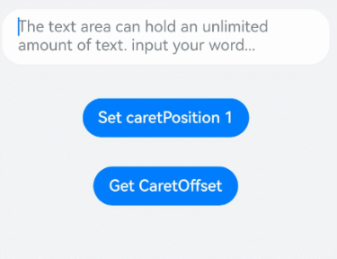

#### 示例2（设置计数器）
从API version 10开始，该示例通过[maxLength](#maxlength10)、[showCounter](#showcounter10)属性实现了计数器的功能。

```ts
// xxx.ets
@Entry
@Component
struct TextAreaExample {
  @State text: string = '';
  controller: TextAreaController = new TextAreaController();

  build() {
    Column() {
      TextArea({
        text: this.text,
        placeholder: 'The text area can hold an unlimited amount of text. input your word...',
        controller: this.controller
      })
        .placeholderFont({ size: 16, weight: 400 })
        .width(336)
        .height(56)
        .margin(20)
        .fontSize(16)
        .fontColor('#182431')
        .backgroundColor('#FFFFFF')
        .maxLength(4)
        .showCounter(true, { thresholdPercentage: 50, highlightBorder: true })
          // 计数器显示效果为用户当前输入字符数/最大字符限制数。最大字符限制数通过maxLength()接口设置。
          // 如果用户当前输入字符数达到最大字符限制乘50%（thresholdPercentage）。字符计数器显示。
          // 用户设置highlightBorder为false时，配置取消红色边框。不设置此参数时，默认为true。
        .onChange((value: string) => {
          this.text = value;
        })
    }.width('100%').height('100%').backgroundColor('#F1F3F5')
  }
}
```

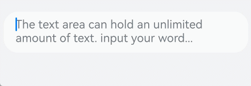

#### 示例3（设置自定义键盘）
该示例通过[customKeyboard](#customkeyboard10)（从API version 10开始）属性分别将value中的入参类型设置为[CustomBuilder](https://developer.huawei.com/consumer/cn/doc/harmonyos-references/ts-types#custombuilder8)和[ComponentContent](https://developer.huawei.com/consumer/cn/doc/harmonyos-references/js-apis-arkui-componentcontent#componentcontent-1)，实现了自定义键盘的功能。
从API version 22开始[customKeyboard](#customkeyboard10)属性新增了入参类型[ComponentContent](https://developer.huawei.com/consumer/cn/doc/harmonyos-references/js-apis-arkui-componentcontent#componentcontent-1)。

```ts
// xxx.ets
import { ComponentContent } from '@kit.ArkUI';
class BuilderParams {
  inputValue: string;
  controller: TextAreaController;

  constructor(inputValue: string, controller: TextAreaController) {
    this.inputValue = inputValue;
    this.controller = controller;
  }
}
@Builder
function CustomKeyboardBuilder(builderParams: BuilderParams) {
  Column() {
    Row() {
      Button('x').onClick(() => {
        // 关闭自定义键盘
        builderParams.controller.stopEditing();
      }).margin(10)
    }

    Grid() {
      ForEach([1, 2, 3, 4, 5, 6, 7, 8, 9, '*', 0, '#'], (item: number | string) => {
        GridItem() {
          Button(item + "")
            .width(110).onClick(() => {
            builderParams.inputValue += item;
          })
        }
      })
    }.maxCount(3).columnsGap(10).rowsGap(10).padding(5)
  }.backgroundColor(Color.Gray)
}
@Entry
@Component
struct TextAreaExample {
  controller: TextAreaController = new TextAreaController();
  @State inputValue: string = "";
  @State componentContent ?: ComponentContent<BuilderParams> = undefined;
  @State builderParam: BuilderParams = new BuilderParams(this.inputValue, this.controller);
  @State supportAvoidance: boolean = true;

  aboutToAppear(): void {
    // 创建ComponentContent
    this.componentContent = new ComponentContent(this.getUIContext(), wrapBuilder(CustomKeyboardBuilder), this.builderParam);
  }
  build(){
    Column() {
      Text('Builder').margin(10).border({ width: 1 })
      TextArea({ controller: this.builderParam.controller, text: this.builderParam.inputValue })
        .customKeyboard(this.componentContent, { supportAvoidance: this.supportAvoidance })
        .margin(10).border({ width: 1 }).height('48vp')

      Text('ComponentContent').margin(10).border({ width: 1 })
      TextArea({ controller: this.builderParam.controller, text: this.builderParam.inputValue })
        .customKeyboard(CustomKeyboardBuilder(this.builderParam), { supportAvoidance: this.supportAvoidance })
        .margin(10).border({ width: 1 }).height('48vp')
    }
  }
}
```

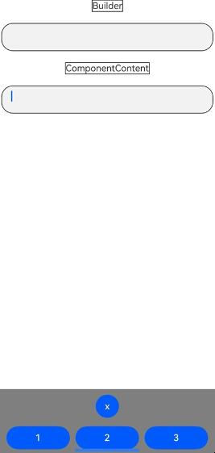

#### 示例4（设置输入法回车键类型）
从API version 11开始，该示例通过[enterKeyType](#enterkeytype11)属性实现了动态切换输入法回车键的效果。

```ts
// xxx.ets
@Entry
@Component
struct TextAreaExample {
  @State text: string = '';
  @State enterTypes: Array<EnterKeyType> =
    [EnterKeyType.Go, EnterKeyType.Search, EnterKeyType.Send, EnterKeyType.Done, EnterKeyType.Next,
      EnterKeyType.PREVIOUS, EnterKeyType.NEW_LINE];
  @State index: number = 0;

  build() {
    Column({ space: 20 }) {
      TextArea({ placeholder: '请输入用户名', text: this.text })
        .width(380)
        .enterKeyType(this.enterTypes[this.index])
        .onChange((value: string) => {
          this.text = value;
        })
        .onSubmit((enterKey: EnterKeyType) => {
          console.info("trigger area onSubmit" + enterKey);
        })
      Button('改变EnterKeyType').onClick(() => {
        this.index = (this.index + 1) % this.enterTypes.length;
      })

    }.width('100%')
  }
}
```

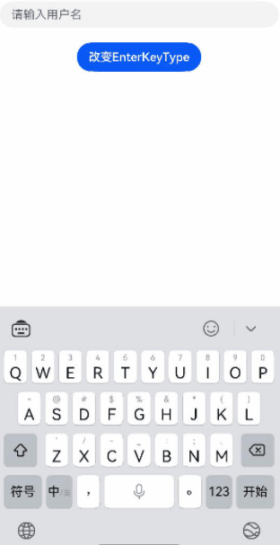

#### 示例5（设置文本断行规则）
从API version 12开始，该示例通过[wordBreak](#wordbreak12)属性实现了TextArea不同断行规则下的效果。

```ts
// xxx.ets
@Entry
@Component
struct TextAreaExample {
  build() {
    Column() {
      Text("属性WordBreakType为NORMAL的样式：").fontSize(16).fontColor(0xFF0000)
      TextArea({
        text: 'This is set wordBreak to WordBreak text Taumatawhakatangihangakoauauotamateaturipukakapikimaungahoronukupokaiwhenuakitanatahu.'
      })
        .fontSize(16)
        .border({ width: 1 })
        .wordBreak(WordBreak.NORMAL)
      Text("英文文本，属性WordBreakType为BREAK_ALL的样式：").fontSize(16).fontColor(0xFF0000)
      TextArea({
        text: 'This is set wordBreak to WordBreak text Taumatawhakatangihangakoauauotamateaturipukakapikimaungahoronukupokaiwhenuakitanatahu.'
      })
        .fontSize(16)
        .border({ width: 1 })
        .wordBreak(WordBreak.BREAK_ALL)
      Text("中文文本，属性WordBreakType为BREAK_ALL的样式：").fontSize(16).fontColor(0xFF0000)
      TextArea({
        text: '多行文本输入框组件，当输入的文本内容超过组件宽度时会自动换行显示。\n高度未设置时，组件无默认高度，自适应内容高度。宽度未设置时，默认撑满最大宽度。'
      })
        .fontSize(16)
        .border({ width: 1 })
        .wordBreak(WordBreak.BREAK_ALL)
      Text("属性WordBreakType为BREAK_WORD的样式：").fontSize(16).fontColor(0xFF0000)
      TextArea({
        text: 'This is set wordBreak to WordBreak text Taumatawhakatangihangakoauauotamateaturipukakapikimaungahoronukupokaiwhenuakitanatahu.'
      })
        .fontSize(16)
        .border({ width: 1 })
        .wordBreak(WordBreak.BREAK_WORD)
    }
  }
}
```

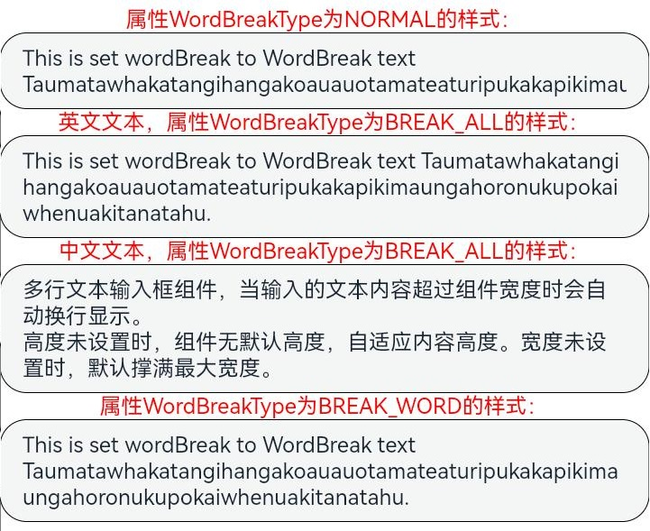

#### 示例6（设置文本样式）
从API version 12开始，该示例通过[lineHeight](#lineheight12)、[letterSpacing](#letterspacing12)、[decoration](#decoration12)属性展示了不同样式的文本效果。

```ts
// xxx.ets
@Entry
@Component
struct TextAreaExample {
  build() {
    Row() {
      Column() {
        Text('lineHeight').fontSize(9).fontColor(0xCCCCCC)
        TextArea({ text: 'lineHeight unset' })
          .border({ width: 1 }).padding(10).margin(5)
        TextArea({ text: 'lineHeight 15' })
          .border({ width: 1 }).padding(10).margin(5).lineHeight(15)
        TextArea({ text: 'lineHeight 30' })
          .border({ width: 1 }).padding(10).margin(5).lineHeight(30)

        Text('letterSpacing').fontSize(9).fontColor(0xCCCCCC)
        TextArea({ text: 'letterSpacing 0' })
          .border({ width: 1 }).padding(5).margin(5).letterSpacing(0)
        TextArea({ text: 'letterSpacing 3' })
          .border({ width: 1 }).padding(5).margin(5).letterSpacing(3)
        TextArea({ text: 'letterSpacing -1' })
          .border({ width: 1 }).padding(5).margin(5).letterSpacing(-1)

        Text('decoration').fontSize(9).fontColor(0xCCCCCC)
        TextArea({ text: 'LineThrough, Red\nsecond line' })
          .border({ width: 1 }).padding(5).margin(5)
          .decoration({ type: TextDecorationType.LineThrough, color: Color.Red })
        TextArea({ text: 'Overline, Red, DOTTED\nsecond line' })
          .border({ width: 1 }).padding(5).margin(5)
          .decoration({ type: TextDecorationType.Overline, color: Color.Red, style: TextDecorationStyle.DOTTED })
        TextArea({ text: 'Underline, Red, WAVY\nsecond line' })
          .border({ width: 1 }).padding(5).margin(5)
          .decoration({ type: TextDecorationType.Underline, color: Color.Red, style: TextDecorationStyle.WAVY })
      }.height('90%')
    }
    .width('90%')
    .margin(10)
  }
}
```

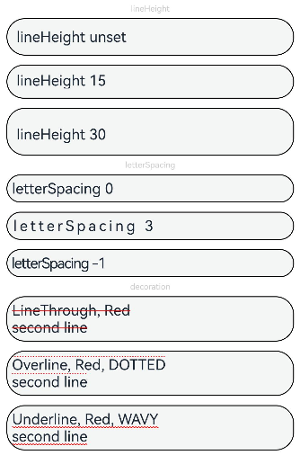

#### 示例7（设置文字特性效果）
从API version 12开始，该示例通过[fontFeature](#fontfeature12)属性实现了文本在不同文字特性下的展示效果。

```ts
// xxx.ets
@Entry
@Component
struct TextAreaExample {
  @State text1: string = 'This is ss01 on : 0123456789';
  @State text2: string = 'This is ss01 off: 0123456789';

  build() {
    Column() {
      TextArea({ text: this.text1 })
        .fontSize(20)
        .margin({ top: 200 })
        .fontFeature("\"ss01\" on")
      TextArea({ text: this.text2 })
        .margin({ top: 10 })
        .fontSize(20)
        .fontFeature("\"ss01\" off")
    }
    .width("90%")
    .margin("5%")
  }
}
```

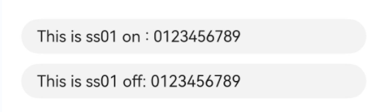

#### 示例8（自定义键盘避让）
该示例通过[customKeyboard](#customkeyboard10)（从API version 10开始）属性配置[KeyboardOptions](https://developer.huawei.com/consumer/cn/doc/harmonyos-references/ts-basic-components-richeditor#keyboardoptions12)（从API version 12开始）接口实现了自定义键盘避让的效果。

```ts
// xxx.ets
@Entry
@Component
struct TextAreaExample {
  controller: TextAreaController = new TextAreaController();
  @State inputValue: string = "";
  @State height1: string | number = '80%';
  @State height2: number = 100;
  @State supportAvoidance: boolean = true;

  // 自定义键盘组件
  @Builder
  CustomKeyboardBuilder() {
    Column() {
      Row() {
        Button('x').onClick(() => {
          // 关闭自定义键盘
          this.controller.stopEditing();
        }).margin(10)
      }

      Grid() {
        ForEach([1, 2, 3, 4, 5, 6, 7, 8, 9, '*', 0, '#'], (item: number | string) => {
          GridItem() {
            Button(item + "")
              .width(110).onClick(() => {
              this.inputValue += item;
            })
          }
        })
      }.maxCount(3).columnsGap(10).rowsGap(10).padding(5)
    }.backgroundColor(Color.Gray)
  }

  build() {
    Column() {
      Row() {
        Button("20%")
          .fontSize(24)
          .onClick(() => {
            this.height1 = "20%";
          })
        Button("80%")
          .fontSize(24)
          .margin({ left: 20 })
          .onClick(() => {
            this.height1 = "80%";
          })
      }
      .justifyContent(FlexAlign.Center)
      .alignItems(VerticalAlign.Bottom)
      .height(this.height1)
      .width("100%")
      .padding({ bottom: 50 })

      TextArea({ controller: this.controller, text: this.inputValue })// 绑定自定义键盘
        .height(100)
        .customKeyboard(this.CustomKeyboardBuilder(), { supportAvoidance: this.supportAvoidance })
        .margin(10)
        .border({ width: 1 })
    }
  }
}
```

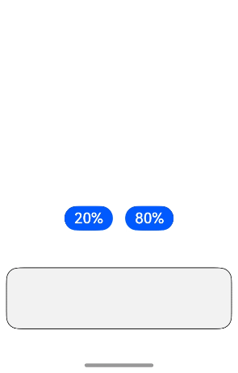

#### 示例9（设置文本自适应）
从API version 12开始，该示例通过[minFontSize](#minfontsize12)、[maxFontSize](#maxfontsize12)、[heightAdaptivePolicy](#heightadaptivepolicy12)属性展示了文本自适应字号的效果。

```ts
// xxx.ets
@Entry
@Component
struct TextAreaExample {
  build() {
    Row() {
      Column() {
        Text('heightAdaptivePolicy').fontSize(9).fontColor(0xCCCCCC)
        TextArea({text: 'This is the text with the height adaptive policy set'})
          .width('80%').height(90).borderWidth(1).margin(1)
          .minFontSize(4)
          .maxFontSize(40)
          .maxLines(3)
          .heightAdaptivePolicy(TextHeightAdaptivePolicy.MAX_LINES_FIRST)
        TextArea({text: 'This is the text with the height adaptive policy set'})
          .width('80%').height(90).borderWidth(1).margin(1)
          .minFontSize(4)
          .maxFontSize(40)
          .maxLines(3)
          .heightAdaptivePolicy(TextHeightAdaptivePolicy.MIN_FONT_SIZE_FIRST)
        TextArea({text: 'This is the text with the height adaptive policy set'})
          .width('80%').height(90).borderWidth(1).margin(1)
          .minFontSize(4)
          .maxFontSize(40)
          .maxLines(3)
          .heightAdaptivePolicy(TextHeightAdaptivePolicy.LAYOUT_CONSTRAINT_FIRST)
      }.height('90%')
    }
    .width('90%')
    .margin(10)
  }
}
```

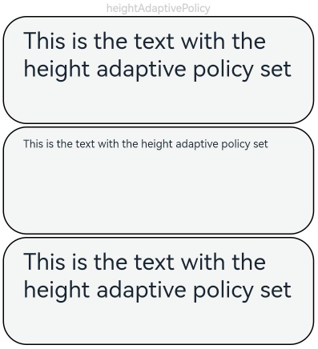

#### 示例10（设置文本行间距）
从API version 12开始，该示例通过[lineSpacing](#linespacing12)属性展示了文本在不同行间距下的展示效果，同时，配置[LineSpacingOptions](https://developer.huawei.com/consumer/cn/doc/harmonyos-references/ts-text-common#linespacingoptions20对象说明)中的onlyBetweenLines（从API version 20开始）属性，可以设置文本的行间距，是否仅在行与行之间生效。

```ts
// xxx.ets
import { LengthMetrics } from '@kit.ArkUI';

@Entry
@Component
struct TextAreaExample {
  build() {
    Flex({ direction: FlexDirection.Column, alignItems: ItemAlign.Start, justifyContent: FlexAlign.SpaceBetween }) {
      Text('TextArea lineSpacing.').fontSize(9).fontColor(0xCCCCCC)
      TextArea({ text: 'This is the TextArea with no lineSpacing set.' })
        .fontSize(12)
      TextArea({ text: 'This is the TextArea with lineSpacing set to 20_px.' })
        .fontSize(12)
        .lineSpacing(LengthMetrics.px(20))
      TextArea({ text: 'This is the TextArea with lineSpacing set to 20_vp.' })
        .fontSize(12)
        .lineSpacing(LengthMetrics.vp(20))
      TextArea({ text: 'This is the TextArea with lineSpacing set to 20_fp.' })
        .fontSize(12)
        .lineSpacing(LengthMetrics.fp(20))
      TextArea({ text: 'This is the TextArea with lineSpacing set to 20_lpx.' })
        .fontSize(12)
        .lineSpacing(LengthMetrics.lpx(20))
      TextArea({ text: 'This is the TextArea with lineSpacing set to 100%.' })
        .fontSize(12)
        .lineSpacing(LengthMetrics.percent(1))
      TextArea({ text: 'The line spacing of this TextArea is set to 20_px, and the spacing is effective only between the lines.' })
        .fontSize(12)
        .lineSpacing(LengthMetrics.px(20), { onlyBetweenLines: true })
    }.height(600).width(350).padding({ left: 35, right: 35, top: 35 })
  }
}
```

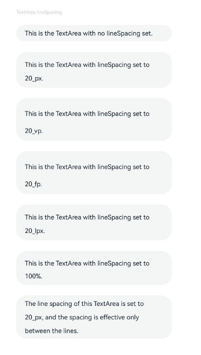

#### 示例11（设置自动填充）
从API version 12开始，该示例通过[contentType](#contenttype12)、[enableAutoFill](#enableautofill12)属性实现了文本自动填充的功能。

```ts
// xxx.ets
@Entry
@Component
struct TextAreaExample {
  @State text: string = '';

  build() {
    Column() {
      // 邮箱地址自动填充类型
      TextArea({ placeholder: 'input your email...' })
        .width('95%')
        .height(40)
        .margin(20)
        .contentType(ContentType.EMAIL_ADDRESS)
        .enableAutoFill(true)
        .maxLength(20)
      // 街道地址自动填充类型
      TextArea({ placeholder: 'input your street address...' })
        .width('95%')
        .height(40)
        .margin(20)
        .contentType(ContentType.FULL_STREET_ADDRESS)
        .enableAutoFill(true)
        .maxLength(20)
    }.width('100%').height('100%').backgroundColor('#F1F3F5')
  }
}
```

具体使用场景请参考[账号密码填充](https://developer.huawei.com/consumer/cn/doc/harmonyos-guides/passwordvault-autofill-acc-password)。

#### 示例12（设置折行规则）
从API version 12开始，该示例通过[lineBreakStrategy](#linebreakstrategy12)属性实现了TextArea不同折行规则下的效果。

```ts
// xxx.ets
@Entry
@Component
struct TextAreaExample {
  @State message1: string =
    "They can be classified as built-in components–those directly provided by the ArkUI framework and custom components – those defined by developers" +
      "The built-in components include buttons radio buttonsprogress indicators and text You can set the rendering effect of these components in method chaining mode," +
      "page components are divided into independent UI units to implement independent creation development and reuse of different units on pages making pages more engineering-oriented.";
  @State lineBreakStrategyIndex: number = 0;
  @State lineBreakStrategy: LineBreakStrategy[] =
    [LineBreakStrategy.GREEDY, LineBreakStrategy.HIGH_QUALITY, LineBreakStrategy.BALANCED];
  @State lineBreakStrategyStr: string[] = ['GREEDY', 'HIGH_QUALITY', 'BALANCED'];

  build() {
    Flex({ direction: FlexDirection.Column, alignItems: ItemAlign.Start }) {
      Text('lineBreakStrategy').fontSize(9).fontColor(0xCCCCCC)
      TextArea({ text: this.message1 })
        .fontSize(12)
        .border({ width: 1 })
        .padding(10)
        .width('100%')
        .lineBreakStrategy(this.lineBreakStrategy[this.lineBreakStrategyIndex])
      Row() {
        Button('当前lineBreakStrategy模式：' + this.lineBreakStrategyStr[this.lineBreakStrategyIndex]).onClick(() => {
          this.lineBreakStrategyIndex++;
          if (this.lineBreakStrategyIndex > (this.lineBreakStrategyStr.length - 1)) {
            this.lineBreakStrategyIndex = 0;
          }
        })
      }.padding({ top: 10 })
    }.height(700).width(370).padding({ left: 35, right: 35, top: 35 })
  }
}
```

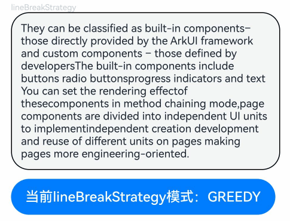

#### 示例13（支持插入和删除回调）
从API version 12开始，该示例通过[onWillInsert](#onwillinsert12)、[onDidInsert](#ondidinsert12)、[onWillDelete](#onwilldelete12)、[onDidDelete](#ondiddelete12)接口实现了插入和删除的功能。

```ts
// xxx.ets
@Entry
@Component
struct TextAreaExample {
  @State insertValue: string = "";
  @State deleteValue: string = "";
  @State insertOffset: number = 0;
  @State deleteOffset: number = 0;
  @State deleteDirection: number = 0;
  @State currentValue_1: string = "";
  @State currentValue_2: string = "";

  build() {
    Row() {
      Column() {
        TextArea({ text: "TextArea支持插入回调文本" })
          .width(300)
          .height(60)
          .onWillInsert((info: InsertValue) => {
            this.insertValue = info.insertValue;
            return true;
          })
          .onDidInsert((info: InsertValue) => {
            this.insertOffset = info.insertOffset;
          })
          .onWillChange((info: EditableTextChangeValue) => {
            this.currentValue_1 = info.content
            return true
          })

        Text("insertValue:" + this.insertValue + "  insertOffset:" + this.insertOffset).height(30)
        Text("currentValue_1:" + this.currentValue_1).height(30)

        TextArea({ text: "TextArea支持删除回调文本b" })
          .width(300)
          .height(60)
          .onWillDelete((info: DeleteValue) => {
            this.deleteValue = info.deleteValue;
            this.deleteDirection = info.direction;
            return true;
          })
          .onDidDelete((info: DeleteValue) => {
            this.deleteOffset = info.deleteOffset;
            this.deleteDirection = info.direction;
          })
          .onWillChange((info: EditableTextChangeValue) => {
            this.currentValue_2 = info.content
            return true
          })

        Text("deleteValue:" + this.deleteValue + "  deleteOffset:" + this.deleteOffset).height(30)
        Text("deleteDirection:" + (this.deleteDirection == 0 ? "BACKWARD" : "FORWARD")).height(30)
        Text("currentValue_2:" + this.currentValue_2).height(30)

      }.width('100%')
    }
    .height('100%')
  }
}
```

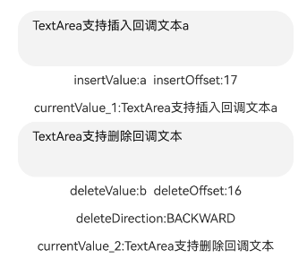

#### 示例14（文本扩展自定义菜单）
从API version 12开始，该示例通过[editMenuOptions](#editmenuoptions12)接口实现了文本设置自定义菜单扩展项的文本内容、图标以及回调的功能，同时，可以在[onPrepareMenu](https://developer.huawei.com/consumer/cn/doc/harmonyos-references/ts-text-common#属性-1)（从API version 20开始）回调中，进行菜单数据的设置。

```ts
// xxx.ets
@Entry
@Component
struct TextAreaExample {
  @State text: string = 'TextArea editMenuOptions';
  @State endIndex: number = 0;
  onCreateMenu = (menuItems: Array<TextMenuItem>) => {
    // $r('app.media.startIcon')需要替换为开发者所需的图像资源文件。
    let item1: TextMenuItem = {
      content: 'create1',
      icon: $r('app.media.startIcon'),
      id: TextMenuItemId.of('create1'),
    };
    let item2: TextMenuItem = {
      content: 'create2',
      id: TextMenuItemId.of('create2'),
      icon: $r('app.media.startIcon'),
    };
    // 从API version 23开始支持TextMenuItemId.autoFill
    let targetIndex = menuItems.findIndex(item => item.id.equals(TextMenuItemId.autoFill));
    if (targetIndex !== -1) {
      menuItems.splice(targetIndex, 1); // 从目标索引删除1个元素
    }
    menuItems.push(item1);
    menuItems.unshift(item2);
    return menuItems;
  }
  onMenuItemClick = (menuItem: TextMenuItem, textRange: TextRange) => {
    if (menuItem.id.equals(TextMenuItemId.of("create2"))) {
      console.info("拦截 id: create2 start:" + textRange.start + "; end:" + textRange.end);
      return true;
    }
    if (menuItem.id.equals(TextMenuItemId.of("prepare1"))) {
      console.info("拦截 id: prepare1 start:" + textRange.start + "; end:" + textRange.end);
      return true;
    }
    if (menuItem.id.equals(TextMenuItemId.COPY)) {
      console.info("拦截 COPY start:" + textRange.start + "; end:" + textRange.end);
      return true;
    }
    if (menuItem.id.equals(TextMenuItemId.SELECT_ALL)) {
      console.info("不拦截 SELECT_ALL start:" + textRange.start + "; end:" + textRange.end);
      return false;
    }
    return false;
  }
  onPrepareMenu = (menuItems: Array<TextMenuItem>) => {
    // $r('app.media.startIcon')需要替换为开发者所需的图像资源文件。
    let item1: TextMenuItem = {
      content: 'prepare1_' + this.endIndex,
      icon: $r('app.media.startIcon'),
      id: TextMenuItemId.of('prepare1'),
    };
    menuItems.unshift(item1);
    return menuItems;
  }
  @State editMenuOptions: EditMenuOptions = {
    onCreateMenu: this.onCreateMenu,
    onMenuItemClick: this.onMenuItemClick,
    onPrepareMenu: this.onPrepareMenu
  };

  build() {
    Column() {
      TextArea({ text: this.text })
        .width('95%')
        .height(56)
        .editMenuOptions(this.editMenuOptions)
        .margin({ top: 100 })
        .onTextSelectionChange((selectionStart: number, selectionEnd: number) => {
          this.endIndex = selectionEnd;
        })
    }
    .width("90%")
    .margin("5%")
  }
}
```

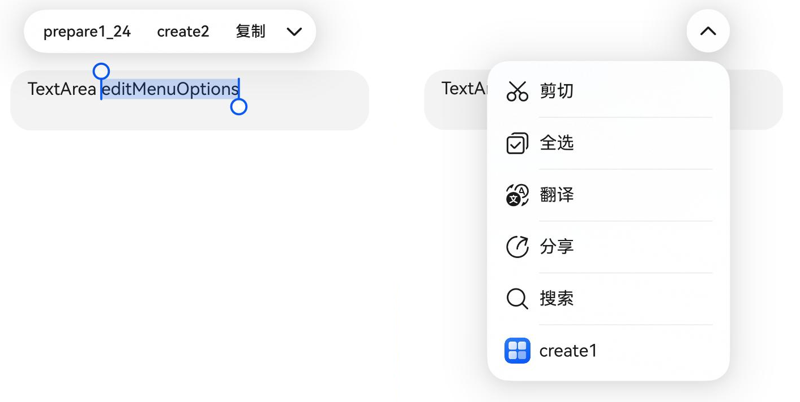

#### 示例15（文本设置省略模式）
该示例通过[textOverflow](#textoverflow12)、[ellipsisMode](#ellipsismode18)、[maxLines](#maxlines10)属性展示了文本超长省略以及调整省略位置的效果，通过MULTILINE_START和MULTILINE_CENTER两种类型实现了单行文本和多行文本场景下的省略号在行首和行中的效果。
从API version 10开始，通过[maxLines](#maxlines10)属性设置文本显示的最大行数。
从API version 12开始，通过[textOverflow](#textoverflow12)属性设置文本超长时的显示方式。
从API version 18开始，通过[ellipsisMode](#ellipsismode18)属性设置省略号位置。
从API version 24开始，[EllipsisMode](https://developer.huawei.com/consumer/cn/doc/harmonyos-references/ts-appendix-enums#ellipsismode11)新增了MULTILINE_START和MULTILINE_CENTER枚举。

```ts
// xxx.ets
@Entry
@Component
struct EllipsisModeExample {
  @State textIndex: number = 0;
  @State text: string = "As the sun begins to set, casting a warm golden hue across the sky," +
    "the world seems to slow down and breathe a sigh of relief. The sky is painted with hues of orange, " +
    " pink, and lavender, creating a breath taking tapestry that stretches as far as the eye can see." +
    "The air is filled with the sweet scent of blooming flowers, mingling with the earthy aroma of freshly turned soil.";
  @State ellipsisModeIndex: number = 0;
  @State ellipsisMode: (EllipsisMode | undefined | null)[] =
    [EllipsisMode.START, EllipsisMode.END, EllipsisMode.CENTER, EllipsisMode.MULTILINE_START,
      EllipsisMode.MULTILINE_CENTER, undefined, null]; // 从API version 24开始新增MULTILINE_START和MULTILINE_CENTER
  @State ellipsisModeStr: string[] =
    ['START ', 'END', 'CENTER', 'MULTILINE_START', 'MULTILINE_CENTER', 'undefined', 'null'];
  @State textOverflowIndex: number = 0;
  @State textOverflow: TextOverflow[] = [TextOverflow.Ellipsis, TextOverflow.Clip];
  @State textOverflowStr: string[] = ['Ellipsis', 'Clip'];
  @State maxLinesIndex: number = 0;
  @State maxLines: number[] = [1, 2, 3];
  @State maxLinesStr: string[] = ['1', '2', '3'];
  @State styleAreaIndex: number = 0;
  @State styleArea: TextContentStyle[] = [TextContentStyle.INLINE, TextContentStyle.DEFAULT];
  @State styleAreaStr: string[] = ['INLINE', 'DEFAULT'];

  build() {
    Column({ space: 20 }) {
      TextArea({ text: this.text })
        .textOverflow(this.textOverflow[this.textOverflowIndex])
        .ellipsisMode(this.ellipsisMode[this.ellipsisModeIndex])
        .maxLines(this.maxLines[this.maxLinesIndex])
        .style(this.styleArea[this.styleAreaIndex])
        .fontSize(30)
        .margin(30)

      Button('更改ellipsisMode模式：' + this.ellipsisModeStr[this.ellipsisModeIndex]).onClick(() => {
        this.ellipsisModeIndex++;
        if (this.ellipsisModeIndex > (this.ellipsisModeStr.length - 1)) {
          this.ellipsisModeIndex = 0;
        }
      }).fontSize(20)
      Button('更改textOverflow模式：' + this.textOverflowStr[this.textOverflowIndex]).onClick(() => {
        this.textOverflowIndex++;
        if (this.textOverflowIndex > (this.textOverflowStr.length - 1)) {
          this.textOverflowIndex = 0;
        }
      }).fontSize(20)
      Button('更改maxLines大小：' + this.maxLinesStr[this.maxLinesIndex]).onClick(() => {
        this.maxLinesIndex++;
        if (this.maxLinesIndex > (this.maxLinesStr.length - 1)) {
          this.maxLinesIndex = 0;
        }
      }).fontSize(20)
      Button('更改Style大小：' + this.styleAreaStr[this.styleAreaIndex]).onClick(() => {
        this.styleAreaIndex++;
        if (this.styleAreaIndex > (this.styleAreaStr.length - 1)) {
          this.styleAreaIndex = 0;
        }
      }).fontSize(20)
    }.height(600).width('100%')
  }
}
```

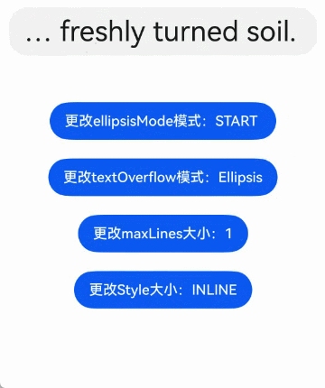

#### 示例16（自定义复制、剪切、粘贴）
该示例通过[onCopy](#oncopy8)、[onCut](#oncut8)、[onPaste](#onpaste)展示如何监听文本选择菜单的复制、剪切、粘贴按钮，以及如何屏蔽系统粘贴功能并实现自定义的粘贴能力，同时，可以通过[maxFontScale](#maxfontscale18)、[minFontScale](#minfontscale18)属性设置文本最大和最小的字体缩放倍数。

```ts
// xxx.ets
@Entry
@Component
struct TextAreaExample {
  @State text: string = '';
  controller: TextAreaController = new TextAreaController();

  build() {
    Column() {
      TextArea({
        text: this.text,
        placeholder: 'placeholder',
        controller: this.controller
      })
        .placeholderColor(Color.Red)
        .textAlign(TextAlign.Center)
        .caretColor(Color.Green)
        .caretStyle({ width: '2vp' })
        .fontStyle(FontStyle.Italic)
        .fontWeight(FontWeight.Bold)
        .fontFamily('HarmonyOS Sans')
        .inputFilter('[a-zA-Z]+', (value) => { // 只允许字母输入
          console.error(`unsupported char ${value}`);
        })
        .copyOption(CopyOptions.LocalDevice)
        .enableKeyboardOnFocus(false)
        .selectionMenuHidden(false)
        .barState(BarState.On)
        .type(TextAreaType.NORMAL)
        .selectedBackgroundColor(Color.Orange)
        .textIndent(2)
        .halfLeading(true)
        .minFontScale(1)
        .maxFontScale(2)
        .enablePreviewText(true)
        .enableHapticFeedback(true)
        .stopBackPress(false)// 返回键交给其他组件处理
        .width(336)
        .height(56)
        .margin(20)
        .fontSize(16)
        .onEditChange((isEditing: boolean) => {
          console.info(`isEditing ${isEditing}`);
        })
        .onCopy((value) => {
          console.info(`copy ${value}`);
        })
        .onCut((value) => {
          console.info(`cut ${value}`);
        })
        .onPaste((value, event) => {
          // 阻止系统粘贴功能，开发者可自行实现
          if (event.preventDefault) {
            event.preventDefault();
          }
          console.info(`paste:${value}`);
          this.text = value;
        })
        .onTextSelectionChange((start: number, end: number) => {
          console.info(`onTextSelectionChange start ${start}, end ${end}`);
        })
        .onContentScroll((totalOffsetX: number, totalOffsetY: number) => {
          console.info(`onContentScroll offsetX ${totalOffsetX}, offsetY ${totalOffsetY}`);
        })
    }.width('100%').height('100%').backgroundColor('#F1F3F5')
  }
}
```

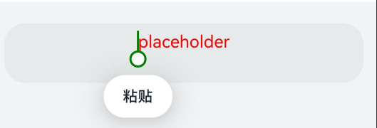

#### 示例17（设置最小字体范围与最大字体范围）
从API version 18开始，该示例通过[minFontScale](#minfontscale18)、[maxFontScale](#maxfontscale18)设置字体显示最小与最大范围。

```ts
// 开启应用缩放跟随系统
// AppScope/resources/base，新建文件夹profile。
// AppScope/resources/base/profile，新建文件configuration.json。
// AppScope/resources/base/profile/configuration.json，增加如下代码。
{
  "configuration": {
    "fontSizeScale": "followSystem",
    "fontSizeMaxScale": "3.2"
  }
}
```


```ts
// AppScope/app.json5，修改如下代码。
{
  "app": {
    "bundleName": "com.example.myapplication",
    "vendor": "example",
    "versionCode": 1000000,
    "versionName": "1.0.0",
    "icon": "$media:app_icon",
    "label": "$string:app_name",
    "configuration": "$profile:configuration"
  }
}
```


```ts
// xxx.ets
@Entry
@Component
struct TextAreaExample {
  @State minFontScale: number = 0.85;
  @State maxFontScale: number = 2;

  build() {
    Column() {
      Column({ space: 30 }) {
        Text("通过minFontScale、maxFontScale调整文本显示的最大和最小字体缩放倍数。")
        TextArea({
          placeholder: 'The text area can hold an unlimited amount of text. input your word...',
          text: '通过minFontScale、maxFontScale调整文本显示的最大和最小字体缩放倍数。'
        })
          .minFontScale(this.minFontScale)// 设置最小字体缩放倍数，参数为undefined则跟随系统默认倍数缩放
          .maxFontScale(this.maxFontScale) // 设置最大字体缩放倍数，参数为undefined则跟随系统默认倍数缩放
      }.width('100%')
    }
  }
}
```

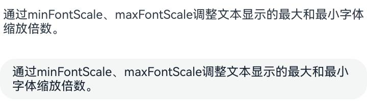

#### 示例18（设置选中指定区域的文本内容）
从API version 10开始，该示例通过[setTextSelection](#settextselection10)方法展示如何设置选中指定区域的文本内容以及菜单的显隐策略。

```ts
// xxx.ets

@Entry
@Component
struct TextAreaExample {
  controller: TextAreaController = new TextAreaController();
  @State startIndex: number = 0;
  @State endIndex: number = 0;

  build() {
    Column({ space: 3 }) {
      Text('Selection start:' + this.startIndex + ' end:' + this.endIndex)
      TextArea({ text: 'Hello World', controller: this.controller })
        .width('95%')
        .height(80)
        .margin(10)
        .defaultFocus(true)
        .enableKeyboardOnFocus(true)
        .onTextSelectionChange((selectionStart: number, selectionEnd: number) => {
          this.startIndex = selectionStart;
          this.endIndex = selectionEnd;
        })

      Button('setTextSelection [0,3], set menuPolicy is MenuPolicy.SHOW')
        .onClick(() => {
          this.controller.setTextSelection(0, 3, { menuPolicy: MenuPolicy.SHOW });
        })
    }
    .width('100%')
    .height('100%')
  }
}
```

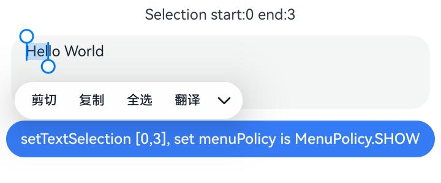

#### 示例19（设置文本描边）
从API version 20开始，该示例通过[strokeWidth](#strokewidth20)和[strokeColor](#strokecolor20)属性设置文本的描边宽度及颜色。

```ts
// xxx.ets
import { LengthMetrics } from '@kit.ArkUI';

@Entry
@Component
struct TextAreaExample {
  build() {
    Row() {
      Column() {
        Text('stroke feature').fontSize(9).fontColor(0xCCCCCC)

        TextArea({ text: 'Text without stroke' })
          .width('100%')
          .height(60)
          .borderWidth(1)
          .fontSize(40)
        TextArea({ text: 'Text with stroke' })
          .width('100%')
          .height(60)
          .borderWidth(1)
          .fontSize(40)
          .strokeWidth(LengthMetrics.px(-3.0))
          .strokeColor(Color.Red)
        TextArea({ text: 'Text with stroke' })
          .width('100%')
          .height(60)
          .borderWidth(1)
          .fontSize(40)
          .strokeWidth(LengthMetrics.px(3.0))
          .strokeColor(Color.Red)
      }.height('90%')
    }
    .width('90%')
    .margin(10)
  }
}
```


#### 示例20（设置中西文自动间距）
从API version 20开始，该示例通过[enableAutoSpacing](#enableautospacing20)属性设置中西文自动间距。

```ts
// xxx.ets
@Entry
@Component
struct TextAreaExample {
  build() {
    Row() {
      Column() {
        Text('开启中西文自动间距').margin(5)
        TextArea({text: '中西文Auto Spacing自动间距'})
          .enableAutoSpacing(true)
        Text('关闭中西文自动间距').margin(5)
        TextArea({text: '中西文Auto Spacing自动间距'})
          .enableAutoSpacing(false)
      }.height('100%')
    }
    .width('60%')
  }
}
```

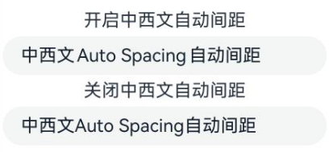

#### 示例21（设置最大行数）
从API version 20开始，该示例通过[maxLines](#maxlines20)属性设置显示最大行数，超出最大行数后可滚动。

```ts
// xxx.ets
@Entry
@Component
struct TextAreaExample {
  build() {
    Row() {
      Column() {
        TextArea({ text: '1 2 3 4 5 6 7 8 9 10 11 12 13 14 15 16 17 18 19 20' })
          .fontSize(50)
          .width('50%')
          .borderWidth(1)
          .margin(100)
          .textOverflow(TextOverflow.Clip)
          .maxLines(3, { overflowMode: MaxLinesMode.SCROLL })
      }.height('90%')
    }
    .width('90%')
    .margin(10)
  }
}
```

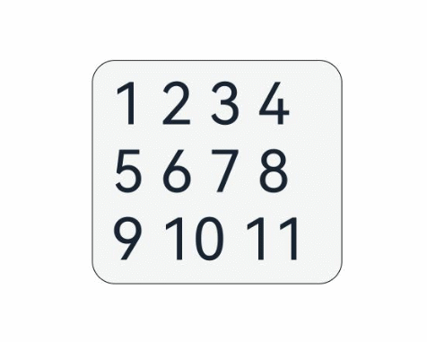

#### 示例22（设置最小行数）
从API version 20开始，该示例通过[minLines](#minlines20)属性设置显示的最小行数。

```ts
// xxx.ets
@Entry
@Component
struct Index {
  @State message: string = 'Hello World';

  build() {
    Row() {
      Column() {
        TextArea({ text: this.message })
          .width('95%')
          .fontSize(20)
          .margin(10)
          .minLines(3)
      }
    }
    .width('90%')
    .margin(10)
  }
}
```


#### 示例23（设置字符计数颜色以及超出字符颜色）
从API version 22开始，该示例通过[showCounter](#showcounter10)属性的counterTextColor和counterTextOverflowColor设置字符计数颜色以及超出字符颜色。

```ts
import { ColorMetrics } from '@kit.ArkUI';

// xxx.ets
@Entry
@Component
struct TextAreaExample {
  @State text: string = '';
  controller: TextAreaController = new TextAreaController();

  build() {
    Column() {
      TextArea({
        text: this.text,
        placeholder: 'The text area can hold an unlimited amount of text. input your word...',
        controller: this.controller
      })
        .placeholderFont({ size: 16, weight: 400 })
        .width(336)
        .height(56)
        .margin(20)
        .fontSize(16)
        .fontColor('#182431')
        .backgroundColor('#FFFFFF')
        .maxLength(4)
        .showCounter(true, {
          thresholdPercentage: 50,
          highlightBorder: true,
          counterTextColor: ColorMetrics.resourceColor(Color.Red),
          counterTextOverflowColor: ColorMetrics.resourceColor(Color.Orange)
        })
    }.width('100%').height('100%').backgroundColor('#F1F3F5')
  }
}
```

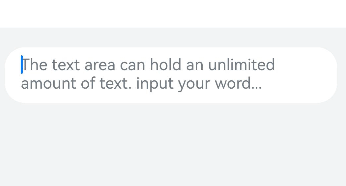

#### 示例24（设置滚动条颜色）
从API version 22开始，该示例通过[scrollBarColor](#scrollbarcolor22)属性设置滚动条颜色。

```ts
// xxx.ets
import { ColorMetrics } from '@kit.ArkUI';
@Entry
@Component
struct Index {
  controller: TextAreaController = new TextAreaController();
  build() {
      Column() {
        TextArea({
          text: "Hello World TextArea\nHello World TextArea\nHello World TextArea\nHello World TextArea",
          placeholder: 'Type to text area...',
          controller: this.controller
        })
          .width(336)
          .height(56)
          .margin({bottom:5})
          .fontSize(16)
          .fontColor('#182431')
          .backgroundColor('#FFFFFF')
          .barState(BarState.On)
          .scrollBarColor(undefined)
        TextArea({
          text: "Hello World TextArea\nHello World TextArea\nHello World TextArea\nHello World TextArea",
          placeholder: 'Type to text area...',
          controller: this.controller
        })
          .width(336)
          .height(56)
          .margin({bottom:5})
          .fontSize(16)
          .fontColor('#182431')
          .backgroundColor('#FFFFFF')
          .barState(BarState.On)
          .scrollBarColor(ColorMetrics.resourceColor(Color.Orange))
        TextArea({
          text: "Hello World TextArea\nHello World TextArea\nHello World TextArea\nHello World TextArea",
          placeholder: 'Type to text area...',
          controller: this.controller
        })
          .width(336)
          .height(56)
          .margin({bottom:5})
          .fontSize(16)
          .fontColor('#182431')
          .backgroundColor('#FFFFFF')
          .barState(BarState.On)
          .scrollBarColor(ColorMetrics.rgba(255, 100, 255))
      }
      .backgroundColor(Color.Blue).width('100%').height('100%')
  }
}
```

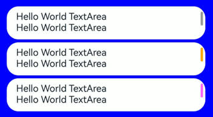

#### 示例25（设置placeholder富文本样式）
从API version 22开始，该示例通过[setStyledPlaceholder](https://developer.huawei.com/consumer/cn/doc/harmonyos-references/ts-universal-attributes-text-style#setstyledplaceholder22)接口设置placeholder富文本样式。

```ts
// xxx.ets
import { LengthMetrics } from '@kit.ArkUI';

@Entry
@Component
struct TextAreaExample {
  styledString: MutableStyledString =
    new MutableStyledString("段落标题\n正文第一段\n正文第二段indent 40 vp\n正文第三段textAlign居中对齐",
      [
        {
          start: 0,
          length: 4,
          styledKey: StyledStringKey.FONT,
          styledValue: new TextStyle({ fontSize: LengthMetrics.vp(24), fontWeight: FontWeight.Bolder })
        },
        {
          start: 5,
          length: 5,
          styledKey: StyledStringKey.FONT,
          styledValue: new TextStyle({ fontColor: Color.Gray })
        },
        {
          start: 11,
          length: 1,
          styledKey: StyledStringKey.PARAGRAPH_STYLE,
          styledValue: new ParagraphStyle({
            textIndent: LengthMetrics.vp(40),
            maxLines: 1,
            overflow: TextOverflow.Ellipsis
          })
        },
        {
          start: 29,
          length: 1,
          styledKey: StyledStringKey.PARAGRAPH_STYLE,
          styledValue: new ParagraphStyle({
            textAlign: TextAlign.Center
          })
        }
      ]);
  controller: TextAreaController = new TextAreaController();

  aboutToAppear() {
    this.controller.setStyledPlaceholder(this.styledString)
  }

  build() {
    Scroll() {
      Column() {
        Text("TextArea placeholder富文本")
          .fontSize(8)
        TextArea({ controller: this.controller })
          .width(200)
          .fontSize(24)
          .margin(10)
      }
      .width('100%')
    }
  }
}
```

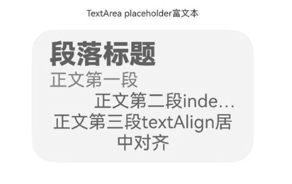

#### 示例26（设置输入法扩展信息）
从API version 22开始，该示例通过[IMEClient](https://developer.huawei.com/consumer/cn/doc/harmonyos-references/ts-text-common#imeclient20对象说明)的setExtraConfig设置输入法扩展信息。

```ts
// xxx.ets
@Entry
@Component
struct TextAreaExample {
  build() {
    Column() {
      TextArea({ text: '拉起输入法前执行onWillAttachIME回调' })
        .onWillAttachIME((client: IMEClient) => {
          client.setExtraConfig({
            customSettings: {
              name: "TextArea", // 自定义属性
              id: client.nodeId // 自定义属性
            }
          })
        })
    }.height('100%')
  }
}
```

#### 示例27（设置行首标点压缩）
该示例通过[compressLeadingPunctuation](#compressleadingpunctuation23)接口设置行首标点压缩，左侧有间距的标点符号位于行首时，标点会直接压缩间距至左侧边界。
从API version 23开始，支持compressLeadingPunctuation接口。

```ts
// xxx.ets
@Entry
@Component
struct Index {
  build() {
    Column(){
      TextArea({ text: "\u300C行首标点压缩打开" })
        .compressLeadingPunctuation(true)
        .margin(5)
        .fontSize(30)
        .width("90%")
      TextArea({ text: "\u300C行首标点压缩关闭" })
        .compressLeadingPunctuation(false)
        .fontSize(30)
        .width("90%")
    }
  }
}
```

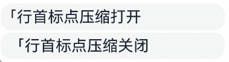

#### 示例28（设置自适应间距）
该示例通过[includeFontPadding](#includefontpadding23)接口增加首行尾行间距和[fallbackLineSpacing](#fallbacklinespacing23)接口设置自适应行间距。
从API version 23开始，新增[includeFontPadding](#includefontpadding23)和[fallbackLineSpacing](#fallbacklinespacing23)接口。

```ts
// xxx.ets

const UYGHUR_TEXT: string = 'ياخشىمۇسەنياخشىمۇسەنياخشىمۇسەنياخشىمۇسەنياخشىمۇسەنياخشىمۇسەنياخشىمۇسەن';
@Entry
@Component
struct Index {
  @State include: boolean | null | undefined = false;
  @State fallback: boolean | null | undefined = false;
  @State displayText: string = UYGHUR_TEXT;

  build() {
    Column() {
      TextArea({
        text: this.displayText,
        placeholder: '请输入内容...'
      })
        .includeFontPadding(this.include)
        .fallbackLineSpacing(this.fallback)
        .lineHeight(5)
        .width('100%')
        .height(100)
        .backgroundColor('#eee')
        .borderWidth(1)
        .borderColor('#dddddd')

      Scroll() {
        Column() {
          // --- IncludeFontPadding相关按钮 ---
          Button('设置includePadding: ' + this.include)
            .onClick(() => {
              this.include = this.include === false ? true : false;
            })
            .margin({ bottom: 10 })

          // --- FallbackLineSpacing相关按钮 ---
          Button('设置fallbackLineSpacing: ' + this.fallback)
            .onClick(() => {
              this.fallback = this.fallback === false ? true : false;
            })
            .margin({ bottom: 10 })

        }
        .width('100%')
        .padding(5)
      }
      .height(250)
      .backgroundColor('transparent')
      .scrollBarWidth(2)
      .scrollBarColor('#888')

    }
    .width('100%')
    .height('100%')
    .padding(20)
  }
}
```

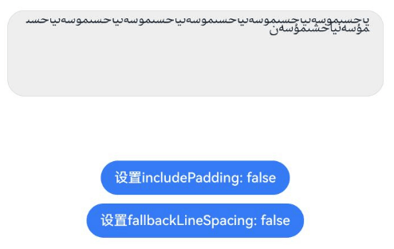

#### 示例29（设置文本拖拽时的背板样式）
该示例通过[selectedDragPreviewStyle](#selecteddragpreviewstyle23)接口设置文本拖拽时的背板样式。
从API version 23开始，新增selectedDragPreviewStyle接口。

```ts
@Entry
@Component
struct TextAreaTest {
  build() {
    Column() {
      TextArea({ text: 'HelloWorld', placeholder: 'please input words' })
        .copyOption(CopyOptions.InApp)
        .width(200)
        .height(50)
        .margin(150)
        .draggable(true)
        .selectedDragPreviewStyle({color: 'rgba(227, 248, 249, 1)'})
    }
    .height('100%')
  }
}
```


#### 示例30（删除文本框内的最后一个字符）
该示例通过调用[deleteBackward](https://developer.huawei.com/consumer/cn/doc/harmonyos-references/ts-universal-attributes-text-style#deletebackward23)接口删除文本框内最后一个字符。
从API version 23开始，新增[deleteBackward](https://developer.huawei.com/consumer/cn/doc/harmonyos-references/ts-universal-attributes-text-style#deletebackward23)接口。

```ts
@Entry
@Component
struct Page {
  controller: TextAreaController = new TextAreaController();

  build() {
    Column() {
      TextArea({ text: 'TextArea输入框Deletebackward示例', controller: this.controller })
      Button('Delete backward')
        .onClick(() => {
          this.controller.deleteBackward();
        })
    }
  }
}
```

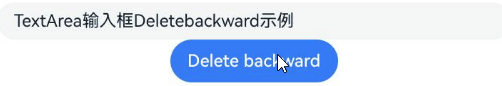

#### 示例31（设置文本排版方向）
该示例通过[textDirection](#textdirection23)接口设置文本排版方向。
从API version 23开始，新增textDirection接口。

```ts
// xxx.ets
@Entry
@Component
struct TextAreaExample {
  @State text: string = 'TextArea文本排版方向示例';

  build() {
    Column() {
      Text('TextArea文本排版方向RTL，布局方向default')
        .fontSize(12).width('90%')
      TextArea({ text: this.text })
        .width(336)
        .height(56)
        .margin(10)
        .fontSize(16)
        .textDirection(TextDirection.RTL)
        .showCounter(true)
        .maxLength(50)
      Text('TextArea文本排版方向RTL，布局方向default，文本水平方向对齐方式LEFT')
        .fontSize(12).width('90%')
      TextArea({ text: this.text })
        .width(336)
        .height(56)
        .margin(10)
        .fontSize(16)
        .textDirection(TextDirection.RTL)
        .textAlign(TextAlign.LEFT)
        .showCounter(true)
        .maxLength(50)
      Text('TextArea文本排版方向LTR，布局方向Rtl')
        .fontSize(12).width('90%')
      TextArea({ text: this.text })
        .width(336)
        .height(56)
        .margin(10)
        .fontSize(16)
        .textDirection(TextDirection.LTR)
        .direction(Direction.Rtl)
        .maxLength(50)
        .showCounter(true)
    }.width('100%').height('100%')
  }
}
```

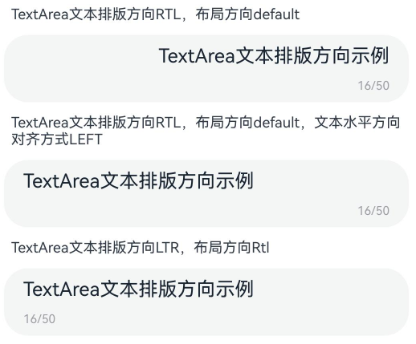

#### 示例32（将指定范围的文字滚动到可视区内）
本示例通过[scrollToVisible](https://developer.huawei.com/consumer/cn/doc/harmonyos-references/ts-universal-attributes-text-style#scrolltovisible23)将可视区外的文本滚动到可视区内。
从API version 23开始，新增scrollToVisible接口。

```ts
// xxx.ets
@Entry
@Component
struct TextAreaExample {
  @State text: string = '12345678913456789123456789123456789123456789123456789123456789123456789123456789123';
  controller: TextAreaController = new TextAreaController();

  build() {
    Column() {
      TextArea({ text: this.text, controller: this.controller })
        .width(336)
        .height(150)
      Button("滚动文本到可视区").onClick(() => {
        this.controller.scrollToVisible({ start: 110, end: 115 })
      })
    }.width('100%').height('100%').backgroundColor('#F1F3F5')
  }

  aboutToAppear(): void {
    for (let i = 0; i < 5; i++) {
      this.text += this.text
    }
  }
}
```


#### 示例33（设置水平滚动）
本示例通过[horizontalScrolling](#horizontalscrolling24)设置水平滚动。
从API version 24开始，新增horizontalScrolling接口。

```ts
// xxx.ets
@Entry
@Component
struct Index {
  @State message: string = `Hello World Hello World Hello World Hello World Hello World\n
Hello World Hello World Hello World Hello World Hello World\n
Hello World Hello World Hello World Hello World Hello World\n
Hello World Hello World Hello World Hello World Hello World\n
Hello World Hello World Hello World Hello World Hello World\n
Hello World Hello World Hello World Hello World Hello World\n
Hello World Hello World Hello World Hello World Hello World\n
Hello World Hello World Hello World Hello World Hello World\n
`

  build() {
    Column() {
      TextArea({ text: this.message })
        .horizontalScrolling(true)
        .width('200vp')
        .height('150vp')
    }
    .height('100%')
    .width('100%')
  }
}
```

