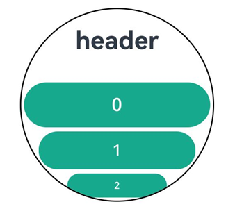

# ArcList

更新时间：2026-04-20 06:34:33

来源：https://developer.huawei.com/consumer/cn/doc/harmonyos-references/ts-container-arclist
**支持设备：** Phone / PC/2in1 / Tablet / Wearable / TV

弧形列表包含一系列列表项。适合连续、多行呈现同类数据，例如图片和文本。


## 导入模块
**支持设备：** Phone / PC/2in1 / Tablet / Wearable / TV


API version 21及之前版本：


```ts
import { ArcList, ArcListAttribute } from '@kit.ArkUI';
```

API version 22及之后版本：


```ts
import { ArcList } from '@kit.ArkUI';
```


## 子组件
**支持设备：** Phone / PC/2in1 / Tablet / Wearable / TV

仅支持[ArcListItem](https://developer.huawei.com/consumer/cn/doc/harmonyos-references/ts-container-arclistitem)子组件。


> [!NOTE]
> ArcList的子组件索引值计算规则：


## 接口
**支持设备：** Phone / PC/2in1 / Tablet / Wearable / TV

ArcList(options?: ArkListOptions)

创建弧形列表实例，传入弧形列表配置项参数。

**元服务API：** 从API version 18开始，该接口支持在元服务中使用。

**系统能力：** SystemCapability.ArkUI.ArkUI.Circle

**参数：**


| 参数名 | 类型 | 必填 | 说明 |
| --- | --- | --- | --- |
| options | [ArkListOptions](#arklistoptions) | 否 | 为ArcList提供可选参数。 |


## 属性
**支持设备：** Phone / PC/2in1 / Tablet / Wearable / TV

除支持[通用属性](https://developer.huawei.com/consumer/cn/doc/harmonyos-references/ts-component-general-attributes)外，还支持以下属性：


### digitalCrownSensitivity
**支持设备：** Phone / PC/2in1 / Tablet / Wearable / TV

digitalCrownSensitivity(sensitivity: Optional<CrownSensitivity>)

设置表冠响应事件灵敏度。

**元服务API：** 从API version 18开始，该接口支持在元服务中使用。

**系统能力：** SystemCapability.ArkUI.ArkUI.Circle

**参数：**


| 参数名 | 类型 | 必填 | 说明 |
| --- | --- | --- | --- |
| sensitivity | [Optional](https://developer.huawei.com/consumer/cn/doc/harmonyos-references/ts-universal-attributes-custom-property#optionalt)&lt;[CrownSensitivity](https://developer.huawei.com/consumer/cn/doc/harmonyos-references/ts-appendix-enums#crownsensitivity18)&gt; | 是 | 表冠响应灵敏度。          默认值：CrownSensitivity.MEDIUM，响应速度适中。 |


### space
**支持设备：** Phone / PC/2in1 / Tablet / Wearable / TV

space(space: Optional<LengthMetrics>)

设置列表子项之间的距离。

**元服务API：** 从API version 18开始，该接口支持在元服务中使用。

**系统能力：** SystemCapability.ArkUI.ArkUI.Circle

**参数：**


| 参数名 | 类型 | 必填 | 说明 |
| --- | --- | --- | --- |
| space | [Optional](https://developer.huawei.com/consumer/cn/doc/harmonyos-references/ts-universal-attributes-custom-property#optionalt)&lt;[LengthMetrics](https://developer.huawei.com/consumer/cn/doc/harmonyos-references/js-apis-arkui-graphics#lengthmetrics12)&gt; | 是 | 列表子项之间的间距。          默认值：LengthMetrics.vp(0)          ArcList子组件的[visibility](https://developer.huawei.com/consumer/cn/doc/harmonyos-references/ts-universal-attributes-visibility#visibility)属性设置为None时不显示，但该子组件上下的space还会生效。 |


### scrollBar
**支持设备：** Phone / PC/2in1 / Tablet / Wearable / TV

scrollBar(status: Optional<BarState>)

设置滚动条状态。

**元服务API：** 从API version 18开始，该接口支持在元服务中使用。

**系统能力：** SystemCapability.ArkUI.ArkUI.Circle

**参数：**


| 参数名 | 类型 | 必填 | 说明 |
| --- | --- | --- | --- |
| status | [Optional](https://developer.huawei.com/consumer/cn/doc/harmonyos-references/ts-universal-attributes-custom-property#optionalt)&lt;[BarState](https://developer.huawei.com/consumer/cn/doc/harmonyos-references/ts-appendix-enums#barstate)&gt; | 是 | 滚动条状态。          默认值：BarState.Auto |


### cachedCount
**支持设备：** Phone / PC/2in1 / Tablet / Wearable / TV

cachedCount(count: Optional<number>)

设置列表中ArcListItem的预加载数量，懒加载场景只会预加载ArcList显示区域外上下各cachedCount行的ArcListItem，非懒加载场景会全部加载。懒加载、非懒加载都只布局ArcList显示区域+ArcList显示区域外上下各cachedCount行的ArcListItem。

ArcList设置cachedCount后，显示区域外上下各会预加载并布局cachedCount行ArcListItem。

**元服务API：** 从API version 18开始，该接口支持在元服务中使用。

**系统能力：** SystemCapability.ArkUI.ArkUI.Circle

**参数：**


| 参数名 | 类型 | 必填 | 说明 |
| --- | --- | --- | --- |
| count | [Optional](https://developer.huawei.com/consumer/cn/doc/harmonyos-references/ts-universal-attributes-custom-property#optionalt)&lt;number&gt; | 是 | ArcListItem的预加载数量。          默认值：根据屏幕内显示的节点个数设置，最大值为16。          取值范围：[0, +∞) |


### chainAnimation
**支持设备：** Phone / PC/2in1 / Tablet / Wearable / TV

chainAnimation(enable: Optional<boolean>)

设置当前ArcList是否启用链式联动动效，开启后列表滑动以及顶部和底部拖拽时会有链式联动的效果。

链式联动效果：ArcList内的ArcListItem间隔一定距离，在基本的滑动交互行为下，主动对象驱动从动对象进行联动，驱动效果遵循弹簧物理动效。

链式动效生效需要满足前提条件：ArcList边缘效果为[EdgeEffect.Spring](https://developer.huawei.com/consumer/cn/doc/harmonyos-references/ts-appendix-enums#edgeeffect)类型。

**元服务API：** 从API version 18开始，该接口支持在元服务中使用。

**系统能力：** SystemCapability.ArkUI.ArkUI.Circle

**参数：**


| 参数名 | 类型 | 必填 | 说明 |
| --- | --- | --- | --- |
| enable | [Optional](https://developer.huawei.com/consumer/cn/doc/harmonyos-references/ts-universal-attributes-custom-property#optionalt)&lt;boolean&gt; | 是 | 是否启用链式联动动效。          默认值：false，不启用链式联动。true，启用链式联动。 |


### enableScrollInteraction
**支持设备：** Phone / PC/2in1 / Tablet / Wearable / TV

enableScrollInteraction(enable: Optional<boolean>)

设置是否支持滚动手势。

**元服务API：** 从API version 18开始，该接口支持在元服务中使用。

**系统能力：** SystemCapability.ArkUI.ArkUI.Circle

**参数：**


| 参数名 | 类型 | 必填 | 说明 |
| --- | --- | --- | --- |
| enable | [Optional](https://developer.huawei.com/consumer/cn/doc/harmonyos-references/ts-universal-attributes-custom-property#optionalt)&lt;boolean&gt; | 是 | 是否支持滚动手势。设置为true时可以通过手指或者鼠标滚动，设置为false时无法通过手指或者鼠标滚动，但不影响控制器[Scroller](https://developer.huawei.com/consumer/cn/doc/harmonyos-references/ts-container-scroll#scroller)的滚动接口。          默认值：true |


### fadingEdge
**支持设备：** Phone / PC/2in1 / Tablet / Wearable / TV

fadingEdge(enable: Optional<boolean>)

设置是否开启边缘渐隐效果。

**元服务API：** 从API version 18开始，该接口支持在元服务中使用。

**系统能力：** SystemCapability.ArkUI.ArkUI.Circle

**参数：**


| 参数名 | 类型 | 必填 | 说明 |
| --- | --- | --- | --- |
| enable | [Optional](https://developer.huawei.com/consumer/cn/doc/harmonyos-references/ts-universal-attributes-custom-property#optionalt)&lt;boolean&gt; | 是 | fadingEdge生效时，会覆盖原组件的.overlay()属性。          fadingEdge生效时，建议不在该组件上设置background相关属性，会影响渐隐的显示效果。          fadingEdge生效时，组件会裁剪到边界，设置组件的[clip](https://developer.huawei.com/consumer/cn/doc/harmonyos-references/ts-universal-attributes-sharp-clipping#clip12)属性为false不生效。          设置为true时开启边缘渐隐效果，设置为false时不开启边缘渐隐效果。          默认值：false |


### friction
**支持设备：** Phone / PC/2in1 / Tablet / Wearable / TV

friction(friction: Optional<number>)

设置摩擦系数，手动划动滚动区域时生效，仅影响惯性滚动过程。设置为小于等于0的值时，按默认值处理。

**元服务API：** 从API version 18开始，该接口支持在元服务中使用。

**系统能力：** SystemCapability.ArkUI.ArkUI.Circle

**参数：**


| 参数名 | 类型 | 必填 | 说明 |
| --- | --- | --- | --- |
| friction | [Optional](https://developer.huawei.com/consumer/cn/doc/harmonyos-references/ts-universal-attributes-custom-property#optionalt)&lt;number&gt; | 是 | 摩擦系数。          默认值：0.8          取值范围：(0, +∞) |


### scrollBarWidth
**支持设备：** Phone / PC/2in1 / Tablet / Wearable / TV

scrollBarWidth(width: Optional<LengthMetrics>)

设置滚动条的宽度。宽度设置后，滚动条按压状态宽度为设置的宽度值。

**元服务API：** 从API version 18开始，该接口支持在元服务中使用。

**系统能力：** SystemCapability.ArkUI.ArkUI.Circle

**参数：**


| 参数名 | 类型 | 必填 | 说明 |
| --- | --- | --- | --- |
| width | [Optional](https://developer.huawei.com/consumer/cn/doc/harmonyos-references/ts-universal-attributes-custom-property#optionalt)&lt;[LengthMetrics](https://developer.huawei.com/consumer/cn/doc/harmonyos-references/js-apis-arkui-graphics#lengthmetrics12)&gt; | 是 | 滚动条的宽度。          默认值：LengthMetrics.vp(24)          最小值：LengthMetrics.vp(4)          单位：vp |


### scrollBarColor
**支持设备：** Phone / PC/2in1 / Tablet / Wearable / TV

scrollBarColor(color: Optional<ColorMetrics>)

设置滚动条的颜色。

**元服务API：** 从API version 18开始，该接口支持在元服务中使用。

**系统能力：** SystemCapability.ArkUI.ArkUI.Circle

**参数：**


| 参数名 | 类型 | 必填 | 说明 |
| --- | --- | --- | --- |
| color | [Optional](https://developer.huawei.com/consumer/cn/doc/harmonyos-references/ts-universal-attributes-custom-property#optionalt)&lt;[ColorMetrics](https://developer.huawei.com/consumer/cn/doc/harmonyos-references/js-apis-arkui-graphics#colormetrics12)&gt; | 是 | 设置滚动条颜色。          默认值：ColorMetrics.numeric(0xA9FFFFFF) |


### flingSpeedLimit
**支持设备：** Phone / PC/2in1 / Tablet / Wearable / TV

flingSpeedLimit(speed: Optional<number>)

限制跟手滑动结束后，惯性滚动动效开始时的最大初始速度。设置为小于等于0的值时，按默认值处理。

**元服务API：** 从API version 18开始，该接口支持在元服务中使用。

**系统能力：** SystemCapability.ArkUI.ArkUI.Circle

**参数：**


| 参数名 | 类型 | 必填 | 说明 |
| --- | --- | --- | --- |
| speed | [Optional](https://developer.huawei.com/consumer/cn/doc/harmonyos-references/ts-universal-attributes-custom-property#optionalt)&lt;number&gt; | 是 | 惯性滚动动效开始时的最大初始速度。          默认值：9000          单位：vp/s          取值范围：(0, +∞) |


### childrenMainSize
**支持设备：** Phone / PC/2in1 / Tablet / Wearable / TV

childrenMainSize(size: Optional<ChildrenMainSize>)

设置ArcList组件的子组件在主轴方向的大小信息。

**元服务API：** 从API version 18开始，该接口支持在元服务中使用。

**系统能力：** SystemCapability.ArkUI.ArkUI.Circle

**参数：**


| 参数名 | 类型 | 必填 | 说明 |
| --- | --- | --- | --- |
| size | [Optional](https://developer.huawei.com/consumer/cn/doc/harmonyos-references/ts-universal-attributes-custom-property#optionalt)&lt;[ChildrenMainSize](https://developer.huawei.com/consumer/cn/doc/harmonyos-references/ts-container-scrollable-common#childrenmainsize12对象说明)&gt; | 是 | 通过[ChildrenMainSize](https://developer.huawei.com/consumer/cn/doc/harmonyos-references/ts-container-scrollable-common#childrenmainsize12对象说明)对象向ArcList组件精确提供所有子组件在主轴方向的大小信息，能够确保ArcList组件在子组件主轴尺寸不统一、子组件的增删变动、以及使用[scrollToIndex](https://developer.huawei.com/consumer/cn/doc/harmonyos-references/ts-container-scroll#scrolltoindex)等场景时，仍能保持其滑动位置的准确性。进而保证了[scrollTo](https://developer.huawei.com/consumer/cn/doc/harmonyos-references/ts-container-scroll#scrollto)能够精准跳转至指定位置，[currentOffset](https://developer.huawei.com/consumer/cn/doc/harmonyos-references/ts-container-scroll#currentoffset)或[offset](https://developer.huawei.com/consumer/cn/doc/harmonyos-references/ts-container-scroll#offset23)准确反映当前的滑动位置，且内置滚动条能够实现平滑移动，避免任何跳跃或突变，从API version 23开始，新增offset接口。          说明：          提供的主轴方向大小必须与子组件实际在主轴方向的大小一致，子组件在主轴方向大小发生变化或进行增删操作时，必须通过调用ChildrenMainSize对象的方法来及时通知ArcList组件。 |


## 事件
**支持设备：** Phone / PC/2in1 / Tablet / Wearable / TV


### onScrollIndex
**支持设备：** Phone / PC/2in1 / Tablet / Wearable / TV

onScrollIndex(handler: Optional<ArcScrollIndexHandler>)

当子组件划入或划出ArcList的显示区域时，将触发此事件。在ArcList初始化时，此事件会被触发一次。当ArcList显示区域内的首个或末个子组件的索引值发生变化，或是显示区域中心的子组件发生变动时，同样会触发此事件。

ArcList的边缘效果为弹簧效果时，在ArcList划动到边缘继续划动和松手回弹过程不会触发onScrollIndex事件。

**元服务API：** 从API version 18开始，该接口支持在元服务中使用。

**系统能力：** SystemCapability.ArkUI.ArkUI.Circle

**参数：**


| 参数名 | 类型 | 必填 | 说明 |
| --- | --- | --- | --- |
| handler | [Optional](https://developer.huawei.com/consumer/cn/doc/harmonyos-references/ts-universal-attributes-custom-property#optionalt)&lt;[ArcScrollIndexHandler](#arcscrollindexhandler)&gt; | 是 | 有子组件划入或划出ArcList显示区域时触发该回调。 |


### onReachStart
**支持设备：** Phone / PC/2in1 / Tablet / Wearable / TV

onReachStart(handler: Optional<VoidCallback>)

列表到达起始位置时触发。

当ArcList进行初始化时，若[initialIndex](#arklistoptions)设定为0，将触发一次事件。当ArcList滚动至起始位置，亦会触发一次事件。在ArcList的边缘效果设置为弹簧效果时，滑动经过起始位置时会触发一次事件，而在回弹返回起始位置时，将再次触发一次事件。

**元服务API：** 从API version 18开始，该接口支持在元服务中使用。

**系统能力：** SystemCapability.ArkUI.ArkUI.Circle

**参数：**


| 参数名 | 类型 | 必填 | 说明 |
| --- | --- | --- | --- |
| handler | [Optional](https://developer.huawei.com/consumer/cn/doc/harmonyos-references/ts-universal-attributes-custom-property#optionalt)&lt;[VoidCallback](https://developer.huawei.com/consumer/cn/doc/harmonyos-references/ts-types#voidcallback12)&gt; | 是 | 列表到达起始位置时触发。 |


### onReachEnd
**支持设备：** Phone / PC/2in1 / Tablet / Wearable / TV

onReachEnd(handler: Optional<VoidCallback>)

列表到达末尾位置时触发。

ArcList边缘效果为弹簧效果时，划动经过末尾位置时触发一次该事件，回弹回末尾位置时再触发一次该事件。

**元服务API：** 从API version 18开始，该接口支持在元服务中使用。

**系统能力：** SystemCapability.ArkUI.ArkUI.Circle

**参数：**


| 参数名 | 类型 | 必填 | 说明 |
| --- | --- | --- | --- |
| handler | [Optional](https://developer.huawei.com/consumer/cn/doc/harmonyos-references/ts-universal-attributes-custom-property#optionalt)&lt;[VoidCallback](https://developer.huawei.com/consumer/cn/doc/harmonyos-references/ts-types#voidcallback12)&gt; | 是 | 列表到达末尾位置时触发。 |


### onScrollStart
**支持设备：** Phone / PC/2in1 / Tablet / Wearable / TV

onScrollStart(handler: Optional<VoidCallback>)

列表滑动开始时触发。手指拖动列表或列表的滚动条触发的滑动开始时，会触发该事件。使用[Scroller](https://developer.huawei.com/consumer/cn/doc/harmonyos-references/ts-container-scroll#scroller)滑动控制器触发的带动画的滑动，动画开始时会触发该事件。

**元服务API：** 从API version 18开始，该接口支持在元服务中使用。

**系统能力：** SystemCapability.ArkUI.ArkUI.Circle

**参数：**


| 参数名 | 类型 | 必填 | 说明 |
| --- | --- | --- | --- |
| handler | [Optional](https://developer.huawei.com/consumer/cn/doc/harmonyos-references/ts-universal-attributes-custom-property#optionalt)&lt;[VoidCallback](https://developer.huawei.com/consumer/cn/doc/harmonyos-references/ts-types#voidcallback12)&gt; | 是 | 列表滑动开始时触发。 |


### onScrollStop
**支持设备：** Phone / PC/2in1 / Tablet / Wearable / TV

onScrollStop(handler: Optional<VoidCallback>)

列表滑动停止时触发。手指拖动列表或列表的滚动条触发的滑动，手指离开屏幕后滑动停止时会触发该事件。使用[Scroller](https://developer.huawei.com/consumer/cn/doc/harmonyos-references/ts-container-scroll#scroller)滑动控制器触发的带动画的滑动，动画停止会触发该事件。

**元服务API：** 从API version 18开始，该接口支持在元服务中使用。

**系统能力：** SystemCapability.ArkUI.ArkUI.Circle

**参数：**


| 参数名 | 类型 | 必填 | 说明 |
| --- | --- | --- | --- |
| handler | [Optional](https://developer.huawei.com/consumer/cn/doc/harmonyos-references/ts-universal-attributes-custom-property#optionalt)&lt;[VoidCallback](https://developer.huawei.com/consumer/cn/doc/harmonyos-references/ts-types#voidcallback12)&gt; | 是 | 列表滑动停止时触发。 |


### onWillScroll
**支持设备：** Phone / PC/2in1 / Tablet / Wearable / TV

onWillScroll(handler: Optional<OnWillScrollCallback>)

列表滑动时每帧开始前触发，返回当前帧将要滑动的偏移量和当前滑动状态。返回的偏移量为计算得到的将要滑动的偏移量值，并非最终实际滑动偏移。

**元服务API：** 从API version 18开始，该接口支持在元服务中使用。

**系统能力：** SystemCapability.ArkUI.ArkUI.Circle

**参数：**


| 参数名 | 类型 | 必填 | 说明 |
| --- | --- | --- | --- |
| handler | [Optional](https://developer.huawei.com/consumer/cn/doc/harmonyos-references/ts-universal-attributes-custom-property#optionalt)&lt;[OnWillScrollCallback](https://developer.huawei.com/consumer/cn/doc/harmonyos-references/ts-container-scrollable-common#onwillscrollcallback12)&gt; | 是 | 列表滑动时每帧开始前触发的回调。 |


> [!NOTE]
> 调用[scrollEdge](https://developer.huawei.com/consumer/cn/doc/harmonyos-references/ts-container-scroll#scrolledge)和不带动画的[scrollToIndex](https://developer.huawei.com/consumer/cn/doc/harmonyos-references/ts-container-scroll#scrolltoindex)时，不触发onWillScroll。


### onDidScroll
**支持设备：** Phone / PC/2in1 / Tablet / Wearable / TV

onDidScroll(handler: Optional<OnScrollCallback>)

列表滑动时触发，返回当前帧滑动的偏移量和当前滑动状态。

**元服务API：** 从API version 18开始，该接口支持在元服务中使用。

**系统能力：** SystemCapability.ArkUI.ArkUI.Circle

**参数：**


| 参数名 | 类型 | 必填 | 说明 |
| --- | --- | --- | --- |
| handler | [Optional](https://developer.huawei.com/consumer/cn/doc/harmonyos-references/ts-universal-attributes-custom-property#optionalt)&lt;[OnScrollCallback](https://developer.huawei.com/consumer/cn/doc/harmonyos-references/ts-container-scrollable-common#onscrollcallback12)&gt; | 是 | 列表滑动时触发的回调。 |


## ArkListOptions
**支持设备：** Phone / PC/2in1 / Tablet / Wearable / TV

包含创建ArcList组件的基础参数。

**元服务API：** 从API version 18开始，该接口支持在元服务中使用。

**系统能力：** SystemCapability.ArkUI.ArkUI.Circle


| 名称 | 类型 | 只读 | 可选 | 说明 |
| --- | --- | --- | --- | --- |
| initialIndex | number | 否 | 是 | 设置当前ArcList初次加载时视窗起始位置显示的item的索引值。          默认值：0          说明：          设置为负数或超过了当前ArcList最后一个item的索引值时视为无效取值，无效取值按默认值显示。 |
| scroller | [Scroller](https://developer.huawei.com/consumer/cn/doc/harmonyos-references/ts-container-scroll#scroller) | 否 | 是 | 可滚动组件的控制器。与ArcList绑定后，可以通过它控制ArcList的滚动。          说明：          不允许和其他滚动类组件，如：[ArcList](https://developer.huawei.com/consumer/cn/doc/harmonyos-references/ts-container-arclist)、[List](https://developer.huawei.com/consumer/cn/doc/harmonyos-references/ts-container-list)、[Grid](https://developer.huawei.com/consumer/cn/doc/harmonyos-references/ts-container-grid)、[Scroll](https://developer.huawei.com/consumer/cn/doc/harmonyos-references/ts-container-scroll)和[WaterFlow](https://developer.huawei.com/consumer/cn/doc/harmonyos-references/ts-container-waterflow)绑定同一个滚动控制对象。 |
| header | [ComponentContent](https://developer.huawei.com/consumer/cn/doc/harmonyos-references/js-apis-arkui-componentcontent) | 否 | 是 | 支持标题设置。 |


## ArcScrollIndexHandler
**支持设备：** Phone / PC/2in1 / Tablet / Wearable / TV

type ArcScrollIndexHandler = (start: number, end: number, center: number) => void

有子组件划入或划出ArcList显示区域时触发的回调。

**元服务API：** 从API version 18开始，该接口支持在元服务中使用。

**系统能力：** SystemCapability.ArkUI.ArkUI.Circle

**参数：**


| 参数名 | 类型 | 必填 | 说明 |
| --- | --- | --- | --- |
| start | number | 是 | ArcList显示区域内第一个子组件的索引值。 |
| end | number | 是 | ArcList显示区域内最后一个子组件的索引值。 |
| center | number | 是 | ArcList显示区域内中间位置子组件的索引值。 |


## 示例
**支持设备：** Phone / PC/2in1 / Tablet / Wearable / TV

该示例增加了ArcList支持标题栏设置的效果，子项自动缩放显示。


```ts
// xxx.ets
import { ComponentContent, LengthMetrics } from '@kit.ArkUI';
import { UIContext, CircleShape } from '@kit.ArkUI';
// 从API version 22开始，无需手动导入ArcListAttribute和ArcListItemAttribute。具体请参考ArcList、ArcListItem的导入模块说明。
import { ArcList, ArcListItem, ArcListAttribute, ArcListItemAttribute } from '@kit.ArkUI';

@Builder
function buildText() {
  Column() {
    Text('header')
    .fontSize('60px')
    .fontWeight(FontWeight.Bold)
    .fontColor(Color.Black)
  }.margin(0)
}

@Entry
@Component
struct Index {
  @State  private numItems: number[] = [0, 1, 2, 3, 4, 5, 6, 7, 8, 9];

  private watchSize: string = '466px'; // Wearable默认宽高：466*466
  private listSize: string = '414px'; // item宽度

  context: UIContext = this.getUIContext();
  tabBar1: ComponentContent<Object> = new ComponentContent(this.context, wrapBuilder(buildText));

  @Builder
  buildList2() {
    Stack() {
      Column() {
      }
      .justifyContent(FlexAlign.Center)
      .width(this.watchSize)
      .height(this.watchSize)
      .clipShape(new CircleShape({ width: '100%', height: '100%' }))
      .backgroundColor(Color.White)

      ArcList({ initialIndex: 0, header: this.tabBar1 }) {
        ForEach(this.numItems, (item: number, index: number) => {
          ArcListItem() {
            Button('' + item, { type: ButtonType.Capsule })
            .width(this.listSize)
            .height('100px')
            .fontSize('40px')
            .focusable(true)
            .focusOnTouch(true)
            .backgroundColor(0x17A98D)
          }.align(Alignment.Center)
        }, (item: number, index: number) => (item + index).toString())
      }
      .space(LengthMetrics.px(10))
      .borderRadius(this.watchSize)
      .focusable(true)
      .focusOnTouch(true)
      .defaultFocus(true)
    }
    .align(Alignment.Center)
    .width(this.watchSize)
    .height(this.watchSize)
    .border({color: Color.Black, width: 1})
    .borderRadius(this.watchSize)
  }

  build() {
    Column() {
      this.buildList2()
    }
    .width('100%')
    .height('100%')
    .alignItems(HorizontalAlign.Center)
    .justifyContent(FlexAlign.Center)
  }
}
```


