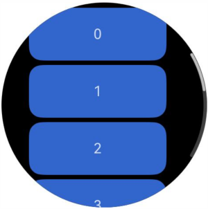

# ArcScrollBar

更新时间：2026-04-20 06:34:33

来源：https://developer.huawei.com/consumer/cn/doc/harmonyos-references/ts-basic-components-arcscrollbar
**支持设备：** Phone / PC/2in1 / Tablet / Wearable / TV

弧形滚动条组件ArcScrollBar，用于配合可滚动组件使用，如[ArcList](https://developer.huawei.com/consumer/cn/doc/harmonyos-references/ts-container-arclist)、[List](https://developer.huawei.com/consumer/cn/doc/harmonyos-references/ts-container-list)、[Grid](https://developer.huawei.com/consumer/cn/doc/harmonyos-references/ts-container-grid)、[Scroll](https://developer.huawei.com/consumer/cn/doc/harmonyos-references/ts-container-scroll)、[WaterFlow](https://developer.huawei.com/consumer/cn/doc/harmonyos-references/ts-container-waterflow)。


## 子组件
**支持设备：** Phone / PC/2in1 / Tablet / Wearable / TV

不包含子组件。


## 接口
**支持设备：** Phone / PC/2in1 / Tablet / Wearable / TV

ArcScrollBar(options: ArcScrollBarOptions)

ArcScrollBar的构造函数。

**元服务API：** 从API version 18开始，该接口支持在元服务中使用。

**系统能力：** SystemCapability.ArkUI.ArkUI.Circle

**参数：**


| 参数名 | 类型 | 必填 | 说明 |
| --- | --- | --- | --- |
| options | [ArcScrollBarOptions](#arcscrollbaroptions) | 是 | 滚动条组件参数。 |


## ArcScrollBarOptions
**支持设备：** Phone / PC/2in1 / Tablet / Wearable / TV

ArcScrollBar的构造函数参数。

**元服务API：** 从API version 18开始，该接口支持在元服务中使用。

**系统能力：** SystemCapability.ArkUI.ArkUI.Circle


| 名称 | 类型 | 只读 | 可选 | 说明 |
| --- | --- | --- | --- | --- |
| scroller | [Scroller](https://developer.huawei.com/consumer/cn/doc/harmonyos-references/ts-container-scroll#scroller) | 否 | 否 | 可滚动组件的控制器，用于与可滚动组件进行绑定。 |
| state | [BarState](https://developer.huawei.com/consumer/cn/doc/harmonyos-references/ts-appendix-enums#barstate) | 否 | 是 | 滚动条状态。 默认值：BarState.Auto |


> [!NOTE]
> ArcScrollBar与可滚动组件需通过scroller进行绑定后方能实现联动，且ArcScrollBar与可滚动组件仅限于一对一的绑定方式。


## 示例
**支持设备：** Phone / PC/2in1 / Tablet / Wearable / TV

该示例通过ArcScrollBar与[Scroll](https://developer.huawei.com/consumer/cn/doc/harmonyos-references/ts-container-scroll)组件联动，设置了弧形外置滚动条。


```ts
import { ArcScrollBar } from '@kit.ArkUI';

@Entry
@Component
struct ArcScrollBarExample {
  private scroller: Scroller = new Scroller();
  private arr: number[] = [0, 1, 2, 3, 4, 5, 6, 7, 8, 9];

  build() {
    Stack({ alignContent: Alignment.Center }) {
      Scroll(this.scroller) {
        Flex({ direction: FlexDirection.Column }) {
          ForEach(this.arr, (item: number) => {
            Row() {
              Text(item.toString())
              .width('80%')
              .height(60)
              .backgroundColor('#3366CC')
              .borderRadius(15)
              .fontSize(16)
              .textAlign(TextAlign.Center)
              .margin({ top: 5 })
            }
          }, (item: number) => item.toString())
      }.margin({ right: 15 })
      }
      .width('90%')
      .scrollBar(BarState.Off)

      ArcScrollBar({ scroller: this.scroller, state: BarState.Auto })
    }
    .width('100%')
    .height('100%')
  }
}
```


