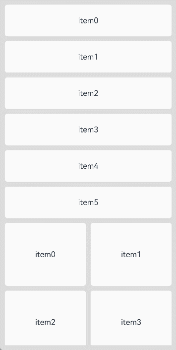

# LazyVGridLayout

更新时间：2026-07-03 02:18:23

来源：https://developer.huawei.com/consumer/cn/doc/harmonyos-references/ts-container-lazyvgridlayout
**支持设备：** Phone | PC/2in1 | Tablet | Wearable | TV

该组件用于实现支持懒加载的网格布局。
 
API版本26.0.0之前，其父组件支持[WaterFlow](https://developer.huawei.com/consumer/cn/doc/harmonyos-references/ts-container-waterflow)和[FlowItem](https://developer.huawei.com/consumer/cn/doc/harmonyos-references/ts-container-flowitem)组件，并支持使用自定义组件或[NodeContainer](https://developer.huawei.com/consumer/cn/doc/harmonyos-references/ts-basic-components-nodecontainer)组件封装后应用在WaterFlow或FlowItem中。
 
从API版本26.0.0开始，其父组件新增支持[List](https://developer.huawei.com/consumer/cn/doc/harmonyos-references/ts-container-list)、[Scroll](https://developer.huawei.com/consumer/cn/doc/harmonyos-references/ts-container-scroll)，同时新增支持使用自定义组件或[NodeContainer](https://developer.huawei.com/consumer/cn/doc/harmonyos-references/ts-basic-components-nodecontainer)组件封装后应用在List或Scroll中。
 
> [!NOTE]
> 该组件从API version 19开始支持。后续版本如有新增内容，则采用上角标单独标记该内容的起始版本。 本模块接口仅可在Stage模型下使用。 LazyVGridLayout组件高度默认自适应内容，不建议设置会固定或约束组件垂直方向尺寸的属性，设置后会导致显示异常或无法正常滚动。涉及的属性包括 height 、 size 中的height、 constraintSize 中的minHeight/maxHeight、 aspectRatio 、 layoutWeight ，以及 height 取 LayoutPolicy 值的场景。 当父组件设置主轴方向尺寸时，LazyVGridLayout按照父组件可视区域进行懒加载；当父组件未设置主轴方向尺寸时，LazyVGridLayout会被内容撑开，导致所有子组件都会被加载布局。 该组件在不同父组件下的懒加载支持条件如下： 在WaterFlow组件下，仅在WaterFlow组件的单列模式或分段布局中的单列分段，并且布局方向 FlexDirection 设置为FlexDirection.Column的情况下支持懒加载。在WaterFlow的多列模式或横向布局（FlexDirection.Row或FlexDirection.RowReverse）下使用该组件，则不支持懒加载。此外，在布局方向为FlexDirection.ColumnReverse的WaterFlow组件下使用该组件会导致显示异常。 在List组件下，要求List组件布局方向必须是竖直方向（即 listDirection 属性设置为Axis.Vertical）。在非竖直方向的List中使用该组件会导致应用崩溃。当List设置了 lanes 、 chainAnimation 、 scrollSnapAlign 属性中的任意一个或多个时，该组件的懒加载功能会失效。 在Scroll组件下，要求Scroll组件布局方向必须是竖直方向（即 scrollable 属性设置为ScrollDirection.Vertical）。在非竖直方向的Scroll中使用该组件会导致应用崩溃。 当懒加载功能生效时，该组件仅加载父组件显示区域内的子组件，并在帧间空闲时隙预加载显示区域上方和下方各半屏的内容。

  

#### 接口

**支持设备：** Phone | PC/2in1 | Tablet | Wearable | TV

LazyVGridLayout()
 
创建垂直方向懒加载网格布局容器。
 
**元服务API：** 从API version 19开始，该接口支持在元服务中使用。
 
**系统能力：** SystemCapability.ArkUI.ArkUI.Full
 
  

#### 属性

**支持设备：** Phone | PC/2in1 | Tablet | Wearable | TV

除支持[通用属性](https://developer.huawei.com/consumer/cn/doc/harmonyos-references/ts-component-general-attributes)外，还支持以下属性：
 
  

#### columnsTemplate

**支持设备：** Phone | PC/2in1 | Tablet | Wearable | TV

columnsTemplate(value: string)
 
设置当前网格布局列的数量、固定列宽或最小列宽值，不设置时默认1列。
 
例如，'1fr 1fr 2fr' 是将父组件分3列，将父组件允许的宽分为4等份，第一列占1份，第二列占1份，第三列占2份。
 
columnsTemplate('repeat(auto-fit, track-size)')是设置最小列宽值为track-size，自动计算列数和实际列宽。
 
columnsTemplate('repeat(auto-fill, track-size)')是设置固定列宽值为track-size，自动计算列数。
 
columnsTemplate('repeat(auto-stretch, track-size)')是设置固定列宽值为track-size，使用columnsGap为最小列间距，自动计算列数和实际列间距。
 
其中repeat、auto-fit、auto-fill、auto-stretch为关键字。
 
track-size为列宽，支持的单位包括px、vp、%或有效数字，默认单位为vp，track-size至少包含一个有效列宽。
 
auto-fit模式和auto-stretch模式只支持track-size为一个有效列宽值，并且auto-stretch模式中的track-size只支持px、vp和有效数字，不支持%。
 
auto-fill模式支持一个或多个有效列宽，如columnsTemplate('repeat(auto-fill, 20)')、columnsTemplate('repeat(auto-fill, 20 80px)')。
 
设置为'0fr'时，该列的列宽为0，不显示子组件。设置为其他非法值时，子组件显示为固定1列。
 
**元服务API：** 从API version 19开始，该接口支持在元服务中使用。
 
**系统能力：** SystemCapability.ArkUI.ArkUI.Full
 
**参数：**
  
| 参数名 | 类型 | 必填 | 说明 |
| --- | --- | --- | --- |
| value | string | 是 | 当前网格布局列的数量或最小列宽值。 |
 
 
  

#### columnsGap

**支持设备：** Phone | PC/2in1 | Tablet | Wearable | TV

columnsGap(value: LengthMetrics): T
 
设置列与列的间距。设置为小于0的值时，按默认值显示。
 
**元服务API：** 从API version 19开始，该接口支持在元服务中使用。
 
**系统能力：** SystemCapability.ArkUI.ArkUI.Full
 
**参数：**
  
| 参数名 | 类型 | 必填 | 说明 |
| --- | --- | --- | --- |
| value | LengthMetrics | 是 | 列与列的间距。 默认值：LengthMetrics.vp(0) |
 
 
**返回值：**
  
| 类型 | 说明 |
| --- | --- |
| T | 返回当前LazyVGridLayout组件。 |
 
 
  

#### rowsGap

**支持设备：** Phone | PC/2in1 | Tablet | Wearable | TV

rowsGap(value: LengthMetrics): T
 
设置行与行的间距。设置为小于0的值时，按默认值显示。
 
**元服务API：** 从API version 19开始，该接口支持在元服务中使用。
 
**系统能力：** SystemCapability.ArkUI.ArkUI.Full
 
**参数：**
  
| 参数名 | 类型 | 必填 | 说明 |
| --- | --- | --- | --- |
| value | LengthMetrics | 是 | 行与行的间距。 默认值：LengthMetrics.vp(0) |
 
 
**返回值：**
  
| 类型 | 说明 |
| --- | --- |
| T | 返回当前LazyVGridLayout组件。 |
 
 
  

#### 事件

**支持设备：** Phone | PC/2in1 | Tablet | Wearable | TV

除支持[通用事件](https://developer.huawei.com/consumer/cn/doc/harmonyos-references/ts-component-general-events)外，还支持以下事件：
 
  

#### onVisibleIndexesChange

**支持设备：** Phone | PC/2in1 | Tablet | Wearable | TV

onVisibleIndexesChange(callback: OnVisibleIndexesChangeCallback | undefined): T
 
设置onVisibleIndexesChange回调函数。当LazyVGridLayout可视区域内子组件的索引值发生变化时触发回调，返回可视区域内子组件的起始索引值和结束索引值。使用callback异步回调。
 
**起始版本：** 26.0.0
 
**元服务API：** 从API版本26.0.0开始，该接口支持在元服务中使用。
 
**模型约束：** 此接口仅可在Stage模型下使用。
 
**系统能力：** SystemCapability.ArkUI.ArkUI.Full
 
**参数：**
  
| 参数名 | 类型 | 必填 | 说明 |
| --- | --- | --- | --- |
| callback | OnVisibleIndexesChangeCallback \| undefined | 是 | onVisibleIndexesChange事件的回调函数。方法入参为undefined时，取消监听。 |
 
 
**返回值：**
  
| 类型 | 说明 |
| --- | --- |
| T | 返回当前组件。 |
 
 
  

#### 示例

**支持设备：** Phone | PC/2in1 | Tablet | Wearable | TV

该示例通过[WaterFlow](https://developer.huawei.com/consumer/cn/doc/harmonyos-references/ts-container-waterflow)和[LazyVGridLayout](https://developer.huawei.com/consumer/cn/doc/harmonyos-references/ts-container-lazyvgridlayout)实现懒加载网格布局，并通过[onVisibleIndexesChange](#onvisibleindexeschange)在显示区域发生变化时回调索引。
 
MyDataSource实现了[LazyForEach](https://developer.huawei.com/consumer/cn/doc/harmonyos-references/ts-rendering-control-lazyforeach)数据源接口[IDataSource](https://developer.huawei.com/consumer/cn/doc/harmonyos-references/ts-rendering-control-lazyforeach#idatasource)，用于通过LazyForEach给LazyVGridLayout提供子组件。
 
从API版本26.0.0开始，新增onVisibleIndexesChange事件。
 
```text
import { LengthMetrics } from '@kit.ArkUI'
import { MyDataSource } from './MyDataSource'

@Entry
@Component
struct LazyVGridLayoutSample1 {
  private arr1:MyDataSource<number> = new MyDataSource<number>();
  private arr2:MyDataSource<number> = new MyDataSource<number>();
  build() {
    Column() {
      WaterFlow() {
        // 第一个LazyVGridLayout：单列布局
        LazyVGridLayout() {
          LazyForEach(this.arr1, (item:number)=>{
            Text('item' + item.toString())
              .height(64)
              .width('100%')
              .borderRadius(5)
              .backgroundColor(Color.White)
              .textAlign(TextAlign.Center)
          })
        }
        .columnsTemplate('1fr') // 单列布局
        .rowsGap(LengthMetrics.vp(10)) // 行间距10vp
        // 从API版本26.0.0开始，新增onVisibleIndexesChange事件。
        .onVisibleIndexesChange((start: number, end: number) => {
          console.info('visible indexes: start= ' + 'start,' + 'end= ' + 'end');
      })

        // 第二个LazyVGridLayout：双列布局
        LazyVGridLayout() {
          LazyForEach(this.arr2, (item:number)=>{
            Text('item' + item.toString())
              .height(128)
              .width('100%')
              .borderRadius(5)
              .backgroundColor(Color.White)
              .textAlign(TextAlign.Center)
          })
        }
        .columnsTemplate('1fr 1fr') // 双列布局，两列等宽
        .rowsGap(LengthMetrics.vp(10)) // 行间距10vp
        .columnsGap(LengthMetrics.vp(10)) // 列间距10vp
      }.padding(10)
      .rowsGap(10)
    }
    .width('100%').height('100%')
    .backgroundColor('#DCDCDC')
  }

  // 初始化数据源
  aboutToAppear(): void {
    for (let i = 0; i < 6; i++) {
      this.arr1.pushData(i);
    }
    for (let i = 0; i < 100; i++) {
      this.arr2.pushData(i);
    }
  }
}
```
 
```ArkTS
// MyDataSource.ets
export class BasicDataSource<T> implements IDataSource {
  private listeners: DataChangeListener[] = [];
  protected dataArray: T[] = [];

  public totalCount(): number {
    return this.dataArray.length;
  }

  public getData(index: number): T {
    return this.dataArray[index];
  }

  registerDataChangeListener(listener: DataChangeListener): void {
    if (this.listeners.indexOf(listener) < 0) {
      console.info('add listener');
      this.listeners.push(listener);
    }
  }

  unregisterDataChangeListener(listener: DataChangeListener): void {
    const pos = this.listeners.indexOf(listener);
    if (pos >= 0) {
      console.info('remove listener');
      this.listeners.splice(pos, 1);
    }
  }

  notifyDataReload(): void {
    this.listeners.forEach(listener => {
      listener.onDataReloaded();
    })
  }

  notifyDataAdd(index: number): void {
    this.listeners.forEach(listener => {
      listener.onDataAdd(index);
    })
  }

  notifyDataChange(index: number): void {
    this.listeners.forEach(listener => {
      listener.onDataChange(index);
    })
  }

  notifyDataDelete(index: number): void {
    this.listeners.forEach(listener => {
      listener.onDataDelete(index);
    })
  }

  notifyDataMove(from: number, to: number): void {
    this.listeners.forEach(listener => {
      listener.onDataMove(from, to);
    })
  }

  notifyDatasetChange(operations: DataOperation[]): void {
    this.listeners.forEach(listener => {
      listener.onDatasetChange(operations);
    })
  }
}

export class MyDataSource<T> extends BasicDataSource<T> {
  public shiftData(): void {
    this.dataArray.shift();
    this.notifyDataDelete(0);
  }
  public unshiftData(data: T): void {
    this.dataArray.unshift(data);
    this.notifyDataAdd(0);
  }
  public pushData(data: T): void {
    this.dataArray.push(data);
    this.notifyDataAdd(this.dataArray.length - 1);
  }
  public popData(): void {
    this.dataArray.pop();
    this.notifyDataDelete(this.dataArray.length);
  }
  public clearData(): void {
    this.dataArray = [];
    this.notifyDataReload();
  }
}
```
 


