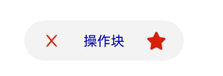

# Chip

更新时间：2026-07-28 11:23:46

来源：https://developer.huawei.com/consumer/cn/doc/harmonyos-references/ohos-arkui-advanced-chip
**支持设备：** Phone | PC/2in1 | Tablet | Wearable | TV

Chip组件用于标签展示和交互场景，支持自定义样式、图标、激活态等功能，适用于搜索框历史记录、邮件发送列表等场景，可快速实现标签的创建、删除和交互能力。

> [!NOTE]
> 该组件从API version 11开始支持。后续版本如有新增内容，则采用上角标单独标记该内容的起始版本。 本模块接口仅可在Stage模型下使用。


#### 导入模块

**支持设备：** Phone | PC/2in1 | Tablet | Wearable | TV

```text
import { Chip, ChipOptions, ChipSize } from '@kit.ArkUI';
```


#### 子组件

**支持设备：** Phone | PC/2in1 | Tablet | Wearable | TV

无


#### Chip

**支持设备：** Phone | PC/2in1 | Tablet | Wearable | TV

Chip(options:ChipOptions): void

创建Chip组件。

**装饰器类型：**@Builder

**元服务API：** 从API version 12开始，该接口支持在元服务中使用。

**系统能力：** SystemCapability.ArkUI.ArkUI.Full

**设备行为差异：** 该接口在Wearable设备上使用时，应用程序运行异常，异常信息中提示接口未定义，在其他设备中可正常调用。

**参数**：

| 参数名 | 类型 | 必填 | 说明 |
| --- | --- | --- | --- |
| options | ChipOptions | 是 | 定义Chip组件的参数，包括尺寸、启用状态、激活态、前缀/后缀图标、文本内容、背景颜色、圆角、无障碍属性等，用于自定义Chip组件的样式和行为。 |


#### ChipOptions

**支持设备：** Phone | PC/2in1 | Tablet | Wearable | TV

ChipOptions定义Chip的样式及具体样式参数。

**系统能力：** SystemCapability.ArkUI.ArkUI.Full

**设备行为差异：** 该接口在Wearable设备上使用时，应用程序运行异常，异常信息中提示接口未定义，在其他设备中可正常调用。

| 名称 | 类型 | 只读 | 可选 | 说明 |
| --- | --- | --- | --- | --- |
| size | ChipSize \| SizeOptions | 否 | 是 | Chip尺寸。 默认值：ChipSize.NORMAL 使用场景：ChipSize.NORMAL适用于常规场景；ChipSize.SMALL适用于紧凑布局场景，如标签列表、筛选栏等；自定义SizeOptions适用于需要特定尺寸的场景。 SizeOptions类型参数不支持百分比设置，异常值按默认值处理。 元服务API： 从API version 12开始，该接口支持在元服务中使用。 说明：适老化在size指定具体宽高时不生效，size设置为{ height: 0, width: 0 }除外。 |
| enabled | boolean | 否 | 是 | Chip是否可用。 默认值：true。 true：Chip可用；false：Chip不可用。 使用场景：设置为false禁用Chip，适用于权限受限、数据未加载完成、条件不满足等需要禁止用户操作的场景。 值为undefined时，按默认值处理。 元服务API： 从API version 12开始，该接口支持在元服务中使用。 |
| activated12+ | boolean | 否 | 是 | Chip是否为激活态。 默认值：false。 true：Chip为激活态；false：Chip为非激活态。 值为undefined时，按默认值处理。 使用场景：常用于标签选择场景表示当前选中项等。 元服务API： 从API version 12开始，该接口支持在元服务中使用。 |
| prefixIcon | PrefixIconOptions | 否 | 是 | 设置Chip组件的前缀图标，显示在组件左侧。 默认值：不显示前缀图标。 值为undefined时，按默认值处理。 prefixIcon和prefixSymbol同时设置时，显示prefixSymbol的效果，prefixIcon无效。 元服务API： 从API version 12开始，该接口支持在元服务中使用。 |
| prefixSymbol12+ | ChipSymbolGlyphOptions | 否 | 是 | 前缀图标属性，symbol类型。常用于需要系统标准图标、动态图标效果的场景。 默认值：不显示前缀图标。 值为undefined时，按默认值处理。 prefixIcon和prefixSymbol同时设置时，显示prefixSymbol的效果，prefixIcon无效。 元服务API： 从API version 12开始，该接口支持在元服务中使用。 |
| label | LabelOptions | 否 | 否 | 设置Chip组件显示的文本内容及样式。 元服务API： 从API version 12开始，该接口支持在元服务中使用。 |
| suffixIcon | SuffixIconOptions | 否 | 是 | 设置Chip组件的后缀图标，显示在组件右侧。 默认值：不显示后缀图标。 值为undefined时，按默认值处理。 suffixIcon和suffixSymbol同时设置时，显示suffixSymbol的效果，suffixIcon无效。 元服务API： 从API version 12开始，该接口支持在元服务中使用。 |
| suffixSymbol12+ | ChipSymbolGlyphOptions | 否 | 是 | 后缀图标属性，symbol类型。常用于需要系统标准图标、动态图标效果的场景。 默认值：不显示后缀图标。 值为undefined时，按默认值处理。 suffixIcon和suffixSymbol同时设置时，显示suffixSymbol的效果，suffixIcon无效。 元服务API： 从API version 12开始，该接口支持在元服务中使用。 |
| suffixSymbolOptions14+ | ChipSuffixSymbolGlyphOptions | 否 | 是 | symbol类型后缀图标的无障碍朗读功能属性及点击事件回调等。 默认值：不设置对应属性。 值为undefined时，按默认值处理。 元服务API： 从API version 14开始，该接口支持在元服务中使用。 |
| backgroundColor | ResourceColor | 否 | 是 | Chip背景颜色。 默认值：\$r('sys.color.ohos_id_color_button_normal')。 值为undefined时，按默认值处理。赋值为非法值时，背景颜色透明。 元服务API： 从API version 12开始，该接口支持在元服务中使用。 |
| activatedBackgroundColor12+ | ResourceColor | 否 | 是 | Chip激活态的背景颜色。 默认值：\$r('sys.color.ohos_id_color_emphasize')。 值为undefined时，按默认值处理。赋值为非法值时，背景颜色透明。 元服务API： 从API version 12开始，该接口支持在元服务中使用。 |
| backgroundSystemMaterial | uiMaterial.Material | 否 | 是 | 设置组件系统材质样式。不同材质具有不同的效果，能够影响组件的backgroundColor、border、shadow等视觉属性。 默认值：undefined 值为undefined时，不应用材质样式。 说明：当设置backgroundSystemMaterial时，应将backgroundColor设为Color.Transparent，否则会与系统材质冲突；当backgroundSystemMaterial为undefined时，backgroundColor属性生效。 起始版本： 26.0.0 模型约束： 此接口仅可在Stage模型下使用。 元服务API： 从API版本26.0.0开始，该接口支持在元服务中使用。 |
| activatedBackgroundSystemMaterial | uiMaterial.Material | 否 | 是 | 设置组件激活状态下的系统材质样式。不同材质具有不同的效果，能够影响组件的backgroundColor、border、shadow等视觉属性。 默认值：undefined 值为undefined时，不应用材质样式。 说明：当设置activatedBackgroundSystemMaterial时，应将activatedBackgroundColor设为Color.Transparent，否则会与系统材质冲突；当activatedBackgroundSystemMaterial为undefined时，activatedBackgroundColor属性生效。 起始版本： 26.0.0 模型约束： 此接口仅可在Stage模型下使用。 元服务API： 从API版本26.0.0开始，该接口支持在元服务中使用。 |
| borderRadius | Dimension | 否 | 是 | Chip背景圆角半径大小，不支持百分比，传入百分比时按默认值处理。 取值范围：[0, +∞) 默认值：\$r('sys.float.ohos_id_corner_radius_button')。 单位：vp 值为undefined时，按默认值处理。 元服务API： 从API version 12开始，该接口支持在元服务中使用。 |
| allowClose | boolean | 否 | 是 | 关闭图标是否显示。 默认值：true true：关闭图标显示；false：关闭图标不显示。 值为undefined时，按默认值处理。 说明：当suffixSymbol有传入参数时，allowClose不生效；当suffixSymbol没有传入参数而suffixIcon有传入参数时，allowClose不生效；当suffixSymbol和suffixIcon都没有传入参数时，allowClose决定是否显示关闭图标。 元服务API： 从API version 12开始，该接口支持在元服务中使用。 |
| onClose | ()=>void | 否 | 是 | 默认关闭图标点击事件。 值为undefined时，不触发关闭图标点击事件。 说明：仅当关闭图标显示时生效，即suffixSymbol和suffixIcon都未传入参数且allowClose为true时。 元服务API： 从API version 12开始，该接口支持在元服务中使用。 |
| onClicked12+ | Callback&lt;void&gt; | 否 | 是 | Chip组件点击事件。 值为undefined时，Chip不能被点击。 元服务API： 从API version 12开始，该接口支持在元服务中使用。 |
| direction12+ | Direction | 否 | 是 | 布局方向。 默认值：Direction.Auto。 值为undefined时，按默认值处理。 使用场景：常用于国际化场景，适配阿拉伯语等从右到左（RTL）阅读习惯的语言环境，实现界面镜像效果。 元服务API： 从API version 12开始，该接口支持在元服务中使用。 |
| closeOptions14+ | CloseOptions | 否 | 是 | 默认关闭图标的功能属性，包括无障碍朗读功能和字体大小等属性。仅在默认关闭图标显示时生效，即allowClose为true且suffixSymbol和suffixIcon均未设置传入参数时。 值为undefined时，按默认值处理。 元服务API： 从API version 14开始，该接口支持在元服务中使用。 |
| accessibilityDescription14+ | ResourceStr | 否 | 是 | Chip组件的无障碍描述。用于向用户详细解释当前组件，开发人员应提供详尽的文本说明，协助用户理解即将执行的操作及其结果。特别是当这些结果无法仅从组件属性和无障碍文本中直接获知时。如果组件同时具备文本属性和无障碍说明属性，当组件被选中时，系统将首先播报组件的文本属性，随后播报无障碍说明属性的内容。 默认值：空字符串。 值为undefined时，按默认值处理。 元服务API： 从API version 14开始，该接口支持在元服务中使用。 |
| accessibilityLevel14+ | string | 否 | 是 | Chip组件无障碍重要性。用于控制Chip组件是否可被无障碍辅助服务所识别。 支持的值为： "auto"：当前组件会转化为"yes"。 "yes"：当前组件可被无障碍辅助服务所识别。 "no"：当前组件不可被无障碍辅助服务所识别。 "no-hide-descendants"：当前组件及其所有子组件不可被无障碍辅助服务所识别。 默认值："auto"。 值为undefined时，按默认值处理。 元服务API： 从API version 14开始，该接口支持在元服务中使用。 |
| accessibilitySelectedType14+ | AccessibilitySelectedType | 否 | 是 | Chip组件选中态类型。 默认值：当设置了activated属性但未指定accessibilitySelectedType时，默认使用CHECKED类型。当未设置activated属性时，默认使用CLICKED类型。 值为undefined时，按默认值处理。 元服务API： 从API version 14开始，该接口支持在元服务中使用。 |
| maxFontScale23+ | number \| Resource | 否 | 是 | Chip组件文本与图标的最大的字体缩放倍数。 取值范围：[1, +∞) 设置的值小于1时，按值为1处理。异常值默认不生效。 默认值：1 值为undefined时，按默认值处理。 使用场景：适用于需要限制字体放大上限的无障碍场景，防止字体过大导致布局溢出。 元服务API： 从API version 23开始，该接口支持在元服务中使用。 |
| minFontScale23+ | number \| Resource | 否 | 是 | Chip组件文本与图标的最小的字体缩放倍数。 取值范围：[0, 1] 设置的值小于0时，按值为0处理。设置的值大于1时，按值为1处理。异常值默认不生效。 默认值：1 值为undefined时，按默认值处理。 使用场景：适用于需要限制字体缩小下限的场景，保证文本可读性。 元服务API： 从API version 23开始，该接口支持在元服务中使用。 |
| padding23+ | LocalizedPadding | 否 | 是 | Chip组件的内边距。 默认值： - size为ChipSize.SMALL并且activated为true时，默认值：{ start: LengthMetrics.resource('sys.float.chip_activated_small_text_padding'), end: LengthMetrics.resource('sys.float.chip_activated_small_text_padding'), top: LengthMetrics.vp(4), bottom: LengthMetrics.vp(4)} - size为ChipSize.SMALL并且activated为false时，默认值：{ start: LengthMetrics.resource('sys.float.chip_small_text_padding'), end: LengthMetrics.resource('sys.float.chip_small_text_padding'), top: LengthMetrics.vp(4), bottom: LengthMetrics.vp(4)} - size不为ChipSize.SMALL并且activated为true时，默认值：{ start: LengthMetrics.resource('sys.float.chip_activated_normal_text_padding'), end: LengthMetrics.resource('sys.float.chip_activated_normal_text_padding'), top: LengthMetrics.vp(4), bottom: LengthMetrics.vp(4)} - size不为ChipSize.SMALL并且activated为false时，默认值：{ start: LengthMetrics.resource('sys.float.chip_normal_text_padding'), end: LengthMetrics.resource('sys.float.chip_normal_text_padding'), top: LengthMetrics.vp(4), bottom: LengthMetrics.vp(4)} 值为undefined时，按默认值处理。 元服务API： 从API version 23开始，该接口支持在元服务中使用。 |
| fontSize23+ | Dimension | 否 | 是 | 统一设置Chip组件的文本与图标的字体大小，不支持百分比，传入百分比时按默认值处理。 该fontSize的优先级低于prefixSymbol、label、suffixSymbol和closeOptions中的fontSize属性。 默认值： - size为ChipSize.SMALL时，文本：\$r('sys.float.chip_small_font_size')；图标：\$r('sys.float.chip_small_icon_size') - 其他情况下，文本：\$r('sys.float.chip_normal_font_size')；图标：\$r('sys.float.chip_normal_icon_size') 单位：fp 值为undefined时，按默认值处理。 元服务API： 从API version 23开始，该接口支持在元服务中使用。 |


> [!NOTE]
> 当suffixSymbol有传入参数时，suffixIcon和allowClose不生效；当suffixSymbol没有传入参数而suffixIcon有传入参数时，allowClose不生效；当suffixSymbol和suffixIcon都没有传入参数时，allowClose决定是否显示关闭图标。 backgroundColor和activatedBackgroundColor赋值为undefined时，显示默认背景颜色；赋值为非法值时，背景颜色透明。 当prefixSymbol或suffixSymbol设置了图标时，若Chip为非激活状态，图标颜色fontColor为[\$r('sys.color.ohos_id_color_secondary')]，若Chip为激活状态，图标颜色fontColor为[\$r('sys.color.ohos_id_color_text_primary_contrary')]。此外，当size为ChipSize.SMALL时，图标的默认字体大小fontSize为\$r('sys.float.chip_small_icon_size')；当size为ChipSize.NORMAL或自定义大小时，图标的默认字体大小fontSize为\$r('sys.float.chip_normal_icon_size')。 当prefixIcon和suffixIcon设置了图标时，fillColor默认值均为：\$r('sys.color.chip_usually_icon_color')。fillColor对颜色的解析与Image组件保持一致。 当prefixIcon和suffixIcon设置了图标时，activatedFillColor默认值均为：\$r('sys.color.chip_active_icon_color')。activatedFillColor对颜色的解析与Image组件保持一致。 从API版本26.0.0开始，当配置backgroundSystemMaterial为自动反色材质时，prefixIcon和suffixIcon的填充色以及prefixSymbol和suffixSymbol在非激活状态下的文字颜色会使用支持反色的系统资源，这些颜色会根据背景材质自动匹配反色效果。当设置activatedBackgroundSystemMaterial为自动反色材质时，prefixIcon和suffixIcon的激活态填充色以及prefixSymbol和suffixSymbol在激活状态下的文字颜色同样采用支持反色的系统资源，实现与背景材质反色的自动适配。


#### ChipSize

**支持设备：** Phone | PC/2in1 | Tablet | Wearable | TV

ChipSize定义Chip组件可指定的尺寸类型，如普通型和小尺寸型。

**元服务API：** 从API version 12开始，该接口支持在元服务中使用。

**系统能力：** SystemCapability.ArkUI.ArkUI.Full

**设备行为差异：** 该接口在Wearable设备上使用时，应用程序运行异常，异常信息中提示接口未定义，在其他设备中可正常调用。

| 名称 | 值 | 说明 |
| --- | --- | --- |
| NORMAL | "NORMAL" | normal尺寸操作块，适用于常规展示场景。 |
| SMALL | "SMALL" | small尺寸操作块，适用于紧凑布局场景。 |


#### AccessibilitySelectedType14+

**支持设备：** Phone | PC/2in1 | Tablet | Wearable | TV

AccessibilitySelectedType定义Chip可指定的选中态类型，用于控制无障碍服务如何向用户传达组件的选中状态。不同的选中态类型提供了不同的语义和用户体验。

**元服务API：** 从API version 14开始，该接口支持在元服务中使用。

**系统能力：** SystemCapability.ArkUI.ArkUI.Full

**设备行为差异：** 该接口在Wearable设备上使用时，应用程序运行异常，异常信息中提示接口未定义，在其他设备中可正常调用。

| 名称 | 值 | 说明 |
| --- | --- | --- |
| CLICKED | 0 | 单击型。组件不向无障碍服务报告任何选中状态，仅作为可单击组件使用。适用于执行某个操作但不保持状态的场景，如普通按钮。 |
| CHECKED | 1 | 复选型。组件通过 accessibilityChecked 属性向无障碍服务报告选中状态。适用于多选场景，如标签筛选、属性选择等。 |
| SELECTED | 2 | 单选型。组件通过 accessibilitySelected 属性向无障碍服务报告选中状态。适用于表示当前选中项的场景，如导航栏标签、单选列表项等。 |


#### IconCommonOptions

**支持设备：** Phone | PC/2in1 | Tablet | Wearable | TV

IconCommonOptions定义图标的共通属性。

**元服务API：** 从API version 12开始，该接口支持在元服务中使用。

**系统能力：** SystemCapability.ArkUI.ArkUI.Full

**设备行为差异：** 该接口在Wearable设备上使用时，应用程序运行异常，异常信息中提示接口未定义，在其他设备中可正常调用。

| 名称 | 类型 | 只读 | 可选 | 说明 |
| --- | --- | --- | --- | --- |
| src | ResourceStr | 否 | 否 | 图标图片或图片地址引用。 |
| size | SizeOptions | 否 | 是 | 图标大小，不支持百分比，异常值按默认值处理。 默认值： - 当ChipOptions.size为ChipSize.SMALL时，默认值为：{width: \$r('sys.float.chip_small_icon_size'), height: \$r('sys.float.chip_small_icon_size')} - 当ChipOptions.size为ChipSize.NORMAL时，默认值为：{width: \$r('sys.float.chip_normal_icon_size'), height: \$r('sys.float.chip_normal_icon_size')} 单位：vp 值为undefined时，按默认值处理。 |
| fillColor | ResourceColor | 否 | 是 | 图标填充颜色。仅在图片格式为SVG时生效。 默认值：\$r('sys.color.chip_usually_icon_color') 值为undefined时，按默认值处理。 |
| activatedFillColor12+ | ResourceColor | 否 | 是 | Chip激活时的图标填充颜色。仅在图片格式为SVG时生效。 默认值：\$r('sys.color.chip_active_icon_color') 值为undefined时，按默认值处理。 |


> [!NOTE]
> 仅在图片格式为SVG时，fillColor和activatedFillColor属性才生效。


#### PrefixIconOptions

**支持设备：** Phone | PC/2in1 | Tablet | Wearable | TV

PrefixIconOptions定义前缀图标的属性。

继承于[IconCommonOptions](#iconcommonoptions)。

**元服务API：** 从API version 12开始，该接口支持在元服务中使用。

**系统能力：** SystemCapability.ArkUI.ArkUI.Full

**设备行为差异：** 该接口在Wearable设备上使用时，应用程序运行异常，异常信息中提示接口未定义，在其他设备中可正常调用。


#### SuffixIconOptions

**支持设备：** Phone | PC/2in1 | Tablet | Wearable | TV

SuffixIconOptions定义后缀图标的属性。

继承于[IconCommonOptions](#iconcommonoptions)。

**系统能力：** SystemCapability.ArkUI.ArkUI.Full

**设备行为差异：** 该接口在Wearable设备上使用时，应用程序运行异常，异常信息中提示接口未定义，在其他设备中可正常调用。

| 名称 | 类型 | 只读 | 可选 | 说明 |
| --- | --- | --- | --- | --- |
| action | () => void | 否 | 是 | 后缀图标点击事件回调。 值为undefined时，不设定后缀图标事件。 元服务API： 从API version 12开始，该接口支持在元服务中使用。 |
| accessibilityText14+ | ResourceStr | 否 | 是 | 后缀图标无障碍文本属性。当后缀图标不包含文本属性时，屏幕朗读选中后缀图标时不播报，使用者无法清楚地知道当前是否选中了后缀图标。开发人员可为此类图标设置无障碍文本，屏幕朗读选中时播报该文本内容。 默认值：‘ ’ 值为undefined时，按默认值处理。 元服务API： 从API version 14开始，该接口支持在元服务中使用。 |
| accessibilityDescription14+ | ResourceStr | 否 | 是 | 后缀图标的无障碍描述。此描述用于向用户详细解释后缀图标，开发人员应提供较为详尽的文本说明，以协助用户理解即将执行的操作及其可能产生的后果，特别是当这些后果无法仅从后缀图标的属性和无障碍文本中直接获知时。如果后缀图标同时具备文本属性和无障碍说明属性，当后缀图标被选中时，系统将首先播报后缀图标的文本属性，随后播报无障碍说明属性的内容。 默认值：‘ ’ 值为undefined时，按默认值处理。 元服务API： 从API version 14开始，该接口支持在元服务中使用。 |
| accessibilityLevel14+ | string | 否 | 是 | 后缀图标的无障碍重要性。用于控制后缀图标是否可被无障碍辅助服务识别。 支持的值为： "auto"：当前组件存在action时转化为"yes"，不存在action时，转化为"no"。 "yes"：当前组件可被无障碍辅助服务所识别。 "no"：当前组件不可被无障碍辅助服务所识别。 "no-hide-descendants"：当前组件及其所有子组件不可被无障碍辅助服务所识别。 默认值："auto"。 值为undefined时，按默认值处理。 元服务API： 从API version 14开始，该接口支持在元服务中使用。 |


#### AccessibilityOptions14+

**支持设备：** Phone | PC/2in1 | Tablet | Wearable | TV

后缀图标的无障碍朗读功能属性。

**元服务API：** 从API version 14开始，该接口支持在元服务中使用。

**系统能力：** SystemCapability.ArkUI.ArkUI.Full

**设备行为差异：** 该接口在Wearable设备上使用时，应用程序运行异常，异常信息中提示接口未定义，在其他设备中可正常调用。

| 名称 | 类型 | 只读 | 可选 | 说明 |
| --- | --- | --- | --- | --- |
| accessibilityText | ResourceStr | 否 | 是 | 无障碍文本属性。当组件无文本属性时，屏幕朗读选中此组件不会播报，导致使用者无法清楚了解当前选中的组件。开发人员可为此类组件设置无障碍文本，屏幕朗读时将播报该文本，帮助使用者明确选中了什么组件。 默认值：‘ ’ 值为undefined时，按默认值处理。 |
| accessibilityDescription | ResourceStr | 否 | 是 | 无障碍描述。此描述用于向用户详细解释当前组件，开发人员应提供详尽的文本说明，以协助用户理解即将执行的操作及其后果。特别是当这些后果无法仅从组件的属性和无障碍文本中直接获知时。如果组件同时具备文本属性和无障碍说明属性，当组件被选中时，系统将首先播报组件的文本属性，随后播报无障碍说明属性的内容。 默认值：‘ ’ 值为undefined时，按默认值处理。 |
| accessibilityLevel | string | 否 | 是 | 无障碍重要性。用于控制组件是否可被无障碍辅助服务识别。 支持的值为： "auto"：当前组件会转换为"yes"。 "yes"：当前组件可被无障碍辅助服务所识别。 "no"：当前组件不可被无障碍辅助服务所识别。 "no-hide-descendants"：当前组件及其所有子组件不可被无障碍辅助服务所识别。 默认值："auto"。 值为undefined时，按默认值处理。 |


#### ChipSuffixSymbolGlyphOptions14+

**支持设备：** Phone | PC/2in1 | Tablet | Wearable | TV

symbol类型后缀图标的无障碍朗读功能属性及点击事件回调。

**元服务API：** 从API version 14开始，该接口支持在元服务中使用。

**系统能力：** SystemCapability.ArkUI.ArkUI.Full

**设备行为差异：** 该接口在Wearable设备上使用时，应用程序运行异常，异常信息中提示接口未定义，在其他设备中可正常调用。

| 名称 | 类型 | 只读 | 可选 | 说明 |
| --- | --- | --- | --- | --- |
| action | VoidCallback | 否 | 是 | 后缀图标点击事件回调。 值为undefined时，不设定后缀图标事件。 默认值：undefined |
| normalAccessibility | AccessibilityOptions | 否 | 是 | 非激活态无障碍朗读功能属性。 默认值：undefined |
| activatedAccessibility | AccessibilityOptions | 否 | 是 | 激活态无障碍朗读功能属性。 默认值：undefined |


#### ChipSymbolGlyphOptions12+

**支持设备：** Phone | PC/2in1 | Tablet | Wearable | TV

ChipSymbolGlyphOptions定义前缀图标和后缀图标的属性。

**元服务API：** 从API version 12开始，该接口支持在元服务中使用。

**系统能力：** SystemCapability.ArkUI.ArkUI.Full

**设备行为差异：** 该接口在Wearable设备上使用时，应用程序运行异常，异常信息中提示接口未定义，在其他设备中可正常调用。

| 名称 | 类型 | 只读 | 可选 | 说明 |
| --- | --- | --- | --- | --- |
| normal | SymbolGlyphModifier | 否 | 是 | 设置Chip在非激活状态下显示的symbol类型图标。 默认值：不显示前缀图标或后缀图标 值为undefined时，按默认值处理。 |
| activated | SymbolGlyphModifier | 否 | 是 | 设置Chip在激活状态下显示的symbol类型图标。 默认值：不显示前缀图标或后缀图标 值为undefined时，按默认值处理。 |


> [!TIP]
> 不支持使用 SymbolEffect 修改动效类型及effectStrategy设置动效。


#### LabelOptions

**支持设备：** Phone | PC/2in1 | Tablet | Wearable | TV

LabelOptions定义文本属性。

**元服务API：** 从API version 12开始，该接口支持在元服务中使用。

**系统能力：** SystemCapability.ArkUI.ArkUI.Full

**设备行为差异：** 该接口在Wearable设备上使用时，应用程序运行异常，异常信息中提示接口未定义，在其他设备中可正常调用。

| 名称 | 类型 | 只读 | 可选 | 说明 |
| --- | --- | --- | --- | --- |
| text | string | 否 | 否 | Chip组件显示的文本内容。 |
| fontSize | Dimension | 否 | 是 | 字体大小，不支持百分比，传入百分比时按默认值处理。 传入负数时，按默认值处理。 默认值：\$r('sys.float.ohos_id_text_size_button2') 单位：fp 值为undefined时，按默认值处理。 |
| fontColor | ResourceColor | 否 | 是 | 文字颜色。 默认值：\$r('sys.color.ohos_id_color_text_primary') 值为undefined时，按默认值处理。 |
| activatedFontColor12+ | ResourceColor | 否 | 是 | Chip激活时的文字颜色。 默认值：\$r('sys.color.ohos_id_color_text_primary_contrary') 值为undefined时，按默认值处理。 |
| fontFamily | string | 否 | 是 | 设置Chip组件文本的字体样式。 默认值："HarmonyOS Sans" 值为undefined时，按默认值处理。 |
| labelMargin | LabelMarginOptions | 否 | 是 | 文本与左右侧图标之间间距。 默认值： size为ChipSize.SMALL时，{ left: 4, right: 4 } size为ChipSize.NORMAL时，{ left: 6, right: 6 } 单位：vp 值为undefined时，按默认值处理。 |
| localizedLabelMargin12+ | LocalizedLabelMarginOptions | 否 | 是 | 本地化文本与左右侧图标之间间距。 默认值： size为ChipSize.SMALL时， { start: LengthMetrics.resource(\$r('sys.float.chip_small_text_margin')), end: LengthMetrics.resource(\$r('sys.float.chip_small_text_margin')) } size为ChipSize.NORMAL时， { start: LengthMetrics.resource(\$r('sys.float.chip_normal_text_margin')), end: LengthMetrics.resource(\$r('sys.float.chip_normal_text_margin')) } 值为undefined时，按默认值处理。 |


> [!NOTE]
> 从API版本26.0.0开始，backgroundSystemMaterial设置自动反色的系统材质时，fontColor使用支持反色的特殊系统资源，文字颜色自动适配到材质背景色的反色；activatedBackgroundSystemMaterial设置自动反色的系统材质时，activatedFontColor使用支持反色的特殊系统资源，Chip激活时的文字颜色自动适配到材质背景色的反色。


#### CloseOptions14+

**支持设备：** Phone | PC/2in1 | Tablet | Wearable | TV

CloseOptions用于定义Chip组件默认的关闭图标功能属性，包括无障碍功能属性，其中accessibilityText默认为"删除"。

继承于[AccessibilityOptions](#accessibilityoptions14)。

**系统能力：** SystemCapability.ArkUI.ArkUI.Full

**设备行为差异：** 该接口在Wearable设备上使用时，应用程序运行异常，异常信息中提示接口未定义，在其他设备中可正常调用。

| 名称 | 类型 | 只读 | 可选 | 说明 |
| --- | --- | --- | --- | --- |
| fontSize23+ | Dimension | 否 | 是 | 设置Chip组件默认关闭图标的字体大小，不支持百分比，传入百分比时按默认值处理。 默认值： size为ChipSize.SMALL时，\$r('sys.float.chip_small_font_size') 其他情况：\$r('sys.float.chip_normal_font_size') 单位：fp 传入负数时，按默认值处理。值为undefined时，按默认值处理。 模型约束： 此接口仅可在Stage模型下使用。 元服务API： 从API version 23开始，该接口支持在元服务中使用。 |


#### LabelMarginOptions

**支持设备：** Phone | PC/2in1 | Tablet | Wearable | TV

LabelMarginOptions用于定义文本与左右侧图标之间间距。

**元服务API：** 从API version 12开始，该接口支持在元服务中使用。

**系统能力：** SystemCapability.ArkUI.ArkUI.Full

**设备行为差异：** 该接口在Wearable设备上使用时，应用程序运行异常，异常信息中提示接口未定义，在其他设备中可正常调用。

| 名称 | 类型 | 只读 | 可选 | 说明 |
| --- | --- | --- | --- | --- |
| left | Dimension | 否 | 是 | 文本与左侧图标的间距，不支持百分比。 默认值： size为ChipSize.SMALL时，left默认值：4 size为ChipSize.NORMAL时，left默认值：6 单位：vp 超出取值范围按默认值处理。 取值范围：[0, +∞) |
| right | Dimension | 否 | 是 | 文本与右侧图标之间间距，不支持百分比。 默认值： size为ChipSize.SMALL时，right默认值：4 size为ChipSize.NORMAL时，right默认值：6 单位：vp 超出取值范围按默认值处理。 取值范围：[0, +∞) |


#### LocalizedLabelMarginOptions12+

**支持设备：** Phone | PC/2in1 | Tablet | Wearable | TV

LocalizedLabelMarginOptions用于定义本地化文本与左右侧图标之间间距。

**元服务API：** 从API version 12开始，该接口支持在元服务中使用。

**系统能力：** SystemCapability.ArkUI.ArkUI.Full

**设备行为差异：** 该接口在Wearable设备上使用时，应用程序运行异常，异常信息中提示接口未定义，在其他设备中可正常调用。

| 名称 | 类型 | 只读 | 可选 | 说明 |
| --- | --- | --- | --- | --- |
| start | LengthMetrics | 否 | 是 | 文本与起始侧图标的间距，不支持百分比。 默认值： size为ChipSize.SMALL时，start默认值： LengthMetrics.resource(\$r('sys.float.chip_small_text_margin')) size为ChipSize.NORMAL时，start默认值： LengthMetrics.resource(\$r('sys.float.chip_normal_text_margin')) 值为undefined时，按默认值处理。 |
| end | LengthMetrics | 否 | 是 | 文本与结束侧图标之间间距，不支持百分比。 默认值： size为ChipSize.SMALL时，end默认值： LengthMetrics.resource(\$r('sys.float.chip_small_text_margin')) size为ChipSize.NORMAL时，end默认值： LengthMetrics.resource(\$r('sys.float.chip_normal_text_margin')) 值为undefined时，按默认值处理。 |


#### 示例

**支持设备：** Phone | PC/2in1 | Tablet | Wearable | TV


#### 示例1（自定义后缀图标）

通过配置suffixIcon实现自定义操作块的后缀图标。

```text
import { Chip, ChipSize, LengthMetrics } from '@kit.ArkUI';

@Entry
@Component
struct Index {
  build() {
    Column({ space: 10 }) {
      Chip({
        // 设置前缀图标属性。
        prefixIcon: {
          // 'app.media.chips'仅作示例，请替换为实际使用图片。
          src: $r('app.media.chips'),
          size: { width: 16, height: 16 },
          fillColor: Color.Red
        },
        // 设置文本属性。
        label: {
          text: '操作块',
          fontSize: 12,
          fontColor: Color.Blue,
          fontFamily: 'HarmonyOS Sans',
          labelMargin: { left: 20, right: 30 }
        },
        // 设置后缀图标属性。
        suffixIcon: {
          // 'app.media.close'仅作示例，请替换为实际使用图片。
          src: $r('app.media.close'),
          size: { width: 16, height: 16 },
          fillColor: Color.Red
        },
        size: ChipSize.NORMAL,
        allowClose: false,
        enabled: true,
        backgroundColor: $r('sys.color.ohos_id_color_button_normal'),
        borderRadius: $r('sys.float.ohos_id_corner_radius_button'),
        minFontScale: 0.2,
        maxFontScale: 2,
        padding: {
          start: LengthMetrics.vp(20),
          end: LengthMetrics.vp(20)
        },
        fontSize: 12
      })
    }
  }
}
```





#### 示例2（设置默认后缀图标）

配置allowClose为true，显示关闭图标。

```text
import { Chip, ChipSize, LengthMetrics } from '@kit.ArkUI';

@Entry
@Component
struct Index {
  build() {
    Column({ space: 10 }) {
      Chip({
        // 设置前缀图标属性。
        prefixIcon: {
          // 'app.media.chips'仅作示例，请替换为实际使用图片。
          src: $r('app.media.chips'),
          size: { width: 16, height: 16 },
          fillColor: Color.Blue
        },
        // 设置文本属性。
        label: {
          text: '操作块',
          fontSize: 12,
          fontColor: Color.Blue,
          fontFamily: 'HarmonyOS Sans',
          labelMargin: { left: 20, right: 30 }
        },
        size: ChipSize.NORMAL,
        allowClose: true,
        closeOptions: {fontSize: 12},
        enabled: true,
        backgroundColor: $r('sys.color.ohos_id_color_button_normal'),
        borderRadius: $r('sys.float.ohos_id_corner_radius_button'),
        minFontScale: 0.2,
        maxFontScale: 2,
        padding: {
          start: LengthMetrics.vp(20),
          end: LengthMetrics.vp(20)
        },
        fontSize: 12
      })
    }
  }
}
```


#### 示例3（不显示后缀图标）

配置allowClose为false，隐藏关闭图标。

```text
import { Chip, ChipSize, LengthMetrics } from '@kit.ArkUI';

@Entry
@Component
struct Index {
  build() {
    Column({ space: 10 }) {
      Chip({
        // 设置前缀图标属性。
        prefixIcon: {
          // 'app.media.chips'仅作示例，请替换为实际使用图片。
          src: $r('app.media.chips'),
          size: { width: 16, height: 16 },
          fillColor: Color.Blue
        },
        // 设置文本属性。
        label: {
          text: '操作块',
          fontSize: 12,
          fontColor: Color.Blue,
          fontFamily: 'HarmonyOS Sans',
          labelMargin: { left: 20, right: 30 }
        },
        size: ChipSize.SMALL,
        allowClose: false,
        enabled: true,
        backgroundColor: $r('sys.color.ohos_id_color_button_normal'),
        borderRadius: $r('sys.float.ohos_id_corner_radius_button'),
        minFontScale: 0.2,
        maxFontScale: 2,
        padding: {
          start: LengthMetrics.vp(20),
          end: LengthMetrics.vp(20)
        },
        fontSize: 12
      })
    }
  }
}
```


#### 示例4（激活态操作块）

该示例通过配置activated实现激活态操作块。

```text
import { Chip, ChipSize } from '@kit.ArkUI';

@Entry
@Component
struct Index {
  @State isActivated: boolean = false;

  build() {
    Column({ space: 10 }) {
      Chip({
        // 设置前缀图标属性。
        prefixIcon: {
          // 'app.media.chips'仅作示例，请替换为实际使用图片。
          src: $r('app.media.chips'),
          size: { width: 16, height: 16 },
          fillColor: Color.Blue,
          activatedFillColor: $r('sys.color.ohos_id_color_text_primary_contrary')
        },
        // 设置文本属性。
        label: {
          text: '操作块',
          fontSize: 12,
          fontColor: Color.Blue,
          activatedFontColor: $r('sys.color.ohos_id_color_text_primary_contrary'),
          fontFamily: 'HarmonyOS Sans',
          labelMargin: { left: 20, right: 30 }
        },
        size: ChipSize.NORMAL,
        allowClose: true,
        enabled: true,
        activated: this.isActivated,
        backgroundColor: $r('sys.color.ohos_id_color_button_normal'),
        activatedBackgroundColor: $r('sys.color.ohos_id_color_emphasize'),
        borderRadius: $r('sys.float.ohos_id_corner_radius_button'),
        onClose: () => {
          console.info('chip on close');
        },
        onClicked: () => {
          console.info('chip on clicked');
        }
      })
      // 点击“改变激活状态”，用于控制操作块的激活与关闭。
      Button('改变激活状态')
        .onClick(() => {
          this.isActivated = !this.isActivated;
        })
    }
  }
}
```


#### 示例5（设置symbol类型图标）

Chip组件的前缀图标使用symbol类型资源展示。

```text
import { Chip, ChipSize, SymbolGlyphModifier } from '@kit.ArkUI';

@Entry
@Component
struct Index {
  @State isActivated: boolean = false;

  build() {
    Column({ space: 10 }) {
      Chip({
        // 设置前缀图标属性，symbol类型。
        prefixSymbol: {
          normal: new SymbolGlyphModifier($r('sys.symbol.ohos_star')).fontSize(16).fontColor([Color.Green]),
          activated: new SymbolGlyphModifier($r('sys.symbol.ohos_star')).fontSize(16).fontColor([Color.Red]),
        },
        // 设置文本属性。
        label: {
          text: '操作块',
          fontSize: 12,
          fontColor: Color.Blue,
          activatedFontColor: $r('sys.color.ohos_id_color_text_primary_contrary'),
          fontFamily: 'HarmonyOS Sans',
          labelMargin: { left: 20, right: 30 },
        },
        size: ChipSize.NORMAL,
        allowClose: true,
        enabled: true,
        activated: this.isActivated,
        backgroundColor: $r('sys.color.ohos_id_color_button_normal'),
        activatedBackgroundColor: $r('sys.color.ohos_id_color_emphasize'),
        borderRadius: $r('sys.float.ohos_id_corner_radius_button'),
        onClose: () => {
          console.info('chip on close');
        },
        onClicked: () => {
          console.info('chip on clicked');
        }
      })

      Button('改变激活状态')
        .onClick(() => {
          this.isActivated = !this.isActivated;
        })
    }
  }
}
```


#### 示例6（设置镜像效果）

配置direction实现Chip布局镜像化展示。

```text
import { Chip, ChipSize, LengthMetrics } from '@kit.ArkUI';

@Entry
@Component
struct ChipPage {
  build() {
    Column() {
      Chip({
        direction: Direction.Rtl,
        // 设置前缀图标属性。
        prefixIcon: {
          // 'app.media.chips'仅作示例，请替换为实际使用图片。
          src: $r('app.media.chips'),
          size: { width: 16, height: 16 },
          fillColor: Color.Red,
        },
        // 设置文本属性。
        label: {
          text: '操作块',
          fontSize: 12,
          fontColor: Color.Blue,
          fontFamily: 'HarmonyOS Sans',
          localizedLabelMargin: { start: LengthMetrics.vp(20), end: LengthMetrics.vp(20) },
        },
        // 设置后缀图标属性。
        suffixIcon: {
          // 'app.media.close'仅作示例，请替换为实际使用图片。
          src: $r('app.media.close'),
          size: { width: 16, height: 16 },
          fillColor: Color.Red,
        },
        size: ChipSize.NORMAL,
        allowClose: false,
        enabled: true,
        backgroundColor: $r('sys.color.ohos_id_color_button_normal'),
        borderRadius: $r('sys.float.ohos_id_corner_radius_button')
      })
    }
    .justifyContent(FlexAlign.Center)
    .width('100%')
    .height('100%')
  }
}
```


#### 示例7（Image类型无障碍朗读）

该示例代码实现Chip组件Image类型后缀图标的无障碍朗读功能，点击后缀图标播报“图标，按钮，新手提醒”。

```text
import { Chip } from '@kit.ArkUI';

@Builder
function defaultFunction(): void {
}

@Component
struct SectionGroup {
  @Prop
  @Require
  title: ResourceStr;
  @BuilderParam
  @Require
  content: () => void = defaultFunction;

  build() {
    Column({ space: 4 }) {
      Text(this.title)
        .fontColor('#FF666666')
        .fontSize(12)
      Column({ space: 8 }) {
        this.content()
      }
    }
    .alignItems(HorizontalAlign.Start)
    .width('100%')
  }
}

@Component
struct SectionItem {
  @Prop
  @Require
  title: ResourceStr;
  @BuilderParam
  @Require
  content: () => void = defaultFunction;

  build() {
    Column({ space: 12 }) {
      Text(this.title)
      this.content()
    }
    .backgroundColor('#FFFFFFFF')
    .borderRadius(12)
    .padding(12)
    .width('100%')
  }
}

@Entry
@Component
struct ChipExample2 {

  build() {
    NavDestination() {
      Scroll() {
        SectionGroup({ title: '后缀图标播报' }) {
          SectionItem({ title: '自定义播报' }) {
            Chip({
              label: { text: '操作块' },
              suffixIcon: {
                src: $r('sys.media.ohos_ic_public_cut'),
                accessibilityText: '图标', // 播报“图标，按钮，新手提醒”
                accessibilityDescription: '新手提醒',
                action: () => {
                  this.getUIContext().getPromptAction().showToast({
                    message: '后缀图标被点击！'
                  });
                }
              },
              onClicked: () => {
                this.getUIContext().getPromptAction().showToast({
                  message: '操作块被点击！'
                });
              }
            })
          }
        }
      }
    }
  }
}
```


#### 示例8（symbol类型无障碍朗读）

该示例代码实现Chip组件symbol类型后缀图标的无障碍朗读功能，点击后缀图标播报“音乐，按钮，新手提醒”。

```text
import { Chip, SymbolGlyphModifier } from '@kit.ArkUI';

@Builder
function defaultFunction(): void {
}

@Component
struct SectionGroup {
  @Prop
  @Require
  title: ResourceStr;
  @BuilderParam
  @Require
  content: () => void = defaultFunction;

  build() {
    Column({ space: 4 }) {
      Text(this.title)
        .fontColor('#FF666666')
        .fontSize(12)
      Column({ space: 8 }) {
        this.content()
      }
    }
    .alignItems(HorizontalAlign.Start)
    .width('100%')
  }
}

@Component
struct SectionItem {
  @Prop
  @Require
  title: ResourceStr;
  @BuilderParam
  @Require
  content: () => void = defaultFunction;

  build() {
    Column({ space: 12 }) {
      Text(this.title)
      this.content()
    }
    .backgroundColor('#FFFFFFFF')
    .borderRadius(12)
    .padding(12)
    .width('100%')
  }
}

@Entry
@Component
struct ChipExample2 {

  build() {
    NavDestination() {
      Scroll() {
        SectionGroup({ title: '后缀Symbol播报' }) {
          SectionItem({ title: 'activatedAccessibility' }) {
            Chip({
              label: { text: '操作块' },
              activated: true,
              suffixSymbol: {
                activated: new SymbolGlyphModifier($r('sys.symbol.media_sound'))
                  .fontSize(72),
              },
              suffixSymbolOptions: {
                activatedAccessibility: {
                  accessibilityText: '音乐', // 播报“音乐，按钮，新手提醒”
                  accessibilityDescription: '新手提醒'
                },
                action: () => {
                  this.getUIContext().getPromptAction().showToast({
                    message: '后缀Symbol被点击！'
                  });
                }
              },
              onClicked: () => {
                this.getUIContext().getPromptAction().showToast({
                  message: '操作块被点击！'
                });
              }
            })
          }

          SectionItem({ title: 'normalAccessibility' }) {
            Chip({
              label: { text: '操作块' },
              suffixSymbol: {
                normal: new SymbolGlyphModifier($r('sys.symbol.media_sound'))
                  .fontSize(72),
              },
              suffixSymbolOptions: {
                normalAccessibility: {
                  accessibilityText: '音乐', // 播报“音乐，按钮，新手提醒”
                  accessibilityDescription: '新手提醒'
                },
                action: () => {
                  this.getUIContext().getPromptAction().showToast({
                    message: '后缀Symbol被点击！'
                  });
                }
              },
              onClicked: () => {
                this.getUIContext().getPromptAction().showToast({
                  message: '操作块被点击！'
                });
              }
            })
          }
        }
      }
    }
    .padding({
      top: 8,
      bottom: 8,
      left: 16,
      right: 16,
    })
  }
}
```


#### 示例9（Chip组件无障碍朗读）

示例展示Chip组件的无障碍属性设置，包括不同的accessibilitySelectedType类型和各种无障碍属性。

```text
import { AccessibilitySelectedType, Chip, ChipSize } from '@kit.ArkUI';

@Entry
@Component
struct ChipAccessibilityExample {
  @State clickedChipActivated: boolean = false;
  @State checkedChipActivated: boolean = false;
  @State selectedChipActivated: boolean = false;

  build() {
    Column({ space: 20 }) {
      Text('Chip组件无障碍属性示例').fontSize(20).fontWeight(FontWeight.Bold)

      // 点击型Chip - CLICKED类型
      Chip({
        label: { text: '点击型Chip' },
        prefixIcon: {
          src: $r('sys.media.ohos_app_icon'),
          fillColor: Color.Blue
        },
        size: ChipSize.NORMAL,
        accessibilitySelectedType: AccessibilitySelectedType.CLICKED, // 点击型
        accessibilityDescription: '这是一个点击型Chip', // 整体无障碍描述
        accessibilityLevel: 'yes', // 确保可被无障碍服务识别
        closeOptions: {
          accessibilityDescription: '删除此Chip，此操作无法撤销' // 为删除按钮提供详细说明
        },
        activated: this.clickedChipActivated,
        onClicked: () => {
          this.clickedChipActivated = !this.clickedChipActivated;
          this.getUIContext().getPromptAction().showToast({ message: '点击型Chip被点击' });
        },
        onClose: () => {
          this.getUIContext().getPromptAction().showToast({ message: '点击型Chip的关闭按钮被点击' });
        }
      })

      // 复选型Chip - CHECKED类型
      Chip({
        label: { text: '复选型Chip' },
        prefixIcon: {
          src: $r('sys.media.ohos_app_icon'),
          fillColor: Color.Green
        },
        size: ChipSize.NORMAL,
        accessibilitySelectedType: AccessibilitySelectedType.CHECKED, // 复选型
        accessibilityDescription: '这是一个复选型Chip', // 整体无障碍描述
        activated: this.checkedChipActivated,
        onClicked: () => {
          this.checkedChipActivated = !this.checkedChipActivated;
          this.getUIContext().getPromptAction().showToast({
            message: this.checkedChipActivated ? '复选型Chip被选中' : '复选型Chip被取消选中'
          });
        }
      })

      // 单选型Chip - SELECTED类型
      Chip({
        label: { text: '单选型Chip' },
        prefixIcon: {
          src: $r('sys.media.ohos_app_icon'),
          fillColor: Color.Red
        },
        size: ChipSize.NORMAL,
        accessibilitySelectedType: AccessibilitySelectedType.SELECTED, // 单选型
        accessibilityDescription: '这是一个单选型Chip', // 整体无障碍描述
        activated: this.selectedChipActivated,
        onClicked: () => {
          this.selectedChipActivated = !this.selectedChipActivated;
          this.getUIContext().getPromptAction().showToast({
            message: this.selectedChipActivated ? '单选型Chip被选中' : '单选型Chip被取消选中'
          });
        }
      })

      // 无障碍级别设置示例
      Chip({
        label: { text: '无障碍级别为no' },
        size: ChipSize.NORMAL,
        accessibilityLevel: 'no', // 此Chip不能被无障碍服务识别
        closeOptions: {
          accessibilityLevel: 'no'
        },
        backgroundColor: '#CCCCCC',
        onClicked: () => {
          this.getUIContext().getPromptAction().showToast({ message: '此Chip无法被无障碍服务识别' });
        }
      })
    }
    .width('100%')
    .padding(16)
  }
}
```


#### 示例10（设置系统材质样式）

该示例通过配置backgroundSystemMaterial和activatedBackgroundSystemMaterial实现系统材质样式，启用自动反色功能适配标签文本颜色。

从API版本26.0.0开始，[ChipOptions](#chipoptions)新增backgroundSystemMaterial和activatedBackgroundSystemMaterial属性。

```text
import { Chip, ChipOptions, uiMaterial } from '@kit.ArkUI';

@Entry
@Component
struct ChipMaterialExample {
  private chipOptions: ChipOptions = {
    label: {
      text: '操作块',
      // 将fontColor设置为特殊系统资源值，启用自动反色能力。
      fontColor: $r('sys.color.font_primary'),
      activatedFontColor: $r('sys.color.font_primary')
    },
    allowClose: false,
    // 设置普通状态下的背景颜色为透明，否则会和系统材质冲突。
    backgroundColor: Color.Transparent,
    // 设置普通状态下的系统材质样式为ULTRA_THIN，并开启自动反色。
    backgroundSystemMaterial: new uiMaterial.ImmersiveMaterial({
      style: uiMaterial.ImmersiveStyle.ULTRA_THIN,
      colorInvert: true
    }),
    // 设置激活状态下的背景颜色为透明，否则会和系统材质冲突。
    activatedBackgroundColor: Color.Transparent,
    // 设置激活状态下的系统材质样式。
    activatedBackgroundSystemMaterial: new uiMaterial.ImmersiveMaterial({
      style: uiMaterial.ImmersiveStyle.ULTRA_THIN
    })
  }

  build() {
    Column({ space: 50 }) {
      Chip(this.chipOptions)
      Chip(this.chipOptions)
    }
    .linearGradient({
      angle: 0, // 渐变角度，0度是从左到右。
      colors: [
        ['#FF9A9E', 0.0], // 起始颜色及位置（0.0表示起点）。
        ['#FECFEF', 0.5], // 中间颜色及位置。
        ['#3B324C', 1.0] // 结束颜色及位置（1.0表示终点）。
      ]
    })
    .padding(12)
    .width('100%')
    .height(150)
  }
}
```


