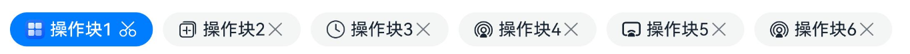

# ChipGroup

更新时间：2026-04-20 06:34:33

来源：https://developer.huawei.com/consumer/cn/doc/harmonyos-references/ohos-arkui-advanced-chipgroup
**支持设备：** Phone / PC/2in1 / Tablet / Wearable / TV

ChipGroup组件提供操作块群组，用于文件或资源内容的分类等场景。


> [!NOTE]
> 该组件从API version 12开始支持。后续版本如有新增内容，则采用上角标单独标记该内容的起始版本。


## 导入模块
**支持设备：** Phone / PC/2in1 / Tablet / Wearable / TV


```ts
import { ChipSize, ChipGroup } from '@kit.ArkUI';
```


## 子组件
**支持设备：** Phone / PC/2in1 / Tablet / Wearable / TV

无


## ChipGroup
**支持设备：** Phone / PC/2in1 / Tablet / Wearable / TV


```ts
ChipGroup({
  items: ChipGroupItemOptions[],
  itemStyle?: ChipItemStyle,
  selectedIndexes?: Array<number>,
  multiple?: boolean,
  chipGroupSpace?: ChipGroupSpaceOptions,
  chipGroupPadding?: ChipGroupPaddingOptions,
  onChange?: Callback<Array<number>>,
  suffix?: Callback<void>
})
```

**装饰器类型：**@Component

**元服务API：** 从API version 12开始，该接口支持在元服务中使用。

**系统能力：** SystemCapability.ArkUI.ArkUI.Full

**设备行为差异：** 该接口在Wearable设备上使用时，应用程序运行异常，异常信息中提示接口未定义，在其他设备中可正常调用。


| 名称 | 类型 | 必填 | 装饰器类型 | 说明 |
| --- | --- | --- | --- | --- |
| items | [ChipGroupItemOptions[]](#chipgroupitemoptions) | 是 | @Require  @Prop | 每个Chip的特定属性，参考[ChipGroupItemOptions[]](#chipgroupitemoptions)类型。 若为undefined时，ChipGroup默认为空。 |
| itemStyle | [ChipItemStyle](#chipitemstyle) | 否 | @Prop | Chip的style属性，如颜色，大小等，参考[ChipItemStyle](#chipitemstyle)类型。 默认值： { size: ChipSize.NORMAL, backgroundColor: \$r('sys.color.ohos_id_color_button_normal'), fontColor: \$r('sys.color.ohos_id_color_text_primary'), selectedFontColor: \$r('sys.color.ohos_id_color_text_primary_contrary'), selectedBackgroundColor: \$r('sys.color.ohos_id_color_emphasize') } 值为undefined时，按默认值处理。 |
| selectedIndexes | Array&lt;number&gt; | 否 | @Prop | 被选中Chip的索引。 默认值：[0] 值为undefined时，按默认值处理。 |
| multiple | boolean | 否 | @Prop | 是否选中多个Chip。 true：支持多个Chip选中；false：仅支持单个Chip选中。 默认值：false 值为undefined时，按默认值处理。 |
| chipGroupSpace | [ChipGroupSpaceOptions](#chipgroupspaceoptions) | 否 | @Prop | 左右内边距及Chip之间间距。参考[ChipGroupSpaceOptions](#chipgroupspaceoptions)类型。 默认值：{ itemSpace: 8, startSpace: 16, endSpace: 16 } 单位：vp 值为undefined时，按默认值处理。 |
| chipGroupPadding | [ChipGroupPaddingOptions](#chipgrouppaddingoptions) | 否 | @Prop | 设置ChipGroup的上下内边距，以控制整体高度。类型为[ChipGroupPaddingOptions](#chipgrouppaddingoptions)。 默认值：{ top: 14, bottom: 14 } 单位：vp 值为undefined时，按默认值处理。 |
| onChange | Callback&lt;Array&lt;number&gt;&gt; | 否 | - | Chip状态改变时的回调方法。 若为undefined，表示解绑事件。 |
| suffix | Callback&lt;void&gt; | 否 | @BuilderParam | 支持开发者自定义builder，如需在组件最右侧显示自定义内容可配置suffix属性，使用属性suffix需引用[IconGroupSuffix](#icongroupsuffix)接口。 默认不传入时，没有suffix。 值为undefined时，没有suffix。 |


## ChipGroupItemOptions
**支持设备：** Phone / PC/2in1 / Tablet / Wearable / TV

ChipGroupItemOptions定义每个Chip的非通用属性。

**系统能力：** SystemCapability.ArkUI.ArkUI.Full

**设备行为差异：** 该接口在Wearable设备上使用时，应用程序运行异常，异常信息中提示接口未定义，在其他设备中可正常调用。


| 名称 | 类型 | 只读 | 可选 | 说明 |
| --- | --- | --- | --- | --- |
| prefixIcon | [IconOptions](#iconoptions) | 否 | 是 | 前缀Image图标属性。 默认值：没有前缀Image图标。 值为undefined时，按默认值处理。 元服务API： 从API version 12开始，该接口支持在元服务中使用。 |
| prefixSymbol | [ChipSymbolGlyphOptions](https://developer.huawei.com/consumer/cn/doc/harmonyos-references/ohos-arkui-advanced-chip#chipsymbolglyphoptions12) | 否 | 是 | 前缀SymbolGlyph图标属性。 默认值：没有前缀SymbolGlyph图标。 值为undefined时，按默认值处理。  元服务API： 从API version 12开始，该接口支持在元服务中使用。 |
| label | [LabelOptions](#labeloptions) | 否 | 否 | 文本属性。  元服务API： 从API version 12开始，该接口支持在元服务中使用。 |
| suffixIcon(deprecated) | [IconOptions](#iconoptions) | 否 | 是 | 后缀Image图标属性。 默认值：不显示后缀Image图标。 值为undefined时，按默认值处理。 元服务API： 从API version 12开始，该接口支持在元服务中使用。  说明： 从API version 12开始支持，从API version 14开始废弃，建议使用suffixImageIcon替代。 |
| suffixSymbol | [ChipSymbolGlyphOptions](https://developer.huawei.com/consumer/cn/doc/harmonyos-references/ohos-arkui-advanced-chip#chipsymbolglyphoptions12) | 否 | 是 | 后缀SymbolGlyph图标属性。 默认值：不显示后缀SymbolGlyph图标。 值为undefined时，按默认值处理。  元服务API： 从API version 12开始，该接口支持在元服务中使用。 |
| allowClose | boolean | 否 | 是 | 删除图标是否显示。 false表示删除图标不显示，true表示删除图标显示。 默认值：false 值为undefined时，按默认值处理。 元服务API： 从API version 12开始，该接口支持在元服务中使用。 |
| suffixImageIcon14+ | [SuffixImageIconOptions](#suffiximageiconoptions14) | 否 | 是 | 后缀Image图标属性。 默认值：不显示后缀Image图标。 值为undefined时，按默认值处理。  元服务API： 从API version 14开始，该接口支持在元服务中使用。 |
| suffixSymbolOptions14+ | [ChipSuffixSymbolGlyphOptions](https://developer.huawei.com/consumer/cn/doc/harmonyos-references/ohos-arkui-advanced-chip#chipsuffixsymbolglyphoptions14) | 否 | 是 | 后缀Symbol图标属性。 默认值：后缀Symbol图标无功能。 值为undefined时，按默认值处理。 元服务API： 从API version 14开始，该接口支持在元服务中使用。 |
| closeOptions14+ | [CloseOptions](https://developer.huawei.com/consumer/cn/doc/harmonyos-references/ohos-arkui-advanced-chip#closeoptions14) | 否 | 是 | 默认删除图标的无障碍朗读功能属性。  值为undefined时，按默认值处理。  元服务API： 从API version 14开始，该接口支持在元服务中使用。 |
| accessibilityDescription14+ | [ResourceStr](https://developer.huawei.com/consumer/cn/doc/harmonyos-references/ts-types#resourcestr) | 否 | 是 | ChipGroup中Chip项的无障碍描述。此描述用于向用户详细解释ChipGroup中Chip项，开发人员应为ChipGroup中Chip项的这一属性提供较为详尽的文本说明，以协助用户理解即将执行的操作及其可能产生的结果。特别是当这些结果无法仅从ChipGroup中Chip项的属性和无障碍文本中直接获知时。如果ChipGroup中Chip项同时具备文本属性和无障碍说明属性，当ChipGroup中Chip项被选中时，系统将首先播报ChipGroup中Chip项的文本属性，随后播报无障碍说明属性的内容。 默认值：空字符串。 值为undefined时，按默认值处理。  元服务API： 从API version 14开始，该接口支持在元服务中使用。 |
| accessibilityLevel14+ | string | 否 | 是 | ChipGroup中Chip项无障碍重要性。用于控制ChipGroup中Chip项是否可被无障碍辅助服务所识别。 支持的值为: "auto"：ChipGroup中Chip项会转换为“yes”。 "yes"：ChipGroup中Chip项可被无障碍辅助服务所识别。 "no"：ChipGroup中Chip项不可被无障碍辅助服务所识别。 "no-hide-descendants"：ChipGroup中Chip项及其所有子组件不可被无障碍辅助服务所识别。 默认值："auto" 值为undefined时，按默认值处理。  元服务API： 从API version 14开始，该接口支持在元服务中使用。 |


> [!NOTE]
> 当传入suffixIcon参数时，allowClose不生效；未传入suffixIcon参数时，allowClose决定是否显示移除图标。


## ChipItemStyle
**支持设备：** Phone / PC/2in1 / Tablet / Wearable / TV

ChipItemStyle定义了Chip的共通属性。

**元服务API：** 从API version 12开始，该接口支持在元服务中使用。

**系统能力：** SystemCapability.ArkUI.ArkUI.Full

**设备行为差异：** 该接口在Wearable设备上使用时，应用程序运行异常，异常信息中提示接口未定义，在其他设备中可正常调用。


| 名称 | 类型 | 只读 | 可选 | 说明 |
| --- | --- | --- | --- | --- |
| size | [ChipSize](https://developer.huawei.com/consumer/cn/doc/harmonyos-references/ohos-arkui-advanced-chip#chipsize) \| [SizeOptions](https://developer.huawei.com/consumer/cn/doc/harmonyos-references/ts-types#sizeoptions) | 否 | 是 | Chip尺寸，使用时需要从Chip组件引入ChipSize类型。 默认值：ChipSize.NORMAL或{ height: 0, width: 0 }  为undefined时，使用默认值。 |
| backgroundColor | [ResourceColor](https://developer.huawei.com/consumer/cn/doc/harmonyos-references/ts-types#resourcecolor) | 否 | 是 | Chip背景颜色。 默认值：\$r('sys.color.ohos_id_color_button_normal') 为undefined时，backgroundColor走默认值。 |
| fontColor | [ResourceColor](https://developer.huawei.com/consumer/cn/doc/harmonyos-references/ts-types#resourcecolor) | 否 | 是 | Chip文字颜色。 默认值：\$r('sys.color.ohos_id_color_text_primary') 为undefined时，fontColor走默认值。 |
| selectedFontColor | [ResourceColor](https://developer.huawei.com/consumer/cn/doc/harmonyos-references/ts-types#resourcecolor) | 否 | 是 | Chip激活时的文字颜色。 默认值：\$r('sys.color.ohos_id_color_text_primary_contrary') 为undefined时，selectedFontColor走默认值。 |
| selectedBackgroundColor | [ResourceColor](https://developer.huawei.com/consumer/cn/doc/harmonyos-references/ts-types#resourcecolor) | 否 | 是 | Chip激活时的背景颜色。 默认值：\$r('sys.color.ohos_id_color_emphasize') 为undefined时，selectedBackgroundColor走默认值。 |


## ChipGroupSpaceOptions
**支持设备：** Phone / PC/2in1 / Tablet / Wearable / TV

ChipGroupSpaceOptions 定义了ChipGroup左右内边距，以及Chip与Chip之间的间距。

**元服务API：** 从API version 12开始，该接口支持在元服务中使用。

**系统能力：** SystemCapability.ArkUI.ArkUI.Full


| 名称 | 类型 | 只读 | 可选 | 说明 |
| --- | --- | --- | --- | --- |
| itemSpace | string \| number | 否 | 是 | Chip与Chip之间的间距（不支持百分比）。 取值范围： number类型: ≥ 0 的数值（如：0、8、16、24.5）。 string类型: 单位为fp\|vp\|px\|lpx且数值部分 ≥ 0 的字符串（如："8vp"、"16fp"、"12px"、"10lpx"）。 不支持: 负数、百分比单位、无效字符串格式。  默认值：8 单位：vp 为undefined时，itemSpace采取默认值。 |
| startSpace | [Length](https://developer.huawei.com/consumer/cn/doc/harmonyos-references/ts-types#length) | 否 | 是 | 左侧内边距（不支持百分比）。 默认值：16 单位：vp 为undefined时，startSpace取默认值。 |
| endSpace | [Length](https://developer.huawei.com/consumer/cn/doc/harmonyos-references/ts-types#length) | 否 | 是 | 右侧内边距（不支持百分比）。 默认值：16 单位：vp 如果为undefined，则使用默认值。 |


## ChipGroupPaddingOptions
**支持设备：** Phone / PC/2in1 / Tablet / Wearable / TV

ChipGroupPaddingOptions定义了ChipGroup的上下内边距，用于控制其整体高度。

**元服务API：** 从API version 12开始，该接口支持在元服务中使用。

**系统能力：** SystemCapability.ArkUI.ArkUI.Full

**设备行为差异：** 该接口在Wearable设备上使用时，应用程序运行异常，异常信息中提示接口未定义，在其他设备中可正常调用。


| 名称 | 类型 | 只读 | 可选 | 说明 |
| --- | --- | --- | --- | --- |
| top | [Length](https://developer.huawei.com/consumer/cn/doc/harmonyos-references/ts-types#length) | 否 | 否 | ChipGroup的上方内边距（不支持百分比）。 默认值：14  单位：vp  为undefined时，top取默认值。 |
| bottom | [Length](https://developer.huawei.com/consumer/cn/doc/harmonyos-references/ts-types#length) | 否 | 否 | ChipGroup的下方内边距（不支持百分比）。 默认值：14  单位：vp 为undefined时，bottom取默认值。 |


## SuffixImageIconOptions14+
**支持设备：** Phone / PC/2in1 / Tablet / Wearable / TV

后缀图标选项的类型。

继承自[IconOptions](#iconoptions)。

**元服务API：** 从API version 14开始，该接口支持在元服务中使用。

**系统能力：** SystemCapability.ArkUI.ArkUI.Full

**设备行为差异：** 该接口在Wearable设备上使用时，应用程序运行异常，异常信息中提示接口未定义，在其他设备中可正常调用。


| 名称 | 类型 | 只读 | 可选 | 说明 |
| --- | --- | --- | --- | --- |
| action | [VoidCallback](https://developer.huawei.com/consumer/cn/doc/harmonyos-references/ts-types#voidcallback12) | 否 | 是 | 后缀图标响应事件。 值为undefined时，无后缀图标响应事件。 |
| accessibilityText | [ResourceStr](https://developer.huawei.com/consumer/cn/doc/harmonyos-references/ts-types#resourcestr) | 否 | 是 | 后缀图标的无障碍文本属性。用于为用户进一步说明后缀图标，开发人员可为后缀图标的该属性设置相对较详细的解释文本，帮助用户理解将要执行的操作。如帮助用户理解将要执行的操作可能导致什么后果，尤其是当这些后果无法从后缀图标本身属性与无障碍文本中了解到时。若后缀图标既拥有文本属性又拥有无障碍说明属性，则后缀图标被选中时，先播报后缀图标的文本属性，再播报无障碍说明属性的内容。 默认值：空字符串。 值为undefined时，按默认值处理。 |
| accessibilityDescription | [ResourceStr](https://developer.huawei.com/consumer/cn/doc/harmonyos-references/ts-types#resourcestr) | 否 | 是 | 后缀图标的无障碍描述。此描述用于向用户详细解释后缀图标，开发人员应为后缀图标的这一属性提供较为详尽的文本说明，以协助用户理解即将执行的操作及其可能产生的后果。特别是当这些后果无法仅从后缀图标的属性和无障碍文本中直接获知时。如果后缀图标同时具备文本属性和无障碍说明属性，当后缀图标被选中时，系统将首先播报后缀图标的文本属性，随后播报无障碍说明属性的内容。 默认值：空字符串。 值为undefined时，按默认值处理。 |
| accessibilityLevel | string | 否 | 是 | 后缀图标无障碍重要性。用于控制后缀图标是否可被无障碍辅助服务所识别。 支持的值为: "auto"：后缀图标存在action时转化为“yes”，不存在action时，转化为“no”。 "yes"：后缀图标可被无障碍辅助服务所识别。 "no"：后缀图标不可被无障碍辅助服务所识别。 "no-hide-descendants"：后缀图标及其所有子组件不可被无障碍辅助服务所识别。 默认值："auto" 值为undefined时，按默认值处理。 |


## SymbolItemOptions14+
**支持设备：** Phone / PC/2in1 / Tablet / Wearable / TV

ChipGroup的尾部图标选项类型。

**元服务API：** 从API version 14开始，该接口支持在元服务中使用。

**系统能力：** SystemCapability.ArkUI.ArkUI.Full

**设备行为差异：** 该接口在Wearable设备上使用时，应用程序运行异常，异常信息中提示接口未定义，在其他设备中可正常调用。


| 名称 | 类型 | 只读 | 可选 | 说明 |
| --- | --- | --- | --- | --- |
| symbol | [SymbolGlyphModifier](https://developer.huawei.com/consumer/cn/doc/harmonyos-references/universal-attributes-attribute-symbolglyphmodifier#symbolglyphmodifier) | 否 | 否 | 尾部图标的SymbolGlyphModifier配置对象，用于设置图标的显示样式、渲染模式等。 |
| action | [VoidCallback](https://developer.huawei.com/consumer/cn/doc/harmonyos-references/ts-types#voidcallback12) | 否 | 否 | 尾部图标响应事件。 |
| accessibilityText | [ResourceStr](https://developer.huawei.com/consumer/cn/doc/harmonyos-references/ts-types#resourcestr) | 否 | 是 | 尾部图标的无障碍文本属性。用于为用户进一步说明尾部图标，开发人员可为尾部图标的该属性设置相对较详细的解释文本，帮助用户理解将要执行的操作。如帮助用户理解将要执行的操作可能导致什么后果，尤其是当这些后果无法从尾部图标本身属性与无障碍文本中了解到时。若尾部图标既拥有文本属性又拥有无障碍说明属性，则尾部图标被选中时，先播报尾部图标的文本属性，再播报无障碍说明属性的内容。 默认值：空字符串。 值为undefined时，按默认值处理。 |
| accessibilityDescription | [ResourceStr](https://developer.huawei.com/consumer/cn/doc/harmonyos-references/ts-types#resourcestr) | 否 | 是 | 尾部图标的无障碍描述。此描述用于向用户详细解释尾部图标，开发人员应为尾部图标的这一属性提供较为详尽的文本说明，以协助用户理解即将执行的操作及其可能产生的后果。特别是当这些后果无法仅从尾部图标的属性和无障碍文本中直接获知时。如果尾部图标同时具备文本属性和无障碍说明属性，当尾部图标被选中时，系统将首先播报尾部图标的文本属性，随后播报无障碍说明属性的内容。 默认值：空字符串。 值为undefined时，按默认值处理。 |
| accessibilityLevel | string | 否 | 是 | 尾部图标无障碍重要性。用于控制尾部图标是否可被无障碍辅助服务所识别。 支持的值为: "auto"：尾部图标转化为“yes”。 "yes"：尾部图标可被无障碍辅助服务所识别。 "no"：尾部图标不可被无障碍辅助服务所识别。 "no-hide-descendants"：尾部图标及其所有子组件不可被无障碍辅助服务所识别。 默认值："auto"。 值为undefined时，按默认值处理。 |


## IconGroupSuffix
**支持设备：** Phone / PC/2in1 / Tablet / Wearable / TV


```ts
IconGroupSuffix({
  items: Array<IconItemOptions | SymbolGlyphModifier | SymbolItemOptions>,
});
```

**装饰器类型：**@Component

**元服务API：** 从API version 12开始，该接口支持在元服务中使用。

**系统能力：** SystemCapability.ArkUI.ArkUI.Full

**设备行为差异：** 该接口在Wearable设备上使用时，应用程序运行异常，异常信息中提示接口未定义，在其他设备中可正常调用。


| 名称 | 类型 | 必填 | 装饰器类型 | 说明 |
| --- | --- | --- | --- | --- |
| items | Array&lt;[IconItemOptions](#iconitemoptions) \| [SymbolGlyphModifier](https://developer.huawei.com/consumer/cn/doc/harmonyos-references/universal-attributes-attribute-symbolglyphmodifier#symbolglyphmodifier) \| [SymbolItemOptions](#symbolitemoptions14)&gt; | 是 | @Require  @Prop | 尾部区域显示的自定义项数组，支持IconItemOptions（Image图标）、SymbolGlyphModifier（Symbol图标）或SymbolItemOptions（Symbol图标配置）类型。 |


> [!NOTE]
> 传参SymbolGlyphModifier时，不支持使用symbolEffect修改动效类型和[effectStrategy](https://developer.huawei.com/consumer/cn/doc/harmonyos-references/ts-basic-components-symbolglyph#effectstrategy)设置动效。


## IconItemOptions
**支持设备：** Phone / PC/2in1 / Tablet / Wearable / TV

定义了尾部builder接口，针对背板大小及颜色设置限制。

**系统能力：** SystemCapability.ArkUI.ArkUI.Full

**设备行为差异：** 该接口在Wearable设备上使用时，应用程序运行异常，异常信息中提示接口未定义，在其他设备中可正常调用。


| 名称 | 类型 | 只读 | 可选 | 说明 |
| --- | --- | --- | --- | --- |
| icon | [IconOptions](#iconoptions) | 否 | 否 | 自定义Builder icon。 Chip大小是ChipSize.SMALL时，suffix默认值：{width: 16,height: 16}。 Chip大小是ChipSize.NORMAL时，suffix默认值：{width: 24,height: 24}。  如果想动态修改size，那么必须在引入[IconGroupSuffix](#icongroupsuffix)时，使用[SymbolGlyphModifier](https://developer.huawei.com/consumer/cn/doc/harmonyos-references/universal-attributes-attribute-symbolglyphmodifier#symbolglyphmodifier)类型。 值为undefined时，按默认值处理。  元服务API： 从API version 12开始，该接口支持在元服务中使用。 |
| action | Callback&lt;void&gt; | 否 | 否 | 自定义Builder items 的Callback 为undefined时，表示解绑事件。  元服务API： 从API version 12开始，该接口支持在元服务中使用。 |
| accessibilityText14+ | [ResourceStr](https://developer.huawei.com/consumer/cn/doc/harmonyos-references/ts-types#resourcestr) | 否 | 是 | 尾部图标无障碍文本属性。用于为用户进一步说明尾部图标，开发人员可为尾部图标的该属性设置相对较详细的解释文本，帮助用户理解将要执行的操作。如帮助用户理解将要执行的操作可能导致什么后果，尤其是当这些后果无法从尾部图标本身属性与无障碍文本中了解到时。若尾部图标既拥有文本属性又拥有无障碍说明属性，则尾部图标被选中时，先播报尾部图标的文本属性，再播报无障碍说明属性的内容。 默认值：空字符串。 值为undefined时，按默认值处理。 元服务API： 从API version 14开始，该接口支持在元服务中使用。 |
| accessibilityDescription14+ | [ResourceStr](https://developer.huawei.com/consumer/cn/doc/harmonyos-references/ts-types#resourcestr) | 否 | 是 | 尾部图标无障碍描述。此描述用于向用户详细解释尾部图标，开发人员应为尾部图标的这一属性提供较为详尽的文本说明，以协助用户理解即将执行的操作及其可能产生的后果。特别是当这些后果无法仅从尾部图标的属性和无障碍文本中直接获知时。如果尾部图标同时具备文本属性和无障碍说明属性，当尾部图标被选中时，系统将首先播报尾部图标的文本属性，随后播报无障碍说明属性的内容。 默认值：空字符串。 值为undefined时，按默认值处理。 元服务API： 从API version 14开始，该接口支持在元服务中使用。 |
| accessibilityLevel14+ | string | 否 | 是 | 尾部图标无障碍重要性。用于控制尾部图标是否可被无障碍辅助服务所识别。 支持的值为: "auto"：尾部图标转化为“yes”。 "yes"：尾部图标可被无障碍辅助服务所识别。 "no"：尾部图标不可被无障碍辅助服务所识别。 "no-hide-descendants"：尾部图标及其所有子组件不可被无障碍辅助服务所识别。 默认值："auto" 值为undefined时，按默认值处理。 元服务API： 从API version 14开始，该接口支持在元服务中使用。 |


## IconOptions
**支持设备：** Phone / PC/2in1 / Tablet / Wearable / TV

IconOptions定义图标的共通属性。

**元服务API：** 从API version 12开始，该接口支持在元服务中使用。

**系统能力：** SystemCapability.ArkUI.ArkUI.Full

**设备行为差异：** 该接口在Wearable设备上使用时，应用程序运行异常，异常信息中提示接口未定义，在其他设备中可正常调用。


| 名称 | 类型 | 只读 | 可选 | 说明 |
| --- | --- | --- | --- | --- |
| src | [ResourceStr](https://developer.huawei.com/consumer/cn/doc/harmonyos-references/ts-types#resourcestr) | 否 | 否 | 图标图片或图片地址引用请参考[Image](https://developer.huawei.com/consumer/cn/doc/harmonyos-references/ts-basic-components-image#image-1)。 |
| size | [SizeOptions](https://developer.huawei.com/consumer/cn/doc/harmonyos-references/ts-types#sizeoptions) | 否 | 是 | 图标大小，不支持百分比。 默认值：undefined |


## LabelOptions
**支持设备：** Phone / PC/2in1 / Tablet / Wearable / TV

Label定义图标属性。

**元服务API：** 从API version 12开始，该接口支持在元服务中使用。

**系统能力：** SystemCapability.ArkUI.ArkUI.Full

**设备行为差异：** 该接口在Wearable设备上使用时，应用程序运行异常，异常信息中提示接口未定义，在其他设备中可正常调用。


| 名称 | 类型 | 只读 | 可选 | 说明 |
| --- | --- | --- | --- | --- |
| text | string | 否 | 否 | 文本属性 |


## 示例
**支持设备：** Phone / PC/2in1 / Tablet / Wearable / TV


### 示例1（无最右侧的builder）

该示例实现了在没有最右侧builder时的效果。


```ts
import { ChipSize, ChipGroup } from '@kit.ArkUI';

@Entry
@Preview
@Component
struct Index {
  @State selected_index: Array<number> = [0, 1, 2, 3, 4, 5, 6];

  build() {
    Column() {
      ChipGroup({
        // items内每个对象设置的都是每个Chip的特定属性。
        items: [
        {
          // $r('app.media.icon')需要替换为开发者所需的图像资源文件。
          prefixIcon: { src: $r('app.media.icon') },
          label: { text: '操作块1' },
          suffixIcon: { src: $r('sys.media.ohos_ic_public_cut') },
          allowClose: false
        },
        {
          prefixIcon: { src: $r('sys.media.ohos_ic_public_copy') },
          label: { text: '操作块2' },
          allowClose: true
        },
        {
          prefixIcon: { src: $r('sys.media.ohos_ic_public_clock') },
          label: { text: '操作块3' },
          allowClose: true
        },
        {
          prefixIcon: { src: $r('sys.media.ohos_ic_public_cast_stream') },
          label: { text: '操作块4' },
          allowClose: true
        },
        {
          prefixIcon: { src: $r('sys.media.ohos_ic_public_cast_mirror') },
          label: { text: '操作块5' },
          allowClose: true
        },
        {
          prefixIcon: { src: $r('sys.media.ohos_ic_public_cast_stream') },
          label: { text: '操作块6' },
          allowClose: true
        },
        ],
        // 设置Chip的style属性。
        itemStyle: {
          size: ChipSize.SMALL,
          backgroundColor: $r('sys.color.ohos_id_color_button_normal'),
          fontColor: $r('sys.color.ohos_id_color_text_primary'),
          selectedBackgroundColor: $r('sys.color.ohos_id_color_emphasize'),
          selectedFontColor: $r('sys.color.ohos_id_color_text_primary_contrary'),
        },
        selectedIndexes: this.selected_index,
        multiple: false,
        chipGroupSpace: { itemSpace: 8, endSpace: 0 },
        chipGroupPadding: { top: 10, bottom: 10 },
        onChange: (activatedChipsIndex: Array<number>) => {
          console.info('chips on clicked, activated index ' + activatedChipsIndex);
        },
      })
    }
  }
}
```




### 示例2（有最右侧的builder）

通过配置suffix实现最右侧的自定义组件效果。


```ts
import { ChipSize, ChipGroup, IconGroupSuffix } from '@kit.ArkUI';

@Entry
@Preview
@Component
struct Index {
  @State selected_index: Array<number> = [0, 1, 2, 3, 4, 5, 6];
  @State selected_state: boolean = true;

  @LocalBuilder
  ChipGroupSuffix(): void {
    // 开发者通过引用IconGroupSuffix，实现组件最右侧的自定义组件效果。
    IconGroupSuffix({
      items: [{
        icon: { src: $r('sys.media.ohos_ic_public_search_filled'), size: { width: 36, height: 36 } },
        action: () => {
          if (this.selected_state == false) {
            this.selected_index = [0, 1, 2, 3, 4, 5, 6];
            this.selected_state = true;
          } else {
            this.selected_index = [];
            this.selected_state = false;
          }
        }
      }
      ]
    })
  }

  build() {
    Column() {
      ChipGroup({
        // items内每个对象设置的都是每个Chip的特定属性。
        items: [
        {
          // $r('app.media.icon')需要替换为开发者所需的图像资源文件。
          prefixIcon: { src: $r('app.media.icon') },
          label: { text: '操作块1' },
          suffixIcon: { src: $r('sys.media.ohos_ic_public_cut') },
          allowClose: false
        },
        {
          prefixIcon: { src: $r('sys.media.ohos_ic_public_copy') },
          label: { text: '操作块2' },
          allowClose: true
        },
        {
          prefixIcon: { src: $r('sys.media.ohos_ic_public_clock') },
          label: { text: '操作块3' },
          allowClose: true
        },
        {
          prefixIcon: { src: $r('sys.media.ohos_ic_public_cast_stream') },
          label: { text: '操作块4' },
          allowClose: true
        },
        {
          prefixIcon: { src: $r('sys.media.ohos_ic_public_cast_mirror') },
          label: { text: '操作块5' },
          allowClose: true
        },
        {
          prefixIcon: { src: $r('sys.media.ohos_ic_public_cast_stream') },
          label: { text: '操作块6' },
          allowClose: true
        },
        ],
        // 设置Chip的style属性。
        itemStyle: {
          size: ChipSize.NORMAL,
          backgroundColor: $r('sys.color.ohos_id_color_button_normal'),
          fontColor: $r('sys.color.ohos_id_color_text_primary'),
          selectedBackgroundColor: $r('sys.color.ohos_id_color_emphasize'),
          selectedFontColor: $r('sys.color.ohos_id_color_text_primary_contrary'),
        },
        selectedIndexes: this.selected_index,
        multiple: true,
        chipGroupSpace: { itemSpace: 8, endSpace: 0 },
        chipGroupPadding: { top: 10, bottom: 10 },
        onChange: (activatedChipsIndex: Array<number>) => {
          console.info('chips on clicked, activated index ' + activatedChipsIndex);
        },
        // 自定义builder，在组件最右侧显示自定义的内容。
        suffix: this.ChipGroupSuffix
      })
    }
  }
}
```


### 示例3（设置Symbol类型图标）

该示例实现了IconGroupSuffix和ChipGroup传入SymbolGlyph资源。


```ts
import { ChipSize, ChipGroup, IconGroupSuffix, SymbolGlyphModifier } from '@kit.ArkUI';

@Entry
@Preview
@Component
struct Index {
  @State selected_index: Array<number> = [0, 1, 2, 3, 4, 5, 6];
  @State selected_state: boolean = true;
  @State prefixModifierNormal: SymbolGlyphModifier = new SymbolGlyphModifier($r('sys.symbol.ohos_star'));
  @State prefixModifierActivated: SymbolGlyphModifier =
  new SymbolGlyphModifier($r('sys.symbol.ohos_star')).fontColor([Color.Red]);
  @State suffixModifierNormal: SymbolGlyphModifier = new SymbolGlyphModifier($r('sys.symbol.ohos_wifi'));
  @State suffixModifierActivated: SymbolGlyphModifier =
  new SymbolGlyphModifier($r('sys.symbol.ohos_wifi')).fontColor([Color.Red]);

  @LocalBuilder
  ChipGroupSuffix(): void {
    // 开发者通过引用IconGroupSuffix，实现组件最右侧的自定义组件效果。
    IconGroupSuffix({
      items: [
      new SymbolGlyphModifier($r('sys.symbol.magnifyingglass'))
      .onClick(() => {
        if (this.selected_state == false) {
          this.selected_index = [0, 1, 2, 3, 4, 5, 6];
          this.selected_state = true;
        } else {
          this.selected_index = [];
          this.selected_state = false;
        }
      })
      ]
    })
  }

  build() {
    Column() {
      ChipGroup({
        // items内每个对象设置的都是每个Chip的特定属性。
        items: [
        {
          prefixSymbol: { normal: this.prefixModifierNormal, activated: this.prefixModifierActivated },
          label: { text: '操作块1' },
          suffixSymbol: { normal: this.suffixModifierNormal, activated: this.suffixModifierActivated },
          allowClose: false,
        },
        {
          prefixSymbol: { normal: this.prefixModifierNormal, activated: this.prefixModifierActivated },
          label: { text: '操作块2' },
          allowClose: true,
        },
        {
          prefixIcon: { src: $r('sys.media.ohos_ic_public_clock') },
          label: { text: '操作块3' },
          allowClose: true,
        },
        {
          prefixIcon: { src: $r('sys.media.ohos_ic_public_cast_stream') },
          label: { text: '操作块4' },
          allowClose: true,
        },
        {
          prefixIcon: { src: $r('sys.media.ohos_ic_public_cast_mirror') },
          label: { text: '操作块5' },
          allowClose: true,
        },
        {
          prefixIcon: { src: $r('sys.media.ohos_ic_public_cast_stream') },
          label: { text: '操作块6' },
          allowClose: true,
        },
        ],
        // 设置Chip的style属性。
        itemStyle: {
          size: ChipSize.NORMAL,
          backgroundColor: $r('sys.color.ohos_id_color_button_normal'),
          fontColor: $r('sys.color.ohos_id_color_text_primary'),
          selectedBackgroundColor: $r('sys.color.ohos_id_color_emphasize'),
          selectedFontColor: $r('sys.color.ohos_id_color_text_primary_contrary'),
        },
        selectedIndexes: this.selected_index,
        multiple: true,
        chipGroupSpace: { itemSpace: 8, endSpace: 0 },
        chipGroupPadding: { top: 10, bottom: 10 },
        onChange: (activatedChipsIndex: Array<number>) => {
          console.info('chips on clicked, activated index ' + activatedChipsIndex);
        },
        // 自定义builder，在组件最右侧显示自定义的内容。
        suffix: this.ChipGroupSuffix
      })
    }
  }
}
```


### 示例4（单选时无障碍朗读）

该示例实现ChipGroup在单选模式下，有后缀区域和无后缀区域的屏幕朗读功能，具体播报内容为accessibilityText属性中的内容。


```ts
import { ChipGroup, IconGroupSuffix, SymbolGlyphModifier } from '@kit.ArkUI';

@Builder
function DefaultFunction(): void {
}

@Component
struct SectionGroup {
  @Prop
  @Require
  title: ResourceStr;
  @BuilderParam
  @Require
  content: () => void = DefaultFunction;

  build() {
    Column({ space: 4 }) {
      Text(this.title)
      .fontColor('#FF666666')
      .fontSize(12)
      Column({ space: 8 }) {
        this.content()
      }
    }
    .alignItems(HorizontalAlign.Start)
    .width('100%')
  }
}

@Component
struct SectionItem {
  @Prop
  @Require
  title: ResourceStr;
  @BuilderParam
  @Require
  content: () => void = DefaultFunction;

  build() {
    Column({ space: 12 }) {
      Text(this.title)
      this.content()
    }
    .backgroundColor('#FFFFFFFF')
    .borderRadius(12)
    .padding(12)
    .width('100%')
  }
}

@Entry
@Component
export struct ChipGroupExample2 {
  @LocalBuilder
  Suffix() {
    IconGroupSuffix({
      items: [
      {
        icon: { src: $r('sys.media.ohos_ic_public_more'), },
        accessibilityText: '更多', // 播报“更多，按钮，新手提醒”
        accessibilityDescription: '新手提醒',
        action: () => {
          this.getUIContext().getPromptAction().showToast({
            message: '更多按钮被点击！'
          });
        }
      },
      {
        symbol: new SymbolGlyphModifier($r('sys.symbol.more')),
        accessibilityText: '更多', // 播报“更多，按钮，新手提醒”
        accessibilityDescription: '新手提醒',
        action: () => {
          this.getUIContext().getPromptAction().showToast({
            message: '更多按钮被点击！'
          });
        }
      },
      {
        icon: { src: $r('sys.media.ohos_ic_public_more'), },
        accessibilityText: '更多', // accessibilityLevel属性设置为“no”时，accessibilityText属性和accessibilityDescription属性无效
        accessibilityDescription: '新手提醒',
        accessibilityLevel: 'no',
        action: () => {
          this.getUIContext().getPromptAction().showToast({
            message: '更多按钮被点击！'
          });
        }
      }
      ]
    })
  }

  build() {
    NavDestination() {
      Scroll() {
        Column({ space: 12 }) {
          SectionGroup({ title: '可用的' }) {
            SectionItem({ title: '单选 无后缀区域' }) {
              ChipGroup({
                items: [
                {
                  prefixIcon: {
                    src: $r('app.media.startIcon')
                  },
                  label: { text: '选项1' },
                  suffixImageIcon: {
                    src: $r('sys.media.save_button_picture'),
                    accessibilityText: '保存', // 播报“保存，按钮”
                    action: () => {
                      this.getUIContext().getPromptAction().showToast({
                        message: '后缀图标被点击！'
                      });
                    },
                  }
                },
                {
                  label: { text: '选项2' },
                  suffixSymbol: {
                    normal: new SymbolGlyphModifier($r('sys.symbol.save')),
                    activated: new SymbolGlyphModifier($r('sys.symbol.save'))
                  },
                  suffixSymbolOptions: {
                    normalAccessibility: {
                      accessibilityText: '保存' // 播报“保存，按钮”
                    },
                    action: () => {
                      this.getUIContext().getPromptAction().showToast({
                        message: '后缀图标被点击！'
                      });
                    }
                  }
                },
                {
                  label: { text: '选项3' },
                  suffixIcon: { src: $r('sys.media.save_button_picture'), }
                },
                { label: { text: '选项4' } },
                { label: { text: '选项5' } },
                { label: { text: '选项6' } },
                { label: { text: '选项7' } },
                { label: { text: '选项8' } },
                { label: { text: '选项9' } },
                ]
              })
            }

            SectionItem({ title: '单选 有后缀区域' }) {
              ChipGroup({
                items: [
                { label: { text: '选项1' } },
                { label: { text: '选项2' } },
                { label: { text: '选项3' } },
                { label: { text: '选项4' } },
                { label: { text: '选项5' } },
                { label: { text: '选项6' } },
                { label: { text: '选项7' } },
                { label: { text: '选项8' } },
                { label: { text: '选项9' } },
                ],
                suffix: this.Suffix,
              })
            }
          }
        }
      }
      .padding({
        top: 8,
        bottom: 8,
        left: 16,
        right: 16,
      })
    }
    .title('基础用法')
    .backgroundColor('#F1F3F5')
  }
}
```


### 示例5（多选时无障碍朗读）

该示例实现了ChipGroup在多选模式下，有后缀区域和无后缀区域的屏幕朗读功能，具体播报内容为accessibilityText属性中的内容。


```ts
import { ChipGroup, IconGroupSuffix, SymbolGlyphModifier } from '@kit.ArkUI';

@Builder
function DefaultFunction(): void {
}

@Component
struct SectionGroup {
  @Prop
  @Require
  title: ResourceStr;
  @BuilderParam
  @Require
  content: () => void = DefaultFunction;

  build() {
    Column({ space: 4 }) {
      Text(this.title)
      .fontColor('#FF666666')
      .fontSize(12)
      Column({ space: 8 }) {
        this.content()
      }
    }
    .alignItems(HorizontalAlign.Start)
    .width('100%')
  }
}

@Component
struct SectionItem {
  @Prop
  @Require
  title: ResourceStr;
  @BuilderParam
  @Require
  content: () => void = DefaultFunction;

  build() {
    Column({ space: 12 }) {
      Text(this.title)
      this.content()
    }
    .backgroundColor('#FFFFFFFF')
    .borderRadius(12)
    .padding(12)
    .width('100%')
  }
}

@Entry
@Component
export struct ChipGroupExample2 {
  @LocalBuilder
  Suffix() {
    IconGroupSuffix({
      items: [
      {
        icon: { src: $r('sys.media.ohos_ic_public_more'), },
        accessibilityText: '更多', // 播报“更多，按钮，新手提醒”
        accessibilityDescription: '新手提醒',
        action: () => {
          this.getUIContext().getPromptAction().showToast({
            message: '更多按钮被点击！'
          });
        }
      },
      {
        symbol: new SymbolGlyphModifier($r('sys.symbol.more')),
        accessibilityText: '更多', // 播报“更多，按钮，新手提醒”
        accessibilityDescription: '新手提醒',
        action: () => {
          this.getUIContext().getPromptAction().showToast({
            message: '更多按钮被点击！'
          });
        }
      },
      {
        icon: { src: $r('sys.media.ohos_ic_public_more'), },
        accessibilityText: '更多', // accessibilityLevel属性设置为“no”时，accessibilityText属性和accessibilityDescription属性无效
        accessibilityDescription: '新手提醒',
        accessibilityLevel: 'no',
        action: () => {
          this.getUIContext().getPromptAction().showToast({
            message: '更多按钮被点击！'
          });
        }
      }
      ]
    })
  }

  build() {
    NavDestination() {
      Scroll() {
        Column({ space: 12 }) {
          SectionGroup({ title: '可用的' }) {
            SectionItem({ title: '多选 无后缀区域' }) {
              ChipGroup({
                items: [
                { label: { text: '选项1' } },
                { label: { text: '选项2' } },
                { label: { text: '选项3' } },
                { label: { text: '选项4' } },
                { label: { text: '选项5' } },
                { label: { text: '选项6' } },
                { label: { text: '选项7' } },
                { label: { text: '选项8' } },
                { label: { text: '选项9' } },
                ],
                multiple: true
              })
            }

            SectionItem({ title: '多选 有后缀区域' }) {
              ChipGroup({
                items: [
                { label: { text: '选项1' } },
                { label: { text: '选项2' } },
                { label: { text: '选项3' } },
                { label: { text: '选项4' } },
                { label: { text: '选项5' } },
                { label: { text: '选项6' } },
                { label: { text: '选项7' } },
                { label: { text: '选项8' } },
                { label: { text: '选项9' } },
                ],
                suffix: this.Suffix,
                multiple: true,
              })
            }
          }
        }
      }
      .padding({
        top: 8,
        bottom: 8,
        left: 16,
        right: 16,
      })
    }
    .title('基础用法')
    .backgroundColor('#F1F3F5')
  }
}
```
