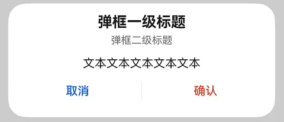
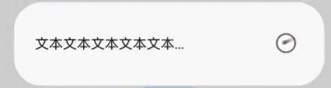
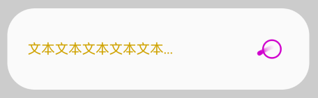
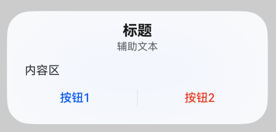
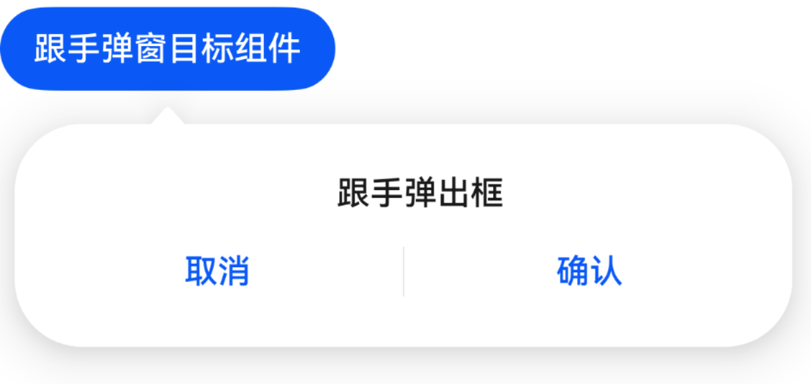

# DialogV2

更新时间：2026-07-28 11:23:46

来源：https://developer.huawei.com/consumer/cn/doc/harmonyos-references/ohos-arkui-advanced-dialogv2
**支持设备：** Phone | PC/2in1 | Tablet | Wearable | TV

弹出框是一种模态窗口，用于在保持当前上下文环境时，临时展示用户需关注的信息或待处理的操作，用户在弹出框内完成交互。模态弹出框需要用户进行交互才能够退出模态模式。DialogV2提供了提示、选择、确认、警告、加载等多种类型的弹出框，适用于确认删除、显示加载进度、用户选择项、重要提示等场景，帮助开发者简化模态对话框的实现，提供一致的用户交互体验。

该组件基于[状态管理（V2）](https://developer.huawei.com/consumer/cn/doc/harmonyos-guides/arkts-state-management-overview#状态管理v2)实现，相较于[状态管理（V1）](https://developer.huawei.com/consumer/cn/doc/harmonyos-guides/arkts-state-management-overview#状态管理v1)，状态管理（V2）增强了对数据对象的深度观察与管理能力，不再局限于组件层级。借助状态管理（V2），开发者可以通过该组件更灵活地控制弹出框的数据和状态，实现更高效的用户界面刷新。

> [!NOTE]
> 该组件从API version 18开始支持。后续版本如有新增内容，则采用上角标单独标记该内容的起始版本。 该组件仅可在Stage模型下使用。 如果DialogV2设置 通用属性 和 通用事件 ，编译工具链会额外生成节点__Common__，并将通用属性或通用事件挂载在__Common__上，而不是直接应用到DialogV2本身。这可能导致设置的通用属性或通用事件不生效或不符合预期，因此不建议DialogV2设置通用属性和通用事件。


#### 导入模块

**支持设备：** Phone | PC/2in1 | Tablet | Wearable | TV

```text
import { TipsDialogV2, SelectDialogV2, ConfirmDialogV2, AlertDialogV2, LoadingDialogV2, CustomContentDialogV2, PopoverDialogV2 } from '@kit.ArkUI';
```


#### 子组件

**支持设备：** Phone | PC/2in1 | Tablet | Wearable | TV

无


#### TipsDialogV2

**支持设备：** Phone | PC/2in1 | Tablet | Wearable | TV

TipsDialogV2({imageRes: ResourceStr | PixelMap, imageSize?: SizeOptions, imageBorderColor?: ColorMetrics, imageBorderWidth?: LengthMetrics, title?: ResourceStr, content?: ResourceStr, checkTips?: ResourceStr, checked?: boolean, onCheckedChange?: AdvancedDialogV2OnCheckedChange, primaryButton?: AdvancedDialogV2Button, secondaryButton?: AdvancedDialogV2Button})

提示弹出框，即为带图形确认弹出框，必要时可通过图形化方式展现确认弹出框。适用于需要图形化方式展示的重要提示场景，如应用卸载确认等。

**装饰器类型：**@ComponentV2

**元服务API：** 从API version 18开始，该接口支持在元服务中使用。

**系统能力：** SystemCapability.ArkUI.ArkUI.Full

| 名称 | 类型 | 必填 | 装饰器类型 | 说明 |
| --- | --- | --- | --- | --- |
| imageRes | ResourceStr \| PixelMap | 是 | @Param @Require | 展示的图片。 |
| imageSize | SizeOptions | 否 | @Param | 自定义图片尺寸。 默认值：64*64vp |
| imageBorderColor | ColorMetrics | 否 | @Param | 图片描边颜色。 默认值：Color.Black |
| imageBorderWidth | LengthMetrics | 否 | @Param | 图片描边宽度。 默认无描边效果。 |
| title | ResourceStr | 否 | @Param | 提示弹出框标题。 默认不显示。 说明： 标题超过两行会显示“...”。 |
| content | ResourceStr | 否 | @Param | 提示弹出框内容。 默认不显示。 |
| checkTips | ResourceStr | 否 | @Param | checkbox的提示内容。 默认不显示。 |
| checked | boolean | 否 | @Param | checked为true时，表示checkbox已选中。checked为false时，表示checkbox未选中。 默认值：false |
| onCheckedChange | AdvancedDialogV2OnCheckedChange | 否 | @Param | checkbox的选中状态改变事件。 默认无事件。 |
| primaryButton | AdvancedDialogV2Button | 否 | @Param | 提示弹出框左侧按钮。 默认不显示。 |
| secondaryButton | AdvancedDialogV2Button | 否 | @Param | 提示弹出框右侧按钮。 默认不显示。 |


#### AdvancedDialogV2OnCheckedChange

**支持设备：** Phone | PC/2in1 | Tablet | Wearable | TV

type AdvancedDialogV2OnCheckedChange = (checked: boolean) => void

checkbox选中状态改变事件。

**元服务API：** 从API version 18开始，该接口支持在元服务中使用。

**系统能力：** SystemCapability.ArkUI.ArkUI.Full

**参数：**

| 参数名 | 类型 | 必填 | 说明 |
| --- | --- | --- | --- |
| checked | boolean | 是 | 表示checkbox选中状态。 checked为true时，表示checkbox已选中。checked为false时，表示checkbox未选中。 |


#### SelectDialogV2

**支持设备：** Phone | PC/2in1 | Tablet | Wearable | TV

SelectDialogV2({title: ResourceStr, content?: ResourceStr, selectedIndex?: number, confirm?: AdvancedDialogV2Button, radioContent: SheetInfo[]})

选择类弹出框，弹框中以列表或网格的形式提供可选的内容。适用于需要用户从多个选项中选择一个的场景，如选择语言、选择地区等。

**装饰器类型：**@ComponentV2

**元服务API：** 从API version 18开始，该接口支持在元服务中使用。

**系统能力：** SystemCapability.ArkUI.ArkUI.Full

| 名称 | 类型 | 必填 | 装饰器类型 | 说明 |
| --- | --- | --- | --- | --- |
| title | ResourceStr | 是 | @Param @Require | 选择弹出框标题。 说明： 标题超过两行会显示“...”。 |
| content | ResourceStr | 否 | @Param | 选择弹出框内容。默认不显示。 |
| selectedIndex | number | 否 | @Param | 选择弹出框的选中项，基于0的索引（0表示第一个选项）。 默认值：-1，没有选中项。若设置数值不在取值范围，按没有选中项处理。 取值范围：0到选择弹出框的子项内容列表长度减1。 |
| confirm | AdvancedDialogV2Button | 否 | @Param | 选择弹出框确认按钮。 默认不显示。 |
| radioContent | SheetInfo[] | 是 | @Param @Require | 选择弹出框的子项内容列表，每个选择项支持设置文本和选中的回调事件。 |


#### ConfirmDialogV2

**支持设备：** Phone | PC/2in1 | Tablet | Wearable | TV

ConfirmDialogV2({title: ResourceStr, content?: ResourceStr, checkTips?: ResourceStr, checked?: boolean, onCheckedChange?: AdvancedDialogV2OnCheckedChange, primaryButton?: AdvancedDialogV2Button, secondaryButton?: AdvancedDialogV2Button})

信息确认类弹出框，用于反馈错误或提示信息。当操作未正确执行（如网络错误、电池电量过低）或用户操作不当时（如指纹录入），弹出此类对话框进行提示。

**装饰器类型：**@ComponentV2

**元服务API：** 从API version 18开始，该接口支持在元服务中使用。

**系统能力：** SystemCapability.ArkUI.ArkUI.Full

| 名称 | 类型 | 必填 | 装饰器类型 | 说明 |
| --- | --- | --- | --- | --- |
| title | ResourceStr | 是 | @Param @Require | 确认弹出框标题。 说明： 标题超过两行会显示“...”。 |
| content | ResourceStr | 否 | @Param | 确认弹出框内容。 默认不显示。 |
| checkTips | ResourceStr | 否 | @Param | checkbox的提示内容。 默认不显示。 说明： 当提示内容不设置时，checkbox也会显示。 |
| checked | boolean | 否 | @Param | checked为true时，表示checkbox已选中，为false时，表示未选中。 默认值：false |
| onCheckedChange | AdvancedDialogV2OnCheckedChange | 否 | @Param | checkbox的选中状态改变事件。 默认无事件。 |
| primaryButton | AdvancedDialogV2Button | 否 | @Param | 确认弹出框左侧按钮。 默认不显示。 |
| secondaryButton | AdvancedDialogV2Button | 否 | @Param | 确认弹出框右侧按钮。 默认不显示。 |


#### AlertDialogV2

**支持设备：** Phone | PC/2in1 | Tablet | Wearable | TV

AlertDialogV2({primaryTitle?: ResourceStr, secondaryTitle?: ResourceStr, content: ResourceStr, primaryButton?: AdvancedDialogV2Button, secondaryButton?: AdvancedDialogV2Button})

警告弹出框。当触发一个将产生严重后果的不可逆操作时，如删除、重置、取消编辑、停止等，会触发该类弹出框提示。

**装饰器类型：**@ComponentV2

**元服务API：** 从API version 18开始，该接口支持在元服务中使用。

**系统能力：** SystemCapability.ArkUI.ArkUI.Full

| 名称 | 类型 | 必填 | 装饰器类型 | 说明 |
| --- | --- | --- | --- | --- |
| primaryTitle | ResourceStr | 否 | @Param | 确认弹出框标题。 默认不显示。 说明： 标题超过两行会显示“...”。 |
| secondaryTitle | ResourceStr | 否 | @Param | 确认弹出框辅助文本。 默认不显示。 说明： 辅助文本超过两行会显示“...”。 |
| content | ResourceStr | 是 | @Param @Require | 确认弹出框内容。 |
| primaryButton | AdvancedDialogV2Button | 否 | @Param | 确认弹出框左侧按钮。 默认不显示。 |
| secondaryButton | AdvancedDialogV2Button | 否 | @Param | 确认弹出框右侧按钮。 默认不显示。 |


#### LoadingDialogV2

**支持设备：** Phone | PC/2in1 | Tablet | Wearable | TV

LoadingDialogV2({content?: ResourceStr})

进度加载类弹出框，操作正在执行时的提示信息。适用于耗时操作的场景，如数据加载、文件上传等，用于告知用户当前正在处理中。

**装饰器类型：**@ComponentV2

**元服务API：** 从API version 18开始，该接口支持在元服务中使用。

**系统能力：** SystemCapability.ArkUI.ArkUI.Full

| 名称 | 类型 | 必填 | 装饰器类型 | 说明 |
| --- | --- | --- | --- | --- |
| content | ResourceStr | 否 | @Param | 加载弹出框内容。 默认为空。 说明： 内容超过十行会显示“...”。 |


#### CustomContentDialogV2

**支持设备：** Phone | PC/2in1 | Tablet | Wearable | TV

CustomContentDialogV2({contentBuilder: () => void, primaryTitle?: ResourceStr, secondaryTitle?: ResourceStr, contentAreaPadding?: LocalizedPadding, buttons?: AdvancedDialogV2Button[]})

自定义内容区弹出框，同时支持定义操作区按钮样式。适用于需要展示复杂或自定义内容的场景，如用户协议确认、表单输入等。

**装饰器类型：**@ComponentV2

**元服务API：** 从API version 18开始，该接口支持在元服务中使用。

**系统能力：** SystemCapability.ArkUI.ArkUI.Full

| 名称 | 类型 | 必填 | 装饰器类型 | 说明 |
| --- | --- | --- | --- | --- |
| contentBuilder | CustomBuilder | 是 | @BuilderParam | 弹出框内容。 |
| primaryTitle | ResourceStr | 否 | @Param | 弹出框主标题。 默认不显示。 说明： 主标题超过两行会显示“...”。 |
| secondaryTitle | ResourceStr | 否 | @Param | 弹出框辅助标题。 默认不显示。 说明： 辅助标题超过两行会显示“...”。 |
| contentAreaPadding | LocalizedPadding | 否 | @Param | 弹出框内容区内边距。 默认跟随系统。 |
| buttons | AdvancedDialogV2Button[] | 否 | @Param | 弹出框操作区按钮，最多支持4个按钮。 默认不显示。 |


#### PopoverDialogV2OnVisibleChange

**支持设备：** Phone | PC/2in1 | Tablet | Wearable | TV

type PopoverDialogV2OnVisibleChange = (visible: boolean) => void

跟手弹出框显示状态改变事件。

**元服务API：** 从API version 18开始，该接口支持在元服务中使用。

**系统能力：** SystemCapability.ArkUI.ArkUI.Full

**参数：**

| 参数名 | 类型 | 必填 | 说明 |
| --- | --- | --- | --- |
| visible | boolean | 是 | 表示跟手弹出框显示状态。 值为true时跟手弹出框显示，为false时隐藏。 |


#### PopoverDialogV2

**支持设备：** Phone | PC/2in1 | Tablet | Wearable | TV

PopoverDialogV2({visible: boolean, $visible?: PopoverDialogV2OnVisibleChange, popover: PopoverDialogV2Options, targetBuilder: CustomBuilder})

跟手弹出框，基于目标组件位置弹出，上文中的TipsDialogV2、SelectDialogV2、ConfirmDialogV2、AlertDialogV2、LoadingDialogV2、CustomContentDialogV2都可作为弹出框内容。适用于需要跟随目标组件位置显示的场景，如工具提示、操作引导等。

**装饰器类型：**@ComponentV2

**元服务API：** 从API version 18开始，该接口支持在元服务中使用。

**系统能力：** SystemCapability.ArkUI.ArkUI.Full

| 名称 | 类型 | 必填 | 装饰器类型 | 说明 |
| --- | --- | --- | --- | --- |
| visible | boolean | 是 | @Param @Require | 跟手弹出框的显示状态。 值为true时跟手弹出框显示，为false时隐藏。 |
| $visible | PopoverDialogV2OnVisibleChange | 否 | @Event | 修改跟手弹出框的显示状态时触发的回调函数，建议在visible后使用!!语法（如visible: this.isShow!!）设置双向同步，当弹出框内部改变显示状态时会同步更新外部变量。 默认无事件。 |
| popover | PopoverDialogV2Options | 是 | @Param @Require | 配置跟手弹出框的参数。 |
| targetBuilder | CustomBuilder | 是 | @BuilderParam | 跟手弹出框基于的目标组件。 |


#### PopoverDialogV2Options

**支持设备：** Phone | PC/2in1 | Tablet | Wearable | TV

跟手弹出框参数，用于设置弹出框内容、位置属性等。

继承自[CustomPopupOptions](https://developer.huawei.com/consumer/cn/doc/harmonyos-references/ts-universal-attributes-popup#custompopupoptions8类型说明)。

> [!NOTE]
> radius默认值为32vp。


**元服务API：** 从API version 18开始，该接口支持在元服务中使用。

**系统能力：** SystemCapability.ArkUI.ArkUI.Full


#### AdvancedDialogV2ButtonAction

**支持设备：** Phone | PC/2in1 | Tablet | Wearable | TV

type AdvancedDialogV2ButtonAction = () => void

弹出框操作区按钮的点击事件类型。

**元服务API：** 从API version 18开始，该接口支持在元服务中使用。

**系统能力：** SystemCapability.ArkUI.ArkUI.Full


#### AdvancedDialogV2Button

**支持设备：** Phone | PC/2in1 | Tablet | Wearable | TV

弹出框操作区按钮。

**装饰器类型：**@ObservedV2

**系统能力：** SystemCapability.ArkUI.ArkUI.Full

| 名称 | 类型 | 只读 | 可选 | 说明 |
| --- | --- | --- | --- | --- |
| content | ResourceStr | 否 | 否 | 按钮的内容。 元服务API： 从API version 18开始，该接口支持在元服务中使用。 装饰器类型：@Trace |
| action | AdvancedDialogV2ButtonAction | 否 | 是 | 按钮的点击事件。 默认无事件。 元服务API： 从API version 18开始，该接口支持在元服务中使用。 装饰器类型：@Trace |
| background | ColorMetrics | 否 | 是 | 按钮的背景。当buttonStyle和role为默认值时生效。 默认值跟随buttonStyle。 元服务API： 从API version 18开始，该接口支持在元服务中使用。 装饰器类型：@Trace |
| fontColor | ColorMetrics | 否 | 是 | 按钮的字体颜色。当buttonStyle和role为默认值时生效。 默认值跟随buttonStyle。 元服务API： 从API version 18开始，该接口支持在元服务中使用。 装饰器类型：@Trace |
| buttonStyle | ButtonStyleMode | 否 | 是 | 按钮的样式。 默认值：2in1设备为ButtonStyleMode.NORMAL，其他设备为ButtonStyleMode.TEXTUAL。 元服务API： 从API version 18开始，该接口支持在元服务中使用。 装饰器类型：@Trace |
| role | ButtonRole | 否 | 是 | 按钮的角色。 默认值：ButtonRole.NORMAL 元服务API： 从API version 18开始，该接口支持在元服务中使用。 装饰器类型：@Trace |
| defaultFocus | boolean | 否 | 是 | 是否为默认焦点。 true：按钮是默认焦点。 false：按钮不是默认焦点。 默认值：false 元服务API： 从API version 18开始，该接口支持在元服务中使用。 装饰器类型：@Trace |
| enabled | boolean | 否 | 是 | 是否可用。 true：按钮可用。 false：按钮不可用。 默认值：true 元服务API： 从API version 18开始，该接口支持在元服务中使用。 装饰器类型：@Trace |
| textAlign24+ | TextAlign | 否 | 是 | 按钮文本的对齐方式。 默认值：TextAlign.Start 元服务API： 从API version 24开始，该接口支持在元服务中使用。 装饰器类型：@Trace |


> [!NOTE]
> buttonStyle和role优先级高于fontColor和background。当buttonStyle和role为默认值时，fontColor和background可生效。 若同时给多个按钮设置defaultFocus，默认焦点为这些按钮中显示顺序的第一个。


#### constructor

**支持设备：** Phone | PC/2in1 | Tablet | Wearable | TV

constructor(options: AdvancedDialogV2ButtonOptions)

AdvancedDialogV2Button的构造函数。

**元服务API：** 从API version 18开始，该接口支持在元服务中使用。

**系统能力：** SystemCapability.ArkUI.ArkUI.Full

**参数：**

| 参数名 | 类型 | 必填 | 说明 |
| --- | --- | --- | --- |
| options | AdvancedDialogV2ButtonOptions | 是 | 按钮配置信息。 |


#### AdvancedDialogV2ButtonOptions

**支持设备：** Phone | PC/2in1 | Tablet | Wearable | TV

用于初始化AdvancedDialogV2Button对象。

**系统能力：** SystemCapability.ArkUI.ArkUI.Full

| 名称 | 类型 | 只读 | 可选 | 说明 |
| --- | --- | --- | --- | --- |
| content | ResourceStr | 否 | 否 | 按钮的内容。 元服务API： 从API version 18开始，该接口支持在元服务中使用。 |
| action | AdvancedDialogV2ButtonAction | 否 | 是 | 按钮的点击事件。 默认无事件。 元服务API： 从API version 18开始，该接口支持在元服务中使用。 |
| background | ColorMetrics | 否 | 是 | 按钮的背景。当buttonStyle和role为默认值时生效。 默认值跟随buttonStyle。 元服务API： 从API version 18开始，该接口支持在元服务中使用。 |
| fontColor | ColorMetrics | 否 | 是 | 按钮的字体颜色。当buttonStyle和role为默认值时生效。 默认值跟随buttonStyle。 元服务API： 从API version 18开始，该接口支持在元服务中使用。 |
| buttonStyle | ButtonStyleMode | 否 | 是 | 按钮的样式。 默认值：2in1设备为ButtonStyleMode.NORMAL，其他设备为ButtonStyleMode.TEXTUAL。 元服务API： 从API version 18开始，该接口支持在元服务中使用。 |
| role | ButtonRole | 否 | 是 | 按钮的角色。 默认值：ButtonRole.NORMAL 元服务API： 从API version 18开始，该接口支持在元服务中使用。 |
| defaultFocus | boolean | 否 | 是 | 是否为默认焦点。 true：按钮是默认焦点。 false：按钮不是默认焦点。 默认值：false 元服务API： 从API version 18开始，该接口支持在元服务中使用。 |
| enabled | boolean | 否 | 是 | 是否可用。 true：按钮可用。 false：按钮不可用。 默认值：true 元服务API： 从API version 18开始，该接口支持在元服务中使用。 |
| textAlign24+ | TextAlign | 否 | 是 | 按钮文本的对齐方式。 默认值：TextAlign.Start 元服务API： 从API version 24开始，该接口支持在元服务中使用。 |


#### 示例

**支持设备：** Phone | PC/2in1 | Tablet | Wearable | TV


#### 示例1（上图下文弹出框）

上图下文弹出框，包含imageRes、content等内容。

```text
import { TipsDialogV2, AdvancedDialogV2Button, UIContext, ButtonRole  } from '@kit.ArkUI';

@Entry
@ComponentV2
struct Index {
  @Local checked: boolean = false;

  @Builder
  dialogBuilder(): void {
    // 构建提示弹出框，配置图片、内容、勾选状态和操作按钮
    TipsDialogV2({
      imageRes: $r('sys.media.ohos_ic_public_voice'),
      content: '想要卸载这个APP嘛?',
      title: 'TipsDialogV2',
      checkTips: '不再提示',
      checked: this.checked,
      primaryButton: new AdvancedDialogV2Button({
        content: '取消',
        action: () => {
          console.info('Callback when the first button is clicked');
        },
      }),
      secondaryButton: new AdvancedDialogV2Button({
        content: '删除',
        role: ButtonRole.ERROR,
        action: () => {
          console.info('Callback when the second button is clicked');
        }
      }),
      onCheckedChange: (checked: boolean) => {
        console.info('Callback when the checkbox is clicked');
        this.checked = checked;
      }
    })
  }

  build() {
    Row() {
      Stack() {
        Column() {
          Button("打开TipsDialogV2弹出框")
            .width(96)
            .height(40)
            .onClick(() => {
              let uiContext: UIContext = this.getUIContext();
              uiContext.getPromptAction().openCustomDialog({
                builder: () => {
                  this.dialogBuilder();
                },
              });
            })
        }.margin({ bottom: 300 })
      }.align(Alignment.Bottom)
      .width('100%').height('100%')
    }
    .backgroundImageSize({ width: '100%', height: '100%' })
    .height('100%')
  }
}
```





#### 示例2（纯列表弹出框）

纯列表弹出框，包含selectedIndex、radioContent等内容。

```text
import { SelectDialogV2, AdvancedDialogV2Button ,UIContext  } from '@kit.ArkUI';

@Entry
@ComponentV2
struct Index {
  @Local radioIndex: number = 0;
  @Builder
  dialogBuilder(): void {
    // 构建选择弹出框，配置标题、选中项、底部按钮和选项列表
    SelectDialogV2({
      title: '文本标题',
      selectedIndex: this.radioIndex,
      confirm: new AdvancedDialogV2Button({
        content: '取消',
        action: () => {},
      }),
      radioContent: [
        {
          title: '文本文本文本文本文本',
          action: () => {
            this.radioIndex = 0
          }
        },
        {
          title: '文本文本文本文本',
          action: () => {
            this.radioIndex = 1
          }
        },
        {
          title: '文本文本文本文本',
          action: () => {
            this.radioIndex = 2
          }
        },
      ]
    })
  }
  build() {
    Row() {
      Stack() {
        Column() {
          Button("纯列表弹出框")
            .width(96)
            .height(40)
            .onClick(() => {
              let uiContext: UIContext = this.getUIContext();
              uiContext.getPromptAction().openCustomDialog({
                builder: () => {
                  this.dialogBuilder();
                }
              })
            })
        }.margin({ bottom: 300 })
      }.align(Alignment.Bottom)
      .width('100%').height('100%')
    }
    .backgroundImageSize({ width: '100%', height: '100%' })
    .height('100%')
  }
}
```





#### 示例3（文本与勾选弹出框）

文本与勾选弹出框，包含content、checkTips等内容。

```text
import { ConfirmDialogV2, AdvancedDialogV2Button, UIContext  } from '@kit.ArkUI';

@Entry
@ComponentV2
struct Index {
  @Local checked: boolean = false;

  @Builder
  dialogBuilder(): void {
    // 构建信息确认弹出框，配置标题、内容、勾选状态和操作按钮
    ConfirmDialogV2({
      title: '文本标题',
      content: '文本文本文本文本文本文本文本文本文本文本文本文本文本文本文本文本文本文本文本',
      checked: this.checked,
      checkTips: '禁止后不再提示',
      primaryButton: new AdvancedDialogV2Button({
        content: '禁止',
        action: () => {
          console.info('Callback when the primary button is clicked');
        },
      }),
      secondaryButton: new AdvancedDialogV2Button({
        content: '允许',
        action: () => {
          this.checked = false
          console.info('Callback when the second button is clicked');
        }
      }),
      onCheckedChange: (checked: boolean) => {
        console.info('Callback when the checkbox is clicked');
        this.checked = checked;
      },
    })
  }

  build() {
    Row() {
      Stack() {
        Column() {
          Button("打开ConfirmDialogV2弹出框")
            .width(96)
            .height(40)
            .onClick(() => {
              let uiContext: UIContext = this.getUIContext();
              uiContext.getPromptAction().openCustomDialog({
                builder: () => {
                  this.dialogBuilder();
                },
                alignment: DialogAlignment.Bottom
              });
            })
        }.margin({ bottom: 300 })
      }.align(Alignment.Bottom)
      .width('100%').height('100%')
    }
    .backgroundImageSize({ width: '100%', height: '100%' })
    .height('100%')
  }
}
```





#### 示例4（纯文本弹出框）

纯文本弹出框，包含primaryTitle、secondaryTitle、content等内容。

```text
import { AlertDialogV2, AdvancedDialogV2Button, UIContext, ButtonRole  } from '@kit.ArkUI';

@Entry
@ComponentV2
struct Index {
  @Builder
  dialogBuilder(): void {
    // 构建操作确认弹出框，配置标题、内容和操作按钮
    AlertDialogV2({
      primaryTitle: '弹框一级标题',
      secondaryTitle: '弹框二级标题',
      content: '文本文本文本文本文本',
      primaryButton: new AdvancedDialogV2Button({
        content: '取消',
        action: () => {
          console.info('Callback when the primary button is clicked');
        },
      }),
      secondaryButton: new AdvancedDialogV2Button({
        content: '确认',
        role: ButtonRole.ERROR,
        action: () => {
          console.info('Callback when the second button is clicked');
        }
      }),
    })
  }

  build() {
    Row() {
      Stack() {
        Column() {
          Button("打开AlertDialogV2弹出框")
            .width(96)
            .height(40)
            .onClick(() => {
              let uiContext: UIContext = this.getUIContext();
              uiContext.getPromptAction().openCustomDialog({
                builder: () => {
                  this.dialogBuilder();
                }
              });
            })
        }.margin({ bottom: 300 })
      }.align(Alignment.Bottom)
      .width('100%').height('100%')
    }
    .backgroundImageSize({ width: '100%', height: '100%' })
    .height('100%')
  }
}
```





#### 示例5（进度加载类弹出框）

进度加载类弹出框，包含content等内容。

```text
import { LoadingDialogV2, UIContext  } from '@kit.ArkUI';

@Entry
@ComponentV2
struct Index {
  @Builder
  dialogBuilder(): void {
    // 构建进度加载弹出框，配置提示内容
    LoadingDialogV2({
      content: '文本文本文本文本文本...',
    })
  }

  build() {
    Row() {
      Stack() {
        Column() {
          Button("打开LoadingDialogV2弹出框")
            .width(96)
            .height(40)
            .onClick(() => {
              let uiContext: UIContext = this.getUIContext();
              uiContext.getPromptAction().openCustomDialog({
                builder: () => {
                  this.dialogBuilder();
                }
              });
            })
        }.margin({ bottom: 300 })
      }.align(Alignment.Bottom)
      .width('100%').height('100%')
    }
    .backgroundImageSize({ width: '100%', height: '100%' })
    .height('100%')
  }
}
```





#### 示例6（使用WithTheme自定义主题的弹出框）

使用WithTheme自定义主题的弹出框，通过WithTheme包装LoadingDialogV2实现主题风格定制。

```text
import { CustomColors, CustomTheme, LoadingDialogV2, UIContext, WithTheme  } from '@kit.ArkUI';

class CustomThemeImpl implements CustomTheme {
  colors?: CustomColors;

  constructor(colors: CustomColors) {
    this.colors = colors;
  }
}

class CustomThemeColors implements CustomColors {
  fontPrimary = '#ffd0a300';
  iconSecondary = '#ffd000cd';
}

@Entry
@ComponentV2
struct Index {
  @Builder
  dialogBuilder(): void {
    WithTheme({ theme: new CustomThemeImpl(new CustomThemeColors()) }) {
      LoadingDialogV2({
        content: '文本文本文本文本文本...',
      })
    }
  }

  build() {
    Row() {
      Stack() {
        Column() {
          Button("打开LoadingDialogV2弹出框")
            .width(96)
            .height(40)
            .onClick(() => {
              let uiContext: UIContext = this.getUIContext();
              uiContext.getPromptAction().openCustomDialog({
                builder: () => {
                  this.dialogBuilder();
                }
              });
            })
        }.margin({ bottom: 300 })
      }.align(Alignment.Bottom)
      .width('100%').height('100%')
    }
    .backgroundImageSize({ width: '100%', height: '100%' })
    .height('100%')
  }
}
```


#### 示例7（自定义内容弹出框）

支持自定义内容弹出框，包含contentBuilder、buttons等内容。

```text
import { CustomContentDialogV2, AdvancedDialogV2Button, UIContext, ButtonStyleMode, ButtonRole  } from '@kit.ArkUI';

@Entry
@ComponentV2
struct Index {
  @Builder
  dialogBuilder(): void {
    // 构建自定义内容弹出框，配置标题、内容构建器和操作区按钮
    CustomContentDialogV2({
      primaryTitle: '标题',
      secondaryTitle: '辅助文本',
      contentBuilder: () => {
        this.buildContent();
      },
      buttons: [
        new AdvancedDialogV2Button({
          content: '按钮1', buttonStyle: ButtonStyleMode.TEXTUAL,
          action: () => {
            console.info('Callback when the button is clicked');
          }
        }),
        new AdvancedDialogV2Button({
          content: '按钮2', buttonStyle: ButtonStyleMode.TEXTUAL, role: ButtonRole.ERROR,
        })
      ],
    })
  }

  build() {
    Column() {
      Button("打开CustomContentDialogV2弹出框")
        .onClick(() => {
            let uiContext: UIContext = this.getUIContext();
            uiContext.getPromptAction().openCustomDialog({
            builder: () => {
              this.dialogBuilder();
            }
          })
        })
    }
    .width('100%')
    .height('100%')
    .justifyContent(FlexAlign.Center)
  }

  @Builder
  buildContent(): void {
    Column() {
      Text('内容区')
    }
  }
}
```


#### 示例8（跟手弹出框）

跟手弹出框（警告弹出框为例），包含visible、popover、targetBuilder等内容。

```text
import { AlertDialogV2, PopoverDialogV2, PopoverDialogV2Options, AdvancedDialogV2Button} from '@kit.ArkUI';

@Entry
@ComponentV2
struct Index {
  @Local isShow: boolean = false;
  @Local popoverOptions: PopoverDialogV2Options = {
    builder: () => {
      this.dialogBuilder();
    }
  }

  @Builder dialogBuilder() {
    AlertDialogV2({
      content: '跟手弹出框',
      primaryButton: new AdvancedDialogV2Button({
        content: '取消',
        action: () => {
          this.isShow = false;
        },
      }),
      secondaryButton: new AdvancedDialogV2Button({
        content: '确认',
        action: () => {
          this.isShow = false;
        },
      }),
    });
  }

  @Builder buttonBuilder() {
    Button('跟手弹出框目标组件').onClick(() => {
      this.isShow = true;
    });
  }

  build() {
    Column() {
      // 构建跟手弹出框，配置显示状态、弹出选项和目标组件
      PopoverDialogV2({
        visible: this.isShow!!,
        popover: this.popoverOptions,
        targetBuilder: () => {
          this.buttonBuilder();
        },
      })
    }
  }
}
```


