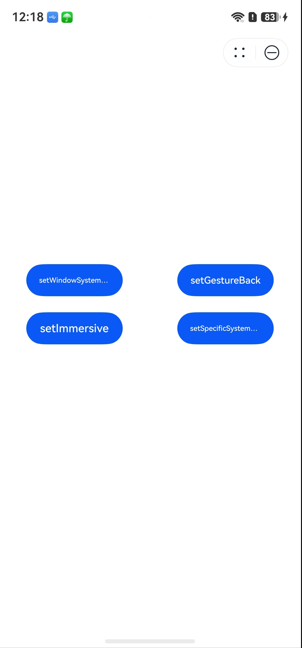

# FullScreenLaunchComponent

更新时间：2026-05-11 05:52:01

来源：https://developer.huawei.com/consumer/cn/doc/harmonyos-references/ohos-arkui-advanced-fullscreenlaunchcomponent
**支持设备：** Phone / PC/2in1 / Tablet / Wearable / TV

全屏启动元服务组件，当被拉起方授权使用方可以嵌入式运行元服务时，使用方全屏嵌入式运行元服务；未授权时，使用方跳出式拉起元服务。


> [!NOTE]
> 该组件从API version 12开始支持。后续版本如有新增内容，则采用上角标单独标记该内容的起始版本。
> 该组件不支持在Wearable设备上使用。
> 如果需要在该组件中实现可嵌入式运行的元服务，必须继承自[EmbeddableUIAbility](https://developer.huawei.com/consumer/cn/doc/harmonyos-references/js-apis-app-ability-embeddableuiability)。否则，系统无法保证元服务功能正常。


## 导入模块
**支持设备：** Phone / PC/2in1 / Tablet / Wearable / TV


```ts
import { FullScreenLaunchComponent } from '@kit.ArkUI';
```


## 子组件
**支持设备：** Phone / PC/2in1 / Tablet / Wearable / TV

无


## 属性
**支持设备：** Phone / PC/2in1 / Tablet / Wearable / TV

不支持[通用属性](https://developer.huawei.com/consumer/cn/doc/harmonyos-references/ts-component-general-attributes)。


## 事件
**支持设备：** Phone / PC/2in1 / Tablet / Wearable / TV

不支持[通用事件](https://developer.huawei.com/consumer/cn/doc/harmonyos-references/ts-component-general-events)。


## FullScreenLaunchComponent
**支持设备：** Phone / PC/2in1 / Tablet / Wearable / TV

FullScreenLaunchComponent({ content: Callback<void>, appId: string, options?: AtomicServiceOptions, onError?: ErrorCallback, onTerminated?: Callback<TerminationInfo> })

**装饰器类型：**[@Component](https://developer.huawei.com/consumer/cn/doc/harmonyos-guides/arkts-create-custom-components#component)

**系统能力：** SystemCapability.ArkUI.ArkUI.Full


| 名称 | 类型 | 必填 | 装饰器类型 | 说明 |
| --- | --- | --- | --- | --- |
| content | Callback&lt;void&gt; | 是 | [@BuilderParam](https://developer.huawei.com/consumer/cn/doc/harmonyos-guides/arkts-builderparam) | 可以使用组件组合来自定义拉起元服务前的占位图标，实现类似大桌面应用图标的效果。点击占位组件后，将拉起元服务。          元服务API： 从API version 12开始，该接口支持在元服务中使用。 |
| appId | string | 是 | - | 需要拉起的元服务appId，appId是元服务的唯一标识。          元服务API： 从API version 12开始，该接口支持在元服务中使用。可在应用市场元服务一栏找到需要使用的元服务，在元服务隐私声明内找到对应元服务开发者的联系方式，联系对应元服务开发者获取。 |
| options | [AtomicServiceOptions](https://developer.huawei.com/consumer/cn/doc/harmonyos-references/js-apis-app-ability-atomicserviceoptions) | 否 | - | 拉起元服务参数。          元服务API： 从API version 12开始，该接口支持在元服务中使用。 |
| onError18+ | [ErrorCallback](https://developer.huawei.com/consumer/cn/doc/harmonyos-references/js-apis-base#errorcallback) | 否 | - | 被拉起的嵌入式运行元服务在运行过程中发生异常时触发本回调。可通过回调参数中的code、name和message获取错误信息并做处理。          元服务API： 从API version 18开始，该接口支持在元服务中使用。 |
| onTerminated18+ | [Callback](https://developer.huawei.com/consumer/cn/doc/harmonyos-references/js-apis-base#callback)&lt;[TerminationInfo](https://developer.huawei.com/consumer/cn/doc/harmonyos-references/ts-container-embedded-component#terminationinfo)&gt; | 否 | - | 被拉起的嵌入式运行元服务通过点击元服务退出按钮、手势侧滑、调用[terminateSelfWithResult](https://developer.huawei.com/consumer/cn/doc/harmonyos-references/js-apis-inner-application-uiabilitycontext#terminateselfwithresult)或者[terminateSelf](https://developer.huawei.com/consumer/cn/doc/harmonyos-references/js-apis-inner-application-uiabilitycontext#terminateself)正常退出时，触发本回调函数。          元服务API： 从API version 18开始，该接口支持在元服务中使用。 |
| onReceive20+ | [Callback](https://developer.huawei.com/consumer/cn/doc/harmonyos-references/js-apis-base#callback)&lt;Record&lt;string, Object&gt;&gt; | 否 | - | 被拉起的嵌入式运行元服务通过[Window](https://developer.huawei.com/consumer/cn/doc/harmonyos-guides/application-window-stage)调用API时，触发本回调。          元服务API： 从API version 20开始，该接口支持在元服务中使用。 |


## 示例
**支持设备：** Phone / PC/2in1 / Tablet / Wearable / TV

本示例展示组件使用方法和扩展的元服务。实际运行时请使用开发者自己的元服务appId。

FullScreenLaunchComponent组件需要由使用方调用。在提供方完成本地的安装后，即可实现在使用方应用或者元服务中全屏嵌入式拉起提供方的效果。

**使用方**


```ts
// 使用方入口界面Index.ets内容如下:
import { FullScreenLaunchComponent } from '@kit.ArkUI';

@Entry
@Component
struct Index {
  @State appId: string = '6917573653426122083'; // 元服务appId

  build() {
    Row() {
      Column() {
        FullScreenLaunchComponent({
          content: ColumnChild,
          appId: this.appId,
          options: {},
          onTerminated: (info) => {
            console.info(`onTerminated code: ${info.code.toString()}`);
          },
          onError: (err) => {
            console.error(`onError code: ${err.code}, message: ${err.message}`);
          },
          onReceive: (data) => {
            console.info(`onReceive, data: ${JSON.stringify(data)}`);
          }
        }).width("80vp").height("80vp")
      }
      .width('100%')
    }
    .height('100%')
  }
}

@Builder
function ColumnChild() {
  Column() {
    Image($r('app.media.startIcon'))
    Text('test')
  }
}
```

**组件提供方**

元服务提供方需要修改两个文件：


- 提供方入口文件：/src/main/ets/entryability/EntryAbility.ets。


```ts
import { AbilityConstant, Want, EmbeddableUIAbility } from '@kit.AbilityKit';
import { hilog } from '@kit.PerformanceAnalysisKit';
import { window } from '@kit.ArkUI';

const DOMAIN = 0x0000;

export default class EntryAbility extends EmbeddableUIAbility {
  storage = new LocalStorage(); // 初始化示例，用于存储窗口和窗口阶段的信息
  onCreate(want: Want, launchParam: AbilityConstant.LaunchParam): void {
    hilog.info(DOMAIN, 'testTag', '%{public}s', 'Ability onCreate');
  }

  onDestroy(): void {
    hilog.info(DOMAIN, 'testTag', '%{public}s', 'Ability onDestroy');
  }

  onWindowStageCreate(windowStage: window.WindowStage): void {
    hilog.info(DOMAIN, 'testTag', '%{public}s', 'Ability onWindowStageCreate');
    let mainWindow = windowStage.getMainWindowSync();
    this.storage.setOrCreate('window', mainWindow);
    this.storage.setOrCreate('windowStage', windowStage);
    windowStage.loadContent('pages/Index', this.storage);
  }

  onWindowStageDestroy(): void {
    hilog.info(DOMAIN, 'testTag', '%{public}s', 'Ability onWindowStageDestroy');
  }

  onForeground(): void {
    hilog.info(DOMAIN, 'testTag', '%{public}s', 'Ability onForeground');
  }

  onBackground(): void {
    hilog.info(DOMAIN, 'testTag', '%{public}s', 'Ability onBackground');
  }
}
```


- 提供方扩展Ability入口页面文件：/src/main/ets/pages/Index.ets。


```ts
import { BusinessError } from '@kit.BasicServicesKit';
import { window } from '@kit.ArkUI';

const DOMAIN = 0x0000;

@Entry
@Component
struct Index {
  // 用于存储本地数据
  private storage: LocalStorage | undefined = this.getUIContext().getSharedLocalStorage();

  build() {
    Row() {
      Column() {
        GridRow({ columns: 2 }) {
          GridCol() {
            Button("setWindowSystemBar")
            .onClick(() => {
              this.testSetSystemBarEnable()
            }).width(120)
          }.height(60)

          GridCol() {
            Button("setGestureBack")
            .onClick(() => {
              this.testSetGestureBackEnable()
            }).width(120)
          }.height(60)

          GridCol() {
            Button("setImmersive")
            .onClick(() => {
              this.testSetImmersiveEnable()
            }).width(120)
          }.height(60)

          GridCol() {
            Button("setSpecificSystemBarEnabled")
            .onClick(() => {
              this.testSetSpecificSystemBarEnabled()
            }).width(120)
          }.height(60)
        }
      }
      .width('100%')
    }
    .height('100%')
  }

  // 设置窗口系统栏的显示状态
  testSetSystemBarEnable() {
    let window: window.Window | undefined = this.storage?.get("window");
    let p = window?.setWindowSystemBarEnable(["status"])
    p?.then(() => {
      console.info('setWindowSystemBarEnable success');
    }).catch((err: BusinessError) => {
      console.error(`setWindowSystemBarEnable failed, error = ${JSON.stringify(err)}`);
    })
  }

  // 启用或禁用手势返回功能
  testSetGestureBackEnable() {
    let window: window.Window | undefined = this.storage?.get("window");
    let p = window?.setGestureBackEnabled(true)
    p?.then(() => {
      console.info('setGestureBackEnabled success');
    }).catch((err: BusinessError) => {
      console.error(`setGestureBackEnabled failed, error = ${JSON.stringify(err)}`);
    })
  }

  // 启用沉浸式模式
  testSetImmersiveEnable() {
    let window: window.Window | undefined = this.storage?.get("window");
    try {
      window?.setImmersiveModeEnabledState(true)
    } catch (err) {
      console.error(`setImmersiveModeEnabledState failed, error = ${JSON.stringify(err)}`);
    }
  }

  // 设置特定的系统栏的显示状态
  testSetSpecificSystemBarEnabled() {
    let window: window.Window | undefined = this.storage?.get("window");
    let p = window?.setSpecificSystemBarEnabled('navigationIndicator', false, false)
    p?.then(() => {
      console.info('setSpecificSystemBarEnabled success');
    }).catch((err: BusinessError) => {
      console.error(`setSpecificSystemBarEnabled failed, error = ${JSON.stringify(err)}`);
    })
  }
}
```


