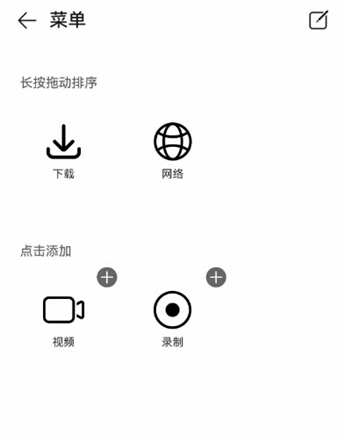

# GridObjectSortComponent

更新时间：2026-04-20 06:34:33

来源：https://developer.huawei.com/consumer/cn/doc/harmonyos-references/ohos-arkui-advanced-gridobjectsortcomponent
**支持设备：** Phone / PC/2in1 / Tablet / Wearable / TV

网格对象排序组件，用于网格对象的编辑、拖动排序、新增和删除。


## 导入模块
**支持设备：** Phone / PC/2in1 / Tablet / Wearable / TV


```ts
import {
  GridObjectSortComponent,
  GridObjectSortComponentItem,
  GridObjectSortComponentOptions,
  GridObjectSortComponentType,
  SymbolGlyphModifier,
} from '@kit.ArkUI';
```


## 子组件
**支持设备：** Phone / PC/2in1 / Tablet / Wearable / TV

无


## GridObjectSortComponent
**支持设备：** Phone / PC/2in1 / Tablet / Wearable / TV

GridObjectSortComponent({options: GridObjectSortComponentOptions, dataList: Array<GridObjectSortComponentItem>, onSave: (select: Array<GridObjectSortComponentItem>, unselect: Array<GridObjectSortComponentItem>) => void, onCancel: () => void })

网格对象排序组件。

**装饰器类型：**@Component

**元服务API：** 从API version 12开始，该接口支持在元服务中使用。

**系统能力：** SystemCapability.ArkUI.ArkUI.Full

**设备行为差异：** 该接口在Wearable设备上使用时，应用程序运行异常，异常信息中提示接口未定义，在其他设备中可正常调用。


| 名称 | 类型 | 必填 | 装饰器类型 | 说明 |
| --- | --- | --- | --- | --- |
| options | [GridObjectSortComponentOptions](#gridobjectsortcomponentoptions) | 是 | @Prop | 组件配置信息。 |
| dataList | Array&lt;[GridObjectSortComponentItem](#gridobjectsortcomponentitem)&gt; | 是 | - | 传入的数据，最大长度为50，数据长度超过50，只会取前50的数据。 |
| onSave | (select: Array&lt;[GridObjectSortComponentItem](#gridobjectsortcomponentitem)&gt;, unselect: Array&lt;[GridObjectSortComponentItem](#gridobjectsortcomponentitem)&gt;) =&gt; void | 是 | - | 保存编辑排序的回调函数，返回编辑后的数据。 |
| onCancel | () =&gt; void | 是 | - | 取消保存数据的回调。 |


## GridObjectSortComponentOptions
**支持设备：** Phone / PC/2in1 / Tablet / Wearable / TV

网格对象排序组件的组件配置信息。

**元服务API：** 从API version 12开始，该接口支持在元服务中使用。

**系统能力：** SystemCapability.ArkUI.ArkUI.Full

**设备行为差异：** 该接口在Wearable设备上使用时，应用程序运行异常，异常信息中提示接口未定义，在其他设备中可正常调用。


| 名称 | 类型 | 只读 | 可选 | 说明 |
| --- | --- | --- | --- | --- |
| type | [GridObjectSortComponentType](#gridobjectsortcomponenttype) | 否 | 是 | 组件展示形态：文字\|图片+文字。 默认值：GridObjectSortComponentType.TEXT |
| imageSize | number \| [Resource](https://developer.huawei.com/consumer/cn/doc/harmonyos-references/ts-types#resource) | 否 | 是 | 图片的尺寸，单位vp。 取值范围：大于等于0。 默认值：56vp |
| normalTitle | [ResourceStr](https://developer.huawei.com/consumer/cn/doc/harmonyos-references/ts-types#resourcestr) | 否 | 是 | 未编辑状态下显示的标题。 默认值：频道。 |
| showAreaTitle | [ResourceStr](https://developer.huawei.com/consumer/cn/doc/harmonyos-references/ts-types#resourcestr) | 否 | 是 | 展示区域标题，第一个子标题。 默认值：长按拖动排序。 |
| addAreaTitle | [ResourceStr](https://developer.huawei.com/consumer/cn/doc/harmonyos-references/ts-types#resourcestr) | 否 | 是 | 添加区域标题，第二个子标题。 默认值：点击添加。 |
| editTitle | [ResourceStr](https://developer.huawei.com/consumer/cn/doc/harmonyos-references/ts-types#resourcestr) | 否 | 是 | 编辑状态下头部标题显示。 默认值：编辑。 |


## GridObjectSortComponentType
**支持设备：** Phone / PC/2in1 / Tablet / Wearable / TV

配置网格对象排序组件节点的类型，配置名称 IMAGE_TEXT 为图片文字类型，TEXT 为文字类型。

**元服务API：** 从API version 12开始，该接口支持在元服务中使用。

**系统能力：** SystemCapability.ArkUI.ArkUI.Full

**设备行为差异：** 该接口在Wearable设备上使用时，应用程序运行异常，异常信息中提示接口未定义，在其他设备中可正常调用。


| 名称 | 值 | 说明 |
| --- | --- | --- |
| IMAGE_TEXT | "image_text" | 图片文字类型。 |
| TEXT | "text" | 文字类型。 |


## GridObjectSortComponentItem
**支持设备：** Phone / PC/2in1 / Tablet / Wearable / TV

网格对象排序组件的组件数据配置信息。

**系统能力：** SystemCapability.ArkUI.ArkUI.Full

**设备行为差异：** 该接口在Wearable设备上使用时，应用程序运行异常，异常信息中提示接口未定义，在其他设备中可正常调用。


| 名称 | 类型 | 只读 | 可选 | 说明 |
| --- | --- | --- | --- | --- |
| id | number \| string | 否 | 否 | 数据id序号，不可重复。 默认值：空字符串。 元服务API： 从API version 12开始，该接口支持在元服务中使用。 |
| text | [ResourceStr](https://developer.huawei.com/consumer/cn/doc/harmonyos-references/ts-types#resourcestr) | 否 | 否 | 显示文本信息。 元服务API： 从API version 12开始，该接口支持在元服务中使用。 |
| selected | boolean | 否 | 否 | 是否已经被添加，已添加：true，未添加：false。 元服务API： 从API version 12开始，该接口支持在元服务中使用。 |
| url | [ResourceStr](https://developer.huawei.com/consumer/cn/doc/harmonyos-references/ts-types#resourcestr) | 否 | 是 | GridObjectSortComponentType类型为IMAGE_TEXT时，需要传入图片地址。 元服务API： 从API version 12开始，该接口支持在元服务中使用。 |
| symbolStyle18+ | [SymbolGlyphModifier](https://developer.huawei.com/consumer/cn/doc/harmonyos-references/universal-attributes-attribute-symbolglyphmodifier#symbolglyphmodifier) | 否 | 是 | GridObjectSortComponentType类型为IMAGE_TEXT时，需要传入Symbol图标资源。配置优先级高于url。 元服务API： 从API version 18开始，该接口支持在元服务中使用。 |
| order | number | 否 | 否 | 顺序序号。 取值范围：大于等于0。 默认值：0  元服务API： 从API version 12开始，该接口支持在元服务中使用。 |


## 事件
**支持设备：** Phone / PC/2in1 / Tablet / Wearable / TV

不支持[通用事件](https://developer.huawei.com/consumer/cn/doc/harmonyos-references/ts-component-general-events)。


## 示例
**支持设备：** Phone / PC/2in1 / Tablet / Wearable / TV

网格对象的编辑排序组件基础用法，涉及对组件配置信息初始化，数据初始化，保存、取消方法的使用。


```ts
import { GridObjectSortComponent, GridObjectSortComponentItem, GridObjectSortComponentOptions, GridObjectSortComponentType, SymbolGlyphModifier } from '@kit.ArkUI';

@Entry
@Component
struct Index {
  // 组件数据初始化。
  @State dataList: GridObjectSortComponentItem[] = [
  {
    id: 0,
    url: $r('sys.media.ohos_save_button_filled'),
    text: '下载',
    selected: true,
    order: 3
  },
  {
    id: 1,
    url: $r('sys.media.ohos_ic_public_web'),
    text: '网络',
    selected: true,
    order: 9
  },
  {
    id: 2,
    url: $r('sys.media.ohos_ic_public_video'),
    text: '视频',
    selected: false,
    order: 1
  },
  {
    id: 3,
    symbolStyle: new SymbolGlyphModifier($r('sys.symbol.record_circle')),
    text: '录制',
    selected: false,
    order: 4
  }
  ]

  // 组件配置信息初始化。
  @State option: GridObjectSortComponentOptions = {
    type: GridObjectSortComponentType.IMAGE_TEXT,
    imageSize: 45,
    normalTitle: '菜单',
    editTitle: '编辑',
    showAreaTitle: '长按拖动排序',
    addAreaTitle: '点击添加'
  }

  build() {
    Column() {
      GridObjectSortComponent({
        options: this.option,
        dataList: this.dataList,
        // 保存编辑排序的回调函数，返回编辑后的数据。
        onSave: (
        select: Array<GridObjectSortComponentItem>,
        unselect: Array<GridObjectSortComponentItem>
        ) => {
          // save ToDo
        },
        // 取消保存数据的回调。
        onCancel: () =>{
          // cancel ToDo
        }
      })
    }
  }
}
```


