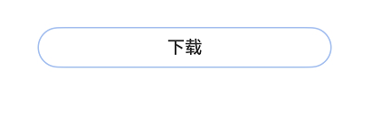
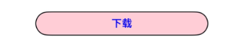

# ProgressButton

更新时间：2026-04-20 06:34:33

来源：https://developer.huawei.com/consumer/cn/doc/harmonyos-references/ohos-arkui-advanced-progressbutton
**支持设备：** Phone / PC/2in1 / Tablet / Wearable / TV

文本下载按钮，可显示具体下载进度。


## 导入模块
**支持设备：** Phone / PC/2in1 / Tablet / Wearable / TV


```ts
import { ProgressButton } from '@kit.ArkUI';
```


## ProgressButton
**支持设备：** Phone / PC/2in1 / Tablet / Wearable / TV

ProgressButton({progress: number, content: ResourceStr, progressButtonWidth?: Length, clickCallback: () => void, enable: boolean, colorOptions?: ProgressButtonColorOptions, progressButtonRadius?: LengthMetrics})

**装饰器类型：**@Component

**系统能力：** SystemCapability.ArkUI.ArkUI.Full

**设备行为差异：** 该接口在Wearable设备上使用时，应用程序运行异常，异常信息中提示接口未定义，在其他设备中可正常调用。


| 名称 | 类型 | 必填 | 装饰器类型 | 说明 |
| --- | --- | --- | --- | --- |
| progress | number | 是 | @Prop | 下载按钮的当前进度值。 取值范围：[0,100]。设置小于0的数值时置为0，设置大于100的数值时置为100。 默认值：0 元服务API： 从API version 11开始，该接口支持在元服务中使用。 |
| content | [ResourceStr](https://developer.huawei.com/consumer/cn/doc/harmonyos-references/ts-types#resourcestr) | 是 | @Prop | 下载按钮的文本。 默认值：空字符串。 说明：最长显示组件宽度，超出部分用省略号代替。从API version 20开始，支持Resource类型。 元服务API： 从API version 11开始，该接口支持在元服务中使用。 |
| progressButtonWidth | [Length](https://developer.huawei.com/consumer/cn/doc/harmonyos-references/ts-types#length) | 否 | - | 下载按钮的宽度，单位vp。 取值范围：大于等于44vp。 默认值：44vp。当取值为非Resource类型且小于默认值或取值为非法值时，识别值为默认值。当取值为Resource类型且小于默认值时识别为默认值，为非法值时下载按钮的宽度显示为容器宽度的100%。 元服务API： 从API version 11开始，该接口支持在元服务中使用。 |
| clickCallback | () =&gt; void | 是 | - | 下载按钮的点击回调。 元服务API： 从API version 11开始，该接口支持在元服务中使用。 |
| enable | boolean | 是 | @Prop | 下载按钮是否可以点击。  true：可以点击。  false：不可点击。 元服务API： 从API version 11开始，该接口支持在元服务中使用。 |
| colorOptions18+ | [ProgressButtonColorOptions](#progressbuttoncoloroptions18) | 否 | @Prop | 下载按钮颜色。用于自定义按钮各部分的颜色（进度条、描边、文本、背景）。需要自定义颜色时传入此参数，不传入时使用系统默认配色方案。 元服务API： 从API version 18开始，该接口支持在元服务中使用。 |
| progressButtonRadius18+ | [LengthMetrics](https://developer.huawei.com/consumer/cn/doc/harmonyos-references/js-apis-arkui-graphics#lengthmetrics12) | 否 | @Prop | 下载按钮的圆角（不支持百分比百分比设置）。 取值范围：[0, height/2] 默认值：height/2 设置值小于0时按照0处理，设置其他非法数值时，按照默认值处理。当直接入参为undefined时，按照默认值处理，入参为LengthMetrics.vp时，建议传入具体数值，传入null/undefined会导致显示异常。  元服务API： 从API version 18开始，该接口支持在元服务中使用。 |


## ProgressButtonColorOptions18+
**支持设备：** Phone / PC/2in1 / Tablet / Wearable / TV

下载按钮颜色选项

**元服务API：** 从API version 18开始，该接口支持在元服务中使用。

**系统能力：** SystemCapability.ArkUI.ArkUI.Full

**设备行为差异：** 该接口在Wearable设备上使用时，应用程序运行异常，异常信息中提示接口未定义，在其他设备中可正常调用。


| 名称 | 类型 | 只读 | 可选 | 说明 |
| --- | --- | --- | --- | --- |
| progressColor | [ResourceColor](https://developer.huawei.com/consumer/cn/doc/harmonyos-references/ts-types#resourcecolor) | 否 | 是 | 进度条颜色。 默认值：#330A59F7 |
| borderColor | [ResourceColor](https://developer.huawei.com/consumer/cn/doc/harmonyos-references/ts-types#resourcecolor) | 否 | 是 | 按钮描边颜色。 默认值：#330A59F7 |
| textColor | [ResourceColor](https://developer.huawei.com/consumer/cn/doc/harmonyos-references/ts-types#resourcecolor) | 否 | 是 | 按钮文本颜色。 默认值：系统默认值（#CE000000） |
| backgroundColor | [ResourceColor](https://developer.huawei.com/consumer/cn/doc/harmonyos-references/ts-types#resourcecolor) | 否 | 是 | 按钮背景色。 默认值：\$r('sys.color.ohos_id_color_foreground_contrary') |


## 事件
**支持设备：** Phone / PC/2in1 / Tablet / Wearable / TV

不支持[通用事件](https://developer.huawei.com/consumer/cn/doc/harmonyos-references/ts-component-general-events)。


## 示例
**支持设备：** Phone / PC/2in1 / Tablet / Wearable / TV


### 示例1（进度条下载按钮）

该示例实现了一个简单的带加载进度的文本下载按钮。


```ts
import { ProgressButton } from '@kit.ArkUI';

@Entry
@Component
struct Index {
  @State progressIndex: number = 0;
  @State textState: string = '下载';
  @State buttonWidth: number = 200;
  @State isRunning: boolean = false;
  @State enableState: boolean = true;

  build() {
    Column() {
      Scroll() {
        Column({ space: 20 }) {
          ProgressButton({
            progress: this.progressIndex,
            progressButtonWidth: this.buttonWidth,
            content: this.textState,
            enable: this.enableState,
            clickCallback: () => {
              if (this.textState && !this.isRunning && this.progressIndex < 100) {
                this.textState = '继续';
              }
              this.isRunning = !this.isRunning;
              let timer = setInterval(() => {
                if (this.isRunning) {
                  if (this.progressIndex === 100) {
                    clearInterval(timer);
                  } else {
                    this.progressIndex++;
                    if (this.progressIndex === 100) {
                      this.textState = '已完成';
                      this.enableState = false;
                    }
                  }
                } else {
                  clearInterval(timer);
                }
              }, 20)
            }
          })
      }.alignItems(HorizontalAlign.Center).width('100%').margin({ top: 20 })
      }
    }
  }
}
```




### 示例2（自定义颜色按钮）

该示例实现了一个简单的自定义颜色的文本下载按钮。


```ts
import { ProgressButton } from '@kit.ArkUI';

@Entry
@Component
struct Index {
  @State progressIndex: number = 0;
  @State textState: string = '下载';
  @State buttonWidth: number = 200;
  @State isRunning: boolean = false;
  @State enableState: boolean = true;

  build() {
    Column() {
      Scroll() {
        Column({ space: 20 }) {
          ProgressButton({
            // 设置下载按钮颜色
            colorOptions: {
              progressColor: Color.Orange,
              borderColor: Color.Black,
              textColor: Color.Blue,
              backgroundColor: Color.Pink
            },
            progress: this.progressIndex,
            progressButtonWidth: this.buttonWidth,
            content: this.textState,
            enable: this.enableState,
            clickCallback: () => {
              if (this.textState && !this.isRunning && this.progressIndex < 100) {
                this.textState = '继续';
              }
              this.isRunning = !this.isRunning;
              let timer = setInterval(() => {
                if (this.isRunning) {
                  if (this.progressIndex === 100) {
                    clearInterval(timer);
                  } else {
                    this.progressIndex++;
                    if (this.progressIndex === 100) {
                      this.textState = '已完成';
                      this.enableState = false;
                    }
                  }
                } else {
                  clearInterval(timer);
                }
              }, 20)
            }
          })
      }.alignItems(HorizontalAlign.Center).width('100%').margin({ top: 20 })
      }
    }
  }
}
```




### 示例3（自定义圆角按钮）

该示例实现了一个简单的自定义圆角的文本下载按钮。


```ts
import { ProgressButton, LengthMetrics } from '@kit.ArkUI';

@Entry
@Component
struct Index {
  @State progressIndex: number = 0;
  @State textState: string = '下载';
  @State buttonWidth: number = 200;
  @State isRunning: boolean = false;
  @State enableState: boolean = true;

  build() {
    Column() {
      Scroll() {
        Column({ space: 20 }) {
          ProgressButton({
            progressButtonRadius: LengthMetrics.vp(8), // 自定义圆角值为8vp
            progress: this.progressIndex,
            progressButtonWidth: this.buttonWidth,
            content: this.textState,
            enable: this.enableState,
            clickCallback: () => {
              if (this.textState && !this.isRunning && this.progressIndex < 100) {
                this.textState = '继续';
              }
              this.isRunning = !this.isRunning;
              let timer = setInterval(() => {
                if (this.isRunning) {
                  if (this.progressIndex === 100) {
                    clearInterval(timer);
                  } else {
                    this.progressIndex++;
                    if (this.progressIndex === 100) {
                      this.textState = '已完成';
                      this.enableState = false;
                    }
                  }
                } else {
                  clearInterval(timer);
                }
              }, 20)
            }
          })
      }.alignItems(HorizontalAlign.Center).width('100%').margin({ top: 20 })
      }
    }
  }
}
```


