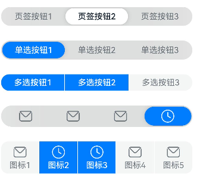
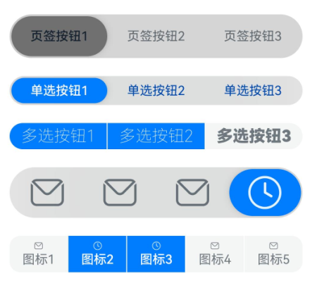
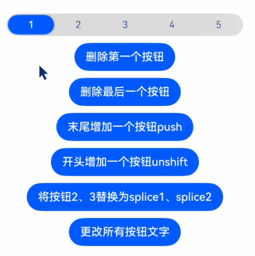
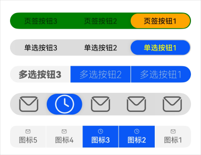
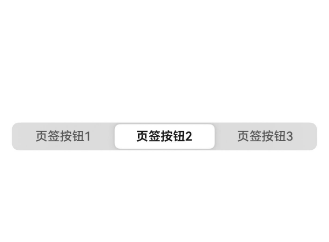
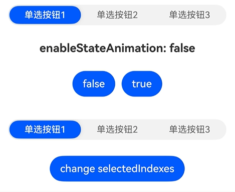

# SegmentButton

更新时间：2026-04-30 02:41:24

来源：https://developer.huawei.com/consumer/cn/doc/harmonyos-references/ohos-arkui-advanced-segmentbutton
**支持设备：** Phone / PC/2in1 / Tablet / Wearable / TV

分段按钮组件包含页签类分段按钮、胶囊类单选分段按钮和胶囊类多选分段按钮。


> [!NOTE]
> 该组件从API version 11开始支持。后续版本如有新增内容，则采用上角标单独标记该内容的起始版本。


## 导入模块
**支持设备：** Phone / PC/2in1 / Tablet / Wearable / TV


```ts
import {
  SegmentButton,
  SegmentButtonOptions,
  SegmentButtonItemOptionsArray,
} from '@kit.ArkUI';
```


## 子组件
**支持设备：** Phone / PC/2in1 / Tablet / Wearable / TV

无


## 属性
**支持设备：** Phone / PC/2in1 / Tablet / Wearable / TV

不支持[通用属性](https://developer.huawei.com/consumer/cn/doc/harmonyos-references/ts-component-general-attributes)。


## 事件
**支持设备：** Phone / PC/2in1 / Tablet / Wearable / TV

不支持[通用事件](https://developer.huawei.com/consumer/cn/doc/harmonyos-references/ts-component-general-events)。


## SegmentButton
**支持设备：** Phone / PC/2in1 / Tablet / Wearable / TV

SegmentButton({ options: SegmentButtonOptions, selectedIndexes: number[], onItemClicked: Callback<number>, maxFontScale: number | Resource, enableStateAnimation: boolean })

**装饰器类型：**@Component

**系统能力：** SystemCapability.ArkUI.ArkUI.Full

**设备行为差异：** 该接口在Wearable设备上使用时，应用程序运行异常，异常信息中提示接口未定义，在其他设备中可正常调用。


| 名称 | 类型 | 必填 | 装饰器类型 | 说明 |
| --- | --- | --- | --- | --- |
| options | [SegmentButtonOptions](#segmentbuttonoptions) | 是 | @ObjectLink | 分段按钮选项。          元服务API： 从API version 12开始，该接口支持在元服务中使用。 |
| selectedIndexes | number[] | 是 | @Link | 分段按钮的选中项编号，第一项的编号为0，之后顺序增加。          说明：          selectedIndexes使用[@Link装饰器：父子双向同步](https://developer.huawei.com/consumer/cn/doc/harmonyos-guides/arkts-link)，仅支持有效的按钮编号（第一个按钮编号为0，之后按顺序累加），如没有选中项可传入空数组[]。          元服务API： 从API version 12开始，该接口支持在元服务中使用。 |
| onItemClicked13+ | Callback&lt;number&gt; | 否 | - | 当分段按钮选项被点击时，触发的回调函数接收被点击的选项下标作为参数。若不传入此参数，则点击时不触发回调。          元服务API： 从API version 13开始，该接口支持在元服务中使用。 |
| maxFontScale14+ | number \| [Resource](https://developer.huawei.com/consumer/cn/doc/harmonyos-references/ts-types#resource) | 否 | @Prop | 分段按钮选项文字的最大字体放大倍数。          取值范围：[1, 2]          当设置的值小于1时，按值为1处理，设置的值大于2时，按值为2处理。          元服务API： 从API version 14开始，该接口支持在元服务中使用。 |
| enableStateAnimation24+ | boolean | 否 | @Prop | 设置当通过变量修改selectedIndex值时，是否开启分段按钮的属性动画。          true表示开启分段按钮的属性动画；false表示不开启分段���钮的属性动画，使用原有动画。          默认值：false          元服务API： 从API version 24开始，该接口支持在元服务中使用。          模型约束： 此接口仅可在Stage模型下使用。 |


## SegmentButtonOptions
**支持设备：** Phone / PC/2in1 / Tablet / Wearable / TV


> [!NOTE]
> 不支持设置字体类型。

分段按钮选项类用于提供初始数据和自定义属性。

**装饰器类型：** @Observed


### 属性
**支持设备：** Phone / PC/2in1 / Tablet / Wearable / TV

**系统能力：** SystemCapability.ArkUI.ArkUI.Full

**设备行为差异：** 该接口在Wearable设备上使用时，应用程序运行异常，异常信息中提示接口未定义，在其他设备中可正常调用。


| 名称 | 类型 | 只读 | 可选 | 说明 |
| --- | --- | --- | --- | --- |
| type | "tab" \|"capsule" | 否 | 否 | 分段按钮组件的类型。          说明：          "tab"：页签类分段按钮，适用于页面或内容区域的切换场景。          "capsule"：胶囊类分段按钮，适用于单选或多选的选择场景。          元服务API： 从API version 12开始，该接口支持在元服务中使用。 |
| multiply | boolean | 否 | 否 | 分段按钮组件是否可以多选。          true: 可多选；false: 不可多选。页签类分段按钮只支持单选，设置multiply为true不生效。          值为undefined时，分段按钮不支持多选。          元服务API： 从API version 12开始，该接口支持在元服务中使用。 |
| buttons | [SegmentButtonItemOptionsArray](#segmentbuttonitemoptionsarray) | 否 | 否 | 分段按钮组件的按钮信息，包括图标和文本信息。          元服务API： 从API version 12开始，该接口支持在元服务中使用。 |
| fontColor | [ResourceColor](https://developer.huawei.com/consumer/cn/doc/harmonyos-references/ts-types#resourcecolor) | 否 | 否 | 分段按钮组件的按钮未选中态的文本颜色。          值为undefined时，颜色为\$r('sys.color.ohos_id_color_text_secondary')。          元服务API： 从API version 12开始，该接口支持在元服务中使用。 |
| selectedFontColor | [ResourceColor](https://developer.huawei.com/consumer/cn/doc/harmonyos-references/ts-types#resourcecolor) | 否 | 否 | 分段按钮组件的按钮选中态的文本颜色。          值为undefined时，type为"tab"时，颜色为\$r('sys.color.ohos_id_color_text_primary')。          type为"capsule"时，颜色为\$r('sys.color.ohos_id_color_foreground_contrary')。          元服务API： 从API version 12开始，该接口支持在元服务中使用。 |
| fontSize | [DimensionNoPercentage](#dimensionnopercentage) | 否 | 否 | 分段按钮组件的按钮未选中态的字体大小，不支持百分比设置。          值为undefined时，字体大小为\$r('sys.float.ohos_id_text_size_body2')。          元服务API： 从API version 12开始，该接口支持在元服务中使用。 |
| selectedFontSize | [DimensionNoPercentage](#dimensionnopercentage) | 否 | 否 | 分段按钮组件的按钮选中态的字体大小，不支持百分比设置。          值为undefined时，字体大小为\$r('sys.float.ohos_id_text_size_body2')。          元服务API： 从API version 12开始，该接口支持在元服务中使用。 |
| fontWeight | [FontWeight](https://developer.huawei.com/consumer/cn/doc/harmonyos-references/ts-appendix-enums#fontweight) | 否 | 否 | 分段按钮组件的按钮未选中态的字体粗细。          值为undefined时，字体粗细为FontWeight.Regular。          元服务API： 从API version 12开始，该接口支持在元服务中使用。 |
| selectedFontWeight | [FontWeight](https://developer.huawei.com/consumer/cn/doc/harmonyos-references/ts-appendix-enums#fontweight) | 否 | 否 | 分段按钮组件的按钮选中态的字体粗细。          值为undefined时，字体粗细为FontWeight.Medium。          元服务API： 从API version 12开始，该接口支持在元服务中使用。 |
| backgroundColor | [ResourceColor](https://developer.huawei.com/consumer/cn/doc/harmonyos-references/ts-types#resourcecolor) | 否 | 否 | 分段按钮组件的背景板颜色。          值为undefined时，背景板颜色为\$r('sys.color.ohos_id_color_button_normal')。          元服务API： 从API version 12开始，该接口支持在元服务中使用。 |
| selectedBackgroundColor | [ResourceColor](https://developer.huawei.com/consumer/cn/doc/harmonyos-references/ts-types#resourcecolor) | 否 | 否 | 分段按钮组件的按钮选中态背景板颜色。          值为undefined时，type为"tab"时，背景板颜色为\$r('sys.color.segment_button_checked_foreground_color')。          type为"capsule"时，背景板颜色为\$r('sys.color.ohos_id_color_emphasize')。          元服务API： 从API version 12开始，该接口支持在元服务中使用。 |
| imageSize | [SizeOptions](https://developer.huawei.com/consumer/cn/doc/harmonyos-references/ts-types#sizeoptions) | 否 | 否 | 分段按钮组件的图片尺寸。          值为undefined时，图片尺寸为{ width: 24, height: 24 }。          单位：vp          说明：          imageSize属性对仅图标按钮和图标+文本按钮生效，对仅文字按钮无效果。          元服务API： 从API version 12开始，该接口支持在元服务中使用。 |
| buttonPadding | [Padding](https://developer.huawei.com/consumer/cn/doc/harmonyos-references/ts-types#padding) \| [Dimension](https://developer.huawei.com/consumer/cn/doc/harmonyos-references/ts-types#dimension10) | 否 | 否 | 分段按钮组件的按钮内边距。          值为undefined时，仅图标按钮和仅文字按钮内边距：{ top: 4, right: 8, bottom: 4, left: 8 }          图标+文本按钮内边距：{ top: 6, right: 8, bottom: 6, left: 8 }          单位：vp          元服务API： 从API version 12开始，该接口支持在元服务中使用。 |
| textPadding | [Padding](https://developer.huawei.com/consumer/cn/doc/harmonyos-references/ts-types#padding) \| [Dimension](https://developer.huawei.com/consumer/cn/doc/harmonyos-references/ts-types#dimension10) | 否 | 否 | 分段按钮组件的文本内边距。          值为undefined时，文本内边距为0。          单位：vp          元服务API： 从API version 12开始，该接口支持在元服务中使用。 |
| localizedButtonPadding12+ | [LocalizedPadding](https://developer.huawei.com/consumer/cn/doc/harmonyos-references/ts-types#localizedpadding12) | 否 | 是 | 分段按钮组件的按钮内边距。          默认值：          仅图标按钮和仅文字按钮默认值：{ top: LengthMetrics.vp(4), end: LengthMetrics.vp(8), bottom: LengthMetrics.vp(4), start: LengthMetrics.vp(8) }          图标+文本按钮默认值：{ top: LengthMetrics.vp(6), end: LengthMetrics.vp(8), bottom: LengthMetrics.vp(6), start: LengthMetrics.vp(8) }          值为undefined时，按默认值处理。          元服务API： 从API version 12开始，该接口支持在元服务中使用。 |
| localizedTextPadding12+ | [LocalizedPadding](https://developer.huawei.com/consumer/cn/doc/harmonyos-references/ts-types#localizedpadding12) | 否 | 是 | 文本内边距。          默认值：0          值为undefined时，按默认值处理。          元服务API： 从API version 12开始，该接口支持在元服务中使用。 |
| direction12+ | [Direction](https://developer.huawei.com/consumer/cn/doc/harmonyos-references/ts-appendix-enums#direction) | 否 | 是 | 分段按钮组件的布局方向。          默认值：Direction.Auto          值为undefined时，按默认值处理。          元服务API： 从API version 12开始，该接口支持在元服务中使用。 |
| backgroundBlurStyle | [BlurStyle](https://developer.huawei.com/consumer/cn/doc/harmonyos-references/ts-universal-attributes-background#blurstyle9) | 否 | 否 | 分段按钮组件的背景模糊材质。          值为undefined时，背景模糊材质为BlurStyle.NONE。          元服务API： 从API version 12开始，该接口支持在元服务中使用。 |
| borderRadiusMode20+ | [BorderRadiusMode](#borderradiusmode20) | 否 | 是 | 边框圆角模式，用于控制圆角计算方式。          默认值：BorderRadiusMode.DEFAULT          值为undefined时，按默认值处理。          元服务API： 从API version 20开始，该接口支持在元服务中使用。 |
| backgroundBorderRadius20+ | [LengthMetrics](https://developer.huawei.com/consumer/cn/doc/harmonyos-references/js-apis-arkui-graphics#lengthmetrics12) | 否 | 是 | 分段按钮整体容器的边框圆角半径。          说明：          此属性仅在borderRadiusMode为BorderRadiusMode.CUSTOM时生效。          对于胶囊类多选按钮(type为"capsule"且multiply为true)，此属性不生效，需要用itemBorderRadius配置圆角。          圆角大小受组件尺寸限制，最大值为组件宽或高的一半，不支持百分比设置。          默认值：\$r('sys.float.segmentbutton_container_shape')          值为undefined时，按默认值处理。          元服务API： 从API version 20开始，该接口支持在元服务中使用。 |
| itemBorderRadius20+ | [LengthMetrics](https://developer.huawei.com/consumer/cn/doc/harmonyos-references/js-apis-arkui-graphics#lengthmetrics12) | 否 | 是 | 分段按钮中按钮项的边框圆角半径。          说明：          此属性仅在borderRadiusMode为BorderRadiusMode.CUSTOM时生效。          对于胶囊类多选按钮(type为"capsule"且multiply为true)，只能控制两端的选项圆角。          圆角大小受组件尺寸限制，最大值为组件宽或高的一半，不支持百分比设置。          默认值：\$r('sys.float.segmentbutton_selected_background_shape')          值为undefined时，按默认值处理。          元服务API： 从API version 20开始，该接口支持在元服务中使用。 |


### constructor
**支持设备：** Phone / PC/2in1 / Tablet / Wearable / TV

constructor(options: TabSegmentButtonOptions | CapsuleSegmentButtonOptions)

构造函数。

**元服务API：** 从API version 12开始，该接口支持在元服务中使用。

**系统能力：** SystemCapability.ArkUI.ArkUI.Full

**设备行为差异：** 该接口在Wearable设备上使用时，应用程序运行异常，异常信息中提示接口未定义，在其他设备中可正常调用。

**参数**


| 参数名 | 类型 | 必填 | 说明 |
| --- | --- | --- | --- |
| options | [TabSegmentButtonOptions](#tabsegmentbuttonoptions) \| [CapsuleSegmentButtonOptions](#capsulesegmentbuttonoptions) | 是 | 页签类或者胶囊类分段按钮信息。 |


### tab
**支持设备：** Phone / PC/2in1 / Tablet / Wearable / TV

static tab(options: TabSegmentButtonConstructionOptions): SegmentButtonOptions

创建SegmentButtonOptions类，用于定义页签。

**元服务API：** 从API version 12开始，该接口支持在元服务中使用。

**系统能力：** SystemCapability.ArkUI.ArkUI.Full

**设备行为差异：** 该接口在Wearable设备上使用时，应用程序运行异常，异常信息中提示接口未定义，在其他设备中可正常调用。

**参数**


| 参数名 | 类型 | 必填 | 说明 |
| --- | --- | --- | --- |
| options | [TabSegmentButtonConstructionOptions](#tabsegmentbuttonconstructionoptions) | 是 | 页签类分段按钮信息。 |


**返回值：**


| 类型 | 说明 |
| --- | --- |
| [SegmentButtonOptions](#segmentbuttonoptions) | 分段按钮选项。 |


### capsule
**支持设备：** Phone / PC/2in1 / Tablet / Wearable / TV

static capsule(options: CapsuleSegmentButtonConstructionOptions): SegmentButtonOptions

创建胶囊类的SegmentButtonOptions。

**元服务API：** 从API version 12开始，该接口支持在元服务中使用。

**系统能力：** SystemCapability.ArkUI.ArkUI.Full

**设备行为差异：** 该接口在Wearable设备上使用时，应用程序运行异常，异常信息中提示接口未定义，在其他设备中可正常调用。

**参数**


| 参数名 | 类型 | 必填 | 说明 |
| --- | --- | --- | --- |
| options | [CapsuleSegmentButtonConstructionOptions](#capsulesegmentbuttonconstructionoptions) | 是 | 胶囊类分段按钮信息。 |


**返回值：**


| 类型 | 说明 |
| --- | --- |
| [SegmentButtonOptions](#segmentbuttonoptions) | 分段按钮选项。 |


## DimensionNoPercentage
**支持设备：** Phone / PC/2in1 / Tablet / Wearable / TV

type DimensionNoPercentage = PX | VP | FP | LPX | Resource

不支持百分比类型的长度联合类型。

**元服务API：** 从API version 12开始，该接口支持在元服务中使用。

**系统能力：** SystemCapability.ArkUI.ArkUI.Full

**设备行为差异：** 该接口在Wearable设备上使用时，应用程序运行异常，异常信息中提示接口未定义，在其他设备中可正常调用。


| 类型 | 说明 |
| --- | --- |
| [PX](https://developer.huawei.com/consumer/cn/doc/harmonyos-references/ts-types#px10) | 长度类型，用于描述以px为单位的长度。 |
| [VP](https://developer.huawei.com/consumer/cn/doc/harmonyos-references/ts-types#vp10) | 长度类型，用于描述以vp为单位的长度。 |
| [FP](https://developer.huawei.com/consumer/cn/doc/harmonyos-references/ts-types#fp10) | 长度类型，用于描述以fp为单位的长度。 |
| [LPX](https://developer.huawei.com/consumer/cn/doc/harmonyos-references/ts-types#lpx10) | 长度类型，用于描述以lpx为单位的长度。 |
| [Resource](https://developer.huawei.com/consumer/cn/doc/harmonyos-references/ts-types#resource) | 资源引用类型，用于设置组件属性的值。 |


## CommonSegmentButtonOptions
**支持设备：** Phone / PC/2in1 / Tablet / Wearable / TV

定义分段按钮组件的可自定义的属性。

**系统能力：** SystemCapability.ArkUI.ArkUI.Full

**设备行为差异：** 该接口在Wearable设备上使用时，应用程序运行异常，异常信息中提示接口未定义，在其他设备中可正常调用。


| 名称 | 类型 | 只读 | 可选 | 说明 |
| --- | --- | --- | --- | --- |
| fontColor | [ResourceColor](https://developer.huawei.com/consumer/cn/doc/harmonyos-references/ts-types#resourcecolor) | 否 | 是 | 按钮未选中态的文本颜色。          默认值：\$r('sys.color.ohos_id_color_text_secondary')          值为undefined时，按默认值处理。          元服务API： 从API version 12开始，该接口支持在元服务中使用。 |
| selectedFontColor | [ResourceColor](https://developer.huawei.com/consumer/cn/doc/harmonyos-references/ts-types#resourcecolor) | 否 | 是 | 按钮选中态的文本颜色。          默认值：          type为"tab"时，默认值为\$r('sys.color.ohos_id_color_text_primary')。          type为"capsule"时，默认值为\$r('sys.color.ohos_id_color_foreground_contrary')。          值为undefined时，按默认值处理。          元服务API： 从API version 12开始，该接口支持在元服务中使用。 |
| fontSize | [DimensionNoPercentage](#dimensionnopercentage) | 否 | 是 | 按钮未选中态的字体大小（不支持百分比设置）。          默认值：\$r('sys.float.ohos_id_text_size_body2')          值为undefined时，按默认值处理。          元服务API： 从API version 12开始，该接口支持在元服务中使用。 |
| selectedFontSize | [DimensionNoPercentage](#dimensionnopercentage) | 否 | 是 | 按钮选中态的字体大小（不支持百分比设置）。          默认值：\$r('sys.float.ohos_id_text_size_body2')          值为undefined时，按默认值处理。          元服务API： 从API version 12开始，该接口支持在元服务中使用。 |
| fontWeight | [FontWeight](https://developer.huawei.com/consumer/cn/doc/harmonyos-references/ts-appendix-enums#fontweight) | 否 | 是 | 按钮未选中态的字体粗细。          默认值：FontWeight.Regular          值为undefined时，按默认值处理。          元服务API： 从API version 12开始，该接口支持在元服务中使用。 |
| selectedFontWeight | [FontWeight](https://developer.huawei.com/consumer/cn/doc/harmonyos-references/ts-appendix-enums#fontweight) | 否 | 是 | 按钮选中态的字体粗细。          默认值：FontWeight.Medium          值为undefined时，按默认值处理。          元服务API： 从API version 12开始，该接口支持在元服务中使用。 |
| backgroundColor | [ResourceColor](https://developer.huawei.com/consumer/cn/doc/harmonyos-references/ts-types#resourcecolor) | 否 | 是 | 背景板颜色。          默认值：\$r('sys.color.ohos_id_color_button_normal')          值为undefined时，按默认值处理。          元服务API： 从API version 12开始，该接口支持在元服务中使用。 |
| selectedBackgroundColor | [ResourceColor](https://developer.huawei.com/consumer/cn/doc/harmonyos-references/ts-types#resourcecolor) | 否 | 是 | 按钮选中态的背景板颜色。          默认值：          type为"tab"时，默认值为\$r('sys.color.segment_button_checked_foreground_color')。          type为"capsule"时，默认值为\$r('sys.color.ohos_id_color_emphasize')。          值为undefined时，按默认值处理。          元服务API： 从API version 12开始，该接口支持在元服务中使用。 |
| imageSize | [SizeOptions](https://developer.huawei.com/consumer/cn/doc/harmonyos-references/ts-types#sizeoptions) | 否 | 是 | 图片尺寸。          默认值：{ width: 24, height: 24 }          单位：vp          值为undefined时，按默认值处理。          说明：          imageSize属性仅对图标按钮和图标+文本按钮生效，对纯文本按钮无效果。          元服务API： 从API version 12开始，该接口支持在元服务中使用。 |
| buttonPadding | [Padding](https://developer.huawei.com/consumer/cn/doc/harmonyos-references/ts-types#padding) \| [Dimension](https://developer.huawei.com/consumer/cn/doc/harmonyos-references/ts-types#dimension10) | 否 | 是 | 按钮内边距。          默认值：          仅图标按钮和仅文字按钮默认值：{ top: 4, right: 8, bottom: 4, left: 8 }          图标+文本按钮默认值：{ top: 6, right: 8, bottom: 6, left: 8 }          单位：vp          值为undefined时，按默认值处理。          元服务API： 从API version 12开始，该接口支持在元服务中使用。 |
| textPadding | [Padding](https://developer.huawei.com/consumer/cn/doc/harmonyos-references/ts-types#padding) \| [Dimension](https://developer.huawei.com/consumer/cn/doc/harmonyos-references/ts-types#dimension10) | 否 | 是 | 文本内边距。          默认值：0          单位：vp          值为undefined时，按默认值处理。          元服务API： 从API version 12开始，该接口支持在元服务中使用。 |
| localizedButtonPadding12+ | [LocalizedPadding](https://developer.huawei.com/consumer/cn/doc/harmonyos-references/ts-types#localizedpadding12) | 否 | 是 | 按钮内边距。          默认值：          仅图标按钮和仅文字按钮默认值：{ top: LengthMetrics.vp(4), end: LengthMetrics.vp(8), bottom: LengthMetrics.vp(4), start: LengthMetrics.vp(8) }          图标+文本按钮默认值：{ top: LengthMetrics.vp(6), end: LengthMetrics.vp(8), bottom: LengthMetrics.vp(6), start: LengthMetrics.vp(8) }          值为undefined时，按默认值处理。          元服务API： 从API version 12开始，该接口支持在元服务中使用。 |
| localizedTextPadding12+ | [LocalizedPadding](https://developer.huawei.com/consumer/cn/doc/harmonyos-references/ts-types#localizedpadding12) | 否 | 是 | 文本内边距。          默认值：0          单位：vp          值为undefined时，按默认值处理。          元服务API： 从API version 12开始，该接口支持在元服务中使用。 |
| direction12+ | [Direction](https://developer.huawei.com/consumer/cn/doc/harmonyos-references/ts-appendix-enums#direction) | 否 | 是 | 布局方向。          默认值：Direction.Auto          值为undefined时，按默认值处理。          元服务API： 从API version 12开始，该接口支持在元服务中使用。 |
| backgroundBlurStyle | [BlurStyle](https://developer.huawei.com/consumer/cn/doc/harmonyos-references/ts-universal-attributes-background#blurstyle9) | 否 | 是 | 背景模糊材质。          默认值：BlurStyle.NONE          值为undefined时，按默认值处理。          元服务API： 从API version 12开始，该接口支持在元服务中使用。 |
| borderRadiusMode20+ | [BorderRadiusMode](#borderradiusmode20) | 否 | 是 | 边框圆角模式，用于控制圆角计算方式。          默认值：BorderRadiusMode.DEFAULT          值为undefined时，按默认值处理。          元服务API： 从API version 20开始，该接口支持在元服务中使用。 |
| backgroundBorderRadius20+ | [LengthMetrics](https://developer.huawei.com/consumer/cn/doc/harmonyos-references/js-apis-arkui-graphics#lengthmetrics12) | 否 | 是 | 分段按钮整体容器的边框圆角半径。          说明：          此属性仅在borderRadiusMode为BorderRadiusMode.CUSTOM时生效。          对于胶囊类多选按钮(type为"capsule"且multiply为true)，此属性不生效，需要用itemBorderRadius配置圆角。          圆角大小受组件尺寸限制，最大值为组件宽或高的一半，不支持百分比设置。          默认值：\$r('sys.float.segmentbutton_container_shape')          值为undefined时，按默认值处理。          元服务API： 从API version 20开始，该接口支持在元服务中使用。 |
| itemBorderRadius20+ | [LengthMetrics](https://developer.huawei.com/consumer/cn/doc/harmonyos-references/js-apis-arkui-graphics#lengthmetrics12) | 否 | 是 | 分段按钮中按钮项的边框圆角半径。          说明：          此属性仅在borderRadiusMode为BorderRadiusMode.CUSTOM时生效。          对于胶囊类多选按钮(type为"capsule"且multiply为true)，只能控制两端的选项圆角。          圆角大小受组件尺寸限制，最大值为组件宽或高的一半，不支持百分比设置。          默认值：\$r('sys.float.segmentbutton_selected_background_shape')          值为undefined时，按默认值处理。          元服务API： 从API version 20开始，该接口支持在元服务中使用。 |


## BorderRadiusMode20+
**支持设备：** Phone / PC/2in1 / Tablet / Wearable / TV

边框圆角模式枚举，用于控制分段按钮的圆角计算方式。

**元服务API：** 从API version 20开始，该接口支持在元服务中使用。

**系统能力：** SystemCapability.ArkUI.ArkUI.Full

**设备行为差异：** 该接口在Wearable设备上使用时��应用程序运行异常，异常信息中提示接口未定义，在其他设备中可正常调用。


| 名称 | 值 | 说明 |
| --- | --- | --- |
| DEFAULT | 0 | 默认模式，框架自动计算边框圆角。 |
| CUSTOM | 1 | 自定义模式，开发者设置边框圆角。 |


## TabSegmentButtonConstructionOptions
**支持设备：** Phone / PC/2in1 / Tablet / Wearable / TV

构建页签类的SegmentButtonOptions对象。

继承[CommonSegmentButtonOptions](#commonsegmentbuttonoptions)。

**元服务API：** 从API version 12开始，该接口支持在元服务中使用。

**系统能力：** SystemCapability.ArkUI.ArkUI.Full

**设备行为差异：** 该接口在Wearable设备上使用时，应用程序运行异常，异常信息中提示接口未定义，在其他设备中可正常调用。


| 名称 | 类型 | 只读 | 可选 | 说明 |
| --- | --- | --- | --- | --- |
| buttons | [ItemRestriction](#itemrestriction)&lt;[SegmentButtonTextItem](#segmentbuttontextitem)&gt; | 否 | 否 | 按钮信息。 |


## CapsuleSegmentButtonConstructionOptions
**支持设备：** Phone / PC/2in1 / Tablet / Wearable / TV

用于构建胶囊类的SegmentButtonOptions对象。

继承[CommonSegmentButtonOptions](#commonsegmentbuttonoptions)。

**元服务API：** 从API version 12开始，该接口支持在元服务中使用。

**系统能力：** SystemCapability.ArkUI.ArkUI.Full

**设备行为差异：** 该接口在Wearable设备上使用时，应用程序运行异常，异常信息中提示接口未定义，在其他设备中可正常调用。


| 名称 | 类型 | 只读 | 可选 | 说明 |
| --- | --- | --- | --- | --- |
| buttons | [SegmentButtonItemTuple](#segmentbuttonitemtuple) | 否 | 否 | 按钮信息。 |
| multiply | boolean | 否 | 是 | 是否可以多选。          默认值：false          值为undefined时，按默认值处理。          true表示可以多选，false表示不可以多选。 |


## ItemRestriction
**支持设备：** Phone / PC/2in1 / Tablet / Wearable / TV

type ItemRestriction<T> = [T, T, T?, T?, T?]

保存按钮信息的元组类型。

**元服务API：** 从API version 12开始，该接口支持在元服务中使用。

**系统能力：** SystemCapability.ArkUI.ArkUI.Full

**设备行为差异：** 该接口在Wearable设备上使用时，应用程序运行异常，异常信息中提示接口未定义，在其他设备中可正常调用。


| 类型 | 说明 |
| --- | --- |
| [T, T, T?, T?, T?] | 表示包含2~5个相同类型元素的元组。 |


> [!NOTE]
> 分段按钮组件仅支持2到5个按钮。


## SegmentButtonItemTuple
**支持设备：** Phone / PC/2in1 / Tablet / Wearable / TV

type SegmentButtonItemTuple = ItemRestriction<SegmentButtonTextItem> | ItemRestriction<SegmentButtonIconItem> | ItemRestriction<SegmentButtonIconTextItem>

用于保存按钮信息的元组的联合类型。

**元服务API：** 从API version 12开始，该接口支持在元服务中使用。

**系统能力：** SystemCapability.ArkUI.ArkUI.Full

**设备行为差异：** 该接口在Wearable设备上使用时，应用程序运行异常，异常信息中提示接口未定义，在其他设备中可正常调用。


| 类型 | 说明 |
| --- | --- |
| [ItemRestriction](#itemrestriction)&lt;[SegmentButtonTextItem](#segmentbuttontextitem)&gt; | 仅文本按钮信息的元组。 |
| [ItemRestriction](#itemrestriction)&lt;[SegmentButtonIconItem](#segmentbuttoniconitem)&gt; | 仅图标按钮信息的元组。 |
| [ItemRestriction](#itemrestriction)&lt;[SegmentButtonIconTextItem](#segmentbuttonicontextitem)&gt; | 图标+文本按钮信息的元组。 |


## SegmentButtonItemArray
**支持设备：** Phone / PC/2in1 / Tablet / Wearable / TV

type SegmentButtonItemArray = Array<SegmentButtonTextItem> | Array<SegmentButtonIconItem> | Array<SegmentButtonIconTextItem>

用于保存按钮信息的数组的联合类型。

**元服务API：** 从API version 12开始，该接口支持在元服务中使用。

**系统能力：** SystemCapability.ArkUI.ArkUI.Full

**设备行为差异：** 该接口在Wearable设备上使用时，应用程序运行异常，异常信息中提示接口未定义，在其他设备中可正常调用。


| 类型 | 说明 |
| --- | --- |
| Array&lt;[SegmentButtonTextItem](#segmentbuttontextitem)&gt; | 仅文本按钮信息的数组。 |
| Array&lt;[SegmentButtonIconItem](#segmentbuttoniconitem)&gt; | 仅图标按钮信息的数组。 |
| Array&lt;[SegmentButtonIconTextItem](#segmentbuttonicontextitem)&gt; | 图标+文本按钮信息的数组。 |


## SegmentButtonItemOptionsArray
**支持设备：** Phone / PC/2in1 / Tablet / Wearable / TV

用于保存按钮信息的数组。

**装饰器类型：** @Observed


> [!NOTE]
> SegmentButtonItemOptionsArray仅支持保存2到5个按钮信息元素。


### constructor
**支持设备：** Phone / PC/2in1 / Tablet / Wearable / TV

constructor(elements: SegmentButtonItemTuple)

构造函数。

**元服务API：** 从API version 12开始，该接口支持在元服务中使用。

**系统能力：** SystemCapability.ArkUI.ArkUI.Full

**设备行为差异：** 该接口在Wearable设备上使用时，应用程序运行异常，异常信息中提示接口未定义，在其他设备中可正常调用。

**参数：**


| 参数名 | 类型 | 必填 | 说明 |
| --- | --- | --- | --- |
| elements | [SegmentButtonItemTuple](#segmentbuttonitemtuple) | 是 | 按钮信息。 |


### push
**支持设备：** Phone / PC/2in1 / Tablet / Wearable / TV

push(...items: SegmentButtonItemArray): number

在数组末尾添加新的元素，返回添加元素后数组的长度。

**元服务API：** 从API version 12开始，该接口支持在元服务中使用。

**系统能力：** SystemCapability.ArkUI.ArkUI.Full

**设备行为差异：** 该接口在Wearable设备上使用时，应用程序运行异常，异常信息中提示接口未定义，在其他设备中可正常调用。

**参数：**


| 参数名 | 类型 | 必填 | 说明 |
| --- | --- | --- | --- |
| items | [SegmentButtonItemArray](#segmentbuttonitemarray) | 否 | 被添加的按钮信息数组。          默认值：0个被添加的按钮信息数组。 |


**返回值：**


| 类型 | 说明 |
| --- | --- |
| number | 添加元素后数组的长度。 |


> [!NOTE]
> 分段按钮组件数组仅支持保存2到5个按钮信息，若超过分段按钮组件数量个数的限制，添加按钮信息元素失败。


### pop
**支持设备：** Phone / PC/2in1 / Tablet / Wearable / TV

pop(): SegmentButtonItemOptions | undefined

移除数组末尾最后一个元素，返回被移除的元素。

**元服务API：** 从API version 12开始，该接口支持在元服务中使用。

**系统能力：** SystemCapability.ArkUI.ArkUI.Full

**设备行为差异：** 该接口在Wearable设备上使用时，应用程序运行异常，异常信息中提示接口未定义，在其他设备中可正常调用。

**返回值：**


| 类型 | 说明 |
| --- | --- |
| [SegmentButtonItemOptions](#segmentbuttonitemoptions) \| undefined | 被移除的元素。 |


> [!NOTE]
> 分段按钮组件数组仅支持保存2到5个按钮信息，若移除后按钮组件数量不在个数限制范围内，移除按钮信息元素失败。


### shift
**支持设备：** Phone / PC/2in1 / Tablet / Wearable / TV

shift(): SegmentButtonItemOptions | undefined

移除数组开头第一个元素，返回被移除的元素。

**元服务API：** 从API version 12开始，该接口支持在元服务中使用。

**系统能力：** SystemCapability.ArkUI.ArkUI.Full

**设备行为差异：** 该接口在Wearable设备上使用时，应用程序运行异常，异常信息中提示接口未定义，在其他设备中可正常调用。

**返回值：**


| 类型 | 说明 |
| --- | --- |
| [SegmentButtonItemOptions](#segmentbuttonitemoptions) \| undefined | 被移除的元素。 |


> [!NOTE]
> 分段按钮组件数组仅支持保存2到5个按钮信息，若移除后按钮组件数量不在个数限制范围内，移除按钮信息元素失败。


### unshift
**支持设备：** Phone / PC/2in1 / Tablet / Wearable / TV

unshift(...items: SegmentButtonItemArray): number

在数组开头添加一个新的元素，返回添加元素后数组的长度。

**元服务API：** 从API version 12开始，该接口支持在元服务中使用。

**系统能力：** SystemCapability.ArkUI.ArkUI.Full

**设备行为差异：** 该接口在Wearable设备上使用时，应用程序运行异常，异常信息中提示接口未定义，在其他设备中可正常调用。

**参数：**


| 参数名 | 类型 | 必填 | 说明 |
| --- | --- | --- | --- |
| items | [SegmentButtonItemArray](#segmentbuttonitemarray) | 否 | 添加的按钮信息数组。          默认值：0个被添加的按钮信息数组。 |


**返回值：**


| 类型 | 说明 |
| --- | --- |
| number | 添加元素后数组的长度。 |


> [!NOTE]
> 分段按钮组件数组仅支持保存2到5个按钮信息，若超过分段按钮组件数量个数的限制，添加按钮信息元素失败。


### splice
**支持设备：** Phone / PC/2in1 / Tablet / Wearable / TV

splice(start: number, deleteCount: number, ...items: SegmentButtonItemOptions[]): SegmentButtonItemOptions[]

在数组中，删除从start位置开始的deleteCount数量的元素，并插入items中的元素，返回一个包含了被删除的元素的数组。

**元服务API：** 从API version 12开始，该接口支持在元服务中使用。

**系统能力：** SystemCapability.ArkUI.ArkUI.Full

**设备行为差异：** 该接口在Wearable设备上使用时，应用程序运行异常，异常信息中提示接口未定义，在其他设备中可正常调用。

**参数：**


| 参数名 | 类型 | 必填 | 说明 |
| --- | --- | --- | --- |
| start | number | 是 | 删除元素的起始位置。 |
| deleteCount | number | 是 | 删除元素的数量。 |
| items | [SegmentButtonItemOptions](#segmentbuttonitemoptions)[] | 否 | 从start开始要加入到数组中的元素。          默认值：不指定任何元素，将从数组中删除元素。 |


**返回值：**


| 类型 | 说明 |
| --- | --- |
| [SegmentButtonItemOptions](#segmentbuttonitemoptions)[] | 返回包含了被删除的元素的数组。 |


> [!NOTE]
> 分段按钮组件数组仅保存2到5个按钮信息，若超过分段按钮组件数量个数的限制，不再删除和替换按钮信息元素。


### create
**支持设备：** Phone / PC/2in1 / Tablet / Wearable / TV

static create(elements: SegmentButtonItemTuple): SegmentButtonItemOptionsArray

创建一个SegmentButtonItemOptionsArray对象。

**元服务API：** 从API version 12开始，该接口支持在元服务中使用。

**系统能力：** SystemCapability.ArkUI.ArkUI.Full

**设备行为差异：** 该接口在Wearable设备上使用时，应用程序运行异常，异常信息中提示接口未定义，在其他设备中可正常调用。

**参数：**


| 参数名 | 类型 | 必填 | 说明 |
| --- | --- | --- | --- |
| elements | [SegmentButtonItemTuple](#segmentbuttonitemtuple) | 是 | 按钮信息。 |


**返回值：**


| 类型 | 说明 |
| --- | --- |
| [SegmentButtonItemOptionsArray](#segmentbuttonitemoptionsarray) | 返回创建的SegmentButtonItemOptionsArray对象。 |


## TabSegmentButtonOptions
**支持设备：** Phone / PC/2in1 / Tablet / Wearable / TV

页签类分段按钮选项。继承自[TabSegmentButtonConstructionOptions](#tabsegmentbuttonconstructionoptions)。

**元服务API：** 从API version 12开始，该接口支持在元服务中使用。

**系统能力：** SystemCapability.ArkUI.ArkUI.Full

**设备行为差异：** 该接口在Wearable设备上使用时，应用程序运行异常，异常信息中提示接口未定义，在其他设备中可正常调用。


| 名称 | 类型 | 只读 | 可选 | 说明 |
| --- | --- | --- | --- | --- |
| type | "tab" | 否 | 否 | 类型为页签类分段按钮。 |


## CapsuleSegmentButtonOptions
**支持设备：** Phone / PC/2in1 / Tablet / Wearable / TV

胶囊类分段按钮选项。继承自[CapsuleSegmentButtonConstructionOptions](#capsulesegmentbuttonconstructionoptions)。

**元服务API：** 从API version 12开始，该接口支持在元服务中使用。

**系统能力：** SystemCapability.ArkUI.ArkUI.Full

**设备行为差异：** 该接口在Wearable设备上使用时，应用程序运行异常，异常信息中提示接口未定义，在其他设备中可正常调用。


| 名称 | 类型 | 只读 | 可选 | 说明 |
| --- | --- | --- | --- | --- |
| type | "capsule" | 否 | 否 | 类型为胶囊类分段按钮。 |


## SegmentButtonTextItem
**支持设备：** Phone / PC/2in1 / Tablet / Wearable / TV

文本按钮信息。

**系统能力：** SystemCapability.ArkUI.ArkUI.Full

**设备行为差异：** 该接口在Wearable设备上使用时，应用程序运行异常，异常信息中提示接口未定义，在其他设备中可正常调用。


| 名称 | 类型 | 只读 | 可选 | 说明 |
| --- | --- | --- | --- | --- |
| text | [ResourceStr](https://developer.huawei.com/consumer/cn/doc/harmonyos-references/ts-types#resourcestr) | 否 | 否 | 按钮文本。          元服务API： 从API version 12开始，该接口支持在元服务中使用。 |
| accessibilityLevel13+ | string | 否 | 是 | 无障碍重要性，控制当前组件是否可被无障碍辅助服务识别。          支持的值为:          "auto"：当前组件可被无障碍辅助服务所识别。          "yes"：当前组件可被无障碍辅助服务所识别。          "no"：当前组件不可被无障碍辅助服务所识别。          "no-hide-descendants"：当前组件及其所有子组件不可被无障碍辅助服务所识别。          默认值："auto"          值为undefined时，按默认值处理。          元服务API： 从API version 13开始，该接口支持在元服务中使用。 |
| accessibilityDescription13+ | [ResourceStr](https://developer.huawei.com/consumer/cn/doc/harmonyos-references/ts-types#resourcestr) | 否 | 是 | 无障碍说明，为用户解释组件操作，设置详细解释文本，帮助用户理解操作后果。若组件有文本和无障碍说明，选中时先播报文本，再播报无障碍说明。          默认值：空字符串。          值为undefined时，按默认值处理。          元服务API： 从API version 13开始，该接口支持在元服务中使用。 |


## SegmentButtonIconItem
**支持设备：** Phone / PC/2in1 / Tablet / Wearable / TV

图标按钮信息。

**系统能力：** SystemCapability.ArkUI.ArkUI.Full

**设备行为差异：** 该接口在Wearable设备上使用时，应用程序运行异常，异常信息中提示接口未定义，在其他设备中可正常调用。


| 名称 | 类型 | 只读 | 可选 | 说明 |
| --- | --- | --- | --- | --- |
| icon | [ResourceStr](https://developer.huawei.com/consumer/cn/doc/harmonyos-references/ts-types#resourcestr) | 否 | 否 | 未选中态的按钮图标。          值为undefined时，不显示图标。          元服务API： 从API version 12开始，该接口支持在元服务中使用。 |
| iconAccessibilityText13+ | [ResourceStr](https://developer.huawei.com/consumer/cn/doc/harmonyos-references/ts-types#resourcestr) | 否 | 是 | 未选中态按钮图标的无障碍文本。          默认值：空字符串。          值为undefined时，按默认值处理。          元服务API： 从API version 13开始，该接口支持在元服务中使用。 |
| selectedIcon | [ResourceStr](https://developer.huawei.com/consumer/cn/doc/harmonyos-references/ts-types#resourcestr) | 否 | 否 | 选中态的按钮图标。          值为undefined时，不显示图标。          元服务API： 从API version 12开始，该接口支持在元服务中使用。 |
| selectedIconAccessibilityText13+ | [ResourceStr](https://developer.huawei.com/consumer/cn/doc/harmonyos-references/ts-types#resourcestr) | 否 | 是 | 选中态按钮图标的无障碍文本。          默认值：空字符串。          值为undefined时，按默认值处理。          元服务API： 从API version 13开始，该接口支持在元服务中使用。 |
| accessibilityLevel13+ | string | 否 | 是 | 无障碍重要性，用于控制当前组件是否可被无障碍辅助服务所识别。          支持的值为:          "auto"：当前组件可被无障碍辅助服务所识别。          "yes"：当前组件可被无障碍辅助服务所识别。          "no"：当前组件不可被无障碍辅助服务所识别。          "no-hide-descendants"：当前组件及其所有子组件不可被无障碍辅助服务所识别。          默认值："auto"          值为undefined时，按默认值处理。          元服务API： 从API version 13开始，该接口支持在元服务中使用。 |
| accessibilityDescription13+ | [ResourceStr](https://developer.huawei.com/consumer/cn/doc/harmonyos-references/ts-types#resourcestr) | 否 | 是 | 无障碍说明，用于为用户进一步说明当前组件，开发人员可为组件的该属性设置相对较详细的解释文本，帮助用户理解将要执行的操作。如帮助用户理解将要执行的操作可能导致什么后果，尤其是当这些后果无法从组件本身属性与无障碍文本中了解到时。若组件既拥有文本属性又拥有无障碍说明属性，则组件被选中时，先播报组件的文本属性，再播报无障碍说明属性的内容。          默认值：空字符串。          值为undefined时，按默认值处理。          元服务API： 从API version 13开始，该接口支持在元服务中使用。 |


> [!NOTE]
> 未选中态的图标icon和选中态的图标selectedIcon都需设置，单独设置无效。


## SegmentButtonIconTextItem
**支持设备：** Phone / PC/2in1 / Tablet / Wearable / TV

图标与文本按钮信息。

**系统能力：** SystemCapability.ArkUI.ArkUI.Full

**设备行为差异：** 该接口在Wearable设备上使用时，应用程序运行异常，异常信息中提示接口未定义，在其他设备中可正常调用。


| 名称 | 类型 | 只读 | 可选 | 说明 |
| --- | --- | --- | --- | --- |
| icon | [ResourceStr](https://developer.huawei.com/consumer/cn/doc/harmonyos-references/ts-types#resourcestr) | 否 | 否 | 未选中态的按钮图标。          值为undefined时，不显示图标。          元服务API： 从API version 12开始，该接口支持在元服务中使用。 |
| iconAccessibilityText13+ | [ResourceStr](https://developer.huawei.com/consumer/cn/doc/harmonyos-references/ts-types#resourcestr) | 否 | 是 | 未选中态按钮图标的无障碍文本。          默认值：空字符串。          值为undefined时，按默认值处理。          元服务API： 从API version 13开始，该接口支持在元服务中使用。 |
| selectedIcon | [ResourceStr](https://developer.huawei.com/consumer/cn/doc/harmonyos-references/ts-types#resourcestr) | 否 | 否 | 选中态的按钮图标。          值为undefined时，不显示图标。          元服务API： 从API version 12开始，该接口支持在元服务中使用。 |
| selectedIconAccessibilityText13+ | [ResourceStr](https://developer.huawei.com/consumer/cn/doc/harmonyos-references/ts-types#resourcestr) | 否 | 是 | 选中态按钮图标的无障碍文本。          默认值：空字符串。          值为undefined时，按默认值处理。          元服务API： 从API version 13开始，该接口支持在元服务中使用。 |
| text | [ResourceStr](https://developer.huawei.com/consumer/cn/doc/harmonyos-references/ts-types#resourcestr) | 否 | 否 | 按钮文本。          值为undefined时，不显示文本内容。          元服务API： 从API version 12开始，该接口支持在元服务中使用。 |
| accessibilityLevel13+ | string | 否 | 是 | 无障碍重要性，用于控制当前组件是否可被无障碍辅助服务所识别。          支持的值为:          "auto"：当前组件可被无障碍辅助服务所识别。          "yes"：当前组件可被无障碍辅助服务所识别。          "no"：当前组件不可被无障碍辅助服务所识别。          "no-hide-descendants"：当前组件及其所有子组件不可被无障碍辅助服务所识别。          默认值："auto"          值为undefined时，按默认值处理。          元服务API： 从API version 13开始，该接口支持在元服务中使用。 |
| accessibilityDescription13+ | [ResourceStr](https://developer.huawei.com/consumer/cn/doc/harmonyos-references/ts-types#resourcestr) | 否 | 是 | 无障碍说明，用于为用户进一步说明当前组件，开发人员可为组件的该属性设置相对较详细的解释文本，帮助用户理解将要执行的操作。如帮助用户理解将要执行的操作可能导致什么后果，尤其是当这些后果无法从组件本身属性与无障碍文本中了解到时。若组件既拥有文本属性又拥有无障碍说明属性，则组件被选中时，先播报组件的文本属性，再播报无障碍说明属性的内容。          默认值：空字符串。          值为undefined时，按默认值处理。          元服务API： 从API version 13开始，该接口支持在元服务中使用。 |


> [!NOTE]
> 未选中态的图标icon和选中态的图标selectedIcon都需设置，单独设置无效。


## SegmentButtonItemOptions
**支持设备：** Phone / PC/2in1 / Tablet / Wearable / TV

分段按钮中的按钮选项。

**装饰器类型：** @Observed


### 属性
**支持设备：** Phone / PC/2in1 / Tablet / Wearable / TV

**系统能力：** SystemCapability.ArkUI.ArkUI.Full

**设备行为差异：** 该接口在Wearable设备上使用时，应用程序运行异常，异常信息中提示接口未定义，在其他设备中可正常调用。


| 名称 | 类型 | 只读 | 可选 | 说明 |
| --- | --- | --- | --- | --- |
| icon | [ResourceStr](https://developer.huawei.com/consumer/cn/doc/harmonyos-references/ts-types#resourcestr) | 否 | 是 | 未选中态的按钮图标。          默认值：不显示未选中态的按钮图标。          值为undefined时，按默认值处理。          元服务API： 从API version 12开始，该接口支持在元服务中使用。 |
| iconAccessibilityText13+ | [ResourceStr](https://developer.huawei.com/consumer/cn/doc/harmonyos-references/ts-types#resourcestr) | 否 | 是 | 未选中态按钮图标的无障碍文本。          默认值：空字符串。          值为undefined时，按默认值处理。          元服务API： 从API version 13开始，该接口支持在元服务中使用。 |
| selectedIcon | [ResourceStr](https://developer.huawei.com/consumer/cn/doc/harmonyos-references/ts-types#resourcestr) | 否 | 是 | 选中态的按钮图标。          默认值：不显示选中态按钮图标。          值为undefined时，按默认值处理。          元服务API： 从API version 12开始，该接口支持在元服务中使用。 |
| selectedIconAccessibilityText13+ | [ResourceStr](https://developer.huawei.com/consumer/cn/doc/harmonyos-references/ts-types#resourcestr) | 否 | 是 | 选中态按钮图标的无障碍文本。          默认值：空字符串。          值为undefined时，按默认值处理。          元服务API： 从API version 13开始，该接口支持在元服务中使用。 |
| text | [ResourceStr](https://developer.huawei.com/consumer/cn/doc/harmonyos-references/ts-types#resourcestr) | 否 | 是 | 按钮文本。          默认值：空字符串。          值为undefined时，按默认值处理。          元服务API： 从API version 12开始，该接口支持在元服务中使用。 |
| accessibilityLevel13+ | string | 否 | 是 | 无障碍重要性，用于控制当前组件是否可被无障碍辅助服务所识别。          支持的值为:          "auto"：当前组件可被无障碍辅助服务所识别。          "yes"：当前组件可被无障碍辅助服务所识别。          "no"：当前组件不可被无障碍辅助服务所识别。          "no-hide-descendants"：当前组件及其所有子组件不可被无障碍辅助服务所识别。          默认值："auto"          值为undefined时，按默认值处理。          元服务API： 从API version 13开始，该接口支持在元服务中使用。 |
| accessibilityDescription13+ | [ResourceStr](https://developer.huawei.com/consumer/cn/doc/harmonyos-references/ts-types#resourcestr) | 否 | 是 | 无障碍说明，用于为用户进一步说明当前组件，开发人员可为组件的该属性设置相对较详细的解释文本，帮助用户理解将要执行的操作。如帮助用户理解将要执行的操作可能导致什么后果，尤其是当这些后果无法从组件本身属性与无障碍文本中了解到时。若组件既拥有文本属性又拥有无障碍说明属性，则组件被选中时，先播报组件的文本属性，再播报无障碍说明属性的内容。          默认值：空字符串。          值为undefined时，按默认值处理。          元服务API： 从API version 13开始，该接口支持在元服务中使用。 |


### constructor
**支持设备：** Phone / PC/2in1 / Tablet / Wearable / TV

constructor(options: SegmentButtonItemOptionsConstructorOptions)

构造函数。

**元服务API：** 从API version 12开始，该接口支持在元服务中使用。

**系统能力：** SystemCapability.ArkUI.ArkUI.Full

**设备行为差异：** 该接口在Wearable设备上使用时，应用程序运行异常，异常信息中提示接口未定义，在其他设备中可正常调用。

**参数：**


| 参数名 | 类型 | 必填 | 说明 |
| --- | --- | --- | --- |
| options | [SegmentButtonItemOptionsConstructorOptions](#segmentbuttonitemoptionsconstructoroptions) | 是 | 单个分段按钮的配置选项，包含图标、文本、无障碍属性等配置信息。 |


## SegmentButtonItemOptionsConstructorOptions
**支持设备：** Phone / PC/2in1 / Tablet / Wearable / TV

构造参数用于SegmentButtonItemOptions。

**系统能力：** SystemCapability.ArkUI.ArkUI.Full

**设备行为差异：** 该接口在Wearable设备上使用时，应用程序运行异常，异常信息中提示接口未定义，在其他设备中可正常调用。


| 名称 | 类型 | 只读 | 可选 | 说明 |
| --- | --- | --- | --- | --- |
| icon | [ResourceStr](https://developer.huawei.com/consumer/cn/doc/harmonyos-references/ts-types#resourcestr) | 否 | 是 | 未选中态的按钮图标。          默认值：不显示未选中态的按钮图标。          值为undefined时，按默认值处理。          元服务API： 从API version 12开始，该接口支持在元服务中使用。 |
| iconAccessibilityText13+ | [ResourceStr](https://developer.huawei.com/consumer/cn/doc/harmonyos-references/ts-types#resourcestr) | 否 | 是 | 未选中态按钮图标的无障碍文本。          默认值：空字符串。          值为undefined时，按默认值处理。          元服务API： 从API version 13开始，该接口支持在元服务中使用。 |
| selectedIcon | [ResourceStr](https://developer.huawei.com/consumer/cn/doc/harmonyos-references/ts-types#resourcestr) | 否 | 是 | 选中态的按钮图标。          默认值：不显示选中态的按钮图标。          值为undefined时，按默认值处理。          元服务API： 从API version 12开始，该接口支持在元服务中使用。 |
| selectedIconAccessibilityText13+ | [ResourceStr](https://developer.huawei.com/consumer/cn/doc/harmonyos-references/ts-types#resourcestr) | 否 | 是 | 选中态按钮图标的无障碍文本。          默认值：空字符串。          值为undefined时，按默认值处理。          元服务API： 从API version 13开始，该接口支持在元服务中使用。 |
| text | [ResourceStr](https://developer.huawei.com/consumer/cn/doc/harmonyos-references/ts-types#resourcestr) | 否 | 是 | 按钮文本。          默认值：空字符串。          值为undefined时，按默认值处理。          元服务API： 从API version 12开始，该接口支持在元服务中使用。 |
| accessibilityLevel13+ | string | 否 | 是 | 无障碍重要性，用于控制当前组件是否可被无障碍辅助服务所识别。          支持的值为:          "auto"：当前组件可被无障碍辅助服务所识别。          "yes"：当前组件可被无障碍辅助服务所识别。          "no"：当前组件不可被无障碍辅助服务所识别。          "no-hide-descendants"：当前组件及其所有子组件不可被无障碍辅助服务所识别。          默认值："auto"          值为undefined时，按默认值处理。          元服务API： 从API version 13开始，该接口支持在元服务中使用。 |
| accessibilityDescription13+ | [ResourceStr](https://developer.huawei.com/consumer/cn/doc/harmonyos-references/ts-types#resourcestr) | 否 | 是 | 无障碍说明，用于为用户进一步说明当前组件，开发人员可为组件的该属性设置相对较详细的解释文本，帮助用户理解将要执行的操作。如帮助用户理解将要执行的操作可能导致什么后果，尤其是当这些后果无法从组件本身属性与无障碍文本中了解到时。若组件既拥有文本属性又拥有无障碍说明属性，则组件被选中时，先播报组件的文本属性，再播报无障碍说明属性的内容。          默认值：空字符串。          值为undefined时，按默认值处理。          元服务API： 从API version 13开始，该接口支持在元服务中使用。 |


## 示例
**支持设备：** Phone / PC/2in1 / Tablet / Wearable / TV


### 示例1（设置分段按钮的类型）

通过配置SegmentButtonOptions的tab和capsule，创建两种不同类型的分段按钮。


```ts
import {
  ItemRestriction,
  SegmentButton,
  SegmentButtonItemTuple,
  SegmentButtonOptions,
  SegmentButtonTextItem
} from '@kit.ArkUI';

@Entry
@Component
struct Index {
  // 页签类分段按钮数组。
  @State tabOptions: SegmentButtonOptions = SegmentButtonOptions.tab({
    buttons: [{ text: '页签按钮1' }, { text: '页签按钮2' }, {
      text: '页签按钮3'
    }] as ItemRestriction<SegmentButtonTextItem>,
    // 配置CommonSegmentButtonOptions，实现背景模糊样式。
    backgroundBlurStyle: BlurStyle.BACKGROUND_THICK
  });
  // 胶囊类分段按钮数组。
  @State singleSelectCapsuleOptions: SegmentButtonOptions = SegmentButtonOptions.capsule({
    buttons: [{ text: '单选按钮1' }, { text: '单选按钮2' }, { text: '单选按钮3' }] as SegmentButtonItemTuple,
    multiply: false,
    // 配置CommonSegmentButtonOptions，实现背景模糊样式。
    backgroundBlurStyle: BlurStyle.BACKGROUND_THICK
  });
  // 可多选胶囊类分段按钮数组。
  @State multiplySelectCapsuleOptions: SegmentButtonOptions = SegmentButtonOptions.capsule({
    buttons: [{ text: '多选按钮1' }, { text: '多选按钮2' }, { text: '多选按钮3' }] as SegmentButtonItemTuple,
    multiply: true
  });
  // 胶囊类分段按钮带选中非选中图标数组。
  @State iconCapsuleOptions: SegmentButtonOptions = SegmentButtonOptions.capsule({
    buttons: [
    { icon: $r('sys.media.ohos_ic_public_email'), selectedIcon: $r('sys.media.ohos_ic_public_clock') },
    { icon: $r('sys.media.ohos_ic_public_email'), selectedIcon: $r('sys.media.ohos_ic_public_clock') },
    { icon: $r('sys.media.ohos_ic_public_email'), selectedIcon: $r('sys.media.ohos_ic_public_clock') },
    { icon: $r('sys.media.ohos_ic_public_email'), selectedIcon: $r('sys.media.ohos_ic_public_clock') }
    ] as SegmentButtonItemTuple,
    multiply: false,
    // 配置CommonSegmentButtonOptions，实现背景模糊样式。
    backgroundBlurStyle: BlurStyle.BACKGROUND_THICK
  });
  // 可多选胶囊类分段按钮带选中非选中图标数组。
  @State iconTextCapsuleOptions: SegmentButtonOptions = SegmentButtonOptions.capsule({
    buttons: [
    { text: '图标1', icon: $r('sys.media.ohos_ic_public_email'), selectedIcon: $r('sys.media.ohos_ic_public_clock') },
    { text: '图标2', icon: $r('sys.media.ohos_ic_public_email'), selectedIcon: $r('sys.media.ohos_ic_public_clock') },
    { text: '图标3', icon: $r('sys.media.ohos_ic_public_email'), selectedIcon: $r('sys.media.ohos_ic_public_clock') },
    { text: '图标4', icon: $r('sys.media.ohos_ic_public_email'), selectedIcon: $r('sys.media.ohos_ic_public_clock') },
    { text: '图标5', icon: $r('sys.media.ohos_ic_public_email'), selectedIcon: $r('sys.media.ohos_ic_public_clock') }
    ] as SegmentButtonItemTuple,
    multiply: true
  });
  @State tabSelectedIndexes: number[] = [1];
  @State singleSelectCapsuleSelectedIndexes: number[] = [0];
  @State multiplySelectCapsuleSelectedIndexes: number[] = [0, 1];
  @State singleSelectIconCapsuleSelectedIndexes: number[] = [3];
  @State multiplySelectIconTextCapsuleSelectedIndexes: number[] = [1, 2];

  build() {
    Row() {
      Column() {
        Column({ space: 25 }) {
          SegmentButton({
            options: this.tabOptions,
            selectedIndexes: $tabSelectedIndexes
          })
          SegmentButton({
            options: this.singleSelectCapsuleOptions,
            selectedIndexes: $singleSelectCapsuleSelectedIndexes
          })
          SegmentButton({
            options: this.multiplySelectCapsuleOptions,
            selectedIndexes: $multiplySelectCapsuleSelectedIndexes
          })
          SegmentButton({
            options: this.iconCapsuleOptions,
            selectedIndexes: $singleSelectIconCapsuleSelectedIndexes
          })
          SegmentButton({
            options: this.iconTextCapsuleOptions,
            selectedIndexes: $multiplySelectIconTextCapsuleSelectedIndexes
          })
        }.width('90%')
      }.width('100%')
    }.height('100%')
  }
}
```




### 示例2（设置分段按钮样式）

通过配置CommonSegmentButtonOptions，实现自定义分段按钮的文本以及背板样式。


```ts
import {
  ItemRestriction,
  SegmentButton,
  SegmentButtonItemTuple,
  SegmentButtonOptions,
  SegmentButtonTextItem
} from '@kit.ArkUI';

@Entry
@Component
struct Index {
  @State tabOptions: SegmentButtonOptions = SegmentButtonOptions.tab({
    buttons: [{ text: '页签按钮1' }, { text: '页签按钮2' }, {
      text: '页签按钮3'
    }] as ItemRestriction<SegmentButtonTextItem>,
    backgroundColor: 'rgb(213,213,213)',
    selectedBackgroundColor: 'rgb(112,112,112)', // 配置CommonSegmentButtonOptions，实现选中背景色
    textPadding: {
      top: 10,
      right: 10,
      bottom: 10,
      left: 10
    }, // 配置CommonSegmentButtonOptions，实现文字内边距
  });
  @State singleSelectCapsuleOptions: SegmentButtonOptions = SegmentButtonOptions.capsule({
    buttons: [{ text: '单选按钮1' }, { text: '单选按钮2' }, { text: '单选按钮3' }] as SegmentButtonItemTuple,
    multiply: false,
    fontColor: 'rgb(0,74,175)', // 配置CommonSegmentButtonOptions，实现文字颜色
    selectedFontColor: 'rgb(247,247,247)', // 配置CommonSegmentButtonOptions，实现选中文字颜色
    backgroundBlurStyle: BlurStyle.BACKGROUND_THICK // 配置CommonSegmentButtonOptions，实现背景模糊样式
  });
  @State multiplySelectCapsuleOptions: SegmentButtonOptions = SegmentButtonOptions.capsule({
    buttons: [{ text: '多选按钮1' }, { text: '多选按钮2' }, { text: '多选按钮3' }] as SegmentButtonItemTuple,
    multiply: true,
    fontSize: 18,
    selectedFontSize: 18,
    fontWeight: FontWeight.Bolder, // 配置CommonSegmentButtonOptions，实现文字粗细
    selectedFontWeight: FontWeight.Lighter, // 配置CommonSegmentButtonOptions，实现选中文字粗细
  });
  @State iconCapsuleOptions: SegmentButtonOptions = SegmentButtonOptions.capsule({
    buttons: [
    { icon: $r('sys.media.ohos_ic_public_email'), selectedIcon: $r('sys.media.ohos_ic_public_clock') },
    { icon: $r('sys.media.ohos_ic_public_email'), selectedIcon: $r('sys.media.ohos_ic_public_clock') },
    { icon: $r('sys.media.ohos_ic_public_email'), selectedIcon: $r('sys.media.ohos_ic_public_clock') },
    { icon: $r('sys.media.ohos_ic_public_email'), selectedIcon: $r('sys.media.ohos_ic_public_clock') }
    ] as SegmentButtonItemTuple,
    multiply: false,
    imageSize: { width: 40, height: 40 },
    buttonPadding: {
      top: 6,
      right: 10,
      bottom: 6,
      left: 10
    },
    backgroundBlurStyle: BlurStyle.BACKGROUND_THICK
  });
  @State iconTextCapsuleOptions: SegmentButtonOptions = SegmentButtonOptions.capsule({
    buttons: [
    { text: '图标1', icon: $r('sys.media.ohos_ic_public_email'), selectedIcon: $r('sys.media.ohos_ic_public_clock') },
    { text: '图标2', icon: $r('sys.media.ohos_ic_public_email'), selectedIcon: $r('sys.media.ohos_ic_public_clock') },
    { text: '图标3', icon: $r('sys.media.ohos_ic_public_email'), selectedIcon: $r('sys.media.ohos_ic_public_clock') },
    { text: '图标4', icon: $r('sys.media.ohos_ic_public_email'), selectedIcon: $r('sys.media.ohos_ic_public_clock') },
    { text: '图标5', icon: $r('sys.media.ohos_ic_public_email'), selectedIcon: $r('sys.media.ohos_ic_public_clock') }
    ] as SegmentButtonItemTuple,
    multiply: true,
    imageSize: { width: 10, height: 10 },
  });
  @State tabSelectedIndexes: number[] = [0];
  @State singleSelectCapsuleSelectedIndexes: number[] = [0];
  @State multiplySelectCapsuleSelectedIndexes: number[] = [0, 1];
  @State singleSelectIconCapsuleSelectedIndexes: number[] = [3];
  @State multiplySelectIconTextCapsuleSelectedIndexes: number[] = [1, 2];

  build() {
    Row() {
      Column() {
        Column({ space: 20 }) {
          SegmentButton({ options: this.tabOptions, selectedIndexes: $tabSelectedIndexes })
          SegmentButton({
            options: this.singleSelectCapsuleOptions,
            selectedIndexes: $singleSelectCapsuleSelectedIndexes
          })
          SegmentButton({
            options: this.multiplySelectCapsuleOptions,
            selectedIndexes: $multiplySelectCapsuleSelectedIndexes
          })
          SegmentButton({
            options: this.iconCapsuleOptions,
            selectedIndexes: $singleSelectIconCapsuleSelectedIndexes
          })
          SegmentButton({
            options: this.iconTextCapsuleOptions,
            selectedIndexes: $multiplySelectIconTextCapsuleSelectedIndexes
          })
        }.width('90%')
      }.width('100%')
    }.height('100%')
  }
}
```




### 示例3（分段按钮数组处理）

该示例通过pop、shift、unshift等函数实现分段按钮数组的添加、移除等操作。


```ts
import {
  SegmentButton,
  SegmentButtonOptions,
  SegmentButtonItemOptionsArray,
  SegmentButtonItemTuple,
  SegmentButtonItemOptions
} from '@kit.ArkUI';

@Entry
@Component
struct Index {
  // 胶囊类分段按钮数组。
  @State singleSelectCapsuleOptions: SegmentButtonOptions = SegmentButtonOptions.capsule({
    buttons: [{ text: '1' }, { text: '2' }, { text: '3' },
    { text: '4' }, { text: '5' }] as SegmentButtonItemTuple,
    multiply: false,
    // 配置CommonSegmentButtonOptions，实现背景模糊样式。
    backgroundBlurStyle: BlurStyle.BACKGROUND_THICK
  });
  @State capsuleSelectedIndexes: number[] = [0];

  build() {
    Row() {
      Column() {
        Column({ space: 10 }) {
          SegmentButton({
            options: this.singleSelectCapsuleOptions,
            selectedIndexes: $capsuleSelectedIndexes
          })
          // 点击’删除第一个按钮‘，第一个按钮会删除。
          Button('删除第一个按钮')
          .onClick(() => {
            this.singleSelectCapsuleOptions.buttons.shift()
          })
          // 点击’删除最后一个按钮‘，最后一个按钮会删除。
          Button('删除最后一个按钮')
          .onClick(() => {
            this.singleSelectCapsuleOptions.buttons.pop()
          })
          // 点击’末尾增加一个按钮push‘，在按钮末尾会增加一个按钮。
          Button('末尾增加一个按钮push')
          .onClick(() => {
            this.singleSelectCapsuleOptions.buttons.push({ text: 'push' })
          })
          // 点击’开头增加一个按钮unshift‘，在按钮开头会增加一个按钮。
          Button('开头增加一个按钮unshift')
          .onClick(() => {
            this.singleSelectCapsuleOptions.buttons.unshift(({ text: 'unshift' }))
          })
          // 点击’将按钮2、3替换为splice1、splice2‘，按钮2、3会被替换成splice1、splice2。
          Button('将按钮2、3替换为splice1、splice2')
          .onClick(() => {
            this.singleSelectCapsuleOptions.buttons.splice(1, 2, new SegmentButtonItemOptions({
              text: 'splice1'
          }), new SegmentButtonItemOptions({ text: 'splice2' }))
          })
          // 点击’更改所有按钮文字‘，按钮会由1、2、3、4、5替换成a、b、c、d、e。
          Button('更改所有按钮文字')
          .onClick(() => {
            this.singleSelectCapsuleOptions.buttons =
            SegmentButtonItemOptionsArray.create([{ text: 'a' }, { text: 'b' },
            { text: 'c' }, { text: 'd' }, { text: 'e' }])
          })
        }.width('90%')
      }.width('100%')
    }.height('100%')
  }
}
```




### 示例4（设置镜像效果）

该示例通过配置direction属性设置分段按钮的布局方向，实现镜像效果。


```ts
import { LengthMetrics, SegmentButton, SegmentButtonOptions } from '@kit.ArkUI';

@Entry
@Component
struct Index {
  // 页签类分段按钮数组。
  @State tabOptions: SegmentButtonOptions = SegmentButtonOptions.tab({
    buttons: [{ text: '页签按钮1' }, { text: '页签按钮2' }, {
      text: '页签按钮3'
    }],
    direction: Direction.Rtl, // 设置分段按钮的布局方向。
    backgroundColor: Color.Green, // 设置分段按钮的背景板颜色。
    selectedBackgroundColor: Color.Orange, // 设置分段按钮组件的按钮选中态背景板颜色。
    // 设置文本内边距。
    localizedTextPadding: {
      end: LengthMetrics.vp(10),
      start: LengthMetrics.vp(10)
    },
  });
  // 胶囊类分段按钮数组。
  @State singleSelectCapsuleOptions: SegmentButtonOptions = SegmentButtonOptions.capsule({
    buttons: [{ text: '单选按钮1' }, { text: '单选按钮2' }, { text: '单选按钮3' }],
    multiply: false, // 设置分段按钮组件是否可以多选。
    direction: Direction.Rtl, // 设置分段按钮的布局方向。
    fontColor: Color.Black, // 设置分段按钮组件的按钮未选中态的文本颜色。
    selectedFontColor: Color.Yellow, // 设置分段按钮组件的按钮选中态的文本颜色。
    backgroundBlurStyle: BlurStyle.BACKGROUND_THICK // 设置分段按钮组件的背景模糊材质。
  });
  // 胶囊类分段按钮数组。
  @State multiplySelectCapsuleOptions: SegmentButtonOptions = SegmentButtonOptions.capsule({
    buttons: [{ text: '多选按钮1' }, { text: '多选按钮2' }, { text: '多选按钮3' }],
    multiply: true, // 设置分段按钮组件是否可以多选。
    direction: Direction.Rtl, // 设置分段按钮的布局方向。
    fontSize: 18, // 设置分段按钮组件的按钮未选中态的字体大小。
    selectedFontSize: 18, // 设置分段按钮组件的按钮选中态的字体大小。
    fontWeight: FontWeight.Bolder, // 设置分段按钮组件的按钮未选中态的字体粗细。
    selectedFontWeight: FontWeight.Lighter, // 设置分段按钮组件的按钮选中态的字体粗细。
  });
  // 胶囊类分段按钮数组。
  @State iconCapsuleOptions: SegmentButtonOptions = SegmentButtonOptions.capsule({
    buttons: [
    { icon: $r('sys.media.ohos_ic_public_email'), selectedIcon: $r('sys.media.ohos_ic_public_clock') },
    { icon: $r('sys.media.ohos_ic_public_email'), selectedIcon: $r('sys.media.ohos_ic_public_clock') },
    { icon: $r('sys.media.ohos_ic_public_email'), selectedIcon: $r('sys.media.ohos_ic_public_clock') },
    { icon: $r('sys.media.ohos_ic_public_email'), selectedIcon: $r('sys.media.ohos_ic_public_clock') },
    { icon: $r('sys.media.ohos_ic_public_email'), selectedIcon: $r('sys.media.ohos_ic_public_clock') }
    ],
    multiply: false, // 设置分段按钮组件是否可以多选。
    direction: Direction.Rtl, // 设置分段按钮的布局方向。
    imageSize: { width: 40, height: 40 }, // 设置分段按钮组件的图片尺寸。
    // 设置分段按钮组件的按钮内边距。
    localizedButtonPadding: {
      end: LengthMetrics.vp(10),
      start: LengthMetrics.vp(10)
    },
    backgroundBlurStyle: BlurStyle.BACKGROUND_THICK // 设置分段按钮组件的背景模糊材质。
  });
  @State iconTextCapsuleOptions: SegmentButtonOptions = SegmentButtonOptions.capsule({
    buttons: [
    { text: '图标1', icon: $r('sys.media.ohos_ic_public_email'), selectedIcon: $r('sys.media.ohos_ic_public_clock') },
    { text: '图标2', icon: $r('sys.media.ohos_ic_public_email'), selectedIcon: $r('sys.media.ohos_ic_public_clock') },
    { text: '图标3', icon: $r('sys.media.ohos_ic_public_email'), selectedIcon: $r('sys.media.ohos_ic_public_clock') },
    { text: '图标4', icon: $r('sys.media.ohos_ic_public_email'), selectedIcon: $r('sys.media.ohos_ic_public_clock') },
    { text: '图标5', icon: $r('sys.media.ohos_ic_public_email'), selectedIcon: $r('sys.media.ohos_ic_public_clock') }
    ],
    multiply: true, // 设置分段按钮组件是否可以多选。
    direction: Direction.Rtl, // 设置分段按钮的布局方向。
    imageSize: { width: 10, height: 10 }, // 设置分段按钮组件的图片尺寸。
  });
  @State tabSelectedIndexes: number[] = [0];
  @State singleSelectCapsuleSelectedIndexes: number[] = [0];
  @State multiplySelectCapsuleSelectedIndexes: number[] = [0, 1];
  @State singleSelectIconCapsuleSelectedIndexes: number[] = [3];
  @State multiplySelectIconTextCapsuleSelectedIndexes: number[] = [1, 2];

  build() {
    Row() {
      Column() {
        Column({ space: 20 }) {
          SegmentButton({ options: this.tabOptions, selectedIndexes: $tabSelectedIndexes })
          SegmentButton({
            options: this.singleSelectCapsuleOptions,
            selectedIndexes: $singleSelectCapsuleSelectedIndexes
          })
          SegmentButton({
            options: this.multiplySelectCapsuleOptions,
            selectedIndexes: $multiplySelectCapsuleSelectedIndexes
          })
          SegmentButton({
            options: this.iconCapsuleOptions,
            selectedIndexes: $singleSelectIconCapsuleSelectedIndexes
          })
          SegmentButton({
            options: this.iconTextCapsuleOptions,
            selectedIndexes: $multiplySelectIconTextCapsuleSelectedIndexes
          })
        }.width('90%')
      }.width('100%')
    }.height('100%')
  }
}
```




### 示例5（设置无障碍朗读）

通过配置accessibilityLevel和selectedIconAccessibilityText等属性，实现了分段按钮的无障碍朗读功能。


```ts
import {
  ItemRestriction,
  SegmentButton,
  SegmentButtonItemTuple,
  SegmentButtonOptions,
  SegmentButtonTextItem,
  SegmentButtonItemOptions
} from '@kit.ArkUI';

@Entry
@Component
struct Index {
  @State tabOptions: SegmentButtonOptions = SegmentButtonOptions.tab({
    buttons: [{ text: '页签按钮1', accessibilityLevel: 'yes', accessibilityDescription: '页签按钮1 新手提醒' },
    { text: '页签按钮2', accessibilityLevel: 'yes', accessibilityDescription: '页签按钮2 新手提醒' },
    {
      text: '页签按钮3', accessibilityLevel: 'yes', accessibilityDescription: '页签按钮3 新手提醒'
    }] as ItemRestriction<SegmentButtonTextItem>,
    backgroundBlurStyle: BlurStyle.BACKGROUND_THICK
  });
  @State iconCapsuleOptions: SegmentButtonOptions = SegmentButtonOptions.capsule({
    buttons: [
    {
      icon: $r('sys.media.ohos_ic_public_email'),
      iconAccessibilityText: '未选中图标无障碍文本', // 未选中态按钮图标的无障碍文本。
      selectedIcon: $r('sys.media.ohos_ic_public_clock'),
      selectedIconAccessibilityText: '选中图标无障碍文本', // 选中态按钮图标的无障碍文本。
      accessibilityLevel: 'yes', // 无障碍重要性，控制当前组件是否可被无障碍辅助服务识别。
      accessibilityDescription: 'SegmentButtonIconItem 新手提醒' // 无障碍说明。
    },
    {
      icon: $r('sys.media.ohos_ic_public_email'),
      iconAccessibilityText: '未选中图标无障碍文本', // 未选中态按钮图标的无障碍文本。
      selectedIcon: $r('sys.media.ohos_ic_public_clock'),
      selectedIconAccessibilityText: '选中图标无障碍文本', // 选中态按钮图标的无障碍文本。
      accessibilityLevel: 'yes', // 无障碍重要性，控制当前组件是否可被无障碍辅助服务识别。
      accessibilityDescription: 'SegmentButtonIconItem 新手提醒' // 无障碍说明。
    },
    {
      icon: $r('sys.media.ohos_ic_public_email'),
      iconAccessibilityText: '未选中图标无障碍文本', // 未选中态按钮图标的无障碍文本。
      selectedIcon: $r('sys.media.ohos_ic_public_clock'),
      selectedIconAccessibilityText: '选中图标无障碍文本', // 选中态按钮图标的无障碍文本。
      accessibilityLevel: 'yes', // 无障碍重要性，控制当前组件是否可被无障碍辅助服务识别。
      accessibilityDescription: 'SegmentButtonIconItem 新手提醒' // 无障碍说明。
    },
    {
      icon: $r('sys.media.ohos_ic_public_email'),
      iconAccessibilityText: '未选中图标无障碍文本', // 未选中态按钮图标的无障碍文本。
      selectedIcon: $r('sys.media.ohos_ic_public_clock'),
      selectedIconAccessibilityText: '选中图标无障碍文本', // 选中态按钮图标的无障碍文本。
      accessibilityLevel: 'yes', // 无障碍重要性，控制当前组件是否可被无障碍辅助服务识别。
      accessibilityDescription: 'SegmentButtonIconItem 新手提醒' // 无障碍说明。
    }
    ] as SegmentButtonItemTuple,
    multiply: false,
    backgroundBlurStyle: BlurStyle.BACKGROUND_THICK
  });
  @State iconTextCapsuleOptions: SegmentButtonOptions = SegmentButtonOptions.capsule({
    buttons: [
    {
      text: '图标1',
      icon: $r('sys.media.ohos_ic_public_email'),
      iconAccessibilityText: '未选中图标无障碍文本', // 未选中态按钮图标的无障碍文本。
      selectedIcon: $r('sys.media.ohos_ic_public_clock'),
      selectedIconAccessibilityText: '选中图标无障碍文本', // 选中态按钮图标的无障碍文本。
      accessibilityLevel: 'yes', // 无障碍重要性，控制当前组件是否可被无障碍辅助服务识别。
      accessibilityDescription: 'SegmentButtonIconTextItem 新手提醒' // 无障碍说明。
    },
    {
      text: '图标1',
      icon: $r('sys.media.ohos_ic_public_email'),
      iconAccessibilityText: '未选中图标无障碍文本', // 未选中态按钮图标的无障碍文本。
      selectedIcon: $r('sys.media.ohos_ic_public_clock'),
      selectedIconAccessibilityText: '选中图标无障碍文本', // 选中态按钮图标的无障碍文本。
      accessibilityLevel: 'yes', // 无障碍重要性，控制当前组件是否可被无障碍辅助服务识别。
      accessibilityDescription: 'SegmentButtonIconTextItem 新手提醒' // 无障碍说明。
    },
    {
      text: '图标1',
      icon: $r('sys.media.ohos_ic_public_email'),
      iconAccessibilityText: '未选中图标无障碍文本', // 未选中态按钮图标的无障碍文本。
      selectedIcon: $r('sys.media.ohos_ic_public_clock'),
      selectedIconAccessibilityText: '选中图标无障碍文本', // 选中态按钮图标的无障碍文本。
      accessibilityLevel: 'yes', // 无障碍重要性，控制当前组件是否可被无障碍辅助服务识别。
      accessibilityDescription: 'SegmentButtonIconTextItem 新手提醒' // 无障碍说明。
    },
    {
      text: '图标1',
      icon: $r('sys.media.ohos_ic_public_email'),
      iconAccessibilityText: '未选中图标无障碍文本', // 未选中态按钮图标的无障碍文本。
      selectedIcon: $r('sys.media.ohos_ic_public_clock'),
      selectedIconAccessibilityText: '选中图标无障碍文本', // 选中态按钮图标的无障碍文本。
      accessibilityLevel: 'yes', // 无障碍重要性，控制当前组件是否可被无障碍辅助服务识别。
      accessibilityDescription: 'SegmentButtonIconTextItem 新手提醒' // 无障碍说明。
    }
    ] as SegmentButtonItemTuple,
    multiply: true
  });
  @State tabSelectedIndexes: number[] = [1];
  @State singleSelectIconCapsuleSelectedIndexes: number[] = [3];
  @State multiplySelectIconTextCapsuleSelectedIndexes: number[] = [1, 2];

  build() {
    Row() {
      Column() {
        Column({ space: 25 }) {
          SegmentButton({
            options: this.tabOptions,
            selectedIndexes: $tabSelectedIndexes
          })
          SegmentButton({
            options: this.iconCapsuleOptions,
            selectedIndexes: $singleSelectIconCapsuleSelectedIndexes
          })
          SegmentButton({
            options: this.iconTextCapsuleOptions,
            selectedIndexes: $multiplySelectIconTextCapsuleSelectedIndexes
          })
          Button('将按钮2、3替换为splice1、splice2')
          .onClick(() => {
            this.iconTextCapsuleOptions.buttons.splice(1, 2, new SegmentButtonItemOptions({
              text: 'splice1', accessibilityLevel: 'yes', accessibilityDescription: 'SegmentButtonItemOptions 新手提醒'
            }), new SegmentButtonItemOptions({
              text: 'splice2',
              icon: $r('sys.media.ohos_ic_public_email'),
              iconAccessibilityText: '未选中图标无障碍文本', // 未选中态按钮图标的无障碍文本。
              selectedIcon: $r('sys.media.ohos_ic_public_clock'),
              selectedIconAccessibilityText: '选中图标无障碍文本', // 选中态按钮图标的无障碍文本。
              accessibilityLevel: 'yes', // 无障碍重要性，控制当前组件是否可被无障碍辅助服务识别。
              accessibilityDescription: 'SegmentButtonIconTextItem 新手提醒' // 无障碍说明。
            }))
          })
        }.width('90%')
      }.width('100%')
    }.height('100%')
  }
}
```


### 示例6（设置自定义圆角）

该示例演示了如何为分段按钮组件设置自定义的边框圆角半径。


```ts
import {
  BorderRadiusMode,
  ItemRestriction,
  LengthMetrics,
  SegmentButton,
  SegmentButtonOptions,
  SegmentButtonTextItem
} from '@kit.ArkUI';

@Entry
@Component
struct Index {
  @State tabOptions: SegmentButtonOptions = SegmentButtonOptions.tab({
    buttons: [{ text: '页签按钮1' }, { text: '页签按钮2' }, {
      text: '页签按钮3'
    }] as ItemRestriction<SegmentButtonTextItem>,
    backgroundBlurStyle: BlurStyle.BACKGROUND_THICK,
    borderRadiusMode: BorderRadiusMode.CUSTOM, // 设置自定义的边框圆角半径
    backgroundBorderRadius: LengthMetrics.vp(8),
    itemBorderRadius: LengthMetrics.vp(6)
  });
  @State tabSelectedIndexes: number[] = [1];

  build() {
    Row() {
      Column() {
        Column({ space: 25 }) {
          SegmentButton({
            options: this.tabOptions,
            selectedIndexes: $tabSelectedIndexes,
          })
        }.width('90%')
      }.width('100%')
    }.height('100%')
  }
}
```




### 示例7（开启SegmentButton的属性动画）

本示例展示了SegmentButton开启属性动画，即enableStateAnimation设置为true后，修改选中项编号selectedIndexes值会触发按钮切换动画。并且选中项编号相同的两个SegmentButton组件，是否开启属性动画，也会呈现不同的切换动画。

从API version 24开始，[SegmentButton](#segmentbutton-1)新增enableStateAnimation属性。


```ts
import { SegmentButton, SegmentButtonItemTuple, SegmentButtonOptions } from '@kit.ArkUI';

@Entry
@Component
struct Index12 {
  @State singleSelectTextCapsuleOptions: SegmentButtonOptions = SegmentButtonOptions.capsule({
    buttons: [
    { text: '单选按钮1' }, { text: '单选按钮2' }, { text: '单选按钮3' }
    ] as SegmentButtonItemTuple,
    multiply: false
  });

  @State textCapsuleSingleSelected: number[] = [0]; // 单选按钮的选中索引值，默认选中第一个。

  enableStateAnimation: boolean[] = [false, true];
  @State enableStateAnimationIndex: number = 0;
  @State currentSelectedIndex: number = 0; // 切换选中项的索引计数器。

  build() {
    Row() {
      Column() {
        Column({ space: 25 }) {
          // 动画仅在手动点击切换选中项时生效，非点击类操作修改选中项均无动画。
          SegmentButton({
            options: this.singleSelectTextCapsuleOptions,
            selectedIndexes: this.textCapsuleSingleSelected // 未开启属性动画。
          })

          Text('enableStateAnimation: ' + this.enableStateAnimation[this.enableStateAnimationIndex])
          .fontSize(18)
          .fontWeight(FontWeight.Bold)

          Row({ space: 10 }) {
            Button('false')
            .onClick(() => {
              this.enableStateAnimationIndex = 0;
            })

            Button('true')
            .onClick(() => {
              this.enableStateAnimationIndex = 1;
            })
          }
          .width('100%')
          .justifyContent(FlexAlign.Center)
          .margin({ bottom: 10 })

          // enableStateAnimation为true时，切换选中项会触发按钮切换动画。enableStateAnimation为false时，动画仅在手动点击切换选中项时生效，非点击类操作修改选中项均无动画。
          SegmentButton({
            options: this.singleSelectTextCapsuleOptions,
            selectedIndexes: this.textCapsuleSingleSelected,
            enableStateAnimation: this.enableStateAnimation[this.enableStateAnimationIndex] // 开启属性动画。
          })

          Button('change selectedIndexes')
          .onClick(() => {
            // 对选中项的索引值进行自增操作，若超出最大索引则重置为0。
            this.currentSelectedIndex = this.currentSelectedIndex < 2 ? this.currentSelectedIndex + 1 : 0;
            this.textCapsuleSingleSelected = [this.currentSelectedIndex];
          })
        }.width('90%')
      }.width('100%')
    }.height('100%')
  }
}
```


