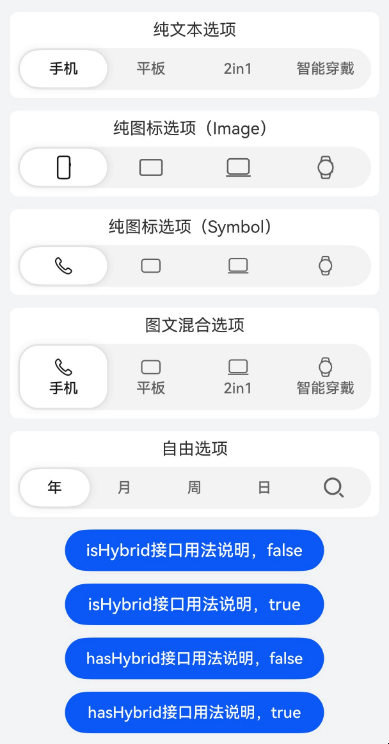
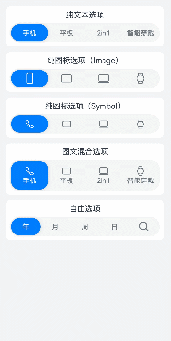
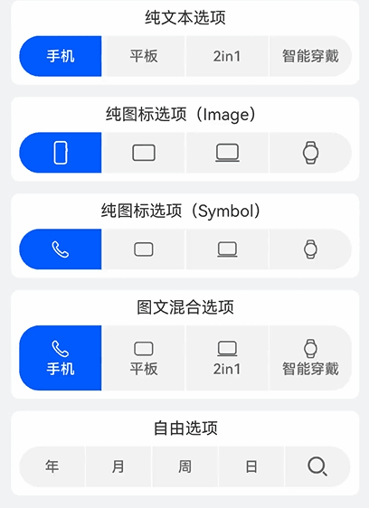
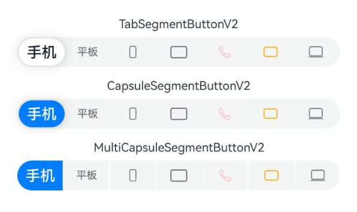
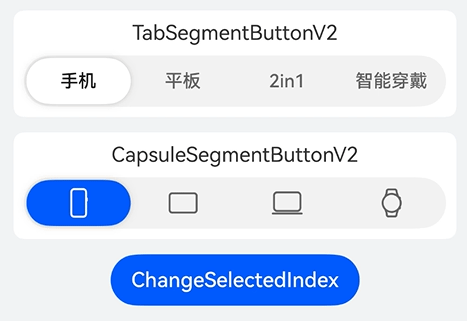

# SegmentButtonV2

更新时间：2026-04-30 02:41:24

来源：https://developer.huawei.com/consumer/cn/doc/harmonyos-references/ohos-arkui-advanced-segmentbuttonv2
**支持设备：** Phone / PC/2in1 / Tablet / Wearable / TV

分段按钮组件用于创建页签型、单选或多选的胶囊型分段按钮。


> [!NOTE]
> 该组件从API version 18开始支持。后续版本如有新增内容，则采用上角标单独标记该内容的起始版本。


## 导入模块
**支持设备：** Phone / PC/2in1 / Tablet / Wearable / TV


```ts
import {
  TabSegmentButtonV2,
  CapsuleSegmentButtonV2,
  MultiCapsuleSegmentButtonV2,
  SegmentButtonV2Items,
} from '@kit.ArkUI';
```


## 子组件
**支持设备：** Phone / PC/2in1 / Tablet / Wearable / TV

无


## 属性
**支持设备：** Phone / PC/2in1 / Tablet / Wearable / TV

不支持[通用属性](https://developer.huawei.com/consumer/cn/doc/harmonyos-references/ts-component-general-attributes)。


## 事件
**支持设备：** Phone / PC/2in1 / Tablet / Wearable / TV

不支持[通用事件](https://developer.huawei.com/consumer/cn/doc/harmonyos-references/ts-component-general-events)。


## TabSegmentButtonV2
**支持设备：** Phone / PC/2in1 / Tablet / Wearable / TV


```ts
TabSegmentButtonV2({
  items: SegmentButtonV2Items,
  selectedIndex: number,
  $selectedIndex?: OnSelectedIndexChange,
  onItemClicked?: Callback<number>,
  itemMinFontScale?: number | Resource,
  itemMaxFontScale?: number | Resource,
  itemSpace?: LengthMetrics,
  itemFontSize?: LengthMetrics,
  itemSelectedFontSize?: LengthMetrics,
  itemFontColor?: ColorMetrics,
  itemSelectedFontColor?: ColorMetrics,
  itemFontWeight?: FontWeight,
  itemSelectedFontWeight?: FontWeight,
  itemBorderRadius?: LengthMetrics,
  itemSelectedBackgroundColor?: ColorMetrics,
  itemIconSize?: SizeT<LengthMetrics>,
  itemIconFillColor?: ColorMetrics,
  itemSelectedIconFillColor?: ColorMetrics,
  itemSymbolFontSize?: LengthMetrics,
  itemSymbolFontColor?: ColorMetrics,
  itemSelectedSymbolFontColor?: ColorMetrics,
  itemMinHeight?: LengthMetrics,
  itemPadding?: LocalizedPadding,
  itemShadow?: ShadowOptions | ShadowStyle,
  buttonBackgroundColor?: ColorMetrics,
  buttonBackgroundBlurStyle?: BlurStyle,
  buttonBackgroundBlurStyleOptions?: BackgroundBlurStyleOptions,
  buttonBackgroundEffect?: BackgroundEffectOptions,
  buttonBorderRadius?: LengthMetrics,
  buttonMinHeight?: LengthMetrics,
  buttonPadding?: LengthMetrics,
  languageDirection?: Direction,
  enableStateAnimation?: boolean
})
```

**装饰器类型：** @ComponentV2

**系统能力：** SystemCapability.ArkUI.ArkUI.Full

**设备行为差异：** 该接口在Wearable设备上使用时，应用程序运行异常，异常信息中提示接口未定义，在其他设备中可正常调用。


| 名称 | 类型 | 必填 | 装饰器类型 | 说明 |
| --- | --- | --- | --- | --- |
| items | [SegmentButtonV2Items](#segmentbuttonv2items) | 是 | @Require @Param | 配置分段按钮的选项集合信息。 值为undefined时，不显示选项信息。 该成员只读，不支持更改。 元服务API： 从API version 18开始，该接口支持在元服务中使用。 |
| selectedIndex | number | 是 | @Require @Param | 配置分段按钮被选中的选项下标，第一项的编号为0，之后顺序增加。 值为undefined时，不选中任何选项，其他非正数值，默认选项下标为0。 该成员只读，不支持更改。 元服务API： 从API version 18开始，该接口支持在元服务中使用。 |
| \$selectedIndex | [OnSelectedIndexChange](#onselectedindexchange) | 否 | @Event | 配置分段按钮选中项变更时触发的回调函数。 元服务API： 从API version 18开始，该接口支持在元服务中使用。 |
| onItemClicked | Callback&lt;number&gt; | 否 | @Event | 配置分段按钮选项被单击时触发的回调函数。 元服务API： 从API version 18开始，该接口支持在元服务中使用。 |
| buttonBackgroundColor | [ColorMetrics](https://developer.huawei.com/consumer/cn/doc/harmonyos-references/js-apis-arkui-graphics#colormetrics12) | 否 | @Param | 配置分段按钮背板颜色。 默认值：\$r('sys.color.segment_button_v2_tab_button_background') 值为undefined时，按默认值处理。 该成员只读，不支持更改。 元服务API： 从API version 18开始，该接口支持在元服务中使用。 |
| buttonBackgroundBlurStyle | [BlurStyle](https://developer.huawei.com/consumer/cn/doc/harmonyos-references/ts-universal-attributes-background#blurstyle9) | 否 | @Param | 配置分段按钮背板模糊材质。 默认值：undefined 该成员只读，不支持更改。 元服务API： 从API version 18开始，该接口支持在元服务中使用。 |
| buttonBackgroundBlurStyleOptions | [BackgroundBlurStyleOptions](https://developer.huawei.com/consumer/cn/doc/harmonyos-references/ts-universal-attributes-background#backgroundblurstyleoptions10对象说明) | 否 | @Param | 配置分段按钮背板模糊材质配置参数。 默认值：undefined 该成员只读，不支持更改。 元服务API： 从API version 18开始，该接口支持在元服务中使用。 |
| buttonBackgroundEffect | [BackgroundEffectOptions](https://developer.huawei.com/consumer/cn/doc/harmonyos-references/ts-universal-attributes-background#backgroundeffectoptions11) | 否 | @Param | 配置分段按钮背板模糊配置参数。 默认值：undefined 该成员只读，不支持更改。 元服务API： 从API version 18开始，该接口支持在元服务中使用。 |
| buttonBorderRadius | [LengthMetrics](https://developer.huawei.com/consumer/cn/doc/harmonyos-references/js-apis-arkui-graphics#lengthmetrics12) | 否 | @Param | 配置分段按钮背板的圆角大小。 取值范围：[0, +∞)  默认值：\$r('sys.float.segment_button_v2_background_corner_radius') 超出取值范围按默认值处理。 该成员只读，不支持更改。 元服务API： 从API version 18开始，该接口支持在元服务中使用。 |
| buttonMinHeight | [LengthMetrics](https://developer.huawei.com/consumer/cn/doc/harmonyos-references/js-apis-arkui-graphics#lengthmetrics12) | 否 | @Param | 配置分段按钮最小高度。 取值范围：[0, +∞)  默认值：只有纯文本或者纯图标选项时：\$r('sys.float.segment_button_v2_singleline_background_height')；有图文混合的选项时：\$r('sys.float.segment_button_v2_doubleline_background_height') 超出取值范围按默认值处理。 该成员只读，不支持更改。 元服务API： 从API version 18开始，该接口支持在元服务中使用。 |
| buttonPadding | [LengthMetrics](https://developer.huawei.com/consumer/cn/doc/harmonyos-references/js-apis-arkui-graphics#lengthmetrics12) | 否 | @Param | 配置分段按钮内边距。 取值范围：[0, +∞) 默认值：\$r('sys.float.padding_level1') 超出取值范围按默认值处理。 该成员只读，不支持更改。 元服务API： 从API version 18开始，该接口支持在元服务中使用。 |
| itemSelectedBackgroundColor | [ColorMetrics](https://developer.huawei.com/consumer/cn/doc/harmonyos-references/js-apis-arkui-graphics#colormetrics12) | 否 | @Param | 配置分段按钮选中的选项背景颜色。 默认值：\$r('sys.color.segment_button_v2_tab_selected_item_background') 值为undefined时，按默认值处理。 该成员只读，不支持更改。 元服务API： 从API version 18开始，该接口支持在元服务中使用。 |
| itemMinHeight | [LengthMetrics](https://developer.huawei.com/consumer/cn/doc/harmonyos-references/js-apis-arkui-graphics#lengthmetrics12) | 否 | @Param | 配置分段按钮选项最小高度。 取值范围：[0, +∞) 默认值： 只有纯文本或者纯图标选项时：\$r('sys.float.segment_button_v2_singleline_selected_height')；有图文混合的选项时：\$r('sys.float.segment_button_v2_doubleline_selected_height') 超出取值范围按默认值处理。 该成员只读，不支持更改。 元服务API： 从API version 18开始，该接口支持在元服务中使用。 |
| itemPadding | [LocalizedPadding](https://developer.huawei.com/consumer/cn/doc/harmonyos-references/ts-types#localizedpadding12) | 否 | @Param | 配置分段按钮选项内边距。  默认值：{ top: LengthMetrics.resource(\$r('sys.float.padding_level2')), bottom: LengthMetrics.resource(\$r('sys.float.padding_level2')), start: LengthMetrics.resource(\$r('sys.float.padding_level4')), end: LengthMetrics.resource(\$r('sys.float.padding_level4')) } 值为undefined时，按默认值处理。 该成员只读，不支持更改。 元服务API： 从API version 18开始，该接口支持在元服务中使用。 |
| itemShadow | [ShadowOptions](https://developer.huawei.com/consumer/cn/doc/harmonyos-references/ts-universal-attributes-image-effect#shadowoptions对象说明) \| [ShadowStyle](https://developer.huawei.com/consumer/cn/doc/harmonyos-references/ts-universal-attributes-image-effect#shadowstyle10枚举说明) | 否 | @Param | 配置分段按钮选项阴影。 默认值：ShadowStyle.OUTER_DEFAULT_XS 超出取值范围按默认值处理。 该成员只读，不支持更改。 元服务API： 从API version 18开始，该接口支持在元服务中使用。 |
| itemSpace | [LengthMetrics](https://developer.huawei.com/consumer/cn/doc/harmonyos-references/js-apis-arkui-graphics#lengthmetrics12) | 否 | @Param | 配置分段按钮选项之间的间隔。 取值范围：[0, +∞) 默认值：LengthMetrics.vp(0) 说明：  不支持设置百分比类型，异常值按默认值处理。 该成员只读，不支持更改。 元服务API： 从API version 18开始，该接口支持在元服务中使用。 |
| itemMinFontScale | number \| [Resource](https://developer.huawei.com/consumer/cn/doc/harmonyos-references/ts-types#resource) | 否 | @Param | 配置分段按钮选项文字大小的最小字体缩放倍数。 取值范围：[0, 1] 默认值：0 说明：  设置的值小于 0 时，按值为 0 处理，设置的值大于 1，按值为 1 处理，异常值默认不生效。 该成员只读，不支持更改。 元服务API： 从API version 18开始，该接口支持在元服务中使用。 |
| itemMaxFontScale | number \| [Resource](https://developer.huawei.com/consumer/cn/doc/harmonyos-references/ts-types#resource) | 否 | @Param | 配置分段按钮选项文字大小的最大放大倍数。 取值范围：[1, 2] 默认值：1 说明：  设置的值小于 1 时，按值为 1 处理，设置的值大于 2，按值为 2 处理，异常值默认不生效。 该成员只读，不支持更改。 元服务API： 从API version 18开始，该接口支持在元服务中使用。 |
| itemFontSize | [LengthMetrics](https://developer.huawei.com/consumer/cn/doc/harmonyos-references/js-apis-arkui-graphics#lengthmetrics12) | 否 | @Param | 配置分段按钮非选中选项的字体大小。 取值范围：[0, +∞) 默认值：14fp 说明：  不支持设置百分比类型，异常值按默认值处理。 items设置textModifier的fontSize属性值时，itemFontSize不生效。 该成员只读，不支持更改。 元服务API： 从API version 18开始，该接口支持在元服务中使用。 |
| itemSelectedFontSize | [LengthMetrics](https://developer.huawei.com/consumer/cn/doc/harmonyos-references/js-apis-arkui-graphics#lengthmetrics12) | 否 | @Param | 配置分段按钮选中项的字体大小。 取值范围：[0, +∞) 默认值：14fp 说明：  不支持设置百分比类型，异常值按默认值处理。 items设置textModifier的fontSize属性值时，itemSelectedFontSize不生效。 该成员只读，不支持更改。 元服务API： 从API version 18开始，该接口支持在元服务中使用。 |
| itemFontColor | [ColorMetrics](https://developer.huawei.com/consumer/cn/doc/harmonyos-references/js-apis-arkui-graphics#colormetrics12) | 否 | @Param | 配置分段按钮非选中选项的字体颜色。 默认值：\$r('sys.color.font_secondary') 值为undefined时，按默认值处理。 说明： items设置textModifier的fontColor属性值时，itemFontColor不生效。 该成员只读，不支持更改。 元服务API： 从API version 18开始，该接口支持在元服务中使用。 |
| itemSelectedFontColor | [ColorMetrics](https://developer.huawei.com/consumer/cn/doc/harmonyos-references/js-apis-arkui-graphics#colormetrics12) | 否 | @Param | 配置分段按钮选中项的字体颜色。 默认值：\$r('sys.color.font_primary') 值为undefined时，按默认值处理。 说明： items设置textModifier的fontColor属性值时，itemSelectedFontColor不生效。 该成员只读，不支持更改。 元服务API： 从API version 18开始，该接口支持在元服务中使用。 |
| itemFontWeight | [FontWeight](https://developer.huawei.com/consumer/cn/doc/harmonyos-references/ts-appendix-enums#fontweight) | 否 | @Param | 配置分段按钮非选中选项的字体字重。 默认值：FontWeight.Medium 超出取值范围按默认值处理。 说明： items设置textModifier的fontWeight属性值时，itemFontWeight不生效。 该成员只读，不支持更改。 元服务API： 从API version 18开始，该接口支持在元服务中使用。 |
| itemSelectedFontWeight | [FontWeight](https://developer.huawei.com/consumer/cn/doc/harmonyos-references/ts-appendix-enums#fontweight) | 否 | @Param | 配置分段按钮选中项的字体字重。 默认值：FontWeight.Medium 超出取值范围按默认值处理。 说明： items设置textModifier的fontWeight属性值时，itemSelectedFontWeight不生效。 该成员只读，不支持更改。 元服务API： 从API version 18开始，该接口支持在元服务中使用。 |
| itemBorderRadius | [LengthMetrics](https://developer.huawei.com/consumer/cn/doc/harmonyos-references/js-apis-arkui-graphics#lengthmetrics12) | 否 | @Param | 配置分段按钮选项的圆角大小。 取值范围：[0, +∞) 默认值：\$r('sys.float.segment_button_v2_selected_corner_radius') 超出取值范围按默认值处理。 该成员只读，不支持更改。 元服务API： 从API version 18开始，该接口支持在元服务中使用。 |
| itemIconSize | [SizeT](https://developer.huawei.com/consumer/cn/doc/harmonyos-references/js-apis-arkui-graphics#sizett12)&lt;[LengthMetrics](https://developer.huawei.com/consumer/cn/doc/harmonyos-references/js-apis-arkui-graphics#lengthmetrics12)&gt; | 否 | @Param | 配置分段按钮选项中Image类型的图标大小。 取值范围：[0, +∞) 默认值：{ width: LengthMetrics.vp(24), height: LengthMetrics.vp(24) } 超出取值范围按默认值处理。 说明： items设置iconModifier的width、height属性值时，itemIconSize不生效。 该成员只读，不支持更改。 元服务API： 从API version 18开始，该接口支持在元服务中使用。 |
| itemIconFillColor | [ColorMetrics](https://developer.huawei.com/consumer/cn/doc/harmonyos-references/js-apis-arkui-graphics#colormetrics12) | 否 | @Param | 配置分段按钮非选中的选项图标颜色。 默认值：\$r('sys.color.font_secondary') 值为undefined时，按默认值处理。 说明： items设置iconModifier的fillColor属性值时，itemIconFillColor不生效。 该成员只读，不支持更改。 元服务API： 从API version 18开始，该接口支持在元服务中使用。 |
| itemSelectedIconFillColor | [ColorMetrics](https://developer.huawei.com/consumer/cn/doc/harmonyos-references/js-apis-arkui-graphics#colormetrics12) | 否 | @Param | 配置分段按钮选中的选项图标颜色。 默认值：\$r('sys.color.font_primary') 值为undefined时，按默认值处理。 说明： items设置iconModifier的fillColor属性值时，itemSelectedIconFillColor不生效。 该成员只读，不支持更改。 元服务API： 从API version 18开始，该接口支持在元服务中使用。 |
| itemSymbolFontSize | [LengthMetrics](https://developer.huawei.com/consumer/cn/doc/harmonyos-references/js-apis-arkui-graphics#lengthmetrics12) | 否 | @Param | 配置分段按钮选项中HM Symbol类型图标大小。 取值范围：[0, +∞) 默认值：20fp 说明： 不支持设置百分比类型，异常值按默认值处理。 items设置symbolModifier的fontSize属性值时，itemSymbolFontSize不生效。 该成员只读，不支持更改。 元服务API： 从API version 18开始，该接口支持在元服务中使用。 |
| itemSymbolFontColor | [ColorMetrics](https://developer.huawei.com/consumer/cn/doc/harmonyos-references/js-apis-arkui-graphics#colormetrics12) | 否 | @Param | 配置分段按钮非选中选项HM Symbol类型图标的颜色。 默认值：\$r('sys.color.font_secondary') 值为undefined时，按默认值处理。 说明： items设置symbolModifier的fontColor属性值时，itemSymbolFontColor不生效。 该成员只读，不支持更改。 元服务API： 从API version 18开始，该接口支持在元服务中使用。 |
| itemSelectedSymbolFontColor | [ColorMetrics](https://developer.huawei.com/consumer/cn/doc/harmonyos-references/js-apis-arkui-graphics#colormetrics12) | 否 | @Param | 配置分段按钮选中选项的HM Symbol类型图标颜色。 默认值：\$r('sys.color.font_primary') 值为undefined时，按默认值处理。 说明： items设置symbolModifier的fontColor属性值时，itemSelectedSymbolFontColor不生效。 该成员只读，不支持更改。 元服务API： 从API version 18开始，该接口支持在元服务中使用。 |
| languageDirection | [Direction](https://developer.huawei.com/consumer/cn/doc/harmonyos-references/ts-appendix-enums#direction) | 否 | @Param | 配置分段按钮的布局方向。 默认值：Direction.Auto 超出取值范围按默认值处理。 该成员只读，不支持更改。 元服务API： 从API version 18开始，该接口支持在元服务中使用。 |
| enableStateAnimation24+ | boolean | 否 | @Param | 设置当通过变量修改selectedIndex值时，是否开启分段按钮的属性动画。 true表示开启分段按钮的属性动画；未配置该属性或值为false时表示不开启分段按钮的属性动画，使用原有动画。 默认值：false 该成员只读，不支持更改。 元服务API： 从API version 24开始，该接口支持在元服务中使用。 模型约束： 此接口仅可在Stage模型下使用。 |


## CapsuleSegmentButtonV2
**支持设备：** Phone / PC/2in1 / Tablet / Wearable / TV


```ts
CapsuleSegmentButtonV2({
  items: SegmentButtonV2Items,
  selectedIndex: number,
  $selectedIndex?: OnSelectedIndexChange,
  onItemClicked?: Callback<number>,
  itemMinFontScale?: number | Resource,
  itemMaxFontScale?: number | Resource,
  itemSpace?: LengthMetrics,
  itemFontSize?: LengthMetrics,
  itemSelectedFontSize?: LengthMetrics,
  itemFontColor?: ColorMetrics,
  itemSelectedFontColor?: ColorMetrics,
  itemFontWeight?: FontWeight,
  itemSelectedFontWeight?: FontWeight,
  itemBorderRadius?: LengthMetrics,
  itemSelectedBackgroundColor?: ColorMetrics,
  itemIconSize?: SizeT<LengthMetrics>,
  itemIconFillColor?: ColorMetrics,
  itemSelectedIconFillColor?: ColorMetrics,
  itemSymbolFontSize?: LengthMetrics,
  itemSymbolFontColor?: ColorMetrics,
  itemSelectedSymbolFontColor?: ColorMetrics,
  itemMinHeight?: LengthMetrics,
  itemPadding?: LocalizedPadding,
  itemShadow?: ShadowOptions | ShadowStyle,
  buttonBackgroundColor?: ColorMetrics,
  buttonBackgroundBlurStyle?: BlurStyle,
  buttonBackgroundBlurStyleOptions?: BackgroundBlurStyleOptions,
  buttonBackgroundEffect?: BackgroundEffectOptions,
  buttonBorderRadius?: LengthMetrics,
  buttonMinHeight?: LengthMetrics,
  buttonPadding?: LengthMetrics,
  languageDirection?: Direction,
  enableStateAnimation?: boolean
})
```

**装饰器类型：** @ComponentV2

**系统能力：** SystemCapability.ArkUI.ArkUI.Full

**设备行为差异：** 该接口在Wearable设备上使用时，应用程序运行异常，异常信息中提示接口未定义，在其他设备中可正常调用。


| 名称 | 类型 | 必填 | 装饰器类型 | 说明 |
| --- | --- | --- | --- | --- |
| items | [SegmentButtonV2Items](#segmentbuttonv2items) | 是 | @Require @Param | 配置分段按钮的选项集合信息。 值为undefined时，不显示选项信息。 该成员只读，不支持更改。 元服务API： 从API version 18开始，该接口支持在元服务中使用。 |
| selectedIndex | number | 是 | @Require @Param | 配置分段按钮被选中的选项下标，第一项的编号为0，之后顺序增加。 值为undefined时，不选中任何选项，其他非正数值，默认选项下标为0。 该成员只读，不支持更改。 元服务API： 从API version 18开始，该接口支持在元服务中使用。 |
| \$selectedIndex | [OnSelectedIndexChange](#onselectedindexchange) | 否 | @Event | 配置分段按钮选中项变更时的回调函数。 元服务API： 从API version 18开始，该接口支持在元服务中使用。 |
| onItemClicked | Callback&lt;number&gt; | 否 | @Event | 配置分段按钮选项被单击时触发的回调函数。 元服务API： 从API version 18开始，该接口支持在元服务中使用。 |
| buttonBackgroundColor | [ColorMetrics](https://developer.huawei.com/consumer/cn/doc/harmonyos-references/js-apis-arkui-graphics#colormetrics12) | 否 | @Param | 配置分段按钮背板颜色。 默认值：\$r('sys.color.segment_button_v2_tab_button_background') 值为undefined时，按默认值处理。 该成员只读，不支持更改。 元服务API： 从API version 18开始，该接口支持在元服务中使用。 |
| buttonBackgroundBlurStyle | [BlurStyle](https://developer.huawei.com/consumer/cn/doc/harmonyos-references/ts-universal-attributes-background#blurstyle9) | 否 | @Param | 配置分段按钮背板模糊材质。 默认值：undefined 该成员只读，不支持更改。 元服务API： 从API version 18开始，该接口支持在元服务中使用。 |
| buttonBackgroundBlurStyleOptions | [BackgroundBlurStyleOptions](https://developer.huawei.com/consumer/cn/doc/harmonyos-references/ts-universal-attributes-background#backgroundblurstyleoptions10对象说明) | 否 | @Param | 配置分段按钮背板模糊材质配置参数。 默认值：undefined 该成员只读，不支持更改。 元服务API： 从API version 18开始，该接口支持在元服务中使用。 |
| buttonBackgroundEffect | [BackgroundEffectOptions](https://developer.huawei.com/consumer/cn/doc/harmonyos-references/ts-universal-attributes-background#backgroundeffectoptions11) | 否 | @Param | 配置分段按钮背板模糊配置参数。 默认值：undefined 该成员只读，不支持更改。 元服务API： 从API version 18开始，该接口支持在元服务中使用。 |
| buttonBorderRadius | [LengthMetrics](https://developer.huawei.com/consumer/cn/doc/harmonyos-references/js-apis-arkui-graphics#lengthmetrics12) | 否 | @Param | 配置分段按钮背板的圆角大小。 取值范围：[0, +∞)  默认值：\$r('sys.float.segment_button_v2_background_corner_radius') 超出取值范围按默认值处理。 该成员只读，不支持更改。 元服务API： 从API version 18开始，该接口支持在元服务中使用。 |
| buttonMinHeight | [LengthMetrics](https://developer.huawei.com/consumer/cn/doc/harmonyos-references/js-apis-arkui-graphics#lengthmetrics12) | 否 | @Param | 配置分段按钮最小的高度。 取值范围：[0, +∞)  默认值：只有纯文本或者纯图标选项时：\$r('sys.float.segment_button_v2_singleline_background_height')；有图文混合的选项时：\$r('sys.float.segment_button_v2_doubleline_background_height') 超出取值范围按默认值处理。 该成员只读，不支持更改。 元服务API： 从API version 18开始，该接口支持在元服务中使用。 |
| buttonPadding | [LengthMetrics](https://developer.huawei.com/consumer/cn/doc/harmonyos-references/js-apis-arkui-graphics#lengthmetrics12) | 否 | @Param | 配置分段按钮的内边距。 取值范围：[0, +∞) 默认值：\$r('sys.float.padding_level1') 超出取值范围按默认值处理。 该成员只读，不支持更改。 元服务API： 从API version 18开始，该接口支持在元服务中使用。 |
| itemSelectedBackgroundColor | [ColorMetrics](https://developer.huawei.com/consumer/cn/doc/harmonyos-references/js-apis-arkui-graphics#colormetrics12) | 否 | @Param | 配置分段按钮选中的选项背景颜色。 默认值：\$r('sys.color.comp_background_emphasize') 值为undefined时，按默认值处理。 该成员只读，不支持更改。 元服务API： 从API version 18开始，该接口支持在元服务中使用。 |
| itemMinHeight | [LengthMetrics](https://developer.huawei.com/consumer/cn/doc/harmonyos-references/js-apis-arkui-graphics#lengthmetrics12) | 否 | @Param | 配置分段按钮选项的最小高度。 取值范围：[0, +∞) 默认值： 只有纯文本或者纯图标选项时：\$r('sys.float.segment_button_v2_singleline_selected_height')；有图文混合的选项时：\$r('sys.float.segment_button_v2_doubleline_selected_height') 超出取值范围按默认值处理。 该成员只读，不支持更改。 元服务API： 从API version 18开始，该接口支持在元服务中使用。 |
| itemPadding | [LocalizedPadding](https://developer.huawei.com/consumer/cn/doc/harmonyos-references/ts-types#localizedpadding12) | 否 | @Param | 配置分段按钮选项的内边距。 默认值：{ top: LengthMetrics.resource(\$r('sys.float.padding_level2')), bottom: LengthMetrics.resource(\$r('sys.float.padding_level2')), start: LengthMetrics.resource(\$r('sys.float.padding_level4')), end: LengthMetrics.resource(\$r('sys.float.padding_level4')) } 值为undefined时，按默认值处理。 该成员只读，不支持更改。 元服务API： 从API version 18开始，该接口支持在元服务中使用。 |
| itemShadow | [ShadowOptions](https://developer.huawei.com/consumer/cn/doc/harmonyos-references/ts-universal-attributes-image-effect#shadowoptions对象说明) \| [ShadowStyle](https://developer.huawei.com/consumer/cn/doc/harmonyos-references/ts-universal-attributes-image-effect#shadowstyle10枚举说明) | 否 | @Param | 配置分段按钮选项的阴影。 默认值：ShadowStyle.OUTER_DEFAULT_XS 超出取值范围按默认值处理。 该成员只读，不支持更改。 元服务API： 从API version 18开始，该接口支持在元服务中使用。 |
| itemSpace | [LengthMetrics](https://developer.huawei.com/consumer/cn/doc/harmonyos-references/js-apis-arkui-graphics#lengthmetrics12) | 否 | @Param | 配置分段按钮选项之间的间隔。 取值范围：[0, +∞) 默认值：LengthMetrics.vp(0) 说明：  不支持设置百分比类型，异常值按默认值处理。 该成员只读，不支持更改。 元服务API： 从API version 18开始，该接口支持在元服务中使用。 |
| itemMinFontScale | number \| [Resource](https://developer.huawei.com/consumer/cn/doc/harmonyos-references/ts-types#resource) | 否 | @Param | 配置分段按钮选项文字大小的最小字体缩放倍数。 取值范围：[0, 1] 默认值：0 说明：  设置的值小于 0 时，按值为 0 处理，设置的值大于 1，按值为 1 处理，异常值默认不生效。 该成员只读，不支持更改。 元服务API： 从API version 18开始，该接口支持在元服务中使用。 |
| itemMaxFontScale | number \| [Resource](https://developer.huawei.com/consumer/cn/doc/harmonyos-references/ts-types#resource) | 否 | @Param | 配置分段按钮选项文字大小的最大字体放大倍数。 取值范围：[1, 2] 默认值：1 说明：  设置的值小于 1 时，按值为 1 处理，设置的值大于 2，按值为 2 处理，异常值默认不生效。 该成员只读，不支持更改。 元服务API： 从API version 18开始，该接口支持在元服务中使用。 |
| itemFontSize | [LengthMetrics](https://developer.huawei.com/consumer/cn/doc/harmonyos-references/js-apis-arkui-graphics#lengthmetrics12) | 否 | @Param | 配置分段按钮非选中的选项字体大小。 取值范围：[0, +∞) 默认值：14fp 说明：  不支持设置百分比类型，异常值按默认值处理。 items设置textModifier的fontSize属性值时，itemFontSize不生效。 该成员只读，不支持更改。 元服务API： 从API version 18开始，该接口支持在元服务中使用。 |
| itemSelectedFontSize | [LengthMetrics](https://developer.huawei.com/consumer/cn/doc/harmonyos-references/js-apis-arkui-graphics#lengthmetrics12) | 否 | @Param | 配置分段按钮选中的选项字体大小。 取值范围：[0, +∞) 默认值：14fp 说明：  不支持设置百分比类型，异常值按默认值处理。 items设置textModifier的fontSize属性值时，itemSelectedFontSize不生效。 该成员只读，不支持更改。 元服务API： 从API version 18开始，该接口支持在元服务中使用。 |
| itemFontColor | [ColorMetrics](https://developer.huawei.com/consumer/cn/doc/harmonyos-references/js-apis-arkui-graphics#colormetrics12) | 否 | @Param | 配置分段按钮非选中的选项字体颜色。 默认值：\$r('sys.color.font_secondary') 值为undefined时，按默认值处理。 说明： items设置textModifier的fontColor属性值时，itemFontColor不生效。 该成员只读，不支持更改。 元服务API： 从API version 18开始，该接口支持在元服务中使用。 |
| itemSelectedFontColor | [ColorMetrics](https://developer.huawei.com/consumer/cn/doc/harmonyos-references/js-apis-arkui-graphics#colormetrics12) | 否 | @Param | 配置分段按钮选中的选项字体颜色。 默认值：\$r('sys.color.font_on_primary') 值为undefined时，按默认值处理。 说明： items设置textModifier的fontColor属性值时，itemSelectedFontColor不生效。 该成员只读，不支持更改。 元服务API： 从API version 18开始，该接口支持在元服务中使用。 |
| itemFontWeight | [FontWeight](https://developer.huawei.com/consumer/cn/doc/harmonyos-references/ts-appendix-enums#fontweight) | 否 | @Param | 配置分段按钮非选中的选项字体字重。 默认值：FontWeight.Medium 超出取值范围按默认值处理。 说明： items设置textModifier的fontWeight属性值时，itemFontWeight不生效。 该成员只读，不支持更改。 元服务API： 从API version 18开始，该接口支持在元服务中使用。 |
| itemSelectedFontWeight | [FontWeight](https://developer.huawei.com/consumer/cn/doc/harmonyos-references/ts-appendix-enums#fontweight) | 否 | @Param | 配置分段按钮选中的选项字体字重。 默认值：FontWeight.Medium 超出取值范围按默认值处理。 说明： items设置textModifier的fontWeight属性值时，itemSelectedFontWeight不生效。 该成员只读，不支持更改。 元服务API： 从API version 18开始，该接口支持在元服务中使用。 |
| itemBorderRadius | [LengthMetrics](https://developer.huawei.com/consumer/cn/doc/harmonyos-references/js-apis-arkui-graphics#lengthmetrics12) | 否 | @Param | 配置分段按钮选项的圆角大小。 取值范围：[0, +∞) 默认值：\$r('sys.float.segment_button_v2_selected_corner_radius') 超出取值范围按默认值处理。 该成员只读，不支持更改。 元服务API： 从API version 18开始，该接口支持在元服务中使用。 |
| itemIconSize | [SizeT](https://developer.huawei.com/consumer/cn/doc/harmonyos-references/js-apis-arkui-graphics#sizett12)&lt;[LengthMetrics](https://developer.huawei.com/consumer/cn/doc/harmonyos-references/js-apis-arkui-graphics#lengthmetrics12)&gt; | 否 | @Param | 配置分段按钮选项中Image类型图标大小。 取值范围：[0, +∞) 默认值：{ width: LengthMetrics.vp(24), height: LengthMetrics.vp(24) } 超出取值范围按默认值处理。 说明： items设置iconModifier的width、height属性值时，itemIconSize不生效。 该成员只读，不支持更改。 元服务API： 从API version 18开始，该接口支持在元服务中使用。 |
| itemIconFillColor | [ColorMetrics](https://developer.huawei.com/consumer/cn/doc/harmonyos-references/js-apis-arkui-graphics#colormetrics12) | 否 | @Param | 配置分段按钮非选中的选项图标颜色。 默认值：\$r('sys.color.font_secondary') 值为undefined时，按默认值处理。 说明： items设置iconModifier的fillColor属性值时，itemIconFillColor不生效。 该成员只读，不支持更改。 元服务API： 从API version 18开始，该接口支持在元服务中使用。 |
| itemSelectedIconFillColor | [ColorMetrics](https://developer.huawei.com/consumer/cn/doc/harmonyos-references/js-apis-arkui-graphics#colormetrics12) | 否 | @Param | 配置分段按钮选中的选项图标颜色。 默认值：\$r('sys.color.font_on_primary') 值为undefined时，按默认值处理。 说明： items设置iconModifier的fillColor属性值时，itemSelectedIconFillColor不生效。 该成员只读，不支持更改。 元服务API： 从API version 18开始，该接口支持在元服务中使用。 |
| itemSymbolFontSize | [LengthMetrics](https://developer.huawei.com/consumer/cn/doc/harmonyos-references/js-apis-arkui-graphics#lengthmetrics12) | 否 | @Param | 配置分段按钮选项中HM Symbol类型图标大小。 取值范围：[0, +∞) 默认值：20fp 说明： 不支持设置百分比类型，异常值按默认值处理。 items设置symbolModifier的fontSize属性值时，itemSymbolFontSize不生效。 该成员只读，不支持更改。 元服务API： 从API version 18开始，该接口支持在元服务中使用。 |
| itemSymbolFontColor | [ColorMetrics](https://developer.huawei.com/consumer/cn/doc/harmonyos-references/js-apis-arkui-graphics#colormetrics12) | 否 | @Param | 配置分段按钮非选中的选项中HM Symbol类型图标颜色。 默认值：\$r('sys.color.font_secondary') 值为undefined时，按默认值处理。 说明： items设置symbolModifier的fontColor属性值时，itemSymbolFontColor不生效。 该成员只读，不支持更改。 元服务API： 从API version 18开始，该接口支持在元服务中使用。 |
| itemSelectedSymbolFontColor | [ColorMetrics](https://developer.huawei.com/consumer/cn/doc/harmonyos-references/js-apis-arkui-graphics#colormetrics12) | 否 | @Param | 配置分段按钮选中的选项中HM Symbol类型图标颜色。 默认值：\$r('sys.color.font_on_primary') 值为undefined时，按默认值处理。 说明： items设置symbolModifier的fontColor属性值时，itemSelectedSymbolFontColor不生效。 该成员只读，不支持更改。 元服务API： 从API version 18开始，该接口支持在元服务中使用。 |
| languageDirection | [Direction](https://developer.huawei.com/consumer/cn/doc/harmonyos-references/ts-appendix-enums#direction) | 否 | @Param | 配置分段按钮的布局方向。 默认值：Direction.Auto 超出取值范围按默认值处理。 该成员只读，不支持更改。 元服务API： 从API version 18开始，该接口支持在元服务中使用。 |
| enableStateAnimation24+ | boolean | 否 | @Param | 设置当通过变量修改selectedIndex时，是否开启分段按钮的属性动画。 true表示开启分段按钮的属性动画；未配置该属性或值为false时表示不开启分段按钮的属性动画，使用原有动画。 默认值：false 该成员只读，不支持更改。 元服务API： 从API version 24开始，该接口支持在元服务中使用。 模型约束： 此接口仅可在Stage模型下使用。 |


## MultiCapsuleSegmentButtonV2
**支持设备：** Phone / PC/2in1 / Tablet / Wearable / TV


```ts
MultiCapsuleSegmentButtonV2({
  items: SegmentButtonV2Items,
  selectedIndexes: number[],
  $selectedIndexes: OnSelectedIndexesChange,
  onItemClicked?: Callback<number>,
  itemMinFontScale?: number | Resource,
  itemMaxFontScale?: number | Resource,
  itemSpace?: LengthMetrics,
  itemFontColor?: ColorMetrics,
  itemSelectedFontColor?: ColorMetrics,
  itemFontSize?: LengthMetrics,
  itemSelectedFontSize?: LengthMetrics,
  itemFontWeight?: FontWeight,
  itemSelectedFontWeight?: FontWeight,
  itemBorderRadius?: LengthMetrics,
  itemBackgroundColor?: ColorMetrics,
  itemBackgroundEffect?: BackgroundEffectOptions,
  itemBackgroundBlurStyle?: BlurStyle,
  itemBackgroundBlurStyleOptions?: BackgroundBlurStyleOptions,
  itemSelectedBackgroundColor?: ColorMetrics,
  itemIconSize?: SizeT<LengthMetrics>,
  itemIconFillColor?: ColorMetrics,
  itemSelectedIconFillColor?: ColorMetrics,
  itemSymbolFontSize?: LengthMetrics,
  itemSymbolFontColor?: ColorMetrics,
  itemSelectedSymbolFontColor?: ColorMetrics,
  itemMinHeight?: LengthMetrics,
  itemPadding?: LocalizedPadding,
  languageDirection?: Direction
})
```

**装饰器类型：** @ComponentV2

**元服务API：** 从API version 18开始，该接口支持在元服务中使用。

**系统能力：** SystemCapability.ArkUI.ArkUI.Full

**设备行为差异：** 该接口在Wearable设备上使用时，应用程序运行异常，异常信息中提示接口未定义，在其他设备中可正常调用。


| 名称 | 类型 | 必填 | 装饰器类型 | 说明 |
| --- | --- | --- | --- | --- |
| items | [SegmentButtonV2Items](#segmentbuttonv2items) | 是 | @Require @Param | 配置分段按钮的选项集合信息。 值为undefined时，不显示选项信息。 该成员只读，不支持更改。 |
| selectedIndexes | number[] | 是 | @Require @Param | 配置分段按钮被选中的选项下标集合，第一项的编号为0，之后顺序增加。 值为undefined时，不选中任何选项。 说明： 仅支持有效的按钮编号（第一个按钮编号为0，之后按顺序累加），如没有选中项可传入空数组[]。 该成员只读，不支持更改。 |
| \$selectedIndexes | [OnSelectedIndexesChange](#onselectedindexeschange) | 是 | @Event | 配置分段按钮选中项变更时的回调函数。 |
| onItemClicked | Callback&lt;number&gt; | 否 | @Event | 配置分段按钮选项被单击时触发的回调函数。 |
| itemBackgroundColor | [ColorMetrics](https://developer.huawei.com/consumer/cn/doc/harmonyos-references/js-apis-arkui-graphics#colormetrics12) | 否 | @Param | 配置分段按钮非选中的选项背板颜色。 默认值：\$r('sys.color.segment_button_v2_multi_capsule_button_background') 值为undefined时，按默认值处理。 该成员只读，不支持更改。 |
| itemBackgroundEffect | [BackgroundEffectOptions](https://developer.huawei.com/consumer/cn/doc/harmonyos-references/ts-universal-attributes-background#backgroundeffectoptions11) | 否 | @Param | 配置分段按钮选项的背板效果。 默认值：undefined 该成员只读，不支持更改。 |
| itemBackgroundBlurStyle | [BlurStyle](https://developer.huawei.com/consumer/cn/doc/harmonyos-references/ts-universal-attributes-background#blurstyle9) | 否 | @Param | 配置分段按钮选项的模糊材质。 默认值：undefined 该成员只读，不支持更改。 |
| itemBackgroundBlurStyleOptions | [BackgroundBlurStyleOptions](https://developer.huawei.com/consumer/cn/doc/harmonyos-references/ts-universal-attributes-background#backgroundblurstyleoptions10对象说明) | 否 | @Param | 配置分段按钮选项的模糊材质配置参数。 默认值：undefined 该成员只读，不支持更改。 |
| itemSelectedBackgroundColor | [ColorMetrics](https://developer.huawei.com/consumer/cn/doc/harmonyos-references/js-apis-arkui-graphics#colormetrics12) | 否 | @Param | 配置分段按钮选中的选项背景颜色。 默认值：\$r('sys.color.comp_background_emphasize') 值为undefined时，按默认值处理。 该成员只读，不支持更改。 |
| itemMinHeight | [LengthMetrics](https://developer.huawei.com/consumer/cn/doc/harmonyos-references/js-apis-arkui-graphics#lengthmetrics12) | 否 | @Param | 配置分段按钮选项的最小高度。 取值范围：[0, +∞) 默认值： 只有纯文本或者纯图标选项时：\$r('sys.float.segment_button_v2_singleline_selected_height')；有图文混合的选项时：\$r('sys.float.segment_button_v2_doubleline_selected_height') 超出取值范围按默认值处理。 该成员只读，不支持更改。 |
| itemPadding | [LocalizedPadding](https://developer.huawei.com/consumer/cn/doc/harmonyos-references/ts-types#localizedpadding12) | 否 | @Param | 配置分段按钮选项的内边距。 默认值：{ top: LengthMetrics.resource(\$r('sys.float.padding_level2')), bottom: LengthMetrics.resource(\$r('sys.float.padding_level2')), start: LengthMetrics.resource(\$r('sys.float.padding_level4')), end: LengthMetrics.resource(\$r('sys.float.padding_level4')) } 值为undefined时，按默认值处理。 该成员只读，不支持更改。 |
| itemSpace | [LengthMetrics](https://developer.huawei.com/consumer/cn/doc/harmonyos-references/js-apis-arkui-graphics#lengthmetrics12) | 否 | @Param | 配置分段按钮选项之间的间隔。 取值范围：[0, +∞) 默认值：LengthMetrics.vp(1) 说明：  不支持设置百分比类型，异常值按默认值处理。 该成员只读，不支持更改。 |
| itemMinFontScale | number \| [Resource](https://developer.huawei.com/consumer/cn/doc/harmonyos-references/ts-types#resource) | 否 | @Param | 配置分段按钮选项文字大小的最小缩放倍数。 取值范围：[0, 1] 默认值：0 说明：  设置的值小于 0 时，按值为 0 处理，设置的值大于 1，按值为 1 处理，异常值默认不生效。 该成员只读，不支持更改。 |
| itemMaxFontScale | number \| [Resource](https://developer.huawei.com/consumer/cn/doc/harmonyos-references/ts-types#resource) | 否 | @Param | 配置分段按钮选项文字大小的最大放大倍数。 取值范围：[1, 2] 默认值：1 说明：  设置的值小于 1 时，按值为 1 处理，设置的值大于 2，按值为 2 处理，异常值默认不生效。 该成员只读，不支持更改。 |
| itemSelectedFontSize | [LengthMetrics](https://developer.huawei.com/consumer/cn/doc/harmonyos-references/js-apis-arkui-graphics#lengthmetrics12) | 否 | @Param | 配置分段按钮选中的选项字体大小。 取值范围：[0, +∞) 默认值：14fp 说明：  不支持设置百分比类型，异常值按默认值��理。 items设置textModifier的fontSize属性值时，itemSelectedFontSize不生效。 该成员只读，不支持更改。 |
| itemFontColor | [ColorMetrics](https://developer.huawei.com/consumer/cn/doc/harmonyos-references/js-apis-arkui-graphics#colormetrics12) | 否 | @Param | 配置分段按钮非选中的选项字体颜色。 默认值：\$r('sys.color.font_secondary') 值为undefined时，按默认值处理。 说明： items设置textModifier的fontColor属性值时，itemFontColor不生效。 该成员只读，不支持更改。 |
| itemFontSize | [LengthMetrics](https://developer.huawei.com/consumer/cn/doc/harmonyos-references/js-apis-arkui-graphics#lengthmetrics12) | 否 | @Param | 配置分段按钮非选中的选项字体大小。 取值范围：[0, +∞) 默认值：14fp 说明：  不支持设置百分比类型，异常值按默认值处理。 items设置textModifier的fontSize属性值时，itemFontSize不生效。 该成员只读，不支持更改。 |
| itemSelectedFontColor | [ColorMetrics](https://developer.huawei.com/consumer/cn/doc/harmonyos-references/js-apis-arkui-graphics#colormetrics12) | 否 | @Param | 配置分段按钮选中的选项字体颜色。 默认值：\$r('sys.color.font_on_primary') 值为undefined时，按默认值处理。 说明： items设置textModifier的fontColor属性值时，itemSelectedFontColor不生效。 该成员只读，不支持更改。 |
| itemFontWeight | [FontWeight](https://developer.huawei.com/consumer/cn/doc/harmonyos-references/ts-appendix-enums#fontweight) | 否 | @Param | 配置分段按钮非选中的选项字体字重。 默认值：FontWeight.Medium 超出取值范围按默认值处理。 说明： items设置textModifier的fontWeight属性值时，itemFontWeight不生效。 该成员只读，不支持更改。 |
| itemSelectedFontWeight | [FontWeight](https://developer.huawei.com/consumer/cn/doc/harmonyos-references/ts-appendix-enums#fontweight) | 否 | @Param | 配置分段按钮选中的选项字体字重。 默认值：FontWeight.Medium 超出取值范围按默认值处理。 说明： items设置textModifier的fontWeight属性值时，itemSelectedFontWeight不生效。 该成员只读，不支持更改。 |
| itemBorderRadius | [LengthMetrics](https://developer.huawei.com/consumer/cn/doc/harmonyos-references/js-apis-arkui-graphics#lengthmetrics12) | 否 | @Param | 配置分段按钮选项的圆角大小。 取值范围：[0, +∞) 默认值：\$r('sys.float.segment_button_v2_multi_corner_radius') 超出取值范围按默认值处理。 该成员只读，不支持更改。 |
| itemIconSize | [SizeT](https://developer.huawei.com/consumer/cn/doc/harmonyos-references/js-apis-arkui-graphics#sizett12)&lt;[LengthMetrics](https://developer.huawei.com/consumer/cn/doc/harmonyos-references/js-apis-arkui-graphics#lengthmetrics12)&gt; | 否 | @Param | 配置分段按钮选项中Image类型图标大小。 取值范围：[0, +∞) 默认值：{ width: LengthMetrics.vp(24), height: LengthMetrics.vp(24) } 超出取值范围按默认值处理。 说明： items设置iconModifier的width、height属性值时，itemIconSize不生效。 该成员只读，不支持更改。 |
| itemIconFillColor | [ColorMetrics](https://developer.huawei.com/consumer/cn/doc/harmonyos-references/js-apis-arkui-graphics#colormetrics12) | 否 | @Param | 配置分段按钮非选中的选项图标颜色。 默认值：\$r('sys.color.font_secondary') 值为undefined时，按默认值处理。 说明： items设置iconModifier的fillColor属性值时，itemIconFillColor不生效。 该成员只读，不支持更改。 |
| itemSelectedIconFillColor | [ColorMetrics](https://developer.huawei.com/consumer/cn/doc/harmonyos-references/js-apis-arkui-graphics#colormetrics12) | 否 | @Param | 配置分段按钮选中的选项图标颜色。 默认值：\$r('sys.color.font_on_primary') 值为undefined时，按默认值处理。 说明： items设置iconModifier的fillColor属性值时，itemSelectedIconFillColor不生效。 该成员只读，不支持更改。 |
| itemSymbolFontSize | [LengthMetrics](https://developer.huawei.com/consumer/cn/doc/harmonyos-references/js-apis-arkui-graphics#lengthmetrics12) | 否 | @Param | 配置分段按钮选项中HM Symbol类型图标大小。 取值范围：[0, +∞) 默认值：20fp 说明： 不支持设置百分比类型，异常值按默认值处理。 items设置symbolModifier的fontSize属性值时，itemSymbolFontSize不生效。 该成员只读，不支持更改。 |
| itemSymbolFontColor | [ColorMetrics](https://developer.huawei.com/consumer/cn/doc/harmonyos-references/js-apis-arkui-graphics#colormetrics12) | 否 | @Param | 配置分段按钮非选中的选项中HM Symbol类型图标颜色。 默认值：\$r('sys.color.font_secondary') 值为undefined时，按默认值处理。 说明： items设置symbolModifier的fontColor属性值时，itemSymbolFontColor不生效。 该成员只读，不支持更改。 |
| itemSelectedSymbolFontColor | [ColorMetrics](https://developer.huawei.com/consumer/cn/doc/harmonyos-references/js-apis-arkui-graphics#colormetrics12) | 否 | @Param | 配置分段按钮选中的选项中HM Symbol类型图标颜色。 默认值：\$r('sys.color.font_on_primary') 值为undefined时，按默认值处理。 说明： items设置symbolModifier的fontColor属性值时，itemSelectedSymbolFontColor不生效。 该成员只读，不支持更改。 |
| languageDirection | [Direction](https://developer.huawei.com/consumer/cn/doc/harmonyos-references/ts-appendix-enums#direction) | 否 | @Param | 配置分段按钮的布局方向。 默认值：Direction.Auto 超出取值范围按默认值处理。 该成员只读，不支持更改。 |


## SegmentButtonV2Items
**支持设备：** Phone / PC/2in1 / Tablet / Wearable / TV

分段按钮选项集合。

继承自 Array<[SegmentButtonV2Item](#segmentbuttonv2item)>

**装饰器类型：** @ObservedV2


### constructor
**支持设备：** Phone / PC/2in1 / Tablet / Wearable / TV

constructor(items: SegmentButtonV2ItemOptions[])

构造函数。

**元服务API：** 从API version 18开始，该接口支持在元服务中使用。

**系统能力：** SystemCapability.ArkUI.ArkUI.Full

**设备行为差异：** 该接口在Wearable设备上使用时，应用程序运行异常，异常信息中提示接口未定义，在其他设备中可正常调用。

**参数：**


| 参数名 | 类型 | 必填 | 说明 |
| --- | --- | --- | --- |
| items | [SegmentButtonV2ItemOptions](#segmentbuttonv2itemoptions)[] | 是 | 分段按钮选项配置参数集合。 |


### hasHybrid
**支持设备：** Phone / PC/2in1 / Tablet / Wearable / TV

get hasHybrid():boolean

是否支持图文混合选项。

**元服务API：** 从API version 18开始，该接口支持在元服务中使用。

**系统能力：** SystemCapability.ArkUI.ArkUI.Full

**设备行为差异：** 该接口在Wearable设备上使用时，应用程序运行异常，异常信息中提示接口未定义，在其他设备中可正常调用。

**返回值：**


| 类型 | 说明 |
| --- | --- |
| boolean | 是否支持图文混合选项。 true：有图文混合选项；false：无图文混合选项。 |


## SegmentButtonV2Item
**支持设备：** Phone / PC/2in1 / Tablet / Wearable / TV

**装饰器类型：** @ObservedV2


### 属性
**支持设备：** Phone / PC/2in1 / Tablet / Wearable / TV

**元服务API：** 从API version 18开始，该接口支持在元服务中使用。

**系统能力：** SystemCapability.ArkUI.ArkUI.Full

**设备行为差异：** 该接口在Wearable设备上使用时，应用程序运行异常，异常信息中提示接口未定义，在其他设备中可正常调用。


| 名称 | 类型 | 只读 | 可选 | 说明 |
| --- | --- | --- | --- | --- |
| text | [ResourceStr](https://developer.huawei.com/consumer/cn/doc/harmonyos-references/ts-types#resourcestr) | 否 | 是 | 分段按钮选项文本。 默认值：undefined 装饰器类型：@Trace |
| icon | [ResourceStr](https://developer.huawei.com/consumer/cn/doc/harmonyos-references/ts-types#resourcestr) | 否 | 是 | 分段按钮选项图片类型图标。 默认值：undefined 装饰器类型：@Trace |
| symbol | [Resource](https://developer.huawei.com/consumer/cn/doc/harmonyos-references/ts-types#resource) | 否 | 是 | 分段按钮选项的HM Symbol类型图标。 默认值：undefined 装饰器类型：@Trace |
| enabled | boolean | 否 | 否 | 分段按钮选项是否可用。 默认值：true true：可用；false：不可用。 值为undefined时，按默认值处理。 装饰器类型：@Trace |
| textModifier | [TextModifier](https://developer.huawei.com/consumer/cn/doc/harmonyos-references/ts-universal-attributes-attribute-modifier#自定义modifier) | 否 | 是 | 分段按钮选项文本属性样式修改器。 默认值：undefined 装饰器类型：@Trace |
| iconModifier | [ImageModifier](https://developer.huawei.com/consumer/cn/doc/harmonyos-references/ts-universal-attributes-attribute-modifier#自定义modifier) | 否 | 是 | 分段按钮选项图片类型图标属性的样式修改器。 默认值：undefined 装饰器类型：@Trace |
| symbolModifier | [SymbolGlyphModifier](https://developer.huawei.com/consumer/cn/doc/harmonyos-references/universal-attributes-attribute-symbolglyphmodifier#symbolglyphmodifier) | 否 | 是 | 分段按钮选项HM Symbol类型图标属性样式修改器。 默认值：undefined 装饰器类型：@Trace |
| accessibilityText | [ResourceStr](https://developer.huawei.com/consumer/cn/doc/harmonyos-references/ts-types#resourcestr) | 否 | 是 | 分段按钮选项的无障碍文本[accessibilityText](https://developer.huawei.com/consumer/cn/doc/harmonyos-references/ts-universal-attributes-accessibility#accessibilitytext)。 默认值："" 值为undefined时，按默认值处理。 装饰器类型：@Trace |
| accessibilityDescription | [ResourceStr](https://developer.huawei.com/consumer/cn/doc/harmonyos-references/ts-types#resourcestr) | 否 | 是 | 分段按钮选项的无障碍说明[accessibilityDescription](https://developer.huawei.com/consumer/cn/doc/harmonyos-references/ts-universal-attributes-accessibility#accessibilitydescription)。 默认值："" 值为undefined时，按默认值处理。 装饰器类型：@Trace |
| accessibilityLevel | string | 否 | 是 | 分段按钮选项的无障碍重要性[accessibilityLevel](https://developer.huawei.com/consumer/cn/doc/harmonyos-references/ts-universal-attributes-accessibility#accessibilitylevel)。 默认值："auto" 值为undefined时，按默认值处理。 装饰器类型：@Trace |


### constructor
**支持设备：** Phone / PC/2in1 / Tablet / Wearable / TV

constructor(options: SegmentButtonV2ItemOptions)

构造函数。

**元服务API：** 从API version 18开始，该接口支持在元服务中使用。

**系统能力：** SystemCapability.ArkUI.ArkUI.Full

**设备行为差异：** 该接口在Wearable设备上使用时，应用程序运行异常，异常信息中提示接口未定义，在其他设备中可正常调用。

**参数：**


| 参数名 | 类型 | 必填 | 说明 |
| --- | --- | --- | --- |
| options | [SegmentButtonV2ItemOptions](#segmentbuttonv2itemoptions) | 是 | 分段按钮选项配置参数。 |


### isHybrid
**支持设备：** Phone / PC/2in1 / Tablet / Wearable / TV

get isHybrid():boolean

检查分段按钮选项是否已配置文本和图标。

**元服务API：** 从API version 18开始，该接口支持在元服务中使用。

**系统能力：** SystemCapability.ArkUI.ArkUI.Full

**设备行为差异：** 该接口在Wearable设备上使用时，应用程序运行异常，异常信息中提示接口未定义，在其他设备中可正常调用。

**返回值：**


| 类型 | 说明 |
| --- | --- |
| boolean | 选项是否有图文混合配置。 true：有图文混合配置；false：无图文混合配置。 |


## SegmentButtonV2ItemOptions
**支持设备：** Phone / PC/2in1 / Tablet / Wearable / TV

配置分段按钮选项参数。

**元服务API：** 从API version 18开始，该接口支持在元服务中使用。

**系统能力：** SystemCapability.ArkUI.ArkUI.Full

**设备行为差异：** 该接口在Wearable设备上使用时，应用程序运行异常，异常信息中提示接口未定义，在其他设备中可正常调用。


| 名称 | 类型 | 只读 | 可选 | 说明 |
| --- | --- | --- | --- | --- |
| text | [ResourceStr](https://developer.huawei.com/consumer/cn/doc/harmonyos-references/ts-types#resourcestr) | 否 | 是 | 分段按钮选项文本。 默认值：undefined |
| icon | [ResourceStr](https://developer.huawei.com/consumer/cn/doc/harmonyos-references/ts-types#resourcestr) | 否 | 是 | 分段按钮选项图标。 默认值：undefined |
| symbol | [Resource](https://developer.huawei.com/consumer/cn/doc/harmonyos-references/ts-types#resource) | 否 | 是 | 分段按钮选项图标，HM Symbol类型 。 默认值：undefined |
| enabled | boolean | 否 | 是 | 分段按钮选项是否可用。 默认值：true true：分段按钮选项可用；false：分段按钮选项不可用。 值为undefined时，按默认值处理。 |
| textModifier | [TextModifier](https://developer.huawei.com/consumer/cn/doc/harmonyos-references/ts-universal-attributes-attribute-modifier#自定义modifier) | 否 | 是 | 分段按钮选项文本属性样式修改器。 默认值：undefined |
| iconModifier | [ImageModifier](https://developer.huawei.com/consumer/cn/doc/harmonyos-references/ts-universal-attributes-attribute-modifier#自定义modifier) | 否 | 是 | 修改分段按钮选项图片类型的图标属性样式。 默认值：undefined |
| symbolModifier | [SymbolGlyphModifier](https://developer.huawei.com/consumer/cn/doc/harmonyos-references/ts-universal-attributes-attribute-modifier#自定义modifier) | 否 | 是 | 分段按钮选项HM Symbol类型图标属性样式修改器。 默认值：undefined |
| accessibilityText | [ResourceStr](https://developer.huawei.com/consumer/cn/doc/harmonyos-references/ts-types#resourcestr) | 否 | 是 | 分段按钮选项无障碍文本[accessibilityText](https://developer.huawei.com/consumer/cn/doc/harmonyos-references/ts-universal-attributes-accessibility#accessibilitytext)。 默认值："" 值为undefined时，按默认值处理。 |
| accessibilityDescription | [ResourceStr](https://developer.huawei.com/consumer/cn/doc/harmonyos-references/ts-types#resourcestr) | 否 | 是 | 分段按钮选项无障碍说明[accessibilityDescription](https://developer.huawei.com/consumer/cn/doc/harmonyos-references/ts-universal-attributes-accessibility#accessibilitydescription)。 默认值："" 值为undefined时，按默认值处理。 |
| accessibilityLevel | string | 否 | 是 | 分段按钮选项无障碍重要性[accessibilityLevel](https://developer.huawei.com/consumer/cn/doc/harmonyos-references/ts-universal-attributes-accessibility#accessibilitylevel)。 默认值："auto" 值为undefined时，按默认值处理��� |


## OnSelectedIndexChange
**支持设备：** Phone / PC/2in1 / Tablet / Wearable / TV

type OnSelectedIndexChange = (selectedIndex: number) => void

单选分段按钮选中项变更时调用的回调函数类型。

**元服务API：** 从API version 18开始，该接口支持在元服务中使用。

**系统能力：** SystemCapability.ArkUI.ArkUI.Full

**设备行为差异：** 该接口在Wearable设备上使用时，应用程序运行异常，异常信息中提示接口未定义，在其他设备中可正常调用。

**参数：**


| 参数名 | 类型 | 必填 | 说明 |
| --- | --- | --- | --- |
| selectedIndex | number | 是 | 分段按钮选项下标。 |


## OnSelectedIndexesChange
**支持设备：** Phone / PC/2in1 / Tablet / Wearable / TV

type OnSelectedIndexesChange = (selectedIndexes: number[]) => void

多选分段按钮选中项变更时调用的回调函数类型。

**元服务API：** 从API version 18开始，该接口支持在元服务中使用。

**系统能力：** SystemCapability.ArkUI.ArkUI.Full

**设备行为差异：** 该接口在Wearable设备上使用时，应用程序运行异常，异常信息中提示接口未定义，在其他设备中可正常调用。

**参数：**


| 参数名 | 类型 | 必填 | 说明 |
| --- | --- | --- | --- |
| selectedIndexes | number[] | 是 | 分段按钮选项下标集合。 |


## 示例
**支持设备：** Phone / PC/2in1 / Tablet / Wearable / TV


### 示例 1（页签型分段按钮）

此示例说明页签型分段按钮的基本用法。


```ts
import { SegmentButtonV2Items, TabSegmentButtonV2 } from '@kit.ArkUI';

@Entry
@ComponentV2
struct TabSegmentButtonV2Example {
  @Local textItems: SegmentButtonV2Items = new SegmentButtonV2Items([
  { text: '手机' },
  { text: '平板' },
  { text: '2in1' },
  { text: '智能穿戴' },
  ]);
  @Local textSelectedIndex: number = 0;
  @Local imageItems: SegmentButtonV2Items = new SegmentButtonV2Items([
  { icon: $r('sys.media.ohos_ic_public_device_phone') },
  { icon: $r('sys.media.ohos_ic_public_device_pad') },
  { icon: $r('sys.media.ohos_ic_public_device_matebook') },
  { icon: $r('sys.media.ohos_ic_public_device_watch') },
  ]);
  @Local imageSelectedIndex: number = 0;
  @Local symbolItems: SegmentButtonV2Items = new SegmentButtonV2Items([
  { symbol: $r('sys.symbol.phone') },
  { symbol: $r('sys.symbol.pad') },
  { symbol: $r('sys.symbol.matebook') },
  { symbol: $r('sys.symbol.watch') },
  ]);
  @Local symbolSelectedIndex: number = 0;
  @Local hybridItems: SegmentButtonV2Items = new SegmentButtonV2Items([
  { text: '手机', symbol: $r('sys.symbol.phone') },
  { text: '平板', symbol: $r('sys.symbol.pad') },
  { text: '2in1', symbol: $r('sys.symbol.matebook') },
  { text: '智能穿戴', symbol: $r('sys.symbol.watch') },
  ]);
  @Local hybridSelectedIndex: number = 0;
  @Local freeItems: SegmentButtonV2Items = new SegmentButtonV2Items([
  { text: '年' },
  { text: '月' },
  { text: '周' },
  { text: '日' },
  { icon: $r('sys.media.ohos_ic_public_search_filled') },
  ]);
  @Local freeSelectedIndex: number = 0;

  build() {
    Scroll() {
      Column({ space: 12 }) {
        VCard({ title: '纯文本选项' }) {
          TabSegmentButtonV2({
            items: this.textItems,
            selectedIndex: this.textSelectedIndex!!,
          })
        }

        VCard({ title: '纯图标选项（Image）' }) {
          TabSegmentButtonV2({
            items: this.imageItems,
            selectedIndex: this.imageSelectedIndex!!,
          })
        }

        VCard({ title: '纯图标选项（Symbol）' }) {
          TabSegmentButtonV2({
            items: this.symbolItems,
            selectedIndex: this.symbolSelectedIndex!!,
          })
        }

        VCard({ title: '图文混合选项' }) {
          TabSegmentButtonV2({
            items: this.hybridItems,
            selectedIndex: this.hybridSelectedIndex!!,
          })
        }

        VCard({ title: '自由选项' }) {
          TabSegmentButtonV2({
            items: this.freeItems,
            selectedIndex: this.freeSelectedIndex!!,
          })
        }

        Button(`isHybrid接口用法说明，${this.textItems[0].isHybrid}`) // 纯文本选项未配置图标，显示false。
        .width('70%')

        Button(`isHybrid接口用法说明，${this.hybridItems[0].isHybrid}`) // 图文混合选项已配置文本和图标，显示true。
        .width('70%')

        Button(`hasHybrid接口用法说明，${this.textItems.hasHybrid}`) // 分段按钮无图文混合选项，显示false。
        .width('70%')

        Button(`hasHybrid接口用法说明，${this.hybridItems.hasHybrid}`) // 分段按钮有图文混合选项，显示true。
        .width('70%')
      }
      .constraintSize({ minHeight: '100%' })
      .justifyContent(FlexAlign.Start)
      .padding(16)
    }
    .backgroundColor('#f1f3f5')
    .width('100%')
    .height('100%')
  }
}

@Builder
function Noop() {
}

@Component
export struct VCard {
  @Prop
  title: ResourceStr;
  @BuilderParam
  content: () => void = Noop;

  build() {
    Column({ space: 8 }) {
      if (this.title) {
        Text(this.title)
        .maxLines(1)
        .textOverflow({ overflow: TextOverflow.Ellipsis })
        .constraintSize({ maxWidth: '80%' })
      }
      this.content()
    }
    .backgroundColor(Color.White)
    .borderRadius(8)
    .padding(8)
    .width('100%')
  }
}
```




### 示例 2（单选的胶囊型分段按钮）

该示例介绍单选胶囊型分段按钮的基本用法。


```ts
import { CapsuleSegmentButtonV2, SegmentButtonV2Items } from '@kit.ArkUI';

@Entry
@ComponentV2
struct CapsuleSegmentButtonV2Example {
  @Local textItems: SegmentButtonV2Items = new SegmentButtonV2Items([
  // 设置分段按钮选项文本。
  { text: '手机' },
  { text: '平板' },
  { text: '2in1' },
  { text: '智能穿戴' },
  ]);
  @Local textSelectedIndex: number = 0;
  @Local imageItems: SegmentButtonV2Items = new SegmentButtonV2Items([
  // 设置分段按钮选项图标。
  { icon: $r('sys.media.ohos_ic_public_device_phone') },
  { icon: $r('sys.media.ohos_ic_public_device_pad') },
  { icon: $r('sys.media.ohos_ic_public_device_matebook') },
  { icon: $r('sys.media.ohos_ic_public_device_watch') },
  ]);
  @Local imageSelectedIndex: number = 0;
  @Local symbolItems: SegmentButtonV2Items = new SegmentButtonV2Items([
  // 分段按钮选项图标，Symbol类型。
  { symbol: $r('sys.symbol.phone') },
  { symbol: $r('sys.symbol.pad') },
  { symbol: $r('sys.symbol.matebook') },
  { symbol: $r('sys.symbol.watch') },
  ]);
  @Local symbolSelectedIndex: number = 0;
  @Local hybridItems: SegmentButtonV2Items = new SegmentButtonV2Items([
  { text: '手机', symbol: $r('sys.symbol.phone') },
  { text: '平板', symbol: $r('sys.symbol.pad') },
  { text: '2in1', symbol: $r('sys.symbol.matebook') },
  { text: '智能穿戴', symbol: $r('sys.symbol.watch') },
  ]);
  @Local hybridSelectedIndex: number = 0;
  @Local freeItems: SegmentButtonV2Items = new SegmentButtonV2Items([
  { text: '年' },
  { text: '月' },
  { text: '周' },
  { text: '日' },
  { icon: $r('sys.media.ohos_ic_public_search_filled') },
  ]);
  @Local freeSelectedIndex: number = 0;

  build() {
    Scroll() {
      Column({ space: 12 }) {
        VCard({ title: '纯文本选项' }) {
          CapsuleSegmentButtonV2({
            items: this.textItems,
            selectedIndex: this.textSelectedIndex!!,
          })
        }

        VCard({ title: '纯图标选项（Image）' }) {
          CapsuleSegmentButtonV2({
            items: this.imageItems,
            selectedIndex: this.imageSelectedIndex!!,
          })
        }

        VCard({ title: '纯图标选项（Symbol）' }) {
          CapsuleSegmentButtonV2({
            items: this.symbolItems,
            selectedIndex: this.symbolSelectedIndex!!,
          })
        }

        VCard({ title: '图文混合选项' }) {
          CapsuleSegmentButtonV2({
            items: this.hybridItems,
            selectedIndex: this.hybridSelectedIndex!!,
          })
        }

        VCard({ title: '自由选项' }) {
          CapsuleSegmentButtonV2({
            items: this.freeItems,
            selectedIndex: this.freeSelectedIndex!!,
          })
        }
      }
      .constraintSize({ minHeight: '100%' })
      .justifyContent(FlexAlign.Start)
      .padding(16)
    }
    .backgroundColor('#f1f3f5')
    .width('100%')
    .height('100%')
  }
}

@Builder
function Noop() {
}

@Component
export struct VCard {
  @Prop
  title: ResourceStr;
  @BuilderParam
  content: () => void = Noop;

  build() {
    Column({ space: 8 }) {
      // 判断title是否存在，不存在不显示。
      if (this.title) {
        Text(this.title)
        .maxLines(1)
        .textOverflow({ overflow: TextOverflow.Ellipsis })
        .constraintSize({ maxWidth: '80%' })
      }
      this.content()
    }
    .backgroundColor(Color.White)
    .borderRadius(8)
    .padding(8)
    .width('100%')
  }
}
```




### 示例 3（多选的胶囊型分段按钮）

该示例介绍多选胶囊型分段按钮的基本用法。


```ts
import { MultiCapsuleSegmentButtonV2, SegmentButtonV2Items } from '@kit.ArkUI';

@Entry
@ComponentV2
struct MultiCapsuleSegmentButtonV2Example {
  @Local textItems: SegmentButtonV2Items = new SegmentButtonV2Items([
  // 设置分段按钮选项文本。
  { text: '手机' },
  { text: '平板' },
  { text: '2in1' },
  { text: '智能穿戴' },
  ]);
  @Local textSelectedIndexes: number[] = [0];
  @Local imageItems: SegmentButtonV2Items = new SegmentButtonV2Items([
  // 设置分段按钮选项图标。
  { icon: $r('sys.media.ohos_ic_public_device_phone') },
  { icon: $r('sys.media.ohos_ic_public_device_pad') },
  { icon: $r('sys.media.ohos_ic_public_device_matebook') },
  { icon: $r('sys.media.ohos_ic_public_device_watch') },
  ]);
  @Local imageSelectedIndexes: number[] = [0];
  @Local symbolItems: SegmentButtonV2Items = new SegmentButtonV2Items([
  // 分段按钮选项图标，Symbol类型。
  { symbol: $r('sys.symbol.phone') },
  { symbol: $r('sys.symbol.pad') },
  { symbol: $r('sys.symbol.matebook') },
  { symbol: $r('sys.symbol.watch') },
  ]);
  @Local symbolSelectedIndexes: number[] = [0];
  @Local hybridItems: SegmentButtonV2Items = new SegmentButtonV2Items([
  { text: '手机', symbol: $r('sys.symbol.phone') },
  { text: '平板', symbol: $r('sys.symbol.pad') },
  { text: '2in1', symbol: $r('sys.symbol.matebook') },
  { text: '智能穿戴', symbol: $r('sys.symbol.watch') },
  ]);
  @Local hybridSelectedIndexes: number[] = [0];
  @Local freeItems: SegmentButtonV2Items = new SegmentButtonV2Items([
  { text: '年' },
  { text: '月' },
  { text: '周' },
  { text: '日' },
  { icon: $r('sys.media.ohos_ic_public_search_filled') },
  ]);
  @Local freeSelectedIndexes: number[] = [0];

  build() {
    Scroll() {
      Column({ space: 12 }) {
        VCard({ title: '纯文本选项' }) {
          MultiCapsuleSegmentButtonV2({
            items: this.textItems,
            selectedIndexes: this.textSelectedIndexes!!,
          })
        }

        VCard({ title: '纯图标选项（Image）' }) {
          MultiCapsuleSegmentButtonV2({
            items: this.imageItems,
            selectedIndexes: this.imageSelectedIndexes!!,
          })
        }

        VCard({ title: '纯图标选项（Symbol）' }) {
          MultiCapsuleSegmentButtonV2({
            items: this.symbolItems,
            selectedIndexes: this.symbolSelectedIndexes!!,
          })
        }

        VCard({ title: '图文混合选项' }) {
          MultiCapsuleSegmentButtonV2({
            items: this.hybridItems,
            selectedIndexes: this.hybridSelectedIndexes!!,
          })
        }

        VCard({ title: '自由选项' }) {
          MultiCapsuleSegmentButtonV2({
            items: this.freeItems,
            selectedIndexes: this.freeSelectedIndexes!!,
          })
        }
      }
      .constraintSize({ minHeight: '100%' })
      .justifyContent(FlexAlign.Start)
      .padding(16)
    }
    .backgroundColor('#f1f3f5')
    .width('100%')
    .height('100%')
  }
}

@Builder
function Noop() {
}

@Component
export struct VCard {
  @Prop
  title: ResourceStr;
  @BuilderParam
  content: () => void = Noop;

  build() {
    Column({ space: 8 }) {
      // 判断title是否存在，不存在不显示。
      if (this.title) {
        Text(this.title)
        .maxLines(1)
        .textOverflow({ overflow: TextOverflow.Ellipsis })
        .constraintSize({ maxWidth: '80%' })
      }
      this.content()
    }
    .backgroundColor(Color.White)
    .borderRadius(8)
    .padding(8)
    .width('100%')
  }
}
```




### 示例4（分段按钮Modifier的基本用法）

该示例介绍页签型分段按钮，单选的胶囊型分段按钮，多选的胶囊型分段按钮Modifier的基本用法。


```ts
import {
  SegmentButtonV2Items,
  TabSegmentButtonV2,
  CapsuleSegmentButtonV2,
  MultiCapsuleSegmentButtonV2,
  TextModifier,
  ImageModifier,
  SymbolGlyphModifier
} from '@kit.ArkUI';

@Entry
@ComponentV2
struct SegmentButtonV2Example {
  @Local textItems: SegmentButtonV2Items = new SegmentButtonV2Items([
  { text: '手机', textModifier: new TextModifier().fontSize(20) }, // textModifier: 分段按钮选项文本属性样式修改器。
  { text: '平板' },
  // iconModifier: 修改分段按钮选项图片类型的图标属性样式。
  { icon: $r('sys.media.ohos_ic_public_device_phone'), iconModifier: new ImageModifier().height(17).width(17) },
  { icon: $r('sys.media.ohos_ic_public_device_pad') },
  // symbolModifier: 分段按钮选项Symbol类型图标属性样式修改器。
  { symbol: $r('sys.symbol.phone'), symbolModifier: new SymbolGlyphModifier().fontColor([Color.Pink]) },
  { symbolModifier: new SymbolGlyphModifier($r('sys.symbol.pad')).fontColor([Color.Orange]) },
  { symbol: $r('sys.symbol.matebook') },
  ]);
  @Local textSelectedIndex: number = 0;
  @Local freeSelectedIndex: number[] = [0];

  build() {
    Column() {
      VCard({ title: 'TabSegmentButtonV2' }) {
        TabSegmentButtonV2({
          items: this.textItems,
          selectedIndex: this.textSelectedIndex!!,
        })
      }

      VCard({ title: 'CapsuleSegmentButtonV2' }) {
        CapsuleSegmentButtonV2({
          items: this.textItems,
          selectedIndex: this.textSelectedIndex!!,
        })
      }

      VCard({ title: 'MultiCapsuleSegmentButtonV2' }) {
        MultiCapsuleSegmentButtonV2({
          items: this.textItems,
          selectedIndexes: this.freeSelectedIndex!!,
        })
      }

    }
    .constraintSize({ minHeight: '100%' })
    .justifyContent(FlexAlign.Start)
    .padding(16)

  }
}

@Builder
function Noop() {
}

@Component
export struct VCard {
  @Prop
  title: ResourceStr;
  @BuilderParam
  content: () => void = Noop;

  build() {
    Column({ space: 8 }) {
      // 判断title是否存在，不存在不显示。
      if (this.title) {
        Text(this.title)
        .maxLines(1)
        .textOverflow({ overflow: TextOverflow.Ellipsis })
        .constraintSize({ maxWidth: '80%' })
      }
      this.content()
    }
    .backgroundColor(Color.White)
    .borderRadius(8)
    .padding(8)
    .width('100%')
  }
}
```




### 示例5（开启SegmentButtonV2的属性动画）

此示例展示了SegmentButtonV2开启enableStateAnimation后，在通过状态变量修改selectedIndexes的值时，按钮切换也具有动画效果。

从API version 24开始，[TabSegmentButtonV2](#tabsegmentbuttonv2)和[CapsuleSegmentButtonV2](#capsulesegmentbuttonv2)新增enableStateAnimation属性。


```ts
import { TabSegmentButtonV2, CapsuleSegmentButtonV2, SegmentButtonV2Items } from '@kit.ArkUI';

@Entry
@ComponentV2
struct SegmentButtonV2Example {
  @Local textItems: SegmentButtonV2Items = new SegmentButtonV2Items([
  { text: '手机' },
  { text: '平板' },
  { text: '2in1' },
  { text: '智能穿戴' },
  ]);
  @Local imageItems: SegmentButtonV2Items = new SegmentButtonV2Items([
  { icon: $r('sys.media.ohos_ic_public_device_phone') },
  { icon: $r('sys.media.ohos_ic_public_device_pad') },
  { icon: $r('sys.media.ohos_ic_public_device_matebook') },
  { icon: $r('sys.media.ohos_ic_public_device_watch') },
  ]);
  @Local textSelectedIndex: number = 0;
  @Local imageSelectedIndex: number = 0;
  @Local currentSelectedIndex: number = 0; // 切换选中项的索引计数器

  build() {
    Scroll() {
      Column({ space: 12 }) {
        VCard({ title: 'TabSegmentButtonV2' }) {
          TabSegmentButtonV2({
            items: this.textItems,
            selectedIndex: this.textSelectedIndex!!,
            enableStateAnimation: true // 开启TabSegmentButtonV2的属性动画
          })
        }

        VCard({ title: 'CapsuleSegmentButtonV2' }) {
          CapsuleSegmentButtonV2({
            items: this.imageItems,
            selectedIndex: this.imageSelectedIndex!!,
            enableStateAnimation: true // 开启CapsuleSegmentButtonV2的属性动画
          })
        }

        Button('ChangeSelectedIndex').onClick((event: ClickEvent) => {
          // 通过状态变量自增修改选中项的索引值，若超出最大索引则重置为0
          this.currentSelectedIndex = this.currentSelectedIndex < 3 ? this.currentSelectedIndex + 1 : 0;
          this.textSelectedIndex = this.currentSelectedIndex;
          this.imageSelectedIndex = this.currentSelectedIndex;
        })
      }
      .constraintSize({ minHeight: '100%' })
      .justifyContent(FlexAlign.Start)
      .padding(16)
    }
    .backgroundColor('#f1f3f5')
    .width('100%')
    .height('100%')
  }
}

@Builder
function Noop() {
}

@Component
export struct VCard {
  @Prop
  title: ResourceStr;
  @BuilderParam
  content: () => void = Noop;

  build() {
    Column({ space: 8 }) {
      if (this.title) {
        Text(this.title)
        .maxLines(1)
        .textOverflow({ overflow: TextOverflow.Ellipsis })
        .constraintSize({ maxWidth: '80%' })
      }
      this.content()
    }
    .backgroundColor(Color.White)
    .borderRadius(8)
    .padding(8)
    .width('100%')
  }
}
```


