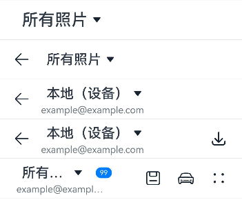

# SelectTitleBar

更新时间：2026-07-28 11:23:46

来源：https://developer.huawei.com/consumer/cn/doc/harmonyos-references/ohos-arkui-advanced-selecttitlebar
**支持设备：** Phone | PC/2in1 | Tablet | Wearable | TV

下拉菜单标题栏是一个包含下拉菜单的标题栏组件，支持页面间的快速切换，可配置返回按钮和右侧菜单项。该组件适用于需要在不同视图或页面间进行导航切换的场景，支持一级页面、二级及其以上界面。使用该组件可以方便用户快速访问和切换不同的内容视图，提升页面导航的便捷性和用户体验。
 
> [!NOTE]
> 该组件从API version 10开始支持。后续版本如有新增内容，则采用上角标单独标记该内容的起始版本。 该组件仅可在Stage模型下使用。 如果SelectTitleBar设置 通用属性 和 通用事件 ，编译工具链会额外生成节点__Common__，并将通用属性或通用事件挂载在__Common__上，而不是直接应用到SelectTitleBar本身。这可能导致开发者设置的通用属性或通用事件不生效或不符合预期，因此，不建议SelectTitleBar设置通用属性和通用事件。

  

#### 导入模块

**支持设备：** Phone | PC/2in1 | Tablet | Wearable | TV

```text
import { SelectTitleBar } from '@kit.ArkUI';
```
 
  

#### 子组件

**支持设备：** Phone | PC/2in1 | Tablet | Wearable | TV

无
 
  

#### SelectTitleBar

**支持设备：** Phone | PC/2in1 | Tablet | Wearable | TV

SelectTitleBar({selected: number, options: Array&lt;SelectOption&gt;, menuItems?: Array&lt;SelectTitleBarMenuItem&gt;, subtitle?: ResourceStr, badgeValue?: number, hidesBackButton?: boolean, onSelected?: ((index: number) => void)})
 
**装饰器类型：**@Component
 
**元服务API：** 从API version 11开始，该接口支持在元服务中使用。
 
**系统能力：** SystemCapability.ArkUI.ArkUI.Full
 
**设备行为差异：** 该接口在Wearable设备上使用时，应用程序运行异常，异常信息中提示接口未定义，在其他设备中可正常调用。
  
| 名称 | 类型 | 必填 | 装饰器类型 | 说明 |
| --- | --- | --- | --- | --- |
| selected | number | 是 | @Prop | 当前选中项的索引。 第一项的索引为0，默认值为0。 |
| options | Array&lt;SelectOption&gt; | 是 | - | 下拉菜单中的项。 |
| menuItems | Array&lt;SelectTitleBarMenuItem&gt; | 否 | - | 右侧菜单项列表，定义标题栏右侧的菜单项。需要在右侧添加菜单项时传入此参数，缺省时不显示右侧菜单区域。 |
| subtitle | ResourceStr | 否 | - | 子标题。用于显示补充信息，需要显示子标题时传入，缺省时不显示子标题区域。 |
| badgeValue | number | 否 | - | 新事件标记，用于在标题栏右侧菜单图标上显示数量。 取值范围：[-2147483648,2147483647]，超出范围时会加上或减去4294967296，使得值仍在范围内，非整数时会舍去小数部分取整数部分，如5.5取5。 说明： 不传入时或小于等于0时，不显示事件标记。 最大消息数99，超过最大消息时仅显示99+。超大数值属于异常值，不显示事件标记。 |
| hidesBackButton | boolean | 否 | - | 是否隐藏左侧的返回箭头。 默认值：false。true：隐藏，false：显示。 |
| onSelected | ((index: number) => void) | 否 | - | 下拉菜单项选中触发的回调函数，传入选中项的索引。下拉菜单选中后需要处理特定业务逻辑时传入此参数，无特定业务逻辑时可缺省此参数。 |
 
 
> [!NOTE]
> 入参对象不可为undefined，即SelectTitleBar(undefined)。

 
  

#### SelectTitleBarMenuItem

**支持设备：** Phone | PC/2in1 | Tablet | Wearable | TV

**系统能力：** SystemCapability.ArkUI.ArkUI.Full
 
**设备行为差异：** 该接口在Wearable设备上使用时，应用程序运行异常，异常信息中提示接口未定义，在其他设备中可正常调用。
  
| 名称 | 类型 | 只读 | 可选 | 说明 |
| --- | --- | --- | --- | --- |
| value | ResourceStr | 否 | 否 | 图标资源，用于设置标题栏右侧菜单项的图标，支持通过$r引用资源。当同时设置symbolStyle时，symbolStyle优先。 元服务API： 从API version 11开始，该接口支持在元服务中使用。 |
| symbolStyle18+ | SymbolGlyphModifier | 否 | 是 | Symbol图标资源，优先级大于value。 元服务API： 从API version 18开始，该接口支持在元服务中使用。 |
| label13+ | ResourceStr | 否 | 是 | 图标标签描述，可作为accessibilityText的默认值。同时设置label和accessibilityText时，accessibilityText优先级更高。不设置时，默认无标签。 元服务API： 从API version 13开始，该接口支持在元服务中使用。 |
| isEnabled | boolean | 否 | 是 | 是否启用。 默认值：false。true：启用该菜单项，false：禁用该菜单项（置灰且不可点击）。 元服务API： 从API version 11开始，该接口支持在元服务中使用。 |
| action | () => void | 否 | 是 | 右侧自定义按钮被点击时执行的回调函数。开发者可在此定义按钮点击后需要执行的自定义操作。 元服务API： 从API version 11开始，该接口支持在元服务中使用。 |
| accessibilityLevel18+ | string | 否 | 是 | 标题栏右侧自定义按钮无障碍重要性。用于控制当前项是否可被无障碍辅助服务所识别。 支持的值为： "auto"：当前组件根据具体情况自动转换为"yes"或"no"。 "yes"：当前组件可被无障碍辅助服务所识别。 "no"：当前组件不可被无障碍辅助服务所识别。 "no-hide-descendants"：当前组件及其所有子组件不可被无障碍辅助服务所识别。 默认值："auto"。 元服务API： 从API version 18开始，该接口支持在元服务中使用。 |
| accessibilityText18+ | ResourceStr | 否 | 是 | 标题栏右侧自定义按钮的无障碍文本属性。当组件不包含文本属性时，屏幕朗读选中此组件时不播报，使用者无法清楚地知道当前选中了什么组件。为了解决此场景，开发人员可为不包含文字信息的组件设置无障碍文本，当屏幕朗读选中此组件时播报无障碍文本的内容，帮助屏幕朗读的使用者清楚地知道自己选中了什么组件。 默认值：设置了label时默认值为当前项label属性内容，未设置label时默认值为空格字符。 元服务API： 从API version 18开始，该接口支持在元服务中使用。 |
| accessibilityDescription18+ | ResourceStr | 否 | 是 | 标题栏右侧自定义按钮的无障碍描述。此描述用于向用户详细解释当前组件，开发人员应为组件的这一属性提供较为详尽的文本说明，以协助用户理解即将执行的操作及其可能产生的后果。特别是当这些后果无法仅从组件的属性和无障碍文本中直接获知时。如果组件同时具备文本属性和无障碍说明属性，当组件被选中时，系统将首先播报组件的文本属性，随后播报无障碍说明属性的内容。 默认值为“单指双击即可执行”。 元服务API： 从API version 18开始，该接口支持在元服务中使用。 |
 
 
  

#### 事件

**支持设备：** Phone | PC/2in1 | Tablet | Wearable | TV

不支持[通用事件](https://developer.huawei.com/consumer/cn/doc/harmonyos-references/ts-component-general-events)。
 
  

#### 示例

**支持设备：** Phone | PC/2in1 | Tablet | Wearable | TV

  

#### 示例1（下拉菜单标题栏）

该示例实现了简单的下拉菜单标题栏，带有返回箭头的下拉菜单标题栏和带有右侧菜单项目列表的下拉菜单标题栏。
 
```text
import { SelectTitleBar, Prompt, SelectTitleBarMenuItem } from '@kit.ArkUI';

@Entry
@Component
struct Index {
  // 定义右侧菜单项目列表
  private menuItems: Array<SelectTitleBarMenuItem> =
    [
      {
        // 菜单图片资源
        value: $r('sys.media.ohos_save_button_filled'),
        // 启用图片
        isEnabled: true,
        // 点击菜单时触发事件
        action: () => Prompt.showToast({ message: 'show toast index 1' }),
      },
      {
        value: $r('sys.media.ohos_ic_public_copy'),
        isEnabled: true,
        action: () => Prompt.showToast({ message: 'show toast index 2' }),
      },
      {
        value: $r('sys.media.ohos_ic_public_edit'),
        isEnabled: true,
        action: () => Prompt.showToast({ message: 'show toast index 3' }),
      },
      {
        value: $r('sys.media.ohos_ic_public_remove'),
        isEnabled: true,
        action: () => Prompt.showToast({ message: 'show toast index 4' }),
      },
    ]

  build() {
    Row() {
      Column() {
        Divider().height(2).color(0xCCCCCC)
        SelectTitleBar({
          // 定义下拉列表选项
          options: [
            { value: '所有照片' },
            { value: '本地（设备）' },
            { value: '本地本地本地本地本地（储存卡）' }
          ],
          // 初始选择第一个下拉选项
          selected: 0,
          // 选中时触发函数
          onSelected: (index) => Prompt.showToast({ message: 'page index ' + index }),
          // 隐藏左侧返回箭头
          hidesBackButton: true,
        })
        Divider().height(2).color(0xCCCCCC)
        SelectTitleBar({
          options: [
            { value: '所有照片' },
            { value: '本地（设备）' },
            { value: '本地本地本地本地本地（储存卡）' },
          ],
          selected: 0,
          onSelected: (index) => Prompt.showToast({ message: 'page index ' + index }),
          hidesBackButton: false,
        })
        Divider().height(2).color(0xCCCCCC)
        SelectTitleBar({
          options: [
            { value: '所有照片' },
            { value: '本地（设备）' },
            { value: '本地本地本地本地本地（储存卡）' },
          ],
          selected: 1,
          onSelected: (index) => Prompt.showToast({ message: 'page index ' + index }),
          subtitle: 'example@example.com',
        })
        Divider().height(2).color(0xCCCCCC)
        SelectTitleBar({
          options: [
            { value: '所有照片' },
            { value: '本地（设备）' },
            { value: '本地本地本地本地本地（储存卡）' },
          ],
          selected: 1,
          onSelected: (index) => Prompt.showToast({ message: 'page index ' + index }),
          subtitle: 'example@example.com',
          menuItems: [{ isEnabled: true, value: $r('sys.media.ohos_save_button_filled'),
            action: () => Prompt.showToast({ message: 'show toast index 1' }),
          }],
        })
        Divider().height(2).color(0xCCCCCC)
        SelectTitleBar({
          options: [
            { value: '所有照片' },
            { value: '本地（设备）' },
            { value: '本地本地本地本地本地（储存卡）' },
          ],
          selected: 0,
          onSelected: (index) => Prompt.showToast({ message: 'page index ' + index }),
          subtitle: 'example@example.com',
          menuItems: this.menuItems,
          badgeValue: 99,
          hidesBackButton: true,
        })
        Divider().height(2).color(0xCCCCCC)
      }.width('100%')
    }.height('100%')
  }
}
```
 



 
  

#### 示例2（右侧自定义按钮播报）

从API version 18开始，该示例通过设置标题栏右侧自定义按钮属性accessibilityText、accessibilityDescription、accessibilityLevel自定义屏幕朗读播报文本。
 
```text
import { SelectTitleBar, Prompt, SelectTitleBarMenuItem } from '@kit.ArkUI';

@Entry
@Component
struct Index {
  // 定义右侧菜单项目列表
  private menuItems: Array<SelectTitleBarMenuItem> =
    [
      {
        // 菜单图片资源
        value: $r('sys.media.ohos_save_button_filled'),
        // 启用图片
        isEnabled: true,
        // 点击菜单时触发事件
        action: () => Prompt.showToast({ message: 'show toast index 1' }),
        // 屏幕朗读播报文本，优先级比label高
        accessibilityText: '保存',
        // 屏幕朗读是否可以聚焦到
        accessibilityLevel: 'yes',
        // 屏幕朗读最后播报的描述文本
        accessibilityDescription: '点击操作保存图标',
      },
      {
        value: $r('sys.media.ohos_ic_public_copy'),
        isEnabled: true,
        action: () => Prompt.showToast({ message: 'show toast index 2' }),
        accessibilityText: '复制',
        // 此处为no，屏幕朗读不聚焦
        accessibilityLevel: 'no',
        accessibilityDescription: '点击操作复制图标',
      },
      {
        value: $r('sys.media.ohos_ic_public_edit'),
        isEnabled: true,
        action: () => Prompt.showToast({ message: 'show toast index 3' }),
        accessibilityText: '编辑',
        accessibilityLevel: 'yes',
        accessibilityDescription: '点击操作编辑图标',
      },
      {
        value: $r('sys.media.ohos_ic_public_remove'),
        isEnabled: true,
        action: () => Prompt.showToast({ message: 'show toast index 4' }),
        accessibilityText: '移除',
        accessibilityLevel: 'yes',
        accessibilityDescription: '点击操作移除图标',
      }
    ]

  build() {
    Row() {
      Column() {
        Divider().height(2).color(0xCCCCCC)
        SelectTitleBar({
          // 定义下拉列表选项
          options: [
            { value: '所有照片' },
            { value: '本地（设备）' },
            { value: '本地本地本地本地本地（储存卡）' },
          ],
          // 初始选择第一个下拉选项
          selected: 0,
          // 选中时触发函数
          onSelected: (index) => Prompt.showToast({ message: 'page index ' + index }),
          // 隐藏左侧返回箭头
          hidesBackButton: true,
        })
        Divider().height(2).color(0xCCCCCC)
        SelectTitleBar({
          options: [
            { value: '所有照片' },
            { value: '本地（设备）' },
            { value: '本地本地本地本地本地（储存卡）' },
          ],
          selected: 0,
          onSelected: (index) => Prompt.showToast({ message: 'page index ' + index }),
          hidesBackButton: false,
        })
        Divider().height(2).color(0xCCCCCC)
        SelectTitleBar({
          options: [
            { value: '所有照片' },
            { value: '本地（设备）' },
            { value: '本地本地本地本地本地（储存卡）' },
          ],
          selected: 1,
          onSelected: (index) => Prompt.showToast({ message: 'page index ' + index }),
          subtitle: 'example@example.com',
        })
        Divider().height(2).color(0xCCCCCC)
        SelectTitleBar({
          options: [
            { value: '所有照片' },
            { value: '本地（设备）' },
            { value: '本地本地本地本地本地（储存卡）' },
          ],
          selected: 1,
          onSelected: (index) => Prompt.showToast({ message: 'page index ' + index }),
          subtitle: 'example@example.com',
          menuItems: [{ isEnabled: true, value: $r('sys.media.ohos_save_button_filled'),
            action: () => Prompt.showToast({ message: 'show toast index 1' }),
          }],
        })
        Divider().height(2).color(0xCCCCCC)
        SelectTitleBar({
          options: [
            { value: '所有照片' },
            { value: '本地（设备）' },
            { value: '本地本地本地本地本地（储存卡）' },
          ],
          selected: 0,
          onSelected: (index) => Prompt.showToast({ message: 'page index ' + index }),
          subtitle: 'example@example.com',
          menuItems: this.menuItems,
          badgeValue: 99,
          hidesBackButton: true,
        })
        Divider().height(2).color(0xCCCCCC)
      }.width('100%')
    }.height('100%')
  }
}
```
 


 
  

#### 示例3（设置Symbol类型图标）

从API version 18开始，该示例通过设置SelectTitleBarMenuItem的属性symbolStyle，展示了自定义Symbol类型图标。
 
```text
import { SelectTitleBar, Prompt, SelectTitleBarMenuItem, SymbolGlyphModifier } from '@kit.ArkUI';

@Entry
@Component
struct Index {
  // 定义右侧菜单项目列表
  private menuItems: Array<SelectTitleBarMenuItem> =
    [
      {
        // 图片资源（当同时设置value和symbolStyle时，symbolStyle优先级更高）
        value: $r('sys.media.ohos_save_button_filled'),
        // Symbol图标资源（优先级大于value）
        symbolStyle: new SymbolGlyphModifier($r('sys.symbol.save')),
        // 启用图片
        isEnabled: true,
        // 点击菜单时触发事件
        action: () => Prompt.showToast({ message: 'show toast index 1' }),
        // 屏幕朗读播报文本，优先级比label高
        accessibilityText: '保存',
        // 屏幕朗读是否可以聚焦到
        accessibilityLevel: 'yes',
        // 屏幕朗读最后播报的描述文本
        accessibilityDescription: '点击操作保存图标',
      },
      {
        value: $r('sys.media.ohos_ic_public_copy'),
        symbolStyle: new SymbolGlyphModifier($r('sys.symbol.car')),
        isEnabled: true,
        action: () => Prompt.showToast({ message: 'show toast index 2' }),
        accessibilityText: '复制',
        // 此处为no，屏幕朗读不聚焦
        accessibilityLevel: 'no',
        accessibilityDescription: '点击操作复制图标',
      },
      {
        value: $r('sys.media.ohos_ic_public_edit'),
        symbolStyle: new SymbolGlyphModifier($r('sys.symbol.ai_edit')),
        isEnabled: true,
        action: () => Prompt.showToast({ message: 'show toast index 3' }),
        accessibilityText: '编辑',
        accessibilityLevel: 'yes',
        accessibilityDescription: '点击操作编辑图标',
      },
      {
        value: $r('sys.media.ohos_ic_public_remove'),
        symbolStyle: new SymbolGlyphModifier($r('sys.symbol.remove_songlist')),
        isEnabled: true,
        action: () => Prompt.showToast({ message: 'show toast index 4' }),
        accessibilityText: '移除',
        accessibilityLevel: 'yes',
        accessibilityDescription: '点击操作移除图标',
      }
    ]

  build() {
    Row() {
      Column() {
        Divider().height(2).color(0xCCCCCC)
        SelectTitleBar({
          // 定义下拉列表选项
          options: [
            { value: '所有照片' },
            { value: '本地（设备）' },
            { value: '本地本地本地本地本地（储存卡）' },
          ],
          // 初始选择第一个下拉选项
          selected: 0,
          // 选中时触发函数
          onSelected: (index) => Prompt.showToast({ message: 'page index ' + index }),
          // 隐藏左侧返回箭头
          hidesBackButton: true,
        })
        Divider().height(2).color(0xCCCCCC)
        SelectTitleBar({
          options: [
            { value: '所有照片' },
            { value: '本地（设备）' },
            { value: '本地本地本地本地本地（储存卡）' },
          ],
          selected: 0,
          onSelected: (index) => Prompt.showToast({ message: 'page index ' + index }),
          hidesBackButton: false,
        })
        Divider().height(2).color(0xCCCCCC)
        SelectTitleBar({
          options: [
            { value: '所有照片' },
            { value: '本地（设备）' },
            { value: '本地本地本地本地本地（储存卡）' },
          ],
          selected: 1,
          onSelected: (index) => Prompt.showToast({ message: 'page index ' + index }),
          subtitle: 'example@example.com',
        })
        Divider().height(2).color(0xCCCCCC)
        SelectTitleBar({
          options: [
            { value: '所有照片' },
            { value: '本地（设备）' },
            { value: '本地本地本地本地本地（储存卡）' },
          ],
          selected: 1,
          onSelected: (index) => Prompt.showToast({ message: 'page index ' + index }),
          subtitle: 'example@example.com',
          menuItems: [{
            isEnabled: true, value: $r('sys.media.ohos_save_button_filled'),
            action: () => Prompt.showToast({ message: 'show toast index 1' }),
          }],
        })
        Divider().height(2).color(0xCCCCCC)
        SelectTitleBar({
          options: [
            { value: '所有照片' },
            { value: '本地（设备）' },
            { value: '本地本地本地本地本地（储存卡）' },
          ],
          selected: 0,
          onSelected: (index) => Prompt.showToast({ message: 'page index ' + index }),
          subtitle: 'example@example.com',
          menuItems: this.menuItems,
          badgeValue: 99,
          hidesBackButton: true,
        })
        Divider().height(2).color(0xCCCCCC)
      }.width('100%')
    }.height('100%')
  }
}
```
 


