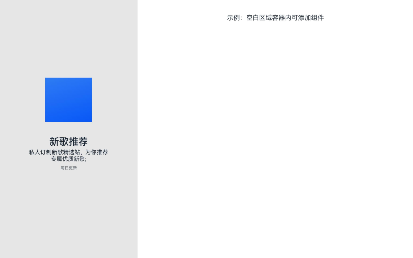

# SplitLayout

更新时间：2026-04-20 06:34:33

来源：https://developer.huawei.com/consumer/cn/doc/harmonyos-references/ohos-arkui-advanced-splitlayout
**支持设备：** Phone / PC/2in1 / Tablet / Wearable / TV

上下结构布局介绍了常用的页面布局样式。主要分为上下文本和上下图文两种类型。


## 导入模块
**支持设备：** Phone / PC/2in1 / Tablet / Wearable / TV


```ts
import { SplitLayout } from '@kit.ArkUI';
```


## 子组件
**支持设备：** Phone / PC/2in1 / Tablet / Wearable / TV

无


## SplitLayout
**支持设备：** Phone / PC/2in1 / Tablet / Wearable / TV

SplitLayout({mainImage: Resource, primaryText: string, secondaryText?: string, tertiaryText?: string, container: () => void })

**装饰器类型：**@Component

**元服务API：** 从API version 11开始，该接口支持在元服务中使用。

**系统能力：** SystemCapability.ArkUI.ArkUI.Full

**设备行为差异：** 该接口在Wearable设备上使用时，应用程序运行异常，异常信息中提示接口未定义，在其他设备中可正常调用。


| 名称 | 类型 | 必填 | 装饰器类型 | 说明 |
| --- | --- | --- | --- | --- |
| mainImage | [ResourceStr](https://developer.huawei.com/consumer/cn/doc/harmonyos-references/ts-types#resourcestr) | 是 | @State | 传入图片。 |
| primaryText | [ResourceStr](https://developer.huawei.com/consumer/cn/doc/harmonyos-references/ts-types#resourcestr) | 是 | @Prop | 标题内容。 |
| secondaryText | [ResourceStr](https://developer.huawei.com/consumer/cn/doc/harmonyos-references/ts-types#resourcestr) | 否 | @Prop | 副标题内容。当需要在标题下方显示副标题时传入，不传入时取默认值，不显示副标题。 |
| tertiaryText | [ResourceStr](https://developer.huawei.com/consumer/cn/doc/harmonyos-references/ts-types#resourcestr) | 否 | @Prop | 辅助文本。当需要显示辅助文本时传入，不传入时取默认值，不显示辅助文本。 |
| container | () =&gt; void | 是 | @BuilderParam | 容器内组件。 |


## 事件
**支持设备：** Phone / PC/2in1 / Tablet / Wearable / TV

不支持[通用事件](https://developer.huawei.com/consumer/cn/doc/harmonyos-references/ts-component-general-events)。


## 示例
**支持设备：** Phone / PC/2in1 / Tablet / Wearable / TV

该示例通过SplitLayout实现了页面布局，并具备自适应能力。


```ts
import { SplitLayout } from '@kit.ArkUI';

@Entry
@Component
struct Index {
  @State demoImage: Resource = $r("app.media.background");

  build() {
    Column() {
      SplitLayout({
        mainImage: this.demoImage,
        primaryText: '新歌推荐',
        secondaryText: '私人订制新歌精选站，为你推荐专属优质新歌;',
        tertiaryText: '每日更新',
      }) {
        Text('示例：空白区域容器内可添加组件')
        .margin({ top: 36 })
      }
    }
    .justifyContent(FlexAlign.SpaceBetween)
    .height('100%')
    .width('100%')
  }
}
```

小于等于600vp布局：


大于600vp且小于等于840vp的布局：


大于840vp布局：


