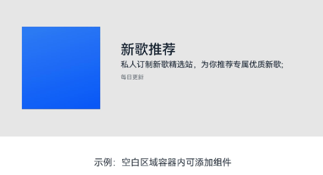
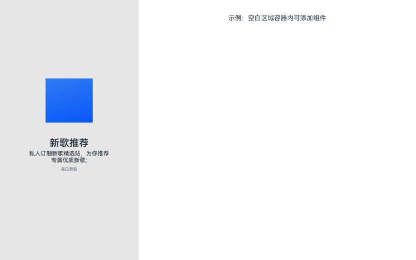

# SplitLayout

更新时间：2026-07-28 11:23:46

来源：https://developer.huawei.com/consumer/cn/doc/harmonyos-references/ohos-arkui-advanced-splitlayout
**支持设备：** Phone | PC/2in1 | Tablet | Wearable | TV

SplitLayout组件提供了常用的页面布局样式，主要用于展示图片、标题和内容容器的组合布局，适用于需要自适应不同屏幕尺寸的分栏展示场景（如详情页、设置页等）。支持自适应不同屏幕宽度（小于等于600vp、大于600vp且小于等于840vp、大于840vp三种布局），解决了在不同尺寸设备上需要展示不同布局样式的需求，提升页面适配性和用户体验。
 
> [!NOTE]
> 该组件从API version 10开始支持。后续版本的新增接口，采用上角标单独标记接口的起始版本。 该组件仅可在Stage模型下使用。 SplitLayout不支持设置 通用属性 和 通用事件 。如果设置，编译工具链会额外生成__Common__节点，并将通用属性或通用事件挂载在__Common__上，而不是直接应用到SplitLayout本身，导致设置的属性或事件不生效。

  

#### 导入模块

**支持设备：** Phone | PC/2in1 | Tablet | Wearable | TV

```text
import { SplitLayout } from '@kit.ArkUI';
```
 
  

#### 子组件

**支持设备：** Phone | PC/2in1 | Tablet | Wearable | TV

无
 
  

#### SplitLayout

**支持设备：** Phone | PC/2in1 | Tablet | Wearable | TV

SplitLayout({mainImage: ResourceStr, primaryText: ResourceStr, secondaryText?: ResourceStr, tertiaryText?: ResourceStr, container: () => void })
 
SplitLayout是分栏布局组件，支持自适应布局能力，在不同宽度下显示不同的布局样式。
 
**装饰器类型：**@Component
 
**元服务API：** 从API version 11开始，该接口支持在元服务中使用。
 
**系统能力：** SystemCapability.ArkUI.ArkUI.Full
 
**设备行为差异：** 该接口在Wearable设备上使用时，应用程序运行异常，异常信息中提示接口未定义，在其他设备中可正常调用。
  
| 名称 | 类型 | 必填 | 装饰器类型 | 说明 |
| --- | --- | --- | --- | --- |
| mainImage | ResourceStr | 是 | @State | 主图片资源，显示在布局上方区域，支持png、jpg、svg等常见图片格式。 |
| primaryText | ResourceStr | 是 | @Prop | 主标题内容，无长度限制。显示在布局的标题区域。 |
| secondaryText | ResourceStr | 否 | @Prop | 副标题内容，无长度限制。当需要在标题下方显示副标题时传入，不传入时不显示副标题。 |
| tertiaryText | ResourceStr | 否 | @Prop | 辅助文本，无长度限制。显示在副标题下方区域，当需要显示辅助文本时传入，不传入时不显示辅助文本。 |
| container | () => void | 是 | @BuilderParam | 容器内组件，用于在布局下方区域承载自定义组件内容，无返回值。 |
 
 
  

#### 事件

**支持设备：** Phone | PC/2in1 | Tablet | Wearable | TV

不支持[通用事件](https://developer.huawei.com/consumer/cn/doc/harmonyos-references/ts-component-general-events)。
 
  

#### 属性

**支持设备：** Phone | PC/2in1 | Tablet | Wearable | TV

不支持[通用属性](https://developer.huawei.com/consumer/cn/doc/harmonyos-references/ts-component-general-attributes)。
 
  

#### 示例

**支持设备：** Phone | PC/2in1 | Tablet | Wearable | TV

该示例通过SplitLayout实现了页面布局，并具备自适应能力。
 
```text
import { SplitLayout } from '@kit.ArkUI';

@Entry
@Component
struct Index {
  @State demoImage: Resource = $r('app.media.background');

  build() {
    Column() {
      SplitLayout({
        mainImage: this.demoImage,
        primaryText: '新歌推荐',
        secondaryText: '私人订制新歌精选站，为你推荐专属优质新歌;',
        tertiaryText: '每日更新',
      }) {
        Text('示例：空白区域容器内可添加组件')
          .margin({ top: 36 })
      }
    }
    .justifyContent(FlexAlign.SpaceBetween)
    .height('100%')
    .width('100%')
  }
}
```
 
小于等于600vp布局：
 



 
大于600vp且小于等于840vp的布局：
 



 
大于840vp布局：
 


