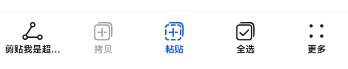

# ToolBarV2

更新时间：2026-04-20 06:34:33

来源：https://developer.huawei.com/consumer/cn/doc/harmonyos-references/ohos-arkui-advanced-toolbarv2
**支持设备：** Phone / PC/2in1 / Tablet / Wearable / TV

工具栏用于展示针对当前界面内容的操作选项，在界面底部显示。底部最多显示5个入口，超过则收纳入“更多”子项中，在最右侧显示。

该组件基于[状态管理（V2）](https://developer.huawei.com/consumer/cn/doc/harmonyos-guides/arkts-state-management-overview#状态管理v2)实现，相较于[状态管理（V1）](https://developer.huawei.com/consumer/cn/doc/harmonyos-guides/arkts-state-management-overview#状态管理v1)，状态管理（V2）增强了对数据对象的深度观察与管理能力，不再局限于组件层级。借助状态管理（V2），开发者可以通过该组件更灵活地控制工具栏的数据和状态，实现更高效的用户界面刷新。


## 导入模块
**支持设备：** Phone / PC/2in1 / Tablet / Wearable / TV


```ts
import { ToolBarV2 } from '@kit.ArkUI';
```


## 子组件
**支持设备：** Phone / PC/2in1 / Tablet / Wearable / TV

无


## ToolBarV2
**支持设备：** Phone / PC/2in1 / Tablet / Wearable / TV

ToolBarV2({toolBarList: ToolBarV2Item[], activatedIndex?: number, dividerModifier: DividerModifier, toolBarModifier: ToolBarV2Modifier})

工具栏。

**装饰器类型：**@ComponentV2

**元服务API：** 从API version 18开始，该接口支持在元服务中使用。

**系统能力：** SystemCapability.ArkUI.ArkUI.Full

**设备行为差异：** 该接口在Wearable设备上使用时，应用程序运行异常，异常信息中提示接口未定义，在其他设备中可正常调用。


| 名称 | 类型 | 必填 | 装饰器类型 | 说明 |
| --- | --- | --- | --- | --- |
| toolBarList | [ToolBarV2Item](#toolbarv2item)[] | 是 | @Param          @Require | 工具栏列表。 |
| activatedIndex | number | 否 | @Param | 激活态的子项。          默认值：-1，即无工具栏子项为激活态。          取值范围：[-1,4]。 |
| dividerModifier | [DividerModifier](https://developer.huawei.com/consumer/cn/doc/harmonyos-references/ts-universal-attributes-attribute-modifier#自定义modifier) | 否 | @Param | 工具栏头部分割线属性，可设置分割线高度、颜色等。          默认不生效。 |
| toolBarModifier | [ToolBarV2Modifier](#toolbarv2modifier) | 否 | @Param | 工具栏属性，可设置工具栏高度、背景色、内边距（仅在工具栏子项数量小于5时生效）、是否显示按压态。          默认不生效。 |


## ToolBarV2Item
**支持设备：** Phone / PC/2in1 / Tablet / Wearable / TV

定义工具栏子项。

**装饰器类型：**@ObservedV2

**元服务API：** 从API version 18开始，该接口支持在元服务中使用。

**系统能力：** SystemCapability.ArkUI.ArkUI.Full

**设备行为差异：** 该接口在Wearable设备上使用时，应用程序运行异常，异常信息中提示接口未定义，在其他设备中可正常调用。


### 属性


| 名称 | 类型 | 只读 | 可选 | 说明 |
| --- | --- | --- | --- | --- |
| content | [ToolBarV2ItemText](#toolbarv2itemtext) | 否 | 否 | 工具栏子项的文本。          装饰器类型：@Trace |
| action | [ToolBarV2ItemAction](#toolbarv2itemaction) | 否 | 是 | 工具栏子项点击事件。          默认无点击事件。          装饰器类型：@Trace |
| icon | [ToolBarV2ItemIconType](#toolbarv2itemicontype) | 否 | 是 | 工具栏子项的图标。          默认不显示图标。          装饰器类型：@Trace |
| state | [ToolBarV2ItemState](#toolbarv2itemstate) | 否 | 是 | 工具栏子项的状态。          默认为ToolBarV2ItemState.ENABLE。          装饰器类型：@Trace |
| accessibilityText | [ResourceStr](https://developer.huawei.com/consumer/cn/doc/harmonyos-references/ts-types#resourcestr) | 否 | 是 | 工具栏子项的无障碍文本属性。当组件不包含文本属性时，屏幕朗读选中此组件时不播报，使用者无法清楚地知道当前选中了什么组件。为了解决此场景，开发人员可为不包含文字信息的组件设置无障碍文本，当屏幕朗读选中此组件时播报无障碍文本的内容，帮助屏幕朗读的使用者清楚地知道自己选中了什么组件。          默认值为当前项content属性内容。          装饰器类型：@Trace |
| accessibilityDescription | [ResourceStr](https://developer.huawei.com/consumer/cn/doc/harmonyos-references/ts-types#resourcestr) | 否 | 是 | 工具栏子项的无障碍描述。此描述用于向用户详细解释当前组件，开发人员应为组件的这一属性提供较为详尽的文本说明，以协助用户理解即将执行的操作及其可能产生的后果。特别是当这些后果无法仅从组件的属性和无障碍文本中直接获知时。如果组件同时具备文本属性和无障碍说明属性，当组件被选中时，系统将首先播报组件的文本属性，随后播报无障碍说明属性的内容。          默认值：“单指双击即可执行”。          装饰器类型：@Trace |
| accessibilityLevel | string | 否 | 是 | 工具栏子项无障碍重要性。用于控制当前项是否可被无障碍辅助服务所识别。          支持的值为：          "auto"：当前组件会转换"yes"。          "yes"：当前组件可被无障碍辅助服务所识别。          "no"：当前组件不可被无障碍辅助服务所识别。          "no-hide-descendants"：当前组件及其所有子组件不可被无障碍辅助服务所识别。          默认值："auto"          装饰器类型：@Trace |


### constructor
**支持设备：** Phone / PC/2in1 / Tablet / Wearable / TV

constructor(options: ToolBarV2ItemOptions)

ToolBarV2Item的构造函数。

**元服务API：** 从API version 18开始，该接口支持在元服务中使用。

**系统能力：** SystemCapability.ArkUI.ArkUI.Full

**设备行为差异：** 该接口在Wearable设备上使用时，应用程序运行异常，异常信息中提示接口未定义，在其他设备中可正常调用。

**参数：**


| 参数名 | 类型 | 必填 | 说明 |
| --- | --- | --- | --- |
| options | [ToolBarV2ItemOptions](#toolbarv2itemoptions) | 是 | 工具栏子项信息。 |


## ToolBarV2ItemOptions
**支持设备：** Phone / PC/2in1 / Tablet / Wearable / TV

用于构建ToolBarV2Item对象。

**元服务API：** 从API version 18开始，该接口支持在元服务中使用。

**系统能力：** SystemCapability.ArkUI.ArkUI.Full

**设备行为差异：** 该接口在Wearable设备上使用时，应用程序运行异常，异常信息中提示接口未定义，在其他设备中可正常调用。


| 名称 | 类型 | 只读 | 可选 | 说明 |
| --- | --- | --- | --- | --- |
| content | [ToolBarV2ItemText](#toolbarv2itemtext) | 否 | 否 | 工具栏子项的文本。 |
| action | [ToolBarV2ItemAction](#toolbarv2itemaction) | 否 | 是 | 工具栏子项点击事件。          默认无点击事件。 |
| icon | [ToolBarV2ItemIconType](#toolbarv2itemicontype) | 否 | 是 | 工具栏子项的图标。          默认不显示图标。 |
| state | [ToolBarV2ItemState](#toolbarv2itemstate) | 否 | 是 | 工具栏子项的状态。          默认为ToolBarV2ItemState.ENABLE。 |
| accessibilityText | [ResourceStr](https://developer.huawei.com/consumer/cn/doc/harmonyos-references/ts-types#resourcestr) | 否 | 是 | 工具栏子项的无障碍文本属性。当组件不包含文本属性时，屏幕朗读选中此组件时不播报，使用者无法清楚地知道当前选中了什么组件。为了解决此场景，开发人员可为不包含文字信息的组件设置无障碍文本，当屏幕朗读选中此组件时播报无障碍文本的内容，帮助屏幕朗读的使用者清楚地知道自己选中了什么组件。          默认值为当前项content属性内容。 |
| accessibilityDescription | [ResourceStr](https://developer.huawei.com/consumer/cn/doc/harmonyos-references/ts-types#resourcestr) | 否 | 是 | 工具栏子项的无障碍描述。此描述用于向用户详细解释当前组件，开发人员应为组件的这一属性提供较为详尽的文本说明，以协助用户理解即将执行的操作及其可能产生的后果。特别是当这些后果无法仅从组件的属性和无障碍文本中直接获知时。如果组件同时具备文本属性和无障碍说明属性，当组件被选中时，系统将首先播报组件的文本属性，随后播报无障碍说明属性的内容。          默认值为“单指双击即可执行”。 |
| accessibilityLevel | string | 否 | 是 | 工具栏子项无障碍重要性。用于控制当前项是否可被无障碍辅助服务所识别。          支持的值为：          "auto"：当前组件会转换"yes"。          "yes"：当前组件可被无障碍辅助服务所识别。          "no"：当前组件不可被无障碍辅助服务所识别。          "no-hide-descendants"：当前组件及其所有子组件不可被无障碍辅助服务所识别。          默认值："auto" |


## ToolBarV2ItemAction
**支持设备：** Phone / PC/2in1 / Tablet / Wearable / TV

type ToolBarV2ItemAction = (index: number) => void

工具栏子项点击事件回调类型。

**元服务API：** 从API version 18开始，该接口支持在元服务中使用。

**系统能力：** SystemCapability.ArkUI.ArkUI.Full

**设备行为差异：** 该接口在Wearable设备上使用时，应用程序运行异常，异常信息中提示接口未定义，在其他设备中可正常调用。

**参数：**


| 参数名 | 类型 | 必填 | 说明 |
| --- | --- | --- | --- |
| index | number | 是 | 工具栏子项点击事件的回调。          -index: 表示触发事件的工具栏子项索引。 |


## ToolBarV2ItemText
**支持设备：** Phone / PC/2in1 / Tablet / Wearable / TV

定义工具栏子项的文本。

**装饰器类型：**@ObservedV2

**元服务API：** 从API version 18开始，该接口支持在元服务中使用。

**系统能力：** SystemCapability.ArkUI.ArkUI.Full

**设备行为差异：** 该接口在Wearable设备上使用时，应用程序运行异常，异常信息中提示接口未定义，在其他设备中可正常调用。


### 属性


| 名称 | 类型 | 只读 | 可选 | 说明 |
| --- | --- | --- | --- | --- |
| text | [ResourceStr](https://developer.huawei.com/consumer/cn/doc/harmonyos-references/ts-types#resourcestr) | 否 | 否 | 工具栏子项的文本。          装饰器类型：@Trace |
| color | [ColorMetrics](https://developer.huawei.com/consumer/cn/doc/harmonyos-references/js-apis-arkui-graphics#colormetrics12) | 否 | 是 | 工具栏子项的文本的颜色。          默认值：\$r('sys.color.font_primary')          装饰器类型：@Trace |
| activatedColor | [ColorMetrics](https://developer.huawei.com/consumer/cn/doc/harmonyos-references/js-apis-arkui-graphics#colormetrics12) | 否 | 是 | 工具栏子项在激活态下文本的颜色。          默认值：\$r('sys.color.font_emphasize')          装饰器类型：@Trace |


### constructor
**支持设备：** Phone / PC/2in1 / Tablet / Wearable / TV

constructor(options: ToolBarV2ItemTextOptions)

ToolBarV2ItemText的构造函数。

**元服务API：** 从API version 18开始，该接口支持在元服务中使用。

**系统能力：** SystemCapability.ArkUI.ArkUI.Full

**设备行为差异：** 该接口在Wearable设备上使用时，应用程序运行异常，异常信息中提示接口未定义，在其他设备中可正常调用。

**参数：**


| 参数名 | 类型 | 必填 | 说明 |
| --- | --- | --- | --- |
| options | [ToolBarV2ItemTextOptions](#toolbarv2itemtextoptions) | 是 | 工具栏子项文本信息。 |


## ToolBarV2ItemTextOptions
**支持设备：** Phone / PC/2in1 / Tablet / Wearable / TV

用于构建ToolBarV2ItemText对象。

**元服务API：** 从API version 18开始，该接口支持在元服务中使用。

**系统能力：** SystemCapability.ArkUI.ArkUI.Full

**设备行为差异：** 该接口在Wearable设备上使用时，应用程序运行异常，异常信息中提示接口未定义，在其他设备中可正常调用。


| 名称 | 类型 | 只读 | 可选 | 说明 |
| --- | --- | --- | --- | --- |
| text | [ResourceStr](https://developer.huawei.com/consumer/cn/doc/harmonyos-references/ts-types#resourcestr) | 否 | 否 | 工具栏子项的文本。 |
| color | [ColorMetrics](https://developer.huawei.com/consumer/cn/doc/harmonyos-references/js-apis-arkui-graphics#colormetrics12) | 否 | 是 | 工具栏子项的文本的颜色。          默认值：\$r('sys.color.font_primary') |
| activatedColor | [ColorMetrics](https://developer.huawei.com/consumer/cn/doc/harmonyos-references/js-apis-arkui-graphics#colormetrics12) | 否 | 是 | 工具栏子项在激活态下文本的颜色。          默认值：\$r('sys.color.font_emphasize') |


## ToolBarV2ItemImage
**支持设备：** Phone / PC/2in1 / Tablet / Wearable / TV

定义工具栏子项的普通图标。

**装饰器类型：**@ObservedV2

**元服务API：** 从API version 18开始，该接口支持在元服务中使用。

**系统能力：** SystemCapability.ArkUI.ArkUI.Full

**设备行为差异：** 该接口在Wearable设备上使用时，应用程序运行异常，异常信息中提示接口未定义，在其他设备中可正常调用。


### 属性


| 名称 | 类型 | 只读 | 可选 | 说明 |
| --- | --- | --- | --- | --- |
| src | [ResourceStr](https://developer.huawei.com/consumer/cn/doc/harmonyos-references/ts-types#resourcestr) | 否 | 否 | 工具栏子项的图标。          装饰器类型：@Trace |
| color | [ColorMetrics](https://developer.huawei.com/consumer/cn/doc/harmonyos-references/js-apis-arkui-graphics#colormetrics12) | 否 | 是 | 工具栏子项的图标的颜色。          默认值：\$r('sys.color.icon_primary')          装饰器类型：@Trace |
| activatedColor | [ColorMetrics](https://developer.huawei.com/consumer/cn/doc/harmonyos-references/js-apis-arkui-graphics#colormetrics12) | 否 | 是 | 工具栏子项在激活态下图标的颜色。          默认值：\$r('sys.color.icon_emphasize')          装饰器类型：@Trace |


### constructor
**支持设备：** Phone / PC/2in1 / Tablet / Wearable / TV

constructor(options: ToolBarV2ItemImageOptions)

ToolBarV2ItemImage的构造函数。

**元服务API：** 从API version 18开始，该接口支持在元服务中使用。

**系统能力：** SystemCapability.ArkUI.ArkUI.Full

**设备行为差异：** 该接口在Wearable设备上使用时，应用程序运行异常，异常信息中提示接口未定义，在其他设备中可正常调用。

**参数：**


| 参数名 | 类型 | 必填 | 说明 |
| --- | --- | --- | --- |
| options | [ToolBarV2ItemImageOptions](#toolbarv2itemimageoptions) | 是 | 工具栏子项图标信息。 |


## ToolBarV2ItemImageOptions
**支持设备：** Phone / PC/2in1 / Tablet / Wearable / TV

用于构建ToolBarV2ItemImage对象。

**元服务API：** 从API version 18开始，该接口支持在元服务中使用。

**系统能力：** SystemCapability.ArkUI.ArkUI.Full

**设备行为差异：** 该接口在Wearable设备上使用时，应用程序运行异常，异常信息中提示接口未定义，在其他设备中可正常调用。


| 名称 | 类型 | 只读 | 可选 | 说明 |
| --- | --- | --- | --- | --- |
| src | [ResourceStr](https://developer.huawei.com/consumer/cn/doc/harmonyos-references/ts-types#resourcestr) | 否 | 否 | 工具栏子项的图标。 |
| color | [ColorMetrics](https://developer.huawei.com/consumer/cn/doc/harmonyos-references/js-apis-arkui-graphics#colormetrics12) | 否 | 是 | 工具栏子项的图标的颜色。          默认值：\$r('sys.color.icon_primary') |
| activatedColor | [ColorMetrics](https://developer.huawei.com/consumer/cn/doc/harmonyos-references/js-apis-arkui-graphics#colormetrics12) | 否 | 是 | 工具栏子项在激活态下图标的颜色。          默认值：\$r('sys.color.icon_emphasize') |


## ToolBarV2ItemIconType
**支持设备：** Phone / PC/2in1 / Tablet / Wearable / TV

type ToolBarV2ItemIconType = ToolBarV2ItemImage | ToolBarV2SymbolGlyph

工具栏子项图标内容的联合类型。

**元服务API：** 从API version 18开始，该接口支持在元服务中使用。

**系统能力：** SystemCapability.ArkUI.ArkUI.Full

**设备行为差异：** 该接口在Wearable设备上使用时，应用程序运行异常，异常信息中提示接口未定义，在其他设备中可正常调用。


| 类型 | 说明 |
| --- | --- |
| [ToolBarV2ItemImage](#toolbarv2itemimage) | 用于定义普通图标。 |
| [ToolBarV2SymbolGlyph](#toolbarv2symbolglyph) | 用于定义Symbol图标。 |


## ToolBarV2Modifier
**支持设备：** Phone / PC/2in1 / Tablet / Wearable / TV

ToolBarV2Modifier提供设置工具栏高度(height)、背景色(backgroundColor)、左右内边距（padding，仅在item小于5个时生效）、是否显示按压态（stateEffect）的方法。

**元服务API：** 从API version 18开始，该接口支持在元服务中使用。

**系统能力：** SystemCapability.ArkUI.ArkUI.Full

**设备行为差异：** 该接口在Wearable设备上使用时，应用程序运行异常，异常信息中提示接口未定义，在其他设备中可正常调用。


### backgroundColor
**支持设备：** Phone / PC/2in1 / Tablet / Wearable / TV

backgroundColor(backgroundColor: ColorMetrics): ToolBarV2Modifier

自定义绘制工具栏背景色的接口，若重载该方法则可进行工具栏背景色的自定义绘制。

**元服务API：** 从API version 18开始，该接口支持在元服务中使用。

**系统能力：** SystemCapability.ArkUI.ArkUI.Full

**设备行为差异：** 该接口在Wearable设备上使用时，应用程序运行异常，异常信息中提示接口未定义，在其他设备中可正常调用。

**参数：**


| 参数名 | 类型 | 必填 | 说明 |
| --- | --- | --- | --- |
| backgroundColor | [ColorMetrics](https://developer.huawei.com/consumer/cn/doc/harmonyos-references/js-apis-arkui-graphics#colormetrics12) | 是 | 工具栏背景色。          默认背景色为\$r('sys.color.ohos_id_color_toolbar_bg')。 |


**返回值：**


| 类型 | 说明 |
| --- | --- |
| [ToolBarV2Modifier](#toolbarv2modifier) | 设置backgroundColor后的ToolBarV2Modifier对象。 |


### padding
**支持设备：** Phone / PC/2in1 / Tablet / Wearable / TV

padding(padding: LengthMetrics): ToolBarV2Modifier

自定义绘制工具栏左右内边距的接口，若重载该方法则可进行工具栏左右内边距的自定义绘制。

**元服务API：** 从API version 18开始，该接口支持在元服务中使用。

**系统能力：** SystemCapability.ArkUI.ArkUI.Full

**设备行为差异：** 该接口在Wearable设备上使用时，应用程序运行异常，异常信息中提示接口未定义，在其他设备中可正常调用。

**参数：**


| 参数名 | 类型 | 必填 | 说明 |
| --- | --- | --- | --- |
| padding | [LengthMetrics](https://developer.huawei.com/consumer/cn/doc/harmonyos-references/js-apis-arkui-graphics#lengthmetrics12) | 是 | 工具栏左右内边距，仅在子项数量小于5个时生效。          当子项数量少于5个时，工具栏默认左右内边距为24vp；当子项数量达到或超过5个时，工具栏默认左右内边距为0。 |


**返回值：**


| 类型 | 说明 |
| --- | --- |
| [ToolBarV2Modifier](#toolbarv2modifier) | 设置padding后的ToolBarV2Modifier对象。 |


### height
**支持设备：** Phone / PC/2in1 / Tablet / Wearable / TV

height(height: LengthMetrics): ToolBarV2Modifier

自定义绘制工具栏高度的接口，若重载该方法则可进行工具栏高度的自定义绘制，此高度不包含分割线高度。

**元服务API：** 从API version 18开始，该接口支持在元服务中使用。

**系统能力：** SystemCapability.ArkUI.ArkUI.Full

**设备行为差异：** 该接口在Wearable设备上使用时，应用程序运行异常，异常信息中提示接口未定义，在其他设备中可正常调用。

**参数：**


| 参数名 | 类型 | 必填 | 说明 |
| --- | --- | --- | --- |
| height | [LengthMetrics](https://developer.huawei.com/consumer/cn/doc/harmonyos-references/js-apis-arkui-graphics#lengthmetrics12) | 是 | 工具栏高度。          工具栏高度默认为56vp（不包含分割线）。 |


**返回值：**


| 类型 | 说明 |
| --- | --- |
| [ToolBarV2Modifier](#toolbarv2modifier) | 设置height后的ToolBarV2Modifier对象。 |


### stateEffect
**支持设备：** Phone / PC/2in1 / Tablet / Wearable / TV

stateEffect(stateEffect: boolean): ToolBarV2Modifier

设置是否显示按压态效果的接口。

**元服务API：** 从API version 18开始，该接口支持在元服务中使用。

**系统能力：** SystemCapability.ArkUI.ArkUI.Full

**设备行为差异：** 该接口在Wearable设备上使用时，应用程序运行异常，异常信息中提示接口未定义，在其他设备中可正常调用。

**参数：**


| 参数名 | 类型 | 必填 | 说明 |
| --- | --- | --- | --- |
| stateEffect | boolean | 是 | 工具栏是否显示按压态效果。          true为显示按压态效果，false为移除按压态效果。默认为true。 |


**返回值：**


| 类型 | 说明 |
| --- | --- |
| [ToolBarV2Modifier](#toolbarv2modifier) | 设置stateEffect后的ToolBarV2Modifier对象。 |


## ToolBarV2ItemState
**支持设备：** Phone / PC/2in1 / Tablet / Wearable / TV

工具栏子项状态枚举。

**元服务API：** 从API version 18开始，该接口支持在元服务中使用。

**系统能力：** SystemCapability.ArkUI.ArkUI.Full

**设备行为差异：** 该接口在Wearable设备上使用时，应用程序运行异常，异常信息中提示接口未定义，在其他设备中可正常调用。


| 名称 | 值 | 说明 |
| --- | --- | --- |
| ENABLE | 1 | 工具栏子项为正常可点击状态。 |
| DISABLE | 2 | 工具栏子项为不可点击状态。 |
| ACTIVATE | 3 | 工具栏子项为激活状态，可点击。 |


## ToolBarV2SymbolGlyph
**支持设备：** Phone / PC/2in1 / Tablet / Wearable / TV

ToolBarV2SymbolGlyph定义Symbol图标的属性。

**装饰器类型**：@ObservedV2

**元服务API：** 从API version 18开始，该接口支持在元服务中使用。

**系统能力：** SystemCapability.ArkUI.ArkUI.Full

**设备行为差异：** 该接口在Wearable设备上使用时，应用程序运行异常，异常信息中提示接口未定义，在其他设备中可正常调用。


### 属性


| 名称 | 类型 | ��读 | 可选 | 说明 |
| --- | --- | --- | --- | --- |
| normal | [SymbolGlyphModifier](https://developer.huawei.com/consumer/cn/doc/harmonyos-references/universal-attributes-attribute-symbolglyphmodifier#symbolglyphmodifier) | 否 | 否 | 工具栏symbol图标普通态样式。          装饰器类型：@Trace |
| activated | [SymbolGlyphModifier](https://developer.huawei.com/consumer/cn/doc/harmonyos-references/universal-attributes-attribute-symbolglyphmodifier#symbolglyphmodifier) | 否 | 是 | 工具栏symbol图标激活态样式。          默认值：fontColor：\$r('sys.color.icon_emphasize')，fontSize：24vp。          装饰器类型：@Trace |


### constructor
**支持设备：** Phone / PC/2in1 / Tablet / Wearable / TV

constructor(options: ToolBarV2SymbolGlyphOptions)

ToolBarV2SymbolGlyph的构造函数。

**元服务API：** 从API version 18开始，该接口支持在元服务中使用。

**系统能力：** SystemCapability.ArkUI.ArkUI.Full

**设备行为差异：** 该接口在Wearable设备上使用时，应用程序运行异常，异常信息中提示接口未定义，在其他设备中可正常调用。

**参数：**


| 参数名 | 类型 | 必填 | 说明 |
| --- | --- | --- | --- |
| options | [ToolBarV2SymbolGlyphOptions](#toolbarv2symbolglyphoptions) | 是 | Symbol图标信息。 |


## ToolBarV2SymbolGlyphOptions
**支持设备：** Phone / PC/2in1 / Tablet / Wearable / TV

ToolBarV2SymbolGlyphOptions定义图标的属性。

**元服务API：** 从API version 18开始，该接口支持在元服务中使用。

**系统能力：** SystemCapability.ArkUI.ArkUI.Full

**设备行为差异：** 该接口在Wearable设备上使用时，应用程序运行异常，异常信息中提示接口未定义，在其他设备中可正常调用。


| 名称 | 类型 | 只读 | 可选 | 说明 |
| --- | --- | --- | --- | --- |
| normal | [SymbolGlyphModifier](https://developer.huawei.com/consumer/cn/doc/harmonyos-references/universal-attributes-attribute-symbolglyphmodifier#symbolglyphmodifier) | 否 | 否 | 工具栏symbol图标普通态样式。 |
| activated | [SymbolGlyphModifier](https://developer.huawei.com/consumer/cn/doc/harmonyos-references/universal-attributes-attribute-symbolglyphmodifier#symbolglyphmodifier) | 否 | 是 | 工具栏symbol图标激活态样式。          默认值：fontColor：\$r('sys.color.icon_emphasize')，fontSize：24vp。 |


## 示例
**支持设备：** Phone / PC/2in1 / Tablet / Wearable / TV


### 示例1（工具栏不同状态的默认效果）

该示例展示了工具栏子项state属性分别设置ENABLE、DISABLE、ACTIVATE状态的不同显示效果。


```ts
import { ToolBarV2ItemImage, ToolBarV2ItemState, ToolBarV2ItemText, ToolBarV2Item, ToolBarV2 } from '@kit.ArkUI';

@Entry
@ComponentV2
struct Index {
  @Local toolbarList: ToolBarV2Item[] = []

  aboutToAppear() {
    this.toolbarList.push(new ToolBarV2Item({
      content: new ToolBarV2ItemText(
      {
        text: '剪贴我是超超超超超超超超超长样式'
      }
      ),
      icon: new ToolBarV2ItemImage({
        src: $r('sys.media.ohos_ic_public_share')
      }),
      action: () => {
      },
    }))
    this.toolbarList.push(
    new ToolBarV2Item({
      content: new ToolBarV2ItemText(
      {
        text: '拷贝'
      }
      ),
      icon: new ToolBarV2ItemImage({
        src: $r('sys.media.ohos_ic_public_copy')
      }),
      action: () => {
      },
      state: ToolBarV2ItemState.DISABLE
    })
    )
    this.toolbarList.push(
    new ToolBarV2Item({
      content: new ToolBarV2ItemText(
      {
        text: '粘贴'
      }
      ),
      icon: new ToolBarV2ItemImage({
        src: $r('sys.media.ohos_ic_public_paste')
      }),
      action: () => {
      },
      state: ToolBarV2ItemState.ACTIVATE
    })
    )
    this.toolbarList.push(
    new ToolBarV2Item({
      content: new ToolBarV2ItemText(
      {
        text: '全选'
      }
      ),
      icon: new ToolBarV2ItemImage({
        src: $r('sys.media.ohos_ic_public_select_all')
      }),
      action: () => {
      },
    })
    )
    this.toolbarList.push(
    new ToolBarV2Item({
      content: new ToolBarV2ItemText(
      {
        text: '分享'
      }
      ),
      icon: new ToolBarV2ItemImage({
        src: $r('sys.media.ohos_ic_public_share')
      }),
      action: () => {
      },
    })
    )
    this.toolbarList.push(
    new ToolBarV2Item({
      content: new ToolBarV2ItemText(
      {
        text: '分享'
      }
      ),
      icon: new ToolBarV2ItemImage({
        src: $r('sys.media.ohos_ic_public_share')
      }),
      action: () => {
      },
    })
    )
  }

  build() {
    Row() {
      Stack() {
        Column() {
          ToolBarV2({
            activatedIndex: 2,
            toolBarList: this.toolbarList,
          })
        }
      }.align(Alignment.Bottom)
      .width('100%').height('100%')
    }
  }
}
```


### 示例2（设置工具栏自定义样式）

该示例通过设置属性ToolBarV2Modifier自定义工具栏高度、背景色、按压效果等样式。


```ts
import {
  SymbolGlyphModifier,
  DividerModifier,
  LengthMetrics,
  ColorMetrics,
  ToolBarV2Item,
  ToolBarV2Modifier,
  ToolBarV2ItemText,
  ToolBarV2ItemImage,
  ToolBarV2,
  ToolBarV2ItemState,
  ToolBarV2SymbolGlyph
} from '@kit.ArkUI';

@Entry
@ComponentV2
struct Index {
  @Local toolbarList: ToolBarV2Item[] = [];
  private toolBarModifier: ToolBarV2Modifier =
  new ToolBarV2Modifier().height(LengthMetrics.vp(52))
  .backgroundColor(ColorMetrics.resourceColor(Color.Transparent))
  .stateEffect(false);
  @Local dividerModifier: DividerModifier = new DividerModifier().height(0);

  aboutToAppear() {
    this.toolbarList.push(
    new ToolBarV2Item({
      content: new ToolBarV2ItemText({
        text: 'Long long long long long long long long text',
        activatedColor: ColorMetrics.resourceColor($r('sys.color.font_primary'))
      }),
      icon: new ToolBarV2SymbolGlyph({
        normal: new SymbolGlyphModifier($r('sys.symbol.ohos_star')).fontColor([Color.Green]),
        activated: new SymbolGlyphModifier($r('sys.symbol.ohos_star')).fontColor([Color.Red]),
      }),
      action: () => {
      },
      state: ToolBarV2ItemState.ACTIVATE,
    })
    )
    this.toolbarList.push(
    new ToolBarV2Item({
      content: new ToolBarV2ItemText({
        text: 'Copy',
        activatedColor: ColorMetrics.resourceColor('#ffec5d5d')
      }),
      icon: new ToolBarV2ItemImage({
        src: $r('sys.media.ohos_ic_public_copy'),
        color: ColorMetrics.resourceColor('#ff18cb53'),
        activatedColor: ColorMetrics.resourceColor('#ffec5d5d'),
      }),
      action: () => {
      },
      state: ToolBarV2ItemState.DISABLE,
    }))
    this.toolbarList.push(
    new ToolBarV2Item({
      content: new ToolBarV2ItemText({
        text: 'Paste',
        color: ColorMetrics.resourceColor('#ff18cb53')
      }),
      icon: new ToolBarV2ItemImage({
        src: $r('sys.media.ohos_ic_public_paste'),
      }),
      action: () => {
      },
      state: ToolBarV2ItemState.ACTIVATE,
    })
    )
    this.toolbarList.push(
    new ToolBarV2Item({
      content: new ToolBarV2ItemText({
        text: 'All',
      }),
      icon: new ToolBarV2ItemImage({
        src: $r('sys.media.ohos_ic_public_select_all'),
      }),
      action: () => {
      },
      state: ToolBarV2ItemState.ACTIVATE,
    }))
    this.toolbarList.push(
    new ToolBarV2Item({
      content: new ToolBarV2ItemText({
        text: '分享',
      }),
      icon: new ToolBarV2ItemImage({
        src: $r('sys.media.ohos_ic_public_share'),
      }),
      action: () => {
      },
    }))
    this.toolbarList.push(
    new ToolBarV2Item({
      content: new ToolBarV2ItemText({
        text: '分享',
      }),
      icon: new ToolBarV2ItemImage({
        src: $r('sys.media.ohos_ic_public_share'),
      }),
      action: () => {
      },
    })
    )
  }

  build() {
    Row() {
      Stack() {
        Column() {
          ToolBarV2({
            toolBarModifier: this.toolBarModifier,
            dividerModifier: this.dividerModifier,
            activatedIndex: 0,
            toolBarList: this.toolbarList,
          })
          .height(52)
        }
      }.align(Alignment.Bottom)
      .width('100%').height('100%')
    }
  }
}
```


### 示例3（设置工具栏自定义播报）

该示例通过设置工具栏子项属性accessibilityText、accessibilityDescription、accessibilityLevel自定义屏幕朗读播报文本。


```ts
import {
  DividerModifier,
  LengthMetrics,
  ColorMetrics,
  ToolBarV2Item,
  ToolBarV2Modifier,
  ToolBarV2ItemText,
  ToolBarV2ItemImage,
  ToolBarV2,
  ToolBarV2ItemState,
} from '@kit.ArkUI';

@Entry
@ComponentV2
struct Index {
  @Local toolbarList: ToolBarV2Item[] = [];
  private toolBarModifier: ToolBarV2Modifier =
  new ToolBarV2Modifier().height(LengthMetrics.vp(52))
  .backgroundColor(ColorMetrics.resourceColor(Color.Transparent))
  .stateEffect(false);
  @Local dividerModifier: DividerModifier = new DividerModifier().height(0);

  aboutToAppear() {
    this.toolbarList.push(
    new ToolBarV2Item({
      content: new ToolBarV2ItemText({
        text: '剪贴我是超超超超超超超超超长样式',
      }),
      icon: new ToolBarV2ItemImage({
        src: $r('sys.media.ohos_ic_public_share')
      }),
      action: () => {
      },
      accessibilityText: '剪贴', // 该项屏幕朗读播报文本为‘剪贴’
      accessibilityDescription: '单指双击即可剪贴', // 该项屏幕朗读播报描述为'单指双击即可��贴'
      accessibilityLevel: 'yes'  // 该项可被无障碍屏幕朗读聚焦
    })
    )
    this.toolbarList.push(
    new ToolBarV2Item({
      content: new ToolBarV2ItemText({
        text: '拷贝',
      }),
      icon: new ToolBarV2ItemImage({
        src: $r('sys.media.ohos_ic_public_copy'),
      }),
      action: () => {
      },
      state: ToolBarV2ItemState.DISABLE,
      accessibilityLevel: 'no'  // 该项将无法被无障碍屏幕朗读聚焦
    }))
    this.toolbarList.push(
    new ToolBarV2Item({
      content: new ToolBarV2ItemText({
        text: '粘贴',
      }),
      icon: new ToolBarV2ItemImage({
        src: $r('sys.media.ohos_ic_public_paste'),
      }),
      action: () => {
      },
      state: ToolBarV2ItemState.ACTIVATE,
    })
    )
    this.toolbarList.push(
    new ToolBarV2Item({
      content: new ToolBarV2ItemText({
        text: '全选',
      }),
      icon: new ToolBarV2ItemImage({
        src: $r('sys.media.ohos_ic_public_select_all'),
      }),
      action: () => {
      },
    }))
    this.toolbarList.push(
    new ToolBarV2Item({
      content: new ToolBarV2ItemText({
        text: '分享',
      }),
      icon: new ToolBarV2ItemImage({
        src: $r('sys.media.ohos_ic_public_share'),
      }),
      action: () => {
      },
    }))
    this.toolbarList.push(
    new ToolBarV2Item({
      content: new ToolBarV2ItemText({
        text: '分享',
      }),
      icon: new ToolBarV2ItemImage({
        src: $r('sys.media.ohos_ic_public_share'),
      }),
      action: () => {
      },
    })
    )
  }

  build() {
    Row() {
      Stack() {
        Column() {
          ToolBarV2({
            toolBarModifier: this.toolBarModifier,
            dividerModifier: this.dividerModifier,
            activatedIndex: 0,
            toolBarList: this.toolbarList,
          })
          .height(52)
        }
      }.align(Alignment.Bottom)
      .width('100%').height('100%')
    }
  }
}
```


