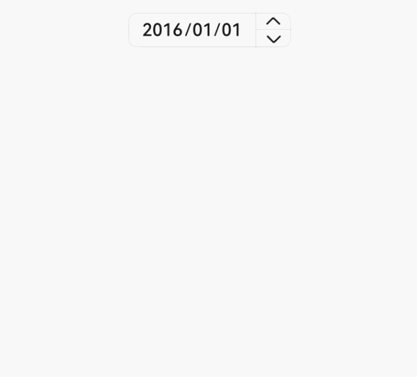
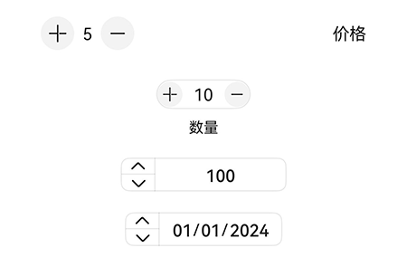

# advanced.Counter

更新时间：2026-07-28 11:23:46

来源：https://developer.huawei.com/consumer/cn/doc/harmonyos-references/ohos-arkui-advanced-counter
**支持设备：** Phone | PC/2in1 | Tablet | Wearable | TV

Counter组件用于精确调节数值，支持列表型、紧凑型、数值内联型和日期内联型四种样式，适用于购物数量调节、参数设置、日期选择等场景，具有灵活的样式配置和事件回调能力。
 
> [!NOTE]
> 该组件从API version 11开始支持。后续版本如有新增内容，则采用上角标单独标记该内容的起始版本。 本模块接口仅可在Stage模型下使用。 如果Counter设置 通用属性 和 通用事件 ，编译工具链会额外生成节点__Common__，并将通用属性或通用事件挂载在__Common__上，而不是直接应用到Counter本身。这可能导致开发者设置的通用属性或通用事件的效果不生效或不符合预期，因此，不建议为Counter设置通用属性和通用事件。

  

#### 导入模块

**支持设备：** Phone | PC/2in1 | Tablet | Wearable | TV

```text
import { CounterType, CounterComponent, CounterOptions, DateData } from '@kit.ArkUI';
```
 
  

#### 子组件

**支持设备：** Phone | PC/2in1 | Tablet | Wearable | TV

无
 
  

#### CounterComponent

**支持设备：** Phone | PC/2in1 | Tablet | Wearable | TV

CounterComponent({ options: CounterOptions })
 
创建Counter组件实例。
 
**装饰器类型：** @Component
 
**元服务API：** 从API version 12开始，该接口支持在元服务中使用。
 
**系统能力：** SystemCapability.ArkUI.ArkUI.Full
 
**参数：**
  
| 名称 | 类型 | 必填 | 装饰器类型 | 说明 |
| --- | --- | --- | --- | --- |
| options | CounterOptions | 是 | @Prop | 定义Counter组件的类型及样式选项。 |
 
 
  

#### CounterOptions

**支持设备：** Phone | PC/2in1 | Tablet | Wearable | TV

CounterOptions定义了Counter类型及样式。
 
**元服务API：** 从API version 12开始，该接口支持在元服务中使用。
 
**系统能力：** SystemCapability.ArkUI.ArkUI.Full
  
| 名称 | 类型 | 只读 | 可选 | 说明 |
| --- | --- | --- | --- | --- |
| type | CounterType | 否 | 否 | 指定当前Counter的类型。需配合对应的样式参数使用，具体对应关系参见Counter类型与样式对照表。 |
| direction12+ | Direction | 否 | 是 | 布局方向。当需要适配从右到左的语言（如阿拉伯语）或实现镜像布局时传入此参数。Direction.Auto：自动跟随系统语言方向（默认）；Direction.Ltr：从左到右布局，适用于大多数语言；Direction.Rtl：从右到左布局，适用于阿拉伯语等RTL语言。 默认值：Direction.Auto 值为undefined时，按默认值处理。 |
| numberOptions | NumberStyleOptions | 否 | 是 | 列表型和紧凑型Counter的样式。需配合type为CounterType.LIST或CounterType.COMPACT使用。 默认值：显示计数器为0的列表型或紧凑型Counter。 值为undefined时，按默认值处理。 |
| inlineOptions | InlineStyleOptions | 否 | 是 | 数值内联型Counter的样式。需配合type为CounterType.INLINE使用。 默认值：显示计数器为0的数值内联型Counter。 值为undefined时，按默认值处理。 |
| dateOptions | DateStyleOptions | 否 | 是 | 日期内联型Counter的样式。需配合type为CounterType.INLINE_DATE使用。 默认值：显示0001/01/01的日期内联型Counter。 值为undefined时，按默认值处理。 |
 
 
选择不同的Counter类型时，需选择对应的Counter样式。若样式参数与类型不匹配，将使用该类型对应的默认样式。
  
| Counter类型 | Counter样式 |
| --- | --- |
| CounterType.LIST | NumberStyleOptions |
| CounterType.COMPACT | NumberStyleOptions |
| CounterType.INLINE | InlineStyleOptions |
| CounterType.INLINE_DATE | DateStyleOptions |
 
 
  

#### CounterType

**支持设备：** Phone | PC/2in1 | Tablet | Wearable | TV

CounterType指定Counter类型。
 
**元服务API：** 从API version 12开始，该接口支持在元服务中使用。
 
**系统能力：** SystemCapability.ArkUI.ArkUI.Full
  
| 名称 | 值 | 说明 |
| --- | --- | --- |
| LIST | 0 | 列表型Counter。 |
| COMPACT | 1 | 紧凑型Counter。 |
| INLINE | 2 | 数值内联型Counter。 |
| INLINE_DATE | 3 | 日期内联型Counter。 |
 
 
  

#### CommonOptions

**支持设备：** Phone | PC/2in1 | Tablet | Wearable | TV

CommonOptions定义了Counter的通用属性和事件。
 
**元服务API：** 从API version 12开始，该接口支持在元服务中使用。
 
**系统能力：** SystemCapability.ArkUI.ArkUI.Full
  
| 名称 | 类型 | 只读 | 可选 | 说明 |
| --- | --- | --- | --- | --- |
| focusable | boolean | 否 | 是 | 设置Counter是否可获焦。 说明： 该属性对列表型和紧凑型Counter生效，对数值内联型和日期内联型Counter不生效。 默认值：true true：Counter可获焦（当需要通过键盘或焦点导航操作Counter时选择）；false：Counter不可获焦（当不需要焦点交互时选择）。 值为undefined时，按默认值处理。 |
| step | number | 否 | 是 | 设置Counter的步长。当需要快速调整数值时（如设置大于默认值1的步长），或需要精确控制每次变化量时使用。 取值范围：大于等于1的整数。 默认值：1 超出取值范围按默认值处理。 值为undefined时，按默认值处理。 |
| onHoverIncrease | (isHover: boolean) => void | 否 | 是 | 鼠标进入或退出Counter组件的增加按钮时触发该回调。 使用场景：当鼠标悬浮在增加按钮上，需要执行自定义操作（如改变按钮样式、显示提示信息等）时传入此回调。 isHover：表示鼠标是否悬浮在增加按钮上，鼠标进入时为true，退出时为false。 默认值：不触发鼠标进入或退出Counter组件的增加按钮时的回调。 值为undefined时，按默认值处理。 |
| onHoverDecrease | (isHover: boolean) => void | 否 | 是 | 鼠标进入或退出Counter组件的减少按钮时触发该回调。 使用场景：当鼠标悬浮在减少按钮上，需要执行自定义操作（如改变按钮样式、显示提示信息等）时传入此回调。 isHover：表示鼠标是否悬浮在减少按钮上，鼠标进入时为true，退出时为false。 默认值：不触发鼠标进入或退出Counter组件的减少按钮时的回调。 值为undefined时，按默认值处理。 |
 
 
  

#### InlineStyleOptions

**支持设备：** Phone | PC/2in1 | Tablet | Wearable | TV

InlineStyleOptions定义了数值内联型Counter的属性和事件。
 
继承于[CommonOptions](#commonoptions)。
 
**元服务API：** 从API version 12开始，该接口支持在元服务中使用。
 
**系统能力：** SystemCapability.ArkUI.ArkUI.Full
  
| 名称 | 类型 | 只读 | 可选 | 说明 |
| --- | --- | --- | --- | --- |
| value | number | 否 | 是 | 设置Counter的初始值。 默认值：0 取值范围：[min, max]，其中min和max分别对应下述Counter的最小值和最大值（min默认为0，max默认为999）。 超出取值范围时，如果值小于min，按min处理；如果值大于max，按max处理。 |
| min | number | 否 | 是 | 设置Counter的最小值。 默认值：0 取值范围：(-∞, max] 超出取值范围时（即设置值大于max），按max处理。 值为undefined时，按默认值处理。 |
| max | number | 否 | 是 | 设置Counter的最大值。 默认值：999 取值范围：[min, +∞) 超出取值范围时（即设置值小于min），按min处理。 值为undefined时，按默认值处理。 |
| textWidth | number | 否 | 是 | 设置数值文本的宽度。 默认值：自适应文本宽度。 取值范围：[0, +∞) 单位：vp 超出取值范围时（即设置值小于0），按0处理。 值为undefined时，按默认值处理。 |
| onChange | (value: number) => void | 否 | 是 | 数值改变时，返回当前值。使用场景：当需要在数值变化时执行自定义操作（如更新关联UI、记录日志、保存状态等）时传入此回调。 value：当前显示的数值。 默认值：数值改变时，不返回值。 值为undefined时，按默认值处理。 |
 
 
> [!NOTE]
> min应小于等于max。若min大于max，则按max处理。

 
  

#### NumberStyleOptions

**支持设备：** Phone | PC/2in1 | Tablet | Wearable | TV

NumberStyleOptions定义了列表型和紧凑型Counter的属性和事件。
 
继承于[InlineStyleOptions](#inlinestyleoptions)，包含该接口所有属性。本节仅展示新增属性，继承属性请参见父接口。
 
**元服务API：** 从API version 12开始，该接口支持在元服务中使用。
 
**系统能力：** SystemCapability.ArkUI.ArkUI.Full
  
| 名称 | 类型 | 只读 | 可选 | 说明 |
| --- | --- | --- | --- | --- |
| label | ResourceStr | 否 | 是 | 设置Counter的说明文本。 使用场景：当需要在Counter旁边显示说明文字（如'价格'、'数量'等）时传入此参数。 默认值：'' 值为undefined时，按默认值处理。 |
| onFocusIncrease | () => void | 否 | 是 | 当前Counter组件的增加按钮获取焦点时触发的回调。 使用场景：当需要在增加按钮获焦时执行自定义操作（如改变样式、记录日志等）时传入此回调。 默认值：不触发增加按钮获取焦点时的回调。 值为undefined时，按默认值处理。 |
| onFocusDecrease | () => void | 否 | 是 | 当前Counter组件的减少按钮获取焦点时触发的回调。 使用场景：当需要在减少按钮获焦时执行自定义操作（如改变样式、记录日志等）时传入此回调。 默认值：不触发减少按钮获取焦点时的回调。 值为undefined时，按默认值处理。 |
| onBlurIncrease | () => void | 否 | 是 | 当前Counter组件的增加按钮失去焦点时触发的回调。 使用场景：当需要在增加按钮失焦时执行自定义操作（如验证输入、保存状态等）时传入此回调。 默认值：不触发增加按钮失去焦点时的回调。 值为undefined时，按默认值处理。 |
| onBlurDecrease | () => void | 否 | 是 | 当前Counter组件的减少按钮失去焦点时触发的回调。 使用场景：当需要在减少按钮失焦时执行自定义操作（如验证输入、保存状态等）时传入此回调。 默认值：不触发减少按钮失去焦点时的回调。 值为undefined时，按默认值处理。 |
 
 
  

#### DateStyleOptions

**支持设备：** Phone | PC/2in1 | Tablet | Wearable | TV

DateStyleOptions定义了日期内联型Counter的属性和事件。
 
继承于[CommonOptions](#commonoptions)。
 
**元服务API：** 从API version 12开始，该接口支持在元服务中使用。
 
**系统能力：** SystemCapability.ArkUI.ArkUI.Full
  
| 名称 | 类型 | 只读 | 可选 | 说明 |
| --- | --- | --- | --- | --- |
| year | number | 否 | 是 | 设置日期内联型初始年份。 默认值：1 取值范围：[1, 5000] 超出取值范围按默认值处理。 值为undefined时，按默认值处理。 |
| month | number | 否 | 是 | 设置日期内联型初始月份。 默认值：1 取值范围：[1, 12] 超出取值范围按默认值处理。 值为undefined时，按默认值处理。 |
| day | number | 否 | 是 | 设置日期内联型初始日。 默认值：1 取值范围：[1, 31] **说明：**每个月份天数的具体取值范围由该月份的实际天数决定。 超出取值范围按默认值处理。 值为undefined时，按默认值处理。 |
| onDateChange | (date: DateData) => void | 否 | 是 | 当日期改变时，返回当前日期。使用场景：当需要在日期变化时执行自定义操作（如更新关联UI、记录日志、保存状态等）时传入此回调。 date：当前显示的日期值。 默认值：不触发回调。 值为undefined时，按默认值处理。 |
 
 
  

#### DateData

**支持设备：** Phone | PC/2in1 | Tablet | Wearable | TV

DateData定义了日期通用属性和方法，包括年、月、日。
 
**元服务API：** 从API version 12开始，该接口支持在元服务中使用。
 
**系统能力：** SystemCapability.ArkUI.ArkUI.Full
  
| 名称 | 类型 | 只读 | 可选 | 说明 |
| --- | --- | --- | --- | --- |
| year | number | 否 | 否 | 表示日期内联型的年份。取值范围：[1, 5000]。 |
| month | number | 否 | 否 | 表示日期内联型的月份。取值范围：[1, 12]。 |
| day | number | 否 | 否 | 表示日期内联型的日。取值范围：[1, 31]，具体取值由月份的实际天数决定。 |
 
 
  

#### constructor

**支持设备：** Phone | PC/2in1 | Tablet | Wearable | TV

constructor(year: number, month: number, day: number)
 
DateData的构造函数用于初始化日期对象。
 
**元服务API：** 从API version 12开始，该接口支持在元服务中使用。
 
**系统能力：** SystemCapability.ArkUI.ArkUI.Full
 
**参数：**
  
| 参数名 | 类型 | 必填 | 说明 |
| --- | --- | --- | --- |
| year | number | 是 | 日期内联型的年份。取值范围：[1, 5000]。 |
| month | number | 是 | 日期内联型的月份。取值范围：[1, 12]。 |
| day | number | 是 | 日期内联型的日。取值范围：[1, 31]，具体取值由月份的实际天数决定。 |
 
 
  

#### toString

**支持设备：** Phone | PC/2in1 | Tablet | Wearable | TV

toString(): string
 
以字符串格式返回当前日期值。格式为"YYYY-MM-DD"。
 
**元服务API**：从API version 12 开始，该接口支持在元服务中使用。
 
**系统能力：** SystemCapability.ArkUI.ArkUI.Full
 
**返回值：**
  
| 类型 | 说明 |
| --- | --- |
| string | 当前日期值。 |
 
 
  

#### 示例

**支持设备：** Phone | PC/2in1 | Tablet | Wearable | TV

  

#### 示例1（列表型Counter）

该示例通过设置type为CounterType.LIST和配置numberOptions，实现了列表型Counter。
 
```text
import { CounterType, CounterComponent } from '@kit.ArkUI';

@Entry
@Component
struct ListCounterExample {
  build() {
    Column() {
      // 列表型Counter
      CounterComponent({
        options: {
          type: CounterType.LIST,
          numberOptions: {
            label: '价格',
            min: 0,
            value: 5,
            max: 10
          }
        }
      })
    }
  }
}
```
 


 
  

#### 示例2（紧凑型Counter）

该示例通过设置type为CounterType.COMPACT和numberOptions，实现了紧凑型Counter。
 
```text
import { CounterType, CounterComponent } from '@kit.ArkUI';

@Entry
@Component
struct CompactCounterExample {
  build() {
    Column() {
      // 紧凑型Counter
      CounterComponent({
        options: {
          type: CounterType.COMPACT,
          numberOptions: {
            label: '数量',
            value: 10,
            min: 0,
            max: 100,
            step: 10
          }
        }
      })
    }
  }
}
```
 



 
  

#### 示例3（数值内联型Counter）

该示例通过设置type为CounterType.INLINE和inlineOptions，实现了数值内联型Counter。
 
```text
import { CounterType, CounterComponent } from '@kit.ArkUI';

@Entry
@Component
struct NumberStyleExample {
  build() {
    Column() {
      // 数值内联型Counter
      CounterComponent({
        options: {
          type: CounterType.INLINE,
          inlineOptions: {
            value: 100,
            min: 10,
            step: 2,
            max: 1000,
            textWidth: 100,
            onChange: (value: number) => {
              console.info('onCounterChange Counter: ' + value.toString());
            }
          }
        }
      })
    }
  }
}
```
 


 
  

#### 示例4（日期内联型Counter）

该示例通过设置type为CounterType.INLINE_DATE和dateOptions，实现了日期内联型Counter。
 
```text
import { CounterType, CounterComponent, DateData } from '@kit.ArkUI';

@Entry
@Component
struct DateStyleExample {
  build() {
    Column() {
      // 日期内联型Counter
      CounterComponent({
        options: {
          type: CounterType.INLINE_DATE,
          dateOptions: {
            year: 2016,
            onDateChange: (date: DateData) => {
              console.info('onDateChange Date: ' + date.toString());
            }
          }
        }
      })
    }
  }
}
```
 



 
  

#### 示例5（镜像布局展示）

设置direction属性，实现列表型、紧凑型、数值内联型、日期内联型Counter的镜像布局。
 
```text
import { CounterType, CounterComponent, DateData } from '@kit.ArkUI';

@Entry
@Component
struct CounterPage {
  @State currentDirection: Direction = Direction.Rtl

  build() {
    Column({space: 20}) {

      // 列表型Counter
      CounterComponent({
        options: {
          direction: this.currentDirection,
          type: CounterType.LIST,
          numberOptions: {
            label: '价格',
            min: 0,
            value: 5,
            max: 10,
          }
        }
      })

      // 紧凑型Counter
      CounterComponent({
        options: {
          direction: this.currentDirection,
          type: CounterType.COMPACT,
          numberOptions: {
            label: '数量',
            value: 10,
            min: 0,
            max: 100,
            step: 10
          }
        }
      })

      // 数值内联型Counter
      CounterComponent({
        options: {
          type: CounterType.INLINE,
          direction: this.currentDirection,
          inlineOptions: {
            value: 100,
            min: 10,
            step: 2,
            max: 1000,
            textWidth: 100,
            onChange: (value: number) => {
              console.info('onCounterChange Counter: ' + value.toString());
            }
          }
        }
      })
      
      // 日期内联型Counter
      CounterComponent({
        options: {
          direction: this.currentDirection,
          type: CounterType.INLINE_DATE,
          dateOptions: {
            year: 2024,
            onDateChange: (date: DateData) => {
              console.info('onDateChange Date: ' + date.toString());
            }
          }
        }
      })
    }
    .width('100%')
    .height('100%')
    .justifyContent(FlexAlign.Center)
    .alignItems(HorizontalAlign.Center)
  }
}
```
 


