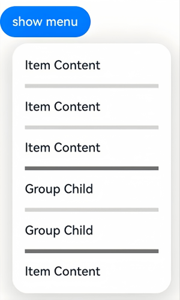

# Menu

更新时间：2026-03-09 02:50:43

来源：https://developer.huawei.com/consumer/cn/doc/harmonyos-references/ts-basic-components-menu
**支持设备：** Phone | PC/2in1 | Tablet | Wearable | TV

以垂直列表形式显示的菜单。
 
> [!NOTE]
> 该组件从API version 9开始支持。后续版本如有新增内容，则采用上角标单独标记该内容的起始版本。 Menu组件需和 bindMenu 或 bindContextMenu 方法配合使用，不支持作为普通组件单独使用。

  

#### 子组件

**支持设备：** Phone | PC/2in1 | Tablet | Wearable | TV

包含[MenuItem](https://developer.huawei.com/consumer/cn/doc/harmonyos-references/ts-basic-components-menuitem)、[MenuItemGroup](https://developer.huawei.com/consumer/cn/doc/harmonyos-references/ts-basic-components-menuitemgroup)子组件。
 
  

#### 接口

**支持设备：** Phone | PC/2in1 | Tablet | Wearable | TV

Menu()
 
作为菜单的固定容器，无参数。
 
> [!NOTE]
> 菜单和菜单项宽度计算规则： 布局过程中，期望每个菜单项的宽度一致。若子组件设置了宽度，则以 尺寸计算规则 为准。 Menu不设置宽度的情况：Menu会对子组件MenuItem、MenuItemGroup设置默认2栅格的宽度，若菜单项内容区比2栅格宽，则会自适应撑开。 Menu设置宽度的情况：Menu会对子组件MenuItem、MenuItemGroup设置减去padding后的固定宽度。 Menu支持设置的最小宽度为64vp。 Menu不支持的通用属性： outline 下的属性、 shadow 。

 
**元服务API：** 从API version 11开始，该接口支持在元服务中使用。
 
**系统能力：** SystemCapability.ArkUI.ArkUI.Full
 
  

#### 属性

**支持设备：** Phone | PC/2in1 | Tablet | Wearable | TV

除支持[通用属性](https://developer.huawei.com/consumer/cn/doc/harmonyos-references/ts-component-general-attributes)外，还支持以下属性：
 
  

#### font10+

**支持设备：** Phone | PC/2in1 | Tablet | Wearable | TV

font(value: Font)
 
统一设置Menu中所有文本的尺寸。
 
**元服务API：** 从API version 11开始，该接口支持在元服务中使用。
 
**系统能力：** SystemCapability.ArkUI.ArkUI.Full
 
**参数：**
  
| 参数名 | 类型 | 必填 | 说明 |
| --- | --- | --- | --- |
| value | Font | 是 | Menu中所有文本的尺寸。 默认值： { size: 16, family: 'HarmonyOS Sans', weight: FontWeight.Medium, style: FontStyle.Normal } |
 
 
  

#### fontColor10+

**支持设备：** Phone | PC/2in1 | Tablet | Wearable | TV

fontColor(value: ResourceColor)
 
统一设置Menu中所有文本的颜色。
 
**元服务API：** 从API version 11开始，该接口支持在元服务中使用。
 
**系统能力：** SystemCapability.ArkUI.ArkUI.Full
 
**参数：**
  
| 参数名 | 类型 | 必填 | 说明 |
| --- | --- | --- | --- |
| value | ResourceColor | 是 | Menu中所有文本的颜色。 |
 
 
  

#### radius10+

**支持设备：** Phone | PC/2in1 | Tablet | Wearable | TV

radius(value: Dimension | BorderRadiuses)
 
设置Menu边框圆角半径。
 
**元服务API：** 从API version 11开始，该接口支持在元服务中使用。
 
**系统能力：** SystemCapability.ArkUI.ArkUI.Full
 
**参数：**
  
| 参数名 | 类型 | 必填 | 说明 |
| --- | --- | --- | --- |
| value | Dimension \| BorderRadiuses | 是 | Menu边框圆角半径。 默认值：2in1设备上默认值为8vp，其他设备上默认值为20vp。 从API version 12开始，当水平方向两个圆角半径之和的最大值大于菜单宽度，或垂直方向两个圆角半径之和的最大值大于菜单高度时，菜单四个圆角均采用菜单默认圆角半径值。 当设置Dimension类型且传参为异常值时，菜单圆角取默认值。 当设置BorderRadiuses类型且传参为异常值时，菜单默认没有圆角。 |
 
 
  

#### menuItemDivider12+

**支持设备：** Phone | PC/2in1 | Tablet | Wearable | TV

menuItemDivider(options: DividerStyleOptions | undefined)
 
设置menuItem分割线样式，不设置该属性则不展示分割线。
 
startMargin + endMargin 超过组件宽度后startMargin和endMargin会被置0。
 
**元服务API：** 从API version 12开始，该接口支持在元服务中使用。
 
**系统能力：** SystemCapability.ArkUI.ArkUI.Full
 
**参数：**
  
| 参数名 | 类型 | 必填 | 说明 |
| --- | --- | --- | --- |
| options | DividerStyleOptions \| undefined | 是 | 设置menuItem分割线样式。 -strokeWidth：分割线的线宽。 -color：分割线的颜色。 -startMargin：分割线与menuItem侧边起始端的距离。 -endMargin：分割线与menuItem侧边结束端的距离。 -mode：分割线的模式，默认值为FLOATING_ABOVE_MENU。 |
 
 
  

#### menuItemGroupDivider12+

**支持设备：** Phone | PC/2in1 | Tablet | Wearable | TV

menuItemGroupDivider(options: DividerStyleOptions | undefined)
 
设置menuItemGroup上下分割线的样式，不设置该属性则默认展示分割线。
 
**元服务API：** 从API version 12开始，该接口支持在元服务中使用。
 
**系统能力：** SystemCapability.ArkUI.ArkUI.Full
 
**参数：**
  
| 参数名 | 类型 | 必填 | 说明 |
| --- | --- | --- | --- |
| options | DividerStyleOptions \| undefined | 是 | 设置menuItemGroup顶部和底部分割线样式。 -strokeWidth：分割线的线宽，默认值是1px。 -color：分割线的颜色，默认值是 #33000000。 -startMargin：分割线与menuItemGroup侧边起始端的距离，默认为16vp，单位为vp。 -endMargin：分割线与menuItemGroup侧边结束端的距离，默认为16vp，单位为vp。 -mode：分割线的模式，默认值为FLOATING_ABOVE_MENU。 |
 
 
  

#### subMenuExpandingMode12+

**支持设备：** Phone | PC/2in1 | Tablet | Wearable | TV

subMenuExpandingMode(mode: SubMenuExpandingMode)
 
设置Menu子菜单展开样式。
 
**元服务API：** 从API version 12开始，该接口支持在元服务中使用。
 
**系统能力：** SystemCapability.ArkUI.ArkUI.Full
 
**参数：**
  
| 参数名 | 类型 | 必填 | 说明 |
| --- | --- | --- | --- |
| mode | SubMenuExpandingMode | 是 | Menu子菜单展开样式。 默认值：SubMenuExpandingMode.SIDE_EXPAND |
 
 
  

#### subMenuExpandSymbol20+

**支持设备：** Phone | PC/2in1 | Tablet | Wearable | TV

subMenuExpandSymbol(symbol: SymbolGlyphModifier)
 
设置Menu子菜单展开符号。
 
**元服务API：** 从API version 20开始，该接口支持在元服务中使用。
 
**系统能力：** SystemCapability.ArkUI.ArkUI.Full
 
**参数：**
  
| 参数名 | 类型 | 必填 | 说明 |
| --- | --- | --- | --- |
| symbol | SymbolGlyphModifier | 是 | Menu子菜单展开符号。 1、子菜单的展开样式为SubMenuExpandingMode.SIDE_EXPAND时，不显示展开符号。 2、子菜单的展开样式为SubMenuExpandingMode.EMBEDDED_EXPAND时，展开时展开符号会顺时针旋转180°。 默认值：\$r('sys.symbol.chevron_down').fontSize('24vp') 3、子菜单的展开样式为SubMenuExpandingMode.STACK_EXPAND时，展开时展开符号会顺时针旋转90°。 默认值：\$r('sys.symbol.chevron_forward').fontSize('20vp').padding('2vp') |
 
 
  

#### fontSize(deprecated)

**支持设备：** Phone | PC/2in1 | Tablet | Wearable | TV

fontSize(value: Length)
 
统一设置Menu中所有文本的尺寸。
 
> [!NOTE]
> 从API version 9开始支持，从API version 10开始废弃，建议使用 font 代替。

 
**系统能力：** SystemCapability.ArkUI.ArkUI.Full
 
**参数：**
  
| 参数名 | 类型 | 必填 | 说明 |
| --- | --- | --- | --- |
| value | Length | 是 | Menu中所有文本的尺寸，Length为number类型时，使用fp单位。不支持设置百分比。 |
 
 
  

#### SubMenuExpandingMode12+枚举说明

**支持设备：** Phone | PC/2in1 | Tablet | Wearable | TV

Menu子菜单展开样式枚举。
 
**元服务API：** 从API version 12开始，该接口支持在元服务中使用。
 
**系统能力：** SystemCapability.ArkUI.ArkUI.Full
  
| 名称 | 值 | 说明 |
| --- | --- | --- |
| SIDE_EXPAND | 0 | 默认展开样式，子菜单位于同一平面侧边展开。 |
| EMBEDDED_EXPAND | 1 | 直接展开样式，子菜单嵌于主菜单内展开。 |
| STACK_EXPAND | 2 | 堆叠样式，子菜单浮于主菜单上方展开。 |
 
 
  

#### 示例

**支持设备：** Phone | PC/2in1 | Tablet | Wearable | TV

  

#### 示例1（设置多级菜单）

该示例通过配置MenuItem中的builder参数实现多级菜单。
 
```text
@Entry
@Component
struct Index {
  @State select: boolean = true;
  // $r('app.media.xxx')需要替换为开发者所需的图像资源文件。
  private iconStr: ResourceStr = $r("app.media.view_list_filled");
  private iconStr2: ResourceStr = $r("app.media.arrow_right_filled");

  @Builder
  SubMenu() {
    Menu() {
      MenuItem({ content: "复制", labelInfo: "Ctrl+C" })
      MenuItem({ content: "粘贴", labelInfo: "Ctrl+V" })
    }
  }

  @Builder
  MyMenu(){
    Menu() {
      MenuItem({ startIcon: $r("app.media.icon"), content: "菜单选项" })
      MenuItem({ startIcon: $r("app.media.icon"), content: "菜单选项" })
        .enabled(false)
      MenuItem({
        startIcon: this.iconStr,
        content: "菜单选项",
        endIcon: this.iconStr2,
        builder: ():void=>this.SubMenu()
      })
      MenuItemGroup({ header: '小标题' }) {
        MenuItem({
          startIcon: this.iconStr,
          content: "菜单选项",
          endIcon: this.iconStr2,
          builder: ():void=>this.SubMenu()
        })
        MenuItem({
          startIcon: $r("app.media.app_icon"),
          content: "菜单选项",
          endIcon: this.iconStr2,
          builder: ():void=>this.SubMenu()
        })
      }
      MenuItem({
        startIcon: this.iconStr,
        content: "菜单选项",
      })
    }
  }

  build() {
    Row() {
      Column() {
        Text('click to show menu')
          .fontSize(50)
          .fontWeight(FontWeight.Bold)
      }
      .bindMenu(this.MyMenu)
      .width('100%')
    }
    .height('100%')
  }
}
```
 



 
  

#### 示例2（设置symbol类型图标）

该示例通过配置symbolStartIcon、symbolEndIcon实现symbol类型图标的菜单。
 
```ArkTS
// xxx.ets
import { SymbolGlyphModifier } from '@kit.ArkUI';

@Entry
@Component
struct Index {
  @State startIconModifier: SymbolGlyphModifier = new SymbolGlyphModifier($r('sys.symbol.ohos_mic')).fontSize('24vp');
  @State endIconModifier: SymbolGlyphModifier = new SymbolGlyphModifier($r('sys.symbol.ohos_trash')).fontSize('24vp');
  @State selectIconModifier: SymbolGlyphModifier =
    new SymbolGlyphModifier($r('sys.symbol.checkmark')).fontSize('24vp');
  @State select: boolean = true;

  @Builder
  SubMenu() {
    Menu() {
      MenuItem({ content: "复制", labelInfo: "Ctrl+C" })
      MenuItem({ content: "粘贴", labelInfo: "Ctrl+V" })
    }
  }

  @Builder
  MyMenu() {
    Menu() {
      MenuItem({ symbolStartIcon: this.startIconModifier, content: "菜单选项" })
      MenuItem({ symbolStartIcon: this.startIconModifier, content: "菜单选项" })
        .enabled(false)
      MenuItem({
        symbolStartIcon: this.startIconModifier,
        content: "菜单选项",
        symbolEndIcon: this.endIconModifier,
        builder: (): void => this.SubMenu()
      })
      MenuItemGroup({ header: '小标题' }) {
        MenuItem({
          symbolStartIcon: this.startIconModifier,
          content: "菜单选项",
          symbolEndIcon: this.endIconModifier,
          builder: (): void => this.SubMenu()
        })
        MenuItem({
          symbolStartIcon: this.startIconModifier,
          content: "菜单选项",
          symbolEndIcon: this.endIconModifier,
          builder: (): void => this.SubMenu()
        })
      }
      MenuItem({
        content: "菜单选项",
      }).selected(this.select).selectIcon(this.selectIconModifier)
    }
  }

  build() {
    Row() {
      Column() {
        Text('click to show menu')
          .fontSize(50)
          .fontWeight(FontWeight.Bold)
      }
      .bindMenu(this.MyMenu)
      .width('100%')
    }
    .height('100%')
  }
}
```
 


 
  

#### 示例3（设置Menu子菜单展开符号）

该示例通过配置subMenuExpandSymbol实现对Menu子菜单展开符号配置颜色。
 
```text
import { SymbolGlyphModifier } from '@kit.ArkUI';

@Entry
@Component
struct Index {
  @State startIconModifier: SymbolGlyphModifier = new SymbolGlyphModifier($r('sys.symbol.ohos_star'))
  @State endIconModifier: SymbolGlyphModifier = new SymbolGlyphModifier($r('sys.symbol.ohos_mic'))
  @State expandSymbolModifier: SymbolGlyphModifier =
    new SymbolGlyphModifier($r('sys.symbol.chevron_down')).fontColor([Color.Red]).fontSize('24vp')

  @Builder
  SubMenu() {
    Menu() {
      MenuItem({
        symbolStartIcon: this.startIconModifier,
        content: "图标"
      })
      MenuItem({
        symbolStartIcon: this.startIconModifier,
        content: "列表"
      })
    }.backgroundColor(Color.Grey)
  }

  @Builder
  MyMenu() {
    Menu() {
      MenuItem({
        symbolStartIcon: this.startIconModifier,
        symbolEndIcon: this.endIconModifier,
        content: "新建文件夹",
        builder: (): void => this.SubMenu(),
      })
      MenuItem({
        symbolStartIcon: this.startIconModifier,
        content: "排序方式",
        builder: (): void => this.SubMenu(),
      })
      MenuItem({
        symbolStartIcon: this.startIconModifier,
        content: "查看方式",
        builder: (): void => this.SubMenu(),
      })
    }
    .subMenuExpandingMode(SubMenuExpandingMode.EMBEDDED_EXPAND)
    .backgroundColor(Color.Grey)
    .subMenuExpandSymbol(this.expandSymbolModifier)
  }

  build() {
    Button('click to show menu')
      .position({ top: 40, left: 40 })
      .bindMenu(this.MyMenu)
  }
}
```
 


 
  

#### 示例4（设置分割线样式）

该示例通过设置menuItemGroupDivider属性实现分割线样式。
 
```text
import { LengthMetrics } from '@kit.ArkUI'

@Entry
@Component
struct Index {

  @Builder
  MyMenu() {
    Menu() {
      MenuItem({ content: "Item Content" })
      MenuItem({ content: "Item Content" })
      MenuItem({ content: "Item Content" })
      MenuItemGroup() {
        MenuItem({ content: "Group Child" })
        MenuItem({ content: "Group Child" })
      }
      MenuItem({ content: "Item Content" })
    }
    .menuItemDivider({
      strokeWidth: LengthMetrics.vp(5),
      color: '#d5d5d5',
      mode: DividerMode.EMBEDDED_IN_MENU
    })
    .menuItemGroupDivider({
      strokeWidth: LengthMetrics.vp(5),
      color: '#707070',
      mode: DividerMode.EMBEDDED_IN_MENU
    })
  }

  build() {
    RelativeContainer() {
      Button("show menu")
        .bindMenu(this.MyMenu())
    }
    .height('100%')
    .width('100%')
  }
}
```
 


