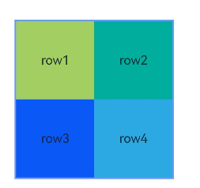
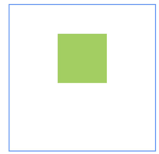
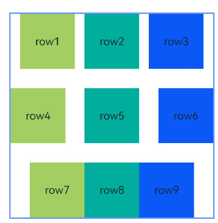
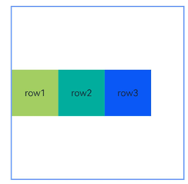

# RelativeContainer

更新时间：2026-04-28 03:31:56

来源：https://developer.huawei.com/consumer/cn/doc/harmonyos-references/ts-container-relativecontainer
**支持设备：** Phone / PC/2in1 / Tablet / Wearable / TV

相对布局组件，用于复杂场景中元素对齐的布局。

子组件可以通过设置[alignRules](https://developer.huawei.com/consumer/cn/doc/harmonyos-references/ts-universal-attributes-location#alignrules9)来设置自身在相对容器中的对齐规则。


## 子组件
**支持设备：** Phone / PC/2in1 / Tablet / Wearable / TV

支持多个子组件。


## 接口
**支持设备：** Phone / PC/2in1 / Tablet / Wearable / TV

RelativeContainer()

相对布局组件，用于复杂场景中元素对齐的布局。

**卡片能力：** 从API version 9开始，该接口支持在ArkTS卡片中使用。

**元服务API：** 从API version 11开始，该接口支持在元服务中使用。

**系统能力：** SystemCapability.ArkUI.ArkUI.Full


## 属性
**支持设备：** Phone / PC/2in1 / Tablet / Wearable / TV

除支持[通用属性](https://developer.huawei.com/consumer/cn/doc/harmonyos-references/ts-component-general-attributes)外，还支持如下属性：


### guideLine12+
**支持设备：** Phone / PC/2in1 / Tablet / Wearable / TV

guideLine(value: Array<GuideLineStyle>)

设置RelativeContainer容器内的[辅助线](https://developer.huawei.com/consumer/cn/doc/harmonyos-guides/arkts-layout-development-relative-layout#使用辅助线辅助定位子组件)，Array中每个项目即为一条guideLine。

**元服务API：** 从API version 12开始，该接口支持在元服务中使用。

**系统能力：** SystemCapability.ArkUI.ArkUI.Full

**参数：**


| 参数名 | 类型 | 必填 | 说明 |
| --- | --- | --- | --- |
| value | Array&lt;[GuideLineStyle](#guidelinestyle12对象说明)&gt; | 是 | RelativeContainer容器内的辅助线。 |


### barrier12+
**支持设备：** Phone / PC/2in1 / Tablet / Wearable / TV

barrier(value: Array<BarrierStyle>)

设置RelativeContainer容器内的[屏障](https://developer.huawei.com/consumer/cn/doc/harmonyos-guides/arkts-layout-development-relative-layout#多个组件的屏障)，Array中每个项目即为一条barrier。

**元服务API：** 从API version 12开始，该接口支持在元服务中使用。

**系统能力：** SystemCapability.ArkUI.ArkUI.Full

**参数：**


| 参数名 | 类型 | 必填 | 说明 |
| --- | --- | --- | --- |
| value | Array&lt;[BarrierStyle](#barrierstyle12对象说明)&gt; | 是 | RelativeContainer容器内的屏障。 |


### barrier12+
**支持设备：** Phone / PC/2in1 / Tablet / Wearable / TV

barrier(barrierStyle: Array<LocalizedBarrierStyle>)

设置RelativeContainer容器内的屏障，Array中每个项目即为一条barrier，支持定义镜像模式的屏障线。

**元服务API：** 从API version 12开始，该接口支持在元服务中使用。

**系统能力：** SystemCapability.ArkUI.ArkUI.Full

**参数：**


| 参数名 | 类型 | 必填 | 说明 |
| --- | --- | --- | --- |
| barrierStyle | Array&lt;[LocalizedBarrierStyle](#localizedbarrierstyle12对象说明)&gt; | 是 | RelativeContainer容器内的屏障。 |


## GuideLineStyle12+对象说明
**支持设备：** Phone / PC/2in1 / Tablet / Wearable / TV

guideLine参数，用于定义一条guideLine的id、方向和位置。

**元服务API：** 从API version 12开始，该接口支持在元服务中使用。

**系统能力：** SystemCapability.ArkUI.ArkUI.Full


| 名称 | 类型 | 只读 | 可选 | 说明 |
| --- | --- | --- | --- | --- |
| id | string | 否 | 否 | guideLine的id，必须是唯一的并且不可与容器内组件重名。 |
| direction | [Axis](https://developer.huawei.com/consumer/cn/doc/harmonyos-references/ts-appendix-enums#axis) | 否 | 否 | 指定guideLine的方向。          垂直方向的guideLine仅能作为组件水平方向的锚点，作为垂直方向的锚点时值为0；水平方向的guideLine仅能作为组件垂直方向的锚点，作为水平方向的锚点时值为0。          默认值：Axis.Vertical          非法值：按默认值处理。 |
| position | [GuideLinePosition](#guidelineposition12对象说明) | 否 | 否 | 指定guideLine的位置。          当未声明或声明异常值（如undefined）时，guideLine的位置默认为start: 0。start和end两种声明方式选择一种即可。若同时声明，仅start生效。若容器在某个方向的size被声明为"auto"，则该方向上guideLine的位置只能使用start方式声明（不允许使用百分比）。          默认值：          {          start: 0          }          非法值：按默认值处理。 |


## GuideLinePosition12+对象说明
**支持设备：** Phone / PC/2in1 / Tablet / Wearable / TV

guideLine位置参数，用于定义guideLine的位置。

**元服务API：** 从API version 12开始，该接口支持在元服务中使用。

**系统能力：** SystemCapability.ArkUI.ArkUI.Full


| 名称 | 类型 | 只读 | 可选 | 说明 |
| --- | --- | --- | --- | --- |
| start | [Dimension](https://developer.huawei.com/consumer/cn/doc/harmonyos-references/ts-types#dimension10) | 否 | 是 | guideLine距离容器左侧或者顶部的距离。 |
| end | [Dimension](https://developer.huawei.com/consumer/cn/doc/harmonyos-references/ts-types#dimension10) | 否 | 是 | guideLine距离容器右侧或者底部的距离。 |


## BarrierStyle12+对象说明
**支持设备：** Phone / PC/2in1 / Tablet / Wearable / TV

barrier参数，用于定义一条barrier的id、方向和生成时所依赖的组件。

**元服务API：** 从API version 12开始，该接口支持在元服务中使用。

**系统能力：** SystemCapability.ArkUI.ArkUI.Full


| 名称 | 类型 | 只读 | 可选 | 说明 |
| --- | --- | --- | --- | --- |
| id | string | 否 | 否 | barrier的id，必须是唯一的并且不可与容器内组件重名。 |
| direction | [BarrierDirection](https://developer.huawei.com/consumer/cn/doc/harmonyos-references/ts-container-relativecontainer#barrierdirection12枚举说明) | 否 | 否 | 指定barrier的方向。          垂直方向（TOP，BOTTOM）的barrier仅能作为组件的水平方向锚点，用作垂直方向锚点时值为0；水平方向（LEFT，RIGHT）的barrier仅能作为组件的垂直方向锚点，用作水平方向锚点时值为0。          默认值：BarrierDirection.LEFT          非法值：按默认值处理。 |
| referencedId | Array&lt;string&gt; | 否 | 否 | 指定生成barrier所依赖的组件。 |


## BarrierDirection12+枚举说明
**支持设备：** Phone / PC/2in1 / Tablet / Wearable / TV

定义屏障线的方向。

**元服务API：** 从API version 12开始，该接口支持在元服务中使用。

**系统能力：** SystemCapability.ArkUI.ArkUI.Full


| 名称 | 值 | 说明 |
| --- | --- | --- |
| LEFT | 0 | 屏障在其所有[referencedId](https://developer.huawei.com/consumer/cn/doc/harmonyos-references/ts-container-relativecontainer#barrierstyle12对象说明)的最左侧。 |
| RIGHT | 1 | 屏障在其所有[referencedId](https://developer.huawei.com/consumer/cn/doc/harmonyos-references/ts-container-relativecontainer#barrierstyle12对象说明)的最右侧。 |
| TOP | 2 | 屏障在其所有[referencedId](https://developer.huawei.com/consumer/cn/doc/harmonyos-references/ts-container-relativecontainer#barrierstyle12对象说明)的最上方。 |
| BOTTOM | 3 | 屏障在其所有[referencedId](https://developer.huawei.com/consumer/cn/doc/harmonyos-references/ts-container-relativecontainer#barrierstyle12对象说明)的最下方。 |


## LocalizedBarrierStyle12+对象说明
**支持设备：** Phone / PC/2in1 / Tablet / Wearable / TV

barrier参数，用于定义一条barrier的id、方向和生成时所依赖的组件。

**元服务API：** 从API version 12开始，该接口支持在元服务中使用。

**系统能力：** SystemCapability.ArkUI.ArkUI.Full


| 名称 | 类型 | 只读 | 可选 | 说明 |
| --- | --- | --- | --- | --- |
| id | string | 否 | 否 | barrier的id，必须是唯一的并且不可与容器内组件重名。 |
| localizedDirection | [LocalizedBarrierDirection](#localizedbarrierdirection12枚举说明) | 否 | 否 | 指定barrier的方向。          垂直方向（TOP，BOTTOM）的barrier仅能作为组件的水平方向锚点，作为垂直方向锚点时值为0。水平方向（START，END）的barrier仅能作为组件的垂直方向锚点，作为水平方向锚点时值为0。 |
| referencedId | Array&lt;string&gt; | 否 | 否 | 指定生成barrier所依赖的组件。 |


## LocalizedBarrierDirection12+枚举说明
**支持设备：** Phone / PC/2in1 / Tablet / Wearable / TV

定义支持镜像模式的屏障线的方向。

**元服务API：** 从API version 12开始，该接口支持在元服务中使用。

**系统能力：** SystemCapability.ArkUI.ArkUI.Full


| 名称 | 值 | 说明 |
| --- | --- | --- |
| START | 0 | 屏障在其所有[referencedId](#localizedbarrierstyle12对象说明)的最左/右侧，LTR模式时为最左侧，RTL模式时为最右侧。 |
| END | 1 | 屏障在其所有[referencedId](#localizedbarrierstyle12对象说明)的最左/右侧, LTR模式时为最右侧，RTL模式时为最左侧。 |
| TOP | 2 | 屏障在其所有[referencedId](#localizedbarrierstyle12对象说明)的最上方。 |
| BOTTOM | 3 | 屏障在其所有[referencedId](#localizedbarrierstyle12对象说明)的最下方。 |


## 事件
**支持设备：** Phone / PC/2in1 / Tablet / Wearable / TV

支持[通用事件](https://developer.huawei.com/consumer/cn/doc/harmonyos-references/ts-component-general-events)。


## 示例
**支持设备：** Phone / PC/2in1 / Tablet / Wearable / TV


### 示例1（以容器和容器内组件作为锚点进行布局）

本示例通过alignRules接口实现了以容器和容器内组件作为锚点进行布局的功能。


```ts
@Entry
@Component
struct Index {
  build() {
    Row() {
      RelativeContainer() {
        Row() {
          Text('row1')
        }
        .justifyContent(FlexAlign.Center)
        .width(100)
        .height(100)
        .backgroundColor('#a3cf62')
        .alignRules({
          top: { anchor: "__container__", align: VerticalAlign.Top },
          left: { anchor: "__container__", align: HorizontalAlign.Start }
        })
        .id("row1")

        Row() {
          Text('row2')
        }
        .justifyContent(FlexAlign.Center)
        .width(100)
        .height(100)
        .backgroundColor('#00ae9d')
        .alignRules({
          top: { anchor: "__container__", align: VerticalAlign.Top },
          right: { anchor: "__container__", align: HorizontalAlign.End }
        })
        .id("row2")

        Row() {
          Text('row3')
        }
        .justifyContent(FlexAlign.Center)
        .height(100)
        .backgroundColor('#0a59f7')
        .alignRules({
          top: { anchor: "row1", align: VerticalAlign.Bottom },
          left: { anchor: "row1", align: HorizontalAlign.End },
          right: { anchor: "row2", align: HorizontalAlign.Start }
        })
        .id("row3")

        Row() {
          Text('row4')
        }.justifyContent(FlexAlign.Center)
        .backgroundColor('#2ca9e0')
        .alignRules({
          top: { anchor: "row3", align: VerticalAlign.Bottom },
          bottom: { anchor: "__container__", align: VerticalAlign.Bottom },
          left: { anchor: "__container__", align: HorizontalAlign.Start },
          right: { anchor: "row1", align: HorizontalAlign.End }
        })
        .id("row4")

        Row() {
          Text('row5')
        }.justifyContent(FlexAlign.Center)
        .backgroundColor('#30c9f7')
        .alignRules({
          top: { anchor: "row3", align: VerticalAlign.Bottom },
          bottom: { anchor: "__container__", align: VerticalAlign.Bottom },
          left: { anchor: "row2", align: HorizontalAlign.Start },
          right: { anchor: "__container__", align: HorizontalAlign.End }
        })
        .id("row5")
      }
      .width(300).height(300)
      .margin({ left: 50 })
      .border({ width: 2, color: "#6699FF" })
    }
    .height('100%')
  }
}
```


### 示例2（子组件设置外边距）

本示例展示容器内子组件设置外边距的方法。


```ts
@Entry
@Component
struct Index {
  build() {
    Row() {
      RelativeContainer() {
        Row() {
          Text('row1')
        }
        .justifyContent(FlexAlign.Center)
        .width(100)
        .height(100)
        .backgroundColor('#a3cf62')
        .alignRules({
          top: { anchor: "__container__", align: VerticalAlign.Top },
          left: { anchor: "__container__", align: HorizontalAlign.Start }
        })
        .id("row1")
        .margin(10)

        Row() {
          Text('row2')
        }
        .justifyContent(FlexAlign.Center)
        .width(100)
        .height(100)
        .backgroundColor('#00ae9d')
        .alignRules({
          left: { anchor: "row1", align: HorizontalAlign.End },
          top: { anchor: "row1", align: VerticalAlign.Top }
        })
        .id("row2")

        Row() {
          Text('row3')
        }
        .justifyContent(FlexAlign.Center)
        .width(100)
        .height(100)
        .backgroundColor('#0a59f7')
        .alignRules({
          left: { anchor: "row1", align: HorizontalAlign.Start },
          top: { anchor: "row1", align: VerticalAlign.Bottom }
        })
        .id("row3")

        Row() {
          Text('row4')
        }
        .justifyContent(FlexAlign.Center)
        .width(100)
        .height(100)
        .backgroundColor('#2ca9e0')
        .alignRules({
          left: { anchor: "row3", align: HorizontalAlign.End },
          top: { anchor: "row2", align: VerticalAlign.Bottom }
        })
        .id("row4")
        .margin(10)
      }
      .width(300).height(300)
      .margin({ left: 50 })
      .border({ width: 2, color: "#6699FF" })
    }
    .height('100%')
  }
}
```


### 示例3（设置容器大小自适应内容）

本示例展示了容器大小适应内容（声明width或height为"auto"）的用法。


```ts
@Entry
@Component
struct Index {
  build() {
    Row() {
      RelativeContainer() {
        Row() {
          Text('row1')
        }
        .justifyContent(FlexAlign.Center)
        .width(100)
        .height(100)
        .backgroundColor('#a3cf62')
        .id("row1")

        Row() {
          Text('row2')
        }
        .justifyContent(FlexAlign.Center)
        .width(100)
        .height(100)
        .backgroundColor('#00ae9d')
        .alignRules({
          left: { anchor: "row1", align: HorizontalAlign.End },
          top: { anchor: "row1", align: VerticalAlign.Top }
        })
        .id("row2")

        Row() {
          Text('row3')
        }
        .justifyContent(FlexAlign.Center)
        .width(100)
        .height(100)
        .backgroundColor('#0a59f7')
        .alignRules({
          left: { anchor: "row1", align: HorizontalAlign.Start },
          top: { anchor: "row1", align: VerticalAlign.Bottom }
        })
        .id("row3")

        Row() {
          Text('row4')
        }
        .justifyContent(FlexAlign.Center)
        .width(100)
        .height(100)
        .backgroundColor('#2ca9e0')
        .alignRules({
          left: { anchor: "row3", align: HorizontalAlign.End },
          top: { anchor: "row2", align: VerticalAlign.Bottom }
        })
        .id("row4")
      }
      .width("auto").height("auto")
      .margin({ left: 50 })
      .border({ width: 2, color: "#6699FF" })
    }
    .height('100%')
  }
}
```




### 示例4（设置偏移）

本示例通过[bias](https://developer.huawei.com/consumer/cn/doc/harmonyos-references/ts-types#bias对象说明)实现了子组件的位置在垂直方向的两个锚点间偏移的效果。


```ts
@Entry
@Component
struct Index {
  build() {
    Row() {
      RelativeContainer() {
        Row()
        .width(100)
        .height(100)
        .backgroundColor('#a3cf62')
        .alignRules({
          top: { anchor: "__container__", align: VerticalAlign.Top },
          bottom: { anchor: "__container__", align: VerticalAlign.Bottom },
          left: { anchor: "__container__", align: HorizontalAlign.Start },
          right: { anchor: "__container__", align: HorizontalAlign.End },
          bias: { vertical: 0.3 }
        })
        .id("row1")
      }
      .width(300).height(300)
      .margin({ left: 50 })
      .border({ width: 2, color: "#6699FF" })
    }
    .height('100%')
  }
}
```




### 示例5（设置辅助线）

本示例展示了相对布局组件通过[guideLine](#guideline12)接口设置辅助线，子组件以辅助线为锚点的功能。


```ts
@Entry
@Component
struct Index {
  build() {
    Row() {
      RelativeContainer() {
        Row()
        .width(100)
        .height(100)
        .backgroundColor('#a3cf62')
        .alignRules({
          left: { anchor: "guideline1", align: HorizontalAlign.End },
          top: { anchor: "guideline2", align: VerticalAlign.Top }
        })
        .id("row1")
      }
      .width(300)
      .height(300)
      .margin({ left: 50 })
      .border({ width: 2, color: "#6699FF" })
      .guideLine([{ id: "guideline1", direction: Axis.Vertical, position: { start: 50 } },
      { id: "guideline2", direction: Axis.Horizontal, position: { start: 50 } }])
    }
    .height('100%')
  }
}
```


### 示例6（设置屏障）

本示例展示了相对布局组件通过[barrier](#barrier12)接口设置屏障，子组件以屏障为锚点的用法。


```ts
@Entry
@Component
struct Index {
  build() {
    Row() {
      RelativeContainer() {
        Row() {
          Text('row1')
        }
        .justifyContent(FlexAlign.Center)
        .width(100)
        .height(100)
        .backgroundColor('#a3cf62')
        .id("row1")

        Row() {
          Text('row2')
        }
        .justifyContent(FlexAlign.Center)
        .width(100)
        .height(100)
        .backgroundColor('#00ae9d')
        .alignRules({
          middle: { anchor: "row1", align: HorizontalAlign.End },
          top: { anchor: "row1", align: VerticalAlign.Bottom }
        })
        .id("row2")

        Row() {
          Text('row3')
        }
        .justifyContent(FlexAlign.Center)
        .width(100)
        .height(100)
        .backgroundColor('#0a59f7')
        .alignRules({
          left: { anchor: "barrier1", align: HorizontalAlign.End },
          top: { anchor: "row1", align: VerticalAlign.Top }
        })
        .id("row3")

        Row() {
          Text('row4')
        }
        .justifyContent(FlexAlign.Center)
        .width(50)
        .height(50)
        .backgroundColor('#2ca9e0')
        .alignRules({
          left: { anchor: "row1", align: HorizontalAlign.Start },
          top: { anchor: "barrier2", align: VerticalAlign.Bottom }
        })
        .id("row4")
      }
      .width(300)
      .height(300)
      .margin({ left: 50 })
      .border({ width: 2, color: "#6699FF" })
      .barrier([{ id: "barrier1", direction: BarrierDirection.RIGHT, referencedId: ["row1", "row2"] },
      { id: "barrier2", direction: BarrierDirection.BOTTOM, referencedId: ["row1", "row2"] }])
    }
    .height('100%')
  }
}
```


### 示例7（设置链）

本示例通过[chainMode](https://developer.huawei.com/consumer/cn/doc/harmonyos-references/ts-universal-attributes-location#chainmode12)接口从上至下分别实现了水平方向的[SPREAD链，SPREAD_INSIDE链和PACKED链](https://developer.huawei.com/consumer/cn/doc/harmonyos-references/ts-universal-attributes-location#chainstyle12)。


```ts
@Entry
@Component
struct Index {
  build() {
    Row() {
      RelativeContainer() {
        Row() {
          Text('row1')
        }
        .justifyContent(FlexAlign.Center)
        .width(80)
        .height(80)
        .backgroundColor('#a3cf62')
        .alignRules({
          left: { anchor: "__container__", align: HorizontalAlign.Start },
          right: { anchor: "row2", align: HorizontalAlign.Start },
          top: { anchor: "__container__", align: VerticalAlign.Top }
        })
        .id("row1")
        .chainMode(Axis.Horizontal, ChainStyle.SPREAD)

        Row() {
          Text('row2')
        }
        .justifyContent(FlexAlign.Center)
        .width(80)
        .height(80)
        .backgroundColor('#00ae9d')
        .alignRules({
          left: { anchor: "row1", align: HorizontalAlign.End },
          right: { anchor: "row3", align: HorizontalAlign.Start },
          top: { anchor: "row1", align: VerticalAlign.Top }
        })
        .id("row2")

        Row() {
          Text('row3')
        }
        .justifyContent(FlexAlign.Center)
        .width(80)
        .height(80)
        .backgroundColor('#0a59f7')
        .alignRules({
          left: { anchor: "row2", align: HorizontalAlign.End },
          right: { anchor: "__container__", align: HorizontalAlign.End },
          top: { anchor: "row1", align: VerticalAlign.Top }
        })
        .id("row3")

        Row() {
          Text('row4')
        }
        .justifyContent(FlexAlign.Center)
        .width(80)
        .height(80)
        .backgroundColor('#a3cf62')
        .alignRules({
          left: { anchor: "__container__", align: HorizontalAlign.Start },
          right: { anchor: "row5", align: HorizontalAlign.Start },
          center: { anchor: "__container__", align: VerticalAlign.Center }
        })
        .id("row4")
        .chainMode(Axis.Horizontal, ChainStyle.SPREAD_INSIDE)

        Row() {
          Text('row5')
        }
        .justifyContent(FlexAlign.Center)
        .width(80)
        .height(80)
        .backgroundColor('#00ae9d')
        .alignRules({
          left: { anchor: "row4", align: HorizontalAlign.End },
          right: { anchor: "row6", align: HorizontalAlign.Start },
          top: { anchor: "row4", align: VerticalAlign.Top }
        })
        .id("row5")

        Row() {
          Text('row6')
        }
        .justifyContent(FlexAlign.Center)
        .width(80)
        .height(80)
        .backgroundColor('#0a59f7')
        .alignRules({
          left: { anchor: "row5", align: HorizontalAlign.End },
          right: { anchor: "__container__", align: HorizontalAlign.End },
          top: { anchor: "row4", align: VerticalAlign.Top }
        })
        .id("row6")

        Row() {
          Text('row7')
        }
        .justifyContent(FlexAlign.Center)
        .width(80)
        .height(80)
        .backgroundColor('#a3cf62')
        .alignRules({
          left: { anchor: "__container__", align: HorizontalAlign.Start },
          right: { anchor: "row8", align: HorizontalAlign.Start },
          bottom: { anchor: "__container__", align: VerticalAlign.Bottom }
        })
        .id("row7")
        .chainMode(Axis.Horizontal, ChainStyle.PACKED)

        Row() {
          Text('row8')
        }
        .justifyContent(FlexAlign.Center)
        .width(80)
        .height(80)
        .backgroundColor('#00ae9d')
        .alignRules({
          left: { anchor: "row7", align: HorizontalAlign.End },
          right: { anchor: "row9", align: HorizontalAlign.Start },
          top: { anchor: "row7", align: VerticalAlign.Top }
        })
        .id("row8")

        Row() {
          Text('row9')
        }
        .justifyContent(FlexAlign.Center)
        .width(80)
        .height(80)
        .backgroundColor('#0a59f7')
        .alignRules({
          left: { anchor: "row8", align: HorizontalAlign.End },
          right: { anchor: "__container__", align: HorizontalAlign.End },
          top: { anchor: "row7", align: VerticalAlign.Top }
        })
        .id("row9")
      }
      .width(300).height(300)
      .margin({ left: 50 })
      .border({ width: 2, color: "#6699FF" })
    }
    .height('100%')
  }
}
```




### 示例8（链中设置偏移）

本示例通过[chainMode](https://developer.huawei.com/consumer/cn/doc/harmonyos-references/ts-universal-attributes-location#chainmode12)和[bias](https://developer.huawei.com/consumer/cn/doc/harmonyos-references/ts-types#bias对象说明)接口实现了水平方向的带偏移的[PACKED链](https://developer.huawei.com/consumer/cn/doc/harmonyos-references/ts-universal-attributes-location#chainstyle12)。


```ts
@Entry
@Component
struct Index {
  build() {
    Row() {
      RelativeContainer() {
        Row() {
          Text('row1')
        }
        .justifyContent(FlexAlign.Center)
        .width(80)
        .height(80)
        .backgroundColor('#a3cf62')
        .alignRules({
          left: { anchor: "__container__", align: HorizontalAlign.Start },
          right: { anchor: "row2", align: HorizontalAlign.Start },
          center: { anchor: "__container__", align: VerticalAlign.Center },
          bias: { horizontal: 0 }
        })
        .id("row1")
        .chainMode(Axis.Horizontal, ChainStyle.PACKED)

        Row() {
          Text('row2')
        }
        .justifyContent(FlexAlign.Center)
        .width(80)
        .height(80)
        .backgroundColor('#00ae9d')
        .alignRules({
          left: { anchor: "row1", align: HorizontalAlign.End },
          right: { anchor: "row3", align: HorizontalAlign.Start },
          top: { anchor: "row1", align: VerticalAlign.Top }
        })
        .id("row2")

        Row() {
          Text('row3')
        }
        .justifyContent(FlexAlign.Center)
        .width(80)
        .height(80)
        .backgroundColor('#0a59f7')
        .alignRules({
          left: { anchor: "row2", align: HorizontalAlign.End },
          right: { anchor: "__container__", align: HorizontalAlign.End },
          top: { anchor: "row1", align: VerticalAlign.Top }
        })
        .id("row3")
      }
      .width(300).height(300)
      .margin({ left: 50 })
      .border({ width: 2, color: "#6699FF" })
    }
    .height('100%')
  }
}
```




### 示例9（设置镜像模式）

本示例展示了在镜像模式（direction声明Direction.Rtl）下以屏障为锚点时使用[LocalizedAlignRuleOptions](https://developer.huawei.com/consumer/cn/doc/harmonyos-references/ts-universal-attributes-location#localizedalignruleoptions12对象说明)和[LocalizedBarrierDirection](#localizedbarrierdirection12枚举说明)设置对齐方式的用法。


```ts
@Entry
@Component
struct Index {
  build() {
    Row() {
      RelativeContainer() {
        Row() {
          Text('row1')
        }
        .justifyContent(FlexAlign.Center)
        .width(100)
        .height(100)
        .backgroundColor('#a3cf62')
        .id("row1")

        Row() {
          Text('row2')
        }
        .justifyContent(FlexAlign.Center)
        .width(100)
        .height(100)
        .backgroundColor('#00ae9d')
        .alignRules({
          middle: { anchor: "row1", align: HorizontalAlign.End },
          top: { anchor: "row1", align: VerticalAlign.Bottom }
        })
        .id("row2")

        Row() {
          Text('row3')
        }
        .justifyContent(FlexAlign.Center)
        .width(100)
        .height(100)
        .backgroundColor('#0a59f7')
        .alignRules({
          start: { anchor: "barrier1", align: HorizontalAlign.End },
          top: { anchor: "row1", align: VerticalAlign.Top }
        })
        .id("row3")

        Row() {
          Text('row4')
        }
        .justifyContent(FlexAlign.Center)
        .width(50)
        .height(50)
        .backgroundColor('#2ca9e0')
        .alignRules({
          start: { anchor: "row1", align: HorizontalAlign.Start },
          top: { anchor: "barrier2", align: VerticalAlign.Bottom }
        })
        .id("row4")
      }
      .direction(Direction.Rtl)
      .width(300)
      .height(300)
      .margin({ left: 50 })
      .border({ width: 2, color: "#6699FF" })
      .barrier([{ id: "barrier1", localizedDirection: LocalizedBarrierDirection.END, referencedId: ["row1", "row2"] },
      { id: "barrier2", localizedDirection: LocalizedBarrierDirection.BOTTOM, referencedId: ["row1", "row2"] }])
    }
    .height('100%')
  }
}
```


### 示例10（设置链中节点权重）

本示例展示了链中节点使用[chainWeight](https://developer.huawei.com/consumer/cn/doc/harmonyos-references/ts-universal-attributes-location#chainweight14)设置尺寸权重的用法。


```ts
@Entry
@Component
struct Index {
  build() {
    Row() {
      RelativeContainer() {
        Row() {
          Text('row1')
        }
        .justifyContent(FlexAlign.Center)
        .width(80)
        .height(80)
        .backgroundColor('#a3cf62')
        .alignRules({
          left: { anchor: "__container__", align: HorizontalAlign.Start },
          right: { anchor: "row2", align: HorizontalAlign.Start },
          center: { anchor: "__container__", align: VerticalAlign.Center },
        })
        .id("row1")
        .chainMode(Axis.Horizontal, ChainStyle.PACKED)

        Row() {
          Text('row2')
        }
        .justifyContent(FlexAlign.Center)
        .width(80)
        .height(80)
        .backgroundColor('#00ae9d')
        .alignRules({
          left: { anchor: "row1", align: HorizontalAlign.End },
          right: { anchor: "row3", align: HorizontalAlign.Start },
          top: { anchor: "row1", align: VerticalAlign.Top }
        })
        .id("row2")
        .chainWeight({ horizontal: 1 })

        Row() {
          Text('row3')
        }
        .justifyContent(FlexAlign.Center)
        .width(80)
        .height(80)
        .backgroundColor('#0a59f7')
        .alignRules({
          left: { anchor: "row2", align: HorizontalAlign.End },
          right: { anchor: "__container__", align: HorizontalAlign.End },
          top: { anchor: "row1", align: VerticalAlign.Top }
        })
        .id("row3")
        .chainWeight({ horizontal: 2 })
      }
      .width(300).height(300)
      .margin({ left: 50 })
      .border({ width: 2, color: "#6699FF" })
    }
    .height('100%')
  }
}
```


