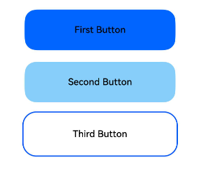

# 焦点事件

更新时间：2026-03-09 02:50:43

来源：https://developer.huawei.com/consumer/cn/doc/harmonyos-references/ts-universal-focus-event
**支持设备：** Phone / PC/2in1 / Tablet / Wearable / TV

焦点事件指页面焦点在可获焦组件间移动时触发的事件，组件可使用焦点事件来处理相关逻辑。


## onFocus
**支持设备：** Phone / PC/2in1 / Tablet / Wearable / TV

onFocus(event: () => void): T

当前组件获取焦点时触发的回调。

**元服务API：** 从API version 11开始，该接口支持在元服务中使用。

**系统能力：** SystemCapability.ArkUI.ArkUI.Full

**参数：**


| 参数名 | 类型 | 必填 | 说明 |
| --- | --- | --- | --- |
| event | () =&gt; void | 是 | onFocus的回调函数，表示组件已获焦。 |


**返回值：**


| 类型 | 说明 |
| --- | --- |
| T | 返回当前组件。 |


## onBlur
**支持设备：** Phone / PC/2in1 / Tablet / Wearable / TV

onBlur(event:() => void): T

当前组件失去焦点时触发的回调。

**元服务API：** 从API version 11开始，该接口支持在元服务中使用。

**系统能力：** SystemCapability.ArkUI.ArkUI.Full

**参数：**


| 参数名 | 类型 | 必填 | 说明 |
| --- | --- | --- | --- |
| event | () =&gt; void | 是 | onBlur的回调函数，表示组件已失焦。 |


**返回值：**


| 类型 | 说明 |
| --- | --- |
| T | 返回当前组件。 |


## 示例
**支持设备：** Phone / PC/2in1 / Tablet / Wearable / TV

该示例展示了组件获焦和失焦的情况，按钮获焦和失焦时会改变按钮的颜色。


```ts
// xxx.ets
@Entry
@Component
struct FocusEventExample {
  @State oneButtonColor: string = '#0066FF'
  @State twoButtonColor: string = '#87CEFA'
  @State threeButtonColor: string = '#90EE90'

  build() {
    Column({ space: 20 }) {
      // 通过外接键盘的Tab键激活焦点，并使用上下键让焦点在三个按钮间移动，按钮获焦时颜色变化，失焦时变回原背景色
      Button('First Button')
      .backgroundColor(this.oneButtonColor)
      .width(260)
      .height(70)
      .fontColor(Color.Black)
      .focusable(true)
      .onFocus(() => {
        this.oneButtonColor = '#FFFFFF'
      })
      .onBlur(() => {
        this.oneButtonColor = '#0066FF'
      })
      Button('Second Button')
      .backgroundColor(this.twoButtonColor)
      .width(260)
      .height(70)
      .fontColor(Color.Black)
      .focusable(true)
      .onFocus(() => {
        this.twoButtonColor = '#FFFFFF'
      })
      .onBlur(() => {
        this.twoButtonColor = '#87CEFA'
      })
      Button('Third Button')
      .backgroundColor(this.threeButtonColor)
      .width(260)
      .height(70)
      .fontColor(Color.Black)
      .focusable(true)
      .onFocus(() => {
        this.threeButtonColor = '#FFFFFF'
      })
      .onBlur(() => {
        this.threeButtonColor = '#90EE90'
      })
  }.width('100%').margin({ top: 20 })
  }
}
```


