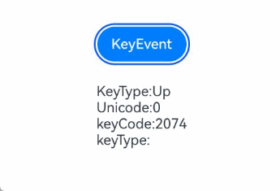
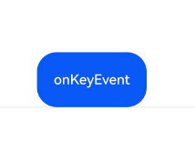

# 按键事件

更新时间：2026-04-20 06:34:33

来源：https://developer.huawei.com/consumer/cn/doc/harmonyos-references/ts-universal-events-key
**支持设备：** Phone | PC/2in1 | Tablet | Wearable | TV

按键事件是指组件与物理键盘、遥控器等按键设备交互时触发的事件，适用于所有可获焦组件，例如Button。对于默认不可获焦的组件，如Text，Image等，可以将[focusable](https://developer.huawei.com/consumer/cn/doc/harmonyos-references/ts-universal-attributes-focus#focusable)属性设置为true后使用按键事件。

按键事件触发的流程和具体时机参考[按键事件数据流](https://developer.huawei.com/consumer/cn/doc/harmonyos-guides/arkts-interaction-development-guide-keyboard#按键事件数据流)。

> [!NOTE]
> 本模块首批接口从API version 7开始支持。后续版本的新增接口，采用上角标单独标记接口的起始版本。


##### onKeyEvent

**支持设备：** Phone | PC/2in1 | Tablet | Wearable | TV

onKeyEvent(event: (event: KeyEvent) => void): T

绑定该方法的组件获焦后，按键动作触发该回调。

**元服务API：** 从API version 11开始，该接口支持在元服务中使用。

**系统能力：** SystemCapability.ArkUI.ArkUI.Full

**参数：**

| 参数名 | 类型 | 必填 | 说明 |
| --- | --- | --- | --- |
| event | (event: KeyEvent) => void | 是 | 获得KeyEvent对象。 |


**返回值：**

| 类型 | 说明 |
| --- | --- |
| T | 返回当前组件。 |


##### onKeyEvent15+

**支持设备：** Phone | PC/2in1 | Tablet | Wearable | TV

onKeyEvent(event: Callback<KeyEvent, boolean>): T

当绑定该方法的组件获焦后，按键操作将触发此回调。若此回调的返回值为true，则视为按键事件已被处理。

**元服务API：** 从API version 15开始，该接口支持在元服务中使用。

**系统能力：** SystemCapability.ArkUI.ArkUI.Full

**参数：**

| 参数名 | 类型 | 必填 | 说明 |
| --- | --- | --- | --- |
| event | Callback<KeyEvent, boolean> | 是 | 按键事件的回调。 |


**返回值：**

| 类型 | 说明 |
| --- | --- |
| T | 返回当前组件。 |


##### onKeyPreIme12+

**支持设备：** Phone | PC/2in1 | Tablet | Wearable | TV

onKeyPreIme(event: Callback<KeyEvent, boolean>): T

绑定该方法的组件获焦后，按键动作优先触发该回调。

该回调的返回值为true时，视作该按键事件已被消费，后续的事件回调（keyboardShortcut、输入法事件、onKeyEventDispatch、onKeyEvent）会被拦截，不再触发。

**元服务API：** 从API version 12开始，该接口支持在元服务中使用。

**系统能力：** SystemCapability.ArkUI.ArkUI.Full

**参数：**

| 参数名 | 类型 | 必填 | 说明 |
| --- | --- | --- | --- |
| event | Callback<KeyEvent, boolean> | 是 | 处理按键事件的回调。 |


**返回值：**

| 类型 | 说明 |
| --- | --- |
| T | 返回当前组件。 |


##### onKeyEventDispatch15+

**支持设备：** Phone | PC/2in1 | Tablet | Wearable | TV

onKeyEventDispatch(event: Callback<KeyEvent, boolean>): T

对应组件收到按键事件时，会触发该回调，该按键事件不会分发给其子组件。不支持构造KeyEvent进行分发，只支持分发已有的按键事件。

该回调的返回值为true时，视作该按键事件已被消费，不会[冒泡](https://developer.huawei.com/consumer/cn/doc/harmonyos-guides/arkts-interaction-basic-principles#事件冒泡)给父组件处理。

**元服务API：** 从API version 15开始，该接口支持在元服务中使用。

**系统能力：** SystemCapability.ArkUI.ArkUI.Full

**参数：**

| 参数名 | 类型 | 必填 | 说明 |
| --- | --- | --- | --- |
| event | Callback<KeyEvent, boolean> | 是 | 处理按键事件分发的回调。 |


**返回值：**

| 类型 | 说明 |
| --- | --- |
| T | 返回当前组件。 |


##### KeyEvent对象说明

**支持设备：** Phone | PC/2in1 | Tablet | Wearable | TV

**系统能力：** SystemCapability.ArkUI.ArkUI.Full

| 名称 | 类型 | 只读 | 可选 | 说明 |
| --- | --- | --- | --- | --- |
| type | KeyType | 否 | 否 | 按键的类型。 元服务API： 从API version 11开始，该接口支持在元服务中使用。 |
| keyCode | number | 否 | 否 | 按键的键值。按键设备提供的键值请参考KeyCode。 元服务API： 从API version 11开始，该接口支持在元服务中使用。 |
| keyText | string | 否 | 否 | 按键的名称。 元服务API： 从API version 11开始，该接口支持在元服务中使用。 |
| keySource | KeySource | 否 | 否 | 触发当前按键的输入设备类型。 元服务API： 从API version 11开始，该接口支持在元服务中使用。 |
| deviceId | number | 否 | 否 | 触发当前按键的输入设备ID。 元服务API： 从API version 11开始，该接口支持在元服务中使用。 |
| metaKey | number | 否 | 否 | 按键发生时元键（即键盘左下角紧挨Ctrl键或Fn标记了窗口logo的按键）的状态，1表示按压态，0表示未按压态。 元服务API： 从API version 11开始，该接口支持在元服务中使用。 |
| timestamp | number | 否 | 否 | 事件时间戳。触发事件时距离系统启动的时间间隔，单位：ns。 元服务API： 从API version 11开始，该接口支持在元服务中使用。 |
| stopPropagation | () => void | 否 | 否 | 阻塞事件冒泡传递。 元服务API： 从API version 11开始，该接口支持在元服务中使用。 |
| intentionCode10+ | IntentionCode | 否 | 否 | 按键对应的意图。 默认值：IntentionCode.INTENTION_UNKNOWN。 元服务API： 从API version 11开始，该接口支持在元服务中使用。 |
| unicode14+ | number | 否 | 是 | 按键的Unicode码值。支持范围为非空格的基本拉丁字符：0x0021-0x007E，不支持字符为0。组合键场景下，返回当前keyEvent对应按键的Unicode码值。 元服务API： 从API version 14开始，该接口支持在元服务中使用。 |
| isNumLockOn19+ | boolean | 否 | 是 | NumLock是否锁定（true: 锁定；false: 解锁）。 元服务API： 从API version 19开始，该接口支持在元服务中使用。 |
| isCapsLockOn19+ | boolean | 否 | 是 | CapsLock是否锁定（true: 锁定；false: 解锁）。 元服务API： 从API version 19开始，该接口支持在元服务中使用。 |
| isScrollLockOn19+ | boolean | 否 | 是 | ScrollLock是否锁定（true: 锁定；false: 解锁）。 元服务API： 从API version 19开始，该接口支持在元服务中使用。 |


##### getModifierKeyState12+

**支持设备：** Phone | PC/2in1 | Tablet | Wearable | TV

getModifierKeyState?(keys: Array&lt;string&gt;): boolean

获取功能键按压状态。

**元服务API：** 从API version 13开始，该接口支持在元服务中使用。

**系统能力：** SystemCapability.ArkUI.ArkUI.Full

**参数：**

| 参数名 | 类型 | 必填 | 说明 |
| --- | --- | --- | --- |
| keys | Array&lt;string&gt; | 是 | 功能键列表。支持功能键 'Ctrl'\| 'Alt' \| 'Shift'。 说明： 此接口不支持在手写笔场景下使用。 |


**返回值：**

| 类型 | 说明 |
| --- | --- |
| boolean | 功能键是否被按下。true表示被按下，false表示未被按下。 |


**错误码**：

以下错误码详细介绍请参考[通用错误码](https://developer.huawei.com/consumer/cn/doc/harmonyos-references/errorcode-universal)。

| 错误码ID | 错误信息 |
| --- | --- |
| 401 | Parameter error. Possible causes: 1. Incorrect parameter types. 2. Parameter verification failed. |


##### IntentionCode10+

**支持设备：** Phone | PC/2in1 | Tablet | Wearable | TV

type IntentionCode = IntentionCode

按键对应的意图。

**元服务API：** 从API version 11开始，该接口支持在元服务中使用。

**系统能力：** SystemCapability.ArkUI.ArkUI.Full

| 类型 | 说明 |
| --- | --- |
| IntentionCode | 按键对应的意图。 |


##### 示例

**支持设备：** Phone | PC/2in1 | Tablet | Wearable | TV


##### 示例1（触发onKeyEvent回调）

该示例通过按钮设置了按键事件。按钮获焦时，按下按键可触发onKeyEvent回调。按键事件触发的流程和具体时机参考[按键事件数据流](https://developer.huawei.com/consumer/cn/doc/harmonyos-guides/arkts-interaction-development-guide-keyboard#按键事件数据流)。

```ArkTS
// xxx.ets
@Entry
@Component
struct KeyEventExample {
  @State text: string = ''
  @State eventType: string = ''

  build() {
    Column() {
      Button('KeyEvent')
        .defaultFocus(true)
        .onKeyEvent((event?: KeyEvent) => {
          if (event) {
            if (event.type === KeyType.Down) {
              this.eventType = 'Down'
            }
            if (event.type === KeyType.Up) {
              this.eventType = 'Up'
            }
            this.text = 'KeyType:' + this.eventType + '\nkeyCode:' + event.keyCode + '\nkeyText:' + event.keyText +
              '\nintentionCode:' + event.intentionCode
          }
        })
      Text(this.text).padding(15)
    }.height(300).width('100%').padding(35)
  }
}
```





##### 示例2（获取Unicode码值）

该示例通过按键事件获取所按按键的Unicode码值。

```ArkTS
// xxx.ets
@Entry
@Component
struct KeyEventExample {
  @State text: string = ''
  @State eventType: string = ''
  @State keyType: string = ''

  build() {
    Column({ space: 10 }) {
      Button('KeyEvent')
        .onKeyEvent((event?: KeyEvent) => {
          if (event) {
            if (event.type === KeyType.Down) {
              this.eventType = 'Down'
            }
            if (event.type === KeyType.Up) {
              this.eventType = 'Up'
            }
            if (event.unicode == 97) {
              this.keyType = 'a'
            } else if (event.unicode == 65) {
              this.keyType = 'A'
            } else {
              this.keyType = ' '
            }
            this.text =
              'KeyType:' + this.eventType + '\nUnicode:' + event.unicode + '\nkeyCode:' + event.keyCode + '\nkeyType:' +
              this.keyType
          }
        })
      Text(this.text).padding(15)
    }.height(300).width('100%').padding(35)
  }
}
```





##### 示例3（触发onKeyPreIme回调）

该示例使用onKeyPreIme屏蔽输入框中的方向左键。

```text
import { KeyCode } from '@kit.InputKit';

@Entry
@Component
struct PreImeEventExample {
  @State buttonText: string = '';
  @State buttonType: string = '';
  @State columnText: string = '';
  @State columnType: string = '';

  build() {
    Column() {
      Search({
        placeholder: "Search..."
      })
        .width("80%")
        .height("40vp")
        .border({ radius: "20vp" })
        .onKeyPreIme((event: KeyEvent) => {
          // 使用方向左键不生效
          if (event.keyCode == KeyCode.KEYCODE_DPAD_LEFT) {
            return true;
          }
          return false;
        })
    }
  }
}
```


##### 示例4（使用stopPropagation阻止冒泡）

该示例使用stopPropagation阻止事件冒泡。即，通过在Button的onKeyEvent回调中加入event.stopPropagation()方法，达到“仅Button响应键盘事件，Column不响应”的效果。

> [!NOTE]
> onKeyEvent事件默认是冒泡的。 事件冒泡：在一个树形结构中，当子节点处理完一个事件后，再将该事件交给它的父节点处理。 可以在 onKeyEvent 15+ 中，通过返回true消费按键事件阻止冒泡，效果等同于stopPropagation。


```text
@Entry
@Component
struct KeyEventExample {
  @State buttonText: string = '';
  @State buttonType: string = '';
  @State columnText: string = '';
  @State columnType: string = '';

  build() {
    Column() {
      Button('onKeyEvent')
        .defaultFocus(true)
        .width(112).height(56)
        .onKeyEvent((event?: KeyEvent) => {
          // 通过stopPropagation阻止事件冒泡
          if (event) {
            if (event.stopPropagation) {
              event.stopPropagation();
            }
            if (event.type === KeyType.Down) {
              this.buttonType = 'Down';
            }
            if (event.type === KeyType.Up) {
              this.buttonType = 'Up';
            }
            this.buttonText = 'Button: \n' +
              'KeyType:' + this.buttonType + '\n' +
              'KeyCode:' + event.keyCode + '\n' +
              'KeyText:' + event.keyText;
          }
        })

      Divider()
      Text(this.buttonText).fontColor(Color.Green)

      Divider()
      Text(this.columnText).fontColor(Color.Red)
    }.width('100%').height('100%').justifyContent(FlexAlign.Center)
    .onKeyEvent((event?: KeyEvent) => { // 给父组件Column设置onKeyEvent事件
      if (event) {
        if (event.type === KeyType.Down) {
          this.columnType = 'Down';
        }
        if (event.type === KeyType.Up) {
          this.columnType = 'Up';
        }
        this.columnText = 'Column: \n' +
          'KeyType:' + this.columnType + '\n' +
          'KeyCode:' + event.keyCode + '\n' +
          'KeyText:' + event.keyText;
      }
    })
  }
}
```


