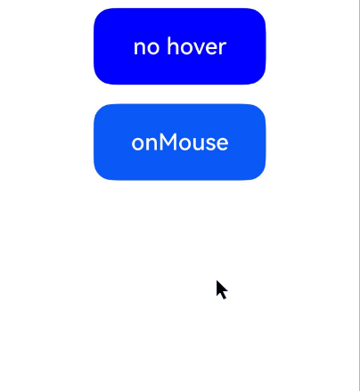

# 鼠标事件

更新时间：2026-04-30 02:41:24

来源：https://developer.huawei.com/consumer/cn/doc/harmonyos-references/ts-universal-mouse-key
**支持设备：** Phone / PC/2in1 / Tablet / Wearable / TV

在鼠标的单个动作触发多个事件时，事件的顺序是固定的，鼠标事件默认冒泡。


## onMouse
**支持设备：** Phone / PC/2in1 / Tablet / Wearable / TV

onMouse(event: (event: MouseEvent) => void): T

当前组件被鼠标按键点击时或者鼠标在组件上悬浮移动时，触发该回调。

**元服务API：** 从API version 11开始，该接口支持在元服务中使用。

**系统能力：** SystemCapability.ArkUI.ArkUI.Full

**参数：**


| 参数名 | 类型 | 必填 | 说明 |
| --- | --- | --- | --- |
| event | (event: [MouseEvent](#mouseevent对象说明)) =&gt; void | 是 | 返回触发事件时的时间戳、鼠标按键、动作、鼠标位置在整个屏幕上的坐标和相对于当前组件的坐标。 |


**返回值：**


| 类型 | 说明 |
| --- | --- |
| T | 返回当前组件。 |


## MouseEvent对象说明
**支持设备：** Phone / PC/2in1 / Tablet / Wearable / TV

继承于[BaseEvent](https://developer.huawei.com/consumer/cn/doc/harmonyos-references/ts-gesture-customize-judge#baseevent8)。

**系统能力：** SystemCapability.ArkUI.ArkUI.Full


| 名称 | 类型 | 只读 | 可选 | 说明 |
| --- | --- | --- | --- | --- |
| x | number | 否 | 否 | 鼠标位置在事件响应组件为基准的[组件坐标系](https://developer.huawei.com/consumer/cn/doc/harmonyos-guides/arkui-glossary#组件坐标系)中的X坐标。          单位：vp          元服务API： 从API version 11开始，该接口支持在元服务中使用。 |
| y | number | 否 | 否 | 鼠标位置在事件响应组件为基准的[组件坐标系](https://developer.huawei.com/consumer/cn/doc/harmonyos-guides/arkui-glossary#组件坐标系)中的Y坐标。          单位：vp          元服务API： 从API version 11开始，该接口支持在元服务中使用。 |
| button | [MouseButton](https://developer.huawei.com/consumer/cn/doc/harmonyos-references/ts-appendix-enums#mousebutton8) | 否 | 否 | 鼠标按键。          元服务API： 从API version 11开始，该接口支持在元服务中使用。 |
| action | [MouseAction](https://developer.huawei.com/consumer/cn/doc/harmonyos-references/ts-appendix-enums#mouseaction8) | 否 | 否 | 鼠标动作。          元服务API： 从API version 11开始，该接口支持在元服务中使用。 |
| stopPropagation | () =&gt; void | 否 | 否 | 阻塞[事件冒泡](https://developer.huawei.com/consumer/cn/doc/harmonyos-guides/arkts-interaction-basic-principles#事件冒泡)。          元服务API： 从API version 11开始，该接口支持在元服务中使用。 |
| windowX10+ | number | 否 | 否 | 鼠标位置在当前应用窗口坐标系中的X坐标。          单位：vp          元服务API： 从API version 11开始，该接口支持在元服务中使用。 |
| windowY10+ | number | 否 | 否 | 鼠标位置在当前应用窗口坐标系中的Y坐标。          单位：vp          元服务API： 从API version 11开始，该接口支持在元服务中使用。 |
| displayX10+ | number | 否 | 否 | 鼠标位置在当前应用屏幕坐标系中的X坐标。          单位：vp          元服务API： 从API version 11开始，该接口支持在元服务中使用。 |
| displayY10+ | number | 否 | 否 | 鼠标位置在当前应用屏幕坐标系中的Y坐标。          单位：vp          元服务API： 从API version 11开始，该接口支持在元服务中使用。 |
| screenX(deprecated) | number | 否 | 否 | 鼠标位置在当前应用窗口坐标系中的X坐标。          单位：vp          说明： 从API version 8开始支持，从API version 10开始废弃，建议使用windowX替代。 |
| screenY(deprecated) | number | 否 | 否 | 鼠标位置在当前应用窗口坐标系中的Y坐标。          单位：vp          说明： 从API version 8开始支持，从API version 10开始废弃，建议使用windowY替代。 |
| rawDeltaX15+ | number | 否 | 是 | 鼠标设备在二维平面X轴的移动增量。其数值为鼠标硬件的原始移动数据，使用物理世界中鼠标移动的距离单位进行表示。上报数值由硬件本身决定，并非屏幕的物理/逻辑像素。          元服务API： 从API version 15开始，该接口支持在元服务中使用。 |
| rawDeltaY15+ | number | 否 | 是 | 鼠标设备在二维平面Y轴的移动增量。其数值为鼠标硬件的原始移动数据，使用物理世界中鼠标移动的距离单位进行表示。上报数值由硬件本身决定，并非屏幕的物理/逻辑像素。          元服务API： 从API version 15开始，该接口支持在元服务中使用。 |
| pressedButtons15+ | MouseButton[] | 否 | 是 | 当前按下的鼠标按键集合。          元服务API： 从API version 15开始，该接口支持在元服务中使用。 |
| globalDisplayX20+ | number | 否 | 是 | 鼠标位置在[全局坐标系](https://developer.huawei.com/consumer/cn/doc/harmonyos-guides/window-terminology#全局坐标系)中的X坐标。          单位：vp          取值范围：[0, +∞)          元服务API： 从API version 20开始，该接口支持在元服务中使用。 |
| globalDisplayY20+ | number | 否 | 是 | 鼠标位置在[全局坐标系](https://developer.huawei.com/consumer/cn/doc/harmonyos-guides/window-terminology#全局坐标系)中的Y坐标。          单位：vp          取值范围：[0, +∞)          元服务API： 从API version 20开始，该接口支持在元服务中使用。 |
| eventHandleId24+ | number | 否 | 是 | 用于事件处理的唯一标识。          取值范围：[0, +∞)          说明： 在使用[postEventWithStrategy](https://developer.huawei.com/consumer/cn/doc/harmonyos-references/js-apis-arkui-buildernode#postinputeventwithstrategy24)接口分发事件时会使用该字段，事件每分发一次字段会增加100000。          多次使用相同的eventHandleId进行事件分发将导致事件响应异常。仅在构造事件的时候需要对此字段赋值，其余情况开发者无需处理。          元服务API： 从API version 24开始，该接口支持在元服务中使用。          模型约束： 此接口仅可在Stage模型下使用。 |


## 示例
**支持设备：** Phone / PC/2in1 / Tablet / Wearable / TV

该示例通过按钮设置了鼠标事件，通过鼠标点击按钮可以触发[onMouse](#onmouse)事件，获取鼠标事件相关参数。从API version 15开始，可以获取鼠标事件[MouseEvent](#mouseevent对象说明)的targetDisplayId、rawDeltaX、rawDeltaY、pressedButtons等参数。

鼠标滚轮的处理请参考[轴事件示例](https://developer.huawei.com/consumer/cn/doc/harmonyos-references/ts-universal-events-axis#示例)。


```ts
// xxx.ets
@Entry
@Component
struct MouseEventExample {
  @State hoverText: string = 'no hover';
  @State mouseText: string = '';
  @State action: string = '';
  @State mouseBtn: string = '';
  @State color: Color = Color.Blue;

  build() {
    Column({ space: 20 }) {
      Button(this.hoverText)
      .width(180)
      .height(80)
      .backgroundColor(this.color)
      .fontSize(24)
      .onHover((isHover: boolean, event: HoverEvent) => {
        // 通过onHover事件动态修改按钮在是否有鼠标悬浮时的文本内容与背景颜色
        if (isHover) {
          this.hoverText = 'hover';
          this.color = Color.Pink;
        } else {
          this.hoverText = 'no hover';
          this.color = Color.Blue;
        }
      })
      Button('onMouse')
      .width(180).height(80)
      .fontSize(24)
      // onMouse监听鼠标事件，解析按键、动作、坐标等信息并拼接展示
      .onMouse((event: MouseEvent): void => {
        if (event) {
          // 判断触发的鼠标按键类型
          switch (event.button) {
            case MouseButton.None:
            this.mouseBtn = 'None';
            break;
            case MouseButton.Left:
            this.mouseBtn = 'Left';
            break;
            case MouseButton.Right:
            this.mouseBtn = 'Right';
            break;
            case MouseButton.Back:
            this.mouseBtn = 'Back';
            break;
            case MouseButton.Forward:
            this.mouseBtn = 'Forward';
            break;
            case MouseButton.Middle:
            this.mouseBtn = 'Middle';
            break;
          }
          // 判断触发的鼠标动作类型
          switch (event.action) {
            case MouseAction.Hover:
            this.action = 'Hover';
            break;
            case MouseAction.Press:
            this.action = 'Press';
            break;
            case MouseAction.Move:
            this.action = 'Move';
            break;
            case MouseAction.Release:
            this.action = 'Release';
            break;
          }
          // 拼接鼠标事件全量信息并展示
          this.mouseText = 'onMouse:\nButton = ' + this.mouseBtn +
          '\nAction = ' + this.action + '\nXY=(' + event.x + ',' + event.y + ')' +
          '\nwindowXY=(' + event.windowX + ',' + event.windowY + ')' +
          '\ntargetDisplayId = ' + event.targetDisplayId +
          '\nrawDeltaX = ' + event.rawDeltaX +
          '\nrawDeltaY = ' + event.rawDeltaY +
          '\nlength = ' + event.pressedButtons?.length;
        }
      })
      Text(this.mouseText)
  }.padding({ top: 30 }).width('100%')
  }
}
```

示意图：

鼠标点击时：


