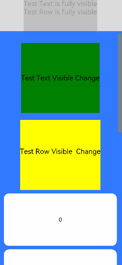
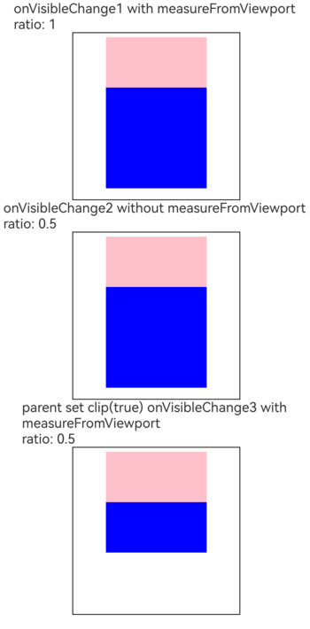

# 组件可见区域变化事件

更新时间：2026-04-20 06:34:33

来源：https://developer.huawei.com/consumer/cn/doc/harmonyos-references/ts-universal-component-visible-area-change-event
**支持设备：** Phone / PC/2in1 / Tablet / Wearable / TV

组件可见区域变化事件是组件在屏幕中的显示区域面积变化时触发的事件，提供了判断组件是否完全或部分显示在屏幕中的能力，适用于广告曝光埋点之类的场景。


> [!NOTE]
> 从API version 9开始支持。后续版本如有新增内容，则采用上角标单独标记该内容的起始版本。


## onVisibleAreaChange
**支持设备：** Phone / PC/2in1 / Tablet / Wearable / TV

onVisibleAreaChange(ratios: Array<number>, event: VisibleAreaChangeCallback): T

组件可见区域变化时触发该回调。开发指导及常见问题请参考[感知组件可见性](https://developer.huawei.com/consumer/cn/doc/harmonyos-guides/arkts-manage-components-visibility)指南。


**元服务API：** 从API version 11开始，该接口支持在元服务中使用。

**系统能力：** SystemCapability.ArkUI.ArkUI.Full

**参数：**


| 参数名 | 类型 | 必填 | 说明 |
| --- | --- | --- | --- |
| ratios | Array&lt;number&gt; | 是 | 阈值数组。其中，每个阈值代表组件可见面积（即组件在屏幕显示区的面积，只计算父组件内的面积，超出父组件部分不会计算）与组件自身面积的比值。当组件可见面积与自身面积的比值接近阈值时，均会触发该回调。每个阈值的取值范围为[0.0, 1.0]，如果开发者设置的阈值小于0.0，则实际取值为0.0；如果设置的阈值大于1.0，则实际取值为1.0。          说明：          当数值接近边界0和1时，将会按照误差不超过0.001的规则进行舍入。例如，0.9997会被近似为1。 |
| event | [VisibleAreaChangeCallback](https://developer.huawei.com/consumer/cn/doc/harmonyos-references/ts-universal-component-visible-area-change-event#visibleareachangecallback12) | 是 | 组件可见区域变化事件的回调。 |


**返回值：**


| 类型 | 说明 |
| --- | --- |
| T | 返回当前组件。 |


## onVisibleAreaChange22+
**支持设备：** Phone / PC/2in1 / Tablet / Wearable / TV

onVisibleAreaChange(ratios: Array<number>, event: VisibleAreaChangeCallback, measureFromViewport: boolean): T

组件可见区域变化时触发该回调。可以通过measureFromViewport设置可见区域计算模式。开发指导及常见问题请参考[感知组件可见性](https://developer.huawei.com/consumer/cn/doc/harmonyos-guides/arkts-manage-components-visibility)指南。

**元服务API：** 从API version 22开始，该接口支持在元服务中使用。

**系统能力：** SystemCapability.ArkUI.ArkUI.Full

**参数：**


| 参数名 | 类型 | 必填 | 说明 |
| --- | --- | --- | --- |
| ratios | Array&lt;number&gt; | 是 | 阈值数组。其中，每个阈值代表组件可见面积与组件自身面积的比值。当组件可见面积与自身面积的比值接近阈值时，均会触发该回调。每个阈值的取值范围为[0.0, 1.0]，如果开发者设置的阈值小于0.0，则实际取值为0.0；如果设置的阈值大于1.0，则实际取值为1.0。          说明：          当数值接近边界0和1时，将会按照误差不超过0.001的规则进行舍入。例如，0.9997会被近似为1。 |
| event | [VisibleAreaChangeCallback](https://developer.huawei.com/consumer/cn/doc/harmonyos-references/ts-universal-component-visible-area-change-event#visibleareachangecallback12) | 是 | 组件可见区域变化事件的回调。 |
| measureFromViewport | boolean | 是 | 设置可见区域计算模式。          当measureFromViewport设置为true时，系统在计算该组件的可见区域时，会考虑父组件的[clip](https://developer.huawei.com/consumer/cn/doc/harmonyos-references/ts-universal-attributes-sharp-clipping#clip12) 属性设置。如果父组件的[clip](https://developer.huawei.com/consumer/cn/doc/harmonyos-references/ts-universal-attributes-sharp-clipping#clip12)为false，则认为其内的子组件可以超出其区域进行显示，因此超出父组件的区域也将被视为可见区域纳入计算；如果父组件的[clip](https://developer.huawei.com/consumer/cn/doc/harmonyos-references/ts-universal-attributes-sharp-clipping#clip12)设置为true，则组件超出父组件的区域会被裁剪，无法显示，因此会被视为不可见区域进行计算。而当measureFromViewport设置为false时，则不考虑[clip](https://developer.huawei.com/consumer/cn/doc/harmonyos-references/ts-universal-attributes-sharp-clipping#clip12)的影响，直接将组件超出父组件的部分视为不可见区域。          measureFromViewport设置为true时，祖先节点设置[scale](https://developer.huawei.com/consumer/cn/doc/harmonyos-references/ts-universal-attributes-transformation#scale)属性，组件可见比例会被正确计算。 |


**返回值：**


| 类型 | 说明 |
| --- | --- |
| T | 返回当前组件。 |


## onVisibleAreaApproximateChange17+
**支持设备：** Phone / PC/2in1 / Tablet / Wearable / TV

onVisibleAreaApproximateChange(options: VisibleAreaEventOptions, event: VisibleAreaChangeCallback | undefined): T

设置onVisibleAreaApproximateChange事件的回调参数，限制它的执行间隔。


> [!NOTE]
> 从API version 23开始，该接口支持在[attributeModifier](https://developer.huawei.com/consumer/cn/doc/harmonyos-references/ts-universal-attributes-attribute-modifier#attributemodifier)中调用。

**元服务API：** 从API version 17开始，该接口支持在元服务中使用。

**系统能力：** SystemCapability.ArkUI.ArkUI.Full

**参数：**


| 参数名 | 类型 | 必填 | 说明 |
| --- | --- | --- | --- |
| options | [VisibleAreaEventOptions](#visibleareaeventoptions12) | 是 | 可见区域变化相关的参数。 |
| event | [VisibleAreaChangeCallback](#visibleareachangecallback12) \| undefined | 是 | onVisibleAreaChange事件的回调函数。当组件可见面积与自身面积的比值接近options中设置的阈值时触发该回调。 |


**返回值：**


| 类型 | 说明 |
| --- | --- |
| T | 返回当前组件。 |


## VisibleAreaEventOptions12+
**支持设备：** Phone / PC/2in1 / Tablet / Wearable / TV

关于区域变化相关的参数。

**系统能力：** SystemCapability.ArkUI.ArkUI.Full


| 名称 | 类型 | 只读 | 可选 | 说明 |
| --- | --- | --- | --- | --- |
| ratios | Array&lt;number&gt; | 否 | 否 | 阈值数组。其中，每个阈值代表组件可见面积（即组件在屏幕显示区的面积，只计算父组件内的面积，超出父组件部分不会计算）与组件自身面积的比值。每个阈值的取值范围为[0.0, 1.0]，如果开发者设置的阈值小于0.0，则实际取值为0.0；如果设置的阈值大于1.0，则实际取值为1.0。          元服务API： 从API version 12开始，该接口支持在元服务中使用。 |
| expectedUpdateInterval | number | 否 | 是 | 定义了开发者期望的计算间隔，单位为ms。当该字段小于100或为NaN时，默认取值为100；当该字段大于2^31-1时，默认取值为2^31-1。          默认值：1000          元服务API： 从API version 12开始，该接口支持在元服务中使用。 |
| measureFromViewport22+ | boolean | 否 | 是 | 设置可见区域计算模式。          当measureFromViewport设置为true时，系统在计算该组件的可见区域时，会考虑父组件的[clip](https://developer.huawei.com/consumer/cn/doc/harmonyos-references/ts-universal-attributes-sharp-clipping#clip12) 属性设置。如果父组件的[clip](https://developer.huawei.com/consumer/cn/doc/harmonyos-references/ts-universal-attributes-sharp-clipping#clip12)为false，则认为其内的子组件可以超出其区域进行显示，因此超出父组件的区域也将被视为可见区域纳入计算；如果父组件的[clip](https://developer.huawei.com/consumer/cn/doc/harmonyos-references/ts-universal-attributes-sharp-clipping#clip12)设置为true，则组件超出父组件的区域会被裁剪，无法显示，因此会被视为不可见区域进行计算。而当measureFromViewport设置为false时，则不考虑[clip](https://developer.huawei.com/consumer/cn/doc/harmonyos-references/ts-universal-attributes-sharp-clipping#clip12)的影响，直接将组件超出父组件的部分视为不可见区域。          默认值：false          measureFromViewport设置为true时，祖先节点设置[scale](https://developer.huawei.com/consumer/cn/doc/harmonyos-references/ts-universal-attributes-transformation#scale)属性，组件可见比例会被正确计算。          元服务API： 从API version 22开始，该接口支持在元服务中使用。 |


## VisibleAreaChangeCallback12+
**支持设备：** Phone / PC/2in1 / Tablet / Wearable / TV

type VisibleAreaChangeCallback = (isExpanding: boolean, currentRatio: number) => void

组件可见区域变化事件的回调类型。

**元服务API：** 从API version 12开始，该接口支持在元服务中使用。

**系统能力：** SystemCapability.ArkUI.ArkUI.Full

**参数：**


| 参数名 | 类型 | 必填 | 说明 |
| --- | --- | --- | --- |
| isExpanding | boolean | 是 | 视组件的可见面积与自身面积的比值与上一次回调相比的情况而定，比值变大为true，比值变小为false。 |
| currentRatio | number | 是 | 触发回调时，组件可见面积与自身面积的比值。 |


## 示例
**支持设备：** Phone / PC/2in1 / Tablet / Wearable / TV


### 示例1 (使用onVisibleAreaChange来监听区域变化)

该示例对组件设置[onVisibleAreaChange](#onvisibleareachange)事件，当组件完全显示或者完全消失时触发回调。


```ts
// xxx.ets
@Entry
@Component
struct ScrollExample {
  scroller: Scroller = new Scroller()
  private arr: number[] = [0, 1, 2, 3, 4, 5, 6, 7, 8, 9]
  @State testTextStr: string = 'test'
  @State testRowStr: string = 'test'

  build() {
    Column() {
      Column() {
        Text(this.testTextStr)
        .fontSize(20)

        Text(this.testRowStr)
        .fontSize(20)
      }
      .height(100)
      .backgroundColor(Color.Gray)
      .opacity(0.3)

      Scroll(this.scroller) {
        Column() {
          Text("Test Text Visible Change")
          .fontSize(20)
          .height(200)
          .margin({ top: 50, bottom: 20 })
          .backgroundColor(Color.Green)
          // 通过设置ratios为[0.0, 1.0]，实现当组件完全显示或完全消失在屏幕中时触发回调。
          .onVisibleAreaChange([0.0, 1.0], (isExpanding: boolean, currentRatio: number) => {
            console.info(`Test Text isExpanding: ${isExpanding}, currentRatio: ${currentRatio}`)
            if (isExpanding && currentRatio >= 1.0) {
              console.info(`Test Text is fully visible. currentRatio: ${currentRatio}`)
              this.testTextStr = 'Test Text is fully visible'
            }

            if (!isExpanding && currentRatio <= 0.0) {
              console.info('Test Text is completely invisible.')
              this.testTextStr = 'Test Text is completely invisible'
            }
          })

          Row() {
            Text('Test Row Visible Change')
            .fontSize(20)
            .margin({ bottom: 20 })

          }
          .height(200)
          .backgroundColor(Color.Yellow)
          .onVisibleAreaChange([0.0, 1.0], (isExpanding: boolean, currentRatio: number) => {
            console.info(`Test Text isExpanding: ${isExpanding}, currentRatio: ${currentRatio}`)
            if (isExpanding && currentRatio >= 1.0) {
              console.info('Test Row is fully visible.')
              this.testRowStr = 'Test Row is fully visible'
            }

            if (!isExpanding && currentRatio <= 0.0) {
              console.info('Test Row is completely invisible.')
              this.testRowStr = 'Test Row is completely invisible'
            }
          })

          ForEach(this.arr, (item: number) => {
            Text(item.toString())
            .width('90%')
            .height(150)
            .backgroundColor(0xFFFFFF)
            .borderRadius(15)
            .fontSize(16)
            .textAlign(TextAlign.Center)
            .margin({ top: 10 })
          }, (item: number) => (item.toString()))

        }.width('100%')
      }
      .backgroundColor(0x317aff)
      .scrollable(ScrollDirection.Vertical)
      .scrollBar(BarState.On)
      .scrollBarColor(Color.Gray)
      .scrollBarWidth(10)
      .onWillScroll((xOffset: number, yOffset: number, scrollState: ScrollState) => {
        console.info(`${xOffset} ${yOffset}`)
      })
      .onScrollEdge((side: Edge) => {
        console.info('To the edge')
      })
      .onScrollStop(() => {
        console.info('Scroll Stop')
      })

    }.width('100%').height('100%').backgroundColor(0xDCDCDC)
  }
}
```


### 示例2 (使用onVisibleAreaApproximateChange来监听区域变化)

从API version 17开始，该示例对组件设置[onVisibleAreaApproximateChange](#onvisibleareaapproximatechange17)事件，当组件完全显示或者完全消失时触发回调。


```ts
// xxx.ets
@Entry
@Component
struct ScrollExample {
  scroller: Scroller = new Scroller()
  private arr: number[] = [0, 1, 2, 3, 4, 5, 6, 7, 8, 9]
  @State testTextStr: string = 'test'
  @State testRowStr: string = 'test'

  build() {
    Column() {
      Column() {
        Text(this.testTextStr)
        .fontSize(20)

        Text(this.testRowStr)
        .fontSize(20)
      }
      .height(100)
      .backgroundColor(Color.Gray)
      .opacity(0.3)

      Scroll(this.scroller) {
        Column() {
          Text("Test Text Visible Change")
          .fontSize(20)
          .height(200)
          .margin({ top: 50, bottom: 20 })
          .backgroundColor(Color.Green)
          // 通过设置ratios为[0.0, 1.0]，实现当组件完全显示或完全消失在屏幕中时触发回调。
          .onVisibleAreaApproximateChange({ ratios: [0.0, 1.0], expectedUpdateInterval: 1000 },
          (isExpanding: boolean, currentRatio: number) => {
            console.info(`Test Text isExpanding: ${isExpanding}, currentRatio: ${currentRatio}`)
            if (isExpanding && currentRatio >= 1.0) {
              console.info(`Test Text is fully visible. currentRatio: ${currentRatio}`)
              this.testTextStr = 'Test Text is fully visible'
            }

            if (!isExpanding && currentRatio <= 0.0) {
              console.info('Test Text is completely invisible.')
              this.testTextStr = 'Test Text is completely invisible'
            }
          })

          Row() {
            Text('Test Row Visible Change')
            .fontSize(20)
            .margin({ bottom: 20 })

          }
          .height(200)
          .backgroundColor(Color.Yellow)
          .onVisibleAreaChange([0.0, 1.0], (isExpanding: boolean, currentRatio: number) => {
            console.info(`Test Text isExpanding: ${isExpanding}, currentRatio: ${currentRatio}`)
            if (isExpanding && currentRatio >= 1.0) {
              console.info('Test Row is fully visible.')
              this.testRowStr = 'Test Row is fully visible'
            }

            if (!isExpanding && currentRatio <= 0.0) {
              console.info('Test Row is completely invisible.')
              this.testRowStr = 'Test Row is completely invisible'
            }
          })

          ForEach(this.arr, (item: number) => {
            Text(item.toString())
            .width('90%')
            .height(150)
            .backgroundColor(0xFFFFFF)
            .borderRadius(15)
            .fontSize(16)
            .textAlign(TextAlign.Center)
            .margin({ top: 10 })
          }, (item: number) => (item.toString()))

        }.width('100%')
      }
      .backgroundColor(0x317aff)
      .scrollable(ScrollDirection.Vertical)
      .scrollBar(BarState.On)
      .scrollBarColor(Color.Gray)
      .scrollBarWidth(10)
      .onWillScroll((xOffset: number, yOffset: number, scrollState: ScrollState) => {
        console.info(`${xOffset} ${yOffset}`)
      })
      .onScrollEdge((side: Edge) => {
        console.info('To the edge')
      })
      .onScrollStop(() => {
        console.info('Scroll Stop')
      })

    }.width('100%').height('100%').backgroundColor(0xDCDCDC)
  }
}
```




### 示例3 (设置measureFromViewport子组件超出父组件显示)

从API version 22开始，该示例展示onVisibleAreaChange事件设置measureFromViewport参数效果对比，主要差异体现在回调返回值组件可见比例（currentRatio）的不同，设置measureFromViewport为true时，返回的组件可见比例（currentRatio）更符合实际效果。该示例在不同设备上currentRatio会有微小差异。


```ts
@Entry
@Component
struct OnVisibleAreaChangeSample {
  @State ratio1: number = 0.0;
  @State ratio2: number = 0.0;
  @State ratio3: number = 0.0;

  build() {
    Column() {
      Text(`onVisibleChange1 with measureFromViewport \nratio: ${this.ratio1}`)
      Column() {
        Row() {
          Row() {

          }
          .backgroundColor(Color.Blue)
          .height(120)
          .width(120)
          .offset({ x: 0, y: 60 })
          // measureFromViewport设置为true，父组件未设置clip(true)，超出父组件的区域被视为可见区域。
          .onVisibleAreaApproximateChange({
            ratios: [0.0, 1.0],
            expectedUpdateInterval: 500,
            measureFromViewport: true
          }, (isExpanding: boolean, currentRatio: number) => {
            console.info(`onVisibleAreaApproximateChange1 isExpanding: ${isExpanding} currentRatio: ${currentRatio}`)
          })
          .onVisibleAreaChange([0.0, 1.0], (isExpanding: boolean, currentRatio: number) => {
            this.ratio1 = currentRatio
          }, true)
        }
        .backgroundColor(Color.Pink)
        .height(120)
        .width(120)
      }
      .padding(5)
      .borderWidth(1)
      .height(200)
      .width(200)

      Text(`onVisibleChange2 without measureFromViewport \nratio: ${this.ratio2}`)
      Column() {
        Row() {
          Row() {

          }
          .backgroundColor(Color.Blue)
          .height(120)
          .width(120)
          .offset({ x: 0, y: 60 })
          // 不设置measureFromViewport，measureFromViewport默认为false，父组件未设置clip(true)，超出父组件的区域被视为不可见区域。
          .onVisibleAreaApproximateChange({ ratios: [0.0, 1.0], expectedUpdateInterval: 500 },
          (isExpanding: boolean, currentRatio: number) => {
            console.info(`onVisibleAreaApproximateChange2 isExpanding: ${isExpanding} currentRatio: ${currentRatio}`)
          })
          .onVisibleAreaChange([0.0, 1.0], (isExpanding: boolean, currentRatio: number) => {
            this.ratio2 = currentRatio
          })
        }
        .backgroundColor(Color.Pink)
        .height(120)
        .width(120)
      }
      .padding(5)
      .borderWidth(1)
      .height(200)
      .width(200)

      Text(`parent set clip(true) onVisibleChange3 with measureFromViewport \nratio: ${this.ratio3}`)
      Column() {
        Row() {
          Row() {

          }
          .backgroundColor(Color.Blue)
          .height(120)
          .width(120)
          .offset({ x: 0, y: 60 })
          // measureFromViewport设置为true，父组件设置clip(true)，超出父组件的区域被视为不可见区域。
          .onVisibleAreaApproximateChange({
            ratios: [0.0, 1.0],
            expectedUpdateInterval: 500,
            measureFromViewport: true
          }, (isExpanding: boolean, currentRatio: number) => {
            console.info(`onVisibleAreaApproximateChange3 isExpanding: ${isExpanding} currentRatio: ${currentRatio}`)
          })
          .onVisibleAreaChange([0.0, 1.0], (isExpanding: boolean, currentRatio: number) => {
            this.ratio3 = currentRatio
          }, true)
        }
        .clip(true)
        .backgroundColor(Color.Pink)
        .height(120)
        .width(120)
      }
      .padding(5)
      .borderWidth(1)
      .height(200)
      .width(200)
    }
    .height('100%')
    .width('100%')
  }
}
```


