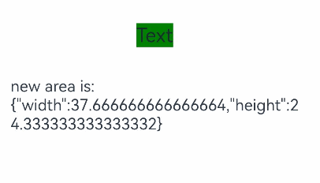

# 组件尺寸变化事件

更新时间：2026-03-09 02:50:43

来源：https://developer.huawei.com/consumer/cn/doc/harmonyos-references/ts-universal-component-size-change-event
**支持设备：** Phone / PC/2in1 / Tablet / Wearable / TV

该事件指组件显示的尺寸发生变化时触发的事件。


> [!NOTE]
> 从API version 12开始支持。后续版本如有新增内容，则采用上角标单独标记该内容的起始版本。
> 该事件返回的宽高是组件绘制出来的宽高，可能与组件设置的宽高不同。


## onSizeChange
**支持设备：** Phone / PC/2in1 / Tablet / Wearable / TV

onSizeChange(event: SizeChangeCallback): T

组件区域变化时触发该回调。仅会响应由布局变化所导致的组件尺寸发生变化时的回调。


**卡片能力：** 从API version 12开始，该接口支持在ArkTS卡片中使用。

**元服务API：** 从API version 12开始，该接口支持在元服务中使用。

**系统能力：** SystemCapability.ArkUI.ArkUI.Full

**参数：**


| 参数名 | 类型 | 必填 | 说明 |
| --- | --- | --- | --- |
| event | [SizeChangeCallback](#sizechangecallback) | 是 | 目标元素变化前后的尺寸。 |


**返回值：**


| 类型 | 说明 |
| --- | --- |
| T | 返回当前组件。 |


## SizeChangeCallback
**支持设备：** Phone / PC/2in1 / Tablet / Wearable / TV

type SizeChangeCallback = (oldValue: SizeOptions, newValue: SizeOptions) => void

组件区域变化时的回调类型。

**卡片能力：** 从API version 12开始，该接口支持在ArkTS卡片中使用。

**元服务API：** 从API version 12开始，该接口支持在元服务中使用。

**系统能力：** SystemCapability.ArkUI.ArkUI.Full

**参数：**


| 参数名 | 类型 | 必填 | 说明 |
| --- | --- | --- | --- |
| oldValue | [SizeOptions](https://developer.huawei.com/consumer/cn/doc/harmonyos-references/ts-types#sizeoptions) | 是 | 目标元素变化之前的宽高。 |
| newValue | [SizeOptions](https://developer.huawei.com/consumer/cn/doc/harmonyos-references/ts-types#sizeoptions) | 是 | 目标元素变化之后的宽高。 |


## 示例
**支持设备：** Phone / PC/2in1 / Tablet / Wearable / TV

该示例通过Text组件设置组件尺寸变化事件，当Text尺寸变化时可以触发onSizeChange事件，获取相关参数。


```ts
// xxx.ets
@Entry
@Component
struct AreaExample {
  @State value: string = 'Text'
  @State sizeValue: string = ''

  build() {
    Column() {
      Text(this.value)
      .backgroundColor(Color.Green)
      .margin(30)
      .fontSize(20)
      .onClick(() => {
        this.value = this.value + 'Text'
      })
      .onSizeChange((oldValue: SizeOptions, newValue: SizeOptions) => {
        console.info(`Ace: on size change, oldValue is ${JSON.stringify(oldValue)} value is ${JSON.stringify(newValue)}`)
        this.sizeValue = JSON.stringify(newValue)
      })
      Text('new area is: \n' + this.sizeValue).margin({ right: 30, left: 30 })
    }
    .width('100%').height('100%').margin({ top: 30 })
  }
}
```


