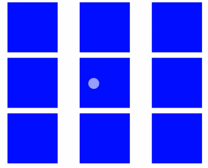
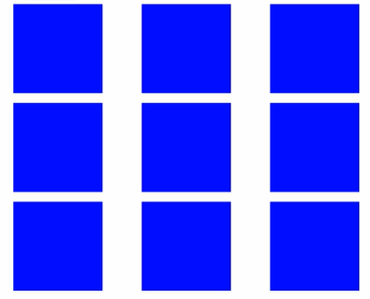
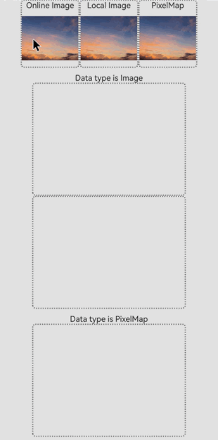
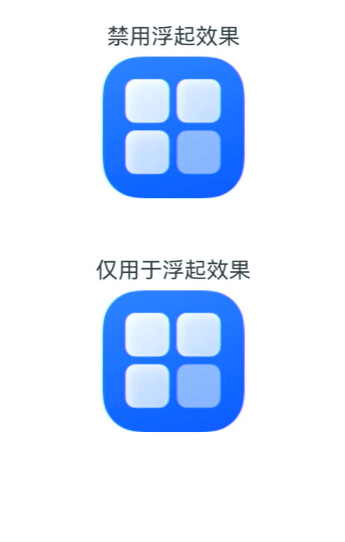
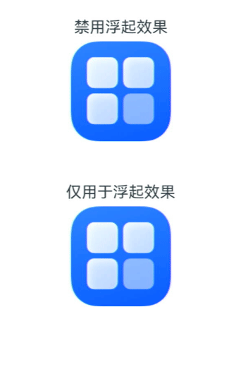
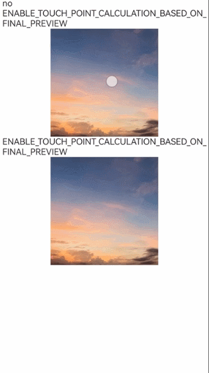

# 拖拽控制

更新时间：2026-07-28 11:23:46

来源：https://developer.huawei.com/consumer/cn/doc/harmonyos-references/ts-universal-attributes-drag-drop
**支持设备：** Phone | PC/2in1 | Tablet | Wearable | TV

组件提供了一些属性和接口，可用于配置组件对拖拽事件的响应行为，或影响系统对拖拽事件的处理方式，包括配置组件拖拽和落入行为、数据类型、预览图样式及交互效果。

> [!NOTE]
> 从API version 10开始支持。后续版本的新增接口，采用上角标单独标记接口的起始版本。 本模块接口仅可在Stage模型下使用。


ArkUI框架对以下组件实现了默认的拖拽能力，支持对数据的拖出或拖入响应。开发者也可以通过实现通用拖拽事件来自定义拖拽响应。

 - 默认支持拖出能力的组件（可从组件上拖出数据）：[Search](https://developer.huawei.com/consumer/cn/doc/harmonyos-references/ts-basic-components-search)、[TextInput](https://developer.huawei.com/consumer/cn/doc/harmonyos-references/ts-basic-components-textinput)、[TextArea](https://developer.huawei.com/consumer/cn/doc/harmonyos-references/ts-basic-components-textarea)、[RichEditor](https://developer.huawei.com/consumer/cn/doc/harmonyos-references/ts-basic-components-richeditor)、[Text](https://developer.huawei.com/consumer/cn/doc/harmonyos-references/ts-basic-components-text)、[Image](https://developer.huawei.com/consumer/cn/doc/harmonyos-references/ts-basic-components-image)、[Hyperlink](https://developer.huawei.com/consumer/cn/doc/harmonyos-references/ts-container-hyperlink)，开发者可通过设置这些组件的[draggable](#draggable)属性来控制对默认拖拽能力的使用。
 - 默认支持拖入能力的组件（目标组件可响应拖入数据）：[Search](https://developer.huawei.com/consumer/cn/doc/harmonyos-references/ts-basic-components-search)、[TextInput](https://developer.huawei.com/consumer/cn/doc/harmonyos-references/ts-basic-components-textinput)、[TextArea](https://developer.huawei.com/consumer/cn/doc/harmonyos-references/ts-basic-components-textarea)、[RichEditor](https://developer.huawei.com/consumer/cn/doc/harmonyos-references/ts-basic-components-richeditor)，开发者可通过设置这些组件的[allowDrop](#allowdrop)属性为null来禁用对默认拖入能力的支持。
 - 不支持拖出能力的组件（不可从组件上拖出数据）：[ArcScrollBar](https://developer.huawei.com/consumer/cn/doc/harmonyos-references/ts-basic-components-arcscrollbar)、[MultiNavigation](https://developer.huawei.com/consumer/cn/doc/harmonyos-references/ohos-arkui-advanced-multinavigation)、[ToolBarItem](https://developer.huawei.com/consumer/cn/doc/harmonyos-references/ts-basic-components-toolbaritem)、[ArcSlider](https://developer.huawei.com/consumer/cn/doc/harmonyos-references/ohos-arkui-advanced-arcslider)、[Span](https://developer.huawei.com/consumer/cn/doc/harmonyos-references/ts-basic-components-span)、[ImageSpan](https://developer.huawei.com/consumer/cn/doc/harmonyos-references/ts-basic-components-imagespan)、[ContainerSpan](https://developer.huawei.com/consumer/cn/doc/harmonyos-references/ts-basic-components-containerspan)、[SymbolSpan](https://developer.huawei.com/consumer/cn/doc/harmonyos-references/ts-basic-components-symbolspan)、[ArcAlphabetIndexer](https://developer.huawei.com/consumer/cn/doc/harmonyos-references/ts-container-arc-alphabet-indexer)、[OffscreenCanvas](https://developer.huawei.com/consumer/cn/doc/harmonyos-references/ts-components-offscreencanvas)、[Menu](https://developer.huawei.com/consumer/cn/doc/harmonyos-references/ts-basic-components-menu)、[MenuItem](https://developer.huawei.com/consumer/cn/doc/harmonyos-references/ts-basic-components-menuitem)、[MenuItemGroup](https://developer.huawei.com/consumer/cn/doc/harmonyos-references/ts-basic-components-menuitemgroup)、[PasteButton](https://developer.huawei.com/consumer/cn/doc/harmonyos-references/ts-security-components-pastebutton)、[SaveButton](https://developer.huawei.com/consumer/cn/doc/harmonyos-references/ts-security-components-savebutton)、[WithTheme](https://developer.huawei.com/consumer/cn/doc/harmonyos-references/ts-container-with-theme)、[NavPushPathHelper](https://developer.huawei.com/consumer/cn/doc/harmonyos-references/ohos-atomicservice-navpushpathhelper)、[ContentSlot](https://developer.huawei.com/consumer/cn/doc/harmonyos-references/ts-components-contentslot)、[Chip](https://developer.huawei.com/consumer/cn/doc/harmonyos-references/ohos-arkui-advanced-chip)、[ExceptionPrompt](https://developer.huawei.com/consumer/cn/doc/harmonyos-references/ohos-arkui-advanced-exceptionprompt)、[Filter](https://developer.huawei.com/consumer/cn/doc/harmonyos-references/ohos-arkui-advanced-filter)、[FormMenu](https://developer.huawei.com/consumer/cn/doc/harmonyos-references/ohos-arkui-advanced-formmenu)、[Popup](https://developer.huawei.com/consumer/cn/doc/harmonyos-references/ohos-arkui-advanced-popup)、[SelectionMenu](https://developer.huawei.com/consumer/cn/doc/harmonyos-references/ohos-arkui-advanced-selectionmenu)、[SplitLayout](https://developer.huawei.com/consumer/cn/doc/harmonyos-references/ohos-arkui-advanced-splitlayout)以及所有弹窗类组件。


Text、TextInput、TextArea、Hyperlink、Image、RichEditor和Web组件的draggable属性默认为true，默认支持拖出能力。

其他支持拖出能力的组件需要开发者将draggable属性设置为true，并在[onDragStart](https://developer.huawei.com/consumer/cn/doc/harmonyos-references/ts-universal-events-drag-drop#ondragstart)等接口中实现数据封装与传递，才能正确处理拖拽。

> [!NOTE]
> Text组件拖拽时，请设置 copyOption 为CopyOptions.InApp或CopyOptions.LocalDevice，以启用文本拖拽功能。


#### allowDrop

**支持设备：** Phone | PC/2in1 | Tablet | Wearable | TV

allowDrop(value: Array&lt;UniformDataType&gt; | null | Array&lt;string&gt;): T

设置该组件上允许落入的数据类型。如果未设置allowDrop，组件将默认接受所有数据类型；如果已设置allowDrop，仅允许符合指定数据类型的拖入数据落入该组件，不符合指定数据类型的数据将被拒绝落入，不会触发[onDrop](https://developer.huawei.com/consumer/cn/doc/harmonyos-references/ts-universal-events-drag-drop#ondrop)事件。

**元服务API：** 从API version 11开始，该接口支持在元服务中使用。

**系统能力：** SystemCapability.ArkUI.ArkUI.Full

**参数：**

| 参数名 | 类型 | 必填 | 说明 |
| --- | --- | --- | --- |
| value | Array&lt;UniformDataType&gt; \| null12+ \| Array&lt;string&gt;23+ | 是 | 设置该组件上允许落入的数据类型。从API version 12开始，允许设置成null使该组件不接受所有的数据类型。从API version 23开始，支持设置自定义数据类型Array&lt;string&gt;，自定义数据类型为应用自行定义的数据类型字符串，字符串无明确格式要求，但不应与UniformDataType标准类型格式重复，以防与标准类型产生混淆，建议以易记易区分为原则来定义。 |


**返回值：**

| 类型 | 说明 |
| --- | --- |
| T | 返回当前组件，可用于链式调用。 |


#### draggable

**支持设备：** Phone | PC/2in1 | Tablet | Wearable | TV

draggable(value: boolean): T

设置该组件是否允许拖拽。默认情况下，组件不允许拖拽。

**元服务API：** 从API version 11开始，该接口支持在元服务中使用。

**系统能力：** SystemCapability.ArkUI.ArkUI.Full

**参数：**

| 参数名 | 类型 | 必填 | 说明 |
| --- | --- | --- | --- |
| value | boolean | 是 | 设置该组件是否允许进行拖拽。true表示允许拖拽，false表示不允许拖拽。 |


**返回值：**

| 类型 | 说明 |
| --- | --- |
| T | 返回当前组件，可用于链式调用。 |


#### dragPreview11+

**支持设备：** Phone | PC/2in1 | Tablet | Wearable | TV

dragPreview(value: CustomBuilder | DragItemInfo | string): T

设置组件浮起和拖拽过程中的预览图。

> [!NOTE]
> 在 attributeModifier 中调用该接口时，不支持为preview参数传入 CustomBuilder 类型的值，也不支持设置 DragItemInfo 中的builder字段。


**元服务API：** 从API version 12开始，该接口支持在元服务中使用。

**系统能力：** SystemCapability.ArkUI.ArkUI.Full

**参数：**

| 参数名 | 类型 | 必填 | 说明 |
| --- | --- | --- | --- |
| value | CustomBuilder \| DragItemInfo \| string12+ | 是 | 设置组件浮起和拖拽过程中的预览图，仅在onDragStart拖拽方式中有效。 当组件支持拖拽并同时设置bindContextMenu的预览图时，则长按浮起的预览图以bindContextMenu设置的预览图为准。开发者在onDragStart中返回的背板图优先级低于dragPreview设置的预览图，当设置了dragPreview预览图时，拖拽过程中的背板图使用dragPreview预览图。由于CustomBuilder需要离线渲染之后才能使用，因此存在一定的性能开销和时延，推荐优先使用 DragItemInfo中的PixelMap方式。 当传入类型为string的id时，则将id对应组件的截图作为预览图。如果id对应的组件无法查找到，或者id对应的组件Visibility属性设置成None/Hidden，则对组件自身进行截图作为拖拽预览图。目前截图不含有亮度、阴影、模糊和旋转等视觉效果。 |


**返回值：**

| 类型 | 说明 |
| --- | --- |
| T | 返回当前组件，可用于链式调用。 |


#### dragPreview15+

**支持设备：** Phone | PC/2in1 | Tablet | Wearable | TV

dragPreview(preview: CustomBuilder | DragItemInfo | string, config?: PreviewConfiguration):T

设置组件浮起和拖拽过程中的预览图，支持通过config参数配置预览图是否仅用于浮起效果、是否延迟创建等。

> [!NOTE]
> 在 attributeModifier 中调用该接口时，不支持为preview参数传入 CustomBuilder 类型的值，也不支持设置 DragItemInfo 中的builder字段。


**元服务API：** 从API version 15开始，该接口支持在元服务中使用。

**系统能力：** SystemCapability.ArkUI.ArkUI.Full

**参数：**

| 参数名 | 类型 | 必填 | 说明 |
| --- | --- | --- | --- |
| preview | CustomBuilder \| DragItemInfo \| string | 是 | 设置组件浮起和拖拽过程中的预览图，仅在onDragStart拖拽方式中有效。 当组件支持拖拽并同时设置bindContextMenu的预览图时，则长按浮起的预览图以bindContextMenu设置的预览图为准。开发者在onDragStart中返回的背板图优先级低于dragPreview设置的预览图，当设置了dragPreview预览图时，拖拽过程中的背板图使用dragPreview预览图。由于CustomBuilder需要离线渲染之后才能使用，因此会增加预览图生成的性能开销和时延，推荐优先使用 DragItemInfo中的PixelMap方式。 当传入类型为string的id时，则将id对应组件的截图作为预览图。如果id对应的组件无法查找到，或者id对应的组件Visibility属性设置成None/Hidden，则对组件自身进行截图作为拖拽预览图。目前截图不含有亮度、阴影、模糊和旋转等视觉效果。 |
| config | PreviewConfiguration | 否 | 对自定义拖拽过程中的预览图进行配置，仅对dragPreview中的预览生效。当需要配置预览图是否仅用于浮起效果、是否延迟创建等自定义预览行为时传入该参数；不传入时，使用系统默认的拖拽预览行为，即预览图不限制仅用于浮起效果且不延迟创建预览图。 |


**返回值：**

| 类型 | 说明 |
| --- | --- |
| T | 返回当前组件，可用于链式调用。 |


#### dragPreviewOptions11+

**支持设备：** Phone | PC/2in1 | Tablet | Wearable | TV

dragPreviewOptions(value: DragPreviewOptions, options?: DragInteractionOptions): T

设置拖拽过程中预览图处理模式，数量角标的显示以及预览图浮起的交互模式。不支持通过Grid的[onItemDragStart](https://developer.huawei.com/consumer/cn/doc/harmonyos-references/ts-container-grid#onitemdragstart8)拖拽GridItem，也不支持通过List的[onItemDragStart](https://developer.huawei.com/consumer/cn/doc/harmonyos-references/ts-container-list#onitemdragstart8)拖拽ListItem。

> [!NOTE]
> 从API version 20开始，该接口支持在 attributeModifier 中调用。


**元服务API：** 从API version 12开始，该接口支持在元服务中使用。

**系统能力：** SystemCapability.ArkUI.ArkUI.Full

**参数：**

| 参数名 | 类型 | 必填 | 说明 |
| --- | --- | --- | --- |
| value | DragPreviewOptions11+ | 是 | 设置拖拽过程中预览图处理模式、数量角标的显示、背板图样式及浮起与拖拽预览图过渡效果。 |
| options12+ | DragInteractionOptions12+ | 否 | 设置拖拽过程中预览图浮起的交互模式。当需要启用多选聚拢、默认点按效果、禁用浮起、边缘自动滚屏或震动反馈等交互能力时传入该参数；不传入该参数时，拖拽交互按DragInteractionOptions中各字段的默认值处理。 |


**返回值：**

| 类型 | 说明 |
| --- | --- |
| T | 返回当前组件，可用于链式调用。 |


#### DragPreviewOptions11+

**支持设备：** Phone | PC/2in1 | Tablet | Wearable | TV

设置拖拽过程中预览图处理模式、数量角标的显示、背板图样式及过渡效果。

**系统能力：** SystemCapability.ArkUI.ArkUI.Full

| 名称 | 类型 | 只读 | 可选 | 说明 |
| --- | --- | --- | --- | --- |
| mode | DragPreviewMode \| Array&lt;DragPreviewMode&gt;12+ | 否 | 是 | 表示拖拽过程中预览图处理模式。 默认值：DragPreviewMode.AUTO 当组件同时设置DragPreviewMode.AUTO和其它枚举值时，以DragPreviewMode.AUTO为准，其它枚举值设置无效。 元服务API： 从API version 12开始，该接口支持在元服务中使用。 |
| numberBadge12+ | boolean \| number | 否 | 是 | 控制数量角标是否显示，或强制设置显示的数量。设置为true时显示角标并使用实际拖拽对象数量，设置为false时不显示角标，设置为number值时强制显示指定数量的角标。当设置数量角标时取值范围为[0, 231-1]，超过取值范围时会按默认值true处理。当设置为浮点数时，只显示整数部分。 说明： 在多选拖拽场景，需通过该接口设置拖拽对象的数量。 默认值：true。 元服务API： 从API version 12开始，该接口支持在元服务中使用。 |
| modifier12+ | ImageModifier | 否 | 是 | 用于配置拖拽背板图的样式Modifier对象，可使用图片组件所支持的属性和样式来配置背板图样式（参考示例6），当前支持透明度、阴影、背景模糊度、圆角、材质效果。文本拖拽只支持默认效果，不支持通过modifier进行自定义。 1.透明度。 通过opacity设置不透明度，不透明度的取值范围为[0, 1]。设置0或不设置时采用背板图透明度的默认值0.95，设置1或超出取值范围的值时不透明。 2.阴影。 通过shadow设置阴影。 3.背景模糊度。 通过backgroundEffect或backgroundBlurStyle设置背景模糊度，如果两者同时设置，以后设置的属性为准。 4.圆角。 通过border或borderRadius设置圆角，当同时在mode和modifier中设置圆角，mode设置的圆角显示优先级低于modifier设置。 5.材质效果，从API版本26.0.0开始支持。 通过systemMaterial设置系统材质效果。 默认值：空，拖拽背板图不设置样式。 元服务API： 从API version 12开始，该接口支持在元服务中使用。 说明： 1.若节点已设置背景模糊或材质效果，直接用作拖拽预览会导致截图包含这些效果，与拖拽modifier属性冲突。建议使用dragPreview自定义不包含背景模糊和材质效果的预览。 2.ImmersiveMaterial的colorInvert参数在拖拽中不生效。 |
| sizeChangeEffect19+ | DraggingSizeChangeEffect19+ | 否 | 是 | 用于选择长按浮起图与拖拽预览图过渡效果。 默认值：DraggingSizeChangeEffect.DEFAULT。 元服务API： 从API version 19开始，该接口支持在元服务中使用。 |


#### DragPreviewMode11+枚举说明

**支持设备：** Phone | PC/2in1 | Tablet | Wearable | TV

设置拖拽预览图的显示模式。

**系统能力：** SystemCapability.ArkUI.ArkUI.Full

| 名称 | 值 | 说明 |
| --- | --- | --- |
| AUTO | 1 | 系统根据拖拽场景自动改变跟手点位置，并自动对拖拽背板图进行缩放变换。 元服务API： 从API version 12开始，该接口支持在元服务中使用。 |
| DISABLE_SCALE | 2 | 禁用系统对拖拽背板图的缩放行为。适用于需要保持拖拽预览图原始尺寸、不希望系统自动缩放的场景，如精确尺寸拖拽或自定义预览图大小控制场景。 元服务API： 从API version 12开始，该接口支持在元服务中使用。 |
| ENABLE_DEFAULT_SHADOW12+ | 3 | 启用非文本类组件默认阴影效果。适用于需要为拖拽预览图添加视觉层次感、提升拖拽对象辨识度的场景。 元服务API： 从API version 12开始，该接口支持在元服务中使用。 |
| ENABLE_DEFAULT_RADIUS12+ | 4 | 启用非文本类组件统一圆角效果，适用于需要为拖拽预览图提供一致圆角外观的场景。默认值12vp。当应用自身设置的圆角值大于默认值或modifier设置的圆角时，则显示应用自定义圆角效果。 元服务API： 从API version 12开始，该接口支持在元服务中使用。 |
| ENABLE_DRAG_ITEM_GRAY_EFFECT18+ | 5 | 启用支持原拖拽对象灰显（透明度）效果，对文本内容拖拽不生效。用户拖起时原对象显示灰显效果，释放时原对象恢复原有效果。开启默认灰显效果后，不建议在拖拽开始后自行修改透明度，如果开发者在拖拽发起后自行修改应用透明度，则灰显效果将被覆盖，且在结束拖拽时无法正确恢复原始透明度效果。 元服务API： 从API version 18开始，该接口支持在元服务中使用。 |
| ENABLE_MULTI_TILE_EFFECT18+ | 6 | 启用支持多选对象鼠标拖拽不聚拢效果，对文本内容拖拽不生效。各拖拽图显示在其原始位置的相对位置，当多个GridItem或ListItem处于选中状态且isMultiSelectionEnabled为true时该参数才生效。不聚拢效果优先级高于dragPreview。不支持二次拖拽、圆角和缩放设置。 元服务API： 从API version 18开始，该接口支持在元服务中使用。 |
| ENABLE_TOUCH_POINT_CALCULATION_BASED_ON_FINAL_PREVIEW19+ | 7 | 启用支持基于最终拖拽预览图缩放前的原始尺寸计算跟手点位置，长按浮起图和拖拽预览图不一致时使用。鼠标拖拽，设置DragPreviewMode.ENABLE_MULTI_TILE_EFFECT时不生效。 元服务API： 从API version 19开始，该接口支持在元服务中使用。 |


#### DraggingSizeChangeEffect19+枚举说明

**支持设备：** Phone | PC/2in1 | Tablet | Wearable | TV

当一个节点上同时设置长按浮起预览（参考[bindContextMenu](https://developer.huawei.com/consumer/cn/doc/harmonyos-references/ts-universal-attributes-menu#bindcontextmenu12)）与拖拽时，使用该字段设置长按浮起预览图与拖拽预览图过渡动效方式。

**元服务API：** 从API version 19开始，该接口支持在元服务中使用。

**系统能力：** SystemCapability.ArkUI.ArkUI.Full

| 名称 | 值 | 说明 |
| --- | --- | --- |
| DEFAULT | 0 | 发起拖拽时直接从菜单预览图切换为最终尺寸的拖拽预览图。 |
| SIZE_TRANSITION | 1 | 发起拖拽时，由菜单预览图直接切换为拖拽预览图，尺寸逐步从菜单预览图尺寸过渡到最终预览图尺寸，设置了DragPreviewMode中的DISABLE_SCALE枚举值时尺寸过渡不生效。这在长按浮起预览图与拖拽预览图相同时使用。 |
| SIZE_CONTENT_TRANSITION | 2 | 发起拖拽时，由菜单预览图逐步过渡切换为最终拖拽预览图，设置DragPreviewMode中的DISABLE_SCALE时尺寸过渡不生效。这常用于菜单预览图与拖拽预览图差异较大时使用，过渡效果包含内容透明度及尺寸变化。 |


#### DragInteractionOptions12+

**支持设备：** Phone | PC/2in1 | Tablet | Wearable | TV

**系统能力：** SystemCapability.ArkUI.ArkUI.Full

| 名称 | 类型 | 只读 | 可选 | 说明 |
| --- | --- | --- | --- | --- |
| isMultiSelectionEnabled | boolean | 否 | 是 | 表示拖拽过程中背板图是否支持多选聚拢效果。true表示支持多选聚拢效果，false表示不支持多选聚拢效果。该参数只在Grid和List组件中的GridItem组件和ListItem组件生效。 当一个item组件设置为多选拖拽时，该组件的子组件不可拖拽。聚拢组件预览图设置的优先级为dragPreview中的string、dragPreview中的PixelMap、组件自截图，不支持dragPreview中的Builder形式。 不支持组件绑定bindContextMenu中参数存在isShown的模式。 默认值：false 元服务API： 从API version 12开始，该接口支持在元服务中使用。 |
| defaultAnimationBeforeLifting | boolean | 否 | 是 | 表示是否启用长按浮起阶段组件自身的默认点按效果（缩小）。true表示启用默认点按效果，false表示不启用默认点按效果。 默认值：false 元服务API： 从API version 12开始，该接口支持在元服务中使用。 |
| isLiftingDisabled15+ | boolean | 否 | 是 | 表示长按拖拽时，是否禁用浮起效果。true表示禁用浮起效果，false表示不禁用浮起效果。 如果设置为true，当组件支持拖拽并同时设置bindContextMenu时，仅弹出配置的自定义菜单预览。 默认值：false 元服务API： 从API version 15开始，该接口支持在元服务中使用。 |
| enableEdgeAutoScroll18+ | boolean | 否 | 是 | 设置在拖拽至可滚动组件边缘时是否触发自动滚屏。true表示触发自动滚屏，false表示不触发自动滚屏。 默认值：true 元服务API： 从API version 18开始，该接口支持在元服务中使用。 |
| enableHapticFeedback18+ | boolean | 否 | 是 | 表示拖拽时是否启用震动。true表示启用震动，false表示不启用震动。仅在存在蒙层的预览（通过bindContextMenu）场景生效。 注意： 仅当应用具备 ohos.permission.VIBRATE 权限，且用户启用了触感反馈时才会生效。 默认值：false 元服务API： 从API version 18开始，该接口支持在元服务中使用。 |


#### UniformDataType

**支持设备：** Phone | PC/2in1 | Tablet | Wearable | TV

type UniformDataType = import('../api/@ohos.data.uniformTypeDescriptor').default.UniformDataType

标准化数据类型。

**元服务API：** 从API version 11开始，该接口支持在元服务中使用。

**系统能力：** SystemCapability.ArkUI.ArkUI.Full

| 类型 | 说明 |
| --- | --- |
| import('../api/@ohos.data.uniformTypeDescriptor').default.UniformDataType | 标准化数据类型。 |


#### ImageModifier12+

**支持设备：** Phone | PC/2in1 | Tablet | Wearable | TV

type ImageModifier = import('../api/arkui/ImageModifier').ImageModifier

图片组件modifier对象。

**元服务API：** 从API version 12开始，该接口支持在元服务中使用。

**系统能力：** SystemCapability.ArkUI.ArkUI.Full

| 类型 | 说明 |
| --- | --- |
| import('../api/arkui/ImageModifier').ImageModifier | 图片组件modifier对象。 |


#### 示例

**支持设备：** Phone | PC/2in1 | Tablet | Wearable | TV


#### 示例1（允许拖拽和落入）

示例1通过配置[allowDrop](#allowdrop)设置组件是否可落入，通过配置[draggable](#draggable)设置组件是否可拖拽。

```ArkTS
// xxx.ets
import { unifiedDataChannel, uniformTypeDescriptor } from '@kit.ArkData';

@Entry
@Component
struct ImageExample {
  @State uri: string = '';
  @State disallowedBlockArr: string[] = [];
  @State allowedBlockArr: string[] = [];
  @State disallowedAreaVisible: Visibility = Visibility.Visible;

  build() {
    Column() {
      Text('Image拖拽')
        .fontSize('30dp')
      Flex({ direction: FlexDirection.Row, alignItems: ItemAlign.Center, justifyContent: FlexAlign.SpaceAround }) {
        // $r('app.media.icon')需要替换为开发者所需的图像资源文件
        Image($r('app.media.icon'))
          .width(100)
          .height(100)
          .border({ width: 1 })
          .visibility(this.disallowedAreaVisible)
          .draggable(true)
          .onDragEnd((event: DragEvent) => {
            let ret = event.getResult();
            if (ret == 0) {
              console.info('enter ret == 0');
              this.disallowedAreaVisible = Visibility.Hidden;
            } else {
              console.info('enter ret != 0');
              this.disallowedAreaVisible = Visibility.Visible;
            }
          })
      }
      .margin({ bottom: 20 })

      Row() {
        Column() {
          Text('不允许释放区域')
            .fontSize('15dp')
            .height('10%')
          List() {
            ForEach(this.disallowedBlockArr, (item: string, index) => {
              ListItem() {
                Image(item)
                  .width(100)
                  .height(100)
                  .border({ width: 1 })
              }
              .margin({ left: 30, top: 30 })
            }, (item: string) => item)
          }
          .height('90%')
          .width('100%')
          .allowDrop([uniformTypeDescriptor.UniformDataType.TEXT])
          .onDrop((event?: DragEvent, extraParams?: string) => {
            this.uri = JSON.parse(extraParams as string)?.extraInfo;
            this.disallowedBlockArr.splice(JSON.parse(extraParams as string)?.insertIndex, 0, this.uri);
            console.info('ondrop not udmf data');
          })
          .border({ width: 1 })
        }
        .height('50%')
        .width('45%')
        .border({ width: 1 })
        .margin({ left: 12 })

        Column() {
          Text('可释放区域')
            .fontSize('15dp')
            .height('10%')
          List() {
            ForEach(this.allowedBlockArr, (item: string, index) => {
              ListItem() {
                Image(item)
                  .width(100)
                  .height(100)
                  .border({ width: 1 })
              }
              .margin({ left: 30, top: 30 })
            }, (item: string) => item)
          }
          .border({ width: 1 })
          .height('90%')
          .width('100%')
          .allowDrop([uniformTypeDescriptor.UniformDataType.IMAGE])
          .onDrop((event?: DragEvent, extraParams?: string) => {
            console.info('enter onDrop');
            let dragData: UnifiedData = (event as DragEvent).getData() as UnifiedData;
            if (dragData != undefined) {
              let arr: Array<unifiedDataChannel.UnifiedRecord> = dragData.getRecords();
              if (arr.length > 0) {
                let image = arr[0] as unifiedDataChannel.Image;
                this.uri = image.imageUri;
                this.allowedBlockArr.splice(JSON.parse(extraParams as string)?.insertIndex, 0, this.uri);
              } else {
                console.info(`dragData arr is null`);
              }
            } else {
              console.info(`dragData  is undefined`);
            }
            console.info('ondrop udmf data');
          })
        }
        .height('50%')
        .width('45%')
        .border({ width: 1 })
        .margin({ left: 12 })
      }
    }.width('100%')
  }
}
```





#### 示例2（设置预览图）

示例2通过配置[dragPreview](#dragpreview11)设置拖拽过程的预览图。

```ArkTS
// xxx.ets
@Entry
@Component
struct DragPreviewDemo {
  @Builder
  dragPreviewBuilder() {
    Column() {
      Text('dragPreview')
        .width(150)
        .height(50)
        .fontSize(20)
        .borderRadius(10)
        .textAlign(TextAlign.Center)
        .fontColor(Color.Black)
        .backgroundColor(Color.Pink)
    }
  }

  @Builder
  menuBuilder() {
    Flex({ direction: FlexDirection.Column, justifyContent: FlexAlign.Center, alignItems: ItemAlign.Center }) {
      Text('menu item 1')
        .fontSize(15)
        .width(100)
        .height(40)
        .textAlign(TextAlign.Center)
        .fontColor(Color.Black)
        .backgroundColor(Color.Pink)
      Divider()
        .height(5)
      Text('menu item 2')
        .fontSize(15)
        .width(100)
        .height(40)
        .textAlign(TextAlign.Center)
        .fontColor(Color.Black)
        .backgroundColor(Color.Pink)
    }
    .width(100)
  }

  build() {
    Row() {
      Column() {
        // $r('app.media.image')需要替换为开发者所需的图像资源文件
        Image($r('app.media.image'))
          .width('30%')
          .draggable(true)
          .bindContextMenu(this.menuBuilder, ResponseType.LongPress)
          .onDragStart(() => {
            console.info('Image onDragStart');
          })
          .dragPreview(this.dragPreviewBuilder)
      }
      .width('100%')
    }
    .height('100%')
  }
}
```





#### 示例3（设置背板图样式）

示例3通过配置[dragPreviewOptions](#dragpreviewoptions11)为ENABLE_DEFAULT_SHADOW、ENABLE_DEFAULT_RADIUS设置默认阴影和统一圆角效果。从API version 18开始，通过配置[dragPreviewOptions](#dragpreviewoptions11)为ENABLE_DRAG_ITEM_GRAY_EFFECT设置灰显效果。

```ArkTS
// xxx.ets
@Entry
@Component
struct DragPreviewOptionsDemo {
  build() {
    Row() {
      Column() {
        // $r('app.media.image')需要替换为开发者所需的图像资源文件
        Image($r('app.media.image'))
          .margin({ top: 10 })
          .width('30%')
          .draggable(true)
          .dragPreviewOptions({ mode: DragPreviewMode.AUTO })
        // $r('app.media.image')需要替换为开发者所需的图像资源文件
        Image($r('app.media.image'))
          .margin({ top: 10 })
          .width('30%')
          .border({
            radius: {
              topLeft: 1,
              topRight: 2,
              bottomLeft: 4,
              bottomRight: 8
            }
          })
          .draggable(true)
          .onDragStart(() => {
            console.info('Image onDragStart');
          })
          .dragPreviewOptions({
            mode: [DragPreviewMode.ENABLE_DEFAULT_SHADOW, DragPreviewMode.ENABLE_DEFAULT_RADIUS,
              DragPreviewMode.ENABLE_DRAG_ITEM_GRAY_EFFECT]
          })
      }
      .width('100%')
      .height('100%')
    }
  }
}
```


#### 示例4（设置多选拖拽）

示例4通过配置[isMultiSelectionEnabled](#draginteractionoptions12)实现Grid组件的多选拖拽效果。

```text
@Entry
@Component
struct Example {
  @State numbers: number[] = [0, 1, 2, 3, 4, 5, 6, 7, 8]

  build() {
    Column({ space: 5 }) {
      Grid() {
        ForEach(this.numbers, (item: number) => {
          GridItem() {
            Column()
              .backgroundColor(Color.Blue)
              .width('100%')
              .height('100%')
          }
          .width(90)
          .height(90)
          .selectable(true)
          .selected(true)
          .dragPreviewOptions({}, { isMultiSelectionEnabled: true })
          .onDragStart(() => {

          })
        }, (item: number) => item.toString())
      }
      .columnsTemplate('1fr 1fr 1fr')
      .rowsTemplate('1fr 1fr 1fr')
      .height(300)
    }
    .width('100%')
  }
}
```





#### 示例5（设置默认点按效果）

示例5通过配置[defaultAnimationBeforeLifting](#draginteractionoptions12)实现Grid组件的默认点按效果。

```text
@Entry
@Component
struct Example {
  @State numbers: number[] = [0, 1, 2, 3, 4, 5, 6, 7, 8]

  build() {
    Column({ space: 5 }) {
      Grid() {
        ForEach(this.numbers, (item: number) => {
          GridItem() {
            Column()
              .backgroundColor(Color.Blue)
              .width('100%')
              .height('100%')
          }
          .width(90)
          .height(90)
          .selectable(true)
          .selected(true)
          .dragPreviewOptions({}, { isMultiSelectionEnabled: true, defaultAnimationBeforeLifting: true })
          .onDragStart(() => {

          })
        }, (item: number) => item.toString())
      }
      .columnsTemplate('1fr 1fr 1fr')
      .rowsTemplate('1fr 1fr 1fr')
      .height(300)
    }
    .width('100%')
  }
}
```





#### 示例6（自定义背板图样式）

示例6通过配置[ImageModifier](#imagemodifier12)实现Image组件的自定义背板图样式。

```ArkTS
// xxx.ets
import { ImageModifier } from '@kit.ArkUI';

@Entry
@Component
struct DragPreviewOptionsDemo {
  @State myModifier: ImageAttribute = new ImageModifier().opacity(0.5)
  @State opacityIndex: number = 0
  @State opacityList: (number | undefined | null)[] = [
    0.3, 0.5, 0.7, 1, -50, 0, 10, undefined, null
  ]

  build() {
    Row() {
      Column() {
        Text(this.opacityList[this.opacityIndex] + '')
        Button('Opacity')
          .onClick(() => {
            this.opacityIndex++;
            if (this.opacityIndex > this.opacityList.length - 1) {
              this.opacityIndex = 0;
            }
          })
        // $r('app.media.image')需要替换为开发者所需的图像资源文件
        Image($r('app.media.image'))
          .margin({ top: 10 })
          .width('100%')
          .draggable(true)
          .dragPreviewOptions({
            modifier: this.myModifier.opacity(this.opacityList[this.opacityIndex]) as ImageModifier
          })
      }
      .width('50%')
      .height('50%')
    }
  }
}
```





#### 示例7（图片拖拽设置）

示例7展示了不同图片（在线图片资源、本地图片资源和PixelMap）在拖拽时组件的设置。

使用网络图片时，需要申请权限ohos.permission.INTERNET。具体申请方式请参考[声明权限](https://developer.huawei.com/consumer/cn/doc/harmonyos-guides/declare-permissions)。

```ArkTS
// xxx.ets
import { uniformTypeDescriptor, unifiedDataChannel } from '@kit.ArkData';
import { image } from '@kit.ImageKit';
import { request } from '@kit.BasicServicesKit';
import { fileIo } from '@kit.CoreFileKit';
import { buffer } from '@kit.ArkTS';
import { BusinessError } from '@kit.BasicServicesKit';

@Entry
@Component
struct ImageDrag {
  @State targetImage1: string | PixelMap | null = null;
  @State targetImage2: string | PixelMap | null = null;
  @State targetImage3: string | PixelMap | null = null;
  context: Context | undefined = this.getUIContext().getHostContext();
  filesDir = this.context?.filesDir;

  public async createPixelMap(pixelMap: unifiedDataChannel.SystemDefinedPixelMap): Promise<image.PixelMap | null> {
    let pixelMapWidth: number = (pixelMap.details?.width ?? -1) as number;
    let pixelMapHeight: number = (pixelMap.details?.height ?? -1) as number;
    let pixelMapPixelFormat: image.PixelMapFormat =
      (pixelMap.details?.['pixel-format'] ?? image.PixelMapFormat.UNKNOWN) as image.PixelMapFormat;
    let itemPixelMapData: Uint8Array = pixelMap.rawData;
    const opts: image.InitializationOptions = {
      editable: false, pixelFormat: pixelMapPixelFormat, size: {
        height: pixelMapHeight,
        width: pixelMapWidth
      }
    };
    const buffer: ArrayBuffer = itemPixelMapData.buffer.slice(itemPixelMapData.byteOffset,
      itemPixelMapData.byteLength + itemPixelMapData.byteOffset);
    try {
      let pixelMap: image.PixelMap = await image.createPixelMap(buffer, opts);
      return pixelMap;
    } catch (err) {
      console.error('dragtest--> getPixelMap', err);
      return null;
    }
  }

  build() {
    Column() {
      Flex({ direction: FlexDirection.Row, justifyContent: FlexAlign.Center }) {
        // 在线图片资源拖出
        Column() {
          Text('Online Image').fontSize(14)
          Image('https://www.example.com/xxx.png') // 请填写一个具体的网络图片地址
            .objectFit(ImageFit.Contain)
            .draggable(true)
            .onDragStart(() => {
            })
            .width(100)
            .height(100)
        }
        .border({
          width: 2,
          color: Color.Gray,
          radius: 5,
          style: BorderStyle.Dotted
        })
        .alignItems(HorizontalAlign.Center).justifyContent(FlexAlign.Center)

        // 本地图片资源拖出
        Column() {
          Text('Local Image').fontSize(14)
          // $r('app.media.example')需要替换为开发者所需的图像资源文件
          Image($r('app.media.example'))
            .objectFit(ImageFit.Contain)
            .draggable(true)
            .onDragStart(() => {
            })
            .width(100)
            .height(100)
        }
        .border({
          width: 2,
          color: Color.Gray,
          radius: 5,
          style: BorderStyle.Dotted
        })
        .alignItems(HorizontalAlign.Center).justifyContent(FlexAlign.Center)

        // PixelMap拖出
        Column() {
          Text('PixelMap').fontSize(14)
          // $r('app.media.example')需要替换为开发者所需的图像资源文件
          Image(this.context?.resourceManager.getDrawableDescriptor($r('app.media.example').id).getPixelMap())
            .objectFit(ImageFit.Contain)
            .draggable(true)
            .onDragStart(() => {
            })
            .width(100)
            .height(100)
        }
        .border({
          width: 2,
          color: Color.Gray,
          radius: 5,
          style: BorderStyle.Dotted
        })
        .alignItems(HorizontalAlign.Center).justifyContent(FlexAlign.Center)
      }

      // 落入数据类型为Image
      Text('Data type is Image').fontSize(14).margin({ top: 10 })
      Column() {
        Image(this.targetImage1)
          .objectFit(ImageFit.Contain)
          .width('70%')
          .height('70%')
          .allowDrop([uniformTypeDescriptor.UniformDataType.IMAGE])
          .onDrop((event: DragEvent, extraParams: string) => {
            if (extraParams === null || extraParams === undefined) {
              return;
            }
            // 通过extraParams获取图片
            let arr: Record<string, object> = JSON.parse(extraParams) as Record<string, object>;
            let uri = arr['extraInfo'];
            if (typeof uri == 'string') {
              this.targetImage1 = uri;
              try {
                request.downloadFile(this.context, {
                  url: uri,
                  filePath: this.filesDir + '/example.png'
                }).then((downloadTask: request.DownloadTask) => {
                  let file = fileIo.openSync(this.filesDir + '/example.png', fileIo.OpenMode.READ_WRITE);
                  let arrayBuffer = new ArrayBuffer(1024);
                  let readLen = fileIo.readSync(file.fd, arrayBuffer);
                  let buf = buffer.from(arrayBuffer, 0, readLen);
                  console.info(`The content of file: ${buf.toString()}`);
                  fileIo.closeSync(file);
                });
              } catch (error) {
              }
            }
          })
      }
      .width('70%')
      .height('25%')
      .border({
        width: 2,
        color: Color.Gray,
        radius: 5,
        style: BorderStyle.Dotted
      })
      .alignItems(HorizontalAlign.Center)
      .justifyContent(FlexAlign.Center)

      Column() {
        Image(this.targetImage2)
          .objectFit(ImageFit.Contain)
          .width('70%')
          .height('70%')
          .allowDrop([uniformTypeDescriptor.UniformDataType.IMAGE])
          .onDrop((event: DragEvent, extraParams: string) => {
            // 通过uniformTypeDescriptor获取图片
            let data: UnifiedData = event.getData();
            let records: Array<unifiedDataChannel.UnifiedRecord> = data.getRecords();
            if (records[0].getType() === uniformTypeDescriptor.UniformDataType.IMAGE) {
              let image: unifiedDataChannel.Image = records[0] as unifiedDataChannel.Image;
              this.targetImage2 = image.imageUri;
            }
          })
      }
      .width('70%')
      .height('25%')
      .border({
        width: 2,
        color: Color.Gray,
        radius: 5,
        style: BorderStyle.Dotted
      })
      .alignItems(HorizontalAlign.Center)
      .justifyContent(FlexAlign.Center)

      // 落入数据类型为PixelMap
      Text('Data type is PixelMap').fontSize(14).margin({ top: 10 })
      Column() {
        Image(this.targetImage3)
          .objectFit(ImageFit.Contain)
          .width('70%')
          .height('70%')
          .allowDrop([uniformTypeDescriptor.UniformDataType.OPENHARMONY_PIXEL_MAP])
          .onDrop(async (event: DragEvent, extraParams: string) => {
            // 通过uniformTypeDescriptor获取图片
            let data: UnifiedData = event.getData();
            let records: Array<unifiedDataChannel.UnifiedRecord> = data.getRecords();
            if (records[0].getType() === uniformTypeDescriptor.UniformDataType.OPENHARMONY_PIXEL_MAP) {
              let record: unifiedDataChannel.SystemDefinedPixelMap =
                records[0] as unifiedDataChannel.SystemDefinedPixelMap;
              this.targetImage3 = await this.createPixelMap(record);

              // 落盘到本地
              const imagePackerApi = image.createImagePacker();
              let packOpts: image.PackingOption = { format: 'image/jpeg', quality: 98 };
              const path: string = this.context?.cacheDir + "/pixel_map.jpg";
              let file = fileIo.openSync(path, fileIo.OpenMode.CREATE | fileIo.OpenMode.READ_WRITE);
              imagePackerApi.packToFile(this.targetImage3, file.fd, packOpts).then(() => {
                // 直接打包进文件
                fileIo.closeSync(file);
              }).catch((error: BusinessError) => {
                fileIo.closeSync(file);
                console.error('Failed to pack the image. And the error is: ' + error);
              });
            }
          })
      }
      .width('70%')
      .height('25%')
      .border({
        width: 2,
        color: Color.Gray,
        radius: 5,
        style: BorderStyle.Dotted
      })
      .alignItems(HorizontalAlign.Center)
      .justifyContent(FlexAlign.Center)

    }.width('100%').height('100%')
  }
}
```





#### 示例8（设置图片拖拽震动）

从API version 18开始，示例8通过设置[enableHapticFeedback](#draginteractionoptions12)实现图片拖拽的震动效果。

```ArkTS
// xxx.ets
@Entry
@Component
struct DragPreviewDemo {
  @Builder
  menuBuilder() {
    Flex({ direction: FlexDirection.Column, justifyContent: FlexAlign.Center, alignItems: ItemAlign.Center }) {
      Text('menu item 1')
        .fontSize(15)
        .width(100)
        .height(40)
        .textAlign(TextAlign.Center)
        .fontColor(Color.Black)
        .backgroundColor(Color.Pink)
      Divider()
        .height(5)
      Text('menu item 2')
        .fontSize(15)
        .width(100)
        .height(40)
        .textAlign(TextAlign.Center)
        .fontColor(Color.Black)
        .backgroundColor(Color.Pink)
    }
    .width(100)
  }

  build() {
    Row() {
      Column() {
        // $r('app.media.app_icon')需要替换为开发者所需的图像资源文件
        Image($r('app.media.app_icon'))
          .width('30%')
          .draggable(true)
          .dragPreviewOptions({},
            { isMultiSelectionEnabled: true, defaultAnimationBeforeLifting: true, enableHapticFeedback: true })
          .bindContextMenu(this.menuBuilder, ResponseType.LongPress)
          .onDragStart(() => {
            console.info('Image onDragStart');
          })
      }
      .width('100%')
    }
    .height('100%')
  }
}
```


#### 示例9（自定义预览图）

从API version 15开始，示例9通过配置[onlyForLifting](https://developer.huawei.com/consumer/cn/doc/harmonyos-references/ts-universal-events-drag-drop#previewconfiguration15)实现自定义预览图，仅用于浮起效果以及配置[isLiftingDisabled](#draginteractionoptions12)实现禁用浮起效果。

```ArkTS
// xxx.ets
@Entry
@Component
struct LiftingExampleDemo {
  @Builder
  dragPreviewBuilder() {
    Column() {
      Text('dragPreview builder')
        .width(150)
        .height(50)
        .fontSize(20)
        .borderRadius(10)
        .textAlign(TextAlign.Center)
        .fontColor(Color.Black)
        .backgroundColor(Color.Green)
    }
  }

  @Builder
  menuBuilder() {
    Flex({ direction: FlexDirection.Column, justifyContent: FlexAlign.Center, alignItems: ItemAlign.Center }) {
      Text('menu 1')
        .fontSize(25)
        .width(200)
        .height(60)
        .textAlign(TextAlign.Center)
        .fontColor(Color.Black)
        .backgroundColor(Color.Green)
      Divider()
        .height(5)
      Text('menu 2')
        .fontSize(25)
        .width(200)
        .height(60)
        .textAlign(TextAlign.Center)
        .fontColor(Color.Black)
        .backgroundColor(Color.Green)
    }
    .width(100)
  }

  build() {
    Column() {
      Column() {
        Text('禁用浮起效果')
          .fontSize(30)
          .height(30)
          .backgroundColor('#FFFFFF')
          .margin({ top: 30 })
        // $r('app.media.startIcon')需要替换为开发者所需的图像资源文件
        Image($r('app.media.startIcon'))
          .width('40%')
          .draggable(true)
          .margin({ top: 15 })
          .bindContextMenu(this.menuBuilder, ResponseType.LongPress)
          .onDragStart(() => {
          })
          .dragPreviewOptions({}, {
            isLiftingDisabled: true
          })
          .dragPreview(this.dragPreviewBuilder, {
            onlyForLifting: true,
            delayCreating: true
          })
      }.width('100%')

      Column() {
        Text('仅用于浮起效果')
          .fontSize(30)
          .height(30)
          .backgroundColor('#FFFFFF')
          .margin({ top: 80 })
        // $r('app.media.startIcon')需要替换为开发者所需的图像资源文件
        Image($r('app.media.startIcon'))
          .width('40%')
          .draggable(true)
          .margin({ top: 15 })
          .onDragStart(() => {
          })
          .dragPreviewOptions({}, {
            isLiftingDisabled: false
          })
          .dragPreview(this.dragPreviewBuilder, {
            onlyForLifting: true,
            delayCreating: true
          })
      }.width('100%')
    }.height('100%')
  }
}
```

自定义预览图用于浮起效果。


自定义预览图禁用浮起效果。


#### 示例10（以拖拽预览图初始尺寸计算跟手点位置）

从API version 19开始，示例10通过配置[DragPreviewMode](#dragpreviewmode11枚举说明)为ENABLE_TOUCH_POINT_CALCULATION_BASED_ON_FINAL_PREVIEW实现基于最终拖拽预览图的原始尺寸来计算拖拽过程中跟手点位置。当设置[DragPreviewMode](#dragpreviewmode11枚举说明)为ENABLE_MULTI_TILE_EFFECT时，该属性不生效。

```text
@Entry
@Component
struct Index {
  // $r('app.media.app_icon')需要替换为开发者所需的图像资源文件
  private iconStr: ResourceStr = $r('app.media.app_icon')

  @Builder
  myPreview() {
    // $r('app.media.image')需要替换为开发者所需的图像资源文件
    Image($r('app.media.image'))
      .width(100)
      .height(100)
  }

  @Builder
  myMenuPreview() {
    Column() {
      // $r('app.media.image')需要替换为开发者所需的图像资源文件
      Image($r('app.media.image'))
        .width(100)
        .height(100)
    }
    .backgroundColor(Color.Green)
    .width(300)
    .height(300)
  }

  @Builder
  myMenu() {
    Menu() {
      MenuItem({ startIcon: this.iconStr, content: '菜单选项' })
      MenuItem({ startIcon: this.iconStr, content: '菜单选项' })
    }
  }

  build() {
    NavDestination() {
      Scroll() {
        Column() {
          Text('no ENABLE_TOUCH_POINT_CALCULATION_BASED_ON_FINAL_PREVIEW')
          // $r('app.media.image')需要替换为开发者所需的图像资源文件
          Image($r('app.media.image'))
            .width(200)
            .height(200)
            .bindContextMenu(this.myMenu, ResponseType.LongPress, {
              preview: this.myPreview
            })
            .dragPreview(this.myMenuPreview)
            .draggable(true)

          Text('ENABLE_TOUCH_POINT_CALCULATION_BASED_ON_FINAL_PREVIEW')
          // $r('app.media.image')需要替换为开发者所需的图像资源文件
          Image($r('app.media.image'))
            .width(200)
            .height(200)
            .bindContextMenu(this.myMenu, ResponseType.LongPress, {
              preview: this.myPreview
            })
            .dragPreview(this.myMenuPreview)
            .draggable(true)
            .dragPreviewOptions({
              mode: [DragPreviewMode.ENABLE_TOUCH_POINT_CALCULATION_BASED_ON_FINAL_PREVIEW]
            })
        }.width('100%')
      }
    }
    .height('100%')
    .width('100%')
  }
}
```


#### 示例11（长按浮起预览图与拖拽预览图过渡动效）

从API version 19开始，示例11通过配置[DraggingSizeChangeEffect](#draggingsizechangeeffect19枚举说明)实现不同拖拽过渡效果。

```text
@Entry
@Component
struct Index {
  // $r('app.media.app_icon')需要替换为开发者所需的图像资源文件
  private iconStr: ResourceStr = $r('app.media.app_icon');

  @Builder
  myPreview() {
    // $r('app.media.image')需要替换为开发者所需的图像资源文件
    Image($r('app.media.image'))
      .width(200)
      .height(200)
  }

  @Builder
  myMenuPreviewSame() {
    Column() {
      // $r('app.media.image')需要替换为开发者所需的图像资源文件
      Image($r('app.media.image'))
        .width(300)
        .height(300)
    }
  }

  @Builder
  myMenuPreview() {
    Column() {
      // $r('app.media.startIcon')需要替换为开发者所需的图像资源文件
      Image($r('app.media.startIcon'))
        .width(300)
        .height(300)
    }
  }

  @Builder
  myMenu() {
    Menu() {
      MenuItem({ startIcon: this.iconStr, content: '菜单选项' })
      MenuItem({ startIcon: this.iconStr, content: '菜单选项' })
    }
  }

  build() {
    Column() {
      Text('sizeChangeEffect: SIZE_TRANSITION，长按弹出菜单，拖拽移动后菜单预览图过渡到预览图，有缩放无叠加效果')
        .margin({ top: 10 })
      // $r('app.media.image')需要替换为开发者所需的图像资源文件
      Image($r('app.media.image'))
        .width(200)
        .height(200)
        .bindContextMenu(this.myMenu, ResponseType.LongPress, {
          preview: this.myMenuPreviewSame
        })
        .dragPreview(this.myPreview)
        .dragPreviewOptions({
          sizeChangeEffect: DraggingSizeChangeEffect.SIZE_TRANSITION
        })
        .draggable(true)

      Text('sizeChangeEffect: SIZE_CONTENT_TRANSITION，长按弹出菜单，拖拽移动后菜单预览图和拖拽预览图两层叠加过渡')
        .margin({ top: 10 })
      // $r('app.media.image')需要替换为开发者所需的图像资源文件
      Image($r('app.media.image'))
        .width(200)
        .height(200)
        .bindContextMenu(this.myMenu, ResponseType.LongPress, {
          preview: this.myMenuPreview
        })
        .dragPreview(this.myPreview)
        .dragPreviewOptions({
          sizeChangeEffect: DraggingSizeChangeEffect.SIZE_CONTENT_TRANSITION
        })
        .draggable(true)
    }
    .height('100%')
    .width('100%')
  }
}
```


#### 示例12（设置自定义组件落入）

从API version 23开始，示例12通过组件的[onDragStart](https://developer.huawei.com/consumer/cn/doc/harmonyos-references/ts-universal-events-drag-drop#ondragstart)接口传递其类型，并在目标组件的[allowDrop](#allowdrop)属性中设置允许该类型落入，即可实现自定义组件的拖拽落入功能。

```text
import { unifiedDataChannel } from '@kit.ArkData';

@Entry
@Component
struct CustomExample {
  // 用于存储已放置的组件信息
  @State droppedItems: Array<string> = []

  build() {
    Column() {
      // 标题
      Text('自定义组件拖拽落入')
        .fontSize(25)
        .fontWeight(FontWeight.Bold)
        .margin(10)

      // 拖拽区域和放置区域的容器
      Row() {
        // 左侧 - 拖拽起始区域
        Column() {
          Text('拖拽源区域')
            .fontSize(18)
            .fontWeight(FontWeight.Medium)
            .margin(10)

          // 自定义组件 - 可拖拽
          CustomCard({ title: '自定义卡片', color: Color.Blue })
            .draggable(true)
            .onDragStart((event: DragEvent) => {
              // 构造符合UnifiedData类型的数据
              let customCardData: Record<string, string> = {
                'uniformDataType': 'custom.card',
                'value': '自定义卡片'
              };
              let unifiedRecord = new unifiedDataChannel.UnifiedRecord('custom.card', customCardData);
              let unifiedData = new unifiedDataChannel.UnifiedData(unifiedRecord);
              event.setData(unifiedData);
            })
        }
        .backgroundColor(Color.White)
        .border({ color: '#ff0e0303', width: 1 })
        .width('40%')
        .height(300)

        // 右侧 - 放置区域
        Column() {
          Text('放置区域')
            .fontSize(18)
            .fontWeight(FontWeight.Medium)
            .margin(10)

          // 放置区域内容
          if (this.droppedItems.length === 0) {
            Text('将组件拖到此处')
              .fontSize(16)
              .opacity(0.6)
          } else {
            // 显示已放置的组件
            ForEach(this.droppedItems, (item: string) => {
              CustomCard({ title: item, color: Color.Blue })
            }, (item: string) => item)
          }
        }
        .backgroundColor(Color.White)
        .border({ color: '#ff0e0303', width: 1 })
        .width('40%')
        .height(300)
        // 允许放置的类型 - 字符串数组形式
        .allowDrop(['custom.card'])
        .onDrop((event: DragEvent) => {
          console.info('setData onDrop success');
          let data = event.getData();
          let arr: Array<unifiedDataChannel.UnifiedRecord> = data.getRecords();
          if (arr.length > 0) {
            if (arr[0].getTypes()[0] === 'custom.card') {
              let customCardData = arr[0].getValue() as Record<string, string>;
              this.droppedItems.push(customCardData.value);
            }
          }
        })
      }
      .justifyContent(FlexAlign.SpaceAround)
      .width('100%')
      .height('70%')

      // 操作说明
      Text('操作说明：长按左侧卡片并拖拽到右侧区域')
        .fontSize(14)
        .opacity(0.7)
        .margin(10)
    }
    .width('100%')
    .height('65%')
    .backgroundColor('#f8f9fa')
  }
}

// 自定义卡片组件
@Component
struct CustomCard {
  title: string = '默认标题';
  color: Color = Color.Gray;

  build() {
    Column() {
      Text(this.title)
        .fontSize(16)
        .fontColor(Color.White)
        .fontWeight(FontWeight.Medium)
        .margin(5)

      Text('这是一个自定义组件')
        .fontColor(Color.White)
        .fontSize(14)
        .opacity(0.7)
    }
    .backgroundColor(this.color)
    .borderRadius(12)
    .width(120)
    .height(100)
  }
}
```


#### 示例13（设置背板图材质效果）

该示例通过配置[ImageModifier](#imagemodifier12)中的[systemMaterial](https://developer.huawei.com/consumer/cn/doc/harmonyos-references/ts-universal-attributes-image-effect#systemmaterial)属性，设置拖拽背板的材质效果。

从API版本26.0.0开始，[DragPreviewOptions](#dragpreviewoptions11-1)接口中的modifier参数新增支持[systemMaterial](https://developer.huawei.com/consumer/cn/doc/harmonyos-references/ts-universal-attributes-image-effect#systemmaterial)属性。

```ArkTS
// xxx.ets
import { ImageModifier } from '@kit.ArkUI';
import { uiMaterial } from '@kit.ArkUI';

@Entry
@Component
struct DragPreviewMaterialDemo {
  @State materialIndex: number = 0;
  @State materialName: string = 'ULTRA_THIN';
  // 材质样式列表
  @State materialList: uiMaterial.ImmersiveStyle[] = [
    uiMaterial.ImmersiveStyle.ULTRA_THIN,
    uiMaterial.ImmersiveStyle.THIN,
    uiMaterial.ImmersiveStyle.REGULAR,
    uiMaterial.ImmersiveStyle.THICK,
    uiMaterial.ImmersiveStyle.ULTRA_THICK
  ]
  @State materialNames: string[] = [
    'ULTRA_THIN', 'THIN', 'REGULAR', 'THICK', 'ULTRA_THICK'
  ]

  build() {
    Row() {
      Column() {
        Text('当前材质样式：' + this.materialName)
          .fontSize(16)
          .margin({ bottom: 10 })

        Button('切换材质样式')
          .onClick(() => {
            this.materialIndex++;
            if (this.materialIndex > this.materialList.length - 1) {
              this.materialIndex = 0;
            }
            this.materialName = this.materialNames[this.materialIndex];
          })
          .margin({ bottom: 20 })

        Column() {
          Text('材质效果')
            .fontSize(20)
            .fontColor(Color.White)
            .margin({ top: 30, bottom: 10 })
          Text('拖拽我查看效果')
            .fontSize(14)
            .fontColor(Color.White)
        }
        .width(150)
        .height(150)
        .backgroundColor('rgba(100, 150, 255, 0.3)')
        .justifyContent(FlexAlign.Center)
        .draggable(true)
        .onDragStart((event: DragEvent) => {
        })
        .dragPreviewOptions({
          modifier: new ImageModifier().systemMaterial(
            new uiMaterial.ImmersiveMaterial({
              style: this.materialList[this.materialIndex]
            })
          ) as ImageModifier
        })

        Text('操作说明：长按方块并拖拽\n查看不同材质效果')
          .fontSize(14)
          .fontColor(Color.Gray)
          .margin({ top: 20 })
          .textAlign(TextAlign.Center)
      }
      .width('100%')
      .height('100%')
      .padding(20)
    }
    .width('100%')
    .height('100%')
    .backgroundColor('#f5f5f5')
  }
}
```


