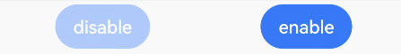

# 禁用控制

更新时间：2026-03-09 02:50:43

来源：https://developer.huawei.com/consumer/cn/doc/harmonyos-references/ts-universal-attributes-enable
**支持设备：** Phone / PC/2in1 / Tablet / Wearable / TV

组件可交互状态下响应[点击事件](https://developer.huawei.com/consumer/cn/doc/harmonyos-references/ts-universal-events-click)、[触摸事件](https://developer.huawei.com/consumer/cn/doc/harmonyos-references/ts-universal-events-touch)、[拖拽事件](https://developer.huawei.com/consumer/cn/doc/harmonyos-references/ts-universal-events-drag-drop)、[按键事件](https://developer.huawei.com/consumer/cn/doc/harmonyos-references/ts-universal-events-key)、[焦点事件](https://developer.huawei.com/consumer/cn/doc/harmonyos-references/ts-universal-focus-event)、[鼠标事件](https://developer.huawei.com/consumer/cn/doc/harmonyos-references/ts-universal-mouse-key)、[轴事件](https://developer.huawei.com/consumer/cn/doc/harmonyos-references/ts-universal-events-axis)、[悬浮事件](https://developer.huawei.com/consumer/cn/doc/harmonyos-references/ts-universal-events-hover)、[无障碍悬浮事件](https://developer.huawei.com/consumer/cn/doc/harmonyos-references/ts-universal-accessibility-hover-event)、[手势事件](https://developer.huawei.com/consumer/cn/doc/harmonyos-references/ts-gesture-settings)、[焦点轴事件](https://developer.huawei.com/consumer/cn/doc/harmonyos-references/ts-universal-events-focus_axis)和[表冠事件](https://developer.huawei.com/consumer/cn/doc/harmonyos-references/ts-universal-events-crown)。


> [!NOTE]
> 从API version 7开始支持。后续版本如有新增内容，则采用上角标单独标记该内容的起始版本。
> 禁用控制属性仅在按下时生效，交互过程中更改enabled属性无效。


## enabled
**支持设备：** Phone / PC/2in1 / Tablet / Wearable / TV

enabled(value: boolean): T

设置组件是否可交互。当未设置enabled时，组件默认可交互。

**卡片能力：** 从API version 9开始，该接口支持在ArkTS卡片中使用。

**元服务API：** 从API version 11开始，该接口支持在元服务中使用。

**系统能力：** SystemCapability.ArkUI.ArkUI.Full

**参数：**


| 参数名 | 类型 | 必填 | 说明 |
| --- | --- | --- | --- |
| value | boolean | 是 | 值为true表示组件可交互，响应点击等操作。 值为false表示组件不可交互，不响应点击等操作。 |


**返回值：**


| 类型 | 说明 |
| --- | --- |
| T | 返回当前组件。 |


## 示例
**支持设备：** Phone / PC/2in1 / Tablet / Wearable / TV

该示例通过enabled设置按钮可交互性。


```ts
// xxx.ets
@Entry
@Component
struct EnabledExample {
  build() {
    Flex({ justifyContent: FlexAlign.SpaceAround }) {
      // 点击时无响应
      Button('disable').enabled(false).backgroundColor(0x317aff).opacity(0.4)
      Button('enable').backgroundColor(0x317aff)
    }
    .width('100%')
    .padding({ top: 5 })
  }
}
```


