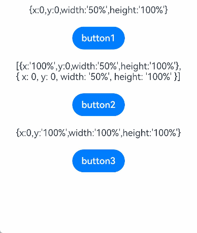
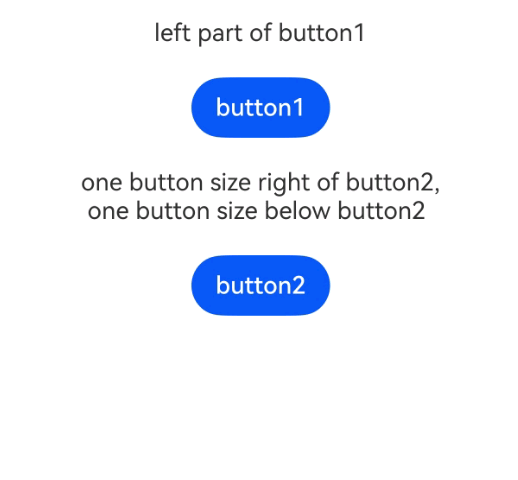
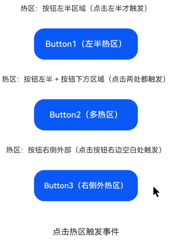

# 触摸热区设置

更新时间：2026-03-09 02:50:43

来源：https://developer.huawei.com/consumer/cn/doc/harmonyos-references/ts-universal-attributes-touch-target
**支持设备：** Phone / PC/2in1 / Tablet / Wearable / TV

设置组件的响应热区。在ArkUI开发框架中，处理触屏事件和鼠标事件时，会在事件触发前进行按压点与组件响应热区的[触摸测试](https://developer.huawei.com/consumer/cn/doc/harmonyos-guides/arkts-interaction-basic-principles#触摸测试)，以收集需响应事件的组件。基于测试结果，框架会分发相应的事件。影响[点击事件](https://developer.huawei.com/consumer/cn/doc/harmonyos-references/ts-universal-events-click)、[触摸事件](https://developer.huawei.com/consumer/cn/doc/harmonyos-references/ts-universal-events-touch)、[拖拽事件](https://developer.huawei.com/consumer/cn/doc/harmonyos-references/ts-universal-events-drag-drop)、[鼠标事件](https://developer.huawei.com/consumer/cn/doc/harmonyos-references/ts-universal-mouse-key)、[轴事件](https://developer.huawei.com/consumer/cn/doc/harmonyos-references/ts-universal-events-axis)、[悬浮事件](https://developer.huawei.com/consumer/cn/doc/harmonyos-references/ts-universal-events-hover)、[无障碍悬浮事件](https://developer.huawei.com/consumer/cn/doc/harmonyos-references/ts-universal-accessibility-hover-event)和[手势事件](https://developer.huawei.com/consumer/cn/doc/harmonyos-references/ts-gesture-settings)的分发。


## responseRegion
**支持设备：** Phone / PC/2in1 / Tablet / Wearable / TV

responseRegion(value: Array<Rectangle> | Rectangle): T

设置一个或多个触摸热区。

**卡片能力：** 从API version 9开始，该接口支持在ArkTS卡片中使用。

**元服务API：** 从API version 11开始，该接口支持在元服务中使用。

**系统能力：** SystemCapability.ArkUI.ArkUI.Full

**参数：**


| 参数名 | 类型 | 必填 | 说明 |
| --- | --- | --- | --- |
| value | Array&lt;[Rectangle](#rectangle对象说明)&gt; \| [Rectangle](#rectangle对象说明) | 是 | 触摸热区，包括位置和大小。          默认触摸热区为整个组件，默认值：          {          x：0,          y：0,          width：'100%',          height：'100%'          } |


**返回值：**


| 类型 | 说明 |
| --- | --- |
| T | 返回当前组件。 |


## mouseResponseRegion10+
**支持设备：** Phone / PC/2in1 / Tablet / Wearable / TV

mouseResponseRegion(value: Array<Rectangle> | Rectangle): T

设置一个或多个鼠标触摸热区。

**元服务API：** 从API version 11开始，该接口支持在元服务中使用。

**系统能力：** SystemCapability.ArkUI.ArkUI.Full

**参数：**


| 参数名 | 类型 | 必填 | 说明 |
| --- | --- | --- | --- |
| value | Array&lt;[Rectangle](#rectangle对象说明)&gt; \| [Rectangle](#rectangle对象说明) | 是 | 鼠标触摸热区，包括位置和大小。          默认触摸热区为整个组件，默认值：          {          x：0,          y：0,          width：'100%',          height：'100%'          } |


**返回值：**


| 类型 | 说明 |
| --- | --- |
| T | 返回当前组件。 |


## responseRegionList22+
**支持设备：** Phone / PC/2in1 / Tablet / Wearable / TV

responseRegionList(regions: Array<ResponseRegion>): T

设置组件的触摸热区列表。调用该接口时，[responseRegion](#responseregion)与[mouseResponseRegion](#mouseresponseregion10)接口不再生效。

**元服务API：** 从API version 22开始，该接口支持在元服务中使用。

**系统能力：** SystemCapability.ArkUI.ArkUI.Full

**参数：**


| 参数名 | 类型 | 必填 | 说明 |
| --- | --- | --- | --- |
| regions | Array&lt;[ResponseRegion](#responseregion22对象说明)&gt; | 是 | 组件的触摸热区数组。          每个触摸热区均包括输入工具类型、位置和大小。          默认值：          [{          tool：ResponseRegionSupportedTool.ALL,          x：LengthMetrics.vp(0),          y：LengthMetrics.vp(0),          width：LengthMetrics.percent(1),          height：LengthMetrics.percent(1)          }] |


**返回值：**


| 类型 | 说明 |
| --- | --- |
| T | 返回当前组件。 |


## Rectangle对象说明
**支持设备：** Phone / PC/2in1 / Tablet / Wearable / TV

**卡片能力：** 从API version 9开始，该接口支持在ArkTS卡片中使用。

**元服务API：** 从API version 11开始，该接口支持在元服务中使用。

**系统能力：** SystemCapability.ArkUI.ArkUI.Full


| 名称 | 类型 | 只读 | 可选 | 说明 |
| --- | --- | --- | --- | --- |
| x | [Length](https://developer.huawei.com/consumer/cn/doc/harmonyos-references/ts-types#length) | 否 | 是 | 触摸点相对于组件左上角的x轴坐标。          默认值：0vp |
| y | [Length](https://developer.huawei.com/consumer/cn/doc/harmonyos-references/ts-types#length) | 否 | 是 | 触摸点相对于组件左上角的y轴坐标。          默认值：0vp |
| width | [Length](https://developer.huawei.com/consumer/cn/doc/harmonyos-references/ts-types#length) | 否 | 是 | 触���热区的宽度。          默认值：'100%' |
| height | [Length](https://developer.huawei.com/consumer/cn/doc/harmonyos-references/ts-types#length) | 否 | 是 | 触摸热区的高度。          默认值：'100%' |


## ResponseRegion22+对象说明
**支持设备：** Phone / PC/2in1 / Tablet / Wearable / TV

由输入工具类型、触摸位置和大小组成的触摸热区。


**元服务API：** 从API version 22开始，该接口支持在元服务中使用。

**系统能力：** SystemCapability.ArkUI.ArkUI.Full


| 名称 | 类型 | 只读 | 可选 | 说明 |
| --- | --- | --- | --- | --- |
| tool | [ResponseRegionSupportedTool](https://developer.huawei.com/consumer/cn/doc/harmonyos-references/ts-appendix-enums#responseregionsupportedtool22) | 否 | 是 | 触摸热区适用的输入工具类型。          默认值：ResponseRegionSupportedTool.ALL |
| x | [LengthMetrics](https://developer.huawei.com/consumer/cn/doc/harmonyos-references/js-apis-arkui-graphics#lengthmetrics12) | 否 | 是 | 触摸点相对于组件左上角的x轴坐标。          默认值：LengthMetrics.vp(0) |
| y | [LengthMetrics](https://developer.huawei.com/consumer/cn/doc/harmonyos-references/js-apis-arkui-graphics#lengthmetrics12) | 否 | 是 | 触摸点相对于组件左上角的y轴坐标。          默认值：LengthMetrics.vp(0) |
| width | [LengthMetrics](https://developer.huawei.com/consumer/cn/doc/harmonyos-references/js-apis-arkui-graphics#lengthmetrics12) \| string | 否 | 是 | 触摸热区的宽度。          默认值：LengthMetrics.percent(1) |
| height | [LengthMetrics](https://developer.huawei.com/consumer/cn/doc/harmonyos-references/js-apis-arkui-graphics#lengthmetrics12) \| string | 否 | 是 | 触摸热区的高度。          默认值：LengthMetrics.percent(1) |


## 示例
**支持设备：** Phone / PC/2in1 / Tablet / Wearable / TV


### 示例1（通过responseRegion接口设置触摸热区）

该示例通过responseRegion设置按钮的触摸热区以响应点击事件。


```ts
// xxx.ets
@Entry
@Component
struct TouchTargetExample {
  @State text: string = "";

  build() {
    Column({ space: 20 }) {
      Text("{x:0,y:0,width:'50%',height:'100%'}")
      // 热区宽度为按钮的一半，点击button1右半部无响应
      Button("button1")
      .responseRegion({
        x: 0,
        y: 0,
        width: '50%',
        height: '100%'
      })
      .onClick(() => {
        this.text = 'button1 clicked'
      })

      // 为一个组件添加多个热区
      Text("[{x:'100%',y:0,width:'50%',height:'100%'}," +
      "\n{ x: 0, y: 0, width: '50%', height: '100%' }]")
      Button("button2")
      .responseRegion([
      {
        x: '100%',
        y: 0,
        width: '50%',
        height: '100%'
      }, // 第一个热区宽度为按钮的一半，且右移一个按钮宽度，点击button2右边按钮宽度一半的区域，点击事件生效
      {
        x: 0,
        y: 0,
        width: '50%',
        height: '100%'
      }// 第二个热区宽度为按钮的一半，点击button2左半部，点击事件生效
      ])
      .onClick(() => {
        this.text = 'button2 clicked'
      })
      // 热区大小为整个按钮，且下移一个按钮高度，点击button3下方按钮大小区域，点击事件生效
      Text("{x:0,y:'100%',width:'100%',height:'100%'}")
      Button("button3")
      .responseRegion({
        x: 0,
        y: '100%',
        width: '100%',
        height: '100%'
      })
      .onClick(() => {
        this.text = 'button3 clicked'
      })

      Text(this.text).margin({ top: 50 })
  }.width('100%').margin({ top: 10 })
  }
}
```




### 示例2（通过responseRegionList接口设置触摸热区）

该示例通过[responseRegionList](#responseregionlist22)设置按钮的触摸热区以响应点击事件。

从API version 22开始，新增responseRegionList接口。


```ts
// xxx.ets
import { LengthMetrics } from '@kit.ArkUI';

@Entry
@Component
struct TouchTargetExample {
  @State text: string = "";

  build() {
    Column({ space: 20 }) {
      Text("left part of button1")
      // 热区宽度为按钮的一半，点击button1右半部无响应
      Button("button1")
      .responseRegionList([{
        x: LengthMetrics.vp(0),
        y: LengthMetrics.vp(0),
        width: LengthMetrics.percent(0.5),
        height: LengthMetrics.percent(1),
      }])
      .onClick(() => {
        this.text = 'button1 clicked'
      })

      // 热区一的大小为整个按钮，且右移一个按钮宽度，点击button2左边按钮大小区域，点击事件生效
      // 热区二的大小为整个按钮，且下移一个按钮高度，鼠标点击button2下方按钮大小区域，点击事件生效
      Text("one button size right of button2," + "\n one button size below button2")
      Button("button2")
      .responseRegionList([{
        x: LengthMetrics.percent(1),
        y: LengthMetrics.vp(0),
        width: LengthMetrics.percent(1),
        height: LengthMetrics.percent(1),
      }, {
        tool: ResponseRegionSupportedTool.MOUSE,
        x: LengthMetrics.vp(0),
        y: LengthMetrics.percent(1),
        width: 'calc(100% + 0vp)',
        height: 'calc(100% - 0px)',
      }])
      .onClick(() => {
        this.text = 'button2 clicked'
      })

      Text(this.text).margin({ top: 50 })
  }.width('100%').margin({ top: 10 })
  }
}
```




### 示例3（设置鼠标的触摸热区以响应点击事件）

该示例通过[mouseResponseRegion](https://developer.huawei.com/consumer/cn/doc/harmonyos-references/ts-universal-attributes-touch-target#mouseresponseregion10)设置鼠标的触摸热区以响应点击事件。


```ts
// xxx.ets
@Entry
@Component
struct MouseResponseRegionExample {
  @State clickInfo: string = '点击热区触发事件';

  build() {
    Column({ space: 30 }) {
      // 示例1：单个热区（仅按钮左半部分响应鼠标点击）
      Text('热区：按钮左半区域（点击左半才触发）')
      .fontSize(14)
      Button('Button1（左半热区）')
      .width(200)
      .height(60)
      // 鼠标热区：仅按钮左半部分（x/y相对组件自身，宽度50%）
      .mouseResponseRegion({
        // 热区相对组件的X坐标（左上角为原点）
        x: 0,
        // 热区相对组件的Y坐标
        y: 0,
        // 热区宽度（按钮的50%）
        width: '50%',
        // 热区高度（按钮的100%）
        height: '100%'
      })
      .onClick(() => {
        this.clickInfo = 'Button1 左半热区被点击';
      })
      // 示例2：多个热区（按钮左半 + 按钮下方区域都响应）
      Text('热区：按钮左半 + 按钮下方区域（点击两处都触发）')
      .fontSize(14)
      Button('Button2（多热区）')
      .width(200)
      .height(60)
      // 鼠标热区：数组形式，包含2个独立热区
      .mouseResponseRegion([
      // 热区1：按钮左半部分
      {
        x: 0,
        y: 0,
        width: '50%',
        height: '100%'
      },
      // 热区2：按钮正下方区域（y=100%表示按钮底部，高度60vp）
      {
        x: 0,
        y: '100%',
        width: '100%',
        height: 60
      }
      ])
      .onClick(() => {
        this.clickInfo = 'Button2 任一热区被点击';
      })
      // 示例3：热区在按钮外部（按钮右侧空白处响应）
      Text('热区：按钮右侧外部（点击按钮右边空白处触发）')
      .fontSize(14)
      Button('Button3（右侧外热区）')
      .width(200)
      .height(60)
      // 鼠标热区：按钮右侧外部区域（x=100%表示按钮右边缘）
      .mouseResponseRegion({
        // 热区X坐标：按钮右边缘
        x: '100%',
        y: 0,
        // 热区宽度80vp
        width: 80,
        height: '100%'
      })
      .onClick(() => {
        this.clickInfo = 'Button3 右侧外热区被点击';
      })
      // 显示点击结果
      Text(this.clickInfo)
      .fontSize(16)
      .margin({ top: 20 })
    }
    .width('100%')
    .height('100%')
    // 整体居中显示
    .justifyContent(FlexAlign.Center)
  }
}
```


