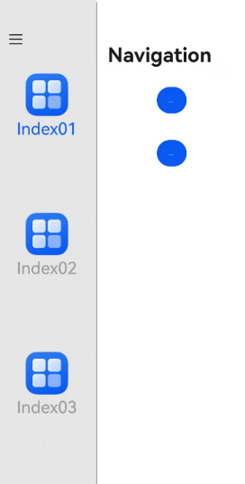

# 工具栏设置

更新时间：2026-03-09 02:50:43

来源：https://developer.huawei.com/consumer/cn/doc/harmonyos-references/ts-universal-attributes-toolbar
**支持设备：** Phone / PC/2in1 / Tablet / Wearable / TV

设置组件对应的工具栏。


## toolbar
**支持设备：** Phone / PC/2in1 / Tablet / Wearable / TV

toolbar(value: CustomBuilder): T

为绑定该属性的组件，在窗口顶部标题栏相应分栏创建与该组件绑定的由[ToolBarItem](https://developer.huawei.com/consumer/cn/doc/harmonyos-references/ts-basic-components-toolbaritem)构成的工具栏，分栏位置依据绑定该属性的组件所在分栏位置确定。[CustomBuilder](https://developer.huawei.com/consumer/cn/doc/harmonyos-references/ts-types#custombuilder8)必须由[ToolBarItem](https://developer.huawei.com/consumer/cn/doc/harmonyos-references/ts-basic-components-toolbaritem)构成，该工具栏才能生效。


> [!NOTE]
> 该接口不支持在[attributeModifier](https://developer.huawei.com/consumer/cn/doc/harmonyos-references/ts-universal-attributes-attribute-modifier#attributemodifier)中调用。

**系统能力：** SystemCapability.ArkUI.ArkUI.Full

**参数：**


| 参数名 | 类型 | 必填 | 说明 |
| --- | --- | --- | --- |
| value | [CustomBuilder](https://developer.huawei.com/consumer/cn/doc/harmonyos-references/ts-types#custombuilder8) | 是 | 为当前组件配置CustomBuilder类型的自定义工具栏。 |


**返回值：**


| 类型 | 说明 |
| --- | --- |
| T | 返回当前组件。 |


## 示例
**支持设备：** Phone / PC/2in1 / Tablet / Wearable / TV

该示例通过为[Navigation](https://developer.huawei.com/consumer/cn/doc/harmonyos-references/ts-basic-components-navigation)下的[Button](https://developer.huawei.com/consumer/cn/doc/harmonyos-references/ts-basic-components-button)组件绑定toolbar通用属性，为标题栏Navbar分栏开头位置添加包含两个[Button](https://developer.huawei.com/consumer/cn/doc/harmonyos-references/ts-basic-components-button)组件工具栏项。为[NavDestination](https://developer.huawei.com/consumer/cn/doc/harmonyos-references/ts-basic-components-navdestination)下的[Text](https://developer.huawei.com/consumer/cn/doc/harmonyos-references/ts-basic-components-text)组件绑定toolbar通用属性，为标题栏NavDestination分栏末尾位置添加包含一个滑动条组件和一个搜索栏组件工具栏项。


```ts
// xxx.ets
@Entry
@Component
struct SideBarContainerExample {
  normalIcon: Resource = $r("app.media.startIcon")
  selectedIcon: Resource = $r("app.media.startIcon")
  @State arr: number[] = [1, 2, 3]
  @State current: number = 1
  @Provide('navPathStack') navPathStack: NavPathStack = new NavPathStack()

  @Builder
  MyToolBar() {
    ToolBarItem({ placement: ToolBarItemPlacement.TOP_BAR_LEADING }) {
      Button("left").height("30vp")
    }

    ToolBarItem({ placement: ToolBarItemPlacement.TOP_BAR_LEADING }) {
      Button("right").height("30vp")
    }
  }

  @Builder
  MyToolbarNavDest() {
    ToolBarItem({ placement: ToolBarItemPlacement.TOP_BAR_TRAILING }) {
      Slider().width("120vp")
    }

    ToolBarItem({ placement: ToolBarItemPlacement.TOP_BAR_TRAILING }) {
      Search().width("120vp")
    }
  }

  @Builder
  PageNavDest(name: string) {
    NavDestination() {
      Column() {
        Text("add toolbar")
        .fontSize(30)
        .toolbar(this.MyToolbarNavDest())
      }
      .backgroundColor(Color.Grey)
    }
  }

  build() {
    SideBarContainer(SideBarContainerType.Embed) {
      Column() {
        ForEach(this.arr, (item: number) => {
          Column({ space: 5 }) {
            Image(this.current === item ? this.selectedIcon : this.normalIcon).width(64).height(64)
            Text("Index0" + item)
            .fontSize(25)
            .fontColor(this.current === item ? '#0A59F7' : '#999')
            .fontFamily('source-sans-pro,cursive,sans-serif')
          }
          .onClick(() => {
            this.current = item
          })
        }, (item: number) => item.toString())
      }.width('100%')
      .justifyContent(FlexAlign.SpaceEvenly)
      .backgroundColor('#19000000')

      Navigation(this.navPathStack) {
        Column() {
          Button('pushPath', { stateEffect: true, type: ButtonType.Capsule })
          .width('20%')
          .height(40)
          .margin(20)
          .toolbar(this.MyToolBar)
          Button('showNavDest', { stateEffect: true, type: ButtonType.Capsule })
          .width('20%')
          .height(40)
          .margin(20)
          .onClick(() => {
            this.navPathStack.pushPath({ name: "1" })
          })
        }
        .width('100%')
        .height('100%')
      }
      .navBarPosition(NavBarPosition.Start)
      .navBarWidth("50%")
      .navBarWidthRange(["25%", "70%"])
      .hideBackButton(true)
      .navDestination(this.PageNavDest)
      .height('100%')
      .title('Navigation')
    }
    .sideBarWidth(150)
    .minSideBarWidth(50)
    .maxSideBarWidth(300)
    .minContentWidth(0)
    .onChange((value: boolean) => {
      console.info('status:' + value)
    })
    .divider({
      strokeWidth: '1vp',
      color: Color.Gray,
      startMargin: '4vp',
      endMargin: '4vp'
    })
  }
}
```


