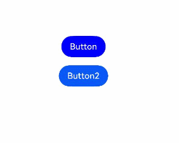
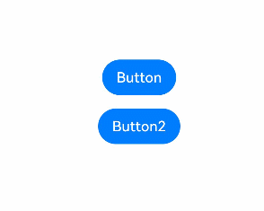
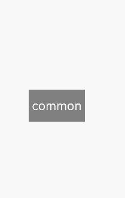
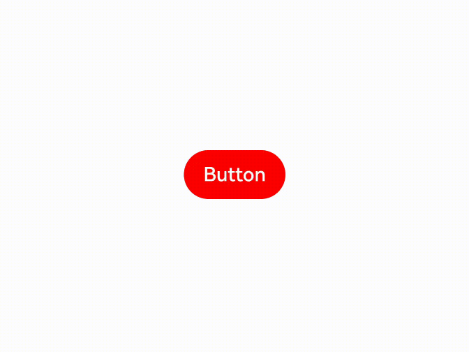
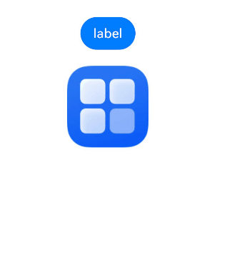
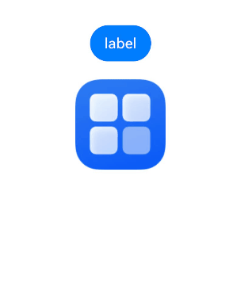

# 动态属性设置

更新时间：2026-05-18 03:44:20

来源：https://developer.huawei.com/consumer/cn/doc/harmonyos-references/ts-universal-attributes-attribute-modifier
**支持设备：** Phone | PC/2in1 | Tablet | Wearable | TV

动态设置组件的属性，支持开发者在属性设置时使用if/else语法，且根据需要使用多态样式设置属性。

> [!NOTE]
> 从API version 11开始支持。后续版本如有新增内容，则采用上角标单独标记该内容的起始版本。 在attributeModifier中设置的属性尽量不要与其他方法设置的属性相同，避免在页面刷新时attributeModifier不生效。 对于仅需根据条件设置组件单一属性的简单场景，可以使用 三目表达式 （如.width(isFullScreen ? 200 : 100)）。 从API version 20开始，attributeModifier支持自定义组件。


##### attributeModifier

attributeModifier(modifier: AttributeModifier&lt;T&gt;): T

动态设置组件的属性方法。

**元服务API：** 从API version 12开始，该接口支持在元服务中使用。

**系统能力：** SystemCapability.ArkUI.ArkUI.Full

**参数：**

| 参数名 | 类型 | 必填 | 说明 |
| --- | --- | --- | --- |
| modifier | AttributeModifier&lt;T&gt; | 是 | 在当前组件上，动态设置属性方法，支持使用if/else语法。 modifier：属性修改器，开发者需要自定义class实现AttributeModifier接口。 |


**返回值：**

| 类型 | 说明 |
| --- | --- |
| T | 返回当前组件。 |


##### AttributeModifier&lt;T&gt;

开发者需要自定义class实现AttributeModifier接口。

**元服务API：** 从API version 12开始，该接口支持在元服务中使用。

**系统能力：** SystemCapability.ArkUI.ArkUI.Full

> [!NOTE]
> 在以下回调函数中，当对instance对象的同一个属性重复设置相同的值或对象时，不会触发该属性的更新。


##### applyNormalAttribute

applyNormalAttribute?(instance: T): void

组件普通状态时的样式。

**元服务API：** 从API version 12开始，该接口支持在元服务中使用。

**系统能力：** SystemCapability.ArkUI.ArkUI.Full

**参数：**

| 参数名 | 类型 | 必填 | 说明 |
| --- | --- | --- | --- |
| instance | T | 是 | 组件的属性类，用来标识进行属性设置的组件的类型，比如Button组件的属性（ButtonAttribute），Text组件的属性（TextAttribute）等。具体取值请参考Attribute类型支持范围。 |


##### applyPressedAttribute

applyPressedAttribute?(instance: T): void

组件按压状态的样式。参考[示例2（组件绑定Modifier实现按压态效果）](#示例2组件绑定modifier实现按压态效果)、[示例8（自定义组件绑定Modifier实现按压态效果）](#示例8自定义组件绑定modifier实现按压态效果)。

**元服务API：** 从API version 12开始，该接口支持在元服务中使用。

**系统能力：** SystemCapability.ArkUI.ArkUI.Full

**参数：**

| 参数名 | 类型 | 必填 | 说明 |
| --- | --- | --- | --- |
| instance | T | 是 | 组件的属性类，用来标识进行属性设置的组件的类型，比如Button组件的属性（ButtonAttribute），Text组件的属性（TextAttribute）等。具体取值请参考Attribute类型支持范围。 |


##### applyFocusedAttribute

applyFocusedAttribute?(instance: T): void

组件获焦状态的样式。参考[示例5（组件绑定Modifier获焦样式）](#示例5组件绑定modifier获焦样式)。

**元服务API：** 从API version 12开始，该接口支持在元服务中使用。

**系统能力：** SystemCapability.ArkUI.ArkUI.Full

**参数：**

| 参数名 | 类型 | 必填 | 说明 |
| --- | --- | --- | --- |
| instance | T | 是 | 组件的属性类，用来标识进行属性设置的组件的类型，比如Button组件的属性（ButtonAttribute），Text组件的属性（TextAttribute）等。具体取值请参考Attribute类型支持范围。 |


##### applyDisabledAttribute

applyDisabledAttribute?(instance: T): void

组件禁用状态的样式。参考[示例6（组件绑定modifier禁用状态的样式）](#示例6组件绑定modifier禁用状态的样式)。

**元服务API：** 从API version 12开始，该接口支持在元服务中使用。

**系统能力：** SystemCapability.ArkUI.ArkUI.Full

**参数：**

| 参数名 | 类型 | 必填 | 说明 |
| --- | --- | --- | --- |
| instance | T | 是 | 组件的属性类，用来标识进行属性设置的组件的类型，比如Button组件的属性（ButtonAttribute），Text组件的属性（TextAttribute）等。具体取值请参考Attribute类型支持范围。 |


##### applySelectedAttribute

applySelectedAttribute?(instance: T): void

组件选中状态的样式。

开发者可根据需要自定义实现这些方法，通过传入的参数识别组件类型，对instance设置属性，支持使用if/else语法进行动态设置。参考[示例7（组件绑定modifier选中状态样式）](#示例7组件绑定modifier选中状态样式)。

**元服务API：** 从API version 12开始，该接口支持在元服务中使用。

**系统能力：** SystemCapability.ArkUI.ArkUI.Full

**参数：**

| 参数名 | 类型 | 必填 | 说明 |
| --- | --- | --- | --- |
| instance | T | 是 | 组件的属性类，用来标识进行属性设置的组件的类型，比如Button组件的属性（ButtonAttribute），Text组件的属性（TextAttribute）等。具体取值请参考Attribute类型支持范围。 |


##### Attribute类型支持范围

| 名称 | 说明 |
| --- | --- |
| AlphabetIndexerAttribute | AlphabetIndexer的属性。 |
| BadgeAttribute | Badge的属性。 |
| BlankAttribute | Blank的属性。 |
| ButtonAttribute | Button的属性。 |
| CalendarPickerAttribute | CalendarPicker的属性。 |
| CanvasAttribute | Canvas的属性。 |
| CheckboxAttribute | Checkbox的属性。 |
| CheckboxGroupAttribute | CheckboxGroup的属性。 |
| CircleAttribute | Circle的属性。 |
| ColumnAttribute | Column的属性。 |
| ColumnSplitAttribute | ColumnSplit的属性。 |
| CommonAttribute | Common的属性。 |
| CounterAttribute | Counter的属性。 |
| DataPanelAttribute | DataPanel的属性。 |
| DatePickerAttribute | DatePicker的属性。 |
| DividerAttribute | Divider的属性。 |
| EllipseAttribute | Ellipse的属性。 |
| FlexAttribute | Flex的属性。 |
| FlowItemAttribute | FlowItem的属性。 |
| FormLinkAttribute | FormLink的属性。 |
| GaugeAttribute | Gauge的属性。 |
| GridAttribute | Grid的属性。 |
| GridColAttribute | GridCol的属性。 |
| GridItemAttribute | GridItem的属性。 |
| GridRowAttribute | GridRow的属性。 |
| HyperlinkAttribute | Hyperlink的属性。 |
| IndicatorComponentAttribute | IndicatorComponent的属性。 |
| ImageAttribute | Image的属性。 |
| ImageAnimatorAttribute | ImageAnimator的属性。 |
| ImageSpanAttribute | ImageSpan的属性。 |
| ContainerSpanAttribute | ContainerSpan的属性。 |
| LineAttribute | Line的属性。 |
| ListAttribute | List的属性。 |
| ListItemAttribute | ListItem的属性。 |
| ListItemGroupAttribute | ListItemGroup的属性。 |
| LoadingProgressAttribute | LoadingProgress的属性。 |
| MarqueeAttribute | Marquee的属性。 |
| MenuAttribute | Menu的属性。 |
| MenuItemAttribute | MenuItem的属性。 |
| MenuItemGroupAttribute | MenuItemGroup的属性。 |
| NavDestinationAttribute | NavDestination的属性。 |
| NavigationAttribute | Navigation的属性。 |
| NavigatorAttribute | Navigator的属性。 |
| NavRouterAttribute | NavRouter的属性。 |
| PanelAttribute | Panel的属性。 |
| PathAttribute | Path的属性。 |
| PatternLockAttribute | PatternLock的属性。 |
| PolygonAttribute | Polygon的属性。 |
| PolylineAttribute | Polyline的属性。 |
| ProgressAttribute | Progress的属性。 |
| QRCodeAttribute | QRCode的属性。 |
| RadioAttribute | Radio的属性。 |
| RatingAttribute | Rating的属性。 |
| RectAttribute | Rect的属性。 |
| RefreshAttribute | Refresh的属性。 |
| RelativeContainerAttribute | RelativeContainer的属性。 |
| RichEditorAttribute | RichEditor的属性。 |
| RichTextAttribute | RichText的属性。 |
| RowAttribute | Row的属性。 |
| RowSplitAttribute | RowSplit的属性。 |
| ScrollAttribute | Scroll的属性。 |
| ScrollBarAttribute | ScrollBar的属性。 |
| SearchAttribute | Search的属性。 |
| SelectAttribute | Select的属性。 |
| ShapeAttribute | Shape的属性。 |
| SideBarContainerAttribute | SideBarContainer的属性。 |
| SliderAttribute | Slider的属性。 |
| SpanAttribute | Span的属性。 |
| SymbolSpanAttribute | SymbolSpan的属性。 |
| StackAttribute | Stack的属性。 |
| StepperAttribute | Stepper的属性。 |
| StepperItemAttribute | StepperItem的属性。 |
| SwiperAttribute | Swiper的属性。 |
| SymbolGlyphAttribute | SymbolGlyph的属性。 |
| TabContentAttribute | TabContent的属性。 |
| TabsAttribute | Tabs的属性。 |
| TextAttribute | Text的属性。 |
| TextAreaAttribute | TextArea的属性。 |
| TextClockAttribute | TextClock的属性。 |
| TextInputAttribute | TextInput的属性。 |
| TextPickerAttribute | TextPicker的属性。 |
| TextTimerAttribute | TextTimer的属性。 |
| TimePickerAttribute | TimePicker的属性。 |
| ToggleAttribute | Toggle的属性。 |
| VideoAttribute | Video的属性。 |
| WaterFlowAttribute | WaterFlow的属性。 |
| XComponentAttribute | XComponent的属性。 |
| ParticleAttribute | Particle的属性。 |
| UIPickerComponentAttribute22+ | UIPickerComponent的属性。 |
| UIExtensionComponentAttribute | UIExtensionComponent的属性。 |


> [!NOTE]
> StepperAttribute从API version 22开始废弃，建议使用SwiperAttribute替代。 StepperItemAttribute从API version 22开始废弃，建议使用SwiperAttribute替代。 NavigatorAttribute从API version 20开始废弃，建议使用NavigationAttribute替代。 NavRouterAttribute从API version 20开始废弃，建议使用NavigationAttribute替代。 PanelAttribute从API version 20开始废弃，推荐使用通用属性bindSheet。


**属性支持范围：**
1. 不支持入参或者返回值为[CustomBuilder](https://developer.huawei.com/consumer/cn/doc/harmonyos-references/ts-types#custombuilder8)的属性。
2. 不支持入参为[modifier](https://developer.huawei.com/consumer/cn/doc/harmonyos-guides/arkts-user-defined-modifier)类型的属性，具体为以下属性方法：[attributeModifier](#attributemodifier)，[drawModifier](https://developer.huawei.com/consumer/cn/doc/harmonyos-references/ts-universal-attributes-draw-modifier#drawmodifier)和[gestureModifier](https://developer.huawei.com/consumer/cn/doc/harmonyos-references/ts-universal-attributes-gesture-modifier#gesturemodifier)。
3. 不支持[animation](https://developer.huawei.com/consumer/cn/doc/harmonyos-references/ts-animatorproperty)属性。
4. 不支持[gesture](https://developer.huawei.com/consumer/cn/doc/harmonyos-guides/arkts-gesture-events-binding)类型的属性。
5. 不支持[stateStyles](https://developer.huawei.com/consumer/cn/doc/harmonyos-references/ts-universal-attributes-polymorphic-style#statestyles)属性。
6. 不支持已废弃属性。

不支持或者未实现的属性在使用时会抛出"Method not implemented."、"is not callable"、"Builder is not supported."等异常信息。具体Modifier支持范围可参考[属性或事件对attributemodifier的支持情况](https://developer.huawei.com/consumer/cn/doc/harmonyos-guides/arkts-user-defined-extension-attributemodifier#属性或事件对attributemodifier的支持情况)。


##### 自定义Modifier

从API version 12开始，开发者可使用自定义Modifier构建组件并配置属性，通过此自定义的Modifier可调用所封装组件的属性和样式接口。

**自定义Modifier支持范围：**

| 名称 | 说明 |
| --- | --- |
| CommonModifier | 通用属性对应的Modifier |
| ColumnModifier | - |
| ColumnSplitModifier | - |
| RowModifier | - |
| RowSplitModifier | - |
| SideBarContainerModifier | - |
| BlankModifier | - |
| DividerModifier | - |
| GridColModifier | - |
| GridRowModifier | - |
| NavDestinationModifier | - |
| NavigatorModifier | - |
| StackModifier | - |
| NavigationModifier | - |
| NavRouterModifier | - |
| StepperItemModifier | - |
| StepperModifier20+ | - |
| TabsModifier | - |
| GridModifier | - |
| GridItemModifier | - |
| ListModifier | - |
| ListItemModifier | - |
| ListItemGroupModifier | - |
| ScrollModifier | - |
| SwiperModifier | - |
| WaterFlowModifier | - |
| ButtonModifier | - |
| CounterModifier | - |
| TextPickerModifier | - |
| TimePickerModifier | - |
| ToggleModifier | - |
| CalendarPickerModifier | - |
| CheckboxModifier | - |
| CheckboxGroupModifier | - |
| DatePickerModifier | - |
| RadioModifier | - |
| RatingModifier | - |
| SelectModifier | - |
| SliderModifier | - |
| PatternLockModifier | - |
| SpanModifier | - |
| SymbolSpanModifier | - |
| ContainerSpanModifier | - |
| RichEditorModifier | - |
| RefreshModifier | - |
| SearchModifier | - |
| TextAreaModifier | - |
| TextModifier | - |
| TextInputModifier | - |
| ImageSpanModifier | - |
| ImageAnimatorModifier | - |
| ImageModifier | - |
| VideoModifier | - |
| DataPanelModifier | - |
| GaugeModifier | - |
| LoadingProgressModifier | - |
| MarqueeModifier | - |
| ProgressModifier | - |
| QRCodeModifier | - |
| TextClockModifier | - |
| TextTimerModifier | - |
| LineModifier | - |
| PathModifier | - |
| PolygonModifier | - |
| PolylineModifier | - |
| RectModifier | - |
| ShapeModifier | - |
| AlphabetIndexerModifier | - |
| FormComponentModifier | - |
| HyperlinkModifier | - |
| MenuModifier | - |
| MenuItemModifier | - |
| PanelModifier | - |
| SymbolGlyphModifier | - |
| ParticleModifier | - |
| UIPickerComponentModifier22+ | - |


未暴露的组件Modifier可以使用CommonModifier。

> [!NOTE]
> StepperModifier从API version 22开始废弃，建议使用SwiperModifier替代。 StepperItemModifier从API version 22开始废弃，建议使用SwiperModifier替代。 NavigatorModifier从API version 20开始废弃，建议使用NavigationModifier替代。 NavRouterModifier从API version 20开始废弃，建议使用NavigationModifier替代。 PanelModifier从API version 20开始废弃，推荐使用通用属性bindSheet。


**注意事项**
1. 设置自定义Modifier给一个组件，该组件对应属性生效。
2. 自定义Modifier属性值变化，组件对应属性也会变化。自定义Modifier类型为基类，构造的对象为子类对象，使用时要通过as进行类型断言为子类。
3. 一个自定义Modifier设置给两个组件，Modifier属性变化的时候对两个组件同时生效。
4. 一个Modifier设置了属性A和属性B，再设置属性C和属性D，4个属性同时在组件上生效。
5. 自定义Modifier不支持@State标注的状态数据的变化感知，见[示例3（自定义Modifier不支持感知@State装饰的状态数据变化）](#示例3自定义modifier不支持感知state装饰的状态数据变化)。
6. 多次通过attributeModifier设置属性时，生效的属性为所有属性的并集，相同属性按照设置顺序生效。


##### 示例


##### 示例1（组件绑定Modifier切换背景颜色）

该示例通过Button绑定Modifier实现了点击切换背景颜色的效果。

```ArkTS
// xxx.ets
// 设置Button组件属性的自定义AttributeModifier
class MyButtonModifier implements AttributeModifier<ButtonAttribute> {
  public isDark: boolean = false;

  applyNormalAttribute(instance: ButtonAttribute): void {
    if (this.isDark) {
      instance.backgroundColor(Color.Black);
    } else {
      instance.backgroundColor(Color.Red);
    }
  }
}

@Entry
@Component
struct attributeDemo {
  @State modifier: MyButtonModifier = new MyButtonModifier();

  build() {
    Row() {
      Column() {
        Button("Button")
          .attributeModifier(this.modifier)
          .onClick(() => {
            this.modifier.isDark = !this.modifier.isDark;
          })
      }
      .width('100%')
    }
    .height('100%')
  }
}
```





##### 示例2（组件绑定Modifier实现按压态效果）

该示例通过Button绑定Modifier实现了按压态的效果。如果配合状态管理V2使用，详情见：[Modifier与makeObserved](https://developer.huawei.com/consumer/cn/doc/harmonyos-guides/arkts-v1-v2-migration-inner-object#modifier)。

```ArkTS
// xxx.ets
// 设置Button组件属性的自定义AttributeModifier
class MyButtonModifier implements AttributeModifier<ButtonAttribute> {
  applyNormalAttribute(instance: ButtonAttribute): void {
    instance.backgroundColor(Color.Black);
  }

  applyPressedAttribute(instance: ButtonAttribute): void {
    instance.backgroundColor(Color.Red);
  }
}

@Entry
@Component
struct attributePressedDemo {
  @State modifier: MyButtonModifier = new MyButtonModifier();

  build() {
    Row() {
      Column() {
        Button("Button")
          .attributeModifier(this.modifier)
      }
      .width('100%')
    }
    .height('100%')
  }
}
```





##### 示例3（自定义Modifier不支持感知@State装饰的状态数据变化）

该示例通过状态数据设置自定义Modifier的宽度，自定义Modifier不支持感知@State装饰的状态数据变化，点击按钮后宽度不发生改变。

```text
import { CommonModifier } from "@kit.ArkUI";

const TEST_TAG: string = "AttributeModifier";

// 设置通用组件属性的自定义AttributeModifier
class MyModifier extends CommonModifier {
  applyNormalAttribute(instance: CommonAttribute): void {
    super.applyNormalAttribute?.(instance);
  }
}

@Component
struct MyImage1 {
  @Link modifier: CommonModifier;

  build() {
    Image($r("app.media.startIcon")).attributeModifier(this.modifier as MyModifier)
  }
}

@Entry
@Component
struct Index {
  index: number = 0;
  @State width1: number = 100;
  @State height1: number = 100;
  @State myModifier: CommonModifier = new MyModifier().width(this.width1).height(this.height1).margin(10);

  build() {
    Column() {
      Button($r("app.string.EntryAbility_label"))
        .margin(10)
        .onClick(() => {
          console.info(TEST_TAG, "onClick");
          this.index++;
          if (this.index % 2 === 1) {
            this.width1 = 10;
            console.info(TEST_TAG, "setGroup1");
          } else {
            this.height1 = 10;
            console.info(TEST_TAG, "setGroup2");
          }
        })
      MyImage1({ modifier: this.myModifier })
    }
    .width('100%')
  }
}
```


##### 示例4（Modifier和自定义Modifier的属性同时生效）

该示例通过自定义Modifier设置了width和height，点击按钮时设置[borderStyle](https://developer.huawei.com/consumer/cn/doc/harmonyos-references/ts-appendix-enums#borderstyle)和[borderWidth](https://developer.huawei.com/consumer/cn/doc/harmonyos-references/ts-universal-attributes-border#borderwidth)，点击后4个属性同时生效。

```text
import { CommonModifier } from "@kit.ArkUI";

const TEST_TAG: string = "AttributeModifier";

// 设置通用组件属性的自定义AttributeModifier
class MyModifier extends CommonModifier {
  applyNormalAttribute(instance: CommonAttribute): void {
    super.applyNormalAttribute?.(instance);
  }

  public setGroup1(): void {
    this.borderStyle(BorderStyle.Dotted);
    this.borderWidth(8);
  }

  public setGroup2(): void {
    this.borderStyle(BorderStyle.Dashed);
    this.borderWidth(8);
  }
}

@Component
struct MyImage1 {
  @Link modifier: CommonModifier;

  build() {
    Image($r("app.media.startIcon")).attributeModifier(this.modifier as MyModifier)
  }
}

@Entry
@Component
struct Index {
  @State myModifier: CommonModifier = new MyModifier().width(100).height(100).margin(10);
  index: number = 0;

  build() {
    Column() {
      Button($r("app.string.EntryAbility_label"))
        .margin(10)
        .onClick(() => {
          console.info(TEST_TAG, "onClick");
          this.index++;
          if (this.index % 2 === 1) {
            (this.myModifier as MyModifier).setGroup1();
            console.info(TEST_TAG, "setGroup1");
          } else {
            (this.myModifier as MyModifier).setGroup2();
            console.info(TEST_TAG, "setGroup2");
          }
        })
      MyImage1({ modifier: this.myModifier })
    }
    .width('100%')
  }
}
```





##### 示例5（组件绑定Modifier获焦样式）

该示例通过Button绑定Modifier实现了组件在获得焦点时的样式效果。点击Button2后，Button会显示获得焦点后的样式。

```text
// 设置Button组件属性的自定义AttributeModifier
class MyButtonModifier implements AttributeModifier<ButtonAttribute> {

  applyNormalAttribute(instance: ButtonAttribute): void {
    instance.backgroundColor(Color.Blue);
  }
  applyFocusedAttribute(instance: ButtonAttribute): void {
    instance.backgroundColor(Color.Green);
  }
}

@Entry
@Component
struct attributeDemo {
  @State modifier: MyButtonModifier = new MyButtonModifier();
  @State isDisable: boolean = true;

  build() {
    Row() {
      Column() {
        Button("Button")
          .attributeModifier(this.modifier)
          .enabled(this.isDisable)
          .id("app")
        Divider().vertical(false).strokeWidth(15).color(Color.Transparent)
        Button("Button2")
          .onClick(() => {
            this.getUIContext().getFocusController().activate(true);
            this.getUIContext().getFocusController().requestFocus("app");
          })
      }
      .width('100%')
    }
    .height('100%')
  }
}
```


##### 示例6（组件绑定Modifier禁用状态的样式）

该示例通过Button绑定Modifier实现了组件禁用时的样式效果。点击Button2后，Button会显示禁用状态的样式。

```text
// 设置Button组件属性的自定义AttributeModifier
class MyButtonModifier implements AttributeModifier<ButtonAttribute> {
  applyDisabledAttribute(instance: ButtonAttribute): void {
    instance.width(200);
  }
}

@Entry
@Component
struct attributeDemo {
  @State modifier: MyButtonModifier = new MyButtonModifier();
  @State isDisable: boolean = true;

  build() {
    Row() {
      Column() {
        Button("Button")
          .attributeModifier(this.modifier)
          .enabled(this.isDisable)
        Divider().vertical(false).strokeWidth(15).color(Color.Transparent)
        Button("Button2")
          .onClick(() => {
            this.isDisable = !this.isDisable;
          })
      }
      .width('100%')
    }
    .height('100%')
  }
}
```





##### 示例7（组件绑定Modifier选中状态样式）

该示例通过Radio绑定Modifier实现了展示组件选中时样式的效果。

```text
// 设置Radio组件属性的自定义AttributeModifier
class MyRadioModifier implements AttributeModifier<RadioAttribute> {
  applyNormalAttribute(instance: RadioAttribute): void {
    instance.backgroundColor(Color.Blue);
  }

  applySelectedAttribute(instance: RadioAttribute): void {
    instance.backgroundColor(Color.Red);
    instance.borderWidth(2);
  }
}

@Entry
@Component
struct attributeDemo {
  @State modifier: MyRadioModifier = new MyRadioModifier();
  @State value: boolean = false;
  @State value2: boolean = false;

  build() {
    Row() {
      Column() {
        Radio({ value: 'Radio1', group: 'radioGroup1' })
          .checked(this.value)
          .height(50)
          .width(50)
          .borderWidth(0)
          .borderRadius(30)
          .onClick(() => {
            this.value = !this.value;
          })
          .attributeModifier(this.modifier)
      }
      .width('100%')
    }
    .height('100%')
  }
}
```





##### 示例8（自定义组件绑定Modifier实现按压态效果）

该示例通过Common（自定义）绑定Modifier实现了按压态的效果。

```ArkTS
// xxx.ets
// 设置自定义组件属性的自定义AttributeModifier
class CustomModifier implements AttributeModifier<CommonAttribute> {
  applyNormalAttribute(instance: CommonAttribute): void {
    instance.backgroundColor(Color.Blue)
  }

  applyPressedAttribute(instance: CommonAttribute): void {
    instance.backgroundColor(Color.Gray)
  }
}

@Entry
@Component
struct attributePressedDemo {
  @State modifier: CustomModifier = new CustomModifier()

  build() {
    Row() {
      Column() {
        ChildComponent()
          .attributeModifier(this.modifier)
      }
      .width('100%')
    }
    .height('100%')
  }
}

// 自定义组件
@Component
struct ChildComponent {
  build() {
    Text("common")
      .fontColor(Color.White)
      .fontSize(28)
      .textAlign(TextAlign.Center)
      .width('35%')
      .height('10%')
  }
}
```



