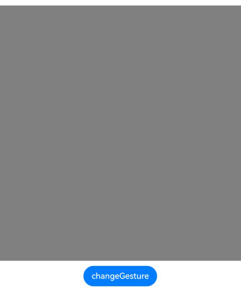

# 动态手势设置

更新时间：2026-04-20 06:34:33

来源：https://developer.huawei.com/consumer/cn/doc/harmonyos-references/ts-universal-attributes-gesture-modifier
**支持设备：** Phone / PC/2in1 / Tablet / Wearable / TV

动态设置组件绑定的手势，支持在属性设置时使用if/else语法。


> [!NOTE]
> 从API version 12开始支持。后续版本如有新增内容，则采用上角标单独标记该内容的起始版本。


## gestureModifier
**支持设备：** Phone / PC/2in1 / Tablet / Wearable / TV

gestureModifier(modifier: GestureModifier): T

动态设置组件绑定的手势。


> [!NOTE]
> gestureModifier不支持自定义组件。
> 该接口不支持在[attributeModifier](https://developer.huawei.com/consumer/cn/doc/harmonyos-references/ts-universal-attributes-attribute-modifier#attributemodifier)中调用。

**元服务API：** 从API version 12开始，该接口支持在元服务中使用。

**系统能力：** SystemCapability.ArkUI.ArkUI.Full

**参数：**


| 参数名 | 类型 | 必填 | 说明 |
| --- | --- | --- | --- |
| modifier | [GestureModifier](#gesturemodifier-1) | 是 | 动态设置当前组件的手势绑定，支持if/else语法。 modifier: 手势修改器，开发者需自定义class实现GestureModifier接口。 |


**返回值：**


| 类型 | 说明 |
| --- | --- |
| T | 返回当前组件。 |


## GestureModifier
**支持设备：** Phone / PC/2in1 / Tablet / Wearable / TV

开发者需要自定义class实现GestureModifier接口。


### applyGesture
**支持设备：** Phone / PC/2in1 / Tablet / Wearable / TV

applyGesture(event: UIGestureEvent): void

手势更新函数。

开发者可根据需要自定义实现该方法，对组件设置需要绑定的手势，支持使用if/else语法进行动态设置。若在当次手势操作过程中触发了组件上的手势动态切换，该切换效果在当次手势结束（所有手指抬起）后的下一次手势操作中生效。

**元服务API：** 从API version 12开始，该接口支持在元服务中使用。

**系统能力：** SystemCapability.ArkUI.ArkUI.Full

**参数**：


| 参数名 | 类型 | 必填 | 说明 |
| --- | --- | --- | --- |
| event | [UIGestureEvent](https://developer.huawei.com/consumer/cn/doc/harmonyos-references/ts-uigestureevent#uigestureevent) | 是 | UIGestureEvent对象，用于设置组件需要绑定的手势。 |


## 示例
**支持设备：** Phone / PC/2in1 / Tablet / Wearable / TV


### 示例1（动态绑定手势）

该示例通过gestureModifier动态设置组件绑定的手势。


```ts
// xxx.ets
class MyButtonModifier implements GestureModifier {
  supportDoubleTap: boolean = true;

  applyGesture(event: UIGestureEvent): void {
    if (this.supportDoubleTap) {
      event.addGesture(
      new TapGestureHandler({
        count: 2,
        fingers: 1,
        // 从API version 23开始，新增distanceThreshold属性
        distanceThreshold: 100
      })
      .tag("aaa")
      .onAction((event: GestureEvent) => {
        console.info('Gesture Info is', JSON.stringify(event));
        console.info('button tap');
      })
      )
    } else {
      event.addGesture(
      new PanGestureHandler()
      .onActionStart(() => {
        console.info('Pan start');
      })
      )
    }
  }
}

@Entry
@Component
struct Index {
  @State modifier: MyButtonModifier = new MyButtonModifier();

  build() {
    Row() {
      Column() {
        Column()
        .gestureModifier(this.modifier)
        .width(500)
        .height(500)
        .backgroundColor(Color.Gray)
        Button('changeGesture')
        .onClick(() => {
          this.modifier.supportDoubleTap = !this.modifier.supportDoubleTap;
        })
        .margin({ top: 10 })
      }
      .width('100%')
    }
    .height('100%')
  }
}
```




### 示例2（动态绑定手势组）

该示例通过gestureModifier动态设置组件绑定的手势组。


```ts
class MyButtonModifier implements GestureModifier {
  isExclusive: boolean = true;

  applyGesture(event: UIGestureEvent): void {
    if (this.isExclusive) {
      // 绑定互斥手势组
      event.addGesture(new GestureGroupHandler({
        mode: GestureMode.Exclusive,
        gestures: [new TapGestureHandler({ count: 2, fingers: 1 }).onAction((event) => {
          console.info('event info is', JSON.stringify(event));
          console.info('ExclusiveGroupGesture TapGesture is called');
      }), new LongPressGestureHandler({ repeat: true, fingers: 1 }).onAction((event) => {
          console.info('event info is', JSON.stringify(event));
          console.info('ExclusiveGroupGesture LongPressGesture is called');
      }), new PanGestureHandler({ fingers: 1 }).onActionStart((event) => {
          console.info('event info is', JSON.stringify(event));
          console.info('ExclusiveGroupGesture PanGesture onActionStart is called');
        }).onActionEnd((event) => {
          console.info('event info is', JSON.stringify(event));
          console.info('ExclusiveGroupGesture PanGesture onActionEnd is called');
        })]
      }))
    } else {
      // 绑定并行手势组
      event.addGesture(new GestureGroupHandler({
        mode: GestureMode.Parallel,
        gestures: [new TapGestureHandler({ count: 2, fingers: 1 }).onAction((event) => {
          console.info('event info is', JSON.stringify(event));
          console.info('ParallelGroupGesture TapGesture is called');
      }), new LongPressGestureHandler({ repeat: true, fingers: 1 }).onAction((event) => {
          console.info('event info is', JSON.stringify(event));
          console.info('ParallelGroupGesture LongPressGesture is called');
      }), new PanGestureHandler({ fingers: 1 }).onActionStart((event) => {
          console.info('event info is', JSON.stringify(event));
          console.info('ParallelGroupGesture PanGesture onActionStart is called');
        }).onActionEnd((event) => {
          console.info('event info is', JSON.stringify(event));
          console.info('ParallelGroupGesture PanGesture onActionEnd is called');
        })]
      }))
    }
  }
}

@Entry
@Component
struct Index {
  @State modifier: MyButtonModifier = new MyButtonModifier();

  build() {
    Row() {
      Column() {
        Column()
        .gestureModifier(this.modifier)
        .width(500)
        .height(500)
        .backgroundColor(Color.Gray)

        Button('changeGestureGroupType')
        .onClick(() => {
          this.modifier.isExclusive = !this.modifier.isExclusive;
        })
        .margin({ top: 10 })
      }
      .width('100%')
    }
    .height('100%')
  }
}
```


